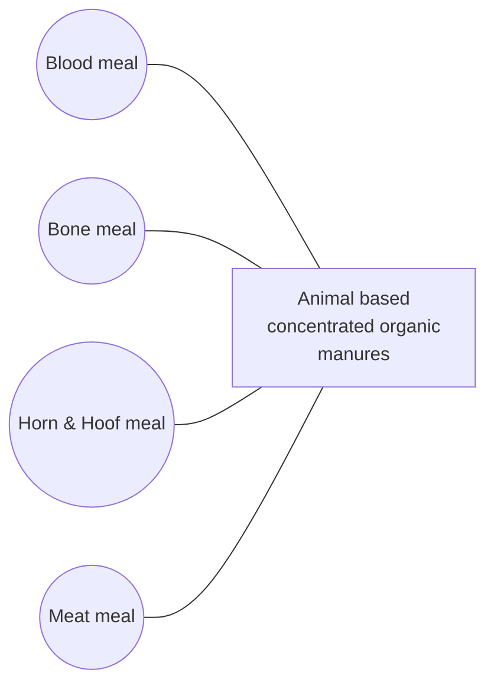

# 1. Introduction

Human civilization has undergone various transformations from "hunting and gathering" to modern-day agriculture. The rapid changes had been experienced depletion of production bases in many fertile grounds, contamination of natural resources and human health risks, necessitating a shift in agriculture's direction in long-term development. With increasing globalization, modern agricultural and food systems, including organic agriculture, are undergoing technological and structural modernization. In comparison to conventional agriculture, organic agriculture is a pioneering endeavour to generate sustainable development based on distinct ideas. Mainstream agriculture is traditional farming that uses fertilizers and insecticides produced by the private sector. The indiscriminate application of fertilizers and plant protection chemicals to boost yield potential and protect crops from insect pests and diseases has undoubtedly doubled or tripled our total food production, allowing us to maintain low costs while increasing food supply. However, it has also created health risks and severely harmed the agroecosystem. Their negative consequences far outweigh the benefits to society. More ecological approaches have been investigated in recent years, and there has been a worldwide shift toward employing eco-friendly technologies for weed control. Today's issue is ensuring not only food security but also food safety. This circumstance has driven us to transition to organic agriculture to grow profitable crops and healthier foods while protecting the environment security.

### Concepts and Definitions of Organic Agriculture

Organic agriculture has been viewed in a variety of ways by different people. According to most of them, Organic agriculture is a method of farming that focuses on ecosystem management rather than external agricultural inputs. This method avoids using synthetic inputs like synthetic fertilizers and pesticides, as well as genetically modified organisms, and adheres to sustainable agriculture principles. According to the Food and Agriculture Organization, organic agriculture is a comprehensive production management method that promotes and improves agroecosystem health, including biodiversity, biological cycles, and soil biological activity. This concept focuses on three strategies: (i) using management approaches, (ii) using off-farm inputs, and (iii) considering regional characteristics that necessitate regionally customized solutions.

Organic farming (OF) is also defined as "an ecologically, economically, and socially responsible agricultural practice that provides an enduring supply of safe and healthy food and fibres with the least possible losses of nutrients and energy, and the least negative environmental impacts, as regulated by certification agencies." Over the last 20 years, the importance of organic farming has risen dramatically worldwide, even in developing countries. Organic farming is guided by the belief that all natural

processes in an agroecosystem are interdependent and that management should strive for and encourage self-regulation through natural processes. As a result, the underlying principle of these definitions is to keep the soil alive by promoting the activity of beneficial microorganisms in the soil.

Soil, air, and water are in a dynamic balance, and they complement and supplement each other to govern ecosystem activities in mutual concord. Chemical fertilizers, herbicides, fungicides, and insecticides are not simply replaced by biologically active formulations and other organic inputs in organic agriculture; instead, it uses comprehensive management techniques to improve soil productivity by enhancing soil health life, and mineral particles. Healthy soil has a diverse population of soil micro fauna and microflora, which accelerates biochemical processes. As a result, soil regeneration capacity improves, making it more resilient to climate variability and agronomic management failures. The following are the primary factors to consider while practicing organic agriculture: (i) keeping a living soil, (ii) ensuring that all required nutrients are available, (iii) organic mulching for conservation, and (iv) achieving a sustainable high yield.

Synthetic insecticides and water-soluble, chemically refined fertilizers are frequently employed in conventional agriculture, while natural inputs are used in organic agriculture (bio-pesticides and bio-fertilizers). As a result, organic agriculture combines ecological science, advanced modern technologies, and traditional agricultural methods based on natural biological processes. Organic farming's goal is to grow crops in such a way that they keep the soil alive and healthy by absorbing organic wastes and bio-fertilizers into the soil and releasing nutrients to the crops for long-term production in an environmentally friendly, pollution-free environment. Crop rotation, green manure incorporation in soil, biological control of diseases and insect pests, and mechanical crop cultivation are the main rules of organic agriculture. Crop rotations renew the soil and confound pests, legume crops in rotation fix atmospheric-free nitrogen in the soil, and mulches in the crops are utilized to maintain soil moisture and control diseases and weeds, all of which contribute to increased crop yield.

Compared to CF, OF systems have: (i) more plant diversity in time and space; (ii) more rotations and cover cropping, resulting in higher soil organic matter content; (iii) more biomass, diversity, and activity of soil microorganisms and fauna; (iv) improved water holding capacity, reduced run-off, and increased rooting depth, resulting in improved water use efficiency; (v) improved cation exchange capacity, increased internal cycling, and reduced loss of nutrients. Variances in the occurrence and intensity of weed, plant diseases and pests have emerged from these inherent differences between OF and CF systems.

As ecosystem stability is the key to organic agriculture, in this bulletin, we will describe the various weed and nutrition management options in OF that can be used by farmers and researchers who strive for greater ecological sustainability.

# 2. Weed management in organic agriculture

Since the dawn of agriculture, farmers have fought against the presence of weeds in their fields. Weeds are a significant issue because they reduce crop yields by increasing competition for water, sunshine, and nutrients and serving as host plants for pests and diseases. Farmers have used herbicides to remove weeds from their crops since their creation. Herbicides not only enhanced agricultural yields but also lowered the time it took to get rid of weeds. Since the widespread usage of agrochemicals has allegedly resulted in various environmental and health problems, some farmers are rekindling their interest in organic weed management approaches. Herbicide use has also been reported to cause some weed species to take over fields in some situations because the weeds acquire herbicide resistance. Furthermore, some herbicides can kill weeds that are not harmful to crops, resulting in biodiversity loss for farmers. It is critical to remember that weeds will never be eradicated, only managed under an organic seed control system.

Wide diversity of weed control tools mare been utilized by the organic growers that can be roughly grouped into the following categories:

*   Tillage tools and implements
*   Cultivation tools and implements
*   Movers and other cutting tools
*   Flame weeders and other thermal weed controls
*   Mulches and mulch application tools
*   Herbicides allowed in organic production

Besides these, cover crops, diversified crop rotations and optimum crop management are vital tools for preventive or cultural weed management. In an organic agriculture system, weeds can be managed by integrating the following operations:

## 2.1. Cultural weed management

According to prevailing effects, cultural practices which can be applied for integrated weed management under organic farming can be classified as follows:

Table 1. Cultural practices potentially apply in an integrated weed management system for organic farming

<table>
  <tbody>
    <tr>
        <td>Cultural practice</td>
        <td>Prevailing effect</td>
        <td>Example</td>
    </tr>
    <tr>
        <th>Crop rotation</th>
        <th>Reduction in weed emergence</th>
        <th>Alternation between winter and spring-summer crops</th>
    </tr>
    <tr>
        <th>Primary tillage</th>
        <th>Reduction in weed emergence</th>
        <th>Deep ploughing, alternation between ploughing and reduced tillage</th>
    </tr>
    <tr>
        <th>Seedbed preparation</th>
        <th>Reduction in weed emergence</th>
        <th>False/stale-seedbed technique</th>
    </tr>
  </tbody>
</table>

<table>
  <tbody>
    <tr>
        <td>Cultural practice</td>
        <td>Prevailing effect</td>
        <td>Example</td>
    </tr>
    <tr>
        <th>Cultivation</th>
        <th>Reduction in weed emergence</th>
        <th>Post-emergence harrowing or hoeing, ridging</th>
    </tr>
    <tr>
        <th>Cover crops</th>
        <th>Reduction in weed emergence</th>
        <th>Cover crop is grown in between two cash crops and used as green manure or dead mulch</th>
    </tr>
    <tr>
        <th>Intercropping</th>
        <th>Reduction in weed emergence, improvement in competitive crop ability</th>
        <th>Cover crops used as a living mulch intercropped cash crops (Cowpea in *Sorghum*)</th>
    </tr>
    <tr>
        <th>Thermal weed control</th>
        <th>Reduction in weed emergence</th>
        <th>Pre-emergence or localized post-emergence flame weeding</th>
    </tr>
    <tr>
        <th>Mulching/soil solarisation</th>
        <th>Reduction in weed emergence</th>
        <th>Use of black or transparent films (in glass house or field)</th>
    </tr>
    <tr>
        <th>Crop genotype</th>
        <th>Improvement in competitive crop ability</th>
        <th>Use of cultivars characterized by quick emergence, high growth and soil cover rates in early stages</th>
    </tr>
    <tr>
        <th>Sowing/planting</th>
        <th>Improvement in competitive crop ability</th>
        <th>Use of transplants, higher seeding rate; lower inter-row distance; anticipation of or delay in sowing/transplant date</th>
    </tr>
    <tr>
        <th>Fertilization</th>
        <th>Reduction in weed emergence, improvement in competitive crop ability</th>
        <th>Use of slow nutrient-releasing organic fertilizers and amendments; fertilizer placement</th>
    </tr>
    <tr>
        <th>Irrigation</th>
        <th>Reduction in weed emergence, improvement in competitive crop ability</th>
        <th>Irrigation placement (micro/trickle-irrigation)</th>
    </tr>
  </tbody>
</table>

### 2.1.1. Crop rotation

Crop rotation is systematically planting and harvesting different crops on the same land. It is an integrated approach for putting together a long-term weed control plan. Weeds thrive in crops with similar growth requirements to their own, and cultural activities intended to help the crop may also help the weeds grow and develop. Monoculture, or growing the same crop in the same field year after year, leads to developing weed species adapted to the crop's growing environment. Variations in cultural practices connected with each crop disturb weed germination and growth cycles when varied crops are utilised in a rotation (tillage, planting dates, crop competition, etc.).

Crop selection within a rotation affects a grower's current and potential future weed problems. Crop selection is made more difficult for organic growers by the requirement to assess soil fertility levels throughout the cropping sequence and incorporate fertility-building times in the rotation. Differences can also influence weed control in crop and weed responses to soil nitrogen levels. Perennial weeds are known to be reduced when a fallow phase is included in the rotation. Legumes and grasses should be

alternated, as should spring and fall planted crops, row crops and close planted crops, and heavy feeders and light feeders.

Table 2. Principles guiding crop rotation in organic farming systems

<table>
  <tbody>
    <tr>
        <td>Recommendation</td>
        <td>Relationship to seed bank management</td>
    </tr>
    <tr>
        <th>Include clean fallow periods in the rotation to deplete perennial roots and rhizomes and to flush out and destroy annual weeds</th>
        <th>Soil disturbance to stimulate germination losses</th>
    </tr>
    <tr>
        <th>Follow weed-prone crops with crops in which weeds can easily be prevented from going to seed.</th>
        <th>Pre-empt weed seed rain</th>
    </tr>
    <tr>
        <th>Plant crop in which weed seed production can be prevented before crops that are poor competitors</th>
        <th>Pre-empt weed seed rain</th>
    </tr>
    <tr>
        <th>Rotate between crops that are planted in different seasons</th>
        <th>Avoid particular groups of species; prevent weed seed rain; accumulate one year of cumulative seed bank losses</th>
    </tr>
    <tr>
        <th>Work cover crops into the rotation between cash crops at times when the soil would otherwise be bare</th>
        <th>Disturbance stimulates germination losses; termination of cover crops can pre-empt weed seed rain; cover crop competition and mowing can reduce weed seed rain</th>
    </tr>
    <tr>
        <th>Avoid cover crop species and cover crop; management that promotes weeds</th>
        <th>Pre-empt weed seed rain</th>
    </tr>
    <tr>
        <th>Rotate between annual crops and perennial sod crops</th>
        <th>Avoid particular groups of species; prevent weed seed rain; accumulate one or more years of cumulative seed bank losses</th>
    </tr>
  </tbody>
</table>

### 2.1.2. Cover crops

Weeds can be suppressed by the crop's rapid growth and dense ground coverage. Cover crops like rye, red clover, buckwheat, and oilseed radish, as well as overwintering crops like winter wheat or forages, can help to control weed development. Highly competitive crops can be produced as 'smother' crops in the rotation for a short time. Furthermore, weeds are suppressed by cover crop leftovers on the soil surface, which shade and cool the soil. When selecting a cover crop, it is important to think about how the cover crop will affect the next crop. Furthermore, decomposing cover crop leftovers may emit allelo compounds, which prevent weed seeds from germinating and developing.

Cover crops are used to reduce weeds in a variety of ways. Weed suppression by cover crops relies on several parameters, and certain cover crops provide selective weed control. As a result, cover crops such as cereals, legumes, and brassicaceae are widely used in various cropping systems. Competition and allelopathy have been proposed as cover crop weed control mechanisms. The physical impacts of a cover crop on weeds are a key mode of action. The majority of research on the effects of cover crops on weeds focuses on the amount of accumulated cover crop biomass. A cover crop that produces a lot of biomasses is more likely to have a favourable physical effect on weeds, resulting in

effective weed control. Cover crops that accumulate total biomass early in the season lower the probability of weed emergence.

Table 3. A list of important cover crops that can be used for weed management

<table>
  <tbody>
    <tr>
        <td>Cover Crop Type</td>
        <td>Name of Cover Crop</td>
    </tr>
    <tr>
        <td rowspan="5">Cereals</td>
        <td>Bristle oat (*Avena strigosa*)</td>
    </tr>
    <tr>
        <td>Winter rye (*Secale cereale*)</td>
    </tr>
    <tr>
        <td>Oat (*Avena sativa*)</td>
    </tr>
    <tr>
        <td>Sudangrass (*Sorghum X sudanense*)</td>
    </tr>
    <tr>
        <td>Wheat (*Triticum aestivum*)</td>
    </tr>
    <tr>
        <td rowspan="12">Legumes</td>
        <td>Pea (*Pisum sativum*)</td>
    </tr>
    <tr>
        <td>Cowpea (*Vigna unguiculata*)</td>
    </tr>
    <tr>
        <td>Subterranean clover (*Trifolium subterraneum*)</td>
    </tr>
    <tr>
        <td>Crimson clover (*Trifolium incarnatum*)</td>
    </tr>
    <tr>
        <td>Egyptian clover (*Trifolium alexandrinum*)</td>
    </tr>
    <tr>
        <td>Red clover (*Trifolium pratense*)</td>
    </tr>
    <tr>
        <td>Sunn hemp (*Crotalaria juncea*)</td>
    </tr>
    <tr>
        <td>Velvet bean (*Mucuna pruriens*)</td>
    </tr>
    <tr>
        <td>Soybean (*Glycine max*)</td>
    </tr>
    <tr>
        <td>Faba bean (*Vicia faba*) ]</td>
    </tr>
    <tr>
        <td>Hairy vetch (*Vicia villosa*)</td>
    </tr>
    <tr>
        <td>Common vetch (*Vicia sativa*)</td>
    </tr>
    <tr>
        <td rowspan="3">Brassicaceae plant</td>
        <td>Forage radish (*Raphanus sativus*)</td>
    </tr>
    <tr>
        <td>Rapeseed, canola (*Brassica napus*)</td>
    </tr>
    <tr>
        <td>White mustard (*Sinapis alba*)</td>
    </tr>
    <tr>
        <td rowspan="3">Non-legumes</td>
        <td>Buckwheat (*Fagopyrum esculentum*)</td>
    </tr>
    <tr>
        <td>Flax (*Linum usitatissimum*)</td>
    </tr>
    <tr>
        <td>Niger (*Guizotia abyssinica*)</td>
    </tr>
  </tbody>
</table>

Table 4. Cover crops with an allelopathic potential and the weeds suppressed by cover crops

<table>
  <tbody>
    <tr>
        <td>Cover Crop</td>
        <td>Weeds Suppressed</td>
    </tr>
    <tr>
        <th>Wheat (*Triticum aestivum*)</th>
        <th>*Ipomoea lacunose* (White morning glory), *Eleusine indica* (Indian goose grass), *Amaranthus palmeri* (Careless weed)</th>
    </tr>
    <tr>
        <th>Rye (*Secale cereale*)</th>
        <th>*Eleusine indica*, *Amaranthus palmeri*, *Ipomoea lacunosa*</th>
    </tr>
    <tr>
        <th>Rye (*Secale cereale*)</th>
        <th>*Chenopodium album* (Bathua), *Abutilon theophrasti* (Indian Mallow)</th>
    </tr>
    <tr>
        <th>Annual ryegrass (*Lolium multiflorum*), rye (*Secale cereale*), bristle oat (*Avena strigosa*), common vetch (*Vicia sativa*), radish</th>
        <th>*Brachiaria plantaginea* (Marmalade grass), *Bidens pilosa* (Cobbler's peg), *Euphorbia heterophylla* (Fire plant)</th>
    </tr>
    <tr>
        <th>Hairy vetch (*Vicia villosa*), oat (*Avena sativa*)</th>
        <th>*Digitaria sanguinalis* (Crab grass), *Eleusine indica* (Indian goose grass), *Amaranthus retroflexus* (Red root amaranth), *Datura stramonium* (Shorn apple)</th>
    </tr>
    <tr>
        <th>Sorghum sudangrass (*Sorghum bicolor* X *Sorghum sudanense*)</th>
        <th>Broad-leaved weeds</th>
    </tr>
    <tr>
        <th>Bristle oat (*Avena strigosa*), hairy vetch (*Vicia villosa*)</th>
        <th>*Amaranthus palmeri* (Careless weed), *Portulaca oleracea* (Little hog weed), *Helianthus annuus* (Common sunflower)</th>
    </tr>
    <tr>
        <th>Rye (*Secale cereale*), hairy vetch (*Vicia villosa*), barley (*H. vulgare*) X triticale, Austrian winter pea (*Pisum sativum*)</th>
        <th>*Chenopodium album* (Bathua), *Amaranthus hybridus* (Green pigweed), *Thlaspi arvense* (Field pennycress), *Taraxacum officinale* (Dandelion), *Stellaria media* (Chick weed), *Elymus repens* (Quack grass), *Panicum crus-galli* (Cockspur grass), *Setaria glauca* (Wild millet / Green foxtail)</th>
    </tr>
    <tr>
        <th>White mustard (*Sinapis alba*)</th>
        <th>*Amaranthus blitoides* (Prostrate pigweed), *Chenopodium album* (Bathua)</th>
    </tr>
    <tr>
        <th>Hairy vetch (*Vicia villosa*), subterranean clover (*Trifolium subterraneum*), oat (*Avena sativa*)/hairy vetch (*Vicia villosa*)</th>
        <th>*Amaranthus retroflexus* (Red root amaranth), *Chenopodium album* (Bathua)</th>
    </tr>
  </tbody>
</table>

### 2.1.3. Intercropping

Intercropping is another option offered to organic farmers for enhancing crop competitiveness against weeds. Growing a smother crop between rows of the main crop is known as intercropping. Intercrops are found helpful in suppressing weeds. However, intercropping as a weed management tactic should be treated with caution. The intercrops can drastically affect the main crop's yields if there is competition for water or nutrients. Intercrops, like cover crops, promote agricultural ecological

diversity and, by increasing the canopy's consumption of natural resources relative to mono-crops, typically deprive weeds of the light, water, and nutrients they need to grow.

In addition, compared to the sum of the yields from sole crops, the intercrop produced a 10% increase in yield. In cereal: legume intercrops including winter wheat: faba bean (*Vicia faba* L.), winter wheat: pea, and wheat: field beans, weed suppression and crop production rise. It is well understood that, like living mulches, the success of intercropping depends on meeting the component species' natural resource requirements (e.g., light interception and soil layers investigated by crop root systems) in order to promote resource use complementarity and decrease interspecific competition. In reality, this entails maximizing the spatial arrangement of species and their relative plant densities and growth rates throughout time.

The image illustrates a Cereal-Legume intercropping system showing the interaction between cereal plants (like wheat) and legume plants.

*   **Rooting zone of cereals**: Indicated as the shallower root layer.
*   **Rooting zone of legumes**: Indicated as the deeper root layer.
*   **Rhizosphere stimulation**: Red arrow pointing to the root zone, noting (microbial abundance, diversity and activity and enzymatic changes).
*   **Increased legumes N2 fixing activity**: Red arrow pointing to the legume roots.
*   **Complementarity for soil resources acquisition of P, Fe, Zn**: Red arrow pointing to the shared root environment.

**Cereal-Legume intercropping**

### 2.1.4. Mulching

Mulching, or covering the soil with plant residues/wastes or synthetic materials, is one of the most prevalent management approaches for reducing weed menace, either by limiting weed seed germination or inhibiting emerging seedlings' growth. It also encourages water and biodiversity management that is sustainable. Mulching also has the added benefit of reducing temperature variations and improving the soil's physical, chemical, and biological qualities. Mulching or covering the soil surface can prevent weed seed development by limiting light transmission. Allelopathic chemicals in the mulch can potentially suppress seedling emergence.

Mulches can be found in various forms, including natural mulches like straw, sawdust, weeds, paper, and plant leftovers and synthetic mulches like plastic. Three of the most prevalent are as follows.

#### (a) Living mulch

The terms "cover crops" and "living mulch" are synonymous. Clover is a typical example of living mulch since it grows densely and low to the ground. Living mulches can be planted before or after a crop is established. Living mulch must be managed carefully, so it does not compete with the actual crop. The primary goal of living mulch is usually to improve soil structure, aid fertility, or reduce pest problems, with weed control being a bonus.

<table>
    <tr>
        <td>The image shows a field of tall corn crops with a dense green ground cover of living mulch growing between the rows.</td>
        <td>The image shows a field where young plants are emerging through a thick layer of dry, brown organic mulch (straw or hay) covering the soil.</td>
    </tr>
    <tr>
        <td>**Living Mulch**</td>
        <td>**Organic Mulch**</td>
    </tr>
</table>#### (b) Organic mulches

Weed management can be achieved with straw, bark, and composted material. Because the expense of purchased mulches can be prohibitive, depending on the amount needed to reduce weed emergence, it is recommended that the material be produced on the farm. An effective but labour-intensive system uses newspaper and straw. The ground is covered with two layers of newspaper, followed by hay covering. It is critical to ensure that the hay is free of weed seeds. Biodegradability is an advantage of organic mulches.

### (c) Plastic mulches

Weed control materials like black polyethylene have been employed in organic production methods for a variety of crops. Plastic mulches that block photosynthetically active radiation but allow infrared light to warm the soil have been produced. Weed management has been demonstrated using these infrared transmitting mulches. Plastic mulches can be employed in various agricultural production systems, including horticultural crops (e.g., strawberry, tomato, eggplant, muskmelon, watermelon, etc.). Mulching is usually more effective against annual weeds rather than perennial weeds.

The image shows a field of crops planted in rows. The plants are growing through holes in a white plastic mulch covering the soil beds. The rows extend into the distance under a clear sky.

Plastic Mulch

### 2.1.5. Increasing crop competitiveness

Organic farmers may give their market crops a significant advantage on weeds by selecting the correct cultivar and planting it to ensure vigorous growth that outcompetes weeds for light, moisture, and nutrients in the soil.

#### (a) Crop cultivar selection

The ability of crop cultivars to compete with and adapt to weeds varies. For instance, the physical structure of a cultivar can improve its ability to compete with weeds. Taller grain crops, for example, are more competitive with weeds because they intercept light. A cultivar's competitive powers can also be aided by a large leaf area and more biomass production.

### (b) Planting strategies: date and density

Rapid growth and early canopy closure can reduce weeds in various row and horticultural crops. As a result, it is employing transplants for horticultural crop development wherever possible is desirable. The expense of transplants will increase production costs, so the economic advantage must be balanced against the cost. It should be considered when using transplants as economically viable, as it is with many vegetable crops.

According to research, a crop's planting date, density, and spatial arrangement can maximize the space it occupies early in the season and put weeds under competitive pressure.

* **Planting Date**

The best time to sow a crop varies yearly, depending on weather and soil conditions. Although these considerations must be considered when deciding the planting date, planting can be scheduled to avoid competition from potentially harmful weed populations. It may be necessary to sow or transplant a cash crop early to achieve canopy closure as soon as feasible.

On the other hand, some farmers believe that planting later in the specified planting window makes sense from a weed management standpoint. Later planting allows for one or two weed pre-cultivations and gives the cash crop a head start due to warmer soils.

* **Crop Density**

Many studies have shown that increasing crop density reduces weed competition; however, this method has several drawbacks. First, when crop density grows, lodging and disease may become more prevalent in particular crops. Second, increasing crop density may impact particular crops' marketability. Farmers should weigh the benefits of reduced weed competition against any potential consequences for production. This method works well for seed crops (like maize and wheat) but not for most fruiting crops, where higher plant density reduces fruit size. For row crops, a higher plant density helps mitigate losses from mechanical injury from cultivation.

### (c) Crop Health and Vigour

Crops that are healthy and vigorous compete better with weeds for resources like light, water, and nutrients. Some crops are naturally better competitors than others, but farmers who apply appropriate nutrients and water to seedlings and transplants will assist their crops in withstanding weed competition. Successful weed control necessitates careful soil fertility management. Careless placement or over-application of nutrients, particularly nitrogen, might unintentionally boost weed populations.

### 2.1.6. Judicious use of fertilizers

The competition between crops and weeds and succeeding crops can be influenced by application of nitrogen fertilizer. In some weed species, for example, nitrate has been shown to boost seed germination and seed production. Nitrogen fertilization may promote weed development rather than boost crop output. Nitrogen placed selectively in a band can favour the crop over the weed. Weed suppression can be improved by using legume leftovers instead of chemical nitrogen fertilizer to fulfill the crop's nitrogen needs. Legume residues release nitrogen slowly, reducing the growth of undesirable weeds.

Avoiding pre-plant spreading of soluble nutrients, which fast-growing weeds than slow-growing crops may more readily absorb and may even encourage weed germination. Fertilizer should be applied near the rows, where it is more likely to be absorbed by the crop. Low amounts of expensive bagged organic fertilizer can be used at planting or as a sidedress, relying on the mid-season release of nutrients from the compost and green manures for primary fertility.

### 2.1.7. Stale seedbed preparation

Preparing a fine seedbed, enabling weeds to grow (relying on rainfall or irrigation for necessary soil moisture), and eliminating weed seedlings directly via light cultivation or flame weeding are all part of this weed management method. Afterward, seedlings or transplants can be planted in the weed-free, wet soil. This can be done twice before planting if time allows. This strategy allows for crop emergence and growth before the following weed flush.

### 2.1.8. Tillage management

Tillage systems change the dynamics of the soil seed bank and the depth to which weed seeds are buried. According to studies, about 75% of the seed bank was concentrated in the top 5 cm of soil in no-till farms. The seed bank is more equally spread over depth with the mouldboard plough system. Other conservation tillage systems fall in between these two. Weed seedling emergence is often more uniform than weed seedling emergence from shallowly buried weed seeds, which may lead to better weed control. Insects, mammals, other predators, and disease-causing organisms are more likely to eat or destroy weed seeds closer to the soil.

### 2.1.9. Buried drip irrigation

Drip tape buried beneath the planting bed's surface can deliver hydration to the crop while limiting the quantity of moisture available to weeds near the surface. This strategy, if correctly maintained, can provide significant weed control throughout the dry season.

### 2.1.10. Sanitation

Crop performance depends on the use of clean, high-quality seeds. It is possible to avoid the introduction of numerous new weeds onto the farm as well as the production of significant amounts of seed by existing weeds. Weed seeds and problematic weed species can be considerably reduced by using clean seed, cutting weeds around the boundaries of fields or after harvest to prevent weeds from going to seed, and utterly decomposing manure before application. It is even possible to hand-eradicate localized outbreaks of new weeds, successfully preventing infestations in the future. Other sanitation considerations include complete cleaning of any machinery that may have been used in weedy fields, as well as the planting of hedgerows to reduce windblown seeds.

The image shows a field with rows of crops, likely maize, where a deep trench has been dug in the soil. Inside the trench, a black irrigation pipe is visible, demonstrating the installation of a subsurface irrigation system.

**Buried drip irrigation**

## 2.2. Mechanical weed management

Mechanical weed removal is time and labour-intensive, yet it is the most effective form of weed control. It entails either destroying newly emerged weeds or burying newly shed seeds below the depth at which they germinate. Mechanical weed seedling management includes burial to a depth of 1 cm and cutting at the soil surface. It is crucial to remember that any ecological weed management strategy starts and ends with the soil seed bank. The soil seed bank is a storage facility for weed seeds found in the soil. A farmer can make realistic weed control decisions by considering the seed bank composition.

Cultivating equipment like hoes, harrows, tines, brush weeders, cutting tools like mowers, and dual-purpose devices like thistle bars are all mechanical weeders. The crop and weed morphology

determine the type of implement, timing and frequency with which it is used. Fixed harrows are better for arable crops, but inter-row brush weeders are more effective for horticultural applications. Carrots, beets, onions, garlic, celery, and leeks are among the vegetables for which the brush weeder is most commonly. The crop's competitive ability and the weeds' growth stage impact the best time for mechanical weed management.

After the seed germinates, shallow between-row cultivators such as basket weeders, beet hoes, or small sharp sweeps are used to chop off and uproot small weeds. Rolling cultivates (e.g., Lilliston), spyder wheels (e.g., Bezzerides), large sweeps, or hilling discs can get very close to the crop when it is small without moving much soil into the row and may be the only tools used on delicate crops like leafy greens. As vigorous crops grow, soil can be thrown into the row to bury in-row weeds using rolling cultivates (e.g., Lilliston), spyder wheels (When the plants are tiny, some of these instruments can be angled to remove soil away from the row, then turned around to throw soil back on the row with subsequent cultivators. When rouging an individual plant or weed patch is the most effective technique for preventing the weed from spreading, hand hoes, push hoes, and hand weeding are still utilized. Hand-weeding might be used to cope with weeds left in the crop row after mechanical inter-row weeding.

## 2.3. Thermal weed management

### 2.3.1. Flamers

Flamers are effective weed killers. The employment of flaming equipment to create direct contact between the flame and the plant is known as thermal weed control. This method works by rupturing plant cells when the sap within them swells rapidly. The weeds are sometimes burned down completely to achieve thermal management. Flaming can be employed before or after crop emergence to give the crop a competitive advantage. However, blazing at this point in the crop's life cycle could harm it. Despite the high initial equipment cost, flame for weed management may be less expensive than hand weeding.

The image shows two examples of weed management using flamers. On the left, a person is using a handheld propane torch to flame weeds in a garden row. On the right, a large tractor-mounted flaming implement with multiple burners is being used to treat several rows of a field simultaneously.

Weed management by Flamers

The most prevalent flamer models are propane-fueled. Flaming does not burn weeds to ashes; instead, the flame rapidly elevates the temperature of the weeds to over 130 degrees Fahrenheit. The abrupt rise in temperature causes the plant's cell sap to expand, causing the cell walls to rupture. Weeds must have less than two true leaves for maximum burning efficiency. Because the growing point is sheltered beneath, fire is impossible to kill grasses. Weeds killed by flame quickly alter their appearance from shiny to dull. Flame weeders can be utilized when the soil is too wet for mechanical weeding and there is no soil disturbance to induce further weed emergence.

Windless conditions yield the best results, as winds might prevent heat from reaching the target weeds. Flame efficiency is considerably reduced if there is moisture on the plants from dew or rain. The optimum times to monitor the flame patterns and modify the apparatus are early morning and evening.

### 2.3.2. Infrared weeders

To eliminate weeds, some weeders utilize a combination of infrared and direct flame. Infrared weeders are a type of flame weeder in which the burners heat ceramic or metal surfaces to produce infrared radiation that is aimed at the target weeds. Flame weeders are generally more effective because they provide higher temperatures, but burner height and plant stage are also key considerations. Infrared weeders cover a smaller area than traditional flame weeders, but they may take longer to heat up.

### 2.3.3. Freezing

Only where there is a clear fire risk from igniting would Freezing be advantageous. Weeds can be frozen with liquid nitrogen or solid carbon dioxide (dry ice).

Various weed control test methods involving electrocution, microwaves, and irradiation have also been studied, but high energy inputs, poor work rates, and operator safety concerns have slowed progress. Lasers have been demonstrated to slow some weeds' growth but not totally eliminate them. The use of ultraviolet light to manage weeds has been patented, but it is still in the experimental stage.

### 2.3.4. Soil solarization

Soil solarization is an environmentally friendly and cost-effective method of weed management that utilizes the sun's heat. It is compatible with organic and integrated crop management methods. This approach involves covering the soil surface with a cover, such as black or transparent plastic to trap solar energy and encourage an increase in soil temperature. For 4 to 12 weeks, the plastic cover must remain on the soil surface. To succeed in weed management, the soil must be kept moist during that period, especially under drip irrigation for large areas, and powerful radiation must be applied throughout the day. Due to the occurrence of high air temperatures in the summer and increased exposure to high-energy electromagnetic radiation, this mechanism is particularly appropriate to the Mediterranean environment and similar climates. Soil solarization enables farmers to keep soil temperatures high enough to kill weed seeds, plants, insects, and plant infections, including nematodes and fungal diseases. Solarization is typically used on vegetable and minor crops grown in greenhouses (e.g., tomato, radish, lettuce, cole crops, cucumber, and pepper); however, it is also helpful in open fields.

The image shows a wide agricultural field with long, straight rows of soil. Many of the rows are covered with white plastic sheeting for soil solarization, while some areas show the dark, tilled earth. The field extends toward the horizon under a clear sky.

# Soil Solarization

According to studies, solarization with transparent or black plastic from July to October gives weed control comparable to methyl bromide spraying. Heat and moisture, as well as direct contact with the plastic, induce scorching, which kills weed seeds and early plants. Solarization can also be utilized in warm areas to produce weed-free soil or potting mix for container cultivation. Solarization is more effective against annual weeds and less effective against perennial weeds in general. The amount of weed suppression achieved by solarization varies depending on the weed species, seed depth and solarization length.

Solarization can be done on raised beds with a typical bed layer to lay the plastic down or on a flat field. When solarizing raised beds, the plastic can be left in place and cash crops can be planted through it once the solarization is finished. Farmers should follow these methods to implement solarization successfully:

*   Soil must be finely tilled, and the plastic tarp must fit tightly over the soil.
*   Plastic should be thick from 0.03 to 0.08 inches (0.75 to 2 millimeters) and should have an ultraviolet inhibitor added to prevent degradation.
*   Solarization must be performed during the summer months due to the temperatures required for effective soil treatment.
*   The recommended soil temperatures for solarization are 140°F at a depth of 2 inches and 102°F at a depth of 18 inches.

### 2.4. Biological weed management

In organic agriculture, biological management appears to be the natural option for weed control. In biological methods of weed management, bioagents such as insects, pathogens etc. and other animals are used to control the weeds. Insects and pathogens infest weeds and either they kill weeds or reduce weeds' growth. All in all, biological methods can effectively reduce the weeds' population but are not enough for eradication of weeds. Biological approaches for weed management involves following methods:

#### 2.4.1. Livestock Grazing

A simple and underutilized option for weed control is quickly showing to be quite effective: livestock grazing. One of the main components in successfully tackling weed problems is including grazing management into weed management strategies. Furthermore, pairing cattle with trees and shrubs in agroforestry systems, for example, gives various benefits, including biodiversity protection and better soil fertility. Weed control using livestock grazing seeks to influence defoliation patterns to put a target plant at a disadvantage compared to other plants in the community. Targeted grazing's efficacy and conservation advantages depend on the grazing species' time, length, and intensity. In most cases, grazing does not eliminate an established weed infestation.

Grazing animals must be confined into or off an area to control grazing pressure for effective weed management. Weed control frequently hinges on the capacity to concentrate stock on weed infestations at certain phases of growth or times of the year while keeping them off pasture or weeds at other times. Ruminants, such as cattle, sheep, and goats, are the most popular animals employed for weed eradication. Combining ruminant grazing with other weed control methods can result in a cost-effective integrated approach. Sheep, in particular, is an excellent tool for weed control. Farmers are increasingly considering grazing sheep as a viable alternative to herbicides, tillage, and mowing for controlling weeds and cover crops.

#### 2.4.2. Allelopathy

Allelopathy is the chemical effect of one plant on the germination, growth, or development of nearby plants, either directly or indirectly. It is now widely accepted as part of biological control. This capacity can be seen in both crop and weed species. Barley, rye, annual ryegrass, buckwheat, oats, sorghum, sudan sorghum hybrids, alfalfa, wheat, red clover, and sunflower are all allelopathic crops. Allelopathic compounds are released from the roots of vegetables such as horseradish, carrot, and radish. Allelochemicals and other natural compounds, as well as their derivatives, have been suggested as potential bio-herbicides.

Both alfalfa and oats have alleopathy, which prevents weeds from choking the planting in the first year. The allelopathic effect can be beneficial when oats are sown with a new alfalfa crop. Buckwheat is also noted for its exceptional weed-suppressing properties. Buckwheat can be planted on weed-infested fields to help clean them up. Some farmers just let the buckwheat grow for six weeks before ploughing it down. This kills and suppresses weeds, releases phosphate, and improves soil conditions.

Table 5. Allelochemicals reported in various cover crops

<table>
  <tbody>
    <tr>
        <td>Cover Crop</td>
        <td>Allelochemicals</td>
    </tr>
    <tr>
        <th>Rye (*Secale cereale*)</th>
        <th>MBOA, BOA, HMBOA, DIBOA</th>
    </tr>
    <tr>
        <th>Barley (*Hordeum vulgare*)</th>
        <th>Gramine, hordenine, p-hydroxybenzoic acid, vanillic acid, p-coumaric acid, syringic acid, ferulic acid</th>
    </tr>
    <tr>
        <th>Sorghum (*Sorghum bicolor*)</th>
        <th>Sorgoleone, m-coumaric acid, caffeic acid, chlorogenic acid</th>
    </tr>
    <tr>
        <th>Wheat (*Triticum aestivum*)</th>
        <th>DIMBOA, 2,4-Dihydroxy-1,4-benzoxazine 3-one (DIBOA), syringic acid, vanillic acid, p hydroxybenzoic acid, cis-ferulic acid, trans-ferulic acid, trans-p-coumaric acid, cis-p-coumaric acid</th>
    </tr>
    <tr>
        <th>Field mustard (*Brassica rapa*)</th>
        <th>2-Phenylethyl-isothiocyanate</th>
    </tr>
    <tr>
        <th>Rapeseed (*Brassica napus*)</th>
        <th>Glucosinolates, 2-Phenylethyl isothiocyanate, benzyl isothiocyanate, allyl isothiocyanate, 3-butenyl isothiocyanate</th>
    </tr>
    <tr>
        <th>Field mustard (*Brassica campestris*)</th>
        <th>Benzyl isothiocyanate, allyl isothiocyanate, 3-butenyl isothiocyanate</th>
    </tr>
  </tbody>
</table>

### 2.4.3. Beneficial organisms

Weeds, like crops, are susceptible to disease and insect infestations. There has been little investigation into employing predatory or parasitic microorganisms or insects to control weed populations. However, in the future, this could be a beneficial management tool. A weevil for the aquatic weed salvinia, a rust for skeleton weed, and, perhaps most famously, a caterpillar (*Cactoblastis* sp.) for prickly pear control have all been successful so far. A lot of research is going towards genetically modified fungi (myco-herbicides) and bacteria to make them more successful at eradicating specific weeds. Myco-herbicides are spore-containing preparations that are sprayed using standard herbicide application equipment. The majority of weed biological control happens in range or non-crop regions.

Birds have enough potential to become a good weed management tool. For instance, geese have been used to manage weeds in trees, vines, and some row crops. Although most geese will graze weeds, Chinese weeder geese are recommended for row crops. Chinese weeder geese are smaller than other types and prefer to wander around rather than over sensitive crop plants. Geese love grasses and only consume crops on rare occasions. Geese will even dig up and devour Johnson grass and Bermuda grass rhizomes if they are contained. Because geese love grass crops like corn, sorghum, and tiny grains, it is important to avoid putting them near them. Fruiting vegetables, such as tomatoes may also be vulnerable. Water, shade, and protection from dogs and other predators are all necessities for geese.

Table 6. Use of biocontrol agents for weed control

<table>
  <tbody>
    <tr>
        <td>Name of the weed</td>
        <td>Bioagent</td>
    </tr>
    <tr>
        <th>Cyperus rotundus</th>
        <th>Bactra verutana</th>
    </tr>
    <tr>
        <th>Ludwigia parviflora</th>
        <th>Haltica cynea (Steel blue beetle)</th>
    </tr>
    <tr>
        <th>Parthenism hysterophorus</th>
        <th>Zygogramma bicolaraia</th>
    </tr>
    <tr>
        <th>Lantana camara</th>
        <th>Crocidosema lantana, Teleonnemia scrupulosa</th>
    </tr>
  </tbody>
</table>

<table>
  <thead>
    <tr>
        <th>Name of the weed</th>
        <th>Bioagent</th>
    </tr>
  </thead>
  <tbody>
    <tr>
        <td>Opuntia dilleni</td>
        <td>Dactylopius tomentosus, D. Indicus (cochineal scale insect)</td>
    </tr>
    <tr>
        <td>Eichhornea crassipes</td>
        <td>Neochetina eichhornea, N. Bruchi (Hyacinth weevil) Sameodes alliguttalis (hyancinth moth)</td>
    </tr>
    <tr>
        <td>Salvinia molesta</td>
        <td>Crytobagus singularis (weevil) Paulinia acuminate (grass hopper), Samea mutiplicalis</td>
    </tr>
    <tr>
        <td>Alternanthera philoxaroides</td>
        <td>Agasides hygrophilla (flea beetle) Amynothrips andersoni</td>
    </tr>
    <tr>
        <td>Tribulus terrestris</td>
        <td>Microlarinus lypriformis, M. lareynii</td>
    </tr>
    <tr>
        <td>Solanum elaegnifolium</td>
        <td>Frumenta nephalomicta</td>
    </tr>
    <tr>
        <td>Lantana camara</td>
        <td>Beetles- Octotoma scabripennis, Uroplata girardi</td>
    </tr>
    <tr>
        <td>Prickly pear weed- Opentia sp.</td>
        <td>Scale- Dactylopius tomentosus, Mites- Tetranychus sp. (spider mites)</td>
    </tr>
    <tr>
        <td>Alligator weed- Alternanthera philoxeroides</td>
        <td>Flea beetle- Agasicles hygrophila</td>
    </tr>
    <tr>
        <td>Aquatic weeds</td>
        <td>Fishes- Cyprinus carpio (common carp), Chinese carp</td>
    </tr>
    <tr>
        <td>Water hyacinth</td>
        <td>Mammal- Manatee or sea cow</td>
    </tr>
    <tr>
        <td>Submerged weeds viz. coontail &amp; algae</td>
        <td>Snails- Marisa sp. and fish water snails</td>
    </tr>
  </tbody>
</table>

Table 7. Use of competitive plants for weed control

<table>
  <thead>
    <tr>
        <th>Name of the weeds</th>
        <th>Competitive plants</th>
    </tr>
  </thead>
  <tbody>
    <tr>
        <td>Parthenium hysterophorus</td>
        <td>Cassia sericea</td>
    </tr>
    <tr>
        <td>Typha sp.</td>
        <td>Brachiaria mutica</td>
    </tr>
  </tbody>
</table>

Table 8. Commercial mycoherbicides

<table>
  <thead>
    <tr>
        <th>Trade name</th>
        <th>Pathogen</th>
        <th>Target weed</th>
    </tr>
  </thead>
  <tbody>
    <tr>
        <td>Devine</td>
        <td>Phyophthora palmivora</td>
        <td>Morreria odorata (Strangler vine) in citrus</td>
    </tr>
    <tr>
        <td>Collego</td>
        <td>Colletotrichum gleosporoides f.sp. aeschynomene</td>
        <td>Aeschynomene virginica (northen joint vetch) in rice and soyabean</td>
    </tr>
    <tr>
        <td>Biopolaris</td>
        <td>Biopolaris sorghicola</td>
        <td>Sorghum halepense (Johnson grass)</td>
    </tr>
    <tr>
        <td>Biolophos</td>
        <td>Streptomyces hygroscopius</td>
        <td>General vegetation(non-specific)</td>
    </tr>
    <tr>
        <td>LUBAO 11</td>
        <td>Colletotrichum gleosporoides f.sp. Cuscuttae</td>
        <td>Cuscutta sp. (Dodder)</td>
    </tr>
    <tr>
        <td>01</td>
        <td>Alternaria cassiae</td>
        <td>Cassia abtusifolia</td>
    </tr>
    <tr>
        <td>ABG 5003</td>
        <td>Cercospora rodmanii</td>
        <td>Eichhornea crassipes (water hyancinth)</td>
    </tr>
  </tbody>
</table>

# 3. Organic Soil Fertility

Organic agricultural practices are built on the foundation of soil health. Plants require critical nutrients from fertile soil, which also supports a diversified and active biotic population that aids in the soil's resistance to environmental deterioration. When it comes to controlling soil production, organic farmers have particular obstacles. Organic farmers choose the number and types of soil amendments to apply based on intuition and observation, vendor advice, conventional soil testing, and their own experience. As a result, the quantity of fertilizers and the consequent soil fertility status on organically managed farms vary greatly.

Crop rotations, animal and green manures, and cover crops are all used by organic farmers to "build the soil" or improve its intrinsic fertility. Crop rotation and tillage strategies must offer a suitable seedbed and pest management while reducing erosion. Natural (non-synthetic) and permitted synthetic compounds are used to keep nutrient stores up to date. A few permitted synthetic fertility inputs, such as elemental sulphur, aquatic plant extracts, and liquid fish products, are included in this category. Many compounds have limitations on their usage, source, or application rate.

Different management approaches and applicable amendments which can be used for maintaining soil productivity and fertility of an organic farming system are as follows:

## 3.1. Management Practices

### 3.1.1. Bare Fallow

With fallow times occurring between harvested crops, bare fallow can be employed. Fallows are frequent in temperate zones throughout the winter and in Mediterranean and tropical zones during the dry season. The use of bare fallow to collect water and, on occasion, to suppress weeds only improves the soil by concentrating resources to raise total crop output. Soil erosion must be avoided if bare fallow is employed.

### 3.1.2. Crop Rotation

Crop rotation is essential for organic farmers since it allows them to rotate plant types through time and area. The goal is to retain a growing crop on the soil surface for most of the year. Breaking disease and pest cycles and including soil-building cover crops or cultivated fallow times are important components of rotations. Farmers may maintain or improve soil organic matter content and nutrient availability when cash crops are not grown using effective cover crops or perennial crops. Fertility is determined via rotation rather than amendment for most organic growers.

### 3.1.3. Cover Crops

Herbaceous plants planted in pure or mixed stands as cover crops are annual, biennial, or perennial. For a portion of the year, annual covers are in rotation. A perennial crop is a ley, pasture phase,

or plant-fallow. Cover crops offer soil cover and, through root development, can assist remove compacted soil. They improve the physical condition of the soil as well as water filtering. Legume cover crops provide nitrogen, while non-legumes can increase nutrient availability to subsequent crops by absorbing nitrogen, phosphorus, and potassium that would otherwise leach or become unavailable to plants.

### 3.1.4. Diversification

If the cover crops are not alternate hosts, diversification via rotation and using covers or ley crops can minimize crop insect pests and illnesses. Coverings and perennial ley covers can help preserve or enhance soil organic matter if allowed to grow long enough to create adequate biomass. These also assist in reducing soil erosion from both water and wind, as well as weed control. Residue management inside rotations may be pretty complicated.

### 3.1.5. Judicious Use of Tillage

Many organic systems rely on tillage to function. A successful organic farming requires careful soil tilth, organic matter, and fertility management. Organic systems often require tillage and cultivation after planting to manage weeds and limit the frequency of seedling illnesses and insect pests. On the other hand, tillage removes organic matter, which is essential for maintaining soil fertility and water-holding capacity. Tillage should be done when the soil moisture is low enough to avoid compaction as initial tillage activities are normally done at least a month before a crop is planted. Besides, careful planning and the ability to take advantage of dry weather periods are required.

### 3.1.6. Intercropping

Intercropping is the cultivation of two or more plant species simultaneously to create a synergistic effect and minimize competition at the foliar, root, and nutritional levels. Intercropping provides several advantages, including ease of use and efficiency, as well as the prevention of soil biodiversity loss caused by monocultures. Furthermore, land utilization and advantages are maximized, and harvest yields are raised. Cereals and legumes are the most popular pairings. Tuber crops have been employed in recent years due to the possible benefits that these crops may provide. This approach significantly impacts the soil nitrogen balance, lowering nitrogen losses that aren't utilized by the crop and lowering nitrogen requirements. Furthermore, this approach can be used in conjunction with green manures. In this situation, pulse shoots are chopped and integrated into the main crop, which is generally a cereal, resulting in a continual nitrogen input to the main crop. However, the selection of crops must be carried out appropriately. Some researchers advised that using trees (*Acer sp.* and *Juglans sp.*) in intercropping boosts microbial communities of bacteria and mycorrhizae, resulting in better nutrient absorption and production. Adding non-leguminous plants may impact nitrogen cycles, resulting in fast reabsorption.

### 3.1.7. Green Manure

Green manure is an undecomposed green substance used as manure. Green leaves (together with twigs) from plants grown in wastelands, field bunds, and forests can be collected in one of two ways: by cultivating green manure crops or collecting green leaves (along with twigs) from plants grown in wastelands, field bunds, and forest. Green manuring is cultivating plants in the field, mainly from the leguminous family, and then integrating them into the soil when they have grown sufficiently. The most significant green manure crops are Sunnhemp, dhaincha, *Pillipesara*, *Phaseolus trilobus*, cluster beans, and *Sesbania rostrata*. Green manuring helps to improve soil structure and water holding capacity, decreases soil loss by erosion, helps reclamation alkaline soils, and can control root-knot nematodes. Moreover, growing green manure crops in the off-season reduces weed proliferation and growth.

The image shows a field of tall green manure crops being incorporated into the soil using a tractor-mounted rotavator. Several people are standing in the field observing the process.

**Green Manuring**

Table 9. Biomass production and N accumulation by green manure crops

<table>
  <tbody>
    <tr>
        <td>Crop</td>
        <td>Age (Days)</td>
        <td>Dry matter (t/ha)</td>
        <td>N accumulated (kg/ha)</td>
    </tr>
    <tr>
        <th>Sesbania aculeata</th>
        <th>60</th>
        <th>23.2</th>
        <th>133</th>
    </tr>
    <tr>
        <td>Sunnhemp</td>
        <td>60</td>
        <td>30.6</td>
        <td>134</td>
    </tr>
    <tr>
        <td>Cow pea</td>
        <td>60</td>
        <td>23.2</td>
        <td>74</td>
    </tr>
    <tr>
        <td>Pillipesara</td>
        <td>60</td>
        <td>25.0</td>
        <td>102</td>
    </tr>
    <tr>
        <td>Cluster bean</td>
        <td>50</td>
        <td>3.2</td>
        <td>91</td>
    </tr>
    <tr>
        <td>Sesbania rostrata</td>
        <td>50</td>
        <td>5.0</td>
        <td>96</td>
    </tr>
  </tbody>
</table>

Table 10. Nutrient content of major green manure crops

<table>
  <tbody>
    <tr>
        <td>Plant</td>
        <td>Scientific name</td>
        <td colspan="3">Nutrient content (%) on air dry basis</td>
    </tr>
    <tr>
        <th></th>
        <th></th>
        <th>N</th>
        <th>P₂O₅</th>
        <th>K₂O</th>
    </tr>
    <tr>
        <td>Sunhemp</td>
        <td>*Crotalaria juncea*</td>
        <td>2.30</td>
        <td>0.50</td>
        <td>1.80</td>
    </tr>
    <tr>
        <td>Dhaincha</td>
        <td>*Sesbania aculeata*</td>
        <td>3.50</td>
        <td>0.60</td>
        <td>1.20</td>
    </tr>
    <tr>
        <td>Sesbania</td>
        <td>*Sesbania speciosa*</td>
        <td>2.71</td>
        <td>0.53</td>
        <td>2.21</td>
    </tr>
  </tbody>
</table>

## 3.2. Applicable amendments

Crop nutritional requirements are the same on both organic and conventional farms. Organic farmers use natural materials and emphasize procedures that preserve and recycle nutrients within the soil. Plants require seventeen elements to complete their life cycles continuously. For certain species, additional components are indicated as necessary. Carbon dioxide and water provide carbon, hydrogen, and oxygen, which account for around 95% of plant biomass. Nitrogen, phosphorus, potassium, sulphur, calcium, and magnesium are the other macronutrients with more than 500 micrograms/g plants dry weight. Iron, zinc, manganese, copper, boron, chlorine, molybdenum and nickle are all micronutrients. In plant tissues, macronutrients are generally present in comparable large amount (>10 m mole kg-1 of dry matter), whereas micronutrients or trace elements are needed in a very small amount (<10 m mole kg-1 of dry matter).

To provide required nutrients to soils, organic farmers employ natural materials or, where possible, biological processes. Due to lower nutrient concentrations, organic fertilizers are required in more significant quantities than conventional fertilizers. Organic fertilizers are costlier, bulkier, and less consistent than conventional equivalents. The biological, physical, and chemical features of soil determine its fertility. In order to improve and sustain crop output, an organic fertility programme should consider all of these connected elements. In organic and sustainable soil management, livestock manure is a necessary fertilizer. Manure is a good source of plant nutrients and a good soil conditioner. Manure applications that are appropriately managed recycle nutrients for crops, enhance soil quality and safeguard water quality. Crop rotation, cover cropping, green manuring, liming, and the addition of other natural or biologically friendly fertilizers and amendments are the most effective ways to apply it.

Familiar sources for nutrients in organic farming are:

*   **Potassium:** manure, alfalfa meal, kelp meal, greensand, wood ash, potassium sulphate, and granite dust.
*   **Sulphur:** acid rain, manures.
*   **Calcium:** lime, colloidal phosphate, bone meal, gypsum, and wood ashes.
*   **Magnesium:** dolomitic lime and langeinite.
*   **Micronutrients:** mineral weathering, manure, compost, and liming amendments.

Table 11. Nutrients content (as proportion of N:P2O5:K2O) of the most commonly used soil amendments

<table>
  <tbody>
    <tr>
        <td>Fertilizer Type</td>
        <td>Description</td>
        <td>Comments/Issues</td>
    </tr>
    <tr>
        <th>Alfalfa meal or pellets</th>
        <th>(2-1-2) commonly used as animal feed.</th>
        <th>Commonly used for high-value horticultural crops but rather expensive for field crops.</th>
    </tr>
    <tr>
        <th>Ash</th>
        <th>Wood ash (0-1-3) contains P and K, is a good source for micronutrients and acts as a liming agent.</th>
        <th>Commonly used in gardens; avoid over-application, which can cause alkalinity and salt build-up; avoid ash from treated wood or the burning of manure.</th>
    </tr>
    <tr>
        <th>Bone meal</th>
        <th>Typically, a mixture of crushed and ground bone is high in phosphorus. N contents vary depending upon handling. Range from 4:12:1; 1:13:0; 3:20:0.5.</th>
        <th>Permitted as a soil amendment but cannot be fed to animals in certified production. Blood, bone and meat meal are prohibited in many countries because of BSE transmission risk.</th>
    </tr>
    <tr>
        <th>Blood meal</th>
        <th>Typical N:P:K contents are 13:1:0. Solubility can vary. Dried blood, is a soluble source of nitrogen. Should be used carefully, release of ammonia can burn plants and lead to loss through volatilization.</th>
        <th>Use limitations are the same as bone meal above.</th>
    </tr>
    <tr>
        <th>Calcium sulfate (Gypsum)</th>
        <th>CaSO4.2H2O. Contains about 23% Ca and is a mined deposit used to reclaim alkali soils, lower soil pH, and adjust cation balance.</th>
        <th>Good source of sulphur and also useful for alkaline soils with high sodium content. Avoid gypsum from recycled sheetrock.</th>
    </tr>
    <tr>
        <th>Cocoa Shells</th>
        <th>Cocoa shells (1:1:3) are available in some regions. They are a source of potassium and are popular due to their slow-release properties.</th>
        <th>They are also used as mulch.</th>
    </tr>
    <tr>
        <th>Dolomitic lime (Calcium-magnesium carbonate)</th>
        <th>CaCO3-MgCO3 is about 24% Ca and 10% Mg, is a very effective lime source. Over-application is perceived to be a problem in horticultural systems. Under application is an issue in some field crop systems. Has a lime equivalent of 862 kg/ton.</th>
        <th>Labs following the cation balance theory avoid using dolomitic limes, KCl, and oxide forms of trace elements.</th>
    </tr>
    <tr>
        <th>Feather meal</th>
        <th>(13:0:0) a by-product of the poultry processing industry, which contains 15% N as non-soluble keratin has been promoted as a slow-release N source.</th>
        <th>Feather meal can transmit the Avian flu, A(H5N1) virus, which is relatively easily transmissible from animals to humans.</th>
    </tr>
    <tr>
        <th>Fish emulsion/meal</th>
        <th>Ranges in content from 4:1:1 to 9:3:0); suitable for foliar feeding of starts and the spot treatment of transplants; is reputed to prevent</th>
        <th>Fish emulsion may be fortified with chemical fertilizer, so be suspicious of any product with a phosphorus content over 4%. Fish products may also contain synthetic preservatives,</th>
    </tr>
  </tbody>
</table>

<table>
  <tbody>
    <tr>
        <td>Fertizer Type</td>
        <td>Description</td>
        <td>Comments/Issues</td>
    </tr>
    <tr>
        <th></th>
        <th>stress, stimulate root growth and provide cold protection.</th>
        <th>stabilizers and other products prohibited under organic farming. Fish meal can also contain high levels of Polychlorinated biphenyls (PCB's).</th>
    </tr>
    <tr>
        <td>Granite Dust</td>
        <td>(0-0-6) Granite dust is available in some regions. It is used as a source of potassium which is popular due to its slow release properties.</td>
        <td>Availability varies regionally.</td>
    </tr>
    <tr>
        <td>Greensand (Glauconite)</td>
        <td>A mined sandstone deposit (typically 0:0:3 or 0:1:7) is used as a source of potassium. It also contains iron, magnesium (3%), silica and other trace minerals.</td>
        <td>It is a common ingredient in potting mixes.</td>
    </tr>
    <tr>
        <td>Gypsum</td>
        <td>23% calcium and also contain sulphur</td>
        <td>Applied when no adjustment of pH was needed</td>
    </tr>
    <tr>
        <td>High calcium lime (Calcium carbonate)</td>
        <td>Limestone containing 0-5% magnesium carbonate.</td>
        <td>Rapid reacting due to high solubility, valued source of Ca and liming where magnesium abundance is a concern and soil is not alkaline.</td>
    </tr>
    <tr>
        <td>Manures and composts</td>
        <td>Nutrient contents vary widely (approx.1-1-1); they must be applied based on phosphorus need. Use as an N source leads to over-application of P.</td>
        <td>Manure and compost-based P has high plant availability, ranging from 70-100% available. Compost can be applied at any time during the growing season. Animal manure can only be used on crops for human consumption if it is incorporated into the soil at least 120 days before harvest for crops that contact the soil or 90 days before harvest for crops that do not contact the soil.</td>
    </tr>
    <tr>
        <td>Rock phosphates</td>
        <td>Rock phosphates are frequently divided into hard rock and colloidal or soft rock forms. It contains 4-20% P2O5. Marine sediments are typically ground and cleaned. Availability is low where soil pH is above 6 and biological activity is low. The addition of manures can increase solubility. It contains Calcium and acts as a liming agent.</td>
        <td>Phosphate rock is most effective at supplying P in soils with low pH (less than 5.5) and low calcium concentrations. Phosphate rock applications made to soils with pH greater than 5.5 may not be effective because of reduced solubility.</td>
    </tr>
    <tr>
        <td>Seaweed and Kelp</td>
        <td>(Ranges from 1:0.2:2 to 1.5:0.5:2.5). Also high in micronutrients Fe, Cu, Zn, Mo, Bo, Mn, Co. and Alginic</td>
        <td>Claims to protect plants from stress: cold, drought and insect pressure. Can be high in salts and metals. Other reputed benefits are</td>
    </tr>
  </tbody>
</table>

<table>
  <tbody>
    <tr>
        <td>Fertilizer Type</td>
        <td>Description</td>
        <td>Comments/Issues</td>
    </tr>
    <tr>
        <th></th>
        <th>acid (26%). Several kinds of seaweed and kelp are on the market. Kelp meal can be applied directly to the soil or in starter fertilizer.</th>
        <th>hormones or hormonal activity. Expensive, so best suited for high-value crops.</th>
    </tr>
    <tr>
        <td>Seed meal</td>
        <td>(Ranges from 6:1.5:2 to 6:2:2); cotton seed and soybean seed meal have been popular.</td>
        <td>Since genetically modified crops are so widespread sourcing GM free meal can be difficult. So, organic farming should be used according to the certification agency's guidelines.</td>
    </tr>
    <tr>
        <td>Sodium nitrate</td>
        <td>(16:0:0) Historically, an important component of fertilizers and a raw material for the manufacture of saltpetre. It is a mined product with about 16-20% nitrogen and is highly reactive. It acts more like a synthetic fertilizer and can cause sodium buildup in the soil. Can contain medium to high levels of Boron.</td>
        <td>By some certification agencies, it is considered a synthetic fertilizer. So, it should be applied per the certification agency's guidelines.</td>
    </tr>
    <tr>
        <td>Soybean meal</td>
        <td>(6-1-1) Useful to augment N and P.</td>
        <td>Often used as a feed additive, medium N release rate; may inhibit the germination of small seeds. Check with your certifier before using, due to the widespread use of GM soybeans.</td>
    </tr>
    <tr>
        <td>Sulphate of potash (sul-po-mag and K mag or langbeinite)</td>
        <td>(0:0:21 with 11% Mg) Naturally occurring crystalline products are commonly used to supply potassium.</td>
        <td>This and calcium sulphate are allowed only if a mined source, that has not been treated with acid or any other chemical reaction to make the potassium more available is used. Potassium sulphate is the better choice for high Mg soils, but it is fairly reactive and must be used carefully.</td>
    </tr>
  </tbody>
</table>

### 3.2.1. Manures

The practice of collecting and utilizing waste from animal, human, and vegetable sources to increase crop output is as old as agriculture itself. Manures are nutrient-rich plant and animal wastes. Manures are organic compounds from animal, human, and plant waste, including complex organic forms of plant nutrients. After the breakdown, they release nutrients. Fertilizers are naturally occurring or manmade compounds that contain plant nutrients. In comparison to fertilizers with high nutrient content, manures with low nutrient content per unit quantity have a longer residual effect in addition to enhancing soil physical qualities. Major sources of manures are:

1. Cattle shed wastes-dung, urine and slurry from biogas plants.
2. Human habitation wastes-night soil, human urine, town refuse, sewage, sludge.
3. Poultry litter, droppings of sheep and goats.
4. Slaughter house wastes-bone meal, meat meal, blood meal, horn and hoof meal, fish wastes.
5. By-products of agro industries-oil cakes, bagasse and press mud, fruit and vegetable processing wastes etc.
6. Crop wastes-sugarcane trash, stubbles and other related materials.
7. Water hyacinth, weeds and tank silt.
8. Green manure crops and green leaf manuring material.

Manures can also be grouped into bulky organic manures and concentrated organic manures based on the concentration of the nutrients.

### (a) Bulky organic manures

Bulky organic manures have a low nutritional content yet are applied in significant volumes. Farmyard manure (FYM), compost, and green leaf manure are the most essential and extensively utilized bulky organic manures. Bulky organic manures increase soil physical properties such as structure, water holding capacity, etc. Modifying the balance of microorganisms in the soil also suppresses plant parasitic nematodes and fungi to some extent.

Table 12. Typical nutrients content of different manures

<table>
  <thead>
    <tr>
        <th rowspan="2"></th>
        <th>Dry Matter (%)</th>
        <th>Ammonium-N</th>
        <th>Organic-N</th>
        <th>P₂O₅</th>
        <th>K₂O</th>
        <th></th>
    </tr>
    <tr>
        <th>Slurry Manures</th>
        <th colspan="5">(lb. of nutrient per 1,000 gallons of manure)</th>
    </tr>
  </thead>
  <tbody>
    <tr>
        <td>Dairy</td>
        <td>8</td>
        <td>12</td>
        <td>13</td>
        <td>25</td>
        <td>40</td>
        <td></td>
    </tr>
    <tr>
        <td>Beef</td>
        <td>29</td>
        <td>5</td>
        <td>9</td>
        <td>9</td>
        <td>13</td>
        <td></td>
    </tr>
    <tr>
        <td>Swine (finisher, wet-dry feeder)</td>
        <td>9</td>
        <td>42</td>
        <td>17</td>
        <td>40</td>
        <td>24</td>
        <td></td>
    </tr>
    <tr>
        <td>Swine (slurry storage, dry feeder)</td>
        <td>6</td>
        <td>28</td>
        <td>11</td>
        <td>34</td>
        <td>24</td>
        <td></td>
    </tr>
    <tr>
        <td>Swine (flush building)</td>
        <td>2</td>
        <td>12</td>
        <td>5</td>
        <td>13</td>
        <td>17</td>
        <td></td>
    </tr>
    <tr>
        <td>Layer</td>
        <td>11</td>
        <td>37</td>
        <td>20</td>
        <td>51</td>
        <td>33</td>
        <td></td>
    </tr>
    <tr>
        <td>Dairy (lagoon sludge)*</td>
        <td>10</td>
        <td>4</td>
        <td>17</td>
        <td>20</td>
        <td>16</td>
        <td></td>
    </tr>
    <tr>
        <td>Swine (lagoon sludge)</td>
        <td>10</td>
        <td>6</td>
        <td>16</td>
        <td>48</td>
        <td>7</td>
        <td></td>
    </tr>
  </tbody>
</table>

<table>
  <thead>
    <tr>
        <th></th>
        <th>Dry Matter (%)</th>
        <th>Ammonium-N</th>
        <th>Organic-N</th>
        <th>P₂O₅</th>
        <th>K₂O</th>
    </tr>
    <tr>
        <th>Solid Manures</th>
        <th colspan="5">(lb. of nutrient per ton of manure)</th>
    </tr>
  </thead>
  <tbody>
    <tr>
        <td>Beef (dirt lot)</td>
        <td>67</td>
        <td>2</td>
        <td>22</td>
        <td>23</td>
        <td>30</td>
    </tr>
    <tr>
        <td>Beef (paved lot)*</td>
        <td>29</td>
        <td>5</td>
        <td>9</td>
        <td>9</td>
        <td>13</td>
    </tr>
    <tr>
        <td>Beef (bedded pack barn)</td>
        <td>30</td>
        <td>1</td>
        <td>17</td>
        <td>11</td>
        <td>14</td>
    </tr>
    <tr>
        <td>Swine (hoop barns)</td>
        <td>40</td>
        <td>6</td>
        <td>20</td>
        <td>15</td>
        <td>18</td>
    </tr>
    <tr>
        <td>Dairy (scraped earthen lots)</td>
        <td>46</td>
        <td>3</td>
        <td>14</td>
        <td>11</td>
        <td>16</td>
    </tr>
    <tr>
        <td>Broiler (litter from house)</td>
        <td>70</td>
        <td>15</td>
        <td>60</td>
        <td>27</td>
        <td>33</td>
    </tr>
    <tr>
        <td>Layer</td>
        <td>40</td>
        <td>18</td>
        <td>19</td>
        <td>55</td>
        <td>31</td>
    </tr>
    <tr>
        <td>Turkey (grower house litter)</td>
        <td>70</td>
        <td>-</td>
        <td>44</td>
        <td>15</td>
        <td>30</td>
    </tr>
  </tbody>
</table>

### • Farmyard manure

Farmyard manure refers to the degraded mixture of dung and urine of farm animals together with litter and left over material from roughages or feed supplied to the cattle. On average, well decomposed farmyard manure contains 0.5 percent nitrogen, 0.2 percent phosphorus, and .05% potassium.

Partially rotted farmyard manure must be applied three to four weeks before sowing, but well rotten manure can be applied right before sowing. Generally, 10 to 20 t/ha is applied, while fodder grasses and vegetables receive more than 20 t/ha. In these circumstances, farmyard manure should be applied at least 15 days ahead of time to avoid nitrogen immobilization. The current practise of storing manure in small piles scattered across the field for extended periods of time results in nutrient loss. These losses can be minimized by spreading the manure and ploughing it in as soon as possible after application.

The total amount of nutrients in farmyard manure is not instantly available. Farmyard manure benefits potato, tomato, sweet potato, carrot, radish, onion, and other vegetable crops. Sugarcane, rice, Napier grass, orchard crops like oranges, bananas, and mango, as well as plantation crops like coconut, are all responsive crops. The initial crop will have access to 30% nitrogen, 60% to 70% phosphorus, and 70% potassium.

### • Sheep and Goat Manure

Sheep and goat droppings contain more nutrients than farmyard manure and compost. The manure average includes 3% nitrogen, 1% phosphorus, and 2% potassium. It is used in two ways in the

field. Sweepings from sheep or goat shelters are deposited in pits to decompose and then applied to the field afterward. This procedure wastes the nutrients found in the urine. The second approach is sheep penning, which involves keeping sheep and goats overnight in the field and incorporating urine and faecal matter into the soil using a working blade harrow or cultivator to a shallow depth.

### • Poultry Manure

Bird excreta ferments quite quickly. If left exposed for 30 days, it will lose 50% of its nitrogen. In comparison to other bulky organic manures, poultry manure includes more nitrogen and phosphorus. 3.03 percent nitrogen, 2.63 percent phosphorus, and 1.4 percent potassium are the average nutritional contents.

### • Green leaf manure

The use of green leaves and twigs from other trees, shrubs, and plants is known as green leaf manuring. Green leaf manure is primarily composed of forest tree leaves. Wastelands, field bunds, and other areas may also contain green leaf manure. Neem, mahua, wild indigo, *Glyricidia*, Karanji (*Pongamia glabra*), calotropis, avise (*Sesbania grandiflora*), subabul and other shrubs are significant plant species for green leaf manure.

Table 13. Nutrients content of green leaf manures

<table>
  <thead>
    <tr>
        <th>Plant</th>
        <th>Scientific name</th>
        <th colspan="3">Nutrient content (%) on air dry basis</th>
    </tr>
    <tr>
        <th></th>
        <th></th>
        <th>N</th>
        <th>P₂O₅</th>
        <th>K₂O</th>
    </tr>
  </thead>
  <tbody>
    <tr>
        <td>Gliricidia</td>
        <td>Gliricidia sepium</td>
        <td>2.76</td>
        <td>0.28</td>
        <td>4.60</td>
    </tr>
    <tr>
        <td>Pongania</td>
        <td>Pongamia glabra</td>
        <td>3.31</td>
        <td>0.44</td>
        <td>2.39</td>
    </tr>
    <tr>
        <td>Neem</td>
        <td>Azadirachta indica</td>
        <td>2.83</td>
        <td>0.28</td>
        <td>0.35</td>
    </tr>
    <tr>
        <td>Gulmohur</td>
        <td>Delonix regia</td>
        <td>2.76</td>
        <td>0.46</td>
        <td>0.50</td>
    </tr>
    <tr>
        <td>Peltophorum</td>
        <td>Peltophorum ferrugenum</td>
        <td>2.63</td>
        <td>0.37</td>
        <td>0.50</td>
    </tr>
    <tr>
        <td colspan="5">Weeds</td>
    </tr>
    <tr>
        <td>Parthenium</td>
        <td>Parthenium hysterophorus</td>
        <td>2.68</td>
        <td>0.68</td>
        <td>1.45</td>
    </tr>
    <tr>
        <td>Water hyacinth</td>
        <td>Eichhornia crassipes</td>
        <td>3.01</td>
        <td>0.90</td>
        <td>0.15</td>
    </tr>
    <tr>
        <td>Trianthema</td>
        <td>Trianthema portulacastrum</td>
        <td>2.64</td>
        <td>0.43</td>
        <td>1.30</td>
    </tr>
    <tr>
        <td>Ipomoea</td>
        <td>Ipomoea</td>
        <td>2.01</td>
        <td>0.33</td>
        <td>0.40</td>
    </tr>
    <tr>
        <td>Calotrophis</td>
        <td>Calotropis gigantea</td>
        <td>2.06</td>
        <td>0.54</td>
        <td>0.31</td>
    </tr>
    <tr>
        <td>Cassia</td>
        <td>Cassia fistula</td>
        <td>1.60</td>
        <td>0.24</td>
        <td>1.20</td>
    </tr>
  </tbody>
</table>

### (b) Concentrated organic manures

Concentrated organic manures contain more nutrients than bulky organic manures. Concentrated organic manures include oilcake, blood meal, and fish manure. This is also referred to as organic nitrogen fertilizer. Before the crops utilize their organic nitrogen, bacteria transform it into easily available ammoniacal and nitrate nitrogen. As a result, these organic fertilizers are slower to operate, but they provide available nitrogen for a longer length of time.

* **Oil cakes**

Following the extraction of oil from oilseeds, the residual solid fraction is dried and turned into cake, which can be used as manure. The oil cakes are of two types:

* Edible oil cakes which can be safely fed to livestock; e.g.: Groundnut cake, Coconut cake etc., and
* Non-edible oil cakes which are not fit for feeding livestock; e.g.: Castor cake, Neem cake, Mahua cake etc.,

Table 14. Average nutrients content of oil cakes

<table>
  <tbody>
    <tr>
        <td>Oil-cakes</td>
        <td colspan="3">Nutrient content (%)</td>
    </tr>
    <tr>
        <th></th>
        <th>N</th>
        <th>P₂O₅</th>
        <th>K₂O</th>
    </tr>
    <tr>
        <td colspan="4">**Non-edible oil-cakes**</td>
    </tr>
    <tr>
        <td>Castor cake</td>
        <td>4.3</td>
        <td>1.8</td>
        <td>1.3</td>
    </tr>
    <tr>
        <td>Cotton seed cake (undecorticated)</td>
        <td>3.9</td>
        <td>1.8</td>
        <td>1.6</td>
    </tr>
    <tr>
        <td>Karanj cake</td>
        <td>3.9</td>
        <td>0.9</td>
        <td>1.2</td>
    </tr>
    <tr>
        <td>Mahua cake</td>
        <td>2.5</td>
        <td>0.8</td>
        <td>1.2</td>
    </tr>
    <tr>
        <td>Safflower cake (undecorticated)</td>
        <td>4.9</td>
        <td>1.4</td>
        <td>1.2</td>
    </tr>
    <tr>
        <td colspan="4">**Edible oil-cakes**</td>
    </tr>
    <tr>
        <td>Coconut cake</td>
        <td>3.0</td>
        <td>1.9</td>
        <td>1.8</td>
    </tr>
    <tr>
        <td>Cotton seed cake (decorticated)</td>
        <td>6.4</td>
        <td>2.9</td>
        <td>2.2</td>
    </tr>
    <tr>
        <td>Groundnut cake</td>
        <td>7.3</td>
        <td>1.5</td>
        <td>1.3</td>
    </tr>
    <tr>
        <td>Linseed cake</td>
        <td>4.9</td>
        <td>1.4</td>
        <td>1.3</td>
    </tr>
    <tr>
        <td>Niger cake</td>
        <td>4.7</td>
        <td>1.8</td>
        <td>1.3</td>
    </tr>
    <tr>
        <td>Rape seed cake</td>
        <td>5.2</td>
        <td>1.8</td>
        <td>1.2</td>
    </tr>
    <tr>
        <td>Safflower cake (decorticated)</td>
        <td>7.9</td>
        <td>2.2</td>
        <td>1.9</td>
    </tr>
    <tr>
        <td>Sesamum cake</td>
        <td>6.2</td>
        <td>2.0</td>
        <td>1.2</td>
    </tr>
  </tbody>
</table>

Both edible and non-edible oil cakes can be used as manures. However, edible oil cakes are fed to cattle and non-edible oil cakes are used as manures, especially for horticultural crops. After mineralization, nutrients in oil cakes become available to crops 7 to 10 days after application. For equal dispersion and faster breakdown, oilcake must be well powdered before use.

**Animal-based concentrated organic manures**

### Table 15. Average nutrients content of animal-based concentrated organic manures

<table>
  <thead>
    <tr>
        <th>Organic manures</th>
        <th colspan="3">Nutrient content (%)</th>
    </tr>
    <tr>
        <th></th>
        <th>N</th>
        <th>P2O5</th>
        <th>K2O</th>
    </tr>
  </thead>
  <tbody>
    <tr>
        <td>Blood meal</td>
        <td>10 - 12</td>
        <td>1 - 2</td>
        <td>1.0</td>
    </tr>
    <tr>
        <td>Meat meal</td>
        <td>10.5</td>
        <td>2.5</td>
        <td>0.5</td>
    </tr>
    <tr>
        <td>Fish meal</td>
        <td>4 - 10</td>
        <td>3 - 9</td>
        <td>0.3 - 1.5</td>
    </tr>
    <tr>
        <td>Horn and Hoof meal</td>
        <td>13</td>
        <td>-</td>
        <td>-</td>
    </tr>
    <tr>
        <td>Raw bone meal</td>
        <td>3 - 4</td>
        <td>20 - 25</td>
        <td>-</td>
    </tr>
    <tr>
        <td>Steamed bone meal</td>
        <td>1 - 2</td>
        <td>25 - 30</td>
        <td>-</td>
    </tr>
  </tbody>
</table>

* **Compost**

Composting converts organic waste into nutrient-dense material while reducing the weight of organic materials through carbohydrate and water loss throughout the decomposition process. Composting removes some diseases and weed seeds, which are often easier to manage than bulk organic material. Compost has a lower odour and fewer microbial pathogens than raw manure, reducing the danger of microbial contamination of fresh crops. Composted animal manures must be put into the soil before planting to reduce pathogen threats.

Nitrogen mineralization happens quickly in finished composts with a carbon: nitrogen ratio (C: N) less than 20:1, with much of the organic nitrogen being delivered to the first crop after application. Composts with a C:N ratio greater than 30:1 result in net nitrogen immobilization and lower nitrogen availability to the first crop after application. The plants will have access to nearly all of the nitrate and ammonium in the compost the first season after application. However, only 15% of the organic nitrogen in the compost may be available during that season if the C: N ratio is high. For years two through four, the organic N availability estimations are the same as for manure (15, 7, and 4%, respectively).

Compost is a key source of various macro- and micronutrients in addition to nitrogen. Compost, like other organic materials, can improve soil organic matter content, cation exchange capacity, soil porosity, aggregate stability, and water-holding capacity; however, the extent of the improvements will depend on current soil organic matter levels. Similarly, soil biological characteristics such as microbial biomass, microbial enzymatic activity, and nitrification potential are increased following compost application.

### 3.2.2. Biochar

Biochar is a by-product of pyrolysis, a thermochemical process in which low-density organic matter with little caloric power is heated to high temperatures (400-700 °C) in the absence of oxygen, yielding three separate by-products: syngas, bio-oil, and biochar, also known as charcoal. These derivatives have a high calorific value, can be used as fuels, and allow for the reuse and storage of organic waste, which positively impacts the environment. Biochar has several agricultural features, including a basic pH between 8.5 and 10, a high C/N ratio, moderate K and P concentrations, and high porosity. The raw material used, such as pruning, crop wastes, logging residues, or sewage sludge, is responsible for most of these characteristics.

Although biochar has a low nitrogen content, it can provide significant amounts of other nutrients to the soil, such as K and P. According to some researchers, the biochar structure allows for a slow release of phosphorus, implying that its use can promote the translation of these nutrients into labile forms. Biochar structure varies depending on the raw material, as it does with other organic amendments; for example, wood-derived biochars have a lower concentration of K and P than those made from pruning or agricultural wastes. The use of biochar for sandy soil amendment is an option to consider due to the high percentage of organic carbon and its structure, which improves soil quality and water retention rate.

The image shows a side-by-side comparison of raw rice straw (left) and the resulting black, powdery biochar (right) after processing.

**Biochar produced by rice straws**

Biochar's efficiency is determined by the kind of soil, meteorological circumstances, crop, and method of application. The most significant impact, however, will be in the reclamation of overexploited soil. As a result, because of its high C/N ratio, biochar can be used as a tool in the transition from conventional to sustainable and ecological systems, allowing us to rapidly raise the percentage of organic matter. The large specific surface area of the biochar can be one of the keys to understanding the effect shown on microbial populations since it works by creating new spaces where bacteria can be established. Despite all of its virtues, biochar has certain drawbacks, the most significant of which is its high pH, which enhances the immobilization of trace elements of various metals. Despite this, the high pH of charcoal, combined with its high porosity, makes it a common technique for sandy soils and tropical acid soils with low organic matter concentrations. Furthermore, it has a high cation exchange capacity (CEC), which allows soluble ions of various nutrients to be retained in the soil.

Biochar can also be used to improve the qualities of other organic inputs used in organic agriculture, such as compost or manure. Its application in the animal composting process improves the fraction of humic-fulvic acid and provides stability. Even when biochar is combined with another product, such as compost, it synergizes the plant's absorption of this nutrient. According to the researchers, when combined with vermicompost, green manure, or other amendments, biochar has synergistic benefits, boosting nutrient absorption, adding to the stability of the humic-fulvic acid fraction, and prolonging nutrient release. The best nutrient utilization results are associated with integrated solutions, such as using biochar and compost in conjunction with phosphate-solubilizing bacteria, which can increase nutrient absorption efficiency.