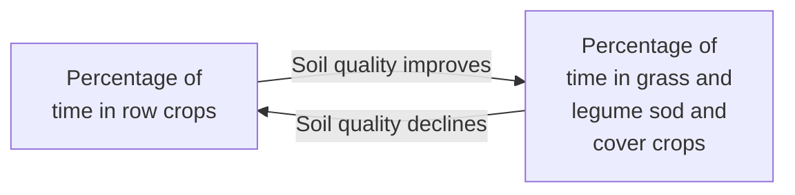
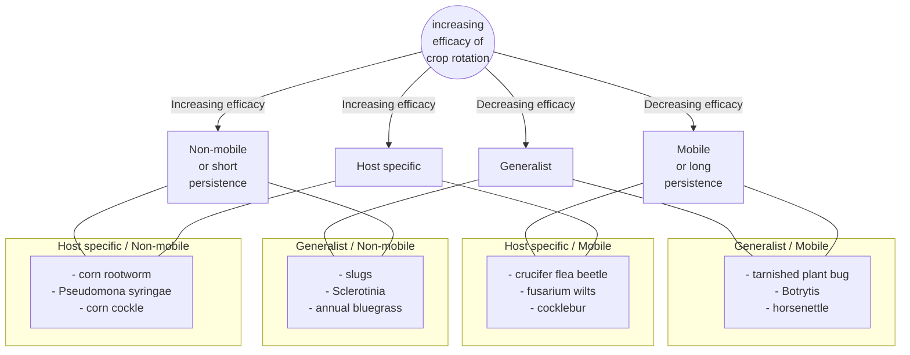
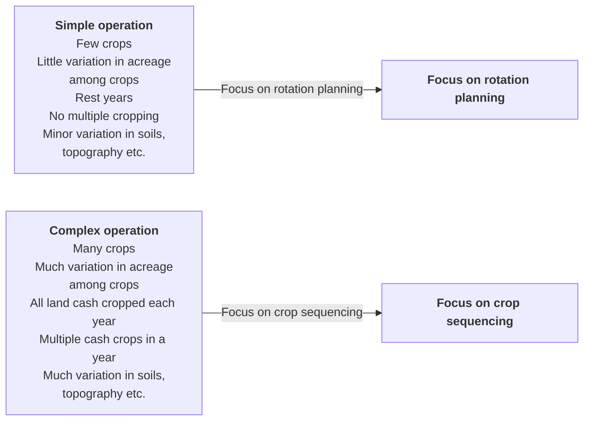

## The NEON "Managing a Crop Rotation System" Chart (continued)

<table>
<tr>
<td colspan="4">
<strong>A-4</strong> Set rotation goals (e.g., manage insects, disease, weeds, soil, field logistics; see sidebar 2.8, page 14; set custom goals)
</td>
<td colspan="2">
<strong>A-5</strong> Review annual production plan (e.g., crop & cover crop species, desired quantities)
</td>
<td colspan="2">
<strong>A-6</strong> Balance acreage, at whole farm level, between cash crops, cover crops, livestock, and "fallow" (e.g., bare soil, stale seed-bed, sod/hay, permanent pasture, or woodlot; consider role of livestock in fertility and weed control)
</td>
<td colspan="2">
<strong>A-7</strong> Update records (e.g., whole farm plan, farm mission record, annual production plan)
</td>
</tr>
<tr>
<td colspan="2">
<strong>B-5</strong> Review projected annual cash flow
</td>
<td colspan="2">
<strong>B-6</strong> Identify neighbor issues (e.g., compost pile location, spraying, chemical drift, pollination, genetic pollution)
</td>
<td colspan="2">
<strong>B-7</strong> Inventory farm equipment & facilities (e.g., greenhouses, tractors, post-harvest handling areas)
</td>
<td colspan="2">
<strong>B-8</strong> Assess crop cultural needs (e.g., staking, trellising, crop height, microclimates, irrigation)
</td>
<td colspan="2">
<strong>B-9</strong> Identify cultural constraints based on equipment (e.g., row width, irrigation)
</td>
</tr>
<tr>
<td colspan="4">
<strong>B-14</strong> Determine available rotation management time
</td>
<td colspan="6">
<strong>B-15</strong> Establish and maintain relationships with off-farm experts (e.g., extension, scouts, land grants, others; talk to laborers)
</td>
</tr>
<tr>
<td colspan="2">
<strong>C-4</strong> Network with farmers & others (e.g., helpers, extension, others; site-specific & practice-related)
</td>
<td colspan="2">
<strong>C-5</strong> Study existing research data (e.g., cover crops, insects, diseases, fertility, weeds)
</td>
<td colspan="2">
<strong>C-6</strong> Consult field records (e.g., what was planted where in previous years, successes & failures)
</td>
<td colspan="2">
<strong>C-7</strong> Consult meteorological data (e.g., frost free dates, rainfall)
</td>
</tr>
<tr>
<td colspan="8"></td>
</tr>
<tr>
<td colspan="2">
<strong>D-4</strong> Assess whether pest, disease, or weed pressures from previous season must be addressed
</td>
<td colspan="2">
<strong>D-5</strong> Determine applicability of research data, advice & other farmers' experience
</td>
<td colspan="2">
<strong>D-6</strong> Assess crop mix for whole farm (e.g., market data, soil tests)
</td>
<td colspan="2">
<strong>D-7</strong> Maintain records (e.g., record data analysis results & decisions made)
</td>
</tr>
<tr>
<td colspan="2">
<strong>E-4</strong> Consider harvest logistics (e.g., access to crops, field length, minimizing & box-carrying distance, use of harvest equipment, plan for ease of loading onto trucks)
</td>
<td colspan="2">
<strong>E-5</strong> Consider companion planting options
</td>
<td colspan="2">
<strong>E-6</strong> Group varieties according to botanical families
</td>
<td colspan="1">
<strong>E-7</strong> Determine crop field sizes (e.g., 500 sq. ft. or 2 acres; add 10% for contingencies)
</td>
<td colspan="1">
<strong>E-8</strong> Determine field locations of crop, profitable, beneficial, and 'at-risk' crops
</td>
<td colspan="1">
<strong>E-9</strong> Determine field rotations of lower-priority crops
</td>
</tr>
<tr>
<td colspan="2">
<strong>E-15</strong> Draft rotation plans (e.g., rotation plan, production plan, soil fertility plan)
</td>
<td colspan="2">
<strong>E-16</strong> Develop guidelines for contingencies in case rotation does not go as planned (e.g., written or mental guidelines for improvisation; priorities to use to make on-the-spot decisions)
</td>
<td colspan="2">
<strong>E-17</strong> Use sense & imagination to review plan (e.g., field plans and logistics; walk fields and visualize; "farm it in your head")
</td>
<td colspan="2">
<strong>E-18</strong> Maintain records (e.g., write down plan, draw maps)
</td>
</tr>
<tr>
<td colspan="1">
<strong>F-5</strong> Monitor weather (e.g., short term (best day for planting); long term (need to change plan due to drought))
</td>
<td colspan="1">
<strong>F-6</strong> Monitor soil & crop conditions for planting; cover crop maturity; residue incorporation
</td>
<td colspan="2">
<strong>F-7</strong> Monitor greenhouse conditions (e.g., observe condition of transplants; relative to soil conditions; slow or accelerate growth if necessary to produce appropriate-sized transplants on-time)
</td>
<td colspan="1">
<strong>F-8</strong> Prepare work schedule
</td>
<td colspan="2"></td>
</tr>
<tr>
<td colspan="1">
<strong>F-11</strong> Keep unused soil covered (e.g., cover crop, mulch, trap crops)
</td>
<td colspan="1">
<strong>F-12</strong> Maintain crops (e.g., cultivate, spray, trellis, irrigate, harvest)
</td>
<td colspan="2">
<strong>F-13</strong> Adjust actions according to field & crop conditions (e.g., weather, soils, weed pressure; assign crops to different fields or beds to adjust for wetness or other problems; replant if necessary, abandon crop or replace with a cover crop to cut losses)
</td>
<td colspan="2">
<strong>F-14</strong> Maintain records (e.g., what was actually planted where, successes & failures, planting & harvest dates, compliance with regulations & organic certification)
</td>
</tr>
<tr>
<td colspan="1">
<strong>G-5</strong> Assess profitability on a whole farm & crop-by-crop basis (e.g., expected vs. actual)
</td>
<td colspan="1">
<strong>G-6</strong> Assess disease control (e.g., expected vs. actual)
</td>
<td colspan="1">
<strong>G-7</strong> Assess weed control (e.g., expected vs. actual)
</td>
<td colspan="1">
<strong>G-8</strong> Assess insect & pest control (e.g., expected vs. actual)
</td>
<td colspan="1">
<strong>G-9</strong> Interview work crew for suggestions; determine likes, dislikes
</td>
<td colspan="1">
<strong>G-10</strong> Measure performance against rotation goals (positive or negative outcomes)
</td>
</tr>
<tr>
<td colspan="2">
<strong>H-4</strong> Tweak crop mix (e.g., based on market data & field performance; consider adding or abandoning crops or elements of rotation as necessary)
</td>
<td colspan="2">
<strong>H-5</strong> Tweak field management (e.g., change planting or planting dates, crop locations; shift crop families to different fields; put poorly performing fields into hay ahead of schedule)
</td>
<td colspan="1">
<strong>H-6</strong> Upgrade or improve equipment as necessary
</td>
<td colspan="1">
<strong>H-7</strong> Start process return to A (Identify Rotation Goals)
</td>
<td colspan="1">
<strong>H-8</strong> Maintain records (e.g., keep notes of actual changes implemented)
</td>
</tr>
</table>

> ### SIDEBAR 2.8
> ### EXPERT FARMERS’ COMMON GOALS FOR CROP ROTATION
> 1. Maintain healthy soil (including chemical balance, drainage, humus, vitality, biological health, fertility, nutrient cycling, tilth, organic matter, and soil cover to prevent erosion); for example: “Conserve and build organic matter in my light sandy soil.”
> 2. Produce nutritious food.
> 3. Control diseases, especially soilborne diseases; for example, “Break the wilt cycle among crops in the tomato family.”
> 4. Reduce weed pressure; for example, “Manage the rotation to confuse the weeds.”
> 5. Increase profitability.
> 6. Have a holistic approach and a good rotation that leads to healthy crops.
> 7. Manage the farm as a whole system.
> 8. Have a diverse line of products to market.
> 9. Provide economic stability.
> 10. Control insects.
> 11. Add nitrogen and other nutrients in a way that is environmentally safe and conforms with regulations.
> 12. Maintain biotic diversity.
> 13. Unlock the living potential of the soil.
> 14. Reduce labor costs.
> 15. Balance economic viability and soil fertility.
> 16. Diversify tasks to keep labor happy and productive all season.
> 17. Balance the needs of the farm with the needs of the farmer.
> 18. Minimize off-farm inputs.
> 19. Capture solar energy wherever possible.
> 20. Refine the aesthetic quality of fields and farm.
> 21. Bring the farmer to life; develop a spiritual relationship with the land.

annually. Farmers consider complying and keeping up with regulations to be among their most difficult tasks. This responsibility also includes numerous “communication” tasks, such as establishing market relationships, making labor arrangements, accessing information, and contacting suppliers.

Constraints may include field-specific limits like whether a field is ready for planting and harvest early or late in the season and how that relates to market timing, cash flow, and profitability. Problems of specific fields in a particular year must be identified. For example, heavy weed pressure the previous season may preclude small-seeded crops. Crop cultural needs, such as spacing and trellising, also have to be accommodated. Constraints imposed by equipment, such as row width, must be figured into the rotation plan. Crops with similar irrigation, fertility, labor, and cultivation regimes or planting times are often managed as a block to simplify field operations.

### Responsibility C: Gather Data
Rotation decisions, for each field and for the whole farm, are based on an impressive array of information. Some information is collected on the farm, and some is gathered from off-farm sources. Observing crops and fields is on the expert farmers’ list of the ten most important tasks (sidebar 2.7, page 11). All the expert farmers agreed that regularly walking the fields is a crucial way to gather data and monitor ongoing conditions for the current and coming seasons. Will Stevens interviews his workers throughout the season, because they are able to observe many field situations he does not have the opportunity to see. Even in winter, expert farmers are observing their fields, sometimes while cross-country skiing or walking the dog. This helps them review field conditions and logistics of previous seasons and organize their thinking for the season ahead.

Production and marketing information usually needs to be updated and cross-checked annually. A new crop, research recommendations, or market arrangements may require that new data be considered. For example, seed potato grower Jim Gerritsen uses his rotation to interrupt potato disease life cycles and pest vectors. He reviews the scientific research annually, staying current to take advantage of any advances in the understanding of the ecology of his system.

Tasks C-9 and C-10, “Categorize crops” and “Categorize fields,” are among the most critical steps in data gathering. Categorization of crops and fields helps guide the

optimal allocation of particular crops to individual fields or beds each year. These tasks rely on the cumulative process of integrating information and experience over many growing seasons. Information about both crops and fields is necessary to effectively match them in a given year. The first task is to characterize every cash and cover crop in the farm's crop mix according to a range of important characteristics, from the number and timing of harvests to soil requirements (see sidebar 2.9). Farmers also characterize their fields, on the basis of the field's permanent characteristics (such as slope and exposure) and shorter-term conditions (such as soil pressure). Categorizations provide a reference of "interchangeable crops" if a plan needs modification. For example, it is useful to know what late crops or varieties can go into a field in a wet year. The variety of characteristics considered indicates the complexity of the issues farmers balance in crop rotation decisions.

## SIDEBAR 2.9

### CATEGORIZATION OF CROPS AND FIELDS

#### Crop Characteristics

The table below lists crop characteristics from most to least important, as ranked by expert farmers.

* Botanical family
* Market demand
* Season of planting, harvest, labor, and land use
* Susceptibility to pests and diseases
* Cash vs. cover crop
* Ability to compete with weeds
* Annual, biennial, perennial, or overwintering annual
* Direct-seeded vs. transplanted
* "Givers" vs. "takers"
* Heavy vs. light feeders
* Cultural practices (for example, spraying, cultivation, irrigation)
* Preferred seedbed conditions
* Spacing requirements
* Income per acre
* Effect on cash flow
* Harvest timing
* Costs per acre
* Tolerance of mechanical cultivation
* Ability to trap nutrients
* Root vs. leaf and fruit
* Drought tolerance
* Row vs. block planted
* Large vs. small seeded
* Deep vs. shallow rooted
* Tolerance of poor drainage
* Shade tolerant vs. intolerant
* Pollination requirements

#### Field Characteristics

These relatively permanent characteristics of a field are difficult to change; many affect the type of equipment that can be used and the timing of operations.

* Recent planting history (1–5 years)
* Within-field variability
* Proximity to water source
* Erosion potential
* Drainage
* Sunny or shady
* Known problems with
  - weeds
  - insects
  - poor tilth or hardpan
  - wildlife
* Slope
* Moisture-holding capacity
* pH
* Natural Resources Conservation Service (NRCS) soil type
* Aspect (north, south, east, west)
* Air drainage—frost pockets
* Size
* Cation-exchange capacity
* Proximity to barn or access roads
* Stoniness
* Shape (corners, row lengths)
* Proximity to similar fields

### Responsibility D: Analyze Data
All of the decisions and information generated through previous tasks and responsibilities are pulled together for analysis at this key phase of the planning process. The data on market options, equipment, labor and seed availability, and financial constraints, along with the overall farm and rotation goals are reviewed. Information is cross-referenced and, when necessary, weighted. Possible trade-offs are considered. For example, the field crew may be able to plant two fields to high-value crops but not also harvest an early crop the same week. Crop cultural needs are compared to each field’s characteristics and conditions. The experts assess soil conditions and determine how pest (animal, insect, weed) and disease pressures from the previous season should be addressed. This is among the most difficult tasks. Even weather projections are considered. Every possible crop mix is analyzed. Various possible pairings of crop to field are outlined, and options for each field are compared.

### Responsibility E: Plan Crop Rotation
This responsibility is the ultimate synthesis of information and results in a production plan and a rotation plan. Expert farmers distinguish between these two types of plans. The production plan specifies what needs to be grown (the crop mix) and how it will be grown, whereas the rotation plan determines where each crop will be planted. Final decisions about the crop mix and the allocation of crops to fields and fields to crops are pivotal to this responsibility. Information such as what crops to grow, in what quantities, labor availability at various times in the season, required equipment, and desired harvest dates are integrated into the rotation plan for each field and for the entire farm.

Two questions bounce back and forth. One is what will be grown in each field? The other is where will each crop grow? These questions are answered based on observation and experience. Several steps are involved. First, the cropping history of each field or bed for the past three or more years is reviewed. This includes what crops and crop families were grown; how well they performed; any particular successes or failures; and any logistical issues relating to equipment use, irrigation, harvesting, or labor. Obviously, the size of the field and market needs (how much of each crop is required) are also considered. The allocation of crops to fields includes consideration of future cropping plans as well as the cropping history of a field. The rotation plan must be responsive to weed pressures or other legacies from earlier years and must provide future crops with favorable conditions.

Expert farmers first assign their highest-priority crops to fields (or beds). High-priority crops include the most profitable crops, cover crops with the greatest benefits, and crops particularly vulnerable to pests, diseases, or weather. Decisions are also based on high-priority fields—for example, those that have the highest fertility, are prime locations for u-pick crops, or have current problems that need to be addressed. Remaining fields (or parts of fields) are then assigned to the remaining crops, cover crops, fallow areas, and sometimes pasturage for livestock. All these decisions are based on both business and biology. An example is provided in sidebar 2.10.

The crops and fields are tentatively matched, creating a cropping plan for the entire farm for the year. Many experts plot this information on farm maps and notebooks. They take this initial plan and, in the words of one, “Farm it in my head.” That is, they work through the sequence of field operations from tillage to harvest over the entire season for each crop and field. Several expert farmers take their plans into the field and walk the farm for this task. They think through why any sequence might not work, reviewing any possible logistical or biological conflicts like

> #### SIDEBAR 2.10
> #### GROUPING CROPS BY THEIR NEED FOR ACCESSIBILITY
> The logistics of harvesting affect rotations. For example, crops with frequent harvests or need for frequent care must be easily accessible. Expert farmer Jean-Paul Courtens considers road access and produce characteristics. He prefers to allocate some crops to fields with close proximity to packing sheds. Long rides on bumpy roads can bruise delicate produce like tomatoes. He locates salad greens and braising greens in the same field due to the time of day they are harvested. Crops are also grouped based on the time of the season when they are harvested.

timing of operations or spread of pests between adjacent crops. They then adjust the plan as necessary.

## Responsibility F: Execute Rotation
Farmers indicated that executing the rotation involves many of the most important and difficult tasks (see sidebar 2.7, page 11). They identified maintaining crops (including activities such as weeding, thinning, and irrigation) as the most important task and the second most difficult task in crop rotation. Scheduling tillage and planting for all the fields across an entire farm every season is also a challenge for most farmers. Although they generally want to till the soil as early as possible to accelerate soil warming and residue breakdown, they must wait for workable soil moisture conditions. Other critical steps in crop production and central to executing the crop rotation are soil preparation and planting. Delays in soil preparation or planting may cause crop failures due to poor emergence, runaway weeds, or inadequately broken down cover crops and require shifts in the crop rotation (see sidebar 2.11).

Expert farmers attempt to plant priority fields or beds and their most important crops as scheduled in their plan. If they have to alter the plan, they still prioritize high-value or sensitive crops and fields. Many decisions and adjustments have to be made on the fly.

In early spring, farmers monitor the weather—sometimes hourly—as they implement and alter their rotation plan. Problems related to weather, cover crop maturity, crop emergence, and weeds may cause farmers to alter their original plan. Soil moisture conditions affect the timing of tillage and subsequent field operations (see sidebar 2.12, page 18). Cover crops are monitored to determine maturity, thickness of stands, and optimal time for incorporation. Farmers also monitor the breakdown and incorporation of crop and cover crop residues. Soil and air temperatures influence planting and transplanting decisions, as well. Any of these factors can cause crops to be reassigned to different fields or beds.

While a change necessitated by weather or the conditions in one field can cause reassignment of crops around the farm, general and farm-specific rotation goals and guidelines remain the basis of every decision; for example, cucurbit crops will never be planted in the same field two years in a row. Most expert farmers anticipate problems that might occur and have contingency plans ready (see sidebar 2.13, page 19). Expert farmer Paul Arnold suggested that this ability to make effective on-the-fly adjustments

> ### SIDEBAR 2.11
> ### CONSIDERING OPTIONS
>
> After harvesting late snap beans, wet weather prevented expert farmer Roy Brubaker from fall-seeding a rye cover crop in a particular field. One option for the field might have been to plant oats and field peas in early spring, which would have had to be plowed down prior to planting fall brassicas. Another option would have been to plant the field to a spring crop of brassicas and then put in buckwheat or an early rye cover crop. Either decision had repercussions for the rotations on other fields because the farm's CSA needed both spring and fall brassicas.
>
> Nonuniform cover crop growth does not change Brett Grohsgal's overall rotation, but it can change his crop mix or the selected varieties on a particular field. He may subdivide the field and plant heavy feeders where the legume cover crop was most successful. For example, beefsteak tomatoes, which are heavy feeders, would get that part of the tomato acreage that had good cover crop growth; whereas thrifty cherry tomatoes would get the remainder. Alternatively, he might plant heavy-feeding and high-value watermelons on the most fertile, weed-free areas, whereas lower-value and resilient winter squash would be assigned to the less fertile areas.
>
> At both farms, all the options are considered before finalizing a decision.

is an important factor in the success of his farm. In the event of crop failure, crops may be abandoned, replanted, or replaced with a cover crop or even a different cash crop. Drew Norman, another expert farmer, described this process as finding "a profitable punt."

As the season progresses, short-season crops like salad greens are harvested, subsequent crops are planted, and cover crops are seeded or plowed under. Even as the rota-

tion plan is implemented, the process of crop-to-field allocation and prioritization continues. The expert farmers emphasize the importance of recording actual cropping as it happens (particularly deviations from the plan) for later comparison with their initial rotation plan for the year.

## Responsibility G: Evaluate Rotation Execution

Throughout the season, expert growers monitor the performance of their fields, each crop, and the farm as a whole. They record how their plans have worked and evolved. This is not just to solve problems in the current season, but also to observe, learn, and collect ideas and data for future seasons. Expert farmers do this directly and through communicating with their crews. Several said they interview their field crews at the end of the season. Workers often have suggestions, such as improving the farm layout, that enhance the efficiency of operations.

At the end of the season, growers carefully assess what actually happened relative to what they expected based on the original rotation plan. The factors they consider include yields; soil conditions; timing of events and operations; costs of crop production; disease, weed, and pest levels and their control; crop losses; labor satisfaction and efficiency; and profitability of each crop and of the whole farm. By walking around the farm and by analyzing data at their desk, they review the success of the production year. They compare the results with those of previous years to detect any trends or patterns. When attempting to analyze the causes of success or failure of various elements of the rotation, growers talk to other growers and extension agents to determine whether problems were the result of actions on their farm rather than, for example, a bad disease year for all farms in the region, regardless of rotation. Assessing whether regional conditions or on-farm mistakes were the source of problems is among the most difficult tasks, even for experts.

Rotation goals and rotation plans serve as benchmarks to measure the success of the cropping season and the rotation. Expert farmers consider how closely they followed biological principles in their rotation, whether they met their production and market objectives, and how their rotation execution supported their biological and business goals. Successes and failures are assessed, analyzed, and evaluated. The results are recorded to assist in planning and management for future seasons. Farmers note that assessing the profitability of crops, especially on a field-by-field basis, is another difficult task.

> ### SIDEBAR 2.12
> ### FIELD AND CROP CONDITIONS THAT EXPERT FARMERS MONITOR
>
> Fields and crops need continual monitoring during the season. Biological and physical conditions can change relatively quickly due to management, weather, and mistakes. Experts often have contingency plans in mind to accommodate such situations, especially for their priority fields and key crops. In-season observations also inform experts' decisions for the next year's rotation. Although most farmers do not measure all these parameters directly, they are aware of, observe, and monitor conditions in their own ways. Conditions they monitor regularly include:
>
> | | |
> | :--- | :--- |
> | *Pests* | * Nutrient cycles |
> | * Weed pressure | * "Biological health" and vitality—earthworms, etc. |
> | * Insect emergence and pressure | * Soil organic matter |
> | * Diseases | |
> | | *Soil tilth* |
> | *Cover crop performance* | * Crop residues and residue breakdown |
> | * Success of previous cover crops (e.g., production of organic matter, weed suppression) | * Composted organic matter or "humus" in the soil |
> | * Ground cover | * Soil aggregation |
> | * Cover crop nodulation and nitrogen fixation | * Soil moisture |
> | | * Soil and air temperature |
> | *Soil fertility* | * Soil compaction and porosity |
> | * Soil test results | |
> | * Chemical balance (N, P, K, Ca, Mg, and micronutrients) | |

> ### SIDEBAR 2.13
> ## CONTINGENCY PLANNING
>
> Expert farmers have enough experience to know that their best plans can sometimes be derailed. Knowing how to adapt or when to start over with a particular field or crop is essential to the success of the farm business. Expert farmers have developed many techniques to help them adapt to changing circumstances that typically influence their rotations.
>
> * **Delayed planting due to wet fields**
>   A common reason to diverge from the rotation plan is wet fields in spring. This can delay the plowdown of cover crops and, consequently, of residue decomposition, field preparation, and transplanting. Many expert farmers switch key crops to other fields when this happens, causing a cascading (somewhat preplanned) shift in the allocation of many crops.
>
>   The growth of transplants in greenhouses is monitored to determine whether transplants are on schedule for planting out, relative to soil and weather conditions. Greenhouse environments are managed to speed or slow growth so that transplants are at the right developmental stage when field conditions are right for transplanting. Transplants will also be "hardened off" to prepare them for the shock of the particular season's outside environment.
>
> * **Poor germination**
>   David Blyn replants crop failures with fast-growing, short-season crops like radishes. He stocks extra seed for crops like sweet corn and carrots that can be planted on multiple occasions and replants when necessary. He often finds that the reason for failed germination was a poor seedbed, and on the second try the seedbed is usually better.
>
>   Blyn also uses cover crops to "paint in" gaps caused by failed crops or early harvests.
>
> * **Weed challenges**
>   Brett Grohsgal responds to heavy weed pressure by sowing cover crops at higher rates.
>
>   Crops with bad weed problems are often plowed down and planted to cover crops. Eero Ruuttila uses a cover crop of oats and field peas for this purpose, which also produces a marketable crop of pea shoots.
>
>   Growers sometimes have to decide whether a cover crop stand that has a lot of weeds is worth keeping for the fertility benefits or should be plowed under early. They weigh the potential benefits and investment in the cover crop against potential increases in the weed seed bank.
>
>   One expert farmer uses intensively cultivated crops to control bad weed infestations. For example, infestations of bindweed and Canada thistle are followed by a triple crop of lettuce, which is high value enough to justify the costs of frequent cultivation. This is followed by a weed-suppressing cover crop of rye.
>
> * **Weather problems**
>   Drought can affect the germination of direct-seeded crops and shallow-rooted crops like garlic. Contingency strategies include mulching instead of cultivation for weed control, and substituting larger-seeded or transplanted crops.
>
>   In the event of drought and limited water for irrigation, Don Kretschmann irrigates only the portion of the crop destined for retail markets, allowing the wholesale portion of his crops to perish.
>
>   When an oat and pea cover crop does not winterkill, it delays planting of strawberries because of the time needed for the cover crop to break down. In that situation, Roy Brubaker plants the strawberries close together so their runners will fill in the rows more quickly for good weed control.
>
> * **Severe pest and fertility problems**
>   Brett Grohsgal occasionally finds that a whole field needs to be temporarily removed from production to rebuild fertility or manage weed infestations. He chooses sequences of cover crops based on ability to add organic matter, fix nitrogen, survive drought, and compete with weeds. He often pastures livestock on these fields to disrupt weeds and add fertility.

## Responsibility H: Adjust Rotation Plan

As the cropping season closes in late fall, expert farmers begin the final phase of the annual rotation cycle in which they modify their rotations and plan for the coming year. This occurs concurrently with the evaluation of the past season. They revisit the tasks associated with "Identify rotation goals" (Responsibility A). They then focus on the productivity and problems of each field and of the overall farm. They first consider altering the crop mix by adding or removing crops or changing the area planted to a crop. Such decisions are affected by the market, as well as by field and crop performance and rotation imperatives. For example, Paul and Sandy Arnold found that high-quality, disease-free beets were very important for sales at farmers' markets, so they decided to open up new acreage to break up the life cycle of soilborne beet diseases. This resulted in adjustment of their entire rotation so that their fields spend a longer time in cover crops.

Growers may also decide to change their field management by changing the order or dates of planting or plowdown of cover crops. They may decide to shift crops to alternative fields, try new crop sequences, or improve fertility of a field by planting it into a cover crop or hay ahead of schedule. They record notes for the next year's rotation plan, new guidelines for contingencies, and results of experiments. The next year's plan begins to take shape.

Adjusting the rotation plan presents three particularly challenging tasks: (1) developing collaborations to solve problems, (2) investigating markets, and (3) tweaking the crop mix. Tweaking the crop mix requires balancing market opportunities with biological needs. Growers indicated that this is a core task in managing crop rotations.

Expert growers stress the importance of experimentation, play, and a sense of adventure in managing their rotations. The art of adjusting every aspect of the rotation was discussed as the core of successfully managing rotations. While the NEON chart makes rotation planning seem linear and quantifiable, all of our farmer panelists felt that managing rotations is a continuous, integrated, intuitive, and cyclical process developed through intensive information gathering and extensive experience. They glean and incorporate new ideas into their rotations, which continue to evolve. These expert growers agreed on the importance of making new and interesting mistakes each season.

# 3
# PHYSICAL AND BIOLOGICAL PROCESSES IN CROP ROTATION

## What This Chapter Is About
CHARLES L. MOHLER

This chapter is about the ways biologists and soil scientists view crop rotation (see inset). Unlike the farmer experts of the previous chapter, who approach rotation as a holistic process, the scientists are specialists who delve deeply into particular aspects of organic production. They study in detail how crop rotation affects a particular aspect of the farm system. Through extensive reading and discussion with others, expert farmers come to understand and practice most of the principles presented here. Understanding the concepts presented in this chapter can help resolve newly encountered problems and aid development of a rotation plan.

Researchers have studied crop rotation since the beginnings of agricultural science, in the early nineteenth century. More recently, scientists have taken a renewed interest in crop rotation due to increasing problems associated with continuous cropping of single species. In the past ten years, researchers have begun to look at crop rotation on organic farms (125). Studying multiyear crop sequences, however, requires extraordinary patience and a source of funding that lasts longer than typical government grants. Consequently, most studies have compared a two- or three-year rotation with continuous cropping. Since the organic farming community is already aware of the problems of continuous cropping, such studies often provide few data with any relevance to organic farmers. Nevertheless, some relevant studies do exist, and much can be inferred from work that did not explicitly compare different crop rotations.

The biological and physical benefits of crop rotation fall into two general, interrelated categories: improvement

> All of the researchers who contributed to this chapter are knowledgeable about the organic production process and actively work to support organic agriculture. To ensure accuracy, other researchers in their respective fields who support organic agriculture reviewed their comments. To ensure relevance and a writing style that speaks to farmers rather than other researchers, organic farmers also reviewed the researchers' comments.

of soil quality and management of pests. Certain broad patterns appear in each of these.

Soil quality tends to improve with the percentage of time the land is in grass and legume sod and cover crops (figure 3.1, page 22). Legumes used as green manures supply nitrogen for succeeding crops. Many legumes also have deep taproots that loosen the subsoil and recycle leached nutrients back into the plowed horizon. Grasses produce dense systems of fine roots that secrete substances that foster aggregation of the soil into stable crumbs. Moreover, their roots decay slowly through various forms of soil organic matter that further tend to stabilize soil aggregates and supply a slow release of nutrients for crop growth. Conversely, row crops tend to have opposite effects on soil, due to (1) the relatively low average density of roots per square foot and (2) the presence of bare soil between the rows that is exposed to the impact of traffic and raindrops. Many factors can modify these contrasting trends, including the type and frequency of tillage and the degree to which the farmer uses soil amendments like compost, organic mulches, and rock powders. Nevertheless, the contrast between grass and legume sod and cover crops versus row crops makes a good starting point for understanding the relationship between crop rotation and soil quality.

Although crop rotation is a key component in the management of diseases, weeds, and many types of animal pests, it is not a panacea. Many pest problems cannot be managed by crop rotation alone, and some problems cannot be addressed by crop rotation at all. A key factor that governs the ability of crop rotation to manage pests is the host specificity of the pest (figure 3.2). Host-specific pests specialize on a particular species or family of crops, whereas generalist pests damage a wide range of crops. Additional key factors are the mobility of the pest and the persistence of dormant pest life stages (eggs, seeds, spores). Highly generalist pests can persist in the field through a variety of crops, and a grower must use management techniques in addition to rotation to keep them from reducing crop quality and productivity. Highly mobile pests can disperse into a field and cause problems even if the preceding crops have provided unsuitable habitats that caused the pest to die out. Other pests, particularly weeds and some fungi, have seeds or

---

### Figure 3.1 Relation of soil quality to the types of crops that predominate in the rotation.

---

### Figure 3.2 The effect of host specificity, dispersal ability, and survival of dormant states (eggs, spores, seeds) on how well crop rotation controls pest organisms.

> Note that persistence and mobility often vary in opposite ways, with non-persistent species having high mobility and vice versa. Mobility and persistence appear together in this diagram because they have similar effects on management choices.

Generalist pests are pest organisms that attack crops in diverse plant families or, in the case of weeds, thrive in a wide range of cropping systems. *Source: Modified from reference 125.*

spores that can remain dormant in the soil for many years. Such species are less likely to be eliminated by a short period without a suitable host crop (or for weeds, suitable cropping conditions) than are species that do not persist well in the soil. At the other extreme, nonpersistent, poorly dispersing pests that are dependent on a narrow range of crops are relatively easy to control through rotation to other types of crops. Other sections in this chapter discuss many examples of pests that are and are not effectively managed by crop rotation.

Soil management and pest management interact in many ways. For example, crop nutrition affects plant disease resistance, some cover crops can reduce certain types of soilborne diseases but promote others, and high soil physical quality improves the effectiveness of mechanical weed management. All of these interactions, and many others, are influenced by crop rotation. Some notable interactions between soil and pest management that can be managed by crop rotation are addressed in the following sections.

# Crop Rotation and Soil Tilth
HAROLD VAN ES

Tilth generally refers to the physical condition of the soil as it relates to plant growth. Favorable tilth implies good conditions for seed germination and root proliferation, allowing crops to thrive. Also, a soil with good tilth facilitates other processes, such as water infiltration and aeration, which benefit both crop and environment. Good soil tilth is usually equated with aggregation (presence of soil crumbs), because stable aggregates promote these favorable processes. Crop rotations can have a positive impact on soil tilth, depending on the crops that are being alternated. Additional ways to improve soil tilth include reducing tillage and using cover crops. There are thus a number of approaches to improving the physical quality of the soil, and often a combined approach produces the greatest improvement.

## Soil Tilth and Aggregation

Figure 3.3 shows a soil aggregate, or crumb, found in a soil of good tilth. With finer-textured soils, such aggregates may in turn be made up of smaller ones that are clumped together. The aggregates themselves are perhaps less important than the spaces (or pores) between them, and a soil that is well aggregated also has a range of pore sizes. Each pore size plays a critical role in the physical functioning of the soil. Large pores drain rapidly and are needed for good air exchange during wet periods. This prevents oxygen deficiency in the soil, which stresses most crop types, sometimes to the point of death. Oxygen deficiency also increases pest problems. Denitrification (conversion of nitrogen to gaseous forms) is another concern with oxygen-deficient waterlogged soil. Denitrification results in rapid and significant loss of soil nitrogen and generates nitrous oxide, a potent greenhouse gas. When soil becomes degraded, either through long-term intensive cultivation and erosion or through compaction from traffic, it loses its aggregation, and the large pores are compressed into small ones. Coarse-textured sands and gravels naturally have large pores, and therefore are less dependent on aggregation to provide good tilth and aeration. Finer-textured soils, however, depend heavily on aggregates for good physical structure and tilth and, once degraded, become structureless, dense, and hard.

A mix of large and small pores is desirable. Small pores are critical for water retention and help a crop go through dry periods with minimal yield loss. Sandy and gravelly

[The image shows a diagram of a soil aggregate or "crumb" with various pore sizes labeled.]
* **small pore**: Points to tiny gaps within the clusters of soil particles.
* **large pore**: Points to a large central void between major clusters.
* **intermediate pore**: Points to medium-sized gaps between clusters.

Figure 3.3 A soil aggregate or "crumb" with good tilth. *Source*: From reference 68. Used with permission.

soils are naturally deficient in small pores and are therefore drought prone, whereas loams and clays can retain and thus supply crops with more water.

Good soil management and rotations can increase crop water availability if they increase the soil's organic matter content, which is an important contributor to water retention. Coarse-textured soils can thus also benefit from good management, even though they are less dependent on aggregation.

Good soil tilth can be obtained through mechanical and biological manipulation of the soil. Mechanical soil cultivation practices, including primary tillage (moldboard or chisel plowing) followed by secondary tillage (disking, harrowing, etc.), have the aim of producing a good seedbed. When soils become degraded and compacted, such tillage practices are often deemed necessary to establish a good crop, because the soil would otherwise be too dense, hard, or cloddy. The tilth created by tillage, however, tends to be *unstable*, because the aggregation is obtained through the physical manipulation of the soil, which is short lived, especially after many years of intensive tillage. Aggregates in such soils will readily fall apart during subsequent rains, causing the soil to settle and become dense and hard. This then generates a vicious cycle in which the soil needs to be intensively tilled each year to provide good seedbed conditions, which in turn makes the problem worse. Such a soil may be considered "addicted to tillage."

The preferred scenario is for the aggregates and good tilth to be the result of natural soil building processes, such as the activity of plant roots, earthworms, and other beneficial organisms. Such *stable* aggregates will break apart during tillage or planting and therefore readily provide good tilth, as opposed to unstable, weakly aggregated soil, which tills up cloddy. Also, stable aggregates are held together by organic bonding materials that resist breakdown during soil saturation and heavy rainfall. These organic materials are themselves subject to biological degradation, so there needs to be a continual effort to "feed the soil" with organic material, and to minimize organic matter breakdown from intensive tillage.

## Aggregation in the Subsoil

People tend to focus on soil tilth in the plow layer, but good aggregation is also important in the subsoil, the layer below the regular depth of tillage. Such aggregates are generally not crumb-like but involve larger (2- to 6-inch) blocks of soil that are more angular and not as distinctive. These aggregates are less impacted by biological activity of microbes, earthworms, and roots than the crumbs in the surface layer. Subsurface aggregates are important for root growth deep into the profile. Deep roots allow a plant greater access to soil moisture, which helps it through drought periods. Aggregates below the surface layer can also be compacted. The main cause for this is heavy equipment loads on wet soil (figure 3.4), where the force of compaction is transferred deep into the soil, beyond the plow layer. Another significant source of subsoil compaction is the practice of plowing with a set of wheels in the open furrow. This way the subsoil is directly loaded by the tractor tires.

<table>
<tr>
<td>

</td>
</tr>
<tr>
<td>
<strong>FIGURE 3.4</strong> Compactive forces are transferred deeper in wet soils than in dry soils. Source: From reference 68. Used with permission.
</td>
</tr>
</table>

## Soil Hardness

Soils generally become harder when they dry. There is a difference, however, between well-aggregated and compacted soil, in that the latter becomes hard more readily upon drying (figure 3.5). This causes problems with crop emergence, root restriction, and reduced plant growth. A scenario that is often observed is the hardsetting of poorly aggregated (low organic matter) soil when tillage is followed by large amounts of rainfall. The aggregates forming the loose tilth after tillage are not stable and fall apart when the soil becomes saturated. The soil then settles and becomes hard. If the aggregates are stable as a result of good management and adequate organic matter, they will hold up against the rain, and good tilth will be preserved.

Similarly, compacted subsoils become hard and impenetrable to roots when they dry. Rotation with cover crops that grow aggressively in the early and late growing season are thus better able to penetrate plow pans and hard subsoil, because the soil is then moist and sufficiently soft for root penetration. In contrast, a summer annual, like corn, does not see significant root growth until the late spring, when compacted soils may already have become dry and hard.

> "Rotation with cover crops that grow aggressively in the early and late growing season are... able to penetrate plow pans and hard subsoil, because the soil is then moist and sufficiently soft for root penetration."

### Effects of Rotation Crops

Rotation crops can help build soils, as illustrated in figure 3.6 (page 26). Studies have shown that organic matter losses from intensively tilled row crops can be regained when the field is rotated into a perennial sod crop. There are two processes that contribute to this gain. First, the rapid rate of organic matter decomposition from tillage is stopped under the sod crop. This benefit, of course, is also gained when a no-tillage cropping system is employed. Second, grass and legume sods develop extensive root systems that continually grow and die off. The dead roots supply a source of fresh, active organic matter to the soil, which feeds soil organisms that are involved in building soil aggregation. Earthworms and many other beneficial organisms need continual supplies of organic matter to sustain themselves, and they deposit the digested materials on soil aggregates and thereby stabilize them. Also, the living roots and symbiotic microorganisms (for example, mycorrhizal fungi) can exude organic materials that nourish soil organisms and help with aggregation. Grass and legume sod crops therefore return more organic matter to the soil than most other crops.

Sod crops appear to be the most effective in building good soil tilth in the surface layer. The dense, fibrous, rooting system of perennial grasses and shallow-rooted legumes creates a very active biological zone near the surface. If a short rotation is used, and tillage is minimized,

<table>
<thead>
<tr>
<th colspan="2">Figure 3.5: The effect of soil water content on soil hardness of a well-structured and a compacted soil</th>
</tr>
</thead>
<tbody>
<tr>
<td colspan="2">Compacted soils harden more rapidly than well-structured soils when drying. Hardness above 300 psi restricts root growth.</td>
</tr>
<tr>
<td><strong>Soil Water Content</strong></td>
<td><strong>Soil Hardness</strong></td>
</tr>
<tr>
<td>Low</td>
<td>High (Compacted soil curve reaches ~450 psi; Well-structured soil curve reaches ~250 psi)</td>
</tr>
<tr>
<td>Medium</td>
<td>Medium (Compacted soil curve at ~350 psi; Well-structured soil curve at ~200 psi; 300 psi critical level marked)</td>
</tr>
<tr>
<td>High</td>
<td>Low (Both curves approach ~100 psi or lower)</td>
</tr>
</tbody>
</table>

<table>
    <tr>
        <th>Years</th>
        <th>Soil organic matter content (%)</th>
        <th>Crop/Management</th>
    </tr>
    <tr>
        <td>0</td>
        <td>4.0</td>
        <td>Corn, plowing</td>
    </tr>
    <tr>
        <td>25</td>
        <td>1.8</td>
        <td>Corn, plowing</td>
    </tr>
    <tr>
        <td>50</td>
        <td>3.2</td>
        <td>Grass sod</td>
    </tr>
    <tr>
        <td>75</td>
        <td>3.8</td>
        <td>Grass sod</td>
    </tr>
    <tr>
        <td>100</td>
        <td>4.0</td>
        <td>Grass sod</td>
    </tr>
</table>FIGURE 3.6 Loss and gain of soil organic matter under tilled corn followed by grass sod. *Source*: From reference 68. Used with permission.

72 percent (14). This provides longer periods of soil cover, thereby reducing erosion potential and loss of good topsoil. Also, it provides longer periods in which active roots feed the soil. Some crops such as rye, wheat, oat, barley, pea, and cool-season grasses grow actively in the late fall and early spring and thereby can help build stable soil tilth. They are beneficial both as rotation and cover crops, but the positive effects may be negated if intensive tillage is used to establish them.

In summary, rotations provide opportunities for improving soil physical quality, especially if the active growth period is expanded and the amount of tillage in the rotation is reduced. With careful selection, rotation crops can be targeted to help alleviate certain soil quality problems. A densely rooted sod crop helps build tilth in the plow layer, while a deep-rooted crop helps address problems with subsoil compaction. In many cases, the rotation should include a mixture of crop types to increase the diversity of organic matter that supports soil-building organisms, and to address multiple soil quality objectives.

A grower should consider a field assessment to identify problems and better tailor the rotation to the needs of the soil. This may include an assessment of soil tilth in the surface layer, rooting depth, and soil hardness in the subsoil. A soil penetrometer is a useful tool for this, but digging with a shovel is perhaps the most instructive. The Cornell Soil Health Test has recently been developed to provide an integrated assessment of soil quality through chemical, biological, and physical indicators. This includes aggregate stability, an indicator of soil tilth. For further information on the test and management practices that promote soil health, visit HTTP://SOILHEALTH.CALS.CORNELL.EDU.

*For further reading, see references 14, 68, and 107.*

the benefits of the sod crop are enhanced. Hay or pasture fields can be established with minimal tillage if a good no-till drill is used and weed pressure is low. Some annual rotation crops such as buckwheat also have dense, fibrous, root systems and can improve soil tilth. Sometimes, compatible mixtures of crops are beneficial because they have different rooting systems. For example, red clover seeded into winter wheat provides additional roots and a more protein-rich source of organic matter.

Other rotation crops are less effective in building tilth in the surface layer but are more valuable for improving dense subsoils. Some perennial crops, such as alfalfa, have strong, deep, penetrating tap roots that can push through hard layers, especially during wet periods when the soil is soft. These deep roots make pathways for water and future plant roots, and bring organic matter into the subsoil.

Crops can be beneficial in a rotation if they extend the period of active growth compared to conventional row crops. For example, in a corn-soybean rotation, active growth occurs only 32 percent of the time, while in a dry bean–winter wheat–corn rotation, this period is

# Crop Rotation Effects on Soil Fertility and Plant Nutrition
ANUSUYA RANGARAJAN

Soil organic matter and clay particles hold large stores of plant nutrients. These reservoirs, however, are not all available to the crop. In an organic crop rotation, the grower manages soil organic matter and nutrient availability by incorporating different crop residues, cycling among crops with different nutrient needs, using cover crops, and adding organic soil amendments. Most crops deplete soil nutrients during their growth cycle. Some of these nutrients leave the farm as harvested products, and the rest return to the soil as crop residues. The nutrients in residues may or may not be available to the next crop. Crop roots and residues improve soil fertility by stimulating soil microbial communities and improving soil aggregation. This improved soil physical environment facilitates water infiltration, water holding, aeration, and, ultimately, root growth and plant nutrient foraging. This section will review different ways that crop rotations affect soil fertility.

Understanding the basics of how nutrients are added to and released from soil organic matter will help the farmer in choosing crop sequences and amendments to optimize organic crop fertility. Certain fractions of soil organic matter contribute to plant nutrition more than other fractions. To effectively plan organic crop rotations to meet crop nutrient needs, several factors should be considered. Legume crops, which capture atmospheric nitrogen and "fix" it into forms available to plants, can be used strategically in rotations to meet the needs of nitrogen-demanding crops. Cover crops used after a cash crop capture surplus plant-available nutrients and conserve these for following crops. Cash crops themselves vary in their nutrient demands (see appendix 1, pages 101–103); considering their needs helps make the most efficient use of the available soil nutrients in a rotation. Finally, other types of organic amendments, such as compost and manures or approved mineral fertilizers, can supplement nutrients at targeted times during a rotation. Each of these topics is discussed in the sections below.

## The Basics: How Nutrients Are Released from Soil Organic Matter

Levels of soil organic matter range from about 0.4 percent to 10 percent in mineral soils in temperate regions. While organic matter is a relatively small fraction of the soil, it has large effects on soil structure and soil fertility. Soil organic matter contains an estimated 95 percent of soil nitrogen (N) and 40 percent of soil phosphorus (P), and with the right levels and conditions it may provide all of the N and P needs of a crop. Estimates of total nitrogen in a soil with 3 percent organic matter range from 2,000 to 4,000 pounds per acre; estimates of phosphorus range from 100 to 300 pounds per acre. Soil microorganisms release these nutrients when they consume organic matter and subsequently die. The rate of this nutrient release is affected by the availability of carbon sources (energy for the soil microbes), soil temperature, soil moisture, tillage, types and numbers of soil organisms, and quality of the soil organic matter.

A portion (10–20 percent) of the total soil organic matter has been termed the "active" fraction and is most easily decomposed by soil organisms. This active fraction is replenished primarily by additions of organic matter (cover crops, crop residues, manures, compost). Soil organisms, which make up another 10–20 percent of soil organic matter, decompose this active organic matter. Upon death, these organisms release their nutrients to plants. The remaining soil organic matter is humus. The humus is more slowly digested by soil organisms and

> **"Understanding the basics of how nutrients are added to and released from soil organic matter will help the farmer in choosing crop sequences and amendments to optimize organic crop fertility."**

therefore is not a large source of available nutrients. Humus is very important, however, because it provides cation exchange sites, which hold nutrients in the soil and thus maintain their availability to plants.

Organic matter amendments to soil decompose at different rates, and this affects how quickly nutrients become available to crops. Several factors affect the rate of decomposition of organic amendments, including the carbon-to-nitrogen ratio of the amendment, soil type, temperature and moisture conditions, and the crop being grown. Green manures, which are part of the more active organic matter fraction, decompose readily, liberating nutrients relatively quickly. Composts have more stable, humic organic matter, and decompose more slowly. As a result, most composts release nutrients to crops more slowly than green manures.

Organic matter decomposition is enhanced in the area immediately around roots (the rhizosphere). Roots release organic compounds, such as carbohydrates, amino acids, and vitamins, into the soil, stimulating growth of microorganisms in this zone. Many of these organisms decompose organic matter, resulting in nutrient release to the crop. Very little research has been done to determine which plant varieties or species best support these nutrient-releasing microorganisms. In the future, such information may help identify crop varieties well adapted to organic systems.

When cover crops are regularly part of a rotation, their residues increase soil organic matter. The organic matter feeds the growth of microbes, which increases the release of N as they die and decompose. Thus, integrating cover crops into a crop rotation at specific points can help enhance nutrient cycling and conservation.

## Nitrogen Contributions from Legume Cover and Cash Crops

Legumes may be present in a rotation as a harvested crop (for example, alfalfa) or as a green manure (for example, vetch or clover). Legumes are of special interest in organic crop rotations because of their ability to add nitrogen to the system. Specialized bacteria (*Rhizobium* spp.) associated with the roots of legumes convert atmospheric nitrogen (N2 gas) into plant-available nitrogen. The amount of N fixed by this association between bacteria and legumes varies with plant species and variety, soil type, climate, crop management, and length of time the crop is grown. When used strategically in a rotation, legumes provide N to the subsequent crop. The amount of N that a legume crop contributes to following crops depends on the amount of N fixed, the maturity of the legume when it is killed or incorporated into the soil, whether the entire plant or only the root system remains in the field, and the environmental conditions that govern the rate of decomposition. As a result, estimates of the amount of N contributions by legumes to subsequent crops range from 50 to over 200 pounds per acre (see appendix 1, pages 101–103).

## Nitrogen Scavenging and Conservation by Nonlegume Winter Cover Crops

Winter-hardy grains and grasses have extensive root systems that are more efficient than legumes at scavenging soil nitrates in the fall, thereby reducing late fall and winter leaching of nitrogen (75). In the northeastern US, small grains (rye and wheat) are the most common winter-hardy cover crops used by vegetable growers, since harvests of cash crops often extend into late summer and fall. Once incorporated in the following spring, these cover crops will release captured N and other nutrients to subsequent crops, but at a slower rate than from legume cover crops because of the slower decomposition of grain residues.

In some cases, such as when heavy crop or cover crop residues with high carbon-to-nitrogen ratios (30:1 or higher) are tilled into the soil, soil N may become unavailable to plants (immobilized) in the short run because it is taken up by soil microorganisms as they feed on the carbon-rich residues. Seeding a legume cover crop with small grains (for example, hairy vetch with cereal rye) can reduce N immobilization by providing additional N to microorganisms during decomposition of residues. Alternatively, delaying the planting of a cash crop for about two weeks after incorporation of residues generally allows sufficient time for the cycling of N through microorganisms and then back into the soil. Incorporating nonlegume cover crops while they are still young and leafy also reduces problems with N immobilization.

One important consideration when using overwintering cover crops is their potential to deplete soil water. Although cover crops can improve water infiltration and soil water-holding capacity, the short-term depletion of soil water in the early spring can reduce yields of subsequent cash crops in dry springs. In this situation, cover

crops may need to be incorporated early to conserve soil water, or irrigation may be required. The opposite is also true—cover crops can help dry up wet fields in the spring.

Winter-killed cover crops (species vary by climate) also capture significant amounts of soil nitrogen (up to 50–90 lbs/acre) in the fall (102) prior to being killed by low temperatures. The amount of soil N captured is related to the N that is available, the time of planting, and the total growth of the cover crop prior to being killed. Researchers observed that *Brassica* cover crops grew more in the fall and, as a result, captured more N than an oat cover crop (102). Across species, however, the fall-planted, winter-killed cover crops reduced soil nitrate levels in the fall and increased levels in the spring, compared to soil left bare over the winter. Thus, excess soil nitrogen from the end of one season was captured and conserved for the following season’s crop. Note that while *Brassica* cover crops are good at capturing nutrients, they may host diseases (clubroot) and insects (flea beetle) that attack other *Brassica* species in the rotation.

## Differences in Crop Nutrient Uptake

Crop nutrient uptake varies due to many factors, including rooting depth and breadth; variety; and environmental factors, including soil tilth. Generally, crops may be characterized as having low, medium, or high nutrient demands based on their nutrient uptake efficiency (table 3.1). Different varieties within any crop may be more or less efficient at taking up nutrients. Those crops with a high nutrient demand (predominately N) require higher levels of those nutrients to be present in the soil solution. This high demand could be related to large vegetative plant growth prior to fruit set (in the case of corn and tomatoes) or due to poor foraging ability of the crop’s roots (in the case of lettuce). Green manures and soil fertility amendments have the most benefit when they target the crops with high nutrient demands. On inherently fertile soils, crops with low nutrient requirements often achieve good yields from residual soil fertility alone.

### Table 3.1 Ranking of annual vegetables based on relative nutrient requirements

<table>
  <thead>
    <tr>
        <th>Low</th>
        <th>Medium</th>
        <th>High</th>
    </tr>
  </thead>
  <tbody>
    <tr>
        <td>Beans, all</td>
        <td>Brassica greens</td>
        <td>Broccoli</td>
    </tr>
    <tr>
        <td>Beet</td>
        <td>Cucumber</td>
        <td>Cabbage</td>
    </tr>
    <tr>
        <td>Carrot</td>
        <td>Eggplant</td>
        <td>Cauliflower</td>
    </tr>
    <tr>
        <td>Herbs</td>
        <td>Pepper</td>
        <td>Corn</td>
    </tr>
    <tr>
        <td>Peas</td>
        <td>Pumpkin</td>
        <td>Lettuce</td>
    </tr>
    <tr>
        <td>Radish</td>
        <td>Spinach, chard</td>
        <td>Potato</td>
    </tr>
    <tr>
        <td></td>
        <td>Squash</td>
        <td>Tomato</td>
    </tr>
    <tr>
        <td></td>
        <td>Sweet potato</td>
        <td></td>
    </tr>
    <tr>
        <td></td>
        <td>Watermelon</td>
        <td></td>
    </tr>
    <tr>
        <td></td>
        <td>Winter squash</td>
        <td></td>
    </tr>
  </tbody>
</table>
Note: Vegetables are classified as having low, medium, or high nutrient requirements. These categories do not account for differences among varieties.

### Table 3.2 Rooting depth and lateral spread of roots for several crops

<table>
  <thead>
    <tr>
        <th>Crop</th>
        <th>Estimated rooting depth (inches)</th>
        <th>Lateral root spread (inches)</th>
    </tr>
  </thead>
  <tbody>
    <tr>
        <td>Oat</td>
        <td>60</td>
        <td>10</td>
    </tr>
    <tr>
        <td>Turnip</td>
        <td>60</td>
        <td>30</td>
    </tr>
    <tr>
        <td>Soybean</td>
        <td>80</td>
        <td>20</td>
    </tr>
    <tr>
        <td>Barley</td>
        <td>55</td>
        <td>10</td>
    </tr>
    <tr>
        <td>Alfalfa</td>
        <td>120</td>
        <td>5</td>
    </tr>
    <tr>
        <td>Pea</td>
        <td>35</td>
        <td>25</td>
    </tr>
    <tr>
        <td>Rye</td>
        <td>60</td>
        <td>10</td>
    </tr>
    <tr>
        <td>Potato</td>
        <td>35</td>
        <td>15</td>
    </tr>
    <tr>
        <td>Sorghum</td>
        <td>70</td>
        <td>25</td>
    </tr>
    <tr>
        <td>Wheat</td>
        <td>60</td>
        <td>5</td>
    </tr>
    <tr>
        <td>Field corn</td>
        <td>70</td>
        <td>40</td>
    </tr>
  </tbody>
</table>
Source: Adapted from reference 42: A. A. Hanson, *Practical Handbook of Agricultural Science* (Boca Raton, FL: Taylor & Francis Group, LLC 1990).

Crop rooting depth can have important implications for nutrient availability as well as soil physical characteristics. Crop rotations that integrate deep-rooting crops with less nutrient-efficient crops can help cycle nutrients in the soil profile. The deep-rooted crops listed in table 3.2 (page 29) absorb nutrients from deep in the soil and move them to the plant’s top growth. As crop residues are returned to the surface soil, these newly “mined” nutrients are potentially available to future crops. Deep-rooted crops also create channels into the soil that later can improve water infiltration. Although most of the listed crops are typical of grain rotations, the data are also relevant to vegetable producers, since grain and forage crops are integrated into vegetable rotations as cover crops.

## Compost, Micronutrient, and Rock Powder Applications for Crop Nutrition

Soil tests may suggest the need for additional inputs of particular nutrients. In some cases, soils are naturally low in nutrients; in other cases, export of nutrients in crops has led to soil depletion. Organic soil amendments such as composts, trace element mixes, plant and animal meals, and rock powders can be used to meet some of these needs. Many organic soil amendments become available only slowly; in some cases application to the previous cover crop improves availability to the cash crop. Since some of these amendments can be expensive, they should be applied strategically within a rotation. Prior to

### TABLE 3.3 A sample nutrient budget for nitrogen and phosphorus from a dairy farm rotation

<table>
  <thead>
    <tr>
        <th colspan="3"></th>
        <th colspan="4">Nitrogen Budget (lbs N/acre)</th>
        <th colspan="4">Phosphorus Budget (lbs P/acre)</th>
    </tr>
    <tr>
        <th>Year</th>
        <th>Crop</th>
        <th>Yield¹</th>
        <th>N export</th>
        <th>N input source</th>
        <th>N input</th>
        <th>Cumulative N balance</th>
        <th>P export</th>
        <th>P input source</th>
        <th>P input</th>
        <th>Cumulative P balance</th>
    </tr>
  </thead>
  <tbody>
    <tr>
        <td>1</td>
        <td>Alfalfa</td>
        <td>4 t/ac</td>
        <td>224</td>
        <td>Alfalfa, manure</td>
        <td>234</td>
        <td>10</td>
        <td>21</td>
        <td>Manure</td>
        <td>18</td>
        <td>-3</td>
    </tr>
    <tr>
        <td>2</td>
        <td>Alfalfa</td>
        <td>5 t/ac</td>
        <td>280</td>
        <td>Alfalfa</td>
        <td>269</td>
        <td>-1</td>
        <td>26</td>
        <td></td>
        <td>0</td>
        <td>-29</td>
    </tr>
    <tr>
        <td>3</td>
        <td>Alfalfa</td>
        <td>6 t/ac</td>
        <td>336</td>
        <td>Alfalfa, manure</td>
        <td>414</td>
        <td>77</td>
        <td>31</td>
        <td>Manure</td>
        <td>18</td>
        <td>-42</td>
    </tr>
    <tr>
        <td>4</td>
        <td>Corn</td>
        <td>110 bu/ac</td>
        <td>92</td>
        <td>Alfalfa, starter fertilizer</td>
        <td>45</td>
        <td>30</td>
        <td>24</td>
        <td>Starter fertilizer</td>
        <td>15</td>
        <td>-51</td>
    </tr>
    <tr>
        <td>5</td>
        <td>Barley</td>
        <td>50 bu/ac</td>
        <td>38</td>
        <td>Manure</td>
        <td>100</td>
        <td>92</td>
        <td>9</td>
        <td>Manure</td>
        <td>18</td>
        <td>-42</td>
    </tr>
    <tr>
        <td>6</td>
        <td>Alfalfa</td>
        <td>4 t/ac</td>
        <td>224</td>
        <td>Alfalfa</td>
        <td>224</td>
        <td>92</td>
        <td>21</td>
        <td></td>
        <td>0</td>
        <td>-63</td>
    </tr>
    <tr>
        <td>7</td>
        <td>Alfalfa</td>
        <td>5 t/ac</td>
        <td>280</td>
        <td>Alfalfa, manure</td>
        <td>369</td>
        <td>181</td>
        <td>26</td>
        <td>Manure</td>
        <td>18</td>
        <td>-71</td>
    </tr>
    <tr>
        <td>8</td>
        <td>Alfalfa</td>
        <td>5 t/ac</td>
        <td>280</td>
        <td>Alfalfa</td>
        <td>269</td>
        <td>170</td>
        <td>26</td>
        <td></td>
        <td>0</td>
        <td>-97</td>
    </tr>
    <tr>
        <td>9</td>
        <td>Corn</td>
        <td>90 bu/ac</td>
        <td>84</td>
        <td>Alfalfa, manure, starter fertilizer</td>
        <td>145</td>
        <td>231</td>
        <td>22</td>
        <td>Manure, starter fertilizer</td>
        <td>33</td>
        <td>-86</td>
    </tr>
    <tr>
        <td>10</td>
        <td>Barley</td>
        <td>60 bu/ac</td>
        <td>46</td>
        <td></td>
        <td>0</td>
        <td>185</td>
        <td>12</td>
        <td></td>
        <td>0</td>
        <td>-98</td>
    </tr>
  </tbody>
</table>

Note: Ten tons of manure were applied every other year. The cumulative balances are based on the difference between the export and the input of nutrients. Not all of the nutrient inputs are available in the first year.

¹ t= tons, bu = bushels, and ac = acres

the application of any of these materials, adjust soil pH to the desired range for the majority of crops within the rotation (generally 6.2 to 6.8). High or low pH will reduce the availability of phosphorus and many micronutrients.

Most composts contain relatively stable forms of organic matter and low levels of readily available nutrients. Some types, such as poultry compost, may contain high levels of nutrients compared to other organic fertility amendments, but not compared to commercial fertilizers. Good composts applied at specific points in a rotation can improve soil fertility in the long term by enhancing soil structure and tilth, improving soil water movement, and providing a slow-release fertility source. Usually, meeting the complete nitrogen needs of a crop by using only compost is difficult without also adding excessive phosphorus. Build-up of excessively high phosphorus levels can occur when composts based on animal manures are used at high rates (greater than 10 tons/acre) once or twice per year. Accumulation of excess P can damage neighboring bodies of water and stimulate weed growth (see "The Role of Crop Rotation in Weed Management," page 44).

Micronutrients can be supplemented using foliar-type fertilizers, including seaweed extracts and borax (consult the Organic Materials Research Institute's approved materials list for organically acceptable formulations, http://www.omri.org/OMRI_products_list.php). These can provide low levels of nitrogen, calcium, magnesium, boron, zinc, and iron. Foliar fertilizing must be managed carefully, since effectiveness depends on uptake of the micronutrients through the plant cuticle. Depending on application rates, environmental conditions, and plant maturity, foliar feeding can sometimes result in burning of leaves.

Rock powders (ground limestone, gypsum, granite dust, rock phosphate) and trace element mixes slowly release nutrients to plants. The more finely ground the powder, the sooner the minerals will be available to the crop due to a greater surface area of the powder available for microbial digestion and physical weathering. Like composts, rock powders cannot be used to provide immediate crop needs. They should be used as long-term sources of crop nutrients.

## Putting It All Together: Nutrient Budgets During Crop Rotation

One strategy for reviewing the effects of a crop rotation on soil nutrients is to construct a nutrient budget. A nutrient budget can be complex or fairly simple, depending

### TABLE 3.4 A sample nutrient budget for nitrogen and phosphorus from an organic vegetable rotation

<table>
  <thead>
    <tr>
        <th colspan="3"></th>
        <th colspan="5">Nitrogen Budget (lbs N/acre)</th>
        <th colspan="4">Phosphorus Budget (lbs P/acre)</th>
    </tr>
    <tr>
        <th>Year</th>
        <th>Crop</th>
        <th>Yield¹ (lb/ac)</th>
        <th>N export</th>
        <th>N input source</th>
        <th>N input</th>
        <th>Cumulative N balance</th>
        <th>P export</th>
        <th>P input source</th>
        <th>P input</th>
        <th>Cumulative P balance</th>
        <th></th>
    </tr>
  </thead>
  <tbody>
    <tr>
        <td>1</td>
        <td>Tomato</td>
        <td>45,000</td>
        <td>49</td>
        <td>Compost</td>
        <td>300</td>
        <td>251</td>
        <td>17</td>
        <td>Compost</td>
        <td>80</td>
        <td>63</td>
        <td></td>
    </tr>
    <tr>
        <td>2</td>
        <td>Lettuce, spinach</td>
        <td>8,000, 5,000</td>
        <td>28</td>
        <td>Compost</td>
        <td>150</td>
        <td>373</td>
        <td>4</td>
        <td>Compost</td>
        <td>40</td>
        <td>99</td>
        <td></td>
    </tr>
    <tr>
        <td>3</td>
        <td>Winter squash</td>
        <td>20,000</td>
        <td>37</td>
        <td>Compost</td>
        <td>300</td>
        <td>636</td>
        <td>16</td>
        <td>Compost</td>
        <td>80</td>
        <td>163</td>
        <td></td>
    </tr>
    <tr>
        <td>4</td>
        <td>Lettuce, pepper</td>
        <td>8,000, 30,000</td>
        <td>60</td>
        <td>Compost</td>
        <td>150</td>
        <td>726</td>
        <td>8</td>
        <td>Compost</td>
        <td>40</td>
        <td>195</td>
        <td></td>
    </tr>
    <tr>
        <td>5</td>
        <td>Cabbage</td>
        <td>40,000</td>
        <td>69</td>
        <td>Compost</td>
        <td>300</td>
        <td>957</td>
        <td>12</td>
        <td>Compost</td>
        <td>80</td>
        <td>263</td>
        <td></td>
    </tr>
  </tbody>
</table>

Note: The grower applied 20 or 10 tons of mushroom compost each year. The cumulative balances are based on the difference between the export and the input of nutrients. Nutrients from the compost are not all available in the first year.

¹ t= tons, bu = bushels, and ac = acres

> **"Generally, the technique of using crop rotation for disease management is to grow non-host plants until the pathogen in the soil dies or its population is reduced to a level that will result in negligible crop damage."**

on its purpose. For simplicity, consider just soil N and P. Think of them as deposits in a soil fertility bank account. Most of these nutrients are tied up in long-term investments, in the form of organic matter. But a portion of the account is available for withdrawal. Assuming a soil is relatively fertile, the long-term goal is to maintain an approximately constant balance in the account, rather than to increase or decrease nutrient storage. As crops are removed, nutrients are withdrawn or exported from the system. As legumes, manures, composts, or other amendments are added to the soil, the nutrient bank balance increases. By examining rotations through time, a farmer can make general estimates of the increase or decrease in potentially available nutrients and change his or her management accordingly.

Consider the examples in tables 3.3 and 3.4 (pages 30 and 31). In the first example (table 3.3), periodic applications of manure to a long-term rotation resulted in moderate increases in soil nitrogen but did not help maintain soil phosphorous levels. Through each cycle of the five-year rotation, about 50 pounds of P was exported off the farm. Future crops may require an additional source of P. In the vegetable rotation (table 3.4), yearly compost additions led to a rapid buildup of soil nitrogen and phosphorous. Such high levels are not environmentally sound and may be prohibited in some states, depending on nutrient management regulations. Also notable in the vegetable rotation is the low level of nutrient export via these crops, compared with the agronomic crops (table 3.3). Excess nutrients in the vegetable rotation may leach out of or run off from the system eventually, even if cover crops or other cultural practices are used to minimize losses.

By reviewing the inputs and outputs of a rotation, general trends of nutrient accumulation or depletion can be detected. Although nutrient exports by crops or nutrient inputs via cover crops and other amendments can only be estimated (appendix 1, pages 101–103), these values and budgets will still point to potential problems in nutrient management within a crop rotation. This approach will not account for losses through leaching or soil erosion. It also does not include an estimate of the "starting" reserves of soil nutrients. History of management, inputs, and native soil organic matter levels in each field will all contribute to the starting reserve. With this information on the general trends of nutrient accumulation within a field, alternative rotations or different crops (including cover crops and green manures) may be considered to strategically capture, export, or contribute essential plant nutrients.

For further reading, see references 24, 42, 75, 92, 102, and 107.

# Managing Plant Diseases with Crop Rotation
## MARGARET TUTTLE MCGRATH

Rotating land out of susceptible crops can be an effective and relatively inexpensive means for managing some diseases. To successfully use crop rotation for disease management, however, requires understanding the life cycle of the disease-causing organism (pathogen). Generally, the technique of using crop rotation for disease management is to grow non-host plants until the pathogen in the soil dies or its population is reduced to a level that will result in negligible crop damage. To manage a disease successfully with rotation, one needs to know (1) how long the pathogen can survive in the soil, (2) which additional plant species (including weeds and cover crops) it can infect or survive on, (3) other ways it can survive between susceptible crops, (4) how it can be spread or reintroduced into a field, and (5) methods for managing other pathogen sources. For example, a pathogen that can survive in the soil but can also disperse by wind may not be successfully managed by rotation if an infected planting occurs nearby or the spores can disperse long distances.

Appendix 3 (pages 124–137) lists sources of pathogen inoculum and recommended rotation periods for diseases of vegetable and field crops in the greater northeastern US

(including the mid-Atlantic region). The number of years needed to suppress a disease cannot be stated precisely for many diseases because of the impact of other factors and lack of extensive research, but general guidelines have been developed from research and farm observations, as well as knowledge of pathogen biology. While these periods are based on research and observations from conventional production systems, they are generally applicable to organic systems because pathogen biology doesn't change. However, if the activity of beneficial soil microorganisms that suppress a pathogen is much higher in an organic field than in a conventional field, the required rotation period might be shorter. On the other hand, if more organic matter, such as an incorporated cover crop, is present in an organic system, those pathogens that can survive on decomposing organic matter may be more difficult to manage. Knowing which weeds can host a disease is important, as these weeds will need to be controlled during the rotation (see appendices 3 and 5, pages 124–137 and pages 142–147). Avoiding reintroduction of the pathogen when the crop is planted again is also critical. For example, infested seed, transplants, or soil on farm machinery can reintroduce a pathogen to a clean field.

The sections below describe the biological basis for managing plant diseases with crop rotation. First, several critical aspects of pathogen biology are discussed. These dictate whether rotation is a potentially viable option for managing a particular pathogen and the disease it causes. Second, how the characteristics of certain rotation crops affect pathogens is considered: Good rotations do more than simply provide an unsuitable host. Third, the impact of cover crops and incorporated green manures on diseases is considered. Fourth, various environmental and management factors that affect the success of crop rotation for disease suppression are discussed. Finally, some selected diseases that can be managed successfully with rotation are discussed, followed by some examples of diseases that cannot be controlled by rotation. These examples help explain the factors that affect rotation success. Although the focus here is on diseases of vegetable and field crops in the northeastern US, the principles are broadly applicable, and many of the specific diseases discussed occur in other regions as well. Because the same disease name is often applied to diseases caused by several different pathogens, scientific names are used frequently in the following sections to avoid ambiguity (see sidebar 3.1).

> ### SIDEBAR 3.1
>
> #### IMPORTANCE OF SCIENTIFIC NAMES IN DISEASE MANAGEMENT
>
> When designing a rotational sequence for managing a particular disease, focus should be on the pathogen's scientific name, because common names can be misleading. For example, powdery mildew, downy mildew, bacterial blight, and fusarium wilt are usually caused by different pathogens in different crops. On the other hand, white mold, which occurs in several crops, is caused by the same fungus that causes lettuce drop.
>
> Knowing whether the pathogen exists as specialized strains that limit the host range is critical for designing disease-controlling rotations. For example, all grasses get anthracnose; however, host specialization was recently found to occur in the fungal pathogen causing this disease. Consequently, grass weeds do not play as important a role as alternate hosts for anthracnose in corn as was originally thought. Strains of some fungi are called *formae speciales* (f. sp.); others are called pathovar (pv.). These abbreviations occur in some of the pathogen scientific names listed in appendix 3 (pages 124–137).

## Pathogen Characteristics that Determine the Success of Rotation and Length of the Rotation Period

Rotation can effectively suppress a crop disease when the target pathogen is capable of surviving in the soil or on crop debris for no more than a few years. Some fungal and bacterial pathogens can survive in soil only in crop debris, and these are the most suitable pathogens to target for management with crop rotation because they cannot survive once the debris has decomposed. Pathogens that survive on soil organic matter but for only a few years can also be managed with crop rotation. These short-term residents of the soil are called *soil invaders* or *soil transients*.

> **"Wind, irrigation water, or insects can spread the pathogen from infected crops and re-infest the field after rotation."**

Pathogens in this group vary in the length of time they can survive, and thus in the length of rotation needed.

Survival time partly reflects the type of plant host tissue infected. For example, the barley scald pathogen primarily infects leaves and leaf sheaths, which decompose fairly rapidly. In contrast, the net blotch pathogen also infects barley stems, including the nodes, which are more resistant to decay. Consequently, a longer rotation is needed to manage net blotch than to manage scald. Infected seed, and also wind-dispersed spores for the net blotch pathogen, are additional sources of these pathogens that need to be managed to ensure successful control through rotation.

Similarly, managing the bacterial canker disease that affects tomatoes requires a longer rotation than is needed to manage bacterial speck and bacterial spot. The canker-causing bacteria get inside tomato stems, whereas speck and spot are restricted to rapidly decomposing leaves and fruit. All three pathogens can be seed-borne. Rotation is only one aspect of a good control program. Managing other sources of bacterial pathogens is critical for success. This is covered in detail in the section on specific diseases below.

A few fungal and bacterial pathogens are true soil inhabitants, able to grow on organic matter in the soil. Such organisms are referred to as *saprophytes*. These are hard to manage with rotation. Examples of soil inhabitants are the fungi *Pythium*, *Rhizoctonia*, and *Fusarium* and the bacteria *Erwinia*, *Rhizomonas*, and *Streptomyces*.

Several species of *Pythium* and *Rhizoctonia* are commonly found in most soils as part of the normal soil flora. These fungi attack seeds and the roots and stems of tender seedlings, causing seed decay and damping-off. *Pythium* species also cause fruit rot in cucurbits, and *Rhizoctonia solani* causes wirestem, bottom rot, and head rot in crucifers. Although crop rotations will not completely control these fungi, reducing the pathogen population by rotating with small grains can reduce losses in subsequent crops. Since these saprophytes can also use fresh plant residues, incorporating large amounts of organic matter will stimulate their growth. Thus, crops planted too soon after incorporating a cover crop could be severely affected by these fungi. Other types of organic matter, such as leaves or incompletely decomposed compost, could have a similar effect. Some fungi that cause fusarium wilts can survive in or on roots of plants that do not develop symptoms ("symptomless carriers"), and they can also grow as saprophytes on plant debris and other partly decomposed organic matter.

Some fungal pathogens produce specialized structures that, like seeds, enable them to persist in a state of dormancy. These structures help the pathogen survive periods when host plants are absent, as well as cold winter temperatures and other adverse conditions. The maximum survival time varies among types of structures and species of pathogen. Fungal structures capable of dormancy include oospores, sclerotia, chlamydospores, and cleistothecia. Similarly, some pathogenic nematodes produce cysts. Recognizing that these terms refer to resting structures is helpful when reading about plant diseases because they indicate that a pathogen can potentially persist in soil.

Some pathogens are *heterothallic*, which means they produce the dormant structure only when individuals of opposite mating types (the fungal equivalent of male and female) interact. This is important because presence or absence of the different mating types can determine whether the pathogen persists in the soil. For example, although the cucurbit downy mildew fungus, *Pseudoperonospora cubensis*, is potentially capable of producing oospores, only one mating type occurs in the US; thus, it cannot produce oospores, and that prevents it from surviving winter in the northeast US. In contrast, the onion downy mildew fungus, *Peronospora destructor*, does produce oospores in the northeast US, and they can survive four to five years in soil. The situation can change, however: Until recently only one mating type of the late blight fungus, *Phytophthora infestans*, existed in the US. Now two mating types are present, and the pathogen can persist in soil as oospores. *Phytophthora erythroseptica*, which causes pink rot in potato, is *homothallic*. Thus, it can produce oospores when just one mating type is present.

Sclerotia and chlamydospores are structures that can be produced without interaction between fungi of opposite mating types. Sclerotia produced by *Colletotrichum coccodes*, which causes anthracnose and black dot in tomato, survive at least eight years. Those formed by *Sclerotinia*

*sclerotiorum*, the white mold fungus, can survive up to ten years. *Rhizoctonia* spp. also produce sclerotia. *Verticillium dahliae*, which causes verticillium wilt, produces tiny sclerotia (microsclerotia) that can survive up to 13 years. Fungi causing fusarium wilts can persist for many years as chlamydospores.

The target pathogen should have a narrow host range for rotation to be successful. *Peronospora farinose* f. sp. *spinacia* causes downy mildew only in spinach. Another spinach pathogen, *Albugo occidentalis*, causes white rust in spinach and in some species of lambsquarters and goosefoot. However, the strains of fungi that attack the different species are specialists, and this host specificity can prevent cross infection. Thus, white rust may occur only on spinach or only on weeds in a field. In contrast, the fungus *Sclerotinia sclerotiorum*, which causes white mold, can infect more than 360 plant species. Corn and cereals are among the few non-host crops that can be used in rotation to decrease abundance of this pathogen. Weeds must be managed carefully, however, for this rotation to be successful. In addition, rotation out of susceptible crops for at least five years is needed because this fungus produces long-lived sclerotia. Effectiveness of a rotation can be compromised when nearby plantings have white mold. Wind, irrigation water, or insects can spread the pathogen from infected crops and re-infest the field after rotation.

When considering rotation to manage a fungal pathogen that produces wind-dispersed spores, it is critical to know how far the spores can travel. Powdery mildew and downy mildew fungi produce spores that can disperse great distances. These cucurbit pathogens can move up the entire eastern coast of the US each year, helped by the sequential planting of these crops from south Florida to Maine as conditions become favorable. Clearly, pathogens like these would be difficult to control with rotation. In contrast, downy mildew of onion can be controlled with rotation, partly because the crop is not grown as extensively. Several other fungal pathogens that attack leaves, including *Alternaria*, *Cercospora*, *Septoria*, and *Stemphylium*, are more effectively controlled by rotation because they produce large spores. They disperse only short distances by wind, although they can leave the field on equipment. Other fungal pathogens, such as *Colletotrichum*, produce spores on leaves and fruit that disperse by splashing water. Bacteria are also dispersed by splashing water and in windblown water droplets.

New findings or changes in the pathogen can affect rotation guidelines. For example, a short rotation was initially thought to be adequate for *Phytophthora capsici*, which causes blight in cucurbits, pepper, tomato, and eggplant. Recently this pathogen was found on new hosts (lima bean, snap bean, purslane, and a few other weeds), which may explain why short rotations have not been effective. Additionally, it may be able to move between fields more easily than anticipated, possibly accounting for its occurrence in fields where susceptible crops had not been grown. Recently, most cases of early blight in tomatoes have been shown to be caused by a different species of *Alternaria* than the species causing early blight in potato. Consequently, early blight may not be more severe in tomatoes that follow early blight–affected potatoes than in tomatoes that follow other crops.

As a group, plant-pathogenic nematodes are more difficult to manage with rotation than fungi and bacteria because almost all exist for part of their lives in the soil. Only a few nematodes attack just leaves, rarely entering soil, and none of these infect vegetable or grain crops.

None of the few soilborne viruses that affect vegetable or grain crops occur in the northeastern US. Most viruses cannot persist in soil between crops because they survive only in living host tissue or vectors, and few viruses are vectored by nematodes or soilborne fungi. However, some viruses can persist between crops in weeds—for example, cucumber mosaic in chickweed and potato virus Y in dandelion (appendix 5, pages 142–147).

> **"Corn, small grains, and other grasses are usually good crops to rotate with vegetable crops."**

# Beneficial Plants to Include in Rotations

The typical focus in designing a rotation for disease management is to alternate among crops that are susceptible to different pathogens. Alternating crops in different families is a good starting point, but some pathogens attack crops in two or more families. For example, *Phytophthora capsici* causes blight in cucurbits, peppers, and lima beans. Corn, small grains, and other grasses are usually good crops to rotate with vegetable crops. Fusarium fruit rot, however, has been more common in pumpkin following corn.

Some plants suppress pathogens in addition to being unsuitable hosts. These include some cover and green manure crops, as well as cash crops. Including disease-suppressive species in a rotation sometimes reduces the time needed before a particular cash crop can again be produced successfully. Examples include some legumes and crucifers. These plants suppress pathogens by stimulating beneficial organisms in the soil and by producing toxic chemicals. The specific mechanisms involved appear to vary with the crop and the pathogen. Depending on the mechanism, the beneficial effect can disappear shortly after incorporation or last for years. Suppression can vary with how well the pathogen is established in a field. Also, to achieve success, beneficial crops may need to be grown more than once before a susceptible cash crop is replanted. It is important to remember that incorporating large quantities of biomass in the form of green manure stimulates general microbial activity, which can include pathogens like *Pythium*, as described earlier.

Including legumes such as clover, pea, bean, vetch, and lupine in crop rotations has been recognized as beneficial for disease management since ancient times. Legumes stimulate the growth and activity of soil microbes, in addition to increasing soil nitrogen and organic matter. Hairy vetch residue incorporated into soil reduces fusarium wilt in watermelon and enhances crop growth. On the other hand, hairy vetch is a good host for root-knot nematodes.

Members of the mustard plant family (crucifers) release substances while decomposing that are toxic to some fungi, nematodes, and even weeds; and they also stimulate beneficial microorganisms. One group of chemical breakdown by-products from these plants is the volatile isothiocyanates. These originate from glucosinolates, which are themselves harmless. Glucosinolate content varies among plants of the mustard family. White mustard, brown mustard, and rapeseed have especially high concentrations. IdaGold is a yellow mustard variety bred for high glucosinolate content. Glucoraphanin is a glucosinolate found at much higher levels in broccoli than in other cruciferous plants. Using these plants to manage pests is called *biofumigation*. Research has been done in California with mustard seeded in fall and incorporated in spring. In the northeast US, mustard would be seeded in early spring, then incorporated several weeks later when it is in full flower and organic matter is at a maximum. Soil temperature should be 59° to 77°F. Amending the soil with crucifer seed meal can similarly suppress disease. Isothiocyanates are thought to be less damaging to beneficial soil organisms than conventional chemical fumigants. These compounds can also be toxic to crops; thus, planting should be delayed about a month after incorporation. Quantity of isothiocyanates produced can vary with soil type, as well as variety of crucifer. The degree of disease control has been related to the quantity of isothiocyanates in some systems, but in other systems disease suppression evidently is due to another mechanism. Beneficial microorganisms stimulated include myxobacteria and *Streptomyces*.

Note that although a mustard or legume crop can suppress some pathogens, such crops may also promote pathogens that attack plants in those families.

> **"The degree of control was better than that achieved by fumigating with chloropicrin, a product used by conventional farmers."**

# Examples of Specific Diseases Influenced by Crop Rotation

*   **Carrot root dieback.**
    The soilborne fungi *Pythium* spp. and *Rhizoctonia solani* can infect and kill the tip of carrot tap roots, causing them to become forked or stubby. In severe cases, they kill the plants. A study in California showed that when carrots were grown after alfalfa, populations of *Pythium* and *Rhizoctonia* were larger, and fewer marketable carrots were produced. The study also revealed more misshapen carrots and a higher population of *Pythium* when barley preceded carrots, but the barley residue may not have decomposed sufficiently before the carrots were planted. Carrots and pathogen populations were normal when onions or a fallow period preceded the carrot crop. Another reason not to grow alfalfa before carrots is that alfalfa is a host for the fungus causing cavity spot of carrot, *Pythium violae*.

*   **Clubroot.**
    The roots of mustard family crops that are attacked by the slime mold fungus *Plasmodiophora brassicae* become greatly swollen. This pathogen can survive in soil for seven years in the absence of mustard family crops or weeds. Clubroot has declined more quickly when tomato, cucumber, snap bean, and buckwheat were grown. Clubroot was effectively controlled by growing summer savory, peppermint, garden thyme, or other aromatic perennial herb crops for two or three consecutive years.

*   **Verticillium wilt.**
    Rotating among crop families is generally recommended, because crops within a family are typically susceptible to the same diseases; however, growing broccoli immediately before cauliflower resulted in a reduction in verticillium wilt, even though these plants are closely related. Broccoli produces more of a specific glucosinolate and stimulates myxobacteria that reduce survival of *Verticillium* microsclerotia. The degree of control was better than that achieved by fumigating with chloropicrin, a product used by conventional farmers. Fresh broccoli residue is more effective than dry residue. The greatest reductions in pathogen microsclerotia occurred when soil temperatures were above 68°F. Verticillium wilt diseases of other crops in California were also suppressed by broccoli.

*   **Verticillium wilt and scab of potato.**
    Both these diseases were reduced when corn or alfalfa was grown the previous year rather than potato. Verticillium wilt severity also was lower when a buckwheat green manure preceded potato than when canola or a fallow preceded potato.

> **"Rotation that includes a fallow period can be the key for controlling some pathogens that have a wide host range."**

*   **Lettuce drop and white mold.**
    Broccoli is also a good crop to grow in rotation with lettuce and crops susceptible to white mold. The number of sclerotia of the lettuce drop fungus, *Sclerotinia sclerotiorum*, decreased after residue from a spring broccoli crop was incorporated during the summer. This resulted in reduced incidence of lettuce drop in a fall lettuce crop. Similar results were obtained in California when two consecutive crops of broccoli in one year were followed by two consecutive crops of lettuce the next year.
    Density of sclerotia of *Sclerotinia minor* was lower following broccoli than where broccoli was not grown, and broccoli was associated with lower incidence of white mold in subsequent crops. In contrast, cover crops of Lana woollypod vetch, phacelia, and Austrian winter pea in California hosted *S. minor*, and incidence of drop was higher where lettuce was grown after these cover crops were incorporated than in plots that had been left fallow. This pathogen also caused disease on purple vetch but not on oilseed radish, barley, or fava bean. Oilseed radish, however, is a host of the clubroot pathogen and root-knot nematodes. Phacelia and purple vetch are also hosts of root-knot nematodes.

## Other Factors Affecting Success of Rotation in Managing Disease

Rotation is more likely to be effective if the entire field is rotated out of susceptible crops rather than just the section previously planted to the crop. When farm equipment is used throughout the field, infested soil or crop debris

> **"Rotations of at least five or seven years often prevent the pathogen population from building up to a level that can cause economic damage."**

can be moved from the contaminated section to other parts of the field. If a field is divided into management units, rotation can be effective within a unit if cultivators and other farm equipment are cleaned before working in another unit and water does not flow between units during heavy rainstorms.

Time required for rotation to be effective can vary with disease severity and environmental conditions. When a disease has been severe, a longer rotation may be needed to reduce the pathogen's inoculum level sufficiently to avoid economic loss. A two-year period between wheat crops is generally needed to reduce Septoria leaf spot; however, just one year without wheat resulted in a similar reduction in disease severity when environmental conditions were less favorable for this disease. Sclerotia can be sensitive to drying. Some pathogens, such as *Sclerotium rolfsii*, which causes southern blight, are adapted to warm conditions and do not survive low soil temperatures. That is why southern blight does not occur in most of the northeastern US.

Using other cultural practices with rotation can be the key to successfully controlling some pathogens. For example, after rotating land out of tomatoes to reduce pathogen populations, staking and mulching the subsequent tomato crop minimizes the potential for pathogen propagules remaining in the soil to disperse up onto the tomato plants. For a similar reason, deeply burying infested crop debris and pathogen survival structures by moldboard plowing reduces disease incidence. For this to work, the residue must be buried deeply enough that it is not pulled back up during seedbed preparation and cultivation. Burying diseased material is especially useful against pathogens that produce sclerotia and those that infect only aboveground plant tissue. However, deep, full inversion plowing decreases soil health by burying beneficial organisms that live in the top few inches of the soil profile. The value of incorporating debris is illustrated by corn diseases, in particular gray leaf spot, that are more common and more severe under no-till production. Breaking up infested crop debris immediately after harvest—for example, with flail chopping or repeated disking—can hasten decomposition of the debris, thereby reducing survival time for those pathogens that cannot survive in soil without debris.

While several pathogens are more likely to cause disease in subsequent crops when infested crop debris is left on the soil surface, there are exceptions. An in-depth study on survival of *Colletotrichum coccodes*, which causes anthracnose and black dot in tomato, revealed that its sclerotia survive longer when buried shallowly in the soil than when on the soil surface, probably because temperature and moisture vary more on the surface. The sclerotia of this species also appear to survive longer when not associated with plant tissue, likely because the skin tissue of tomato fruits becomes colonized by beneficial fungi that can parasitize the sclerotia. Roots are an important, overlooked source of this pathogen. Tomato roots in several fields were found to be infected and to have sclerotia when there were no symptoms on aboveground parts of the plants. Additionally, this fungus is pathogenic on roots of other plants in the nightshade and cucurbit families, including several weeds (see appendix 3, pages 124–137). It can also survive on the roots of numerous other non-host plants (symptomless carriers), including chrysanthemum, white mustard, cress, cabbage, and lettuce. This could account for *C. coccodes* occurring on tomato roots in fields with no previous history of tomato or other crops in the nightshade family.

Rotation that includes a fallow period can be the key for controlling some pathogens that have a wide host range. Bacteria causing soft rot are generally not considered amenable to management by rotation because they are common soil inhabitants with a wide host range. However, one of the common bacteria causing soft rot, *Erwinia*, does not survive well in a field that is fallow and repeatedly tilled.

Some cultural practices can also negate the benefit of rotation. Incidence of scurf (*Monilochaetes infuscans*) in sweet potato can be increased when animal manure is applied. Diseases caused by the fungus *Rhizoctonia solani* can be enhanced when undecomposed crop residue is present at planting. Potato and onion cull piles can be sources of pathogen inoculum and thus need to be destroyed before planting the next crop. Tillage can spread disease throughout a field from an initial few infested areas.

# Real Fields on Real Farms:
## Sample Four- and Five-Year Vegetable Crop Rotations (*continued*)

<table>
  <thead>
    <tr>
        <th></th>
        <th></th>
        <th>Golden Russet Farm Will Stevens, Vt.</th>
        <th>Kretschmann Farm Don Kretschmann, Pa.</th>
        <th>Nesenkeag Farm Eero Ruuttila, N.H.</th>
        <th></th>
    </tr>
  </thead>
  <tbody>
    <tr>
        <td rowspan="4">Y1</td>
        <td>Winter</td>
        <td>Wheat OR Oats</td>
        <td>Alfalfa</td>
        <td>Rye – Vetch</td>
        <td></td>
    </tr>
    <tr>
        <td>Spring</td>
        <td rowspan="2">Brassicas</td>
        <td rowspan="2">Tomatoes</td>
        <td rowspan="2">Winter Squash</td>
        <td></td>
    </tr>
    <tr>
        <td>Summer</td>
        <td></td>
    </tr>
    <tr>
        <td>Fall</td>
        <td rowspan="2">Oats</td>
        <td rowspan="2">Rye – Vetch</td>
        <td rowspan="2">Rye – Vetch</td>
        <td></td>
    </tr>
    <tr>
        <td rowspan="4">Y2</td>
        <td>Winter</td>
        <td></td>
    </tr>
    <tr>
        <td>Spring</td>
        <td rowspan="3">Potatoes</td>
        <td>Lettuce (triple crop)</td>
        <td rowspan="3">Potatoes</td>
        <td></td>
    </tr>
    <tr>
        <td>Summer</td>
        <td>Spinach</td>
        <td>Turnips</td>
    </tr>
    <tr>
        <td>Fall</td>
        <td rowspan="2">Rye – Vetch</td>
        <td rowspan="2">Rye – Vetch</td>
    </tr>
    <tr>
        <td rowspan="4">Y3</td>
        <td>Winter</td>
        <td>Wheat (overseed)</td>
        <td></td>
    </tr>
    <tr>
        <td>Spring</td>
        <td rowspan="3">Winter Squash Summer Vetch</td>
        <td>Beets</td>
        <td rowspan="2">Sudangrass</td>
        <td></td>
    </tr>
    <tr>
        <td>Summer</td>
        <td rowspan="2">Late Brassicas with Underseeded Rye OR Oats</td>
        <td></td>
    </tr>
    <tr>
        <td>Fall</td>
        <td>Oats – Field Peas</td>
        <td></td>
    </tr>
    <tr>
        <td rowspan="4">Y4</td>
        <td>Winter</td>
        <td>Wheat</td>
        <td rowspan="8">Alfalfa</td>
        <td>Lettuce</td>
        <td>Spinach / Chard / Beet Greens</td>
    </tr>
    <tr>
        <td>Spring</td>
        <td rowspan="3">Sweet Corn / Summer “Smalls”c</td>
        <td>Arugula / Mustard / Brassicas</td>
        <td>Lettuce</td>
    </tr>
    <tr>
        <td>Summer</td>
        <td colspan="2"></td>
    </tr>
    <tr>
        <td>Fall</td>
        <td>Rye – Vetch</td>
        <td></td>
    </tr>
    <tr>
        <td rowspan="4">Y5</td>
        <td>Winter</td>
        <td>Oats (and compost)</td>
        <td rowspan="4">Return to Year One</td>
        <td></td>
    </tr>
    <tr>
        <td>Spring</td>
        <td>Spring “Smalls”c</td>
        <td></td>
    </tr>
    <tr>
        <td>Summer</td>
        <td>Summer Fallow</td>
        <td></td>
    </tr>
    <tr>
        <td>Fall</td>
        <td>Wheat OR Oats</td>
        <td></td>
    </tr>
  </tbody>
</table>

**KEY**
* “Fallow” indicates a deliberate period of bare soil, often with frequent cultivation to kill weeds.
* Split boxes indicate strip crops or split beds.
* Intercrops with crops from more than one family are represented by a dark gray background.
* Cash crops are indicated by black text, cover crops and fallows by white text.
c “Smalls” indicates any crop grown in small quantities, such as scallions, green beans, and other “oddballs.”

**The boxes below show the color codes for plant families in the rotation diagrams.**

<table>
  <tbody>
    <tr>
        <td>Grasses – Poaceae</td>
        <td>Legumes – Fabaceae</td>
        <td>Brassicas – Brassicaceae</td>
        <td>Nightshades – Solanaceae</td>
        <td>Cucurbits – Cucurbitaceae</td>
        <td>Beets, spinach – Chenopodiaceae</td>
        <td>Mulch</td>
        <td>Cash Crop</td>
    </tr>
    <tr>
        <td>Lettuce – Asteraceae</td>
        <td>Alliums – Liliaceae</td>
        <td>Carrot – Apiaceae</td>
        <td>Miscellaneous</td>
        <td>Fallow</td>
        <td>Grass-legume mix</td>
        <td>Intercrop</td>
        <td>Cover Crop</td>
    </tr>
  </tbody>
</table>

# Real Fields on Real Farms:
## Sample Four- and Five-Year Vegetable Crop Rotations (*continued*)

<table>
  <thead>
    <tr>
        <th></th>
        <th></th>
        <th>One Straw Farm Drew Norman, Md.</th>
        <th>Pleasant Valley Farm Paul &amp; Sandy Arnold, N.Y.</th>
        <th>Riverbank Farm Davida Blyn, Conn.</th>
        <th colspan="7"></th>
    </tr>
  </thead>
  <tbody>
    <tr>
        <td rowspan="4">Y1</td>
        <td>Winter</td>
        <td rowspan="2">Orchardgrass – Alfalfa Hay</td>
        <td>Mulch</td>
        <td rowspan="2">Hay</td>
        <td colspan="7"></td>
    </tr>
    <tr>
        <td>Spring</td>
        <td>Lettuce</td>
        <td colspan="7"></td>
    </tr>
    <tr>
        <td>Summer</td>
        <td>Plow-down – Fallow</td>
        <td>Beans</td>
        <td>Buckwheat</td>
        <td colspan="7"></td>
    </tr>
    <tr>
        <td>Fall</td>
        <td rowspan="2">Crimson Clover – Vetch</td>
        <td>Radish</td>
        <td rowspan="2">Oats – Field Peas</td>
        <td colspan="7"></td>
    </tr>
    <tr>
        <td rowspan="4">Y2</td>
        <td>Winter</td>
        <td>Winter Rye</td>
        <td colspan="7"></td>
    </tr>
    <tr>
        <td>Spring</td>
        <td rowspan="2">Tomatoes</td>
        <td rowspan="2">Carrots</td>
        <td rowspan="2">Multiple Crops in Strips: Onions/ Spinach/ Beets/Radish/Salad Mix/ Lettuce/Peas</td>
        <td colspan="7"></td>
    </tr>
    <tr>
        <td>Summer</td>
        <td colspan="7"></td>
    </tr>
    <tr>
        <td>Fall</td>
        <td>Rye – Vetch</td>
        <td>Beans</td>
        <td></td>
        <td>Turnips</td>
        <td></td>
        <td>Carrots</td>
        <td></td>
        <td>Beets</td>
        <td></td>
        <td>Lettuce</td>
        <td></td>
    </tr>
    <tr>
        <td rowspan="4">Y3</td>
        <td>Winter</td>
        <td rowspan="2">Rye</td>
        <td rowspan="2">Rye</td>
        <td colspan="8"></td>
    </tr>
    <tr>
        <td>Spring</td>
        <td>Plow-down – Fallow</td>
        <td>Lettuce</td>
        <td colspan="6"></td>
    </tr>
    <tr>
        <td>Summer</td>
        <td rowspan="2">Brassicas</td>
        <td rowspan="2">Winter Squash (with hay mulch)</td>
        <td>Tomato / Pepper / Eggplant on plastic</td>
        <td></td>
        <td>OR Cucumber/ Zucchini / Melon on plastic</td>
        <td></td>
        <td colspan="4"></td>
    </tr>
    <tr>
        <td>Fall</td>
        <td colspan="8"></td>
    </tr>
    <tr>
        <td rowspan="4">Y4</td>
        <td>Winter</td>
        <td>d</td>
        <td>Mulch</td>
        <td rowspan="2">Winter Rye</td>
        <td colspan="7"></td>
    </tr>
    <tr>
        <td>Spring</td>
        <td>Lettuce</td>
        <td rowspan="2">Beets</td>
        <td colspan="7"></td>
    </tr>
    <tr>
        <td>Summer</td>
        <td>Buckwheat</td>
        <td rowspan="2">Oats – Field Peas</td>
        <td colspan="7"></td>
    </tr>
    <tr>
        <td>Fall</td>
        <td>Spinach</td>
        <td></td>
        <td>Arugula and Radish</td>
        <td></td>
        <td>Radishes</td>
        <td>Brassica Greens</td>
        <td></td>
        <td>Lettuce</td>
        <td></td>
    </tr>
    <tr>
        <td rowspan="4">Y5</td>
        <td>Winter</td>
        <td>d</td>
        <td>Winter Rye</td>
        <td rowspan="2">Garlic</td>
        <td>Rye</td>
        <td colspan="6"></td>
    </tr>
    <tr>
        <td>Spring</td>
        <td rowspan="2">Summer squash</td>
        <td rowspan="2">Tomatoes (with hay mulch)</td>
        <td rowspan="2">Flowers</td>
        <td colspan="6"></td>
    </tr>
    <tr>
        <td>Summer</td>
        <td>Lettuce</td>
        <td colspan="6"></td>
    </tr>
    <tr>
        <td>Fall</td>
        <td>Hay</td>
        <td>Mulch</td>
        <td>Rye</td>
        <td colspan="7"></td>
    </tr>
  </tbody>
</table>

**KEY**
*   “Fallow” indicates a deliberate period of bare soil, often with frequent cultivation to kill weeds.
*   Split boxes indicate strip crops or split beds.
*   Intercrops with crops from more than one family are represented by a dark gray background.
*   Cash crops are indicated by black text, cover crops and fallows by white text.

d Harvest of brassica and fall cool-season crops extends into winter. Clovers may be inter-seeded at the last cultivation.

**The boxes below show the color codes for plant families in the rotation diagrams.**

<table>
  <tbody>
    <tr>
        <td>Grasses – Poaceae</td>
        <td>Legumes – Fabaceae</td>
        <td>Brassicas – Brassicaceae</td>
        <td>Nightshades – Solanaceae</td>
        <td>Cucurbits – Cucurbitaceae</td>
        <td>Beets, spinach – Chenopodiaceae</td>
        <td>Mulch</td>
        <td>Cash Crop</td>
    </tr>
    <tr>
        <td>Lettuce – Asteraceae</td>
        <td>Alliums – Liliaceae</td>
        <td>Carrot – Apiaceae</td>
        <td>Miscellaneous</td>
        <td>Fallow</td>
        <td>Grass-legume mix</td>
        <td>Intercrop</td>
        <td>Cover Crop</td>
    </tr>
  </tbody>
</table>

# Real Fields on Real Farms:
## Sample Four- and Five-Year Vegetable Crop Rotations (*continued*)

<table>
  <thead>
    <tr>
        <th></th>
        <th></th>
        <th>Roxbury Farm Jean-Paul Courtens, N.Y.</th>
        <th>Village Acres Farm Roy Brubaker, Pa.</th>
        <th>Wood Prairie Farm Jim Gerritsen, Me.</th>
        <th></th>
    </tr>
  </thead>
  <tbody>
    <tr>
        <td rowspan="4">Y1</td>
        <td>Winter</td>
        <td rowspan="2">Clover</td>
        <td>Rye</td>
        <td>Plow-down – Fallow</td>
        <td></td>
    </tr>
    <tr>
        <td>Spring</td>
        <td rowspan="2">Strawberries 1st harvest</td>
        <td rowspan="3">Seed Potatoes</td>
        <td></td>
    </tr>
    <tr>
        <td>Summer</td>
        <td>Fallow – July</td>
        <td></td>
    </tr>
    <tr>
        <td>Fall</td>
        <td>Oats – Field Peas</td>
        <td colspan="2"></td>
    </tr>
    <tr>
        <td rowspan="4">Y2</td>
        <td>Winter</td>
        <td rowspan="4">[colspan=1]White Clover between crop rows</td>
        <td rowspan="2">Pepper / Eggplant on plastic</td>
        <td rowspan="2">Strawberries 2nd harveste</td>
        <td>Fallow</td>
    </tr>
    <tr>
        <td>Spring</td>
        <td rowspan="2">Wheat OR Oats (undersown with clover)</td>
    </tr>
    <tr>
        <td>Summer</td>
        <td colspan="2"></td>
    </tr>
    <tr>
        <td>Fall</td>
        <td>Interseeded Rye</td>
        <td>Buckwheat</td>
        <td rowspan="5">Clover</td>
    </tr>
    <tr>
        <td rowspan="4">Y3</td>
        <td>Winter</td>
        <td rowspan="4">Broccoli</td>
        <td rowspan="3">Wheat (frost seed grass and clover into wheat in spring)</td>
        <td></td>
    </tr>
    <tr>
        <td>Spring</td>
        <td></td>
    </tr>
    <tr>
        <td>Summer</td>
        <td></td>
    </tr>
    <tr>
        <td>Fall</td>
        <td colspan="2"></td>
    </tr>
    <tr>
        <td rowspan="4">Y4</td>
        <td>Winter</td>
        <td rowspan="2">Fallow</td>
        <td rowspan="4">Timothy – Clover</td>
        <td colspan="2"></td>
    </tr>
    <tr>
        <td>Spring</td>
        <td colspan="2"></td>
    </tr>
    <tr>
        <td>Summer</td>
        <td>Sweet Corn (overseeded with clover)</td>
        <td rowspan="3">Forage Millet and Soybeans OR Grass-Clover Mix grazed by poultry</td>
        <td>Spring Mustard Plow-down</td>
    </tr>
    <tr>
        <td>Fall</td>
        <td rowspan="4">Clover (mowed two or three times)</td>
        <td>Buckwheat Plow-down</td>
    </tr>
    <tr>
        <td rowspan="4">Y5</td>
        <td>Winter</td>
        <td rowspan="4">Return to Year One</td>
        <td></td>
    </tr>
    <tr>
        <td>Spring</td>
        <td colspan="2"></td>
    </tr>
    <tr>
        <td>Summer</td>
        <td colspan="2"></td>
    </tr>
    <tr>
        <td>Fall</td>
        <td>Rye</td>
        <td colspan="2"></td>
    </tr>
  </tbody>
</table>

**KEY**
* “Fallow” indicates a deliberate period of bare soil, often with frequent cultivation to kill weeds.
* Split boxes indicate strip crops or split beds.
* Intercrops with crops from more than one family are represented by a dark gray background.
* Cash crops are indicated by black text, cover crops and fallows by white text.

e This strawberry rotation is followed by cycling into a vegetable rotation sequence.

**The boxes below show the color codes for plant families in the rotation diagrams.**

<table>
  <tbody>
    <tr>
        <td>Grasses – Poaceae</td>
        <td>Legumes – Fabaceae</td>
        <td>Brassicas – Brassicaceae</td>
        <td>Nightshades– Solanaceae</td>
        <td>Cucurbits – Cucurbitaceae</td>
        <td>Beets, spinach – Chenopodiaceae</td>
        <td>Mulch</td>
        <td>Cash Crop</td>
    </tr>
    <tr>
        <td>Lettuce – Asteraceae</td>
        <td>Alliums – Liliaceae</td>
        <td>Carrot– Apiaceae</td>
        <td>Miscellaneous</td>
        <td>Fallow</td>
        <td>Grass-legume mix</td>
        <td>Intercrop</td>
        <td>Cover Crop</td>
    </tr>
  </tbody>
</table>

# Real Fields on Real Farms: Sample Four- and Five-Year Vegetable Crop Rotations (*continued*)

<table>
  <thead>
    <tr>
        <th></th>
        <th></th>
        <th>Beech Grove Farm Anne and Eric Nordell, Pa.</th>
        <th></th>
    </tr>
  </thead>
  <tbody>
    <tr>
        <td rowspan="4">Y1</td>
        <td>Winter</td>
        <td>Fallow</td>
        <td></td>
    </tr>
    <tr>
        <td>Spring</td>
        <td>Oats</td>
        <td></td>
    </tr>
    <tr>
        <td>Summer</td>
        <td>Cultivated Fallow</td>
        <td></td>
    </tr>
    <tr>
        <td>Fall</td>
        <td rowspan="2">Field Peas</td>
        <td></td>
    </tr>
    <tr>
        <td rowspan="4">Y2</td>
        <td>Winter</td>
        <td></td>
    </tr>
    <tr>
        <td>Spring</td>
        <td rowspan="3">Onion</td>
        <td></td>
    </tr>
    <tr>
        <td>Summer</td>
        <td></td>
    </tr>
    <tr>
        <td>Fall</td>
        <td></td>
    </tr>
    <tr>
        <td rowspan="4">Y3</td>
        <td>Winter</td>
        <td rowspan="2">Rye</td>
        <td></td>
    </tr>
    <tr>
        <td>Spring</td>
        <td></td>
    </tr>
    <tr>
        <td>Summer</td>
        <td>Cultivated Fallow</td>
        <td></td>
    </tr>
    <tr>
        <td>Fall</td>
        <td rowspan="2">Rye – Vetch</td>
        <td></td>
    </tr>
    <tr>
        <td rowspan="4">Y4</td>
        <td>Winter</td>
        <td></td>
    </tr>
    <tr>
        <td>Spring</td>
        <td colspan="2"></td>
    </tr>
    <tr>
        <td>Summer</td>
        <td colspan="3">Lettuce | Carrot | Spinach</td>
    </tr>
    <tr>
        <td>Fall</td>
        <td>Lettuce | Carrot | Spinach | Rye (interseeded)</td>
        <td></td>
    </tr>
    <tr>
        <td rowspan="4">Y5</td>
        <td>Winter</td>
        <td rowspan="4">Return to Year One</td>
        <td></td>
    </tr>
    <tr>
        <td>Spring</td>
        <td></td>
    </tr>
    <tr>
        <td>Summer</td>
        <td></td>
    </tr>
    <tr>
        <td>Fall</td>
        <td></td>
    </tr>
  </tbody>
</table>

**KEY**
*   “Fallow” indicates a deliberate period of bare soil, often with frequent cultivation to kill weeds.
*   Split boxes indicate strip crops or split beds.
*   Intercrops with crops from more than one family are represented by a dark gray background.
*   Cash crops are indicated by black text, cover crops and fallows by white text.

**The boxes below show the color codes for plant families in the rotation diagrams.**

<table>
  <tbody>
    <tr>
        <td>Grasses – Poaceae</td>
        <td>Legumes – Fabaceae</td>
        <td>Brassicas – Brassicaceae</td>
        <td>Nightshades – Solanaceae</td>
        <td>Cucurbits – Cucurbitaceae</td>
        <td>Beets, spinach – Chenopodiaceae</td>
        <td>Mulch</td>
        <td>Cash Crop</td>
    </tr>
    <tr>
        <td>Lettuce – Asteraceae</td>
        <td>Alliums – Liliaceae</td>
        <td>Carrot – Apiaceae</td>
        <td>Miscellaneous</td>
        <td>Fallow</td>
        <td>Grass-legume mix</td>
        <td>Intercrop</td>
        <td>Cover Crop</td>
    </tr>
  </tbody>
</table>

# Real Fields on Real Farms:
## Sample Four- and Five-Year Grain Crop Rotations

<table>
  <thead>
    <tr>
        <th></th>
        <th></th>
        <th>Martens Farm Klaas &amp; Mary-H Martens, NY</th>
        <th>Myer Farm John Myer, NY</th>
        <th>Fair Hills Farm Ed Fry, MD</th>
        <th></th>
    </tr>
  </thead>
  <tbody>
    <tr>
        <td rowspan="4">Y1</td>
        <td>Winter</td>
        <td rowspan="2">Red clover (plowdown)</td>
        <td rowspan="8">Alfalfa (fourth year)</td>
        <td rowspan="2">Rye (silage)</td>
        <td></td>
    </tr>
    <tr>
        <td>Spring</td>
        <td></td>
    </tr>
    <tr>
        <td>Summer</td>
        <td rowspan="2">Corn</td>
        <td rowspan="2">Corn (grain) Rye (overseeded)</td>
        <td></td>
    </tr>
    <tr>
        <td>Fall</td>
        <td></td>
    </tr>
    <tr>
        <td rowspan="4">Y2</td>
        <td>Winter</td>
        <td rowspan="2">Fallow</td>
        <td rowspan="2">Rye (silage)</td>
        <td></td>
    </tr>
    <tr>
        <td>Spring</td>
        <td></td>
    </tr>
    <tr>
        <td>Summer</td>
        <td rowspan="2">Soybean</td>
        <td rowspan="2">Corn</td>
        <td rowspan="2">Corn (silage)</td>
    </tr>
    <tr>
        <td>Fall</td>
    </tr>
    <tr>
        <td rowspan="4">Y3</td>
        <td>Winter</td>
        <td rowspan="2">Winter wheat</td>
        <td rowspan="2">Fallow</td>
        <td rowspan="2">Rye (silage)</td>
        <td></td>
    </tr>
    <tr>
        <td>Spring</td>
        <td></td>
    </tr>
    <tr>
        <td>Summer</td>
        <td>Winter wheat Red clover (overseeded)</td>
        <td rowspan="2">Soybean</td>
        <td rowspan="2">Corn (silage)</td>
        <td></td>
    </tr>
    <tr>
        <td>Fall</td>
        <td>Red clover</td>
        <td></td>
    </tr>
    <tr>
        <td rowspan="4">Y4</td>
        <td>Winter</td>
        <td rowspan="8">Return to Year One</td>
        <td rowspan="2">Winter wheat</td>
        <td rowspan="2">Fallow</td>
        <td></td>
    </tr>
    <tr>
        <td>Spring</td>
        <td></td>
    </tr>
    <tr>
        <td>Summer</td>
        <td>Winter wheat Red clover (overseeded)</td>
        <td rowspan="6">Alfalfa</td>
        <td></td>
    </tr>
    <tr>
        <td>Fall</td>
        <td rowspan="5">Red clover</td>
        <td></td>
    </tr>
    <tr>
        <td rowspan="4">Y5</td>
        <td>Winter</td>
        <td></td>
    </tr>
    <tr>
        <td>Spring</td>
        <td></td>
    </tr>
    <tr>
        <td>Summer</td>
        <td></td>
    </tr>
    <tr>
        <td>Fall</td>
        <td></td>
    </tr>
  </tbody>
</table>

**KEY**
*   “Fallow” indicates a deliberate period of bare soil, often with frequent cultivation to kill weeds.
*   Split boxes indicate strip crops or split beds.
*   Intercrops with crops from more than one family are represented by a dark gray background.
*   Cash crops are indicated by black text, cover crops and fallows by white text.

**The boxes below show the color codes for plant families in the rotation diagrams.**

<table>
  <tbody>
    <tr>
        <td>Grasses – Poaceae</td>
        <td>Legumes – Fabaceae</td>
        <td>Brassicas – Brassicaceae</td>
        <td>Nightshades– Solanaceae</td>
        <td>Cucurbits – Cucurbitaceae</td>
        <td>Beets, spinach – Chenopodiaceae</td>
        <td>Mulch</td>
        <td>Cash Crop</td>
    </tr>
    <tr>
        <td>Lettuce – Asteraceae</td>
        <td>Alliums – Liliaceae</td>
        <td>Carrot– Apiaceae</td>
        <td>Miscellaneous</td>
        <td>Fallow</td>
        <td>Grass-legume mix</td>
        <td>Intercrop</td>
        <td>Cover Crop</td>
    </tr>
  </tbody>
</table>

botanical family. A few of the sequences include mulch applications, but most of the plans do not indicate other aspects of production such as compost applications and tillage operations, which many of the farmers indicated were integral to their rotation management. The differences between the rotations are striking. Note that no one pattern characterizes the rotations on these successful, expertly managed organic vegetable and field crop farms. Also notice that some fields or beds are subdivided among different crops at certain points in the rotation sequence. At the next planting they are cycled back and managed as single field units.

> ### SIDEBAR 4.3
> ## NORTHEAST GROWERS’ RULES OF THUMB
>
> We asked numerous organic growers to share their crop sequencing “rules of thumb.” These illustrate the common practices of many organic growers. Some sequences have been scientifically tested, and others have not.
>
> Below is a sampling of some of their recommended crop “couplets.” These are simply rules of thumb that individual farmers use in their own rotation planning. All farmers do not use the same couplets because of variation between farms in cropping practices, pest and weed pressures, marketing strategies, climate, length of season, and other factors. Growers’ rationales for these couplets include (1) disease and pest management, (2) fertility management, (3) weed management, (4) double cropping, and (5) seedbed preparation. Many rules relate to the nightshade family, perhaps because it is prone to problems that can be managed by crop rotation.
>
> **General Rules:**
> * Grow winter cover crops *before* late-planted crops to accumulate organic matter and nitrogen.
> * Grow winter-killed cover crops (oat-pea) *before* early-season crops, so the seedbed will be easy to prepare.
> * *Never* grow any crop *after* itself.
>
> **Nightshades (tomatoes, potatoes, peppers, eggplants):**
> * Grow tomatoes *after* peas, lettuce, or spinach, because tomatoes take a lot out of the soil.
> * Grow lettuce *before* potatoes, because it is a light feeder and an aboveground crop.
> * Grow legume cover crops *before* potatoes or corn, so that they can feed the crops.
> * Grow potatoes *before* crops that are poor competitors, because potato production involves aggressive cultivation and further working of the soil during harvest, both of which reduce weed pressure.
> * *Avoid* growing potatoes *before* corn, because both are heavy feeders.
> * *Be cautious* when growing bell pepper *before* another vegetable crop, because of diseases.
> * *Avoid* planting potatoes *after* corn, because of wireworm problems.
>
> **Grasses, Corn, and Grains:**
> * Grow beans *after* corn to rebuild nitrogen.
> * *Avoid* growing legumes *before* small grains to prevent lodging.
>
> **Alliums:**
> * Use a summer fallow *after* onions, because usually there are many weeds.
>
> **Lettuce and Crops in the Beet and Spinach Family:**
> * Grow peas *before* fall greens, because there is time for double cropping, and fall greens benefit from the nitrogen fixed by the peas.
> * Grow a root crop like beets *after* lettuce or cabbage.

## Observations on the Sample Sequences

The sample rotation sequences vary from farm to farm. The farmers explained that some cropping practices relate to the immediately preceding or following cash crop, and some relate to crops two or three seasons apart. Couplets of cover crops and cash crops are common. Careful examination of the crop sequences reveals several interesting points.

* For some fields, five years was inadequate to capture the full sequence of crops. For example, fields on Village Acres, Wood Prairie Farm, and Myers Farm are cycling through a longer period of cropping and have longer rotations due to the inclusion of perennial crops like hay and strawberries. In these cases, the crop sequence may show only two or three crops.

* Most of the farms rarely repeat a planting of the same crop family in the same field from one season to the next. When they do, they try to move the crops from bed to bed to avoid repeating on the same area of the field. This limits the buildup of soilborne pests and diseases.

* Most of the farms use a diversity of cover crops and plant a cover crop in most years. Some farms are exceptions, however. Notably, the two farms with the smallest acreage rely on compost to supply nitrogen and soil-building organic matter.

* A series of cover crops is grown in sequence on Nesenkeag Farm (rye-vetch intercrop, sudan grass, oat-pea intercrop). Riverbank Farm also follows rye with an oat-pea intercrop. In both cases, the sequence of cover crops is used to prepare the seedbed for high-value small-seeded crops.

* On some farms and on Golden Russet Farm, a winter-killed cover crop of oats and field peas tends to precede spring plantings of high-value direct-seeded crops with small seeds.

* Both cultivated fallows and mulching are important steps in sequences on some farms. Both are used for weed control.

* At Beech Grove Farm, crop rotation follows a fixed four-year cycle with prescheduled cultivated fallows and cover crops. The system is designed to minimize weeding and distribute labor. The vegetable production field is divided into 12 half-acre strips. In any particular year, only 6 of the strips are planted with vegetables.

Each growing season, 3 strips are used for spring-planted vegetables and 3 strips for summer-planted vegetables. The remaining 6 strips are left out of production. The strips that are out of production are cover cropped over the winter and produce substantial biomass. For six weeks during midsummer they are shallowly tilled several times, then planted to another cover crop in early August. Winter-killed covers like oats and field pea are used in strips that will be planted to early vegetable crops. Winter-hardy cover crops like rye and hairy vetch are used in strips where vegetable crops will be planted the following summer. This creates a four-year rotation cycle of (1) cover crops and fallow, (2) early vegetables followed by cover crops, (3) cover crops and fallow, and (4) summer vegetables. Alternating cash crops with bare fallow and cover crops appears to have exhausted the weed seed bank and built high soil quality. As a result, weed control needs and weed competition are minimal even when weather interferes with timely cultivation. Harvest and planting efforts are spread across the season.

* Brassicas are often followed by a grass cover crop (with or without a legume). Farmers indicated that this is because brassicas are nutrient-demanding crops, and a cover crop is needed to rebuild the soil and provide quick soil cover.

* Cucurbits tend to follow a cover crop or an early salad crop—spinach, lettuce, or brassica greens. Planting cucurbits is delayed until early summer, to allow double cropping of the same ground in a single season.

* Tomatoes, potatoes, and peppers (nightshades) are often preceded by a legume like clover, vetch, or hay. On two farms nightshades are preceded by fallow, in part to improve weed control and in part to increase available soil nitrogen through breakdown of a cover crop.

* Fair Hills Farm operations are based around its dairy and feed sales to organic dairies. As on many dairies in the northeast US, grasses are grown continuously (corn-rye-corn) for several years before rotation into alfalfa or mixed hay. Predominance of grasses in the rotation seems to cause few problems, possibly because the application of manure supplies nutrients and harvest and removal of the entire aboveground portion of the rye and corn plants for silage keeps pest populations in check.

56

# Summary

Keep in mind that these sequences describe the cropping history of only one field or bed on farms that have many fields and beds (sometimes several hundred). Since the sequences were described, several farmers have reported that they continue to modify the sequences on the fields depicted as new lessons are learned or to deal with changing conditions and opportunities (see chapter 2, pages 3–20).

Note that cash crops rotate among members of different crop families. A diversified cropping approach produces both resilience and flexibility, for optimal ecological and business management of a farming system.

Expert farmers’ crop sequences make sense for individual fields, but also for their farm businesses. Several farmers offered specific reasons particular crop sequences work for them. Jack Gurley believes he needs to maximize use of cover crops without losing growing space. Consequently, he looks for opportunities to interseed cover crops into cash crops (for example, hairy vetch into broccoli, white clover into tomatoes). In her no-till bed system, Polly Armour follows potatoes with winter squash that she mulches heavily, thereby controlling weeds arising from seeds that get stirred to the soil surface during potato harvest.

Cover crops fulfill diverse and multiple roles on these fields. The farmers stressed the importance of matching the cover crop to the following crop. For example, since crops differ in their ability to tolerate cover crop residues, some farmers plant winter-killed cover crops where early spring crops will be planted.

# 5
# A CROP ROTATION PLANNING PROCEDURE
## CHARLES L. MOHLER

This chapter provides a step-by-step procedure for planning crop rotations on an individual farm. The procedure is based on methods used by the panel of expert farmers (chapter 2, pages 3–20), supplemented with other sources. It distills what experienced growers do, based on experience, knowledge, and intuition, into a systematic method. For the sake of simplicity, the instructions are written as if the person doing the planning is the manager of the farm.

The crop rotation planning procedure works through a series of steps. You will (1) organize your information, (2) develop a general rotation plan (optional), (3) construct a crop rotation planning map, (4) plan future crop sequences for each section of the farm, and (5) refine your crop sequence plan.

The procedure is *easiest* for a farm that produces only a few crops and has uniform field conditions, but it is *most useful* for farms with complex operations. Examples of farms with relatively simple rotation problems include most grain farms and some wholesale vegetable operations, where all of the crops can be grown on all of the fields. The procedure can be used to plan rotations with more crops and multiple soil types, but the process is time consuming. The rewards of systematic crop rotation planning increase, however, with the number of crops and the complexity of the fields. On farms that grow only a few crops, reasonable rotations can be maintained using a few rules of thumb. With a complex operation, however, a long-term problem can develop without the farmer realizing that the rotation practices are suboptimal. Although the planning procedure described below is divided into many steps, it is not complicated. Simply proceed one step at a time, and you will end up with a plan. Besides helping you develop a plan, working through the procedure will likely give you new insights into your farm and

> **"The rewards of systematic crop rotation planning increase, however, with the number of crops and the complexity of the fields."**

how you manage it. It can also serve as a new baseline and record system for your farm.

The crop rotation planning process becomes more complex if the crop mix is highly diverse, if you plant the same crop multiple times each season, if you double or triple crop fields, or if the fields vary in their ability to grow various crops. For farms that require a complex cropping plan, using Microsoft Excel spreadsheets instead of paper worktables is advised. These can be downloaded from `HTTP://WWW.NEON.CORNELL.EDU/CROPROTATION`. The site also contains a modified version of this chapter in which the instructions are adapted to worksheets rather than paper tables. For any farm, the computer worksheets will simplify data entry and sorting.

The procedure described here is not a cookbook recipe. It will not tell you which crop should follow another—for example, to precede a crop with hairy vetch or follow it with potato. Rather, the procedure will help you organize diverse data on the management and biology of the crops you want to grow to define rotations that work for your particular farm. You need to know your fields and your crop mix to use this planner. Only you know the particular goals, problems, and opportunities of your farm opera-

tion. The procedure can help you recognize the critical decisions that need to be made, however, and prompt you to make them in a logical order. The worksheets (tables 5.1, 5.2, and 5.3, pages 61–67) will help you enter, compare, and sort the information you need to plan a good crop rotation, for each field and for the entire farm.

> **"Expert growers simplify their planning by building their rotations around short sequences of two or three crops or cover crops."**

## Tips for Sequencing Crops

Because the planning procedure presented below is lengthy and detailed, some of the most useful steps are summarized briefly in this section. Growers who do not wish to go through the detailed planning procedure will still find this summary useful in planning crop sequences. Note that the simplified steps presented here do not cover development of a flexible generalized rotation plan (see sidebar 5.1) but rather summarize the ad hoc sequencing introduced in chapter 2 (pages 3–20). To avoid confusion, the steps in this simple summary section are labeled A, B, C to distinguish them from the numbered steps in the systematic planning procedure.

### A. Identify and prioritize goals.
Write down what you want your crop rotation to accomplish (see sidebar 2.8, page 14 for rotation goals of expert farmers). Decide which goals take precedence this year if not all goals can be met simultaneously.

### B. Write down your crop mix.
List the crops you plan to grow next season and the amount of land you will devote to each crop. For crops grown in succession plantings, list each planting as a separate crop (for example, spring broccoli, fall broccoli). This will help with planning, since the crops and cover crops that precede and follow will differ with the season of the planting.

***

#### SIDEBAR 5.1
#### ROTATION PLANNING VS. CROP SEQUENCING

Cropping plans have two aspects: the development of a general rotation plan and the sequencing of particular crops. The general rotation plan might specify, for example, that nightshade crops will be followed by mustard family crops, then salad greens other than mustards, and finally cucurbits; or that full-season crops will be followed by a year of cover crops and then early-planted short-season crops. The rotation plan provides the framework; the sequencing plan provides the details of what crop goes where in succeeding years. The rotation plan needs to be general enough to allow flexibility in sequencing. The sequencing plan is necessarily tentative and ideally leaves room for alternative crops in case weather or markets force last-minute changes.

The relative importance of rotation planning versus crop sequencing in overall crop planning depends on the farm. In general, as the complexity of the farm operation increases, rotation planning becomes less possible and careful crop sequencing becomes more critical (figure 5.1, page 60). If your farm operation is suited to rotation planning, developing a plan will greatly simplify your crop sequencing. If, however, your operation is highly complex, following a general plan is likely to prove futile. In that case, detailed record keeping and careful placement of crops become the keys to avoiding rotation problems.

## C. Check for excessive acreage of one family.

Write the family name next to each crop and add up the acreage of each family (family names of crops are given in appendix 1, pages 101–103). If you find that any one family (other than grasses) would be grown on more than 25 percent of your land, consider increasing the diversity or balance of your crop mix. A high percent of land in one family necessarily means that most locations will rotate back to that family quickly. This can lead to problems with soilborne diseases (see "Managing Plant Diseases with Crop Rotation," page 32, and appendix 3, pages 124–137).

## D. Identify crop couplets and short sequences that work well on your farm.

Expert growers simplify their planning by building their rotations around short sequences of two or three crops or cover crops. Think about what has worked on your farm in the past. Many additional short sequences can be gathered by talking with other farmers or gleaned from the sample rotations in chapter 4 (pages 49–54) and from appendix 2 (pages 104–123).

## E. Make a crop rotation planning map.

Thoughtfully dividing your farm into relatively small management units of approximately equal size greatly simplifies planning and record keeping. The management units should be no larger than the area you over manage as an independent unit. On grain farms, management units are often long strips across the field. On vegetable farms, they may be individual beds. Having the farm divided into relatively small units allows you to keep track of exactly what you planted on a particular piece of ground one, two, or five years later. In addition, if soil conditions, weed problems, or other factors that affect management vary across a field, managing the farm in small units allows systematic matching of crops to conditions for site-specific management. A single crop will often be planted on several adjacent management units if that is convenient.

Make a map of your farm showing every management unit. Make the map large enough so that information can be written in each management unit (this may take more than one sheet of paper). Give each unit a number. When you are satisfied with your map, make multiple (six or more) copies. Creating a computer version of your map reduces the labor of writing crop names onto management units, simplifies revising plans, and makes producing copies of the map easy (see appendix 6, pages 148–149).

## F. Identify conditions that affect what crops can be grown on each management unit.

On one copy of the map, note any difficult or desirable characteristics that influence what crops you may want to plant there. Some locations may be wet; others may warm earlier in the spring. Sidebar 2.9 (page 25) lists field properties that expert growers take into account when placing crops, and table 5.1 (pages 74–75) provides abbreviations that fit easily onto a map. Although these lists are long, note that many of the field characteristics probably do not vary across your farm and thus are of no interest to you.

## G. Plan next summer.

On another copy of your map, assign each crop to as many management units as you need to meet the area specified by your crop mix (see step B above). If a management unit will be double or triple cropped, separate the crop names with slashes (for example, May lettuce / buckwheat cover / fall spinach). Placing crops in the following order often works well:

(continued on page 68)

**Figure 5.1** The complexity of your farm determines how you plan.

# TABLE 5.1 Crop characteristics worktable

<table>
  <thead>
    <tr>
        <th>Crop</th>
        <th>Area/ Year</th>
        <th>MUs/ Year</th>
        <th>Family</th>
        <th>Planting Time</th>
        <th>Harvest Ends</th>
        <th>Net $/ Acre</th>
    </tr>
  </thead>
</table>

# TABLE 5.2 Field conditions worktable — Part A

<table>
  <thead>
    <tr>
        <th>Field Name</th>
        <th>Field Type</th>
        <th>Mgmt Unit</th>
        <th>Crop Three Summers Ago</th>
        <th>Crop Two Winters Ago</th>
        <th>Crop Two Summers Ago</th>
        <th>Crop Last Winter</th>
        <th>Crop Last Summer</th>
    </tr>
  </thead>
</table>

TABLE 5.2 Field conditions worktable — Part B

<table>
  <thead>
    <tr>
        <th>Field Type</th>
        <th>Mgmt Unit</th>
        <th colspan="3">Current Winter</th>
        <th></th>
        <th></th>
        <th></th>
        <th></th>
        <th></th>
        <th></th>
        <th></th>
        <th></th>
        <th></th>
        <th></th>
        <th></th>
        <th></th>
    </tr>
    <tr>
        <th></th>
        <th></th>
        <th>Crop</th>
        <th>Plant</th>
        <th>Harv</th>
        <th colspan="12"></th>
    </tr>
  </thead>
</table>

# TABLE 5.3 Field futures worktable — Part A

<table>
  <thead>
    <tr>
        <th rowspan="2">Field name</th>
        <th rowspan="2">Field Type</th>
        <th rowspan="2">Mgmt Unit</th>
        <th colspan="3">Next Summer</th>
        <th colspan="3">Next Winter</th>
        <th colspan="3">Two Summers from Now</th>
    </tr>
    <tr>
        <th></th>
        <th></th>
        <th>Crop</th>
        <th>Plant</th>
        <th>Harv</th>
        <th>Crop</th>
        <th>Plant</th>
        <th>Harv</th>
        <th>Crop</th>
        <th>Plant</th>
        <th>Harv</th>
    </tr>
  </thead>
</table>

# TABLE 5.3 Field futures worktable — Part B

<table>
  <thead>
    <tr>
        <th>Field Type</th>
        <th>Mgmt Unit</th>
        <th colspan="3">Two Winters from Now</th>
        <th colspan="3">Three Summers from Now</th>
        <th colspan="3">Three Winters from Now</th>
        <th colspan="3">Four Summers from Now</th>
    </tr>
    <tr>
        <th></th>
        <th></th>
        <th>Crop</th>
        <th>Plant</th>
        <th>Harv</th>
        <th>Crop</th>
        <th>Plant</th>
        <th>Harv</th>
        <th>Crop</th>
        <th>Plant</th>
        <th>Harv</th>
        <th>Crop</th>
        <th>Plant</th>
        <th>Harv</th>
    </tr>
  </thead>
</table>

# TABLE 5.3 Field futures worktable — Part C

<table>
  <thead>
    <tr>
        <th>Field Type</th>
        <th>Mgmt Unit</th>
        <th colspan="3">Four Winters from Now</th>
        <th colspan="3">Five Summers from Now</th>
        <th colspan="3">Five Winters from Now</th>
        <th colspan="3">Six Summers from Now</th>
    </tr>
    <tr>
        <th></th>
        <th></th>
        <th>Crop</th>
        <th>Plant</th>
        <th>Harv</th>
        <th>Crop</th>
        <th>Plant</th>
        <th>Harv</th>
        <th>Crop</th>
        <th>Plant</th>
        <th>Harv</th>
        <th>Crop</th>
        <th>Plant</th>
        <th>Harv</th>
    </tr>
  </thead>
</table>

# TABLE 5.3 Field futures worktable — Part D

<table>
  <thead>
    <tr>
        <th>Field Type</th>
        <th>Mgmt Unit</th>
        <th>Crop</th>
        <th>Plant</th>
        <th>Harv</th>
        <th>Crop</th>
        <th>Plant</th>
        <th>Harv</th>
        <th>Crop</th>
        <th>Plant</th>
        <th>Harv</th>
        <th>Crop</th>
        <th>Plant</th>
        <th>Harv</th>
        <th></th>
    </tr>
  </thead>
  <tbody>
    <tr>
        <td></td>
        <td rowspan="15"></td>
        <td rowspan="15"></td>
        <td rowspan="15"></td>
        <td rowspan="15"></td>
        <td rowspan="15"></td>
        <td rowspan="15"></td>
        <td rowspan="15"></td>
        <td rowspan="15"></td>
        <td rowspan="15"></td>
        <td rowspan="15"></td>
        <td rowspan="15"></td>
        <td rowspan="15"></td>
        <td rowspan="15"></td>
        <td rowspan="15"></td>
    </tr>
  </tbody>
</table>

1. Crops that are already planted. (You do not want to plow them up!)

2. Crops in your major crop family, especially if one family will cover more than a fourth of your acreage. Do these early in the process so that you can avoid locations that have had that family recently. This does not apply to grasses, since they rarely foster soilborne diseases.

3. High-value crops that do best in particular field conditions.

4. Other high-value crops.

5. Lower-value crops that do best in particular locations.

6. Lower-value crops that can be grown anywhere.

## Sidebar 5.2: Small Valley Farm: An Example to Illustrate the Procedures

Small Valley Farm is a cash grain and beef operation (figure 5.2, page 72). The farmers grow grain and soybeans for human consumption and alfalfa-grass hay for winter feed for their herd of beef cattle. The farm has 720 tillable acres. Although the farmers can grow all crops successfully on all of the tillable land, 240 acres are sufficiently steep that erosion is a potential problem when they grow row crops. A desire to avoid row crops on their steep land has motivated them to undertake rotation planning.

In the past, they have followed a six-year rotation: oat/clover/spelt → spelt/hay → hay → hay → corn → soybean and then back to oat/clover/spelt. Their crop mix is summarized in table 5.4 (page 70). They establish alfalfa-grass hay by overseeding it into spelt in the spring. They plow hay in the fall before corn to allow the sod to break down, and they sow an no cover crop to protect the soil over the winter. They plant red clover with oat to provide a boost of N for the following spelt crop.

## G. Plan the following year.

To plan the next seasons, repeat the same process you used in step G. For the moment, ignore winter cover crops.

## I. Plan fall-planted crops and cover crops.

Place your fall cover crops and overwintering cash crops on another copy of the map by the same process used for G and H. Note that the cover crop on each management unit needs to work well with both the preceding and the following crops.

## J. Take your plans to the field.

Take your maps with the crops written on them and walk your fields. For each group of management units assigned to a crop, imagine farming that piece of land through the coming years. Consider tillage, planting, maintenance, and harvest of the crops to see if the proposed crop sequence makes sense for that location. Note any changes you decide to make.

## K. Develop contingency plans.

Think ahead to see what problems might arise with growing the proposed crops in the planned management units. How might the plans need to shift if the spring is too wet for early-planted crops, if labor for transplanting is unavailable at a critical time, or if you experience some other problem that could affect where various crops can be planted? Write action plans for coping with various potential problems and make provisions for possible problems (for example, by obtaining extra crop or cover crop seed to fill in locations that could not be planted as planned).

The steps above capture the essence of the planning procedure. The following sections include a method for developing a general rotation plan, examples, additional hints, an explanation of why these steps are sensible, and a means of checking for errors to ensure that your plans do not contain contradictions.

# A Complete, Step-by-Step Rotation Planning Guide

## Before You Begin . . .

Before you begin, please read through the instructions to see where you are headed with each step. This will also tell you whether the effort involved is worthwhile for your farm. Earlier chapters in this manual provide many suggestions as to how to think about the problem of developing general crop rotation plans and specific crop sequences. Tables in the appendices provide a wealth of factual information to help you avoid problems and take advantage of opportunities related to particular cropping sequences. Becoming familiar and consulting with that information will help you work through the steps that follow. The procedure may prompt you to rethink your farm-ing operation and crop mix, as you order the sequence of crops on particular fields.

## Initial Steps

### 1. Copy tables from this manual.

If you are using the Excel worksheets mentioned above, skip this step.

Otherwise, make several copies of table 5.1 (Crop Characteristics Workable, page 61). You will need enough copies so that planting of every crop during a typical year can have one line. You may find a few extra copies useful, as well.

Make several copies of table 5.2 (Field Conditions Workable, pages 62–63). Note that the table consists of two separate sheets (parts A and B), and you will need multiple copies of each sheet. How many copies you make to start with depends on how accessible the nearest copier is. The accrued number of copies you will need cannot be determined at the outset, but you can determine the approximate number of copies as follows: Divide the cropped area of the farm by the acreage of your smallest-acreage crop. You probably will not need more than that number of copies. You probably will need at least a fourth of that number.

Make copies of table 5.3 (Field Futures Workable, pages 64–67). Make as many copies of this table as you made of table 5.2. Note that the Field Futures Workable consists of four sheets (parts A–D), and you will need multiple copies of at least the first two sheets. Whether you need to copy the third and fourth sheets depends on how far forward you are planning to plan.

Cut your copies of the Field Conditions Workable, part B, along the vertical line between "Manage unit" and "Current winter." Now tape each part B sheet to each part A sheet to make one extra-wide sheet. "Current winter" should now be on "Crop last summer" on part A. Discard the scrap with "Zone" and "Manage unit." Place a long piece of tape on the back where the two sheets meet, as eventually you will need to cut the sheets lengthwise to sort the lines.

Repeat the cutting and taping for the Field Futures Workable. The column for "Two winters from now" on part B should end adjacent to "Two summers from now" on part A. Again, discard the scrap. Depending on how far forward you are planning, add parts C and D to the strip.

### 2. Set rotation goals.

Identify what you would like your crop rotation to accomplish. Sidebar 2.8 (page 14) provides a list of potential rotation goals developed by experienced organic farmers. The fictional example of Small Valley Farm will be used to illustrate various steps in the planning process (sidebar 5.2). Their rotation goals are as follows:

- Avoid growing the same crop in the same location two years in a row (except hay, of course).
- Ensure that all crops have sufficient nitrogen, especially corn.
- Avoid planting row crops and spring grains on sloping land.

### 3. Prioritize your goals.

Order your goals. This is particularly useful if you have a long list of goals, since you may find it impossible to meet all of the goals completely every year. Some goals may be easily met that, although they are critical, they need little attention in the rotation planning process. For Small Valley Farm, providing N for the crops is economically important, but since one of the land is in nitrogen-building grass-alfalfa hay each year and a clover cover crop can be interseeded into either oat or spelt, providing sufficient N is easy to accomplish. Consequently, the farm's goals are prioritized as follows:

a) Avoid growing the same crop in the same location two years in a row.
b) Avoid planting row crops and spring grains on sloping land.
c) Ensure that all crops have sufficient nitrogen, especially corn.

# Filling Out Your Crop Characteristics Worktable

4. **Write down your desired crop mix for the coming year.**
Make a list of the crops you grow and how many acres, beds, or square feet you want to grow of each crop to meet your market requirements. Use your copy of the Crop Characteristics Worktable to organize the list by families. (Look up the family of your crops in appendix 1, pages 101–103, if necessary.)

Next, for each crop family, group crops that you grow using similar practices and planting and harvest times. Members of these crop groups are functionally equivalent with respect to many aspects of crop rotation.

Fill in the name of each crop you plant down the left-hand column. If you plan to make multiple plantings of a crop, enter each planting on a separate line with a unique name (for example, lettuce 1, lettuce 2, etc.). Separating plantings is useful because each has different planting and harvest times and therefore has different cash and cover crops that can precede or follow it. For crops that remain in the ground for several years, you may find listing each crop year useful (for example, strawberry yr 1, strawberry yr 2, etc.). Table 5.4 shows the crop mix for Small Valley Farm.

5. **Add crop characteristics to the Crop Characteristics Worktable.**
Now look at your Crop Characteristics Worktable, and going across the page add column titles in spaces to the right of "Net $/acre" that you think will be useful in deciding either the sequence in which you order crops or where the crops will be placed on the farm. Crop

> ### SIDEBAR 5.3
> ### CODES FOR RECORDING PLANTING AND HARVEST TIMES
> Generally, attempting to target particular planting and harvest dates too carefully will prove futile due to the unpredictability of the weather. The following codes may be useful for tracking when you plant and harvest. If you have a long growing season, you may want to divide spring and fall into three categories instead of two. You can also create your own codes, but be sure to record them somewhere!
>
> <table>
  <tbody>
    <tr>
        <td>&gt; Time</td>
        <td>Code</td>
    </tr>
    <tr>
        <td>&gt; Early spring</td>
        <td>espr</td>
    </tr>
    <tr>
        <td>&gt; Late spring</td>
        <td>lspr</td>
    </tr>
    <tr>
        <td>&gt; Early summer</td>
        <td>esum</td>
    </tr>
    <tr>
        <td>&gt; Midsummer</td>
        <td>msum</td>
    </tr>
    <tr>
        <td>&gt; Late summer</td>
        <td>lsum</td>
    </tr>
    <tr>
        <td>&gt; Early fall</td>
        <td>efall</td>
    </tr>
    <tr>
        <td>&gt; Late fall</td>
        <td>lfall</td>
    </tr>
    <tr>
        <td>&gt;</td>
        <td></td>
    </tr>
  </tbody>
</table>

> ### SIDEBAR 5.4
> ### MINIMUM RETURN TIME
> A minimum return time of four to five years will prevent most soilborne diseases (appendix 3, pages 124–137), provided you practice good sanitation measures (see "Managing Plant Diseases with Crop Rotation," page 32). A shorter return time can be used for grass family crops, particularly if the rotation includes some alternation of corn, small grains, and forage grasses. Although these different grass family crops share a few diseases (see appendix 2, pages 104–123), avoiding rapid return to a particular grass species is usually sufficient to avoid disease problems.

### TABLE 5.4 Crop mix for Small Valley Farm

<table>
  <tbody>
    <tr>
        <td>Crop</td>
        <td>Acres/year</td>
    </tr>
    <tr>
        <td>Tofu soybean</td>
        <td>120</td>
    </tr>
    <tr>
        <td>Corn</td>
        <td>120</td>
    </tr>
    <tr>
        <td>Oat/clover/spelt</td>
        <td>120</td>
    </tr>
    <tr>
        <td>Spelt/hay (1st year)</td>
        <td>120</td>
    </tr>
    <tr>
        <td>Hay (2nd year)</td>
        <td>120</td>
    </tr>
    <tr>
        <td>Hay (3rd year)/oat cc</td>
        <td>120</td>
    </tr>
  </tbody>
</table>

characteristics that expert farmers take into account when planning their rotations are listed in sidebar 2.9 (page 15). Including columns for target planting and harvest times will be useful if you plant some crops multiple times during the season or if you grow many different crops. Next, fill in the appropriate information for each crop in the various columns. For now, ignore the column headed MUs/year—you will use that later. For crops that are harvested repeatedly, the final harvest is the critical time relative to crop rotation, since that is when the field becomes available for planting the next cash or cover crop. Sidebar 5.3 provides codes for planting and harvest times that fit easily on the worksheet. Enter the net income per acre (or other unit of land area). This information will be used to help prioritize where crops go. Approximate numbers are good enough—you just need to be able to tell the ranking of values for the various crops. Copy from appendix 1 (pages 101–103) any information you think is useful for sequencing crops on your farm.

6. **Check for lack of diversity in your crop mix.**
   Scan your worktable and determine which plant family will have the greatest area. For this computation, ignore the grass family (see sidebar 5.4). Add up the area for the most widely planted, non-grass family. Now divide the total cropped area of the farm by the area of that family. This number represents the *average rotation return time* for the most common non-grass crop family you grow. For example, if the average rotation return time is 4, the most prevalent non-grass plant family will occur on a given location once in every four years, provided you are careful to ensure a maximum lag between planting members of that family throughout the farm. Of course, many factors, including field-to-field variation in soil conditions, production of perennial crops, and changes in cropping plans due to weather will lead to shorter return times at some locations. *If the average rotation return time for the most prevalent family is less than 4, check appendix 3 (pages 124–137), and consider renting additional land or changing your crop mix so that a smaller percentage of the farm is planted with that family.* Sidebar 5.5 shows an example of return time calculation.

> ### SIDEBAR 5.5
>
> #### COMPUTATION OF AVERAGE RETURN TIME FOR THE MOST PREVALENT CROP FAMILY: AN EXAMPLE
>
> Suppose a farm has the crop mix shown below:
>
> <table>
  <tbody>
    <tr>
        <td>&gt; [thead]Crop</td>
        <td>Family</td>
        <td>Number of Beds</td>
    </tr>
    <tr>
        <td>&gt; Lettuce</td>
        <td>Lettuce</td>
        <td>6</td>
    </tr>
    <tr>
        <td>&gt; Onion</td>
        <td>Lily</td>
        <td>6</td>
    </tr>
    <tr>
        <td>&gt; Leek</td>
        <td>Lily</td>
        <td>3</td>
    </tr>
    <tr>
        <td>&gt; Garlic</td>
        <td>Lily</td>
        <td>3</td>
    </tr>
    <tr>
        <td>&gt; Tomato</td>
        <td>Nightshade</td>
        <td>6</td>
    </tr>
    <tr>
        <td>&gt; Potato</td>
        <td>Nightshade</td>
        <td>6</td>
    </tr>
    <tr>
        <td>&gt; Pepper</td>
        <td>Nightshade</td>
        <td>4</td>
    </tr>
    <tr>
        <td>&gt; Green bean</td>
        <td>Legume</td>
        <td>4</td>
    </tr>
    <tr>
        <td>&gt; Pea</td>
        <td>Legume</td>
        <td>4</td>
    </tr>
    <tr>
        <td>&gt; Carrot</td>
        <td>Carrot</td>
        <td>2</td>
    </tr>
    <tr>
        <td>&gt; Summer squash</td>
        <td>Cucurbit</td>
        <td>4</td>
    </tr>
    <tr>
        <td>&gt; [thead]Total</td>
        <td></td>
        <td>48</td>
    </tr>
    <tr>
        <td>&gt;</td>
        <td colspan="2"></td>
    </tr>
  </tbody>
</table>
>
> The most prevalent crop family is the nightshades, with 16 of the 48 beds. Average return time for nightshades is $48 / 16 = 3$ years. That is, a given piece of ground will have a nightshade crop every third year, even if the sequencing is ideal. This may be too frequent for long-term prevention of soilborne diseases of nightshade crops (see appendix 3, page 124–137). The second-most prevalent group are the alliums in the lily family, with an average return time of $48 / 12 = 4$ years. Consequently, shifting from nightshades to an increase in alliums will not help diversify the crop mix appreciably. With such rapid return times for two major families, the farmer should consider either expanding his land base or developing markets for crops in other families.

## Identifying Good Sequences in Your Planning

**7. Identify crop sequences that you use repeatedly.**

Look at your planting records and list all the 2- and 3-year crop sequences that you have found work well on your farm. These form the backbone around which you will build your rotation plan. You will probably find that these reliable sequences meet certain rotation goals or make your operation run smoothly. Note what each sequence is doing to facilitate your operation. This will allow you to explore alternative sequences that provide the same benefits. For Small Valley Farm, sequences and notes might look like this:

*   **spelt/hay—hay—hay:** Hay can be established by overseeding into spelt. The spelt provides a good nurse crop and can be harvested before most spring-germinating weeds go to seed.
*   **hay/oat cover crop—corn:** Alfalfa in the hay provides a source of nitrogen for the corn, and the decomposing roots maintain good soil structure during the row crop portion of the rotation. The oat cover crop protects the soil after incorporation of the hay sod but winter-kills so that corn can be planted as soon as the weather permits.
*   **oat/clover/spelt:** There is plenty of time for planting spelt after oat harvest, whereas the window of opportunity is narrow after soybean and nonexistent after corn. Sowing red clover with oat provides N for the spelt.

The "Real Fields on Real Farms" color plates in chapter 4 (pages 49–54) provides many examples of sequences that farmers use successfully. Appendix 2 (pages 104–123) shows problems and opportunities associated with various crop sequences.

## Identifying Critical Variations in Field Conditions

**8. Identify areas of your land that offer special opportunities or pose problems.**

Identify fields and parts of fields that grow certain of your crops particularly well or pose production problems for particular crops. Note these areas on a map of your farm. Table 5.5 (page 74–75) provides a list of field characteristics that experienced growers take into account when planning crop rotations.

For Small Valley Farm, the main problem area is the east side of fields A and B, which slopes too steeply for safe production of row crops (figure 5.2). Field D is flat, fertile bottomland that can support intensive row crop production.

Choose a few of these field characteristics that you think are most critical for planning your rotations, and based on them, categorize the fields into a few basic types. Realize that you will probably need a separate rotation plan for each type of field. Consequently, choose the most important field characteristics on which to focus. Meshing many separate rotations to get your desired crop mix each year will become hopelessly complex, particularly if you are producing many crops. **Therefore, if you have**

[The image shows a general map of Small Valley Farm. It includes several rectangular fields labeled A, B, C, and D. Field A is 240 acres, Field B is 160 acres, Field C is 80 acres, and Field D is 240 acres. A dashed line runs through fields A and B, indicating a boundary. To the east of fields A and B is an area labeled "Pasture" with a North arrow pointing up. At the bottom of the map, a winding line represents "Black Creek".]

FIGURE 5.2 General map of Small Valley Farm. Excessive slopes occur east of the dashed line.

**many critically different types of fields or if you grow many crops and all land is cash-cropped each year, do not bother developing a general rotation plan. Instead, skip to step 11.** On the other hand, if you grow fewer than eight types of cash crops (the crop groups discussed in step 4) and have only one to three types of fields, you will probably benefit from development of a general rotation plan. Similarly, if you rest at least a third of your land each year without planting cash crops on it, consider developing a general rotation plan. See figure 5.1 (page 60).

## Developing a General Rotation Plan (optional)

### 9. Divide the farm into field types.
Based on your map and notes from the previous step, block the farm into field types. All land with a particular field type should be suitable for growing the same set of crops. Note that if all areas of the farm are reasonably suitable for all crops, you are lucky to have only a single field type to deal with. Areas of a particular field type do not have to be adjacent, and field types do not have to cover equal areas of the farm (in the Small Valley Farm example (table 5.6, page 77), the areas in the three field types were made equal to simplify the illustration).

Small Valley Farm has the following field types:
I. Field C and the west sides of fields A and B—suitable for all crops.
II. East side of fields A and B—unsuitable for row crops and spring grains due to excessive slope.
III. Field D—particularly good land suitable for intensive row crop production.

### 10. Propose reasonable crop rotations for each field type.
Using your short, 2- or 3-year sequences and other short sequences you think might work, develop a preliminary rotation for each of the field types on your farm. Make the crop rotations in each of the field types have the same number of years (cycle length) in the rotation or an exact multiple of the shortest rotation length. Otherwise, meshing the rotations to achieve your desired crop mix each year will be difficult.

Although the Small Valley rotation plan discussed below focuses on particular crops, many farmers prefer to focus on crop types. These crop types could be botanical families or relate to the season when the crop is in the ground. For example, the Nordells' rotation plan, presented in chapter 4's "Real Fields" chart (pages 49–54), alternates spring-planted crops with a year of fallow and cover crops and then summer-planted crops. Basing the rotation plan on planting time can simplify field operations by synchronizing them over substantial blocks of land. However, if your rotation plan is based on crops grouped by planting time, you may need to make additional provisions to ensure that botanically similar crops are not grown too closely in the sequence. This could be accomplished, for example, by repeating the basic planting time sequence with different families in each repetition.

The Small Valley farmers decided on the following rotations:
* Field type I. Spelt/hay—hay—hay/oat cover crop—corn—soybean—oat/clover/spelt. This is the six-year rotation they have used previously.
* Field type II. Spelt/hay—hay—hay/spelt—spelt/hay—hay—hay/spelt. This is a three-year rotation, repeated twice in a six-year period. It avoids row crops and spring tillage on the steep land.
* Field type III. Oat/clover—corn—soybean—oat/clover—corn—soybean. This is an intensive rotation with row crops two years out of three.

Essentially, the Small Valley farmers moved the row crops and spring grain from field type II to field type III, leaving only erosion-resistant sod and winter grain crops on the erosion-prone land of field type II. Over the course of the six-year cycle, the mix of cash crops has not changed at all. Placing these crop sequences on particular plots of land to achieve the desired crop mix in each year, however, still requires some additional planning.

## Making and Using a Crop Rotation Planning Map

### 11. Draw a crop rotation planning map.
This map may need to be more detailed than the map you use for organic certification. Begin by noting the dimensions of each field on the map. In this step you will subdivide fields into small management units (MUs) of approximately equal size across the whole farm. Only one crop will be grown on any particular MU at a time, and usually several MUs will be required to grow the full acreage of a crop in any given season. Crops will move from one block of MUs to another between years. Dividing the farm into management units allows accurate record keeping and helps you to stay organized when moving crops between fields that vary in size, shape, and other important characteristics.

# TABLE 5.5 An explanation of data that can be entered in the field conditions worktable (table 5.2, pages 62–63)

Experienced growers have identified the factors listed here as factors they note when planning crop sequences. The table is laid out to show column title codes and abbreviations that are useful when filling out the Field Conditions Worktable (table 5.2, pages 62–63) in steps 17 through 19. Management units (MUs) are pieces of land of uniform size, each of which is farmed as a block. The usefulness of dividing the farm into uniformly sized management units is discussed in step 11.

<table>
  <tbody>
    <tr>
        <td>Column title</td>
        <td>Explanation</td>
    </tr>
    <tr>
        <th>Field name</th>
        <th>Your name for the field—e.g., SW, upper creek.</th>
    </tr>
    <tr>
        <th>Field type</th>
        <th>Parts of the farm that share a common rotation plan—I, II, III, IV, etc. See optional steps 9–10.</th>
    </tr>
    <tr>
        <th>Mgmt. unit</th>
        <th>Number of this MU. Each unit should have a unique number. Number adjacent units sequentially.</th>
    </tr>
    <tr>
        <th colspan="2">Field history</th>
    </tr>
    <tr>
        <td>Crop 3 summers ago</td>
        <td>Names of crops (and cover crops) three summers ago.</td>
    </tr>
    <tr>
        <td>Crop 2 winters ago</td>
        <td>Name of cover crop or crop two winters ago.</td>
    </tr>
    <tr>
        <td>Crop 2 summers ago</td>
        <td>Names of crops (and cover crops) two summers ago.</td>
    </tr>
    <tr>
        <td>Crop last winter</td>
        <td>Name of last winter’s cover crop or crop.</td>
    </tr>
    <tr>
        <td>Crop last summer</td>
        <td>Names of last summer’s crops (and cover crops).</td>
    </tr>
    <tr>
        <td>Current winter—crop</td>
        <td>Name of the current cover crop or crop.</td>
    </tr>
    <tr>
        <td>Current winter—plant</td>
        <td>Planting time of the current cover crop or crop.</td>
    </tr>
    <tr>
        <td>Current winter—harv.</td>
        <td>Expected harvest or incorporation time of the current cash crop or cover crop.</td>
    </tr>
    <tr>
        <th colspan="2">Field Characteristics that can be entered in the blank columns of the Field Conditions Worktable</th>
    </tr>
    <tr>
        <td>Soil series</td>
        <td>Name of the soil series from your county soil survey.</td>
    </tr>
    <tr>
        <td>Texture</td>
        <td>SaL (sandy loam), SiL (silt loam), CL (clay loam), etc. Obtain this from your county soil survey but temper it with your judgment.</td>
    </tr>
    <tr>
        <td>Drainage</td>
        <td>E (excessive—droughty), W (well), MW (moderately well), SP (somewhat poor), P (poor).</td>
    </tr>
    <tr>
        <td>Slope</td>
        <td>Percent slope of the MU. Enter range if it varies.</td>
    </tr>
    <tr>
        <td>Aspect</td>
        <td>Direction the land slopes: N, NE, E, etc. C for complex slopes, F for flat.</td>
    </tr>
    <tr>
        <td>Irrig?</td>
        <td>Is irrigation available? Y (yes), N (no).</td>
    </tr>
    <tr>
        <td>Shaded?</td>
        <td>Is the MU shaded by trees or steep hills? Y (yes), N (no).</td>
    </tr>
    <tr>
        <td>Air drain.</td>
        <td>Air drainage. G (good), I (intermediate), P (poor). Air drainage affects tendency toward late spring and early fall frosts.</td>
    </tr>
    <tr>
        <td>Air circ.</td>
        <td>E (exposed), I (intermediate), S (sheltered). Exposed fields may be susceptible to wind damage; sheltered fields may be more susceptible to spread of disease.</td>
    </tr>
    <tr>
        <td>Access</td>
        <td>G (good—e.g., near farmstead), I (intermediate), P (poor—e.g., the other side of the woodlot).</td>
    </tr>
    <tr>
        <td>Visibility</td>
        <td>VV (very visible), V (visible), H (hidden). You may prefer to put crops that attract customers near the road, and experiments that may fail where they cannot be seen.</td>
    </tr>
    <tr>
        <td>Neighbors</td>
        <td>Note issues with neighbors—e.g., may not want to spray next to homes; pollen drift from conventional growers.</td>
    </tr>
    <tr>
        <td>Moist. hold. cap.</td>
        <td>Moisture holding capacity. G (good), I (intermediate), P (poor).</td>
    </tr>
    <tr>
        <td>Org. matter</td>
        <td>Enter range of recent percent organic matter values.</td>
    </tr>
  </tbody>
</table>

## Table 5.5 An explanation of data that can be entered in the field conditions worktable (continued)

<table>
<thead>
<tr>
<th>Column title</th>
<th>Explanation</th>
</tr>
</thead>
<tbody>
<tr>
<td>Org. mat. qual.</td>
<td>Your judgment of the quality of the organic matter. Is it well decomposed to humus, or is a lot of coarse fiber and wood present? G (good), I (intermediate), P (poor).</td>
</tr>
<tr>
<td>Tilth</td>
<td>Your judgment of the tilth of the soil. G (good—tilled soil is loose, with little tendency to crust), I (intermediate), P (poor—tilled soil is cloddy, compacted, tends to crust).</td>
</tr>
<tr>
<td>Aggregation</td>
<td>G (good—soil has good crumb structure), I (intermediate), P (poor—soil is massive and blocky or loose sand with few crumbs).</td>
</tr>
<tr>
<td>Nut. release</td>
<td>Ability of soil to release nutrients to the crop. G (good), I (intermediate), P (poor).</td>
</tr>
<tr>
<td>Nut. imbal?</td>
<td>Note any nutrient imbalances—e.g., poor Ca:Mg or Ca:K ratios.</td>
</tr>
<tr>
<td>Erosion</td>
<td>Tendency toward erosion if soil is left uncovered. H (high), I (intermediate), L (low).</td>
</tr>
<tr>
<td>Deer pres.</td>
<td>Deer or other animal pressure. H (high), I (intermediate), L (low).</td>
</tr>
<tr>
<td>Dis. crops</td>
<td>List crops that in this MU have had a recent history of soilborne diseases.</td>
</tr>
<tr>
<td>Diseases</td>
<td>Names of the diseases of the crops just listed.</td>
</tr>
<tr>
<td>Ann. weeds</td>
<td>Annual weed pressure. H (high—many annual weeds if not controlled), I (intermediate), L (low—little history of annual weed problems).</td>
</tr>
<tr>
<td>Worst ann. spp.</td>
<td>List the worst annual weed species.</td>
</tr>
<tr>
<td>Peren. weeds</td>
<td>Perennial weed pressure. H (high—perennial weeds have posed problems recently), I (intermediate), L (low—little history of perennial weed problems).</td>
</tr>
<tr>
<td>Worst peren. spp.</td>
<td>List the worst perennial weed species.</td>
</tr>
</tbody>
</table>

Figure 5.3 (page 76) shows how Small Valley Farm laid out its 40-acre MUs across the farm. Since the farm has a total of 120 tillable acres, it has a total of 18 MUs.

Appendix 6 (pages 148–149) provides easy instructions for making rotation planning maps using Microsoft Excel.

Consider the following points when determining the size and arrangement of your management units:

* MUs should be no larger than the area planted to your smallest acre crop. If some crops that are grown on small acreage (for example, annual herbs) are rotated as a block, the several species could be considered as one "crop" for rotation purposes.

* Choose an MU size that allows areas of each crop on your Crop Characteristics Worktable to convert to a whole number of MUs. On Small Valley Farm, since 1 MU = 40 acres, they thus grow three MUs of each crop per year.

* If you did steps 8 and 9 (rotation planning), the number of MUs in a field type should be some multiple of the number of years in the longest rotation sequence for any field type. For example, on Small Valley Farm, each field type should have at least 6 MUs, or some multiple of six, since the longest rotation sequence is six years (in field type 1). They chose to keep things simple and use 3 MUs per field type (Figure 5.3, page 76). If you skipped steps 8 and 9 due to high farm complexity, you can ignore this consideration.

* If you use permanent beds, each bed should be a separate MU. If fields vary in length, subdivide long beds at cross alleys as necessary to ensure that the MUs are approximately equal in area.

* On grain farms and large wholesale vegetable farms, vary the length and width of management strips for your convenience, and keep the MUs large enough so that you can perform field operations like tillage or cultivation on a single unit.

* Make the map at a scale that allows writing information onto the area representing each MU. If necessary, use separate pages for various fields or groups of fields.

Now divide the fields into management units on your map. Note that small variations in the size of MUs due to irregularities in field shape are unavoidable but probably will not matter much since most crops will be grown on several to many MUs.

**12. Record your crop mix in terms of management units.**
On your Crop Characteristics Worktable, record how many management units you want to grow of each crop. You already have the amount of each crop recorded in acres, square feet, or some other unit, but converting these to MUs will simplify thinking about how you sequence the crops on particular MUs. If you made an error in the previous step, the conversion of area to MUs may result in some crops being grown on fractions of an MU. In this case, adjust your crop mix slightly, so that all crops will be grown on a round number of MUs.

**13. Number each management unit.**
Put the number of each MU in the upper left corner of each management unit on the map. Make the numbers sufficiently large and legible that they will photocopy well. Blocks of land that you commonly manage together should be numbered sequentially.

**14. Make several copies of the maps.**
You will need at least eight copies of the maps, and a few more may be useful later. Be sure to save the original map in a safe place for making future copies. And be sure to label each map as you complete steps 15–16.

**15. Record especially valuable MUs on one copy of the map.**
You noted the most important field characteristics in a general way in step 8. Now it is time to characterize each MU in detail. Note MUs that have especially useful properties on one copy of the map. Favorable properties may include proximity to the farmstead, access to irrigation if irrigation is limited, slope or drainage characteristics that allow early planting, and many others (see table 5.5, page 74). Note only exceptional properties on the map. Writing something for each MU would be time consuming and is not necessary. Use the abbreviations in table 5.5 if you are cramped for space.

**16. Record problem MUs on another copy of the map.**
Label another copy of the map, and note on that copy management units with problems that restrict the types

***

### SMALL VALLEY FARM

The following table represents the layout of management units (MUs) shown in Figure 5.3.

<table>
  <thead>
    <tr>
        <th>Field</th>
        <th>MU Number</th>
        <th>Field Type</th>
        <th>Notes</th>
    </tr>
  </thead>
  <tbody>
    <tr>
        <td>C</td>
        <td>1</td>
        <td>I</td>
        <td></td>
    </tr>
    <tr>
        <td>C</td>
        <td>2</td>
        <td>I</td>
        <td></td>
    </tr>
    <tr>
        <td>A</td>
        <td>3</td>
        <td>I</td>
        <td></td>
    </tr>
    <tr>
        <td>A</td>
        <td>4</td>
        <td>I</td>
        <td></td>
    </tr>
    <tr>
        <td>A</td>
        <td>5</td>
        <td>II</td>
        <td>East of dashed line (excessive slope)</td>
    </tr>
    <tr>
        <td>A</td>
        <td>6</td>
        <td>II</td>
        <td>East of dashed line (excessive slope)</td>
    </tr>
    <tr>
        <td>A</td>
        <td>7</td>
        <td>II</td>
        <td>East of dashed line (excessive slope)</td>
    </tr>
    <tr>
        <td>A</td>
        <td>8</td>
        <td>II</td>
        <td>East of dashed line (excessive slope)</td>
    </tr>
    <tr>
        <td>B</td>
        <td>9</td>
        <td>I</td>
        <td></td>
    </tr>
    <tr>
        <td>B</td>
        <td>10</td>
        <td>I</td>
        <td></td>
    </tr>
    <tr>
        <td>B</td>
        <td>11</td>
        <td>II</td>
        <td>East of dashed line (excessive slope)</td>
    </tr>
    <tr>
        <td>B</td>
        <td>12</td>
        <td>II</td>
        <td>East of dashed line (excessive slope)</td>
    </tr>
    <tr>
        <td>D</td>
        <td>13</td>
        <td>III</td>
        <td></td>
    </tr>
    <tr>
        <td>D</td>
        <td>14</td>
        <td>III</td>
        <td></td>
    </tr>
    <tr>
        <td>D</td>
        <td>15</td>
        <td>III</td>
        <td></td>
    </tr>
    <tr>
        <td>D</td>
        <td>16</td>
        <td>III</td>
        <td></td>
    </tr>
    <tr>
        <td>D</td>
        <td>17</td>
        <td>III</td>
        <td></td>
    </tr>
    <tr>
        <td>D</td>
        <td>18</td>
        <td>III</td>
        <td></td>
    </tr>
  </tbody>
</table>

**Map Features:**
*   **N**: North arrow pointing up.
*   **Pasture**: Located to the east of fields A and B.
*   **Black Creek**: Located to the south of field D.
*   **Dashed Line**: Indicates the boundary where excessive slopes occur (east of the line).

> FIGURE 5.3 Map of Small Valley Farm showing location of management units. Excessive slopes occur east of the dashed line. Management units are numbered and field type is indicated by Roman numerals.

of crops you can grow. Such problems include poor soil drainage, severe animal pressure, shadiness, frost pockets, and slope characteristics that lead to slow warming in the spring. See table 5.5 (pages 74–75) for a list of characteristics assembled by experienced growers.

## Filling Out the Field Conditions Worktable

**17. Number MUs on your Field Conditions Worktable.**
Put the field name and number of each MU on a line in the Field Conditions Worktable (your copy of table 5.2, pages 62–63). Number the MUs sequentially. If you did steps 9 and 10 above (general rotation planning), fill in the column titled "Field type," also; otherwise, leave this column blank. See the first three columns of table 5.6 for an example. (Hint: If you commonly plant several crops and cover crops on individual MUs within a single season, leave a blank line between units so you will have enough room to include them all when you fill in the crops later.)

**18. Fill in your map data.**
Copy the information you noted on the maps into the blank columns of the Field Conditions Worktable. This puts the map data in a form that allows you to sort management units on the basis of their characteristics. Using your maps of valuable fields and problem fields, label a blank column for each different type of characteristic you noted (for example, "erosion potential," "soil quality"; see table 5.6). Then record information about each MU in the appropriate box.

**19. Record your recent cropping history.**
Fill out the columns in the Field Conditions Worktable describing the cropping history for each management unit for the past three years. Write the actual year above "Crop 3 summers ago." This planning procedure assumes that you are doing your planning in the winter and thus begins with the current winter's cover or cash crops. Write in the names of current crops and their planting and expected harvest times. Now work backward from the present to preceding years as you go from right to left. If more than one cash or cover crop was grown during a given period, enter both names into the cell in the order they will be grown using a slash (/) as a separator (for example, spelt/hay). If two crops were grown on different parts of an MU in some past year, for the sake of simplicity, just enter the name of the crop that covered the largest portion of the MU.

Table 5.7 (page 78) shows the cropping history of Small Valley Farm.

**20. Sort the management units.**
Cut your completed Field Conditions Worktable into strips to separate the management units. Management units with similar histories often do not need to be separated. **If you did steps 9 and 10**, group the strips by field type. Arrange the strips so that, within each field type, (1) units with similar crop histories are together; and (2) within those groups, adjacent management units are in numerical order. **If you skipped steps 9 and 10**, arrange the strips so that (1) MUs with similar critical field conditions are together; (2) within those groups, MUs with similar crop

> TABLE 5.6 Example of the field characteristics portion of the Field Conditions worktable (table 5.2, pages 62–63) for Small Valley Farm

<table>
  <thead>
    <tr>
        <th>Field name</th>
        <th>Field type</th>
        <th>Mgmt. unit</th>
        <th>Erosion potential</th>
        <th>Soil quality</th>
    </tr>
  </thead>
  <tbody>
    <tr>
        <td>C</td>
        <td>I</td>
        <td>1</td>
        <td>low</td>
        <td>good</td>
    </tr>
    <tr>
        <td>C</td>
        <td>I</td>
        <td>2</td>
        <td>low</td>
        <td>good</td>
    </tr>
    <tr>
        <td>A</td>
        <td>I</td>
        <td>3</td>
        <td>low</td>
        <td>good</td>
    </tr>
    <tr>
        <td>A</td>
        <td>I</td>
        <td>4</td>
        <td>low</td>
        <td>good</td>
    </tr>
    <tr>
        <td>A</td>
        <td>II</td>
        <td>5</td>
        <td>high</td>
        <td>fair</td>
    </tr>
    <tr>
        <td>A</td>
        <td>II</td>
        <td>6</td>
        <td>high</td>
        <td>fair</td>
    </tr>
    <tr>
        <td>A</td>
        <td>II</td>
        <td>7</td>
        <td>high</td>
        <td>fair</td>
    </tr>
    <tr>
        <td>A</td>
        <td>II</td>
        <td>8</td>
        <td>high</td>
        <td>fair</td>
    </tr>
    <tr>
        <td>B</td>
        <td>I</td>
        <td>9</td>
        <td>low</td>
        <td>good</td>
    </tr>
    <tr>
        <td>B</td>
        <td>I</td>
        <td>10</td>
        <td>low</td>
        <td>good</td>
    </tr>
    <tr>
        <td>B</td>
        <td>II</td>
        <td>11</td>
        <td>high</td>
        <td>fair</td>
    </tr>
    <tr>
        <td>B</td>
        <td>II</td>
        <td>12</td>
        <td>high</td>
        <td>fair</td>
    </tr>
    <tr>
        <td>D</td>
        <td>III</td>
        <td>13</td>
        <td>very low</td>
        <td>very good</td>
    </tr>
    <tr>
        <td>D</td>
        <td>III</td>
        <td>14</td>
        <td>very low</td>
        <td>very good</td>
    </tr>
    <tr>
        <td>D</td>
        <td>III</td>
        <td>15</td>
        <td>very low</td>
        <td>very good</td>
    </tr>
    <tr>
        <td>D</td>
        <td>III</td>
        <td>16</td>
        <td>very low</td>
        <td>very good</td>
    </tr>
    <tr>
        <td>D</td>
        <td>III</td>
        <td>17</td>
        <td>very low</td>
        <td>very good</td>
    </tr>
    <tr>
        <td>D</td>
        <td>III</td>
        <td>18</td>
        <td>very low</td>
        <td>very good</td>
    </tr>
  </tbody>
</table>

histories are together; and (3) within each crop history group, adjacent management units are in numerical order.

**Everyone:** For this purpose "similar crop histories" means similar in how the history affects what crops you will grow in the future. For example, if one management unit had broccoli and another had cauliflower two summers ago but otherwise their histories do not differ, you may decide that they are not sufficiently different to warrant separating them into different groups for planning future crop sequences. Use coins or other weights to hold the strips in place while you sort them. When you are satisfied with your sorting, tape the strips to a piece of paper with clear tape, so that you have a permanent record of the cropping history of the farm in terms of your newly defined management units.

After the Small Valley farmers sorted their MUs, units 9 and 10 were grouped with the other flat, ordinary MUs (units 1–4). Similarly, the steep MUs (units 5–8, 11, and 12) were grouped together (table 5.8, page 80).

## Planning Future Crop Sequences

### 21. Number the management units on the Field Futures Worktable.
Number the MUs on the Field Futures Worktable (your copy of table 5.3, pages 64–65) in the sequence in which they appear on your sorted Field Conditions Worktable. Also fill in the field name and, if you did steps 9 and 10, the zone. For example, MU 9 appears on line 5 of both the sorted Field Conditions Worktable and the Field Futures Worktable for Small Valley (table 5.8, page 80).

### 22. Plan the next growing season.
Look at your completed crop worktable (your version of table 5.1, page 61) and note how many management units of each crop you plan to grow. Fill in the names of the crops you will grow on each MU next summer. If more than one crop will be grown on an MU, write them all in the cell in the sequence they will be grown (for example, "lettuce/buckwheat cc/fall broccoli"). Place crops in the following order, referring to your field conditions maps as needed:

a) Begin by writing in cash crops that are already planted but will not be harvested until next summer or later. Examples include garlic, strawberries, winter grains, and hay.

> Table 5.7 Cropping history of Small Valley Farm (part of their Field Conditions worktable)

<table>
  <thead>
    <tr>
        <th>Field name</th>
        <th>Field type</th>
        <th>Mgmt. unit</th>
        <th>3 years ago</th>
        <th>2 years ago</th>
        <th>Last year</th>
    </tr>
  </thead>
  <tbody>
    <tr>
        <td>C</td>
        <td>I</td>
        <td>1</td>
        <td>corn</td>
        <td>soybean</td>
        <td>oat/clover/spelt</td>
    </tr>
    <tr>
        <td>C</td>
        <td>I</td>
        <td>2</td>
        <td>corn</td>
        <td>soybean</td>
        <td>oat/clover/spelt</td>
    </tr>
    <tr>
        <td>A</td>
        <td>I</td>
        <td>3</td>
        <td>soybean</td>
        <td>oat/clover/spelt</td>
        <td>spelt/hay</td>
    </tr>
    <tr>
        <td>A</td>
        <td>I</td>
        <td>4</td>
        <td>soybean</td>
        <td>oat/clover/spelt</td>
        <td>spelt/hay</td>
    </tr>
    <tr>
        <td>A</td>
        <td>II</td>
        <td>5</td>
        <td>soybean</td>
        <td>oat/clover/spelt</td>
        <td>spelt/hay</td>
    </tr>
    <tr>
        <td>A</td>
        <td>II</td>
        <td>6</td>
        <td>oat/clover/spelt</td>
        <td>spelt/hay</td>
        <td>hay2</td>
    </tr>
    <tr>
        <td>A</td>
        <td>II</td>
        <td>7</td>
        <td>oat/clover/spelt</td>
        <td>spelt/hay</td>
        <td>hay2</td>
    </tr>
    <tr>
        <td>A</td>
        <td>II</td>
        <td>8</td>
        <td>oat/clover/spelt</td>
        <td>spelt/hay</td>
        <td>hay2</td>
    </tr>
    <tr>
        <td>B</td>
        <td>I</td>
        <td>9</td>
        <td>corn</td>
        <td>soybean</td>
        <td>oat/clover/spelt</td>
    </tr>
    <tr>
        <td>B</td>
        <td>I</td>
        <td>10</td>
        <td>spelt/hay</td>
        <td>hay2</td>
        <td>hay3/oat cc</td>
    </tr>
    <tr>
        <td>B</td>
        <td>II</td>
        <td>11</td>
        <td>spelt/hay</td>
        <td>hay2</td>
        <td>hay3/oat cc</td>
    </tr>
    <tr>
        <td>B</td>
        <td>II</td>
        <td>12</td>
        <td>spelt/hay</td>
        <td>hay2</td>
        <td>hay3/oat cc</td>
    </tr>
    <tr>
        <td>D</td>
        <td>III</td>
        <td>13</td>
        <td>hay2</td>
        <td>hay3/oat cc</td>
        <td>corn</td>
    </tr>
    <tr>
        <td>D</td>
        <td>III</td>
        <td>14</td>
        <td>hay2</td>
        <td>hay3/oat cc</td>
        <td>corn</td>
    </tr>
    <tr>
        <td>D</td>
        <td>III</td>
        <td>15</td>
        <td>hay2</td>
        <td>hay3/oat cc</td>
        <td>corn</td>
    </tr>
    <tr>
        <td>D</td>
        <td>III</td>
        <td>16</td>
        <td>hay3/oat cc</td>
        <td>corn</td>
        <td>soybean</td>
    </tr>
    <tr>
        <td>D</td>
        <td>III</td>
        <td>17</td>
        <td>hay3/oat cc</td>
        <td>corn</td>
        <td>soybean</td>
    </tr>
    <tr>
        <td>D</td>
        <td>III</td>
        <td>18</td>
        <td>hay3/oat cc</td>
        <td>corn</td>
        <td>soybean</td>
    </tr>
  </tbody>
</table>

b) Now place high-value crops that require special field conditions. For example, melons may produce a large net income per acre, but you can grow them well on only one field. So place melons or other high-value crops with special needs onto MUs first.

c) Next, place crops that have the shortest family return times, as computed in step 6 (but ignore grass-family crops). Begin with the most valuable crop in the family with the shortest average rotation return time. Work through all crops in families (other than grasses) with average return times of less than four years.

d) Next, place other crops that produce a large net income per acre but can be grown almost anywhere.

e) Place less profitable and low-acreage crops that require special MU characteristics.

f) Place any remaining crops.

## Points to take into account when placing crops:

* When possible, use the proven crop sequences you identified in step 7. Be careful not to repeat crops of the same family too soon. This is especially important if you have noticed symptoms of soilborne disease. If you have noticed such disease in the past, check appendix 3 (pages 124–137) to see how many years to wait before repeating a crop with similar susceptibility. If you have not noticed soilborne diseases, try to use a minimum separation of at least one year between similar crops, and remember that a longer separation is a good preventative measure. Growing the same crop in close succession may be an acceptable practice if you then rotate the MU into other crops for many years. Even then, however, growing at least one cash or cover crop in between will help minimize direct transmission of diseases on crop residue (see "Managing Plant Diseases with Crop Rotation," page 32). Note that most of the sample rotations used by experienced farmers shown in chapter 4 (pages 49–54) have return times for crops in a family of four years or longer.

* Refer to appendix 2 (pages 104–123) as you work to check for problems and opportunities in the crop sequences you are choosing.

* If an MU has special characteristics, try to plant it with a crop that has advantage of them, but remember that that may not be possible every year.

* Separate the locations of early and later plantings of the same crop to avoid disease buildup through the season. Alternating strips of different crop types with similar planting and harvest times (for example, lettuce and mustard greens) is a way to stay organized while still separating succession plantings of a given crop type. To be effective, however, the intervening strips must be wide enough to act as an effective barrier to dispersal of diseases and insects. Consult appendix 3 (pages 124–137) to see how particular diseases are spread.

## For those developing a general rotation plan (you did steps 9 and 10 above); others skip to step 23:

Most of the considerations discussed above are essentially covered by your general rotation plan. The key for placing crops next season is to begin converting from the previous cropping history to the general rotation plan. This requires looking forward more than just one year. Getting each MU on track requires some imagination and a lot of trial and error (on paper). Remember, however, that once you have the desired crop mix within a field type, future crops can follow more or less automatically. If your general rotation plan is based on crop categories (for example, early-season greens, full-season nightshades) rather than specific crops, place the crop categories on the MUs first. Then go back through and place the specific crops within each category.

Consider the example of Small Valley Farm in table 5.8 (page 80). In field type 1 they they planned three management units of oat/clover/spelt. Ultimately, they would like to get one MU of field type 1 into each of the six crop-years of the six-year rotation. The spelt, however, is already planted, and they are loath to plow it under. This results in three MUs of spelt in field type 1 next spring and none in field type II, where they would ultimately like to have it.

In MUs 1, 3, and 10 they simply proceed into the planned next crop. Instead of overseeding hay into the spelt in MU 2, they overseeded with clover next spring and then eat followed by spelt two years from now. Similarly, instead of overseeding hay into the spelt in MU 9 they overseeded red clover, and then plant corn the following year. To get MU 4 on track, they treat the overseeded hay as a cover crop and plant oat followed by spelt next summer. Thus, by two years from now, they have one of each of the six crop-years on one MU of field type 1, and the rotation plan is in place for that field type of the farm.

Similar slight departures from their desired sequences are necessary in the other two field types. Most notably, in field type II they grow oat as a hay crop on MU 11 next year and on MU 12 two years from now to make up for the shortage of grass-alfalfa hay. Except for the substitution of oat hay for their usual grass-alfalfa hay, note that they grow the desired crop mix in each future year. Note also

that they meet their explicit goal of avoiding the same crop immediately in succession. Three years from their planning exercise, the rotation plan has been implemented for the whole farm.

### 23. Check next growing season’s crop mix.
After you have assigned crops to all MUs, add the number of MUs of each crop. Compare these with the number of MUs you intended to grow, as indicated on your Crop Characteristics Worktable. If the two numbers do not agree, either assign some MUs to other crops or change the planned number of units on the Crop Characteristics Worktable.

If you think it will be helpful, enter the planting and harvest times for next summer’s crops. The planting and harvest times are most useful when you plant the same crop multiple times during the season (for example, succession plantings of lettuce or spring and fall broccoli crops). See sidebar 5.3 (page 70) for a simple system of codes for recording planting and harvest times.

### 24. Plan next winter and two growing seasons from now.
Fill in any cash crops that will be present next winter (for example, garlic, spelt). Do not assign winter cover crops yet.

Fill in cash and cover crops for two summers from now as you did for next summer (see step 22). When making decisions, always look back over the whole cropping history of the management unit up to this point, as well as the special properties of the MU. Refer to appendix 2 (pages 104–123) to check for potential problems and opportunities.

> TABLE 5.8 Recent crop history and future crop sequences for Small Valley Farm (continues on next page)

<table>
<thead>
<tr>
<th>Field name</th>
<th>Field type</th>
<th>MU</th>
<th>3 years ago</th>
<th>2 years ago</th>
<th>Last year</th>
<th>Next year</th>
<th>2 years from now</th>
</tr>
</thead>
<tbody>
<tr>
<td>A</td>
<td>I</td>
<td>1</td>
<td>corn</td>
<td>soybean</td>
<td>oat/clover/spelt</td>
<td>spelt/hay</td>
<td>hay2</td>
</tr>
<tr>
<td>A</td>
<td>I</td>
<td>2</td>
<td>corn</td>
<td>soybean</td>
<td>oat/clover/spelt</td>
<td>spelt/clover cc</td>
<td>oat/clover/spelt</td>
</tr><tr>
<td>B</td>
<td>I</td>
<td>3</td>
<td>soybean</td>
<td>oat/clover/spelt</td>
<td>spelt/hay</td>
<td>hay2</td>
<td>hay3/oat cc</td>
</tr><tr>
<td>B</td>
<td>I</td>
<td>4</td>
<td>soybean</td>
<td>oat/clover/spelt</td>
<td>spelt/hay</td>
<td>oat/clover/spelt</td>
<td>spelt/hay</td>
</tr><tr>
<td>C</td>
<td>I</td>
<td>9</td>
<td>corn</td>
<td>soybean</td>
<td>oat/clover/spelt</td>
<td>spelt/clover</td>
<td>corn</td>
</tr><tr>
<td>C</td>
<td>I</td>
<td>10</td>
<td>spelt/hay</td>
<td>hay2</td>
<td>hay3/oat cc</td>
<td>corn</td>
<td>soybean</td>
</tr><tr>
<td>B</td>
<td>II</td>
<td>5</td>
<td>soybean</td>
<td>oat/clover/spelt</td>
<td>spelt/hay</td>
<td>hay2</td>
<td>hay3/spelt</td>
</tr><tr>
<td>B</td>
<td>II</td>
<td>6</td>
<td>oat/clover/spelt</td>
<td>spelt/hay</td>
<td>hay2</td>
<td>hay3</td>
<td>hay4/spelt</td>
</tr><tr>
<td>B</td>
<td>II</td>
<td>7</td>
<td>oat/clover/spelt</td>
<td>spelt/hay</td>
<td>hay2</td>
<td>hay3/spelt</td>
<td>spelt/hay</td>
</tr><tr>
<td>B</td>
<td>II</td>
<td>8</td>
<td>oat/clover/spelt</td>
<td>spelt/hay</td>
<td>hay2</td>
<td>hay3/spelt</td>
<td>spelt/hay</td>
</tr><tr>
<td>C</td>
<td>II</td>
<td>11</td>
<td>spelt/hay</td>
<td>hay2</td>
<td>hay3/oat cc</td>
<td>oat hay/hay</td>
<td>hay2</td>
</tr><tr>
<td>C</td>
<td>II</td>
<td>12</td>
<td>spelt/hay</td>
<td>hay2</td>
<td>hay3/oat cc</td>
<td>soybean</td>
<td>oat hay/hay</td>
</tr><tr>
<td>D</td>
<td>III</td>
<td>13</td>
<td>hay2</td>
<td>hay3/oat cc</td>
<td>corn</td>
<td>soybean</td>
<td>oat/clover cc</td>
</tr><tr>
<td>D</td>
<td>III</td>
<td>14</td>
<td>hay2</td>
<td>hay3/oat cc</td>
<td>corn</td>
<td>soybean</td>
<td>oat/clover cc</td>
</tr><tr>
<td>D</td>
<td>III</td>
<td>15</td>
<td>hay2</td>
<td>hay3/oat cc</td>
<td>corn</td>
<td>oat/clover cc</td>
<td>corn</td>
</tr>
<tr>
<td>D</td>
<td>III</td>
<td>16</td>
<td>hay3/oat cc</td>
<td>corn</td>
<td>soybean</td>
<td>oat/clover cc</td>
<td>corn</td>
</tr>
<tr>
<td>D</td>
<td>III</td>
<td>17</td>
<td>hay3/oat cc</td>
<td>corn</td>
<td>soybean</td>
<td>corn/ryegrass</td>
<td>soybean</td>
</tr>
<tr>
<td>D</td>
<td>III</td>
<td>18</td>
<td>hay3/oat cc</td>
<td>corn</td>
<td>soybean</td>
<td>corn/ryegrass</td>
<td>soybean</td>
</tr>
</tbody>
</table>

Check your crop mix, as in step 23, to be sure that the field plan provides the correct amount of each crop.

Now fill in cover crops for next winter that make sense given the crops that precede and follow them. Consider especially (1) the harvest time of the preceding crop, (2) the planting time of the following crop, and (3) the needs of the following crop (N demand, ability to incorporate cover crop before planting, etc.).

### 25. Plan future years.
Repeat, as in step 23, for each succeeding year. Plan as far ahead as you feel will be useful. Realize that your plans may need to change due to weather events and market conditions.

<table>
  <thead>
    <tr>
        <th>3 years from now</th>
        <th>4 years from now</th>
        <th>5 years from now</th>
        <th>6 years from now</th>
    </tr>
  </thead>
  <tbody>
    <tr>
        <td>hay3/oat cc</td>
        <td>corn</td>
        <td>soybean</td>
        <td>oat/clover/spelt</td>
    </tr>
    <tr>
        <td>spelt/hay</td>
        <td>hay2</td>
        <td>hay3/oat cc</td>
        <td>corn</td>
    </tr>
    <tr>
        <td>corn</td>
        <td>soybean</td>
        <td>oat/clover/spelt</td>
        <td>spelt/hay</td>
    </tr>
    <tr>
        <td>hay2</td>
        <td>hay3/oat cc</td>
        <td>corn</td>
        <td>soybean</td>
    </tr>
    <tr>
        <td>soybean</td>
        <td>oat/clover/spelt</td>
        <td>spelt/hay</td>
        <td>hay2</td>
    </tr>
    <tr>
        <td>oat/clover/spelt</td>
        <td>spelt/hay</td>
        <td>hay2</td>
        <td>hay3/oat cc</td>
    </tr>
    <tr>
        <td>spelt/hay</td>
        <td>hay2</td>
        <td>hay3/spelt</td>
        <td>spelt/hay</td>
    </tr>
    <tr>
        <td>spelt/hay</td>
        <td>hay2</td>
        <td>hay3/spelt</td>
        <td>spelt/hay</td>
    </tr>
    <tr>
        <td>hay2</td>
        <td>hay3/spelt</td>
        <td>spelt/hay</td>
        <td>hay2</td>
    </tr>
    <tr>
        <td>hay2</td>
        <td>hay3/spelt</td>
        <td>spelt/hay</td>
        <td>hay2</td>
    </tr>
    <tr>
        <td>hay3/spelt</td>
        <td>spelt/hay</td>
        <td>hay2</td>
        <td>hay3</td>
    </tr>
    <tr>
        <td>hay2/spelt</td>
        <td>spelt/hay</td>
        <td>hay2</td>
        <td>hay3</td>
    </tr>
    <tr>
        <td>corn</td>
        <td>soybean</td>
        <td>oat/clover cc</td>
        <td>corn</td>
    </tr>
    <tr>
        <td>corn</td>
        <td>soybean</td>
        <td>oat/clover cc</td>
        <td>corn</td>
    </tr>
    <tr>
        <td>soybean</td>
        <td>oat/clover cc</td>
        <td>corn</td>
        <td>soybean</td>
    </tr>
    <tr>
        <td>soybean</td>
        <td>oat/clover cc</td>
        <td>corn</td>
        <td>soybean</td>
    </tr>
    <tr>
        <td>oat/clover cc</td>
        <td>corn</td>
        <td>soybean</td>
        <td>corn</td>
    </tr>
    <tr>
        <td>oat/clover cc</td>
        <td>corn</td>
        <td>soybean</td>
        <td>corn</td>
    </tr>
  </tbody>
</table>

## Refining Your Plan

### 26. Put your plans on maps.
Copy the information from the Field Futures Worktable onto blank maps. Put the crops for next summer on one map, the crops for next winter on another, etc., for as many seasons as you have planned ahead.

### 27. Take the maps to the field.
Take these maps and walk through your fields. For each cluster of adjacent MUs, farm the cropping sequence through in your head. Compare the maps with your feel for the various management units and how they have performed in the past. Take notes on what seems right and what may not work.

Write down what you could do if problems arise. This is an important consideration. Think about what will happen if rain delays timely incorporation of a cover crop or timely planting of a cash crop. What will you do if cultivation is delayed and the crop becomes excessively weedy? Consider other potential problems and whether they may require a change in the planned sequence. Make notes on potential alternative strategies to meet circumstances you may encounter.

### 28. Modify planned sequences.
Return to your office (or kitchen table) and lay out your maps and notes. Based on insights gained from walking the fields, modify the planned sequences where necessary on the Field Futures Worktable.

### 29. Recheck your crop mix.
When you have a reasonable plan, add up the number of MUs of each crop in each year and check this against your intended production, as indicated on the Crop Characteristics Worktable. Make further adjustments on the Crop Characteristics Worktable or the Field Futures Worktable if necessary. Remember, however, that year-to-year variation in productivity may swamp out slight variation in the number of MUs grown for major crops.

## Table 5.9 Crop characteristics worktable for Summer Acres Vegetable Farm

<table>
<thead>
<tr>
<th>Crop1</th>
<th>Acres/year</th>
<th>MUs/year</th>
<th>Family</th>
<th>Plant Time2</th>
<th>Harvest Ends2</th>
<th>Harvested Part</th>
<th>Cold Tolerance</th>
</tr>
</thead>
<tbody>
<tr>
<td>Garlic</td>
<td>0.16</td>
<td>2</td>
<td>Lily</td>
<td>lfall</td>
<td>msum</td>
<td>root</td>
<td>very hardy</td>
</tr>
<tr>
<td>Pea</td>
<td>0.32</td>
<td>4</td>
<td>Legume</td>
<td>espr</td>
<td>msum</td>
<td>fruit</td>
<td>hardy</td>
</tr>
<tr>
<td>Lettuce 5</td>
<td>0.16</td>
<td>2</td>
<td>Lettuce</td>
<td>espr</td>
<td>esum</td>
<td>leaf</td>
<td>half-hardy</td>
</tr>
<tr>
<td>Lettuce 6</td>
<td>0.16</td>
<td>2</td>
<td>Lettuce</td>
<td>esum</td>
<td>msum</td>
<td>leaf</td>
<td>half-hardy</td>
</tr>
<tr>
<td>Lettuce 7e</td>
<td>0.16</td>
<td>2</td>
<td>Lettuce</td>
<td>msum</td>
<td>lsum</td>
<td>leaf</td>
<td>half-hardy</td>
</tr>
<tr>
<td>Lettuce 7l</td>
<td>0.16</td>
<td>2</td>
<td>Lettuce</td>
<td>msum</td>
<td>efall</td>
<td>leaf</td>
<td>half-hardy</td>
</tr>
<tr>
<td>Lettuce 8</td>
<td>0.16</td>
<td>2</td>
<td>Lettuce</td>
<td>lsum</td>
<td>lfall</td>
<td>leaf</td>
<td>half-hardy</td>
</tr>
<tr>
<td>Potato</td>
<td>0.32</td>
<td>4</td>
<td>Nightshade</td>
<td>lspr</td>
<td>lsum</td>
<td>root</td>
<td>half-hardy</td>
</tr>
<tr>
<td>Tomato</td>
<td>0.48</td>
<td>6</td>
<td>Nightshade</td>
<td>lspr</td>
<td>efall</td>
<td>fruit</td>
<td>tender</td>
</tr>
<tr>
<td>Pepper</td>
<td>0.24</td>
<td>3</td>
<td>Nightshade</td>
<td>lspr</td>
<td>efall</td>
<td>fruit</td>
<td>tender</td>
</tr>
<tr>
<td>Carrot</td>
<td>0.16</td>
<td>2</td>
<td>Carrot</td>
<td>espr</td>
<td>efall</td>
<td>root</td>
<td>half-hardy</td>
</tr>
<tr>
<td>Kohlrabi</td>
<td>0.08</td>
<td>1</td>
<td>Mustard</td>
<td>espr</td>
<td>msum</td>
<td>leaf</td>
<td>hardy</td>
</tr>
<tr>
<td>Broccoli</td>
<td>0.16</td>
<td>2</td>
<td>Mustard</td>
<td>lspr</td>
<td>lsum</td>
<td>flower bud</td>
<td>hardy</td>
</tr>
<tr>
<td>Summer squash</td>
<td>0.24</td>
<td>3</td>
<td>Cucurbit</td>
<td>esum</td>
<td>efall</td>
<td>fruit</td>
<td>tender</td>
</tr>
<tr>
<td>Winter squash</td>
<td>0.48</td>
<td>6</td>
<td>Cucurbit</td>
<td>lspr</td>
<td>efall</td>
<td>fruit</td>
<td>tender</td>
</tr>
<tr>
<td>Spinach 5</td>
<td>0.16</td>
<td>2</td>
<td>Beet</td>
<td>espr</td>
<td>esum</td>
<td>leaf</td>
<td>hardy</td>
</tr>
<tr>
<td>Spinach 8e</td>
<td>0.16</td>
<td>2</td>
<td>Beet</td>
<td>lsum</td>
<td>efall</td>
<td>leaf</td>
<td>hardy</td>
</tr>
<tr>
<td>Spinach 8l</td>
<td>0.16</td>
<td>2</td>
<td>Beet</td>
<td>lsum</td>
<td>lfall</td>
<td>leaf</td>
<td>hardy</td>
</tr>
<tr>
<td>Beet 5</td>
<td>0.08</td>
<td>1</td>
<td>Beet</td>
<td>lspr</td>
<td>msum</td>
<td>root</td>
<td>half-hardy</td>
</tr>
<tr>
<td>Beet 7</td>
<td>0.08</td>
<td>1</td>
<td>Beet</td>
<td>msum</td>
<td>lfall</td>
<td>root</td>
<td>half-hardy</td>
</tr>
<tr>
<td colspan="8"><strong>Total</strong></td>
</tr>
<tr>
<td></td>
<td>4.08</td>
<td>51</td>
<td></td>
<td></td>
<td></td>
<td></td>
<td></td>
</tr>
</tbody>
</table>

1 The number after the names of some crops refers to the planting month; e and l refer to early and late in the month.

2 Abbreviations for planting time and the end of harvest are given in Sidebar 5.3 (page 70).

### 30. Note your contingency plans.

When you have the Field Futures Worktable adjusted the way you want it, add notes indicating your contingency plans (see your field notes from page 27). Enter these either in the margins if they are few or on a separate piece of paper if there are many. If necessary create a separate page to show the contingency plans for a given group of MUs. Staple the contingency plans to the Field Futures Worktable, so they stay together.

Small Valley has multiple possibilities for meeting contingencies. For example, if weather hoplessly delays planting of oat, the farmer can substitute corn. Similarly, soybean can be substituted if planting corn is not feasible. If plowing down the hay or planting spelt proves impossible, the hay can be left for an extra year. Each of these essentially moves the rotation ahead one year, which is

![Map of Summer Acres Farm showing division into management units. The map includes a road, buildings, and three main field areas labeled Early, Far, and Long, with a Pasture area in between. The fields are divided into numbered management units.]

**Early**
<table>
  <tbody>
    <tr>
        <td>1</td>
        <td>2</td>
    </tr>
    <tr>
        <td>3</td>
        <td>4</td>
    </tr>
    <tr>
        <td>5</td>
        <td>6</td>
    </tr>
    <tr>
        <td>7</td>
        <td>8</td>
    </tr>
    <tr>
        <td>9</td>
        <td>10</td>
    </tr>
  </tbody>
</table>

**Far**
<table>
  <tbody>
    <tr>
        <td>39</td>
        <td>40</td>
    </tr>
    <tr>
        <td>41</td>
        <td>42</td>
    </tr>
    <tr>
        <td>43</td>
        <td>44</td>
    </tr>
    <tr>
        <td>45</td>
        <td>46</td>
    </tr>
    <tr>
        <td>47</td>
        <td>48</td>
    </tr>
    <tr>
        <td>49</td>
        <td>50</td>
    </tr>
  </tbody>
</table>

**Long**
<table>
  <tbody>
    <tr>
        <td>11</td>
        <td>12</td>
        <td>13</td>
        <td>14</td>
        <td>15</td>
        <td>16</td>
        <td>17</td>
    </tr>
    <tr>
        <td>18</td>
        <td>19</td>
        <td>20</td>
        <td>21</td>
        <td>22</td>
        <td>23</td>
        <td>24</td>
    </tr>
    <tr>
        <td>25</td>
        <td>26</td>
        <td>27</td>
        <td>28</td>
        <td>29</td>
        <td>30</td>
        <td>31</td>
    </tr>
    <tr>
        <td>32</td>
        <td>33</td>
        <td>34</td>
        <td>35</td>
        <td>36</td>
        <td>37</td>
        <td>38</td>
    </tr>
  </tbody>
</table>

FIGURE 5.4 Map of Summer Acres Farm showing division into management units.

fairly easy to compensate for in the future. Obviously, all of these circumstances result in a crop mix that is different from the original plan, but that is necessarily the case when a crop cannot be planted.

The Small Valley example also illustrates potential for adjusting the crop mix to meet market demand without significant modification of the basic rotation plan. For example, a different spring grain could be substituted for oat, dry bean or snap bean for soybean, or a heavy-feeding vegetable crop like cabbage or pumpkin for corn.

### 31. Make your crop placement maps match your revised Field Futures Worktable.

Finally, modify the maps for each year so that they match the Field Futures Worktable. Make several copies of these maps so that you can take them into the field when you are preparing seedbeds and planting while still retaining a clean copy for your records.

Congratulations! You have created a complete cropping plan for your farm. Be prepared to modify it as you gain knowledge and experience. Continue to grow with your farm.

## A More Complex Example: Summer Acres Vegetable Farm

Table 5.9 shows the Crop Characteristics Worktable for Summer Acres Farm, and figure 5.4 shows a map of the farm divided into management units. Table 5.10 (pages 84–88) gives completed Field Conditions and Field Futures Worktables. The example is fictitious, but it is based on a sample crop mix and planting and harvest times provided by a New York vegetable grower.

This sample farm is sufficiently land limited to constrain the cropping sequences but not so land limited as to force a serious departure from good rotation practices. The farmers grow 51 management units of cash crops on 50 MUs of land, so some double cropping is necessary.

Because of the land area constraint, the farmers’ primary rotation goal is to maximize the time between crops in the same or similar families. Within this constraint, they choose sequences that supply cover crop nitrogen whenever possible, especially before heavy-feeding crops. The farmers attempt to keep the ground covered with a cash or cover crop throughout the year to prevent erosion

*(continued on page 89)*

# TABLE 5.10 Field history and future for Summer Acres Farm

<table>
<thead>
<tr>
<th>Field Name</th>
<th>Mgmt Unit</th>
<th>Crop 3 Summers Ago</th>
<th>Crop 2 Winters Ago</th>
<th>Crop 2 Summers Ago</th>
<th>Crop Last Winter</th>
</tr>
</thead>
<tbody>
<tr>
<td>Early</td>
<td>1</td>
<td>Lettuce5/beet7</td>
<td>Bare</td>
<td>Carrot</td>
<td>Oat</td>
</tr>
<tr>
<td>Early</td>
<td>2</td>
<td>Lettuce5/cowpea</td>
<td>Oat</td>
<td>Carrot</td>
<td>Oat</td>
</tr><tr>
<td>Early</td>
<td>3</td>
<td>Pea/sorgh</td>
<td>Oat</td>
<td>Kohlrabi/cowpeaw</td>
<td>Oat & HV</td>
</tr><tr>
<td>Early</td>
<td>4</td>
<td>Pea/sorgh</td>
<td>Oat</td>
<td>Beet5/buckwheat</td>
<td>Oat & HV</td>
</tr><tr>
<td>Early</td>
<td>5</td>
<td>Pea/sorgh</td>
<td>Oat</td>
<td>Spinach5/cowpea</td>
<td>Oat & HV</td>
</tr><tr>
<td>Early</td>
<td>6</td>
<td>Pea/sorgh</td>
<td>Oat</td>
<td>Spinach5/cowpea</td>
<td>Oat</td>
</tr><tr>
<td>Early</td>
<td>7</td>
<td>Carrot</td>
<td>Oat</td>
<td>Pea/sorgh</td>
<td>Oat</td>
</tr><tr>
<td>Early</td>
<td>8</td>
<td>Carrot</td>
<td>Oat</td>
<td>Pea/sorgh</td>
<td>Oat</td>
</tr><tr>
<td>Early</td>
<td>9</td>
<td>Kohlrabi/buckwheat</td>
<td>Oat</td>
<td>Pea/sorgh</td>
<td>Oat</td>
</tr><tr>
<td>Early</td>
<td>10</td>
<td>Beet5/buckwheat</td>
<td>Oat</td>
<td>Pea/sorgh</td>
<td>Oat</td>
</tr><tr>
<td>Long</td>
<td>11</td>
<td>Pepper</td>
<td>Oat</td>
<td>Summer squash</td>
<td>Oat</td>
</tr><tr>
<td>Long</td>
<td>12</td>
<td>Pepper</td>
<td>Oat</td>
<td>Summer squash</td>
<td>Oat</td>
</tr><tr>
<td>Long</td>
<td>13</td>
<td>Pepper</td>
<td>Oat</td>
<td>Summer squash</td>
<td>Oat</td>
</tr><tr>
<td>Long</td>
<td>14</td>
<td>Spinach5/cowpea</td>
<td>Garlic</td>
<td>Garlic/field pea-oat</td>
<td>Oat</td>
</tr><tr>
<td>Long</td>
<td>15</td>
<td>Spinach5/cowpea</td>
<td>Garlic</td>
<td>Garlic/field pea-oat</td>
<td>Oat</td>
</tr><tr>
<td>Long</td>
<td>16</td>
<td>Lettuce6/fallow/spinach8e</td>
<td>Oat</td>
<td>Oat-red clover</td>
<td>Red clover</td>
</tr><tr>
<td>Long</td>
<td>17</td>
<td>Lettuce6/fallow/spinach8e</td>
<td>Oat</td>
<td>Oat-red clover</td>
<td>Red clover</td>
</tr><tr>
<td>Long</td>
<td>18</td>
<td>Lettuce7e/fallow/spinach8l</td>
<td>Bare</td>
<td>Oat-red clover</td>
<td>Red clover</td>
</tr><tr>
<td>Long</td>
<td>19</td>
<td>Tomato</td>
<td>Rye</td>
<td>Lettuce6/fallow/spinach8e</td>
<td>Rye</td>
</tr><tr>
<td>Long</td>
<td>20</td>
<td>Tomato</td>
<td>Rye</td>
<td>Lettuce6/fallow/spinach8e</td>
<td>Rye</td>
</tr><tr>
<td>Long</td>
<td>21</td>
<td>Tomato</td>
<td>Oat</td>
<td>Broccoli/fallow/lettuce8</td>
<td>Bare/field pea</td>
</tr><tr>
<td>Long</td>
<td>22</td>
<td>Tomato</td>
<td>Oat</td>
<td>Broccoli/fallow/lettuce8</td>
<td>Bare</td>
</tr><tr>
<td>Long</td>
<td>23</td>
<td>Tomato</td>
<td>Rye</td>
<td>Fallow/lettuce7e/fallow/spinach8l</td>
<td>Bare</td>
</tr><tr>
<td>Long</td>
<td>24</td>
<td>Tomato</td>
<td>Rye</td>
<td>Fallow/lettuce7e/fallow/spinach8l</td>
<td>Bare</td>
</tr><tr>
<td>Long</td>
<td>25</td>
<td>Lettuce7e/fallow/spinach8l</td>
<td>Bare</td>
<td>Oat-red clover</td>
<td>Red clover</td>
</tr><tr>
<td>Long</td>
<td>26</td>
<td>Winter squash</td>
<td>Oat</td>
<td>Tomato</td>
<td>Rye</td>
</tr><tr>
<td>Long</td>
<td>27</td>
<td>Winter squash</td>
<td>Oat</td>
<td>Tomato</td>
<td>Rye</td>
</tr><tr>
<td>Long</td>
<td>28</td>
<td>Winter squash</td>
<td>Oat</td>
<td>Tomato</td>
<td>Rye</td>
</tr><tr>
<td>Long</td>
<td>29</td>
<td>Winter squash</td>
<td>Oat</td>
<td>Tomato</td>
<td>Rye</td>
</tr><tr>
<td>Long</td>
<td>30</td>
<td>Winter squash</td>
<td>Oat</td>
<td>Tomato</td>
<td>Rye</td>
</tr><tr>
<td>Long</td>
<td>31</td>
<td>Winter squash</td>
<td>Oat</td>
<td>Tomato</td>
<td>Rye</td>
</tr><tr>
<td>Long</td>
<td>32</td>
<td>Summer squash</td>
<td>Oat</td>
<td>Pepper</td>
<td>Rye</td>
</tr><tr>
<td>Long</td>
<td>33</td>
<td>Summer squash</td>
<td>Oat</td>
<td>Pepper</td>
<td>Rye</td>
</tr><tr>
<td>Long</td>
<td>34</td>
<td>Summer squash</td>
<td>Oat</td>
<td>Pepper</td>
<td>Rye</td>
</tr><tr>
<td>Long</td>
<td>35</td>
<td>Potato</td>
<td>Oat & HV</td>
<td>Lettuce5/fallow</td>
<td>Rye & HV</td>
</tr><tr>
<td>Long</td>
<td>36</td>
<td>Potato</td>
<td>Oat & HV</td>
<td>Lettuce5/fallow</td>
<td>Rye & HV</td>
</tr><tr>
<td>Long</td>
<td>37</td>
<td>Potato</td>
<td>Oat & HV</td>
<td>Sorgh/lettuce7l</td>
<td>Bare</td>
</tr><tr>
<td>Long</td>
<td>38</td>
<td>Potato</td>
<td>Oat & HV</td>
<td>Sorgh/lettuce7l</td>
<td>Bare</td>
</tr><tr>
<td>Far</td>
<td>39</td>
<td>Broccoli/fallow/lettuce8</td>
<td>Bare</td>
<td>Oat/beet7</td>
<td>Rye</td>
</tr><tr>
<td>Far</td>
<td>40</td>
<td>Broccoli/fallow/lettuce8</td>
<td>Bare</td>
<td>Oat-red clover</td>
<td>Red clover</td>
</tr><tr>
<td>Far</td>
<td>41</td>
<td>Lettuce7l-interseeded HV</td>
<td>HV</td>
<td>Potato/oat</td>
<td>Garlic</td>
</tr><tr>
<td>Far</td>
<td>42</td>
<td>Lettuce7l-interseeded HV</td>
<td>HV</td>
<td>Potato/oat</td>
<td>Garlic</td>
</tr><tr>
<td>Far</td>
<td>43</td>
<td>Garlic/fallow</td>
<td>Oat & HV</td>
<td>Potato</td>
<td>Oat</td>
</tr><tr>
<td>Far</td>
<td>44</td>
<td>Garlic/fallow</td>
<td>Oat & HV</td>
<td>Potato</td>
<td>Oat</td>
</tr><tr>
<td>Far</td>
<td>45</td>
<td>Oat-red clover</td>
<td>Red clover</td>
<td>Winter squash</td>
<td>Oat</td>
</tr><tr>
<td>Far</td>
<td>46</td>
<td>Oat-red clover</td>
<td>Red clover</td>
<td>Winter squash</td>
<td>Oat</td>
</tr><tr>
<td>Far</td>
<td>47</td>
<td>Oat-red clover</td>
<td>Red clover</td>
<td>Winter squash</td>
<td>Oat</td>
</tr>
<tr>
<td>Far</td>
<td>48</td>
<td>Oat-red clover</td>
<td>Red clover</td>
<td>Winter squash</td>
<td>Oat</td>
</tr>
<tr>
<td>Far</td>
<td>49</td>
<td>Oat-red clover</td>
<td>Red clover</td>
<td>Winter squash</td>
<td>Oat</td>
</tr>
<tr>
<td>Far</td>
<td>50</td>
<td>Oat-red clover</td>
<td>Red clover</td>
<td>Winter squash</td>
<td>Oat</td>
</tr>
</tbody>
</table>

### TABLE 5.10 Field history and future for Summer Acres Farm (continued)

<table>
<thead>
<tr>
<th>Field Name</th>
<th>Mgmt Unit</th>
<th>Crop Last Summer</th>
<th colspan="3">Current Winter</th>
</tr>
<tr>
<th></th>
<th></th>
<th></th>
<th>Crop</th>
<th>Plant</th>
<th>Harv.</th>
</tr>
</thead>
<tbody>
<tr>
<td>Early</td>
<td>1</td>
<td>Pea/sorgh</td>
<td>Oat</td>
<td>efall</td>
<td>espr</td>
</tr>
<tr>
<td>Early</td>
<td>2</td>
<td>Pea/sorgh</td>
<td>Oat</td>
<td>efall</td>
<td>espr</td>
</tr><tr>
<td>Early</td>
<td>3</td>
<td>Pepper</td>
<td>Oat</td>
<td>efall</td>
<td>espr</td>
</tr><tr>
<td>Early</td>
<td>4</td>
<td>Pepper</td>
<td>Oat</td>
<td>efall</td>
<td>espr</td>
</tr><tr>
<td>Early</td>
<td>5</td>
<td>Pepper</td>
<td>Oat</td>
<td>efall</td>
<td>espr</td>
</tr><tr>
<td>Early</td>
<td>6</td>
<td>Kohlrabi/buckwheat</td>
<td>Oat</td>
<td>efall</td>
<td>espr</td>
</tr><tr>
<td>Early</td>
<td>7</td>
<td>Spinach5/cowpea</td>
<td>Oat</td>
<td>efall</td>
<td>espr</td>
</tr><tr>
<td>Early</td>
<td>8</td>
<td>Spinach5/cowpea</td>
<td>Oat</td>
<td>efall</td>
<td>espr</td>
</tr><tr>
<td>Early</td>
<td>9</td>
<td>Carrot</td>
<td>Oat</td>
<td>efall</td>
<td>espr</td>
</tr><tr>
<td>Early</td>
<td>10</td>
<td>Carrot</td>
<td>Oat & HV</td>
<td>lsum</td>
<td>lspr</td>
</tr><tr>
<td>Long</td>
<td>11</td>
<td>Pea/sorgh</td>
<td>Rye</td>
<td>efall</td>
<td>lspr</td>
</tr><tr>
<td>Long</td>
<td>12</td>
<td>Pea/sorgh</td>
<td>Rye</td>
<td>efall</td>
<td>lspr</td>
</tr><tr>
<td>Long</td>
<td>13</td>
<td>Fallow/spinach8l</td>
<td>Rye</td>
<td>efall</td>
<td>lspr</td>
</tr><tr>
<td>Long</td>
<td>14</td>
<td>Oat-red clover</td>
<td>Red clover</td>
<td>—</td>
<td>lspr</td>
</tr><tr>
<td>Long</td>
<td>15</td>
<td>Oat-red clover</td>
<td>Red clover</td>
<td>—</td>
<td>lspr</td>
</tr><tr>
<td>Long</td>
<td>16</td>
<td>Potato</td>
<td>Rye & HV</td>
<td>lsum</td>
<td>lspr</td>
</tr><tr>
<td>Long</td>
<td>17</td>
<td>Potato</td>
<td>Rye & HV</td>
<td>lsum</td>
<td>lspr</td>
</tr><tr>
<td>Long</td>
<td>18</td>
<td>Potato</td>
<td>Rye & HV</td>
<td>lsum</td>
<td>espr</td>
</tr><tr>
<td>Long</td>
<td>19</td>
<td>Summer squash</td>
<td>Oat</td>
<td>efall</td>
<td>espr</td>
</tr><tr>
<td>Long</td>
<td>20</td>
<td>Summer squash</td>
<td>Oat</td>
<td>efall</td>
<td>espr</td>
</tr><tr>
<td>Long</td>
<td>21</td>
<td>Summer squash</td>
<td>Oat</td>
<td>efall</td>
<td>espr</td>
</tr><tr>
<td>Long</td>
<td>22</td>
<td>Lettuce7e</td>
<td>Rye & HV</td>
<td>lsum</td>
<td>lspr</td>
</tr><tr>
<td>Long</td>
<td>23</td>
<td>Oat-red clover</td>
<td>Red clover</td>
<td>—</td>
<td>lspr</td>
</tr><tr>
<td>Long</td>
<td>24</td>
<td>Oat-red clover</td>
<td>Red clover</td>
<td>—</td>
<td>lspr</td>
</tr><tr>
<td>Long</td>
<td>25</td>
<td>Potato</td>
<td>Oat & HV</td>
<td>lsum</td>
<td>lspr</td>
</tr><tr>
<td>Long</td>
<td>26</td>
<td>Lettuce6/fallow/spinach8e</td>
<td>Garlic</td>
<td>lfall</td>
<td>—</td>
</tr><tr>
<td>Long</td>
<td>27</td>
<td>Lettuce6/fallow/spinach8e</td>
<td>Garlic</td>
<td>lfall</td>
<td>—</td>
</tr><tr>
<td>Long</td>
<td>28</td>
<td>Fallow/spinach8l</td>
<td>Bare</td>
<td>—</td>
<td>—</td>
</tr><tr>
<td>Long</td>
<td>29</td>
<td>Broccoli/lettuce8</td>
<td>Bare</td>
<td>—</td>
<td>—</td>
</tr><tr>
<td>Long</td>
<td>30</td>
<td>Broccoli/lettuce8</td>
<td>Bare</td>
<td>—</td>
<td>—</td>
</tr><tr>
<td>Long</td>
<td>31</td>
<td>Lettuce7e</td>
<td>Oat & HV</td>
<td>efall</td>
<td>esum</td>
</tr><tr>
<td>Long</td>
<td>32</td>
<td>Cowpea/lettuce7l</td>
<td>Rye</td>
<td>efall</td>
<td>lspr</td>
</tr><tr>
<td>Long</td>
<td>33</td>
<td>Cowpea/lettuce7l</td>
<td>Rye</td>
<td>efall</td>
<td>lspr</td>
</tr><tr>
<td>Long</td>
<td>34</td>
<td>Beet5/buckwheat</td>
<td>Rye</td>
<td>efall</td>
<td>lspr</td>
</tr><tr>
<td>Long</td>
<td>35</td>
<td>Winter squash</td>
<td>Oat</td>
<td>efall</td>
<td>espr</td>
</tr><tr>
<td>Long</td>
<td>36</td>
<td>Winter squash</td>
<td>Oat</td>
<td>efall</td>
<td>espr</td>
</tr><tr>
<td>Long</td>
<td>37</td>
<td>Winter squash</td>
<td>Oat</td>
<td>efall</td>
<td>espr</td>
</tr><tr>
<td>Long</td>
<td>38</td>
<td>Winter squash</td>
<td>Oat</td>
<td>efall</td>
<td>espr</td>
</tr><tr>
<td>Far</td>
<td>39</td>
<td>Winter squash</td>
<td>Oat</td>
<td>efall</td>
<td>espr</td>
</tr><tr>
<td>Far</td>
<td>40</td>
<td>Winter squash</td>
<td>Oat</td>
<td>efall</td>
<td>espr</td>
</tr><tr>
<td>Far</td>
<td>41</td>
<td>Garlic/field pea-oat</td>
<td>CC residue</td>
<td>—</td>
<td>—</td>
</tr><tr>
<td>Far</td>
<td>42</td>
<td>Garlic/field pea-oat</td>
<td>CC residue</td>
<td>—</td>
<td>—</td>
</tr><tr>
<td>Far</td>
<td>43</td>
<td>Lettuce5/fallow/cowpea</td>
<td>CC residue</td>
<td>—</td>
<td>—</td>
</tr><tr>
<td>Far</td>
<td>44</td>
<td>Lettuce5/beet7</td>
<td>Rye</td>
<td>efall</td>
<td>espr</td>
</tr><tr>
<td>Far</td>
<td>45</td>
<td>Tomato</td>
<td>Rye</td>
<td>efall</td>
<td>lspr</td>
</tr><tr>
<td>Far</td>
<td>46</td>
<td>Tomato</td>
<td>Rye</td>
<td>efall</td>
<td>lspr</td>
</tr><tr>
<td>Far</td>
<td>47</td>
<td>Tomato</td>
<td>Rye</td>
<td>efall</td>
<td>lspr</td>
</tr>
<tr>
<td>Far</td>
<td>48</td>
<td>Tomato</td>
<td>Rye</td>
<td>efall</td>
<td>lspr</td>
</tr>
<tr>
<td>Far</td>
<td>49</td>
<td>Tomato</td>
<td>Rye</td>
<td>efall</td>
<td>esum</td>
</tr>
<tr>
<td>Far</td>
<td>50</td>
<td>Tomato</td>
<td>Rye</td>
<td>efall</td>
<td>esum</td>
</tr>
</tbody>
</table>

### TABLE 5.10 Field history and future for Summer Acres Farm (continued)

<table>
  <thead>
    <tr>
        <th>Field Name</th>
        <th>Mgmt Unit</th>
        <th colspan="3">Next Summer</th>
        <th colspan="3">Next Winter</th>
    </tr>
    <tr>
        <th></th>
        <th></th>
        <th>Crop</th>
        <th>Plant</th>
        <th>Harv.</th>
        <th>Crop</th>
        <th>Plant</th>
        <th>Harv.</th>
    </tr>
  </thead>
  <tbody>
    <tr>
        <td>Early</td>
        <td>1</td>
        <td>Spinach5/cowpea</td>
        <td>espr/esum</td>
        <td>esum/efall</td>
        <td>Oat</td>
        <td>efall</td>
        <td>espr</td>
    </tr>
    <tr>
        <td>Early</td>
        <td>2</td>
        <td>Spinach5/cowpea</td>
        <td>espr/esum</td>
        <td>esum/efall</td>
        <td>Oat</td>
        <td>efall</td>
        <td>espr</td>
    </tr>
    <tr>
        <td>Early</td>
        <td>3</td>
        <td>Pea/sorgh</td>
        <td>espr/msum</td>
        <td>msum/efall</td>
        <td>Oat</td>
        <td>efall</td>
        <td>espr</td>
    </tr>
    <tr>
        <td>Early</td>
        <td>4</td>
        <td>Pea/sorgh</td>
        <td>espr/msum</td>
        <td>msum/efall</td>
        <td>Oat</td>
        <td>efall</td>
        <td>espr</td>
    </tr>
    <tr>
        <td>Early</td>
        <td>5</td>
        <td>Pea/sorgh</td>
        <td>espr/msum</td>
        <td>msum/efall</td>
        <td>Oat</td>
        <td>efall</td>
        <td>espr</td>
    </tr>
    <tr>
        <td>Early</td>
        <td>6</td>
        <td>Pea/sorgh</td>
        <td>espr/msum</td>
        <td>msum/efall</td>
        <td>Oat</td>
        <td>efall</td>
        <td>espr</td>
    </tr>
    <tr>
        <td>Early</td>
        <td>7</td>
        <td>Carrot</td>
        <td>espr</td>
        <td>efall</td>
        <td>Oat</td>
        <td>efall</td>
        <td>espr</td>
    </tr>
    <tr>
        <td>Early</td>
        <td>8</td>
        <td>Carrot</td>
        <td>espr</td>
        <td>efall</td>
        <td>Oat</td>
        <td>efall</td>
        <td>espr</td>
    </tr>
    <tr>
        <td>Early</td>
        <td>9</td>
        <td>Kohlrabi/buckwheat</td>
        <td>espr/msum</td>
        <td>msum/efall</td>
        <td>Oat</td>
        <td>efall</td>
        <td>espr</td>
    </tr>
    <tr>
        <td>Early</td>
        <td>10</td>
        <td>Beet5/buckwheat</td>
        <td>lspr/msum</td>
        <td>msum/lsum</td>
        <td>Oat</td>
        <td>efall</td>
        <td>espr</td>
    </tr>
    <tr>
        <td>Long</td>
        <td>11</td>
        <td>Cowpea/Lettuce7l</td>
        <td>esum/msum</td>
        <td>msum/efall</td>
        <td>Rye</td>
        <td>efall</td>
        <td>lspr</td>
    </tr>
    <tr>
        <td>Long</td>
        <td>12</td>
        <td>Potato</td>
        <td>lspr</td>
        <td>lsum</td>
        <td>Rye &amp; HV</td>
        <td>lsum</td>
        <td>esum</td>
    </tr>
    <tr>
        <td>Long</td>
        <td>13</td>
        <td>Potato</td>
        <td>lspr</td>
        <td>lsum</td>
        <td>Rye &amp; HV</td>
        <td>lsum</td>
        <td>esum</td>
    </tr>
    <tr>
        <td>Long</td>
        <td>14</td>
        <td>Potato</td>
        <td>lspr</td>
        <td>lsum</td>
        <td>Rye &amp; HV</td>
        <td>lsum</td>
        <td>esum</td>
    </tr>
    <tr>
        <td>Long</td>
        <td>15</td>
        <td>Potato</td>
        <td>lspr</td>
        <td>lsum</td>
        <td>Rye &amp; HV</td>
        <td>lsum</td>
        <td>lspr</td>
    </tr>
    <tr>
        <td>Long</td>
        <td>16</td>
        <td>Cowpea/lettuce8</td>
        <td>esum/lsum</td>
        <td>lsum/lfall</td>
        <td>Bare</td>
        <td>—</td>
        <td>—</td>
    </tr>
    <tr>
        <td>Long</td>
        <td>17</td>
        <td>Cowpea/lettuce8</td>
        <td>esum/lsum</td>
        <td>lsum/lfall</td>
        <td>Bare</td>
        <td>—</td>
        <td>—</td>
    </tr>
    <tr>
        <td>Long</td>
        <td>18</td>
        <td>Winter squash</td>
        <td>lspr</td>
        <td>efall</td>
        <td>Rye</td>
        <td>lfall</td>
        <td>lspr</td>
    </tr>
    <tr>
        <td>Long</td>
        <td>19</td>
        <td>Pepper</td>
        <td>lspr</td>
        <td>efall</td>
        <td>Oat &amp; HV</td>
        <td>efall</td>
        <td>lspr</td>
    </tr>
    <tr>
        <td>Long</td>
        <td>20</td>
        <td>Pepper</td>
        <td>lspr</td>
        <td>efall</td>
        <td>Oat &amp; HV</td>
        <td>efall</td>
        <td>lspr</td>
    </tr>
    <tr>
        <td>Long</td>
        <td>21</td>
        <td>Pepper</td>
        <td>lspr</td>
        <td>efall</td>
        <td>Rye</td>
        <td>efall</td>
        <td>lspr</td>
    </tr>
    <tr>
        <td>Long</td>
        <td>22</td>
        <td>Summer squash</td>
        <td>esum</td>
        <td>efall</td>
        <td>Oat &amp; HV</td>
        <td>efall</td>
        <td>espr</td>
    </tr>
    <tr>
        <td>Long</td>
        <td>23</td>
        <td>Summer squash</td>
        <td>esum</td>
        <td>efall</td>
        <td>Oat &amp; HV</td>
        <td>efall</td>
        <td>lspr</td>
    </tr>
    <tr>
        <td>Long</td>
        <td>24</td>
        <td>Summer squash</td>
        <td>esum</td>
        <td>efall</td>
        <td>Oat &amp; HV</td>
        <td>efall</td>
        <td>lspr</td>
    </tr>
    <tr>
        <td>Long</td>
        <td>25</td>
        <td>Winter squash</td>
        <td>lspr</td>
        <td>efall</td>
        <td>Rye</td>
        <td>lfall</td>
        <td>lspr</td>
    </tr>
    <tr>
        <td>Long</td>
        <td>26</td>
        <td>Garlic/field pea&amp;oat</td>
        <td>—/lsum</td>
        <td>msum</td>
        <td>CC residue</td>
        <td></td>
        <td></td>
    </tr>
    <tr>
        <td>Long</td>
        <td>27</td>
        <td>Garlic/field pea&amp;oat</td>
        <td>—/lsum</td>
        <td>msum</td>
        <td>CC residue</td>
        <td></td>
        <td></td>
    </tr>
    <tr>
        <td>Long</td>
        <td>28</td>
        <td>Field pea/buckwheat/spinach8e</td>
        <td>espr/msum/lsum</td>
        <td>esum/lsum/efall</td>
        <td>Rye</td>
        <td>efall</td>
        <td>lspr</td>
    </tr>
    <tr>
        <td>Long</td>
        <td>29</td>
        <td>Field pea/buckwheat/spinach8e</td>
        <td>espr/msum/lsum</td>
        <td>esum/lsum/efall</td>
        <td>Rye</td>
        <td>efall</td>
        <td>lspr</td>
    </tr>
    <tr>
        <td>Long</td>
        <td>30</td>
        <td>Oat-red clover</td>
        <td>espr</td>
        <td>mow esum</td>
        <td>Red clover</td>
        <td></td>
        <td>lspr</td>
    </tr>
    <tr>
        <td>Long</td>
        <td>31</td>
        <td>Fallow/Beet7</td>
        <td>msum</td>
        <td>lfall</td>
        <td>Rye</td>
        <td>efall</td>
        <td>lspr</td>
    </tr>
    <tr>
        <td>Long</td>
        <td>32</td>
        <td>Broccoli</td>
        <td>lspr</td>
        <td>lsum</td>
        <td>Oat &amp; HV</td>
        <td>lsum</td>
        <td>lspr</td>
    </tr>
    <tr>
        <td>Long</td>
        <td>33</td>
        <td>Broccoli</td>
        <td>lspr</td>
        <td>lsum</td>
        <td>Oat &amp; HV</td>
        <td>lsum</td>
        <td>lspr</td>
    </tr>
    <tr>
        <td>Long</td>
        <td>34</td>
        <td>Cowpea/lettuce7l</td>
        <td>esum/msum</td>
        <td>msum/efall</td>
        <td>Rye</td>
        <td>efall</td>
        <td>lspr</td>
    </tr>
    <tr>
        <td>Long</td>
        <td>35</td>
        <td>Tomato</td>
        <td>lspr</td>
        <td>efall</td>
        <td>Rye &amp; HV</td>
        <td>efall</td>
        <td>esum</td>
    </tr>
    <tr>
        <td>Long</td>
        <td>36</td>
        <td>Tomato</td>
        <td>lspr</td>
        <td>efall</td>
        <td>Rye &amp; HV</td>
        <td>efall</td>
        <td>esum</td>
    </tr>
    <tr>
        <td>Long</td>
        <td>37</td>
        <td>Tomato</td>
        <td>lspr</td>
        <td>efall</td>
        <td>Rye &amp; HV</td>
        <td>efall</td>
        <td>esum</td>
    </tr>
    <tr>
        <td>Long</td>
        <td>38</td>
        <td>Tomato</td>
        <td>lspr</td>
        <td>efall</td>
        <td>Rye &amp; HV</td>
        <td>efall</td>
        <td>esum</td>
    </tr>
    <tr>
        <td>Far</td>
        <td>39</td>
        <td>Tomato&amp;Lettuce5</td>
        <td>lspr</td>
        <td>efall</td>
        <td>Rye</td>
        <td>efall</td>
        <td>espr</td>
    </tr>
    <tr>
        <td>Far</td>
        <td>40</td>
        <td>Tomato&amp;Lettuce5</td>
        <td>lspr</td>
        <td>efall</td>
        <td>Rye &amp; HV</td>
        <td>efall</td>
        <td>esum</td>
    </tr>
    <tr>
        <td>Far</td>
        <td>41</td>
        <td>Winter squash</td>
        <td>lspr</td>
        <td>efall</td>
        <td>Rye</td>
        <td>efall</td>
        <td>espr</td>
    </tr>
    <tr>
        <td>Far</td>
        <td>42</td>
        <td>Winter squash</td>
        <td>lspr</td>
        <td>efall</td>
        <td>Rye</td>
        <td>efall</td>
        <td>espr</td>
    </tr>
    <tr>
        <td>Far</td>
        <td>43</td>
        <td>Winter squash</td>
        <td>lspr</td>
        <td>efall</td>
        <td>Rye</td>
        <td>efall</td>
        <td>espr</td>
    </tr>
    <tr>
        <td>Far</td>
        <td>44</td>
        <td>Winter squash</td>
        <td>lspr</td>
        <td>efall</td>
        <td>Rye</td>
        <td>efall</td>
        <td>espr</td>
    </tr>
    <tr>
        <td>Far</td>
        <td>45</td>
        <td>Lettuce6/cowpea&amp;oat</td>
        <td>esum/msum</td>
        <td>msum</td>
        <td>CC residue</td>
        <td>—</td>
        <td>—</td>
    </tr>
    <tr>
        <td>Far</td>
        <td>46</td>
        <td>Lettuce6/cowpea&amp;oat</td>
        <td>esum/msum</td>
        <td>msum</td>
        <td>CC residue</td>
        <td>—</td>
        <td>—</td>
    </tr>
    <tr>
        <td>Far</td>
        <td>47</td>
        <td>Cowpea/spinach8l</td>
        <td>esum/lsum</td>
        <td>lsum/lfall</td>
        <td>Bare</td>
        <td>—</td>
        <td>—</td>
    </tr>
    <tr>
        <td>Far</td>
        <td>48</td>
        <td>Cowpea/spinach8l</td>
        <td>esum/lsum</td>
        <td>lsum/lfall</td>
        <td>Bare</td>
        <td>—</td>
        <td>—</td>
    </tr>
    <tr>
        <td>Far</td>
        <td>49</td>
        <td>Fallow/Lettuce7e</td>
        <td>msum</td>
        <td>lsum</td>
        <td>Garlic</td>
        <td>lfall</td>
        <td>—</td>
    </tr>
    <tr>
        <td>Far</td>
        <td>50</td>
        <td>Fallow/Lettuce7e</td>
        <td>msum</td>
        <td>lsum</td>
        <td>Garlic</td>
        <td>lfall</td>
        <td>—</td>
    </tr>
  </tbody>
</table>

## TABLE 5.10 Field history and future for Summer Acres Farm (continued)

<table>
<thead>
<tr>
<th>Field Name</th>
<th>Mgmt Unit</th>
<th colspan="3">Two Summers from Now</th>
<th colspan="3">Two Winters from Now</th>
</tr>
<tr>
<th></th>
<th></th>
<th>Crop</th>
<th>Plant</th>
<th>Harv.</th>
<th>Crop</th>
<th>Plant</th>
<th>Harv.</th>
</tr>
</thead>
<tbody>
<tr>
<td>Early</td>
<td>1</td>
<td>Kohlrabi/buckwheat</td>
<td>espr/msum</td>
<td>msum/lsum</td>
<td>Oat</td>
<td>efall</td>
<td>espr</td>
</tr>
<tr>
<td>Early</td>
<td>2</td>
<td>Pepper</td>
<td>lspr</td>
<td>efall</td>
<td>Oat</td>
<td>efall</td>
<td>espr</td>
</tr><tr>
<td>Early</td>
<td>3</td>
<td>Spinach5/cowpea</td>
<td>espr/esum</td>
<td>esum/efall</td>
<td>Oat</td>
<td>efall</td>
<td>espr</td>
</tr><tr>
<td>Early</td>
<td>4</td>
<td>Spinach5/cowpea</td>
<td>espr/esum</td>
<td>esum/efall</td>
<td>Oat</td>
<td>efall</td>
<td>espr</td>
</tr><tr>
<td>Early</td>
<td>5</td>
<td>Carrot</td>
<td>espr</td>
<td>efall</td>
<td>Oat</td>
<td>efall</td>
<td>espr</td>
</tr><tr>
<td>Early</td>
<td>6</td>
<td>Carrot</td>
<td>espr</td>
<td>efall</td>
<td>Oat</td>
<td>efall</td>
<td>espr</td>
</tr><tr>
<td>Early</td>
<td>7</td>
<td>Pea/fallow</td>
<td>espr</td>
<td>msum</td>
<td>Oat & HV</td>
<td>lsum</td>
<td>espr</td>
</tr><tr>
<td>Early</td>
<td>8</td>
<td>Pea/fallow</td>
<td>espr</td>
<td>msum</td>
<td>Oat & HV</td>
<td>lsum</td>
<td>espr</td>
</tr><tr>
<td>Early</td>
<td>9</td>
<td>Pea/fallow</td>
<td>espr</td>
<td>msum</td>
<td>Oat & HV</td>
<td>lsum</td>
<td>espr</td>
</tr><tr>
<td>Early</td>
<td>10</td>
<td>Pea/fallow</td>
<td>espr</td>
<td>msum</td>
<td>Oat</td>
<td>efall</td>
<td>espr</td>
</tr><tr>
<td>Long</td>
<td>11</td>
<td>Pepper</td>
<td>lspr</td>
<td>efall</td>
<td>Oat</td>
<td>efall</td>
<td>espr</td>
</tr><tr>
<td>Long</td>
<td>12</td>
<td>Lettuce6/buckwheat</td>
<td>esum/msum</td>
<td>msum/lsum</td>
<td>Oat</td>
<td>efall</td>
<td>espr</td>
</tr><tr>
<td>Long</td>
<td>13</td>
<td>Lettuce6/buckwheat</td>
<td>esum/msum</td>
<td>msum/lsum</td>
<td>Oat</td>
<td>efall</td>
<td>lspr</td>
</tr><tr>
<td>Long</td>
<td>14</td>
<td>Cowpea/spinach8l</td>
<td>esum/lsum</td>
<td>lsum/lfall</td>
<td>Bare</td>
<td>efall</td>
<td>lspr</td>
</tr><tr>
<td>Long</td>
<td>15</td>
<td>Summer squash</td>
<td>esum</td>
<td>efall</td>
<td>Rye</td>
<td>efall</td>
<td>lspr</td>
</tr><tr>
<td>Long</td>
<td>16</td>
<td>Summer squash</td>
<td>esum</td>
<td>efall</td>
<td>Rye</td>
<td>efall</td>
<td>lspr</td>
</tr><tr>
<td>Long</td>
<td>17</td>
<td>Summer squash</td>
<td>esum</td>
<td>efall</td>
<td>Rye</td>
<td>efall</td>
<td>lspr</td>
</tr><tr>
<td>Long</td>
<td>18</td>
<td>Cowpea/lettuce8</td>
<td>esum/lsum</td>
<td>lsum/lfall</td>
<td>Bare</td>
<td>—</td>
<td>—</td>
</tr><tr>
<td>Long</td>
<td>19</td>
<td>Broccoli</td>
<td>lspr</td>
<td>lsum</td>
<td>Oat & HV</td>
<td>lsum</td>
<td>espr</td>
</tr><tr>
<td>Long</td>
<td>20</td>
<td>Broccoli</td>
<td>lspr</td>
<td>lsum</td>
<td>Oat & HV</td>
<td>lsum</td>
<td>espr</td>
</tr><tr>
<td>Long</td>
<td>21</td>
<td>Cowpea/spinach8l</td>
<td>esum/lsum</td>
<td>lsum/lfall</td>
<td>Bare</td>
<td>—</td>
<td>—</td>
</tr><tr>
<td>Long</td>
<td>22</td>
<td>Pepper</td>
<td>lspr</td>
<td>efall</td>
<td>Bare</td>
<td>—</td>
<td>—</td>
</tr><tr>
<td>Long</td>
<td>23</td>
<td>Potato</td>
<td>lspr</td>
<td>lsum</td>
<td>Rye</td>
<td>efall</td>
<td>lspr</td>
</tr><tr>
<td>Long</td>
<td>24</td>
<td>Potato</td>
<td>lspr</td>
<td>lsum</td>
<td>Rye</td>
<td>efall</td>
<td>lspr</td>
</tr><tr>
<td>Long</td>
<td>25</td>
<td>Cowpea/lettuce8</td>
<td>esum/lsum</td>
<td>lsum/lfall</td>
<td>Bare</td>
<td>—</td>
<td>—</td>
</tr><tr>
<td>Long</td>
<td>26</td>
<td>Winter squash</td>
<td>lspr</td>
<td>efall</td>
<td>Rye</td>
<td>efall</td>
<td>lspr</td>
</tr><tr>
<td>Long</td>
<td>27</td>
<td>Winter squash</td>
<td>lspr</td>
<td>efall</td>
<td>Rye</td>
<td>efall</td>
<td>lspr</td>
</tr><tr>
<td>Long</td>
<td>28</td>
<td>Winter squash</td>
<td>lspr</td>
<td>efall</td>
<td>Rye</td>
<td>efall</td>
<td>lspr</td>
</tr><tr>
<td>Long</td>
<td>29</td>
<td>Winter squash</td>
<td>lspr</td>
<td>efall</td>
<td>Rye</td>
<td>efall</td>
<td>lspr</td>
</tr><tr>
<td>Long</td>
<td>30</td>
<td>Potato</td>
<td>lspr</td>
<td>lsum</td>
<td>Rye & HV</td>
<td>lsum</td>
<td>lspr</td>
</tr><tr>
<td>Long</td>
<td>31</td>
<td>Potato</td>
<td>lspr</td>
<td>lsum</td>
<td>Rye & HV</td>
<td>lsum</td>
<td>lspr</td>
</tr><tr>
<td>Long</td>
<td>32</td>
<td>Beet5/buckwheat</td>
<td>lspr/msum</td>
<td>msum/lsum</td>
<td>Rye & HV</td>
<td>lsum</td>
<td>lspr</td>
</tr><tr>
<td>Long</td>
<td>33</td>
<td>Tomato</td>
<td>lspr</td>
<td>efall</td>
<td>Rye</td>
<td>efall</td>
<td>lspr</td>
</tr><tr>
<td>Long</td>
<td>34</td>
<td>Tomato</td>
<td>lspr</td>
<td>efall</td>
<td>Rye</td>
<td>efall</td>
<td>lspr</td>
</tr><tr>
<td>Long</td>
<td>35</td>
<td>Fallow/Buckwheat/spinach8e</td>
<td>msum/lsum</td>
<td>lsum/efall</td>
<td>Rye & HV</td>
<td>lsum</td>
<td>lspr</td>
</tr><tr>
<td>Long</td>
<td>36</td>
<td>Fallow/Buckwheat/spinach8e</td>
<td>msum/lsum</td>
<td>lsum/efall</td>
<td>Bare</td>
<td>—</td>
<td>—</td>
</tr><tr>
<td>Long</td>
<td>37</td>
<td>Fallow/Lettuce7e</td>
<td>msum</td>
<td>lsum</td>
<td>Rye</td>
<td>lsum</td>
<td>esum</td>
</tr><tr>
<td>Long</td>
<td>38</td>
<td>Fallow/Lettuce7e</td>
<td>msum</td>
<td>lsum</td>
<td>Rye</td>
<td>lsum</td>
<td>esum</td>
</tr><tr>
<td>Far</td>
<td>39</td>
<td>Oat-red clover</td>
<td>espr</td>
<td>mow esum</td>
<td>Garlic</td>
<td>lfall</td>
<td>—</td>
</tr><tr>
<td>Far</td>
<td>40</td>
<td>Fallow/beet7</td>
<td>msum</td>
<td>lfall</td>
<td>Garlic</td>
<td>lfall</td>
<td>—</td>
</tr><tr>
<td>Far</td>
<td>41</td>
<td>Tomato&Lettuce5</td>
<td>lspr</td>
<td>esum&efall</td>
<td>Rye</td>
<td>efall</td>
<td>lspr</td>
</tr><tr>
<td>Far</td>
<td>42</td>
<td>Tomato&Lettuce5</td>
<td>lspr</td>
<td>esum&efall</td>
<td>Rye</td>
<td>efall</td>
<td>lspr</td>
</tr><tr>
<td>Far</td>
<td>43</td>
<td>Tomato</td>
<td>lspr</td>
<td>efall</td>
<td>Rye</td>
<td>efall</td>
<td>lspr</td>
</tr><tr>
<td>Far</td>
<td>44</td>
<td>Tomato</td>
<td>lspr</td>
<td>efall</td>
<td>Rye</td>
<td>efall</td>
<td>lspr</td>
</tr><tr>
<td>Far</td>
<td>45</td>
<td>Winter squash</td>
<td>lspr</td>
<td>efall</td>
<td>Rye</td>
<td>efall</td>
<td>espr</td>
</tr><tr>
<td>Far</td>
<td>46</td>
<td>Winter squash</td>
<td>lspr</td>
<td>efall</td>
<td>Rye</td>
<td>efall</td>
<td>espr</td>
</tr><tr>
<td>Far</td>
<td>47</td>
<td>Cowpea/lettuce7l</td>
<td>esum/msum</td>
<td>msum/efall</td>
<td>Rye</td>
<td>efall</td>
<td>espr</td>
</tr>
<tr>
<td>Far</td>
<td>48</td>
<td>Cowpea/lettuce7l</td>
<td>esum/msum</td>
<td>msum/efall</td>
<td>Rye</td>
<td>efall</td>
<td>espr</td>
</tr>
<tr>
<td>Far</td>
<td>49</td>
<td>Garlic/field pea&amp;oat</td>
<td>—/lsum</td>
<td>msum</td>
<td>CC residue</td>
<td>—</td>
<td>—</td>
</tr>
<tr>
<td>Far</td>
<td>50</td>
<td>Garlic/field pea&amp;oat</td>
<td>—/lsum</td>
<td>msum</td>
<td>CC residue</td>
<td>—</td>
<td>—</td>
</tr>
</tbody>
</table>

# TABLE 5.10 Field history and future for Summer Acres Farm (continued)

<table>
<tbody>
<tr>
<td>Field Name</td>
<td>Mgmt Unit</td>
<td colspan="3">Three Summers from Now</td>
</tr>
<tr>
<th></th>
<th></th>
<th>Crop</th>
<th>Plant</th>
<th>Harv.</th>
</tr>
<tr>
<td>Early</td>
<td>1</td>
<td>Pea/sorgh</td>
<td>espr/msum</td>
<td>msum/efall</td>
</tr>
<tr>
<td>Early</td>
<td>2</td>
<td>Pea/sorgh</td>
<td>espr/msum</td>
<td>msum/efall</td>
</tr><tr>
<td>Early</td>
<td>3</td>
<td>Carrot</td>
<td>espr</td>
<td>efall</td>
</tr><tr>
<td>Early</td>
<td>4</td>
<td>Carrot</td>
<td>espr</td>
<td>efall</td>
</tr><tr>
<td>Early</td>
<td>5</td>
<td>Tomato & spinach5</td>
<td>lspr</td>
<td>esum&efall</td>
</tr><tr>
<td>Early</td>
<td>6</td>
<td>Tomato&spinach5</td>
<td>lspr</td>
<td>esum&efall</td>
</tr><tr>
<td>Early</td>
<td>7</td>
<td>Pepper</td>
<td>lspr</td>
<td>efall</td>
</tr><tr>
<td>Early</td>
<td>8</td>
<td>Pepper</td>
<td>lspr</td>
<td>efall</td>
</tr><tr>
<td>Early</td>
<td>9</td>
<td>Pepper</td>
<td>lspr</td>
<td>efall</td>
</tr><tr>
<td>Early</td>
<td>10</td>
<td>Kohlrabi/cowpea</td>
<td>espr/msum</td>
<td>msum/lsum</td>
</tr><tr>
<td>Long</td>
<td>11</td>
<td>Pea/sorgh</td>
<td>espr/msum</td>
<td>msum/efall</td>
</tr><tr>
<td>Long</td>
<td>12</td>
<td>Pea/sorgh</td>
<td>espr/msum</td>
<td>esum/lsum</td>
</tr><tr>
<td>Long</td>
<td>13</td>
<td>Winter squash</td>
<td>lspr</td>
<td>efall</td>
</tr><tr>
<td>Long</td>
<td>14</td>
<td>Winter squash</td>
<td>lspr</td>
<td>efall</td>
</tr><tr>
<td>Long</td>
<td>15</td>
<td>Beet5/buckwheat</td>
<td>lspr/msum</td>
<td>msum/lsum</td>
</tr><tr>
<td>Long</td>
<td>16</td>
<td>Tomato</td>
<td>lspr</td>
<td>efall</td>
</tr><tr>
<td>Long</td>
<td>17</td>
<td>Tomato</td>
<td>lspr</td>
<td>efall</td>
</tr><tr>
<td>Long</td>
<td>18</td>
<td>Tomato</td>
<td>lspr</td>
<td>efall</td>
</tr><tr>
<td>Long</td>
<td>19</td>
<td>Lettuce5/cowpea</td>
<td>espr/esum</td>
<td>esum/lsum</td>
</tr><tr>
<td>Long</td>
<td>20</td>
<td>Lettuce5/cowpea</td>
<td>espr/esum</td>
<td>esum/lsum</td>
</tr><tr>
<td>Long</td>
<td>21</td>
<td>Field pea/lettuce7e</td>
<td>espr/msum</td>
<td>esum/lsum</td>
</tr><tr>
<td>Long</td>
<td>22</td>
<td>Field pea/lettuce7e</td>
<td>espr/msum</td>
<td>esum/lsum</td>
</tr><tr>
<td>Long</td>
<td>23</td>
<td>Cowpea/lettuce8</td>
<td>esum/lsum</td>
<td>lsum/lfall</td>
</tr><tr>
<td>Long</td>
<td>24</td>
<td>Cowpea/lettuce8</td>
<td>esum/lsum</td>
<td>lsum/lfall</td>
</tr><tr>
<td>Long</td>
<td>25</td>
<td>Field pea/beet7</td>
<td>espr/msum</td>
<td>esum/lfall</td>
</tr><tr>
<td>Long</td>
<td>26</td>
<td>Potato</td>
<td>lspr</td>
<td>lsum</td>
</tr><tr>
<td>Long</td>
<td>27</td>
<td>Potato</td>
<td>lspr</td>
<td>lsum</td>
</tr><tr>
<td>Long</td>
<td>28</td>
<td>Potato</td>
<td>lspr</td>
<td>lsum</td>
</tr><tr>
<td>Long</td>
<td>29</td>
<td>Potato</td>
<td>lspr</td>
<td>lsum</td>
</tr>
<tr>
<td>Long</td>
<td>30</td>
<td>Lettuce6/cowpea</td>
<td>esum/msum</td>
<td>msum/efall</td>
</tr>
<tr>
<td>Long</td>
<td>31</td>
<td>Lettuce6/cowpea</td>
<td>esum/msum</td>
<td>msum/efall</td>
</tr>
<tr>
<td>Long</td>
<td>32</td>
<td>Winter squash</td>
<td>lspr</td>
<td>efall</td>
</tr>
<tr>
<td>Long</td>
<td>33</td>
<td>Winter squash</td>
<td>lspr</td>
<td>efall</td>
</tr>
<tr>
<td>Long</td>
<td>34</td>
<td>Winter squash</td>
<td>lspr</td>
<td>efall</td>
</tr>
<tr>
<td>Long</td>
<td>35</td>
<td>Winter squash</td>
<td>lspr</td>
<td>efall</td>
</tr>
<tr>
<td>Long</td>
<td>36</td>
<td>Oat-red clover</td>
<td>espr</td>
<td>mow esum</td>
</tr>
<tr>
<td>Long</td>
<td>37</td>
<td>Fallow/Buckwheat/spinach8e</td>
<td>msum/lsum</td>
<td>lsum/efall</td>
</tr>
<tr>
<td>Long</td>
<td>38</td>
<td>Fallow/Buckwheat/spinach8e</td>
<td>msum/lsum</td>
<td>lsum/efall</td>
</tr>
<tr>
<td>Far</td>
<td>39</td>
<td>Garlic/field pea&amp;oat</td>
<td>—/lsum</td>
<td>msum</td>
</tr>
<tr>
<td>Far</td>
<td>40</td>
<td>Garlic/field pea&amp;oat</td>
<td>—/lsum</td>
<td>msum</td>
</tr>
<tr>
<td>Far</td>
<td>41</td>
<td>Cowpea/spinach8l</td>
<td>esum/lsum</td>
<td>lsum/lfall</td>
</tr>
<tr>
<td>Far</td>
<td>42</td>
<td>Cowpea/spinach8l</td>
<td>esum/lsum</td>
<td>lsum/lfall</td>
</tr>
<tr>
<td>Far</td>
<td>43</td>
<td>Cowpea/lettuce7l</td>
<td>esum/msum</td>
<td>msum/efall</td>
</tr>
<tr>
<td>Far</td>
<td>44</td>
<td>Cowpea/lettuce7l</td>
<td>esum/msum</td>
<td>msum/efall</td>
</tr>
<tr>
<td>Far</td>
<td>45</td>
<td>Broccoli</td>
<td>lspr</td>
<td>lsum</td>
</tr>
<tr>
<td>Far</td>
<td>46</td>
<td>Broccoli</td>
<td>lspr</td>
<td>lsum</td>
</tr>
<tr>
<td>Far</td>
<td>47</td>
<td>Tomato</td>
<td>lspr</td>
<td>efall</td>
</tr>
<tr>
<td>Far</td>
<td>48</td>
<td>Summer squash</td>
<td>esum</td>
<td>efall</td>
</tr>
<tr>
<td>Far</td>
<td>49</td>
<td>Summer squash</td>
<td>esum</td>
<td>efall</td>
</tr>
<tr>
<td>Far</td>
<td>50</td>
<td>Summer squash</td>
<td>esum</td>
<td>efall</td>
</tr>
</tbody>
</table>

### Abbreviations:

*   **Plant**: Planting time
*   **Harv**: End of harvest, or for cover crops, the time of incorporation
*   **Sorgh**: Sorghum-sudan grass hybrid
*   **HV**: Hairy vetch
*   **CC residue**: Winter-killed cover crop residue

Abbreviations for planting and harvest times are given in sidebar 5.3 (page 70).

> **“The farmers attempt to keep the ground covered with a cash or cover crop throughout the year to prevent erosion and improve soil quality...”**

and improve soil quality, even when the opportunity for biomass production by a cover crop is limited. The exception is that they include a one-month fallow period in late spring or early summer for weed control whenever this is convenient.

Mostly, the Summer Acres farmers manage to plant a given crop in adjacent MUs. However, since they grow most crops in even numbers of MUs, the configuration of the “Long” field in figure 5.4 (page 83), with its strips of seven MUs, poses a problem. If they cannot manage to plant the same crop in a long strip, they try to plant pairs of MUs that are side by side. This reduces time spent planting and managing the crop. Pepper, tomato, summer squash, and winter squash are less bothersome to have in multiple locations since the farmers grow several varieties of each of these crops. To the extent possible, they attempt to separate successive plantings of lettuce and spinach with one or more MUs of other crops. When successive plantings are forced onto adjacent MUs by other considerations, they try to provide a time lag within the season, so that insect pests and diseases cannot easily spread from one planting to the next.

Before the planning process, the growers often double-cropped short-season crops (for example, an early lettuce planting with a late spinach planting). This allowed them to produce 51 MUs of crops on 50 MUs of land. It also allowed them to plant a soil-building full-season cover crop of oat (mowed in June) and red clover on a few MUs each year. However, it made including shorter-season legume cover crops like cowpea and field pea difficult on an even greater number of MUs, thereby requiring substantial use of compost to meet N needs. Consequently, this practice was discontinued. In order to continue to grow more MUs of crops than they have land, they began intercropping early lettuce or spinach with tomato (see chapter 7, pages 95–100). The lettuce or spinach is planted at the same time as the tomato in an adjacent row on the same bed and is harvested in early summer before the tomatoes crowd it. Although double-cropping and intercropping allow intensive use of the land, they also mean that more different crop families are grown within a given number of years on those MUs. This can increase the difficulty of separating families in time.

The only MUs with special properties are in the field called “Early.” That field is well drained and has a south-facing slope that warms early in the spring. Consequently, the farmers attempt to grow their earliest crops on this field whenever possible. These crops include pea, carrot, kohlrabi, and early plantings of lettuce and spinach. Since kohlrabi requires only one MU, whereas the other early crops use two or four MUs, the farmers sometimes use the first planting of beet (beet5 in tables 5.9, page 82 and 5.10, pages 84–88), which also requires only one MU, as a “fill-in” crop to balance the rotation plan. When possible, they also like to grow peppers on the field, since peppers are a high-value crop that takes advantage of the warm temperatures provided by the field’s southerly aspect.

The rotation on this field is complicated, however, by the need to grow four MUs of peas and the use of cowpea and hairy vetch cover crops (close relatives of peas) as nitrogen sources for the other crops. To minimize problems, they decide to plant peas on a given MU only one year out of three, and to avoid preceding them with a cowpea cover crop during summer the year before. Since nitrogen-fixing cover crops are limited by these decisions, they also decide to use a purchased amendment, if necessary, to supply N needs. To meet the first of these decisions, in some years they plant two MUs of peas on MU 11 and 12 of the field Long. Even with their precautions, the frequency of peas and pea relatives may eventually lead to disease problems for this crop.

Many of the early-season crops grown on field Early are harvested in time for a late planting of lettuce, spinach, or beet. Lettuce, however, shares diseases with peas (see appendix 2, pages 104–123), which is the crop most dependent on field Early. Similarly, since the farmers want to grow early-season crops of spinach and beet on field Early, if late-season plantings of these same crops are grown after peas, or kohlrabi, adequately long lags between beet family crops would be difficult to obtain. Consequently, the spring cash crops on field Early are followed by summer cover crops.

The principal limiting factor on the remaining 40 MUs in fields Long and Far relate to the need to grow 13 MUs of species in the nightshade family (tomato, potato, and peppers). The farmers have to juggle their crops carefully to avoid growing a nightshade crop more often than one year in three (40/13 = 3). A longer interval between nightshade crops is desirable (see appendix 3, pages 124–137), and they sometimes manage this on some MUs by growing peppers in field Early. To minimize the problem of finding locations for nightshades that maximize diversity, they begin the placement process for fields Long and Far by locating these crops first.

The farmers then proceed to place the winter and summer squashes. Squash also occupies a large percentage of fields Long and Far, and therefore providing adequate breaks between squash crops is difficult. In addition, they grow six MUs of winter squash, and management is easier if it is planted in a block of adjacent MUs. Other crops are then filled in wherever they can fit given the goals discussed above.

With the exception of the nightshades, which are probably planted too frequently, the farmers in this example manage a reasonable separation in time for most families on most MUs in most years. Accomplishing this, however, requires considerable juggling of crop placement: Regular repetition of particular crop sequences is largely impossible, and development of a general crop rotation plan would probably require a shift in the crop mix. Increasing the land base could simplify the rotation and avoid the problem of too many MUs of nightshade crops. In addition, increased land would allow greater use of legumes to supply nitrogen for heavy-feeding crops and allow more convenient placement of crops on the farm.

# 6
# CROP ROTATION DURING THE TRANSITION FROM CONVENTIONAL TO ORGANIC AGRICULTURE
## CHARLES L. MOHLER

The primary purpose of this manual is to help organic farmers plan crop rotations on land that is already being farmed organically. Nevertheless, a brief discussion of how to sequence crops during the transition from conventional to organic management may be useful for beginning organic farmers and those who are adding new land to their farms. Organic farms in the northeastern US usually begin either with land that has been actively farmed using conventional practices or with land that has been semi-fallow for several years (for example, an old hay field). In both cases, soil improvement and weed management are usually large challenges.

## Transition from Old Sod to Vegetable Production

Many small organic vegetable farms in the northeastern US begin on land that has been a hay field or pasture for several years. Often the previous manager applied no fertilizers or pesticides for several years, and thus the land can be quickly certified as organic. The long period in sod will have improved soil physical quality, but export of several tons of hay per acre over several years may have depleted soil nutrients.

Old hay fields and pastures are excellent habitats for establishment of perennial weed species. Also, some forage grasses like smooth brome can be challenging weeds in organic vegetable fields. At the start, making a systematic assessment of the plant species present and mapping potential weed problems may be worthwhile. *Weeds of the Northeast* is a useful guide for weed identification (116). Taking an initial survey will help you avoid spreading a few patches of weeds like johnsongrass or bindweed all over the field during tillage. If any bad perennial weeds are abundant, consider choosing a different field or using conventional methods to get the weed under control before attempting the transition.

> **"Old hay fields and pastures are excellent habitats for establishment of perennial weed species."**

If taking an initial weed survey is not practical, it will be safest to assume that perennial weeds pose a substantial problem. Reducing weed numbers to manageable levels at the outset will pay lasting dividends in reduced labor over the coming years. Consequently, a full growing season of cover crops and fallow periods is often a good investment when converting old sod to vegetable production (see sidebar 6.1, page 92). If perennials show up in the fall cover crop after the fallow, a second year of fallow and cover crops may be necessary.

If a full year of summer fallow and cover crops to control weeds and improve soil quality is not practical, working a summer fallow period into the first year's cropping sequence may help get the weeds under control. For example, a fallow can be worked in after a spring lettuce crop or before fall broccoli. However, avoid leaving the soil bare in the spring or mid to late fall, when conditions may prevent working the soil for long periods, as this will allow weed growth and nutrient leaching.

Whether or not the transition process begins with a full season of fallow and cover crops, the first cash crop after a sod should be transplanted, not direct seeded. In general,

> ### SIDEBAR 6.1
> ### SUMMER FALLOW FOR WEED MANAGEMENT DURING TRANSITION FROM SOD TO VEGETABLES
> 
> If possible, break the sod in the fall so that it can decompose over the winter. Use moderately deep tillage (for example, 8 inches) to disrupt root systems. Then level the field and sow a winter cover crop like rye. The cover crop will capture nutrients that could otherwise be lost by leaching and will protect the soil from erosion and puddling.
> 
> In the spring, mow the cover crop once or twice to prevent seed production and prevent stems from becoming too long and stringy to incorporate. Incorporate the cover crop in early summer. Cultivate the soil thoroughly but shallowly at about three-week intervals through the hot part of the growing season. This causes most perennial weeds to repeatedly sprout, without allowing them time to replenish food reserves in their roots and rhizomes. It will also flush out and kill a lot of weed seeds. A spring tooth harrow is ideal for the task because it brings roots to the surface, where they will dry out and die. Avoid repeatedly rototilling the soil, as this will damage soil structure. In the late summer or fall, again plant a cover crop to restore soil organic matter lost during the fallowing and to protect the soil over the winter. A cover crop that will winter-kill is best before early-planted crops like pea and early lettuce. Winter-hardy cover crops are best before summer-planted crops like tomatoes.
> 
> Eric and Anne Nordell developed the strategy outlined above during the transition process on their northern Pennsylvania farm. Their farm now has excellent soil quality and is one of the most weed-free organic farms in the northeast US.

transplants compete better with weeds because they begin larger, and they can be cultivated or hoed sooner after planting. Also, unless mulch is used, avoid widely spreading vine crops like winter squash or pumpkins in the first two years after sod, because these become impossible to weed late in their growth cycle.

In general, working a lot of cover crops into the rotation during the first few years of transition is advisable to build soil physical quality, increase nutrient storage, and compete with weeds. Soil that has been built up in physical quality and nutrient storage over several years will often support multiple vegetable crops within a single growing season. During transition, however, multiple cropping may result in low yields and poor-quality produce, whereas investing in soil development and weed control through cover cropping and mulching will provide a basis for long-term prosperity.

## Transition from Conventional Cropping on a Farm with Forages

When the land has been actively farmed by conventional means, often soil organic matter and soil tilth are low. If the land has been in field crops, the dominant weeds will likely be full-season, spring-germinating annuals like lambsquarters, pigweed, and foxtail. No-till farmed land may have a lot of perennial weeds, as well.

If the farm has a use for forages, beginning the transition with a sod crop like alfalfa or a mixed grass–legume hay has multiple advantages. A few years in sod will build soil structure and organic matter better than any alternative crop will (68). Moreover, annual weeds do not get a chance to go to seed in a mowed hay field, so the density of their seeds in the soil will decline by natural mortality. However, heavy weed seed production may occur during the establishment year of the sod crop, and steps should be taken to prevent this.

Usually, organic growers sow perennial forages with a small grain nurse crop. The nurse crop helps compete with weeds while the forage crop establishes. Winter grains like winter wheat and spelt are better at competing with weeds than spring grains because they are already well established in the spring when the dominant weeds in the field begin to germinate. Also, they are harvested before most of the spring-germinating weeds go to seed. Red clo-

ver will establish well if overseeded onto the soil surface in very early spring, while the ground is freezing and thawing (frost seeding). For alfalfa and grasses, planting with a no-till drill is safer. Spring grains and forages can be planted together at the same time. If the farm has a use or market for cereal grain, hay, or green chop, taking the spring grain crop off for one of those uses can prevent most mid-season weed seed production. The young forage crop should be mowed at four to five inches in late summer to further reduce weed seed production.

Often the sod is broken in the fall to allow it to break down over the winter, and a cover crop like rye is planted to protect the soil. If the sod includes a substantial component of legumes, planting a heavy feeder like corn the next year is advisable. Avoid planting this first corn crop after transition too early in the spring. A late spring planting will let more weeds germinate before final seedbed preparation, reduce seed losses to rot and insects, and ensure that the corn grows rapidly enough to be competitive. The corn will do nothing for restoring soil quality, so if it is harvested for silage, sow a winter grain cover crop after harvest. If the corn is harvested as grain, consider interseeding a cover crop like red clover or annual ryegrass just after last cultivation (96). Planting the cover crop after the corn is well established will not reduce yield (96), but it will allow plenty of time for good cover to develop before winter.

## Transition to Cash Grain or Vegetables on a Farm Without Forages

If the farm does not need forages, the transition cropping sequence will probably rely on cover crops to build soil quality. Stale seedbeds (see table 3.6, page 43) and other fallow periods may be needed to reduce weed density.

In vegetables, rely on transplanted crops and large-seeded crops like sweet corn and snap beans the first few years. These are more competitive and easier to cultivate and hoe than direct-seeded crops with small seeds. Short-season crops like transplanted lettuce are useful early in transition because they can be harvested before weeds have a chance to go to seed. They also allow time for a fallow period for weed control or an additional cover crop to build soil quality. Early in the transition, winter cover crops are especially important to build soil quality. Accordingly, avoid crops that are harvested too late to plant a winter cover, or overseed a cover crop into the cash crop. Establishment will be better if the cover crop seed is covered by hoeing or cultivation.

> **"The extensive fine root system of the grain will help build soil quality."**

On cash grain farms, avoid starting the transition with corn, even if this would be the logical next crop for the field (see table 6.1 for potential sequences). Corn is likely to suffer from nitrogen deficiency early in the transition process (58, 119) unless large amounts of manure, compost, or expensive organic fertilizer are applied. In contrast, soybean supplies its own N. If possible, plant a winter grain like wheat or spelt after soybean is harvested. This may require using a short-season soybean. A winter grain has multiple benefits early in the transition and represents an alternative to soybean as a starting point. Since the soil does not yet have good N supplying power, however, compost or some other source of N may be required to reach full yield potential. The extensive fine root system of the grain will help build soil quality. Also, a densely

### TABLE 6.1 Some cropping sequences for transition on a cash grain farm

<table>
  <thead>
    <tr>
        <th>Year</th>
        <th>Sequence 1</th>
        <th>Sequence 2</th>
    </tr>
  </thead>
  <tbody>
    <tr>
        <td>1</td>
        <td>Soybean (short-season) followed by winter grain</td>
        <td>Winter grain with frost-seeded red clover</td>
    </tr>
    <tr>
        <td>2</td>
        <td>Winter grain with frost-seeded red clover</td>
        <td>Corn with interseeded annual ryegrass at last cultivation</td>
    </tr>
    <tr>
        <td>3</td>
        <td>Corn with interseeded red clover or annual ryegrass at last cultivation</td>
        <td>Soybean</td>
    </tr>
    <tr>
        <td>4</td>
        <td>Spring grain or soybean</td>
        <td>Winter or spring grain</td>
    </tr>
  </tbody>
</table>

sown winter grain will suppress weeds well, and it will be harvested before most spring-germinating weeds can go to seed.

Many organic grain growers in the northeastern US overseed winter grains with clover in late winter, when frost can work the seed into the soil. The clover establishes slowly but will be ready for rapid growth by the time the grain is harvested. If weeds have started to go to seed, set the combine head low at grain harvest to cut off the seed-producing parts of the weeds. If the weeds have not yet flowered at harvest, set the combine head high, and then return and mow the field at a height of about five inches before weed seeds set. The clover will compete heavily with weed regrowth if the weeds are cut after they have flowered.

The full year's growth of clover will supply enough N for a corn crop the following year. If the growing season is long enough, sow a winter cover crop after harvest. Otherwise, interseed a cover crop at last cultivation to ensure continued soil building. Small seeds like clover will fall into the broken soil after cultivation, but large-seeded species should be sown before cultivation. Interseeding into corn at last cultivation usually produces good stands but may occasionally fail due to drought during cover crop establishment (see chapter 7, pages 95–100) for more on interseeding cover crops).

# 7
# GUIDELINES FOR INTERCROPPING
## CHARLES L. MOHLER AND KIMBERLY A. STONER

Intercropping is an all-encompassing term for the practice of growing two or more crops in close proximity: in the same row or bed, or in rows or strips that are close enough for biological interaction. Mixed cropping, companion planting, relay cropping, interseeding, overseeding, underseeding, smother cropping, planting polycultures, and using living mulch are all forms of intercropping (see glossary at the end of this chapter). Intercropping includes the growing of two or more cash crops together. It also includes the growing of a cash crop with a cover crop or other non-cash crop that provides benefits to the primary crop or to the overall farm system. Cover crops can also be intercropped with one another. The purpose of this chapter is to outline some of the basic principles for using intercropping successfully and to relate these to the principles of crop rotation detailed in the rest of this manual.

Advantages of intercropping fall into three basic categories. First, an intercrop may use resources of light, water, and nutrients more efficiently than single crops planted in separate areas, and this can improve yields and income. Second, crop mixtures frequently have lower pest densities, especially of insect pests. This occurs both because the mixture confuses the insects and, if the mixture is chosen carefully, because the mixture attracts beneficial predators. Finally, intercropping may allow more effective management of cover crops.

The advantages of intercropping, however, do not come for free. Intercropping systems require additional management. They often call for careful timing of field operations, and they may necessitate special interventions to keep competition between the intercropped species in balance. A crop mix that works well in one year may fail the next if weather favors one crop over another. A mixture of crops with different growth forms or timing of development may make cultivation and use of mulches more difficult and less effective. Planting crops in alternate rows or strips greatly simplifies management and captures some of the benefits of intercropping for pest control. It may do little, however, to increase resource capture by the crops, unless alternating strips are close together.

> **"[Intercropping systems] call for careful timing of field operations, and they may necessitate special interventions to keep competition between the intercropped species in balance."**

Intercropping also poses a special problem for crop rotation. One fundamental principle of crop rotation is the separation of plant families in time. As explained in chapters 2 and 3, pages 3–46, this is critical for management of diseases and, to a lesser extent, insects. If plants from two families are mixed in the same bed or field, however, achieving a substantial time lag before replanting either of those families may be difficult. Suppose, for example, that a farm grows an acre each of tomato, squash, broccoli, and mid-season lettuce. A simple rotation would put each of the crops in a different year, with a three-year interval before a crop is repeated on the same bed. If, however, the lettuce and tomato are grown together (see the next section), crops would be separated by only a two-year interval, which may be insufficient to keep some diseases

under control (see appendix 3, pages 124–137). Thus, intercropping requires extra care and effort in planning and maintaining a viable crop rotation.

For an intercropping scheme to be useful, it should improve the overall economics of the farm. A new intercropping idea should be tested first on a relatively small area. This will allow evaluation of whether it fits into the overall management system and whether benefits outweigh extra costs, labor, or yield reduction. Note that some consequences of intercropping—such as better or worse weed control, or difficulties in timing planting or harvest—may not show up in a single test year.

## Interplanting Crops with Partially Overlapping Growing Seasons

Interplanting crops that share the field for only part of the season can increase the capture of sunlight over the course of the whole year. Expert panel farmer Drew Norman (page 51) provides an example of this sort of intercropping. He transplants lettuce next to his tomato plants. The lettuce uses the space that is not yet occupied by the tomatoes and is harvested about the time the tomatoes are branching out to cover the full width of the bed. Usually, when two cash crops are intercropped, they are either planted at the same time or harvested at the same time. Mechanical planting may be difficult if the crops are not planted simultaneously. Without careful planning, harvesting the early crop may damage the late crop.

Nurse crops are another variation on staggered-season intercropping. Forage legumes and grasses establish so slowly that weeds tend to take over the field if a fast-growing, competitive nurse crop like oats, barley, or wheat is not there to use the available sunlight. After the grain is harvested, the forages continue to grow through the remainder of the season and are ready for a first cutting in the autumn.

Interseeding cover crops into established cash crops can increase cover crop productivity and the range of cover crop species that can be used in a region. For example, clover can be interseeded into corn during the last inter-row cultivation (96), whereas clovers sown after corn harvest establish poorly and have little time for growth before winter. Similarly, in New York and New England, hairy vetch sown after September 15 often winter-kills, which potentially restricts it to use following early-harvested crops. It can, however, be interplanted successfully into many full-season crops. For example, NEON collaborators Eric and Anne Nordell plant single rows of hairy vetch between rows of many types of late-season vegetables. Despite trampling during harvest, the vetch sprawls out and provides good winter ground cover and nitrogen for crops the following year.

Most cover crops will compete heavily with the cash crop unless seeding is delayed until the cash crop is well established. Consequently, cover crops planted into established cash crops usually produce negligible organic matter or nitrogen by the time of crop harvest. Attempts to use interseeded cover crops to smother weeds have generally shown that if the cover crop is sufficiently dense and vigorous to suppress the weeds, it also competes with the cash crop. Successful exceptions require subtleties of timing, sowing densities, and relative growth rates of the cash and cover crops that are difficult to repeat consistently. Thus, the primary use of interseeded cover crops is the early establishment of cover. Note that if the cover crop is left after the cash crop is harvested, cleanup of weeds after harvest is restricted to mowing or hand weeding. Consequently, interseeded cover crops are most useful in late-harvested crops or fields with low weed pressure. Table 7.1 shows opportunities and problems with interseeding cover crops into established cash crops.

## Intercropping Legumes with Nonlegumes

Legumes like beans and alfalfa have nitrogen-fixing bacteria associated with their roots. Consequently they compete only slightly with nonlegumes for soil nitrogen and in some cases even supply nitrogen to adjacent plants via leakage and root decomposition (fine roots grow and die rapidly within the season, even in healthy plants).

For example, field pea can be grown with a small grain and the two crops combine-harvested together (119). Intercropping of beans and corn (usually with squash, as well) formed the basic farming system of Native Americans from Central America to the northeastern US. The scientific literature has documented the value of intercropping legumes with nonlegumes, especially grain crops, though much of this work has been done in the tropics (for example, see reference 126).

## Table 7.1 Cover crop interseeding systems

<table>
  <tbody>
    <tr>
        <td>Cover crop</td>
        <td>Cash crop</td>
        <td>Method</td>
        <td>Benefits</td>
        <td>Problems</td>
    </tr>
    <tr>
        <th>Red clover, annual or perennial ryegrass1</th>
        <th>Corn, late sweet corn</th>
        <th>Broadcast after last cultivation2</th>
        <th>Good organic matter production; N-fixation by red clover</th>
        <th>Establishment may be poor in a dry summer; annual ryegrass may winter-kill</th>
    </tr>
    <tr>
        <th>Rye</th>
        <th>Corn, late sweet corn</th>
        <th>Broadcast in early fall at 3 bu/A</th>
        <th>Reasonable establishment most years3</th>
        <th>Stand may be patchy; stand may be poor if the fall is dry</th>
    </tr>
    <tr>
        <th>Annual ryegrass, creeping red fescue, red clover, white clover, alfalfa4</th>
        <th>Soybean (planted in rows)</th>
        <th>Broadcast after last cultivation2</th>
        <th>No interference with harvest; N-fixation by legumes</th>
        <th>Establishment may be poor in a dry summer</th>
    </tr>
    <tr>
        <th>Rye, winter wheat, spelt</th>
        <th>Soybean</th>
        <th>Broadcast at 1.5X usual rate at leaf yellowing</th>
        <th>Allows establishment in wet years and late harvested soybean</th>
        <th>Timing is critical5; stand may be poor if the fall is dry</th>
    </tr>
    <tr>
        <th>Crimson clover</th>
        <th>Soybean</th>
        <th>Broadcast at 20 lb/A at leaf yellowing</th>
        <th>N-fixation; good production</th>
        <th>Useful only from zone 6 &amp; south – further north it winter-kills after little growth</th>
    </tr>
    <tr>
        <th>Red clover, alsike clover, alfalfa, yellow sweet clover</th>
        <th>Winter wheat, spelt</th>
        <th>Sow on frozen ground in early spring</th>
        <th>Good organic matter production and N-fixation before next spring crop</th>
        <th>Ground may not freeze sufficiently to support tractor</th>
    </tr>
    <tr>
        <th>Bell bean6</th>
        <th>Fall brassicas</th>
        <th>Plant two rows of bell bean between crop rows after last cultivation</th>
        <th>N-fixation for next crop; grows fast and then winter-kills; upright growth does not interfere with crop</th>
        <th>Expensive seed. Cover crop will be damaged at harvest.</th>
    </tr>
    <tr>
        <th>Annual ryegrass</th>
        <th>Tomato, pepper</th>
        <th>Broadcast after last cultivation2</th>
        <th>Good dry matter production by next spring</th>
        <th>May winter-kill</th>
    </tr>
    <tr>
        <th>Hairy vetch</th>
        <th>Late harvested vegetables</th>
        <th>Plant 1 or 2 rows between rows of vegetables after last cultivation</th>
        <th>N-fixation for next crop; no interference with crop; spreads out to give fair winter cover and good spring production</th>
        <th>None apparent</th>
    </tr>
    <tr>
        <th>Rye</th>
        <th>Late harvested vegetables</th>
        <th>Plant 1 or 2 rows between rows of vegetables after last cultivation</th>
        <th>Falls over to give fair winter cover; no interference with crop</th>
        <th>None apparent</th>
    </tr>
    <tr>
        <th>Rye</th>
        <th>Late harvested vegetables</th>
        <th>Broadcast at 2 to 3 bu/A 3 to 5 weeks before harvest</th>
        <th>Provides more uniform cover than drilling between rows3</th>
        <th>Stand may be patchy; stand may be poor if the fall is dry; interferes with harvest of short, leafy crops</th>
    </tr>
  </tbody>
</table>

Note: Only systems that cause negligible yield reduction have been included. All of these systems provide either a living or winter-killed cover through the winter. All resist damage during harvest of the cash crop unless otherwise noted, but some damage is inevitable.

1 Alfalfa, yellow sweetclover, crimson clover, birdsfoot trefoil, white clover, alsike clover and hairy vetch can also be established by this method, but fall cover and spring dry matter production tend to be less than for red clover, annual ryegrass or perennial ryegrass.
2 Seed can be applied at cultivation by attaching a forage seeder box to dribble seed onto the ground behind the cultivator tools. It can also be spun on with an attachment or by hand. Seeding should be completed before the first rain after cultivation.
3 Rye is the only cover crop that usually establishes well when surface sown in the fall. Spelt and annual ryegrass also have a reasonable chance of success. Other surface seeded cover crops usually either fail to germinate or are heavily consumed by seed and seedling feeding insects (species that are normally considered beneficials due to their consumption of weed seeds and pest insects).
4 Wheat or rye seeded by this method will grow several inches above the height of the lowest pods by harvest.
5 If the grain is sown too soon before leaf drop, grain establishment will be poor due to shading by the soybeans. If the grain is sown after leaf drop, many seeds will not make contact with the soil and those that do will not have the benefit of coverage by dead leaves.
6 Bell bean is a small seeded variety of fava bean. It is preferred over field pea in this application because it does not fall over or twine into the crop.

> **“Specialist pests have different ways of finding their host plants, and non-host plants disrupt some species more easily than others.”**

Grass-legume combinations are often used for forage and for cover crops. Hairy vetch combined with a winter grain like rye, wheat, or spelt is a good combination for a fall-planted, overwintering cover crop. Oat and field pea planted in August in the northern US and southern Canada will produce substantial organic matter and will then winter-kill, allowing early tillage the following spring. Hay meadows and pastures are often planted with a mixture of grasses and legumes. In all of these cases, the legume provides nitrogen, while the grass produces the bulk of the organic matter. Some research indicates that a pound of clover will fix more nitrogen into plant-usable form when grown with grasses than when grown in a pure stand. In some cases this can result in as much nitrogen fixation by the mixture as by a pure stand, but with a greater yield of organic matter (44).

## Using Tall Crops to Reduce Drought or Heat Stress of Shorter Crops

Two mechanisms are involved in using tall crops to reduce drought or heat stress of shorter crops: partial shading and reduction in wind speed. Partial shade cast by a trellised crop or a well-spaced planting of sweet corn can reduce heat stress of summer crops of spinach or lettuce (19). This may be useful in preventing early bolting. On windy sites, periodic rows of tall crops can reduce water stress by slowing wind speed. For example, one study showed that soybean yields in Minnesota increased by as much as 28 percent when pairs of corn rows were interspersed in the fields to block wind (89).

## Using Intercropping to Disrupt Host Finding by Some Host-Specific Insect Pests

Intercropping reduced densities of insect and mite pests in about 50 percent of the cases that have been studied, usually by disrupting the ability of the pest to find its host (2). Choosing an intercrop that does not host key pests on the main crop is critical. Intercropping usually does not reduce, and may even increase, the density of generalist pests. Whether insects are actually repelled by the odor of non-host plants is a matter of controversy. The odor of non-hosts does confuse insects that search for hosts by smell (110), making mixtures of dissimilar crops less attractive than monocultures. A mixture of leaf shapes can similarly confuse insects that search for their hosts by sight. For some pests, simply alternating rows or strips of different crops can be sufficient to interfere with insect movement or host-finding ability.

Specialist pests have different ways of finding their host plants, and non-host plants disrupt some species more easily than others. Crucifer flea beetles (*Phyllotreta cruciferae*), for example, are attracted to an area by odors of plants in the cabbage family. Since they move somewhat randomly within that area, landing on anything green, intercropping tends to reduce flea beetle numbers on the host plants (although often not enough to control damage). Imported cabbageworm butterflies (*Pieris rapae*), on the other hand, are good at finding their host plants in a mixture of other plants, and many studies have found that intercropping has no effect on their numbers. In the spring, newly emerged Colorado potato beetles find their hosts primarily by walking, and densely planted grass or heavy mulch interferes with their ability to do that. Expert farmer Eero Ruuttila (page 50) leaves strips of rye–hairy

vetch cover crop between widely spaced rows of potatoes, which interfere with the beetles’ movement. He later mows the cover strips and uses the clippings as mulch, which interferes with beetle movement and provides habitat for beetle predators.

## How Intercrops Affect Populations of Beneficial Parasitoids and Pest Predators

The effects of intercropping on pest species vary, depending on the specific behaviors and life cycles of the beneficial insects. Many parasitoids are limited to a narrow range of insect hosts. Some of these use plant odors or visual cues to locate their hosts by first finding the plants on which the hosts are located. In those cases, intercropping can interfere with host finding by the beneficial parasitoids (99).

For the intercrop to increase the numbers of beneficial insects, it should provide the beneficials with an important resource, such as pollen, nectar, alternate prey, shelter, or overwintering sites. Organic growers often plant buckwheat, alyssum, and other flowering plants as sources of nectar and pollen for beneficials. Corn and other grasses also produce large quantities of pollen. Many major groups of beneficial insects—including predators such as lacewings, lady beetles, minute pirate bugs, and hover flies, as well as parasitoids and pollinators—feed on pollen or nectar. But beware: So do many pests, including tarnished plant bug and imported cabbageworm butterflies. One way to evaluate “insectary plantings” is to look at both the pests and the beneficials attracted by the flowers and evaluate the beneficial/pest ratio (64).

Alternate food or prey, shelter, and overwintering sites can be important in building up a buffer of generalist insect predators to prevent chance colonization of the field from turning into a major outbreak. Some generalist predators, like spiders, ground beetles, and rove beetles, typically have only one or two generations per year and are not highly mobile; so they need steady food sources and undisturbed vegetation nearby to colonize the field when pests arrive. For example, grass strips between fields provide overwintering sites for ground beetles, which colonize adjacent fields during the growing season.

## Using Trap Crops to Reduce Pests

Designing a successful strategy for trap cropping requires a sophisticated understanding of the pest insect: its host plant preferences, pattern of movement, and timing of infestation and reproduction. One strategy that has recently proved successful for several species is perimeter trap cropping. This method is used for pest species that move into a field from the edges, have strong preferences for particular species or varieties of hosts, and generally require several months to a year for reproduction. The trap crop, which is strongly preferred to the main crop, is planted all around the main crop, like walls of a fortress. The pest, arriving in the field from the edges, encounters the trap crop first and stops, staying along the edge of the field. The trap crop may be sprayed with an insecticide or flamed to kill the pest before it moves to the main crop. This strategy is currently used to manage pepper maggot on bell peppers, with hot cherry peppers as the trap crop. It is also used to manage cucumber beetles and squash vine borers on yellow summer squash, with blue Hubbard squash as the trap crop. Research into various combinations of mustard family crops for trap cropping of flea beetles and diamondback moth is under way (8).

> **“For the intercrop to increase the numbers of beneficial insects, it should provide the beneficials with an important resource.”**

# A Glossary of Intercropping Terms

**Alley cropping:** Growing annual crops in tilled strips between rows of a tree or shrub crop.

**Biostrips:** Permanent sod strips, usually of high botanical diversity, maintained to provide food and habitat for beneficial organisms and disrupt dispersal of pests.

**Companion planting:** A general term essentially synonymous with *intercropping* but often used to refer to the planting of non-crop or ornamental species with vegetables for attraction of beneficial insects.

**Insectary planting:** Planting strips or patches in a field with species that attract beneficial insects.

**Interplanting:** Intercropping.

**Interseeding:** Planting a direct-seeded crop into another crop, either at planting of the first crop or later, after it is established.

**Living mulch:** Permanent sod strips of perennial grasses or legumes between rows or beds.

**Monoculture:** A field with a single crop in it, or pertaining to such a field.

**Nurse crop:** A fast-growing crop that suppresses weeds while a slow-growing crop establishes.

**Overseeding, oversowing:** Planting a direct-seeded crop or cover crop into an already established crop, usually by surface sowing of the seeds.

**Parasitoid:** An insect that lays its eggs in or on another arthropod. The larvae develop inside the host, eventually killing it.

**Polyculture:** A field (or cropping system) with multiple, interacting crops, or pertaining to such a field or cropping system.

**Relay (inter)cropping:** Planting a second crop into an already established crop. Usually the first crop is harvested before the second matures.

**Smother crop:** An interseeded crop sown with the intent of smothering weeds; sometimes also applied to a weed-suppressive cover crop grown alone.

**Underseeding, undersowing:** Overseeding or oversowing.

# APPENDIX 1 Characteristics of Crops Commonly Grown in the Northeastern United States
Compiled by Charles L. Mohler and Anusuya Rangarajan

Yield and nutrient removal data are unavailable for some minor crops. Vegetable crops are arranged alphabetically by family.

<table>
  <thead>
    <tr>
        <th></th>
        <th>Family</th>
        <th>Harvested Part</th>
        <th>Average Yield1 (lbs/acre)</th>
        <th colspan="3">Net Removal (lb/1000 lb product, fresh wt.)</th>
        <th>Cold Tolerance</th>
        <th>Weed Competition</th>
        <th>Seedbed Required</th>
    </tr>
    <tr>
        <th></th>
        <th colspan="3"></th>
        <th>N</th>
        <th>P2</th>
        <th>K2</th>
        <th colspan="3"></th>
    </tr>
  </thead>
  <tbody>
    <tr>
        <td>Vegetable crops</td>
        <td colspan="9"></td>
    </tr>
    <tr>
        <td>Beet3</td>
        <td>Beet</td>
        <td>root, leaf</td>
        <td>25,000</td>
        <td>2.7</td>
        <td>0.9</td>
        <td>3.4</td>
        <td>half hardy</td>
        <td>moderate</td>
        <td>fine</td>
    </tr>
    <tr>
        <td>Spinach &amp; chard</td>
        <td>Beet</td>
        <td>leaf</td>
        <td>8,000</td>
        <td>5.0</td>
        <td>1.0</td>
        <td>5.0</td>
        <td>hardy</td>
        <td>moderate</td>
        <td>fine</td>
    </tr>
    <tr>
        <td>Carrot, parsnip</td>
        <td>Carrot</td>
        <td>root</td>
        <td>26,000</td>
        <td>1.6</td>
        <td>0.4</td>
        <td>4.0</td>
        <td>half hardy</td>
        <td>low</td>
        <td>fine</td>
    </tr>
    <tr>
        <td>Celeriac</td>
        <td>Carrot</td>
        <td>root</td>
        <td>n/a</td>
        <td>n/a</td>
        <td>n/a</td>
        <td>n/a</td>
        <td>half hardy</td>
        <td>low</td>
        <td>fine</td>
    </tr>
    <tr>
        <td>Celery</td>
        <td>Carrot</td>
        <td>leaf</td>
        <td>50,000</td>
        <td>1.7</td>
        <td>0.3</td>
        <td>3.8</td>
        <td>half hardy</td>
        <td>low</td>
        <td>fine</td>
    </tr>
    <tr>
        <td>Fennel</td>
        <td>Carrot</td>
        <td>leaf</td>
        <td>n/a</td>
        <td>n/a</td>
        <td>n/a</td>
        <td>n/a</td>
        <td>half hardy</td>
        <td>low</td>
        <td>fine</td>
    </tr>
    <tr>
        <td>Cucumber</td>
        <td>Cucurbit</td>
        <td>fruit</td>
        <td>20,000</td>
        <td>3.1</td>
        <td>1.1</td>
        <td>5.2</td>
        <td>tender</td>
        <td>moderate</td>
        <td>medium</td>
    </tr>
    <tr>
        <td>Melons4</td>
        <td>Cucurbit</td>
        <td>fruit</td>
        <td>15,000</td>
        <td>4.2</td>
        <td>0.8</td>
        <td>5.3</td>
        <td>tender</td>
        <td>high</td>
        <td>medium</td>
    </tr>
    <tr>
        <td>Pumpkin, winter squash</td>
        <td>Cucurbit</td>
        <td>fruit</td>
        <td>30,000</td>
        <td>5.4</td>
        <td>1.2</td>
        <td>n/a</td>
        <td>tender</td>
        <td>high</td>
        <td>coarse</td>
    </tr>
    <tr>
        <td>Summer squash</td>
        <td>Cucurbit</td>
        <td>fruit</td>
        <td>17,000</td>
        <td>1.8</td>
        <td>0.4</td>
        <td>n/a</td>
        <td>tender</td>
        <td>high</td>
        <td>medium</td>
    </tr>
    <tr>
        <td>Sweet corn</td>
        <td>Grass</td>
        <td>seed</td>
        <td>11,000</td>
        <td>5.0</td>
        <td>0.7</td>
        <td>2.5</td>
        <td>tender</td>
        <td>high</td>
        <td>coarse</td>
    </tr>
    <tr>
        <td>Bean, snap</td>
        <td>Legume</td>
        <td>fruit</td>
        <td>6,000</td>
        <td>4.0</td>
        <td>2.0</td>
        <td>5.0</td>
        <td>tender</td>
        <td>moderate</td>
        <td>medium</td>
    </tr>
    <tr>
        <td>Pea, in pods</td>
        <td>Legume</td>
        <td>fruit</td>
        <td>9,000</td>
        <td>n/a</td>
        <td>n/a</td>
        <td>n/a</td>
        <td>hardy</td>
        <td>low</td>
        <td>medium</td>
    </tr>
    <tr>
        <td>Endive etc.5</td>
        <td>Lettuce</td>
        <td>leaf</td>
        <td>23,000</td>
        <td>n/a</td>
        <td>n/a</td>
        <td>n/a</td>
        <td>half hardy</td>
        <td>low</td>
        <td>fine/medium</td>
    </tr>
    <tr>
        <td>Lettuce</td>
        <td>Lettuce</td>
        <td>leaf</td>
        <td>24,000</td>
        <td>2.5</td>
        <td>1.2</td>
        <td>5.0</td>
        <td>half hardy</td>
        <td>moderate</td>
        <td>medium7</td>
    </tr>
    <tr>
        <td>Salsify, scorzonera</td>
        <td>Lettuce</td>
        <td>root</td>
        <td>n/a</td>
        <td>n/a</td>
        <td>n/a</td>
        <td>n/a</td>
        <td>hardy</td>
        <td>low</td>
        <td>fine</td>
    </tr>
    <tr>
        <td>Garlic</td>
        <td>Lily</td>
        <td>bulb</td>
        <td>16,500</td>
        <td>n/a</td>
        <td>n/a</td>
        <td>n/a</td>
        <td>very hardy</td>
        <td>low</td>
        <td>medium</td>
    </tr>
    <tr>
        <td>Leek</td>
        <td>Lily</td>
        <td>bulb</td>
        <td>16,000</td>
        <td>3.6</td>
        <td>0.5</td>
        <td>n/a</td>
        <td>hardy</td>
        <td>low</td>
        <td>fine</td>
    </tr>
    <tr>
        <td>Onion6</td>
        <td>Lily</td>
        <td>bulb</td>
        <td>25,000</td>
        <td>2.7</td>
        <td>0.5</td>
        <td>2.7</td>
        <td>hardy</td>
        <td>low</td>
        <td>fine</td>
    </tr>
    <tr>
        <td>Scallion</td>
        <td>Lily</td>
        <td>bulb</td>
        <td>18,000</td>
        <td>n/a</td>
        <td>n/a</td>
        <td>n/a</td>
        <td>half hardy</td>
        <td>low</td>
        <td>fine</td>
    </tr>
    <tr>
        <td>Okra</td>
        <td>Mallow</td>
        <td>fruit</td>
        <td>15,000</td>
        <td>n/a</td>
        <td>n/a</td>
        <td>n/a</td>
        <td>tender</td>
        <td>low</td>
        <td>fine</td>
    </tr>
    <tr>
        <td>Sweet potato</td>
        <td>Morning glory</td>
        <td>root</td>
        <td>15,000</td>
        <td>n/a</td>
        <td>n/a</td>
        <td>n/a</td>
        <td>tender</td>
        <td>moderate</td>
        <td>medium</td>
    </tr>
    <tr>
        <td>Broccoli, cauliflower</td>
        <td>Mustard</td>
        <td>flower bud</td>
        <td>10,000</td>
        <td>2.8</td>
        <td>0.8</td>
        <td>4.0</td>
        <td>hardy</td>
        <td>moderate</td>
        <td>medium7</td>
    </tr>
    <tr>
        <td>Brussels sprouts</td>
        <td>Mustard</td>
        <td>bud</td>
        <td>10,000</td>
        <td>9.4</td>
        <td>1.2</td>
        <td>7.8</td>
        <td>hardy</td>
        <td>moderate</td>
        <td>medium7</td>
    </tr>
    <tr>
        <td>Cabbage</td>
        <td>Mustard</td>
        <td>bud</td>
        <td>35,000</td>
        <td>3.1</td>
        <td>0.8</td>
        <td>3.3</td>
        <td>hardy</td>
        <td>moderate</td>
        <td>medium7</td>
    </tr>
    <tr>
        <td>Mustard greens8</td>
        <td>Mustard</td>
        <td>leaf</td>
        <td>12,000</td>
        <td>6.2</td>
        <td>1.5</td>
        <td>5.5</td>
        <td>hardy</td>
        <td>low</td>
        <td>fine</td>
    </tr>
    <tr>
        <td>Radish</td>
        <td>Mustard</td>
        <td>root</td>
        <td>6,000</td>
        <td>n/a</td>
        <td>n/a</td>
        <td>n/a</td>
        <td>half hardy</td>
        <td>low</td>
        <td>medium7</td>
    </tr>
    <tr>
        <td>Turnip, rutabaga, daikon</td>
        <td>Mustard</td>
        <td>root</td>
        <td>3,650</td>
        <td>n/a</td>
        <td>n/a</td>
        <td>n/a</td>
        <td>hardy</td>
        <td>moderate</td>
        <td>fine</td>
    </tr>
    <tr>
        <td>Eggplant</td>
        <td>Nightshade</td>
        <td>fruit</td>
        <td>20,000</td>
        <td>1.6</td>
        <td>0.3</td>
        <td>n/a</td>
        <td>tender</td>
        <td>moderate</td>
        <td>medium7</td>
    </tr>
    <tr>
        <td>Pepper</td>
        <td>Nightshade</td>
        <td>fruit</td>
        <td>20,000</td>
        <td>2.0</td>
        <td>0.3</td>
        <td>2.3</td>
        <td>tender</td>
        <td>moderate</td>
        <td>medium7</td>
    </tr>
    <tr>
        <td>Potato</td>
        <td>Nightshade</td>
        <td>root</td>
        <td>30,000</td>
        <td>3.7</td>
        <td>0.7</td>
        <td>5.0</td>
        <td>half hardy</td>
        <td>high</td>
        <td>coarse</td>
    </tr>
    <tr>
        <td>Tomato</td>
        <td>Nightshade</td>
        <td>fruit</td>
        <td>20,000</td>
        <td>1.7</td>
        <td>0.8</td>
        <td>3.0</td>
        <td>tender</td>
        <td>moderate</td>
        <td>medium7</td>
    </tr>
    <tr>
        <td>Strawberry</td>
        <td>Rose</td>
        <td>fruit</td>
        <td>10,000</td>
        <td>1.0</td>
        <td>0.3</td>
        <td>2.2</td>
        <td>very hardy</td>
        <td>moderate</td>
        <td>medium7</td>
    </tr>
  </tbody>
</table>

# APPENDIX 1 Characteristics of Crops Commonly Grown in the Northeastern United States (continued)

<table>
  <thead>
    <tr>
        <th>Family</th>
        <th>Har- vested Part</th>
        <th>Average Yield10 (lbs/acre)</th>
        <th colspan="3">Net Removal (lb/1000 lb of produce)</th>
        <th>Cold Tolerance</th>
        <th>Weed Competi- tion</th>
        <th>Seedbed Required</th>
        <th></th>
    </tr>
    <tr>
        <th></th>
        <th></th>
        <th></th>
        <th>N</th>
        <th>P</th>
        <th>K</th>
        <th></th>
        <th></th>
        <th></th>
        <th></th>
    </tr>
  </thead>
  <tbody>
    <tr>
        <td colspan="9">Field crops</td>
        <td></td>
    </tr>
    <tr>
        <td>Field corn—grain</td>
        <td>Grass</td>
        <td>seed</td>
        <td>5,600</td>
        <td>17</td>
        <td>1.7</td>
        <td>2.1</td>
        <td>tender</td>
        <td>moderate</td>
        <td>coarse</td>
    </tr>
    <tr>
        <td>Spring barley</td>
        <td colspan="8"></td>
        <td></td>
    </tr>
    <tr>
        <td>grain</td>
        <td>Grass</td>
        <td>seed</td>
        <td>2,880</td>
        <td>18</td>
        <td>1.7</td>
        <td>2.2</td>
        <td>hardy</td>
        <td>moderate</td>
        <td>medium</td>
    </tr>
    <tr>
        <td>straw</td>
        <td>Grass</td>
        <td>stem</td>
        <td>1,210</td>
        <td>18</td>
        <td>1.3</td>
        <td>15.4</td>
        <td>—</td>
        <td>—</td>
        <td>—</td>
    </tr>
    <tr>
        <td>Oat</td>
        <td colspan="8"></td>
        <td></td>
    </tr>
    <tr>
        <td>grain</td>
        <td>Grass</td>
        <td>seed</td>
        <td>3,030</td>
        <td>16</td>
        <td>1.4</td>
        <td>2.1</td>
        <td>hardy</td>
        <td>moderate</td>
        <td>medium</td>
    </tr>
    <tr>
        <td>straw</td>
        <td>Grass</td>
        <td>stem</td>
        <td>4,020</td>
        <td>5</td>
        <td>0.8</td>
        <td>8.3</td>
        <td>—</td>
        <td>—</td>
        <td>—</td>
    </tr>
    <tr>
        <td>Spring wheat</td>
        <td colspan="8"></td>
        <td></td>
    </tr>
    <tr>
        <td>grain</td>
        <td>Grass</td>
        <td>seed</td>
        <td>2,410</td>
        <td>25</td>
        <td>2.1</td>
        <td>2.9</td>
        <td>hardy</td>
        <td>moderate</td>
        <td>medium</td>
    </tr>
    <tr>
        <td>straw</td>
        <td>Grass</td>
        <td>stem</td>
        <td>2,770</td>
        <td>9</td>
        <td>0.5</td>
        <td>8.3</td>
        <td>—</td>
        <td>—</td>
        <td>—</td>
    </tr>
    <tr>
        <td>Winter wheat</td>
        <td colspan="8"></td>
        <td></td>
    </tr>
    <tr>
        <td>grain</td>
        <td>Grass</td>
        <td>seed</td>
        <td>2,410</td>
        <td>25</td>
        <td>2.1</td>
        <td>2.9</td>
        <td>very hardy</td>
        <td>high</td>
        <td>medium</td>
    </tr>
    <tr>
        <td>straw</td>
        <td>Grass</td>
        <td>stem</td>
        <td>3,030</td>
        <td>8</td>
        <td>0.4</td>
        <td>7.5</td>
        <td>—</td>
        <td>—</td>
        <td>—</td>
    </tr>
    <tr>
        <td>Spelt—grain</td>
        <td>Grass</td>
        <td>seed</td>
        <td>2,000</td>
        <td>n/a</td>
        <td>n/a</td>
        <td>n/a</td>
        <td>very hardy</td>
        <td>high</td>
        <td>medium</td>
    </tr>
    <tr>
        <td>Rye</td>
        <td colspan="8"></td>
        <td></td>
    </tr>
    <tr>
        <td>grain</td>
        <td>Grass</td>
        <td>seed</td>
        <td>2,500</td>
        <td>22</td>
        <td>1.3</td>
        <td>2.5</td>
        <td>very hardy</td>
        <td>high</td>
        <td>medium</td>
    </tr>
    <tr>
        <td>straw</td>
        <td>Grass</td>
        <td>stem</td>
        <td>1,610</td>
        <td>12</td>
        <td>1.4</td>
        <td>7.8</td>
        <td>—</td>
        <td>—</td>
        <td>—</td>
    </tr>
    <tr>
        <td>Buckwheat</td>
        <td>Buckwheat</td>
        <td>seed</td>
        <td>950</td>
        <td>17</td>
        <td>3.2</td>
        <td>4.5</td>
        <td>tender</td>
        <td>high</td>
        <td>medium</td>
    </tr>
    <tr>
        <td>Soybean</td>
        <td>Legume</td>
        <td>seed</td>
        <td>2,410</td>
        <td>59</td>
        <td>6.0</td>
        <td>14.0</td>
        <td>tender</td>
        <td>high</td>
        <td>coarse</td>
    </tr>
    <tr>
        <td>Dry bean</td>
        <td>Legume</td>
        <td>seed</td>
        <td>1,790</td>
        <td>36</td>
        <td>4.0</td>
        <td>9.5</td>
        <td>tender</td>
        <td>moderate</td>
        <td>medium</td>
    </tr>
    <tr>
        <td>Alfalfa hay</td>
        <td>Legume</td>
        <td>leaf</td>
        <td>5,220</td>
        <td>25</td>
        <td>2.4</td>
        <td>19.1</td>
        <td>very hardy</td>
        <td>high</td>
        <td>fine</td>
    </tr>
    <tr>
        <td>Grass &amp; grass—leg. hay9</td>
        <td>Grass-legume</td>
        <td>leaf</td>
        <td>3,790</td>
        <td>21</td>
        <td>3.5</td>
        <td>18.1</td>
        <td>very hardy</td>
        <td>high</td>
        <td>fine</td>
    </tr>
  </tbody>
</table>

Note: Appendix 1 is divided into sections for vegetable, grain, and cover crops. The type of data available differ slightly between these crop types.

1 Averages are for all producers, not just organic producers. Turnip yield is for Maryland, and garlic and sweet potato yields are U.S. averages; all other vegetable crop yields are for New York.
2 P and K removal and capture rates are for elemental P and K, not P2O5 or K2O.
3 Yield and nutrients are for roots only.
4 Includes cantelope and watermelon.
5 Includes endive, escarole, radicchio, Italian dandelion.
6 Yield and nutrients are for bulbs only.
7 For transplants.
8 Includes kale, collards, mustard greens, Asian greens, napa cabbage, arugula, cress
9 Nutrient removals are an average of alfalfa-smooth brome, alfalfa-orchardgrass and alfalfa-timothy. Alfalfa-timothy removes more P than the others.
10 Average yield data for field crops is from Canada (119).

# APPENDIX 1 Characteristics of Crops Commonly Grown in the Northeastern United States (continued)

<table>
  <thead>
    <tr>
        <th rowspan="2"></th>
        <th rowspan="2">Family</th>
        <th rowspan="2">Harvested Part</th>
        <th colspan="3">Capture</th>
        <th rowspan="2">Cold Tolerance</th>
        <th rowspan="2">Weed Competitiveness</th>
        <th rowspan="2">Seedbed Required</th>
        <th colspan="3"></th>
    </tr>
    <tr>
        <th></th>
        <th></th>
        <th>N11</th>
        <th>P</th>
        <th>K</th>
        <th></th>
        <th></th>
        <th></th>
    </tr>
  </thead>
  <tbody>
    <tr>
        <td>Cover crops</td>
        <td></td>
        <td></td>
        <td></td>
        <td></td>
        <td></td>
        <td></td>
        <td></td>
        <td></td>
        <td colspan="3"></td>
    </tr>
    <tr>
        <td>Winter grain, cc12</td>
        <td>Grass</td>
        <td>whole plant</td>
        <td>high</td>
        <td>moderate</td>
        <td>moderate</td>
        <td>very hardy</td>
        <td>high</td>
        <td>medium</td>
        <td colspan="3"></td>
    </tr>
    <tr>
        <td>Spring grain, cc13</td>
        <td>Grass</td>
        <td>whole plant</td>
        <td>moderate</td>
        <td>low</td>
        <td>low</td>
        <td>hardy</td>
        <td>moderate</td>
        <td>medium</td>
        <td colspan="3"></td>
    </tr>
    <tr>
        <td>Annual ryegrass</td>
        <td>Grass</td>
        <td>whole plant</td>
        <td>moderate</td>
        <td>moderate</td>
        <td>moderate</td>
        <td>very hardy</td>
        <td>moderate</td>
        <td>medium</td>
        <td colspan="3"></td>
    </tr>
    <tr>
        <td>Sorghum/ sudangrass</td>
        <td>Grass</td>
        <td>whole plant</td>
        <td>high</td>
        <td>moderate</td>
        <td>moderate</td>
        <td>tender</td>
        <td>high</td>
        <td>medium</td>
        <td colspan="3"></td>
    </tr>
    <tr>
        <td>Buckwheat</td>
        <td>Buckwheat</td>
        <td>whole plant</td>
        <td>low</td>
        <td>high</td>
        <td>high</td>
        <td>tender</td>
        <td>high</td>
        <td>medium</td>
        <td colspan="3"></td>
    </tr>
    <tr>
        <td>White clover</td>
        <td>Legume</td>
        <td>whole plant</td>
        <td>fixes 80–200</td>
        <td>low</td>
        <td>low</td>
        <td>very hardy</td>
        <td>moderate</td>
        <td>medium</td>
        <td colspan="3"></td>
    </tr>
    <tr>
        <td>Clovers, hardy14</td>
        <td>Legume</td>
        <td>whole plant</td>
        <td>fixes 70–150</td>
        <td>moderate</td>
        <td>moderate</td>
        <td>very hardy</td>
        <td>moderate</td>
        <td>medium</td>
        <td colspan="3"></td>
    </tr>
    <tr>
        <td>Clovers, not hardy15</td>
        <td>Legume</td>
        <td>whole plant</td>
        <td>fixes 70–130</td>
        <td>moderate</td>
        <td>moderate</td>
        <td>tender</td>
        <td>moderate</td>
        <td>medium</td>
        <td colspan="3"></td>
    </tr>
    <tr>
        <td>Sweet clover</td>
        <td>Legume</td>
        <td>whole plant</td>
        <td>fixes 90–170</td>
        <td>high</td>
        <td>high</td>
        <td>very hardy</td>
        <td>moderate</td>
        <td>medium</td>
        <td colspan="3"></td>
    </tr>
    <tr>
        <td>Hairy vetch</td>
        <td>Legume</td>
        <td>whole plant</td>
        <td>fixes 90–200</td>
        <td>moderate</td>
        <td>moderate</td>
        <td>very hardy</td>
        <td>moderate</td>
        <td>medium</td>
        <td colspan="3"></td>
    </tr>
    <tr>
        <td>Field pea</td>
        <td>Legume</td>
        <td>whole plant</td>
        <td>fixes 90–150</td>
        <td>low</td>
        <td>low</td>
        <td>hardy</td>
        <td>high</td>
        <td>coarse</td>
        <td colspan="3"></td>
    </tr>
    <tr>
        <td>Bell bean</td>
        <td>Legume</td>
        <td>whole plant</td>
        <td>fixes 70–220</td>
        <td>n/a</td>
        <td>n/a</td>
        <td>hardy</td>
        <td>moderate</td>
        <td>coarse</td>
        <td colspan="3"></td>
    </tr>
    <tr>
        <td>Rape, canola</td>
        <td>Mustard</td>
        <td>whole plant</td>
        <td>high</td>
        <td>high</td>
        <td>n/a</td>
        <td>hardy</td>
        <td>moderate</td>
        <td>medium</td>
        <td colspan="3"></td>
    </tr>
    <tr>
        <td>Oilseed radish</td>
        <td>Mustard</td>
        <td>whole plant</td>
        <td>high</td>
        <td>high</td>
        <td>n/a</td>
        <td>hardy</td>
        <td>high</td>
        <td>medium</td>
        <td colspan="3"></td>
    </tr>
  </tbody>
</table>

11 N fixation rates are in pounds per acre.
12 cc, as a cover crop. Includes rye winter wheat, spelt.
13 cc, as a cover crop. Includes barley, oat, spring wheat.
14 Includes red clover, alsike clover, and crimson clover in the south.
15 Includes berseem clover and crimson clover in the north.

Sources:
Some vegetable nutrient composition data adapted from (69). Other results are based upon Cornell laboratory testing of harvested portions.
Cold tolerance and weed competitiveness for vegetable crops partially from (39).
Field crop nutrient data computed from (119) and, if missing there, from (78).
Cover crop information was adapted largely from (107).

# APPENDIX 2 Crop Sequence Problems and Opportunities
Compiled by Charles L. Mohler

<table>
    <thead>
    <tr>
        <th colspan="2" rowspan="4">Find the preceding crop in the second column
and the following crop in the 5th row. The row
goes across pp. 104–108. Using the row num-
ber and column number, locate the detailed
note in the notes section, p.s 109–123.</th>
        <th>A</th>
        <th>B</th>
        <th>C</th>
        <th>D</th>
        <th>E</th>
        <th>F</th>
        <th>G</th>
        <th>H</th>
        <th>I</th>
    </tr>
    <tr>
        <th colspan="3">FAMILY</th>
        <th></th>
        <th></th>
        <th></th>
        <th></th>
        <th></th>
        <th></th>
    </tr>
    <tr>
        <th>—</th>
        <th>Lily</th>
        <th>Lily</th>
        <th>Lily</th>
        <th>Lily</th>
        <th>Legume</th>
        <th>Legume</th>
        <th>Lettuce</th>
        <th>Night-
shade</th>
    </tr>
    <tr>
        <th colspan="3">FOLLOWING CROP</th>
        <th></th>
        <th></th>
        <th></th>
        <th></th>
        <th></th>
        <th></th>
    </tr>
    </thead>
    <tr>
        <td>FAMILY</td>
        <td>PRECEDING CROP</td>
        <td>General</td>
        <td>Onion</td>
        <td>Scallion</td>
        <td>Leek</td>
        <td>Garlic</td>
        <td>Bean, 
snap</td>
        <td>Pea</td>
        <td>Lettuce, 
etc.1</td>
        <td>Potato</td>
    </tr>
    <tr>
        <td>1 —</td>
        <td>General</td>
        <td></td>
        <td>W-</td>
        <td></td>
        <td></td>
        <td></td>
        <td></td>
        <td></td>
        <td></td>
        <td>W-</td>
    </tr>
    <tr>
        <td>2 Lily</td>
        <td>Onion</td>
        <td>C</td>
        <td>XXXX</td>
        <td></td>
        <td>D</td>
        <td>D</td>
        <td></td>
        <td></td>
        <td></td>
        <td></td>
    </tr>
    <tr>
        <td>3 Lily</td>
        <td>Scallion</td>
        <td>C</td>
        <td></td>
        <td>XXXX</td>
        <td></td>
        <td></td>
        <td></td>
        <td></td>
        <td></td>
        <td></td>
    </tr>
    <tr>
        <td>4 Lily</td>
        <td>Leek</td>
        <td>C</td>
        <td>D</td>
        <td></td>
        <td>XXXX</td>
        <td>D, S</td>
        <td></td>
        <td></td>
        <td></td>
        <td>S</td>
    </tr>
    <tr>
        <td>5 Lily</td>
        <td>Garlic</td>
        <td>C</td>
        <td>D</td>
        <td></td>
        <td>D, S</td>
        <td>XXXX</td>
        <td></td>
        <td></td>
        <td></td>
        <td>S, S-, N-</td>
    </tr>
    <tr>
        <td>6 Legume</td>
        <td>Bean, snap</td>
        <td></td>
        <td></td>
        <td></td>
        <td></td>
        <td></td>
        <td>XXXX</td>
        <td></td>
        <td>D</td>
        <td>D</td>
    </tr>
    <tr>
        <td>7 Legume</td>
        <td>Pea</td>
        <td></td>
        <td></td>
        <td></td>
        <td></td>
        <td></td>
        <td></td>
        <td>XXXX</td>
        <td>D, C-</td>
        <td></td>
    </tr>
    <tr>
        <td>8 Lettuce</td>
        <td>Lettuce etc.1</td>
        <td></td>
        <td>W-</td>
        <td></td>
        <td>W-</td>
        <td></td>
        <td>D</td>
        <td>D</td>
        <td>XXXX</td>
        <td>D</td>
    </tr>
    <tr>
        <td>9 Nightshade</td>
        <td>Potato</td>
        <td>W-</td>
        <td></td>
        <td></td>
        <td>S</td>
        <td>S, C-</td>
        <td>D</td>
        <td></td>
        <td>D</td>
        <td>XXXX</td>
    </tr>
    <tr>
        <td>10 Nightshade</td>
        <td>Tomato</td>
        <td></td>
        <td></td>
        <td></td>
        <td></td>
        <td></td>
        <td>D</td>
        <td></td>
        <td>D</td>
        <td>D, I</td>
    </tr>
    <tr>
        <td>11 Nightshade</td>
        <td>Eggplant</td>
        <td></td>
        <td></td>
        <td></td>
        <td></td>
        <td></td>
        <td></td>
        <td></td>
        <td></td>
        <td>D, I</td>
    </tr>
    <tr>
        <td>12 Nightshade</td>
        <td>Pepper</td>
        <td></td>
        <td></td>
        <td></td>
        <td></td>
        <td></td>
        <td></td>
        <td></td>
        <td></td>
        <td>D</td>
    </tr>
    <tr>
        <td>13 Carrot</td>
        <td>Carrot, parsnip</td>
        <td></td>
        <td>W</td>
        <td></td>
        <td>S</td>
        <td>S</td>
        <td>D</td>
        <td></td>
        <td>D</td>
        <td>D, S</td>
    </tr>
    <tr>
        <td>14 Carrot</td>
        <td>Celery, herbs etc.2</td>
        <td></td>
        <td></td>
        <td></td>
        <td></td>
        <td></td>
        <td></td>
        <td></td>
        <td></td>
        <td>D</td>
    </tr>
    <tr>
        <td>15 Carrot</td>
        <td>Celeriac</td>
        <td></td>
        <td></td>
        <td></td>
        <td></td>
        <td></td>
        <td></td>
        <td></td>
        <td></td>
        <td>D</td>
    </tr>
    <tr>
        <td>16 Mustard</td>
        <td>Crucifer greens3</td>
        <td></td>
        <td></td>
        <td></td>
        <td></td>
        <td></td>
        <td></td>
        <td></td>
        <td></td>
        <td></td>
    </tr>
    <tr>
        <td>17 Mustard</td>
        <td>Broccoli, cauliflower</td>
        <td></td>
        <td></td>
        <td></td>
        <td></td>
        <td></td>
        <td>D</td>
        <td></td>
        <td>D</td>
        <td>D</td>
    </tr>
    <tr>
        <td>18 Mustard</td>
        <td>Cabbage, b. sprouts4</td>
        <td></td>
        <td></td>
        <td></td>
        <td></td>
        <td></td>
        <td>D</td>
        <td>D-</td>
        <td>D</td>
        <td>D</td>
    </tr>
    <tr>
        <td>19 Mustard</td>
        <td>Kale, collards</td>
        <td></td>
        <td></td>
        <td></td>
        <td></td>
        <td></td>
        <td>D</td>
        <td>D-</td>
        <td>D</td>
        <td>D</td>
    </tr>
    <tr>
        <td>20 Mustard</td>
        <td>Radish</td>
        <td></td>
        <td></td>
        <td></td>
        <td></td>
        <td></td>
        <td></td>
        <td>D-</td>
        <td></td>
        <td>D</td>
    </tr>
    <tr>
        <td>21 Mustard</td>
        <td>Turnip, rutabaga, daikon</td>
        <td></td>
        <td></td>
        <td></td>
        <td></td>
        <td></td>
        <td></td>
        <td>D-</td>
        <td></td>
        <td>D</td>
    </tr>
    <tr>
        <td>22 Cucurbit</td>
        <td>Cucumber</td>
        <td>W-</td>
        <td></td>
        <td></td>
        <td></td>
        <td></td>
        <td>W-</td>
        <td></td>
        <td>W</td>
        <td></td>
    </tr>
    <tr>
        <td>23 Cucurbit</td>
        <td>Melons5</td>
        <td>W-</td>
        <td></td>
        <td></td>
        <td></td>
        <td></td>
        <td>W-</td>
        <td></td>
        <td>W</td>
        <td></td>
    </tr>
    <tr>
        <td>24 Cucurbit</td>
        <td>Pumpkin, winter squash</td>
        <td>W-</td>
        <td></td>
        <td></td>
        <td></td>
        <td></td>
        <td>W-</td>
        <td></td>
        <td>W</td>
        <td></td>
    </tr>
    <tr>
        <td>25 Cucurbit</td>
        <td>Summer squash</td>
        <td>W-</td>
        <td></td>
        <td></td>
        <td></td>
        <td></td>
        <td></td>
        <td></td>
        <td>W</td>
        <td></td>
    </tr>
    <tr>
        <td>26 Beet</td>
        <td>Spinach, chard</td>
        <td></td>
        <td>W-</td>
        <td></td>
        <td>W-</td>
        <td></td>
        <td></td>
        <td></td>
        <td>C-</td>
        <td></td>
    </tr>
    <tr>
        <td>27 Beet</td>
        <td>Beet</td>
        <td></td>
        <td></td>
        <td></td>
        <td></td>
        <td></td>
        <td></td>
        <td></td>
        <td></td>
        <td>D</td>
    </tr>
    <tr>
        <td>28 Grass</td>
        <td>Sweet corn</td>
        <td></td>
        <td></td>
        <td></td>
        <td></td>
        <td></td>
        <td>D-</td>
        <td></td>
        <td></td>
        <td>C-</td>
    </tr>
    <tr>
        <td>29 Rose</td>
        <td>Strawberry</td>
        <td></td>
        <td></td>
        <td></td>
        <td></td>
        <td></td>
        <td></td>
        <td></td>
        <td></td>
        <td>D</td>
    </tr>
    <tr>
        <td>30 Grass</td>
        <td>Field corn</td>
        <td></td>
        <td></td>
        <td></td>
        <td></td>
        <td></td>
        <td>D-</td>
        <td></td>
        <td></td>
        <td>C-</td>
    </tr>
    <tr>
        <td>31 Grass</td>
        <td>Oat</td>
        <td>D-, W</td>
        <td>W, I</td>
        <td>W, I</td>
        <td>W, I</td>
        <td></td>
        <td>D-</td>
        <td></td>
        <td>D-</td>
        <td>D-, I</td>
    </tr>
    <tr>
        <td>32 Grass</td>
        <td>Spring barley</td>
        <td>D-, W</td>
        <td>W, I</td>
        <td>W, I</td>
        <td>W, I</td>
        <td></td>
        <td>D-</td>
        <td>D-</td>
        <td>D-</td>
        <td>D-, I</td>
    </tr>
    <tr>
        <td>33 Grass</td>
        <td>Winter wheat, spelt</td>
        <td>D-</td>
        <td>W, I</td>
        <td>W, I</td>
        <td>W, I</td>
        <td></td>
        <td>D-</td>
        <td></td>
        <td>D-</td>
        <td>D-, I</td>
    </tr>
    <tr>
        <td>34 Grass</td>
        <td>Rye</td>
        <td>D-</td>
        <td>W, I</td>
        <td>W, I</td>
        <td>W, I</td>
        <td></td>
        <td>D-</td>
        <td></td>
        <td>D-</td>
        <td>D-, I</td>
    </tr>
    <tr>
        <td>35 Legume</td>
        <td>Soybean</td>
        <td></td>
        <td></td>
        <td></td>
        <td></td>
        <td></td>
        <td>D</td>
        <td></td>
        <td></td>
        <td>D-</td>
    </tr>
    <tr>
        <td>36 Legume</td>
        <td>Dry bean</td>
        <td></td>
        <td></td>
        <td></td>
        <td></td>
        <td></td>
        <td>D</td>
        <td></td>
        <td>D</td>
        <td>D</td>
    </tr>
    <tr>
        <td>37 Legume</td>
        <td>Alfalfa hay</td>
        <td></td>
        <td></td>
        <td></td>
        <td></td>
        <td></td>
        <td></td>
        <td></td>
        <td></td>
        <td>D-</td>
    </tr>
    <tr>
        <td>38 Grass-legume</td>
        <td>Grass & grass-leg. hay</td>
        <td></td>
        <td>I</td>
        <td>I</td>
        <td>I</td>
        <td></td>
        <td></td>
        <td></td>
        <td></td>
        <td>D-</td>
    </tr>
    <tr>
        <td>39 Grass</td>
        <td>Winter grain, cc6</td>
        <td>W-, I-, N, S, C, C-</td>
        <td>I</td>
        <td>I</td>
        <td>I</td>
        <td></td>
        <td>D-</td>
        <td>D-</td>
        <td>C</td>
        <td>D-</td>
    </tr>
    <tr>
        <td>40 Grass</td>
        <td>Spring grain, cc7</td>
        <td>D-, I-, N, S, C-</td>
        <td>I</td>
        <td>I</td>
        <td>I</td>
        <td></td>
        <td>D-</td>
        <td></td>
        <td></td>
        <td>D-</td>
    </tr>
    <tr>
        <td>41 Grass</td>
        <td>Annual ryegrass</td>
        <td>N, S</td>
        <td>I</td>
        <td>I</td>
        <td>I</td>
        <td></td>
        <td></td>
        <td></td>
        <td></td>
        <td>D-</td>
    </tr>
    <tr>
        <td>42 Grass</td>
        <td>Sorghum-sudangrass</td>
        <td>D-</td>
        <td>I</td>
        <td>I</td>
        <td>I</td>
        <td></td>
        <td></td>
        <td></td>
        <td></td>
        <td>D-</td>
    </tr>
    <tr>
        <td>43 Buckwheat</td>
        <td>Buckwheat</td>
        <td></td>
        <td></td>
        <td></td>
        <td></td>
        <td></td>
        <td></td>
        <td></td>
        <td></td>
        <td>D-, S-</td>
    </tr>
    <tr>
        <td>44 Legume</td>
        <td>White clover</td>
        <td>I, N-</td>
        <td></td>
        <td></td>
        <td></td>
        <td></td>
        <td></td>
        <td></td>
        <td>I</td>
        <td></td>
    </tr>
    <tr>
        <td>45 Legume</td>
        <td>Clovers, hardy8</td>
        <td>I, N-</td>
        <td></td>
        <td></td>
        <td></td>
        <td></td>
        <td></td>
        <td>D</td>
        <td>D, I</td>
        <td></td>
    </tr>
    <tr>
        <td>46 Legume</td>
        <td>Clovers, not hardy9</td>
        <td>N-</td>
        <td></td>
        <td></td>
        <td></td>
        <td></td>
        <td></td>
        <td></td>
        <td>I</td>
        <td></td>
    </tr>
    <tr>
        <td>47 Legume</td>
        <td>Sweet clover</td>
        <td>N-</td>
        <td></td>
        <td></td>
        <td></td>
        <td></td>
        <td>D</td>
        <td></td>
        <td></td>
        <td>D</td>
    </tr>
    <tr>
        <td>48 Legume</td>
        <td>Hairy vetch</td>
        <td>D, N-, C-</td>
        <td></td>
        <td></td>
        <td></td>
        <td></td>
        <td></td>
        <td>D</td>
        <td></td>
        <td></td>
    </tr>
    <tr>
        <td>49 Legume</td>
        <td>Field pea</td>
        <td>N-, C-</td>
        <td></td>
        <td></td>
        <td></td>
        <td></td>
        <td></td>
        <td>D</td>
        <td>D</td>
        <td></td>
    </tr>
    <tr>
        <td>50 Legume</td>
        <td>Bell bean</td>
        <td>N-</td>
        <td></td>
        <td></td>
        <td></td>
        <td></td>
        <td></td>
        <td>D</td>
        <td>D</td>
        <td></td>
    </tr>
    <tr>
        <td>51 Mustard</td>
        <td>Rape, canola</td>
        <td>D-</td>
        <td></td>
        <td></td>
        <td></td>
        <td></td>
        <td></td>
        <td></td>
        <td></td>
        <td>D-</td>
    </tr>
    <tr>
        <td>52 Mustard</td>
        <td>Oilseed radish</td>
        <td>D-</td>
        <td></td>
        <td></td>
        <td></td>
        <td></td>
        <td></td>
        <td></td>
        <td></td>
        <td>D-</td>
    </tr>
</table>

# APPENDIX 2 Crop Sequence Problems and Opportunities *(continued)*

<table>
    <thead>
    <tr>
        <th rowspan="5"></th>
        <th>J</th>
        <th>K</th>
        <th>L</th>
        <th>M</th>
        <th>N</th>
        <th>O</th>
        <th>P</th>
        <th>Q</th>
        <th>R</th>
        <th>S</th>
        <th>T</th>
        <th>U</th>
        <th>V</th>
    </tr>
    <tr>
        <th colspan="3">FAMILY</th>
        <th></th>
        <th></th>
        <th></th>
        <th></th>
        <th></th>
        <th></th>
        <th></th>
        <th></th>
        <th></th>
        <th></th>
    </tr>
    <tr>
        <th>Night-
shade</th>
        <th>Night-
shade</th>
        <th>Night-
shade</th>
        <th>Carrot</th>
        <th>Carrot</th>
        <th>Carrot</th>
        <th>Mustard</th>
        <th>Mustard</th>
        <th>Mustard</th>
        <th>Mustard</th>
        <th>Mustard</th>
        <th>Mustard</th>
        <th>Cucurbit</th>
    </tr>
    <tr>
        <th colspan="3">FOLLOWING CROP</th>
        <th></th>
        <th></th>
        <th></th>
        <th></th>
        <th></th>
        <th></th>
        <th></th>
        <th></th>
        <th></th>
        <th></th>
    </tr>
    <tr>
        <th>Tomato</th>
        <th>Eggplant</th>
        <th>Pepper</th>
        <th>Carrot, 
parsnip</th>
        <th>Celery, 
herbs etc.2</th>
        <th>Celeriac</th>
        <th>Crucifer 
greens3</th>
        <th>Broccoli, 
cauliflower</th>
        <th>Cabbage, 
b. sprouts4</th>
        <th>Kale, 
collards</th>
        <th>Radish</th>
        <th>Turnip, ruta-
baga, daikon</th>
        <th>Cucumber</th>
    </tr>
    </thead>
    <tr>
        <td>1</td>
        <td></td>
        <td></td>
        <td></td>
        <td></td>
        <td></td>
        <td></td>
        <td></td>
        <td></td>
        <td></td>
        <td></td>
        <td></td>
        <td></td>
        <td></td>
    </tr>
    <tr>
        <td>2</td>
        <td></td>
        <td></td>
        <td></td>
        <td></td>
        <td></td>
        <td></td>
        <td></td>
        <td></td>
        <td></td>
        <td></td>
        <td></td>
        <td></td>
        <td></td>
    </tr>
    <tr>
        <td>3</td>
        <td></td>
        <td></td>
        <td></td>
        <td></td>
        <td></td>
        <td></td>
        <td></td>
        <td></td>
        <td></td>
        <td></td>
        <td></td>
        <td></td>
        <td></td>
    </tr>
    <tr>
        <td>4</td>
        <td></td>
        <td></td>
        <td></td>
        <td>S</td>
        <td></td>
        <td></td>
        <td></td>
        <td></td>
        <td></td>
        <td></td>
        <td></td>
        <td>S</td>
        <td></td>
    </tr>
    <tr>
        <td>5</td>
        <td></td>
        <td></td>
        <td></td>
        <td>S</td>
        <td></td>
        <td></td>
        <td></td>
        <td></td>
        <td></td>
        <td></td>
        <td></td>
        <td>S</td>
        <td></td>
    </tr>
    <tr>
        <td>6</td>
        <td></td>
        <td></td>
        <td></td>
        <td></td>
        <td></td>
        <td></td>
        <td></td>
        <td>D-</td>
        <td>D-</td>
        <td>D-</td>
        <td>D-</td>
        <td>D-</td>
        <td></td>
    </tr>
    <tr>
        <td>7</td>
        <td></td>
        <td></td>
        <td></td>
        <td></td>
        <td></td>
        <td></td>
        <td>C-</td>
        <td></td>
        <td></td>
        <td></td>
        <td>C-</td>
        <td></td>
        <td></td>
    </tr>
    <tr>
        <td>8</td>
        <td>D, C-</td>
        <td>C-</td>
        <td>C-</td>
        <td>W-</td>
        <td></td>
        <td></td>
        <td></td>
        <td></td>
        <td></td>
        <td></td>
        <td></td>
        <td></td>
        <td>C-</td>
    </tr>
    <tr>
        <td>9</td>
        <td>D, I</td>
        <td>D, I</td>
        <td></td>
        <td>D, S, W-</td>
        <td>D, S-</td>
        <td>D</td>
        <td>S-</td>
        <td></td>
        <td></td>
        <td></td>
        <td></td>
        <td>S</td>
        <td></td>
    </tr>
    <tr>
        <td>10</td>
        <td>XXXX</td>
        <td>D, I</td>
        <td>D</td>
        <td></td>
        <td></td>
        <td></td>
        <td></td>
        <td>D-</td>
        <td>D-</td>
        <td>D-</td>
        <td>D-</td>
        <td>D-</td>
        <td>D</td>
    </tr>
    <tr>
        <td>11</td>
        <td>D, I</td>
        <td>XXXX</td>
        <td>D</td>
        <td></td>
        <td></td>
        <td></td>
        <td></td>
        <td></td>
        <td></td>
        <td></td>
        <td></td>
        <td></td>
        <td>D</td>
    </tr>
    <tr>
        <td>12</td>
        <td>D</td>
        <td>D</td>
        <td>XXXX</td>
        <td></td>
        <td></td>
        <td></td>
        <td></td>
        <td></td>
        <td></td>
        <td></td>
        <td></td>
        <td></td>
        <td>D</td>
    </tr>
    <tr>
        <td>13</td>
        <td></td>
        <td></td>
        <td></td>
        <td>XXXX</td>
        <td>D</td>
        <td>D</td>
        <td></td>
        <td></td>
        <td></td>
        <td></td>
        <td></td>
        <td>S</td>
        <td>D</td>
    </tr>
    <tr>
        <td>14</td>
        <td></td>
        <td></td>
        <td></td>
        <td>D</td>
        <td>XXXX</td>
        <td>D</td>
        <td></td>
        <td></td>
        <td></td>
        <td></td>
        <td></td>
        <td></td>
        <td></td>
    </tr>
    <tr>
        <td>15</td>
        <td></td>
        <td></td>
        <td></td>
        <td>D</td>
        <td>D</td>
        <td>XXXX</td>
        <td></td>
        <td></td>
        <td></td>
        <td></td>
        <td></td>
        <td></td>
        <td></td>
    </tr>
    <tr>
        <td>16</td>
        <td>D, C-</td>
        <td>C-</td>
        <td>C-</td>
        <td></td>
        <td></td>
        <td></td>
        <td>XXXX</td>
        <td>D</td>
        <td>D</td>
        <td>D</td>
        <td>D</td>
        <td>D</td>
        <td>N-, C-</td>
    </tr>
    <tr>
        <td>17</td>
        <td></td>
        <td></td>
        <td></td>
        <td></td>
        <td></td>
        <td></td>
        <td>D</td>
        <td>XXXX</td>
        <td>D</td>
        <td>D</td>
        <td>D</td>
        <td>D</td>
        <td>N-</td>
    </tr>
    <tr>
        <td>18</td>
        <td>D</td>
        <td></td>
        <td></td>
        <td></td>
        <td></td>
        <td></td>
        <td>D</td>
        <td>D</td>
        <td>XXXX</td>
        <td>D</td>
        <td>D</td>
        <td>D</td>
        <td>N-</td>
    </tr>
    <tr>
        <td>19</td>
        <td></td>
        <td></td>
        <td></td>
        <td></td>
        <td></td>
        <td></td>
        <td>D</td>
        <td>D</td>
        <td>D</td>
        <td>XXXX</td>
        <td>D</td>
        <td>D</td>
        <td>N-</td>
    </tr>
    <tr>
        <td>20</td>
        <td></td>
        <td></td>
        <td></td>
        <td></td>
        <td></td>
        <td></td>
        <td>D</td>
        <td>D</td>
        <td>D</td>
        <td>D</td>
        <td>XXXX</td>
        <td>D</td>
        <td>N-</td>
    </tr>
    <tr>
        <td>21</td>
        <td></td>
        <td></td>
        <td></td>
        <td></td>
        <td></td>
        <td></td>
        <td>D</td>
        <td>D</td>
        <td>D</td>
        <td>D</td>
        <td>D</td>
        <td>XXXX</td>
        <td>D, N-</td>
    </tr>
    <tr>
        <td>22</td>
        <td></td>
        <td>D</td>
        <td>D</td>
        <td>W</td>
        <td></td>
        <td></td>
        <td>W, N-</td>
        <td>D-, N-</td>
        <td>D-, N-</td>
        <td>D-, N-</td>
        <td>D-</td>
        <td>D-</td>
        <td>XXXX</td>
    </tr>
    <tr>
        <td>23</td>
        <td></td>
        <td>D</td>
        <td>D</td>
        <td>W</td>
        <td></td>
        <td></td>
        <td>W, N-</td>
        <td>N-</td>
        <td>N-</td>
        <td>N-</td>
        <td></td>
        <td></td>
        <td>D</td>
    </tr>
    <tr>
        <td>24</td>
        <td></td>
        <td>D</td>
        <td>D</td>
        <td>W</td>
        <td></td>
        <td></td>
        <td>W, N-</td>
        <td>N-</td>
        <td>N-</td>
        <td>N-</td>
        <td></td>
        <td></td>
        <td>D</td>
    </tr>
    <tr>
        <td>25</td>
        <td></td>
        <td>D</td>
        <td>D</td>
        <td>W</td>
        <td></td>
        <td></td>
        <td>W, N-</td>
        <td>N-</td>
        <td>N-</td>
        <td>N-</td>
        <td></td>
        <td></td>
        <td>D</td>
    </tr>
    <tr>
        <td>26</td>
        <td></td>
        <td></td>
        <td></td>
        <td>W-</td>
        <td></td>
        <td></td>
        <td></td>
        <td></td>
        <td></td>
        <td></td>
        <td>C-</td>
        <td></td>
        <td></td>
    </tr>
    <tr>
        <td>27</td>
        <td></td>
        <td></td>
        <td></td>
        <td></td>
        <td></td>
        <td></td>
        <td></td>
        <td>D</td>
        <td>D</td>
        <td>D</td>
        <td></td>
        <td></td>
        <td></td>
    </tr>
    <tr>
        <td>28</td>
        <td></td>
        <td></td>
        <td></td>
        <td></td>
        <td></td>
        <td></td>
        <td></td>
        <td>D-</td>
        <td>D-</td>
        <td>D-</td>
        <td></td>
        <td></td>
        <td></td>
    </tr>
    <tr>
        <td>29</td>
        <td>D</td>
        <td>D</td>
        <td></td>
        <td></td>
        <td></td>
        <td></td>
        <td></td>
        <td></td>
        <td></td>
        <td></td>
        <td></td>
        <td></td>
        <td></td>
    </tr>
    <tr>
        <td>30</td>
        <td></td>
        <td></td>
        <td></td>
        <td></td>
        <td></td>
        <td></td>
        <td></td>
        <td>D-</td>
        <td>D-</td>
        <td>D-</td>
        <td></td>
        <td></td>
        <td></td>
    </tr>
    <tr>
        <td>31</td>
        <td></td>
        <td></td>
        <td></td>
        <td>W, I</td>
        <td>W</td>
        <td></td>
        <td></td>
        <td>D-</td>
        <td>D-</td>
        <td>D-</td>
        <td></td>
        <td></td>
        <td>I</td>
    </tr>
    <tr>
        <td>32</td>
        <td></td>
        <td></td>
        <td></td>
        <td>W, I</td>
        <td>W</td>
        <td></td>
        <td></td>
        <td>D-</td>
        <td>D-</td>
        <td>D-</td>
        <td></td>
        <td></td>
        <td>I</td>
    </tr>
    <tr>
        <td>33</td>
        <td></td>
        <td></td>
        <td></td>
        <td>W, I</td>
        <td>W</td>
        <td></td>
        <td></td>
        <td>D-</td>
        <td>D-</td>
        <td>D-</td>
        <td></td>
        <td></td>
        <td>I</td>
    </tr>
    <tr>
        <td>34</td>
        <td></td>
        <td></td>
        <td></td>
        <td>W, I</td>
        <td>W</td>
        <td></td>
        <td></td>
        <td>D-</td>
        <td>D-</td>
        <td>D-</td>
        <td></td>
        <td></td>
        <td>I</td>
    </tr>
    <tr>
        <td>35</td>
        <td></td>
        <td></td>
        <td></td>
        <td></td>
        <td></td>
        <td></td>
        <td></td>
        <td></td>
        <td></td>
        <td></td>
        <td></td>
        <td></td>
        <td></td>
    </tr>
    <tr>
        <td>36</td>
        <td></td>
        <td></td>
        <td></td>
        <td></td>
        <td></td>
        <td></td>
        <td></td>
        <td></td>
        <td></td>
        <td></td>
        <td></td>
        <td></td>
        <td></td>
    </tr>
    <tr>
        <td>37</td>
        <td></td>
        <td></td>
        <td></td>
        <td>D</td>
        <td></td>
        <td></td>
        <td></td>
        <td></td>
        <td></td>
        <td></td>
        <td></td>
        <td></td>
        <td></td>
    </tr>
    <tr>
        <td>38</td>
        <td></td>
        <td></td>
        <td></td>
        <td>W, I</td>
        <td></td>
        <td></td>
        <td></td>
        <td></td>
        <td></td>
        <td></td>
        <td></td>
        <td></td>
        <td>I</td>
    </tr>
    <tr>
        <td>39</td>
        <td></td>
        <td></td>
        <td></td>
        <td>C</td>
        <td>C</td>
        <td></td>
        <td>C</td>
        <td>D-</td>
        <td>D-</td>
        <td>D-</td>
        <td></td>
        <td></td>
        <td></td>
    </tr>
    <tr>
        <td>40</td>
        <td></td>
        <td></td>
        <td></td>
        <td></td>
        <td></td>
        <td></td>
        <td></td>
        <td>D-, W-, S-</td>
        <td>D-, W-, S-</td>
        <td>D-, W-, S-</td>
        <td></td>
        <td></td>
        <td></td>
    </tr>
    <tr>
        <td>41</td>
        <td></td>
        <td></td>
        <td></td>
        <td></td>
        <td></td>
        <td></td>
        <td>D-</td>
        <td>D-</td>
        <td>D-</td>
        <td>D-</td>
        <td>D-</td>
        <td>D-</td>
        <td></td>
    </tr>
    <tr>
        <td>42</td>
        <td></td>
        <td></td>
        <td></td>
        <td></td>
        <td></td>
        <td></td>
        <td></td>
        <td></td>
        <td></td>
        <td></td>
        <td></td>
        <td></td>
        <td></td>
    </tr>
    <tr>
        <td>43</td>
        <td></td>
        <td></td>
        <td></td>
        <td></td>
        <td></td>
        <td></td>
        <td></td>
        <td>D-</td>
        <td>D-</td>
        <td>D-</td>
        <td>D-</td>
        <td>D-</td>
        <td></td>
    </tr>
    <tr>
        <td>44</td>
        <td></td>
        <td></td>
        <td></td>
        <td></td>
        <td></td>
        <td></td>
        <td></td>
        <td></td>
        <td></td>
        <td></td>
        <td></td>
        <td></td>
        <td></td>
    </tr>
    <tr>
        <td>45</td>
        <td></td>
        <td></td>
        <td></td>
        <td></td>
        <td></td>
        <td></td>
        <td>C-</td>
        <td>C-</td>
        <td></td>
        <td>C-</td>
        <td></td>
        <td></td>
        <td></td>
    </tr>
    <tr>
        <td>46</td>
        <td></td>
        <td></td>
        <td></td>
        <td></td>
        <td></td>
        <td></td>
        <td></td>
        <td></td>
        <td></td>
        <td></td>
        <td></td>
        <td></td>
        <td></td>
    </tr>
    <tr>
        <td>47</td>
        <td></td>
        <td></td>
        <td></td>
        <td></td>
        <td></td>
        <td></td>
        <td></td>
        <td></td>
        <td></td>
        <td></td>
        <td></td>
        <td></td>
        <td></td>
    </tr>
    <tr>
        <td>48</td>
        <td></td>
        <td></td>
        <td></td>
        <td></td>
        <td></td>
        <td></td>
        <td></td>
        <td></td>
        <td></td>
        <td></td>
        <td></td>
        <td></td>
        <td>N-</td>
    </tr>
    <tr>
        <td>49</td>
        <td></td>
        <td></td>
        <td></td>
        <td></td>
        <td></td>
        <td></td>
        <td></td>
        <td>N-, W-</td>
        <td>N-, W-</td>
        <td>N-, W-</td>
        <td></td>
        <td></td>
        <td></td>
    </tr>
    <tr>
        <td>50</td>
        <td></td>
        <td></td>
        <td></td>
        <td></td>
        <td></td>
        <td></td>
        <td>N-</td>
        <td>N-</td>
        <td>N-</td>
        <td>N-</td>
        <td>N-</td>
        <td>N-</td>
        <td></td>
    </tr>
    <tr>
        <td>51</td>
        <td></td>
        <td></td>
        <td></td>
        <td></td>
        <td></td>
        <td></td>
        <td>D</td>
        <td>D</td>
        <td>D</td>
        <td>D</td>
        <td>D</td>
        <td>D</td>
        <td></td>
    </tr>
    <tr>
        <td>52</td>
        <td></td>
        <td></td>
        <td></td>
        <td></td>
        <td></td>
        <td></td>
        <td>D</td>
        <td>D</td>
        <td>D</td>
        <td>D</td>
        <td>D</td>
        <td>D</td>
        <td></td>
    </tr>
</table>

# APPENDIX 2 Crop Sequence Problems and Opportunities *(continued)*

<table>
    <thead>
    <tr>
        <th colspan="2" rowspan="4">Find the preceding crop in the second column
and the following crop in the 5th row. The row
goes across pp. 104–108. Using the row num-
ber and column number, locate the detailed
note in the notes section, p.s 109–123.</th>
        <th>W</th>
        <th>X</th>
        <th>Y</th>
        <th>Z</th>
        <th>AA</th>
        <th>AB</th>
        <th>AC</th>
        <th>AD</th>
        <th>AE</th>
    </tr>
    <tr>
        <th colspan="2">FAMILY</th>
        <th></th>
        <th></th>
        <th></th>
        <th></th>
        <th></th>
        <th></th>
        <th></th>
    </tr>
    <tr>
        <th>Cucurbit</th>
        <th>Cucurbit</th>
        <th>Cucurbit</th>
        <th>Beet</th>
        <th>Beet</th>
        <th>Grass</th>
        <th>Rose</th>
        <th>Grass</th>
        <th>Grass</th>
    </tr>
    <tr>
        <th colspan="2">FOLLOWING CROP</th>
        <th></th>
        <th></th>
        <th></th>
        <th></th>
        <th></th>
        <th></th>
        <th></th>
    </tr>
    </thead>
    <tr>
        <td>FAMILY</td>
        <td>PRECEDING CROP</td>
        <td>Melons5</td>
        <td>Pumpkin, 
w. squash</td>
        <td>Summer 
squash</td>
        <td>Spinach, 
chard</td>
        <td>Beet</td>
        <td>Sweet 
corn</td>
        <td>Strawberry</td>
        <td>Field corn</td>
        <td>Oat</td>
    </tr>
    <tr>
        <td>1 —</td>
        <td>General</td>
        <td></td>
        <td></td>
        <td></td>
        <td></td>
        <td></td>
        <td></td>
        <td></td>
        <td></td>
        <td></td>
    </tr>
    <tr>
        <td>2 Lily</td>
        <td>Onion</td>
        <td></td>
        <td></td>
        <td></td>
        <td></td>
        <td></td>
        <td></td>
        <td></td>
        <td></td>
        <td></td>
    </tr>
    <tr>
        <td>3 Lily</td>
        <td>Scallion</td>
        <td></td>
        <td></td>
        <td></td>
        <td></td>
        <td></td>
        <td></td>
        <td></td>
        <td></td>
        <td></td>
    </tr>
    <tr>
        <td>4 Lily</td>
        <td>Leek</td>
        <td></td>
        <td></td>
        <td></td>
        <td></td>
        <td></td>
        <td></td>
        <td></td>
        <td></td>
        <td></td>
    </tr>
    <tr>
        <td>5 Lily</td>
        <td>Garlic</td>
        <td></td>
        <td></td>
        <td></td>
        <td></td>
        <td></td>
        <td></td>
        <td></td>
        <td></td>
        <td></td>
    </tr>
    <tr>
        <td>6 Legume</td>
        <td>Bean, snap</td>
        <td></td>
        <td></td>
        <td></td>
        <td></td>
        <td></td>
        <td></td>
        <td></td>
        <td></td>
        <td></td>
    </tr>
    <tr>
        <td>7 Legume</td>
        <td>Pea</td>
        <td></td>
        <td></td>
        <td></td>
        <td>C-</td>
        <td></td>
        <td></td>
        <td></td>
        <td></td>
        <td></td>
    </tr>
    <tr>
        <td>8 Lettuce</td>
        <td>Lettuce etc.1</td>
        <td>C-</td>
        <td>C-</td>
        <td>C-</td>
        <td></td>
        <td></td>
        <td></td>
        <td></td>
        <td></td>
        <td></td>
    </tr>
    <tr>
        <td>9 Nightshade</td>
        <td>Potato</td>
        <td></td>
        <td></td>
        <td></td>
        <td></td>
        <td>D</td>
        <td></td>
        <td>D</td>
        <td></td>
        <td></td>
    </tr>
    <tr>
        <td>10 Nightshade</td>
        <td>Tomato</td>
        <td>D</td>
        <td>D</td>
        <td>D</td>
        <td></td>
        <td></td>
        <td></td>
        <td>D</td>
        <td></td>
        <td></td>
    </tr>
    <tr>
        <td>11 Nightshade</td>
        <td>Eggplant</td>
        <td>D</td>
        <td>D</td>
        <td>D</td>
        <td></td>
        <td></td>
        <td></td>
        <td></td>
        <td></td>
        <td></td>
    </tr>
    <tr>
        <td>12 Nightshade</td>
        <td>Pepper</td>
        <td>D</td>
        <td>D</td>
        <td>D</td>
        <td></td>
        <td></td>
        <td></td>
        <td></td>
        <td></td>
        <td></td>
    </tr>
    <tr>
        <td>13 Carrot</td>
        <td>Carrot, parsnip</td>
        <td></td>
        <td></td>
        <td></td>
        <td></td>
        <td></td>
        <td></td>
        <td></td>
        <td></td>
        <td></td>
    </tr>
    <tr>
        <td>14 Carrot</td>
        <td>Celery, herbs etc.2</td>
        <td></td>
        <td></td>
        <td></td>
        <td></td>
        <td></td>
        <td></td>
        <td></td>
        <td></td>
        <td></td>
    </tr>
    <tr>
        <td>15 Carrot</td>
        <td>Celeriac</td>
        <td></td>
        <td></td>
        <td></td>
        <td></td>
        <td></td>
        <td></td>
        <td></td>
        <td></td>
        <td></td>
    </tr>
    <tr>
        <td>16 Mustard</td>
        <td>Crucifer greens3</td>
        <td>N-, C-</td>
        <td>N-, C-</td>
        <td>N-, C-</td>
        <td></td>
        <td></td>
        <td></td>
        <td></td>
        <td></td>
        <td></td>
    </tr>
    <tr>
        <td>17 Mustard</td>
        <td>Broccoli, cauliflower</td>
        <td>N-</td>
        <td>N-</td>
        <td>N-, C-</td>
        <td></td>
        <td></td>
        <td></td>
        <td>D-</td>
        <td></td>
        <td></td>
    </tr>
    <tr>
        <td>18 Mustard</td>
        <td>Cabbage, b. sprouts4</td>
        <td>N-</td>
        <td>N-</td>
        <td>N-</td>
        <td></td>
        <td>D</td>
        <td></td>
        <td></td>
        <td></td>
        <td></td>
    </tr>
    <tr>
        <td>19 Mustard</td>
        <td>Kale, collards</td>
        <td>N-</td>
        <td>N-</td>
        <td>N-</td>
        <td></td>
        <td></td>
        <td></td>
        <td></td>
        <td></td>
        <td></td>
    </tr>
    <tr>
        <td>20 Mustard</td>
        <td>Radish</td>
        <td>N-</td>
        <td>N-</td>
        <td>N-</td>
        <td></td>
        <td></td>
        <td></td>
        <td></td>
        <td></td>
        <td></td>
    </tr>
    <tr>
        <td>21 Mustard</td>
        <td>Turnip, rutabaga, daikon</td>
        <td>N-</td>
        <td>N-</td>
        <td>N-</td>
        <td></td>
        <td></td>
        <td></td>
        <td></td>
        <td></td>
        <td></td>
    </tr>
    <tr>
        <td>22 Cucurbit</td>
        <td>Cucumber</td>
        <td>D</td>
        <td>D</td>
        <td>D</td>
        <td></td>
        <td></td>
        <td>I</td>
        <td></td>
        <td>I</td>
        <td></td>
    </tr>
    <tr>
        <td>23 Cucurbit</td>
        <td>Melons5</td>
        <td>XXXX</td>
        <td>D</td>
        <td>D</td>
        <td></td>
        <td></td>
        <td>I</td>
        <td></td>
        <td>I</td>
        <td></td>
    </tr>
    <tr>
        <td>24 Cucurbit</td>
        <td>Pumpkin, winter squash</td>
        <td>D</td>
        <td>XXXX</td>
        <td>D</td>
        <td></td>
        <td></td>
        <td>I</td>
        <td></td>
        <td>I</td>
        <td></td>
    </tr>
    <tr>
        <td>25 Cucurbit</td>
        <td>Summer squash</td>
        <td>D</td>
        <td>D</td>
        <td>XXXX</td>
        <td></td>
        <td></td>
        <td>I</td>
        <td></td>
        <td>I</td>
        <td></td>
    </tr>
    <tr>
        <td>26 Beet</td>
        <td>Spinach, chard</td>
        <td></td>
        <td></td>
        <td></td>
        <td>XXXX</td>
        <td></td>
        <td></td>
        <td></td>
        <td></td>
        <td></td>
    </tr>
    <tr>
        <td>27 Beet</td>
        <td>Beet</td>
        <td></td>
        <td></td>
        <td></td>
        <td></td>
        <td>XXXX</td>
        <td></td>
        <td></td>
        <td></td>
        <td></td>
    </tr>
    <tr>
        <td>28 Grass</td>
        <td>Sweet corn</td>
        <td></td>
        <td>D</td>
        <td></td>
        <td></td>
        <td>D-</td>
        <td>XXXX</td>
        <td></td>
        <td>I</td>
        <td>D</td>
    </tr>
    <tr>
        <td>29 Rose</td>
        <td>Strawberry</td>
        <td></td>
        <td></td>
        <td></td>
        <td></td>
        <td></td>
        <td></td>
        <td>XXXX</td>
        <td></td>
        <td></td>
    </tr>
    <tr>
        <td>30 Grass</td>
        <td>Field corn</td>
        <td></td>
        <td>D</td>
        <td></td>
        <td></td>
        <td>D-</td>
        <td>I</td>
        <td></td>
        <td>XXXX</td>
        <td>D</td>
    </tr>
    <tr>
        <td>31 Grass</td>
        <td>Oat</td>
        <td>I</td>
        <td></td>
        <td></td>
        <td></td>
        <td>D-, I</td>
        <td>I</td>
        <td></td>
        <td>I</td>
        <td>XXXX</td>
    </tr>
    <tr>
        <td>32 Grass</td>
        <td>Spring barley</td>
        <td>I</td>
        <td></td>
        <td></td>
        <td></td>
        <td>D-, I</td>
        <td>I</td>
        <td></td>
        <td>I</td>
        <td></td>
    </tr>
    <tr>
        <td>33 Grass</td>
        <td>Winter wheat, spelt</td>
        <td>I</td>
        <td></td>
        <td></td>
        <td></td>
        <td>D-, I</td>
        <td>I</td>
        <td></td>
        <td>D, I</td>
        <td>I</td>
    </tr>
    <tr>
        <td>34 Grass</td>
        <td>Rye</td>
        <td>I</td>
        <td></td>
        <td></td>
        <td></td>
        <td>D-, I</td>
        <td>I</td>
        <td></td>
        <td>I</td>
        <td>I</td>
    </tr>
    <tr>
        <td>35 Legume</td>
        <td>Soybean</td>
        <td></td>
        <td></td>
        <td></td>
        <td></td>
        <td></td>
        <td></td>
        <td></td>
        <td>D-</td>
        <td></td>
    </tr>
    <tr>
        <td>36 Legume</td>
        <td>Dry bean</td>
        <td></td>
        <td></td>
        <td></td>
        <td></td>
        <td></td>
        <td></td>
        <td></td>
        <td></td>
        <td></td>
    </tr>
    <tr>
        <td>37 Legume</td>
        <td>Alfalfa hay</td>
        <td></td>
        <td></td>
        <td></td>
        <td></td>
        <td></td>
        <td></td>
        <td></td>
        <td></td>
        <td></td>
    </tr>
    <tr>
        <td>38 Grass-legume</td>
        <td>Grass & grass-leg. hay</td>
        <td>I</td>
        <td></td>
        <td></td>
        <td></td>
        <td>I</td>
        <td>D-, I, N-</td>
        <td>I</td>
        <td>D-, I, N-</td>
        <td>D, I</td>
    </tr>
    <tr>
        <td>39 Grass</td>
        <td>Winter grain, cc6</td>
        <td></td>
        <td></td>
        <td></td>
        <td></td>
        <td>D-</td>
        <td></td>
        <td></td>
        <td></td>
        <td></td>
    </tr>
    <tr>
        <td>40 Grass</td>
        <td>Spring grain, cc7</td>
        <td></td>
        <td></td>
        <td></td>
        <td></td>
        <td>D-</td>
        <td></td>
        <td></td>
        <td></td>
        <td></td>
    </tr>
    <tr>
        <td>41 Grass</td>
        <td>Annual ryegrass</td>
        <td></td>
        <td></td>
        <td></td>
        <td></td>
        <td></td>
        <td></td>
        <td></td>
        <td></td>
        <td></td>
    </tr>
    <tr>
        <td>42 Grass</td>
        <td>Sorghum-sudangrass</td>
        <td></td>
        <td></td>
        <td></td>
        <td></td>
        <td></td>
        <td></td>
        <td></td>
        <td></td>
        <td></td>
    </tr>
    <tr>
        <td>43 Buckwheat</td>
        <td>Buckwheat</td>
        <td></td>
        <td></td>
        <td></td>
        <td></td>
        <td></td>
        <td></td>
        <td></td>
        <td></td>
        <td></td>
    </tr>
    <tr>
        <td>44 Legume</td>
        <td>White clover</td>
        <td></td>
        <td></td>
        <td></td>
        <td></td>
        <td></td>
        <td></td>
        <td></td>
        <td></td>
        <td></td>
    </tr>
    <tr>
        <td>45 Legume</td>
        <td>Clovers, hardy8</td>
        <td></td>
        <td></td>
        <td></td>
        <td></td>
        <td></td>
        <td></td>
        <td></td>
        <td></td>
        <td></td>
    </tr>
    <tr>
        <td>46 Legume</td>
        <td>Clovers, not hardy9</td>
        <td></td>
        <td></td>
        <td></td>
        <td></td>
        <td></td>
        <td></td>
        <td></td>
        <td></td>
        <td></td>
    </tr>
    <tr>
        <td>47 Legume</td>
        <td>Sweet clover</td>
        <td></td>
        <td></td>
        <td></td>
        <td></td>
        <td></td>
        <td></td>
        <td></td>
        <td></td>
        <td></td>
    </tr>
    <tr>
        <td>48 Legume</td>
        <td>Hairy vetch</td>
        <td>D-, N-</td>
        <td>N-</td>
        <td>N-</td>
        <td></td>
        <td></td>
        <td></td>
        <td></td>
        <td></td>
        <td></td>
    </tr>
    <tr>
        <td>49 Legume</td>
        <td>Field pea</td>
        <td></td>
        <td></td>
        <td></td>
        <td></td>
        <td></td>
        <td></td>
        <td></td>
        <td></td>
        <td></td>
    </tr>
    <tr>
        <td>50 Legume</td>
        <td>Bell bean</td>
        <td></td>
        <td></td>
        <td></td>
        <td></td>
        <td></td>
        <td></td>
        <td></td>
        <td></td>
        <td></td>
    </tr>
    <tr>
        <td>51 Mustard</td>
        <td>Rape, canola</td>
        <td></td>
        <td></td>
        <td></td>
        <td></td>
        <td></td>
        <td></td>
        <td></td>
        <td></td>
        <td></td>
    </tr>
    <tr>
        <td>52 Mustard</td>
        <td>Oilseed radish</td>
        <td></td>
        <td></td>
        <td></td>
        <td></td>
        <td></td>
        <td></td>
        <td></td>
        <td></td>
        <td></td>
    </tr>
</table>

# APPENDIX 2 Crop Sequence Problems and Opportunities *(continued)*

<table>
    <thead>
    <tr>
        <th rowspan="5"></th>
        <th>AF</th>
        <th>AG</th>
        <th>AH</th>
        <th>AI</th>
        <th>AJ</th>
        <th>AK</th>
        <th>AL</th>
        <th>AM</th>
        <th>AN</th>
        <th>AO</th>
        <th>AP</th>
        <th>AQ</th>
        <th>AR</th>
    </tr>
    <tr>
        <th colspan="2">FAMILY</th>
        <th></th>
        <th></th>
        <th></th>
        <th></th>
        <th></th>
        <th></th>
        <th></th>
        <th></th>
        <th></th>
        <th></th>
        <th></th>
    </tr>
    <tr>
        <th>Grass</th>
        <th>Grass</th>
        <th>Grass</th>
        <th>Legume</th>
        <th>Legume</th>
        <th>Legume</th>
        <th>Grass-
legume</th>
        <th>Grass</th>
        <th>Grass</th>
        <th>Grass</th>
        <th>Grass</th>
        <th>Buck-
wheat</th>
        <th>Legume</th>
    </tr>
    <tr>
        <th colspan="2">FOLLOWING CROP</th>
        <th></th>
        <th></th>
        <th></th>
        <th></th>
        <th></th>
        <th></th>
        <th></th>
        <th></th>
        <th></th>
        <th></th>
        <th></th>
    </tr>
    <tr>
        <th>Spring 
barley</th>
        <th>Winter 
wheat, spelt</th>
        <th>Rye</th>
        <th>Soybean</th>
        <th>Dry bean</th>
        <th>Alfalfa</th>
        <th>Grass-
legume hay</th>
        <th>Winter 
grain, cc6</th>
        <th>Spring 
grain, cc7</th>
        <th>Annual 
ryegrass</th>
        <th>Sorghum-
sudangrass</th>
        <th>Buck-
wheat</th>
        <th>White 
clover</th>
    </tr>
    </thead>
    <tr>
        <td>1</td>
        <td></td>
        <td></td>
        <td></td>
        <td></td>
        <td></td>
        <td></td>
        <td></td>
        <td></td>
        <td></td>
        <td></td>
        <td></td>
        <td></td>
        <td></td>
    </tr>
    <tr>
        <td>2</td>
        <td></td>
        <td></td>
        <td></td>
        <td></td>
        <td></td>
        <td></td>
        <td></td>
        <td></td>
        <td></td>
        <td></td>
        <td></td>
        <td></td>
        <td></td>
    </tr>
    <tr>
        <td>3</td>
        <td></td>
        <td></td>
        <td></td>
        <td></td>
        <td></td>
        <td></td>
        <td></td>
        <td></td>
        <td></td>
        <td></td>
        <td></td>
        <td></td>
        <td></td>
    </tr>
    <tr>
        <td>4</td>
        <td></td>
        <td></td>
        <td></td>
        <td></td>
        <td></td>
        <td></td>
        <td></td>
        <td></td>
        <td></td>
        <td></td>
        <td></td>
        <td></td>
        <td></td>
    </tr>
    <tr>
        <td>5</td>
        <td></td>
        <td></td>
        <td></td>
        <td></td>
        <td></td>
        <td></td>
        <td></td>
        <td></td>
        <td></td>
        <td></td>
        <td></td>
        <td></td>
        <td></td>
    </tr>
    <tr>
        <td>6</td>
        <td></td>
        <td></td>
        <td></td>
        <td>D</td>
        <td>D</td>
        <td></td>
        <td></td>
        <td></td>
        <td></td>
        <td></td>
        <td></td>
        <td></td>
        <td></td>
    </tr>
    <tr>
        <td>7</td>
        <td></td>
        <td></td>
        <td></td>
        <td></td>
        <td></td>
        <td></td>
        <td></td>
        <td></td>
        <td></td>
        <td></td>
        <td></td>
        <td></td>
        <td></td>
    </tr>
    <tr>
        <td>8</td>
        <td></td>
        <td></td>
        <td></td>
        <td></td>
        <td></td>
        <td></td>
        <td></td>
        <td></td>
        <td></td>
        <td></td>
        <td></td>
        <td></td>
        <td></td>
    </tr>
    <tr>
        <td>9</td>
        <td></td>
        <td></td>
        <td></td>
        <td></td>
        <td></td>
        <td></td>
        <td></td>
        <td></td>
        <td></td>
        <td></td>
        <td></td>
        <td></td>
        <td></td>
    </tr>
    <tr>
        <td>10</td>
        <td></td>
        <td></td>
        <td></td>
        <td></td>
        <td></td>
        <td></td>
        <td></td>
        <td></td>
        <td></td>
        <td></td>
        <td></td>
        <td></td>
        <td></td>
    </tr>
    <tr>
        <td>11</td>
        <td></td>
        <td></td>
        <td></td>
        <td></td>
        <td></td>
        <td></td>
        <td></td>
        <td></td>
        <td></td>
        <td></td>
        <td></td>
        <td></td>
        <td></td>
    </tr>
    <tr>
        <td>12</td>
        <td></td>
        <td></td>
        <td></td>
        <td></td>
        <td></td>
        <td></td>
        <td></td>
        <td></td>
        <td></td>
        <td></td>
        <td></td>
        <td></td>
        <td></td>
    </tr>
    <tr>
        <td>13</td>
        <td></td>
        <td></td>
        <td></td>
        <td></td>
        <td></td>
        <td></td>
        <td></td>
        <td></td>
        <td>W-, S-</td>
        <td></td>
        <td></td>
        <td></td>
        <td></td>
    </tr>
    <tr>
        <td>14</td>
        <td></td>
        <td></td>
        <td></td>
        <td></td>
        <td></td>
        <td></td>
        <td></td>
        <td></td>
        <td></td>
        <td></td>
        <td></td>
        <td></td>
        <td></td>
    </tr>
    <tr>
        <td>15</td>
        <td></td>
        <td></td>
        <td></td>
        <td></td>
        <td></td>
        <td></td>
        <td></td>
        <td></td>
        <td></td>
        <td></td>
        <td></td>
        <td></td>
        <td></td>
    </tr>
    <tr>
        <td>16</td>
        <td></td>
        <td></td>
        <td></td>
        <td></td>
        <td></td>
        <td></td>
        <td></td>
        <td></td>
        <td></td>
        <td></td>
        <td></td>
        <td></td>
        <td></td>
    </tr>
    <tr>
        <td>17</td>
        <td></td>
        <td></td>
        <td></td>
        <td></td>
        <td></td>
        <td></td>
        <td></td>
        <td></td>
        <td></td>
        <td></td>
        <td></td>
        <td></td>
        <td></td>
    </tr>
    <tr>
        <td>18</td>
        <td></td>
        <td></td>
        <td></td>
        <td></td>
        <td></td>
        <td></td>
        <td></td>
        <td></td>
        <td></td>
        <td></td>
        <td></td>
        <td></td>
        <td></td>
    </tr>
    <tr>
        <td>19</td>
        <td></td>
        <td></td>
        <td></td>
        <td></td>
        <td></td>
        <td></td>
        <td></td>
        <td></td>
        <td></td>
        <td></td>
        <td></td>
        <td></td>
        <td></td>
    </tr>
    <tr>
        <td>20</td>
        <td></td>
        <td></td>
        <td></td>
        <td></td>
        <td></td>
        <td></td>
        <td></td>
        <td></td>
        <td></td>
        <td></td>
        <td></td>
        <td></td>
        <td></td>
    </tr>
    <tr>
        <td>21</td>
        <td></td>
        <td></td>
        <td></td>
        <td></td>
        <td></td>
        <td></td>
        <td></td>
        <td></td>
        <td></td>
        <td></td>
        <td></td>
        <td></td>
        <td></td>
    </tr>
    <tr>
        <td>22</td>
        <td></td>
        <td></td>
        <td></td>
        <td></td>
        <td>W-</td>
        <td></td>
        <td></td>
        <td></td>
        <td></td>
        <td></td>
        <td></td>
        <td></td>
        <td></td>
    </tr>
    <tr>
        <td>23</td>
        <td></td>
        <td></td>
        <td></td>
        <td></td>
        <td>W-</td>
        <td></td>
        <td></td>
        <td></td>
        <td></td>
        <td></td>
        <td></td>
        <td></td>
        <td></td>
    </tr>
    <tr>
        <td>24</td>
        <td></td>
        <td></td>
        <td></td>
        <td></td>
        <td>W-</td>
        <td></td>
        <td></td>
        <td></td>
        <td></td>
        <td></td>
        <td></td>
        <td></td>
        <td></td>
    </tr>
    <tr>
        <td>25</td>
        <td></td>
        <td></td>
        <td></td>
        <td></td>
        <td></td>
        <td></td>
        <td></td>
        <td></td>
        <td></td>
        <td></td>
        <td></td>
        <td></td>
        <td></td>
    </tr>
    <tr>
        <td>26</td>
        <td></td>
        <td></td>
        <td></td>
        <td></td>
        <td></td>
        <td></td>
        <td></td>
        <td></td>
        <td></td>
        <td></td>
        <td></td>
        <td></td>
        <td></td>
    </tr>
    <tr>
        <td>27</td>
        <td></td>
        <td></td>
        <td></td>
        <td></td>
        <td></td>
        <td></td>
        <td></td>
        <td></td>
        <td></td>
        <td></td>
        <td></td>
        <td></td>
        <td></td>
    </tr>
    <tr>
        <td>28</td>
        <td></td>
        <td>D</td>
        <td></td>
        <td></td>
        <td>D-</td>
        <td></td>
        <td></td>
        <td></td>
        <td></td>
        <td></td>
        <td></td>
        <td></td>
        <td></td>
    </tr>
    <tr>
        <td>29</td>
        <td></td>
        <td></td>
        <td></td>
        <td></td>
        <td></td>
        <td></td>
        <td></td>
        <td></td>
        <td></td>
        <td></td>
        <td></td>
        <td></td>
        <td></td>
    </tr>
    <tr>
        <td>30</td>
        <td>D</td>
        <td>D, D-</td>
        <td></td>
        <td></td>
        <td>D-</td>
        <td></td>
        <td></td>
        <td></td>
        <td></td>
        <td></td>
        <td></td>
        <td></td>
        <td></td>
    </tr>
    <tr>
        <td>31</td>
        <td></td>
        <td>D, D-, I</td>
        <td>I</td>
        <td></td>
        <td>D-</td>
        <td></td>
        <td></td>
        <td></td>
        <td></td>
        <td></td>
        <td></td>
        <td></td>
        <td></td>
    </tr>
    <tr>
        <td>32</td>
        <td>XXXX</td>
        <td>D, I</td>
        <td>D, I</td>
        <td></td>
        <td>D-</td>
        <td></td>
        <td></td>
        <td></td>
        <td></td>
        <td></td>
        <td></td>
        <td></td>
        <td></td>
    </tr>
    <tr>
        <td>33</td>
        <td>D</td>
        <td>XXXX</td>
        <td>D, I</td>
        <td></td>
        <td>D-</td>
        <td></td>
        <td></td>
        <td></td>
        <td></td>
        <td></td>
        <td></td>
        <td></td>
        <td></td>
    </tr>
    <tr>
        <td>34</td>
        <td></td>
        <td></td>
        <td>XXXX</td>
        <td></td>
        <td>D-</td>
        <td></td>
        <td>D</td>
        <td></td>
        <td></td>
        <td></td>
        <td></td>
        <td></td>
        <td></td>
    </tr>
    <tr>
        <td>35</td>
        <td></td>
        <td></td>
        <td></td>
        <td>XXXX</td>
        <td>D</td>
        <td></td>
        <td></td>
        <td></td>
        <td></td>
        <td></td>
        <td></td>
        <td></td>
        <td></td>
    </tr>
    <tr>
        <td>36</td>
        <td></td>
        <td>D-</td>
        <td></td>
        <td>D</td>
        <td>XXXX</td>
        <td></td>
        <td></td>
        <td></td>
        <td></td>
        <td></td>
        <td></td>
        <td></td>
        <td></td>
    </tr>
    <tr>
        <td>37</td>
        <td></td>
        <td></td>
        <td></td>
        <td></td>
        <td>N-, S-</td>
        <td>XXXX</td>
        <td></td>
        <td></td>
        <td></td>
        <td></td>
        <td></td>
        <td></td>
        <td></td>
    </tr>
    <tr>
        <td>38</td>
        <td></td>
        <td>D, I</td>
        <td>D, I</td>
        <td></td>
        <td>N-, S-</td>
        <td></td>
        <td>XXXX</td>
        <td>C-</td>
        <td></td>
        <td></td>
        <td></td>
        <td></td>
        <td></td>
    </tr>
    <tr>
        <td>39</td>
        <td>D</td>
        <td></td>
        <td></td>
        <td></td>
        <td>D-</td>
        <td></td>
        <td></td>
        <td>XXXX</td>
        <td></td>
        <td></td>
        <td></td>
        <td></td>
        <td></td>
    </tr>
    <tr>
        <td>40</td>
        <td></td>
        <td></td>
        <td></td>
        <td></td>
        <td>D-</td>
        <td></td>
        <td></td>
        <td></td>
        <td>XXXX</td>
        <td></td>
        <td></td>
        <td></td>
        <td></td>
    </tr>
    <tr>
        <td>41</td>
        <td></td>
        <td></td>
        <td></td>
        <td></td>
        <td></td>
        <td></td>
        <td></td>
        <td></td>
        <td></td>
        <td>XXXX</td>
        <td></td>
        <td></td>
        <td></td>
    </tr>
    <tr>
        <td>42</td>
        <td></td>
        <td></td>
        <td></td>
        <td></td>
        <td></td>
        <td></td>
        <td></td>
        <td></td>
        <td></td>
        <td></td>
        <td>XXXX</td>
        <td></td>
        <td></td>
    </tr>
    <tr>
        <td>43</td>
        <td></td>
        <td></td>
        <td></td>
        <td></td>
        <td></td>
        <td></td>
        <td></td>
        <td></td>
        <td></td>
        <td></td>
        <td></td>
        <td>XXXX</td>
        <td></td>
    </tr>
    <tr>
        <td>44</td>
        <td></td>
        <td></td>
        <td></td>
        <td></td>
        <td></td>
        <td></td>
        <td></td>
        <td></td>
        <td></td>
        <td></td>
        <td></td>
        <td></td>
        <td>XXXX</td>
    </tr>
    <tr>
        <td>45</td>
        <td></td>
        <td></td>
        <td></td>
        <td>D</td>
        <td>D</td>
        <td></td>
        <td></td>
        <td></td>
        <td></td>
        <td></td>
        <td></td>
        <td></td>
        <td></td>
    </tr>
    <tr>
        <td>46</td>
        <td></td>
        <td></td>
        <td></td>
        <td></td>
        <td></td>
        <td></td>
        <td></td>
        <td></td>
        <td></td>
        <td></td>
        <td></td>
        <td></td>
        <td></td>
    </tr>
    <tr>
        <td>47</td>
        <td></td>
        <td></td>
        <td></td>
        <td>D</td>
        <td></td>
        <td></td>
        <td></td>
        <td>C-</td>
        <td></td>
        <td></td>
        <td></td>
        <td></td>
        <td></td>
    </tr>
    <tr>
        <td>48</td>
        <td></td>
        <td></td>
        <td></td>
        <td></td>
        <td></td>
        <td></td>
        <td></td>
        <td>W</td>
        <td></td>
        <td></td>
        <td></td>
        <td></td>
        <td></td>
    </tr>
    <tr>
        <td>49</td>
        <td></td>
        <td></td>
        <td></td>
        <td></td>
        <td></td>
        <td></td>
        <td></td>
        <td></td>
        <td></td>
        <td></td>
        <td></td>
        <td></td>
        <td></td>
    </tr>
    <tr>
        <td>50</td>
        <td></td>
        <td></td>
        <td></td>
        <td></td>
        <td></td>
        <td></td>
        <td></td>
        <td></td>
        <td></td>
        <td></td>
        <td></td>
        <td></td>
        <td></td>
    </tr>
    <tr>
        <td>51</td>
        <td></td>
        <td></td>
        <td></td>
        <td></td>
        <td></td>
        <td></td>
        <td></td>
        <td></td>
        <td></td>
        <td></td>
        <td></td>
        <td></td>
        <td></td>
    </tr>
    <tr>
        <td>52</td>
        <td></td>
        <td></td>
        <td></td>
        <td>D-</td>
        <td></td>
        <td></td>
        <td></td>
        <td></td>
        <td></td>
        <td></td>
        <td></td>
        <td></td>
        <td></td>
    </tr>
</table>

<table>
  <thead>
    <tr>
        <th>Preceding Crop</th>
        <th>Succeeding Crop</th>
        <th>Effect</th>
        <th>Source</th>
    </tr>
  </thead>
  <tbody>
    <tr>
        <td rowspan="2">Potato</td>
        <td>Cabbage</td>
        <td>+ Yield increase</td>
        <td>1</td>
    </tr>
    <tr>
        <td>Pea</td>
        <td>+ Yield increase</td>
        <td>1</td>
    </tr>
    <tr>
        <td rowspan="2">Pumpkin</td>
        <td>Cabbage</td>
        <td>- Yield decrease</td>
        <td>1</td>
    </tr>
    <tr>
        <td>Pea</td>
        <td>- Yield decrease</td>
        <td>1</td>
    </tr>
    <tr>
        <td rowspan="2">Radish</td>
        <td>Cabbage</td>
        <td>- Yield decrease</td>
        <td>1</td>
    </tr>
    <tr>
        <td>Pea</td>
        <td>- Yield decrease</td>
        <td>1</td>
    </tr>
    <tr>
        <td rowspan="2">Rye</td>
        <td>Cabbage</td>
        <td>- Yield decrease</td>
        <td>1</td>
    </tr>
    <tr>
        <td>Pea</td>
        <td>- Yield decrease</td>
        <td>1</td>
    </tr>
    <tr>
        <td rowspan="2">Soybean</td>
        <td>Cabbage</td>
        <td>+ Yield increase</td>
        <td>1</td>
    </tr>
    <tr>
        <td>Pea</td>
        <td>+ Yield increase</td>
        <td>1</td>
    </tr>
    <tr>
        <td rowspan="2">Spinach</td>
        <td>Cabbage</td>
        <td>- Yield decrease</td>
        <td>1</td>
    </tr>
    <tr>
        <td>Pea</td>
        <td>- Yield decrease</td>
        <td>1</td>
    </tr>
    <tr>
        <td rowspan="2">Squash</td>
        <td>Cabbage</td>
        <td>- Yield decrease</td>
        <td>1</td>
    </tr>
    <tr>
        <td>Pea</td>
        <td>- Yield decrease</td>
        <td>1</td>
    </tr>
    <tr>
        <td rowspan="2">Sweet corn</td>
        <td>Cabbage</td>
        <td>+ Yield increase</td>
        <td>1</td>
    </tr>
    <tr>
        <td>Pea</td>
        <td>+ Yield increase</td>
        <td>1</td>
    </tr>
    <tr>
        <td rowspan="2">Timothy</td>
        <td>Cabbage</td>
        <td>- Yield decrease</td>
        <td>1</td>
    </tr>
    <tr>
        <td>Pea</td>
        <td>- Yield decrease</td>
        <td>1</td>
    </tr>
    <tr>
        <td rowspan="2">Tomato</td>
        <td>Cabbage</td>
        <td>+ Yield increase</td>
        <td>1</td>
    </tr>
    <tr>
        <td>Pea</td>
        <td>+ Yield increase</td>
        <td>1</td>
    </tr>
    <tr>
        <td rowspan="2">Turnip</td>
        <td>Cabbage</td>
        <td>- Yield decrease</td>
        <td>1</td>
    </tr>
    <tr>
        <td>Pea</td>
        <td>- Yield decrease</td>
        <td>1</td>
    </tr>
    <tr>
        <td rowspan="2">Vetch</td>
        <td>Cabbage</td>
        <td>+ Yield increase</td>
        <td>1</td>
    </tr>
    <tr>
        <td>Pea</td>
        <td>+ Yield increase</td>
        <td>1</td>
    </tr>
    <tr>
        <td rowspan="2">Wheat</td>
        <td>Cabbage</td>
        <td>- Yield decrease</td>
        <td>1</td>
    </tr>
    <tr>
        <td>Pea</td>
        <td>- Yield decrease</td>
        <td>1</td>
    </tr>
  </tbody>
</table>

# APPENDIX 2 Crop Sequence Problems and Opportunities *(continued)*

<table>
    <thead>
    <tr>
        <th colspan="2" rowspan="4">Find the preceding crop in the second column
and the following crop in the 5th row. The row
goes across pp. 104–108. Using the row num-
ber and column number, locate the detailed
note in the notes section, p.s 109–123.</th>
        <th>AS</th>
        <th>AT</th>
        <th>AU</th>
        <th>AV</th>
        <th>AW</th>
        <th>AX</th>
        <th>AY</th>
        <th>AZ</th>
    </tr>
    <tr>
        <th>FAMILY</th>
        <th></th>
        <th></th>
        <th></th>
        <th></th>
        <th></th>
        <th></th>
        <th></th>
    </tr>
    <tr>
        <th>Legume</th>
        <th>Legume</th>
        <th>Legume</th>
        <th>Legume</th>
        <th>Legume</th>
        <th>Legume</th>
        <th>Mustard</th>
        <th>Mustard</th>
    </tr>
    <tr>
        <th colspan="2">FOLLOWING CROP</th>
        <th></th>
        <th></th>
        <th></th>
        <th></th>
        <th></th>
        <th></th>
    </tr>
    </thead>
    <tr>
        <td>FAMILY</td>
        <td>PRECEDING CROP</td>
        <td>Clovers, 
hardy8</td>
        <td>Clovers, 
not hardy9</td>
        <td>Sweet 
clover</td>
        <td>Hairy 
vetch</td>
        <td>Field pea</td>
        <td>Bell bean</td>
        <td>Rape, 
canola</td>
        <td>Oilseed 
radish</td>
    </tr>
    <tr>
        <td>1 —</td>
        <td>General</td>
        <td></td>
        <td></td>
        <td></td>
        <td></td>
        <td></td>
        <td></td>
        <td></td>
        <td></td>
    </tr>
    <tr>
        <td>2 Lily</td>
        <td>Onion</td>
        <td></td>
        <td></td>
        <td></td>
        <td></td>
        <td></td>
        <td></td>
        <td></td>
        <td></td>
    </tr>
    <tr>
        <td>3 Lily</td>
        <td>Scallion</td>
        <td></td>
        <td></td>
        <td></td>
        <td></td>
        <td></td>
        <td></td>
        <td></td>
        <td></td>
    </tr>
    <tr>
        <td>4 Lily</td>
        <td>Leek</td>
        <td></td>
        <td></td>
        <td></td>
        <td></td>
        <td></td>
        <td></td>
        <td></td>
        <td></td>
    </tr>
    <tr>
        <td>5 Lily</td>
        <td>Garlic</td>
        <td></td>
        <td></td>
        <td></td>
        <td></td>
        <td></td>
        <td></td>
        <td></td>
        <td></td>
    </tr>
    <tr>
        <td>6 Legume</td>
        <td>Bean, snap</td>
        <td></td>
        <td></td>
        <td></td>
        <td></td>
        <td>D</td>
        <td>D</td>
        <td></td>
        <td></td>
    </tr>
    <tr>
        <td>7 Legume</td>
        <td>Pea</td>
        <td>D</td>
        <td></td>
        <td></td>
        <td></td>
        <td>D</td>
        <td>D</td>
        <td></td>
        <td></td>
    </tr>
    <tr>
        <td>8 Lettuce</td>
        <td>Lettuce etc.1</td>
        <td>D</td>
        <td></td>
        <td></td>
        <td></td>
        <td>D</td>
        <td>D</td>
        <td></td>
        <td></td>
    </tr>
    <tr>
        <td>9 Nightshade</td>
        <td>Potato</td>
        <td></td>
        <td></td>
        <td></td>
        <td></td>
        <td></td>
        <td></td>
        <td></td>
        <td></td>
    </tr>
    <tr>
        <td>10 Nightshade</td>
        <td>Tomato</td>
        <td></td>
        <td></td>
        <td></td>
        <td></td>
        <td></td>
        <td></td>
        <td></td>
        <td></td>
    </tr>
    <tr>
        <td>11 Nightshade</td>
        <td>Eggplant</td>
        <td></td>
        <td></td>
        <td></td>
        <td></td>
        <td></td>
        <td></td>
        <td></td>
        <td></td>
    </tr>
    <tr>
        <td>12 Nightshade</td>
        <td>Pepper</td>
        <td></td>
        <td></td>
        <td></td>
        <td></td>
        <td></td>
        <td></td>
        <td></td>
        <td></td>
    </tr>
    <tr>
        <td>13 Carrot</td>
        <td>Carrot, parsnip</td>
        <td></td>
        <td></td>
        <td></td>
        <td></td>
        <td>W-, N-</td>
        <td></td>
        <td></td>
        <td></td>
    </tr>
    <tr>
        <td>14 Carrot</td>
        <td>Celery, herbs etc.2</td>
        <td></td>
        <td></td>
        <td></td>
        <td></td>
        <td></td>
        <td></td>
        <td></td>
        <td></td>
    </tr>
    <tr>
        <td>15 Carrot</td>
        <td>Celeriac</td>
        <td></td>
        <td></td>
        <td></td>
        <td></td>
        <td></td>
        <td></td>
        <td></td>
        <td></td>
    </tr>
    <tr>
        <td>16 Mustard</td>
        <td>Crucifer greens3</td>
        <td></td>
        <td></td>
        <td></td>
        <td></td>
        <td></td>
        <td></td>
        <td>D</td>
        <td>D</td>
    </tr>
    <tr>
        <td>17 Mustard</td>
        <td>Broccoli, cauliflower</td>
        <td></td>
        <td></td>
        <td></td>
        <td></td>
        <td></td>
        <td></td>
        <td>D</td>
        <td>D</td>
    </tr>
    <tr>
        <td>18 Mustard</td>
        <td>Cabbage, b. sprouts4</td>
        <td></td>
        <td></td>
        <td></td>
        <td></td>
        <td></td>
        <td></td>
        <td>D</td>
        <td>D</td>
    </tr>
    <tr>
        <td>19 Mustard</td>
        <td>Kale, collards</td>
        <td></td>
        <td></td>
        <td></td>
        <td></td>
        <td></td>
        <td></td>
        <td>D</td>
        <td>D</td>
    </tr>
    <tr>
        <td>20 Mustard</td>
        <td>Radish</td>
        <td></td>
        <td></td>
        <td></td>
        <td></td>
        <td></td>
        <td></td>
        <td>D</td>
        <td>D</td>
    </tr>
    <tr>
        <td>21 Mustard</td>
        <td>Turnip, rutabaga, daikon</td>
        <td></td>
        <td></td>
        <td></td>
        <td></td>
        <td></td>
        <td></td>
        <td>D</td>
        <td>D</td>
    </tr>
    <tr>
        <td>22 Cucurbit</td>
        <td>Cucumber</td>
        <td></td>
        <td></td>
        <td></td>
        <td></td>
        <td></td>
        <td></td>
        <td></td>
        <td></td>
    </tr>
    <tr>
        <td>23 Cucurbit</td>
        <td>Melons5</td>
        <td></td>
        <td></td>
        <td></td>
        <td></td>
        <td></td>
        <td></td>
        <td></td>
        <td></td>
    </tr>
    <tr>
        <td>24 Cucurbit</td>
        <td>Pumpkin, winter squash</td>
        <td></td>
        <td></td>
        <td></td>
        <td>C-</td>
        <td></td>
        <td></td>
        <td></td>
        <td></td>
    </tr>
    <tr>
        <td>25 Cucurbit</td>
        <td>Summer squash</td>
        <td></td>
        <td></td>
        <td></td>
        <td></td>
        <td></td>
        <td></td>
        <td></td>
        <td></td>
    </tr>
    <tr>
        <td>26 Beet</td>
        <td>Spinach, chard</td>
        <td></td>
        <td></td>
        <td></td>
        <td></td>
        <td></td>
        <td></td>
        <td></td>
        <td></td>
    </tr>
    <tr>
        <td>27 Beet</td>
        <td>Beet</td>
        <td></td>
        <td></td>
        <td></td>
        <td></td>
        <td></td>
        <td></td>
        <td></td>
        <td></td>
    </tr>
    <tr>
        <td>28 Grass</td>
        <td>Sweet corn</td>
        <td></td>
        <td></td>
        <td></td>
        <td></td>
        <td></td>
        <td></td>
        <td></td>
        <td></td>
    </tr>
    <tr>
        <td>29 Rose</td>
        <td>Strawberry</td>
        <td></td>
        <td></td>
        <td></td>
        <td></td>
        <td></td>
        <td></td>
        <td></td>
        <td></td>
    </tr>
    <tr>
        <td>30 Grass</td>
        <td>Field corn</td>
        <td></td>
        <td></td>
        <td></td>
        <td></td>
        <td></td>
        <td></td>
        <td></td>
        <td></td>
    </tr>
    <tr>
        <td>31 Grass</td>
        <td>Oat</td>
        <td></td>
        <td></td>
        <td></td>
        <td></td>
        <td></td>
        <td></td>
        <td></td>
        <td></td>
    </tr>
    <tr>
        <td>32 Grass</td>
        <td>Spring barley</td>
        <td></td>
        <td></td>
        <td></td>
        <td></td>
        <td></td>
        <td></td>
        <td></td>
        <td></td>
    </tr>
    <tr>
        <td>33 Grass</td>
        <td>Winter wheat, spelt</td>
        <td></td>
        <td></td>
        <td></td>
        <td></td>
        <td></td>
        <td></td>
        <td></td>
        <td></td>
    </tr>
    <tr>
        <td>34 Grass</td>
        <td>Rye</td>
        <td></td>
        <td></td>
        <td></td>
        <td></td>
        <td></td>
        <td></td>
        <td></td>
        <td></td>
    </tr>
    <tr>
        <td>35 Legume</td>
        <td>Soybean</td>
        <td></td>
        <td></td>
        <td></td>
        <td></td>
        <td></td>
        <td></td>
        <td>D</td>
        <td></td>
    </tr>
    <tr>
        <td>36 Legume</td>
        <td>Dry bean</td>
        <td></td>
        <td></td>
        <td></td>
        <td></td>
        <td>D</td>
        <td>D</td>
        <td></td>
        <td></td>
    </tr>
    <tr>
        <td>37 Legume</td>
        <td>Alfalfa hay</td>
        <td></td>
        <td></td>
        <td></td>
        <td></td>
        <td>D</td>
        <td>D</td>
        <td></td>
        <td></td>
    </tr>
    <tr>
        <td>38 Grass-legume</td>
        <td>Grass & grass-leg. hay</td>
        <td></td>
        <td></td>
        <td></td>
        <td>C-</td>
        <td></td>
        <td></td>
        <td></td>
        <td></td>
    </tr>
    <tr>
        <td>39 Grass</td>
        <td>Winter grain, cc6</td>
        <td></td>
        <td></td>
        <td></td>
        <td></td>
        <td></td>
        <td></td>
        <td></td>
        <td></td>
    </tr>
    <tr>
        <td>40 Grass</td>
        <td>Spring grain, cc7</td>
        <td></td>
        <td></td>
        <td></td>
        <td></td>
        <td></td>
        <td></td>
        <td></td>
        <td></td>
    </tr>
    <tr>
        <td>41 Grass</td>
        <td>Annual ryegrass</td>
        <td></td>
        <td></td>
        <td></td>
        <td></td>
        <td></td>
        <td></td>
        <td></td>
        <td></td>
    </tr>
    <tr>
        <td>42 Grass</td>
        <td>Sorghum-sudangrass</td>
        <td></td>
        <td></td>
        <td></td>
        <td></td>
        <td></td>
        <td></td>
        <td></td>
        <td></td>
    </tr>
    <tr>
        <td>43 Buckwheat</td>
        <td>Buckwheat</td>
        <td></td>
        <td></td>
        <td></td>
        <td></td>
        <td></td>
        <td></td>
        <td></td>
        <td></td>
    </tr>
    <tr>
        <td>44 Legume</td>
        <td>White clover</td>
        <td></td>
        <td></td>
        <td></td>
        <td></td>
        <td></td>
        <td></td>
        <td></td>
        <td></td>
    </tr>
    <tr>
        <td>45 Legume</td>
        <td>Clovers, hardy8</td>
        <td>XXXX</td>
        <td></td>
        <td></td>
        <td></td>
        <td>D</td>
        <td>D</td>
        <td></td>
        <td></td>
    </tr>
    <tr>
        <td>46 Legume</td>
        <td>Clovers, not hardy9</td>
        <td></td>
        <td>XXXX</td>
        <td></td>
        <td></td>
        <td></td>
        <td></td>
        <td></td>
        <td></td>
    </tr>
    <tr>
        <td>47 Legume</td>
        <td>Sweet clover</td>
        <td>D</td>
        <td></td>
        <td>XXXX</td>
        <td></td>
        <td></td>
        <td>D</td>
        <td></td>
        <td></td>
    </tr>
    <tr>
        <td>48 Legume</td>
        <td>Hairy vetch</td>
        <td></td>
        <td></td>
        <td></td>
        <td>XXXX</td>
        <td></td>
        <td></td>
        <td></td>
        <td></td>
    </tr>
    <tr>
        <td>49 Legume</td>
        <td>Field pea</td>
        <td>D</td>
        <td></td>
        <td></td>
        <td></td>
        <td>XXXX</td>
        <td>D</td>
        <td></td>
        <td></td>
    </tr>
    <tr>
        <td>50 Legume</td>
        <td>Bell bean</td>
        <td>D</td>
        <td></td>
        <td></td>
        <td></td>
        <td>D</td>
        <td>XXXX</td>
        <td></td>
        <td></td>
    </tr>
    <tr>
        <td>51 Mustard</td>
        <td>Rape, canola</td>
        <td></td>
        <td></td>
        <td></td>
        <td></td>
        <td></td>
        <td></td>
        <td>XXXX</td>
        <td>D</td>
    </tr>
    <tr>
        <td>52 Mustard</td>
        <td>Oilseed radish</td>
        <td></td>
        <td></td>
        <td></td>
        <td></td>
        <td></td>
        <td></td>
        <td>D</td>
        <td>XXXX</td>
    </tr>
</table>

# APPENDIX 2 Crop Sequence Problems and Opportunities *(continued)*

**Notes:**

A blank cell indicates that the sequence has no known advantages or disadvantages. Follow general rotation guidelines described in this book.

Shading indicates that the crops are in the same family.

XXXX = Crops are the same; do not plant.
D = Disease problems.
D- = Decreases disease problems.
W = Weed problems.
W- = Decreases weed problems.
I = Insect problems.
I- = Decreases insect problems.
N = Crop nutrition problems.
N- = Decreases crop nutrition problems.
S = Soil structural problems.
S- = Decreases soil structural problems.
C = Crop management problems.
C- = Decreases crop management problems.

1 Includes lettuce, chicory, endive, and escarole.
2 Includes celery, fennel, parsley, dill, and related herbs.
3 Includes mustard greens, Asian greens, napa cabbage, arugula, and cress.
4 Includes cabbage, Brussels sprouts, and kohlrabi.
5 Includes cantaloupe and watermelon.
6 Includes winter wheat, spelt, and rye.
7 Includes barley, oat, and spring wheat.
8 Includes red clover, alsike clover, and crimson clover in the south.
9 Includes berseem clover and crimson clover in the north.

### Notes on Interactions:

<table>
  <thead>
    <tr>
        <th>Row</th>
        <th>Col.</th>
        <th>Notes</th>
    </tr>
  </thead>
  <tbody>
    <tr>
        <td>1</td>
        <td>B</td>
        <td>W-, weed control in onion, which is a weak competitor, is easier following the good weed suppression that results when a competitive crop like tomato or squash is heavily mulched with hay (80).</td>
    </tr>
    <tr>
        <td>1</td>
        <td>I</td>
        <td>W-, due to cultivation, hilling, and digging, potato is useful for cleaning up after a weedy crop (83).</td>
    </tr>
    <tr>
        <td>2</td>
        <td>A</td>
        <td>C, many crops do well after alliums, possibly due to mycorrhizal buildup (82, 83).</td>
    </tr>
    <tr>
        <td>2</td>
        <td>B</td>
        <td>XXXX</td>
    </tr>
    <tr>
        <td>2</td>
        <td>D</td>
        <td>D, white rot, onion smut (danger is primarily to seedlings before transplanting) (36).</td>
    </tr>
    <tr>
        <td>2</td>
        <td>E</td>
        <td>D, white rot (36).</td>
    </tr>
    <tr>
        <td>3</td>
        <td>A</td>
        <td>C, many crops do well after alliums, possibly due to mycorrhizal buildup (82, 83).</td>
    </tr>
    <tr>
        <td>3</td>
        <td>C</td>
        <td>XXXX</td>
    </tr>
    <tr>
        <td>4</td>
        <td>A</td>
        <td>C, many crops do well after alliums, possibly due to mycorrhizal buildup (82, 83).</td>
    </tr>
    <tr>
        <td>4</td>
        <td>B</td>
        <td>D, onion smut (danger is primarily to seedlings before transplanting), white rot (36).</td>
    </tr>
    <tr>
        <td>4</td>
        <td>D</td>
        <td>XXXX</td>
    </tr>
    <tr>
        <td>4</td>
        <td>E</td>
        <td>D, white rot (36). S, root crops tend to reduce soil structure due to the additional soil disturbance during harvest; consequently, growing “soil building” crops before and after a root crop is often desirable (80).</td>
    </tr>
    <tr>
        <td>4</td>
        <td>I</td>
        <td>S, root crops tend to reduce soil structure due to the additional soil disturbance during harvest; consequently, growing “soil building” crops before and after a root crop is often desirable (80).</td>
    </tr>
    <tr>
        <td>4</td>
        <td>M</td>
        <td>S, root crops tend to reduce soil structure due to the additional soil disturbance during harvest; consequently, growing “soil building” crops before and after a root crop is often desirable (80).</td>
    </tr>
    <tr>
        <td>4</td>
        <td>U</td>
        <td>S, root crops tend to reduce soil structure due to the additional soil disturbance during harvest; consequently, growing “soil building” crops before and after a root crop is often desirable (80).</td>
    </tr>
    <tr>
        <td>5</td>
        <td>A</td>
        <td>C, many crops do well after Alliums, possibly due to mycorrhizal buildup (82, 83).</td>
    </tr>
    <tr>
        <td>5</td>
        <td>B</td>
        <td>D, white rot (36).</td>
    </tr>
    <tr>
        <td>5</td>
        <td>D</td>
        <td>D, white rot (36). S, root crops tend to reduce soil structure due to the additional soil disturbance during harvest; consequently, growing “soil building” crops before and after a root crop is often desirable (80).</td>
    </tr>
    <tr>
        <td>5</td>
        <td>E</td>
        <td>XXXX</td>
    </tr>
    <tr>
        <td>5</td>
        <td>I</td>
        <td>S, root crops tend to reduce soil structure due to the additional soil disturbance during harvest; consequently, growing “soil building” crops before and after a root crop is often desirable (80). S-, N-, mulched garlic, however, tends to restore soil structure and fertility after the relatively extractive potato crop (80).</td>
    </tr>
    <tr>
        <td>5</td>
        <td>M</td>
        <td>S, root crops tend to reduce soil structure due to the additional soil disturbance during harvest; consequently, growing “soil building” crops before and after a root crop is often desirable (80).</td>
    </tr>
    <tr>
        <td>5</td>
        <td>U</td>
        <td>S, root crops tend to reduce soil structure due to the additional soil disturbance during harvest; consequently, growing “soil building” crops before and after a root crop is often desirable (80).</td>
    </tr>
    <tr>
        <td>6</td>
        <td>F</td>
        <td>XXXX</td>
    </tr>
    <tr>
        <td>6</td>
        <td>H</td>
        <td>D, sclerotinia drop (67; see appendix 3, p. 124).</td>
    </tr>
    <tr>
        <td>6</td>
        <td>I</td>
        <td>D, sclerotinia stalk rot (67; see appendix 3, p. 124).</td>
    </tr>
    <tr>
        <td>6</td>
        <td>Q</td>
        <td>D-, clubroot declines more quickly when tomato, cucumber, snap bean, or buckwheat is grown (see chapter 3, p. 21).</td>
    </tr>
    <tr>
        <td>6</td>
        <td>R</td>
        <td>D-, clubroot declines more quickly when tomato, cucumber, snap bean, or buckwheat is grown (see chapter 3, p. 21).</td>
    </tr>
    <tr>
        <td>6</td>
        <td>S</td>
        <td>D-, clubroot declines more quickly when tomato, cucumber, snap bean, or buckwheat is grown (see chapter 3, p. 21).</td>
    </tr>
  </tbody>
</table>

# APPENDIX 2 Crop Sequence Problems and Opportunities (continued)

<table>
  <tbody>
    <tr>
        <td>Row</td>
        <td>Col.</td>
        <td>Notes</td>
    </tr>
    <tr>
        <td>6</td>
        <td>T</td>
        <td>**D-,** clubroot declines more quickly when tomato, cucumber, snap bean, or buckwheat is grown (see chapter 3, p. 21).</td>
    </tr>
    <tr>
        <td>6</td>
        <td>U</td>
        <td>**D-,** clubroot declines more quickly when tomato, cucumber, snap bean, or buckwheat is grown (see chapter 3, p. 21).</td>
    </tr>
    <tr>
        <td>6</td>
        <td>AI</td>
        <td>**D,** common bacterial blight (*Xanthomonas campestris*; appendix 3, p. 124); soybean cyst nematode (*Heterodera glycines*) increases to high density on bean, though the bean crop is scarcely affected (28, 41).</td>
    </tr>
    <tr>
        <td>6</td>
        <td>AJ</td>
        <td>**D,** common bacterial blight (*Xanthomonas campestris*; appendix 3, p. 124); soybean cyst nematode (*Heterodera glycines*) (28).</td>
    </tr>
    <tr>
        <td>6</td>
        <td>AW</td>
        <td>**D,** field pea and bell bean should not be planted after bean due to *Fusarium*, *Pythium*, and *Sclerotinia* (119).</td>
    </tr>
    <tr>
        <td>6</td>
        <td>AX</td>
        <td>**D,** field pea and bell bean should not be planted after bean due to *Fusarium*, *Pythium*, and *Sclerotinia* (119).</td>
    </tr>
    <tr>
        <td>7</td>
        <td>G</td>
        <td>**XXXX**</td>
    </tr>
    <tr>
        <td>7</td>
        <td>H</td>
        <td>**D,** sclerotinia disease of broad bean (presumably including bell bean) and red clover rot are closely related (varieties of *S. trifoliorum*); each can attack a variety of crops, including pea, lettuce, and possibly other plants (36). **C-,** there is time for a short-season crop after harvesting pea, and the second crop benefits from N supplied by the pea (81).</td>
    </tr>
    <tr>
        <td>7</td>
        <td>P</td>
        <td>**C-,** there is time for a crop of crucifer greens or spinach after harvesting pea, and the second crop benefits from N supplied by the pea (81).</td>
    </tr>
    <tr>
        <td>7</td>
        <td>T</td>
        <td>**C-,** timing works well to plant lettuce or radish after pea or spinach within a year (82).</td>
    </tr>
    <tr>
        <td>7</td>
        <td>Z</td>
        <td>**C-,** there is time for a crop of crucifer greens or spinach after harvesting pea, and the second crop benefits from N supplied by the pea (81).</td>
    </tr>
    <tr>
        <td>7</td>
        <td>AS</td>
        <td>**D,** sclerotinia disease of broad bean (presumably including bell bean) and red clover rot are closely related (varieties of *S. trifoliorum*); each can attack a variety of crops, including pea, lettuce, and possibly other plants (36).</td>
    </tr>
    <tr>
        <td>7</td>
        <td>AW</td>
        <td>**D,** sclerotinia disease of broad bean (presumably including bell bean) and red clover rot are closely related (varieties of *S. trifoliorum*); each can attack a variety of crops, including pea, lettuce, and possibly other plants (36).</td>
    </tr>
    <tr>
        <td>7</td>
        <td>AX</td>
        <td>**D,** sclerotinia disease of broad bean (presumably including bell bean) and red clover rot are closely related (varieties of *S. trifoliorum*); each can attack a variety of crops, including pea, lettuce, and possibly other plants (36).</td>
    </tr>
    <tr>
        <td>8</td>
        <td>B</td>
        <td>**W-,** a short-season crop like lettuce or spinach allows good weed control and low weed seed production prior to slow-growing, long-season, hard-to-weed crops like onion and carrot (83).</td>
    </tr>
    <tr>
        <td>8</td>
        <td>D</td>
        <td>**W-,** a short-season crop like lettuce or spinach allows good weed control and low weed seed production prior to slow-growing, long-season, hard-to-weed crops like onion and carrot (83).</td>
    </tr>
    <tr>
        <td>8</td>
        <td>F</td>
        <td>**D,** sclerotinia white mold (67; see appendix 3, p. 124).</td>
    </tr>
    <tr>
        <td>8</td>
        <td>G</td>
        <td>**D,** sclerotinia disease of broad bean (presumably including bell bean) and red clover rot are closely related (varieties of *S. trifoliorum*); each can attack a variety of crops, including pea, lettuce, and possibly other plants (36).</td>
    </tr>
    <tr>
        <td>8</td>
        <td>H</td>
        <td>**XXXX**</td>
    </tr>
    <tr>
        <td>8</td>
        <td>I</td>
        <td>**D,** sclerotinia stalk rot (67; see appendix 3, p. 124).</td>
    </tr>
    <tr>
        <td>8</td>
        <td>J</td>
        <td>**D,** lettuce, cabbage, and cress can be symptomless carriers of *Colletotrichum coccodes*, which causes tomato anthracnose and black dot. **C-,** short-season salad greens act as a cover crop and are harvested in time to plant tomato, eggplant, or pepper (83).</td>
    </tr>
    <tr>
        <td>8</td>
        <td>K</td>
        <td>**C-,** short-season salad greens act as a cover crop and are harvested in time to plant tomato, eggplant, or pepper (83).</td>
    </tr>
    <tr>
        <td>8</td>
        <td>L</td>
        <td>**C-,** short-season salad greens act as a cover crop and are harvested in time to plant tomato, eggplant, or pepper (83).</td>
    </tr>
    <tr>
        <td>8</td>
        <td>M</td>
        <td>**W-,** a short-season crop like lettuce or spinach allows good weed control and low weed seed production prior to slow-growing, long-season, hard-to-weed crops like onion and carrot (83).</td>
    </tr>
    <tr>
        <td>8</td>
        <td>V</td>
        <td>**C-,** leafy greens can make a crop before cucurbits need to be planted, and residue from the greens act as a green manure (81).</td>
    </tr>
    <tr>
        <td>8</td>
        <td>W</td>
        <td>**C-,** leafy greens can make a crop before cucurbits need to be planted, and residue from the greens act as a green manure (81).</td>
    </tr>
    <tr>
        <td>8</td>
        <td>X</td>
        <td>**C-,** leafy greens can make a crop before cucurbits need to be planted, and residue from the greens act as a green manure (81).</td>
    </tr>
    <tr>
        <td>8</td>
        <td>Y</td>
        <td>**C-,** leafy greens can make a crop before cucurbits need to be planted, and residue from the greens act as a green manure (81).</td>
    </tr>
    <tr>
        <td>8</td>
        <td>AS</td>
        <td>**D,** sclerotinia disease of broad bean (presumably including bell bean) and red clover rot are closely related (varieties of *S. trifoliorum*); each can attack a variety of crops, including pea, lettuce, and possibly other plants (36).</td>
    </tr>
    <tr>
        <td>8</td>
        <td>AW</td>
        <td>**D,** sclerotinia disease of broad bean (presumably including bell bean) and red clover rot are closely related (varieties of *S. trifoliorum*); each can attack a variety of crops, including pea, lettuce, and possibly other plants (36).</td>
    </tr>
    <tr>
        <td>8</td>
        <td>AX</td>
        <td>**D,** sclerotinia disease of broad bean (presumably including bell bean) and red clover rot are closely related (varieties of *S. trifoliorum*); each can attack a variety of crops, including pea, lettuce, and possibly other plants (36).</td>
    </tr>
  </tbody>
</table>

# APPENDIX 2 Crop Sequence Problems and Opportunities (continued)

<table>
  <tbody>
    <tr>
        <td>Row</td>
        <td>Col.</td>
        <td>Notes</td>
    </tr>
    <tr>
        <td>9</td>
        <td>A</td>
        <td>W-, due to cultivation, hilling, and digging, potatoes are useful for cleaning up weeds prior to other crops (83, 81).</td>
    </tr>
    <tr>
        <td>9</td>
        <td>D</td>
        <td>S, root crops tend to reduce soil structure due to the additional soil disturbance during harvest; consequently, preceding and following root crops with “soil building” crops is often desirable (80).</td>
    </tr>
    <tr>
        <td>9</td>
        <td>E</td>
        <td>S, root crops tend to reduce soil structure due to the additional soil disturbance during harvest; consequently, growing “soil building” crops before and after a root crop is often desirable (80). C-, the timing of potato harvest and garlic planting are well suited for following potato with garlic (83).</td>
    </tr>
    <tr>
        <td>9</td>
        <td>F</td>
        <td>D, sclerotinia white mold (67; see appendix 3, p. 124).</td>
    </tr>
    <tr>
        <td>9</td>
        <td>H</td>
        <td>D, sclerotinia drop (67; see appendix 3, p. 124).</td>
    </tr>
    <tr>
        <td>9</td>
        <td>I</td>
        <td>XXXX</td>
    </tr>
    <tr>
        <td>9</td>
        <td>J</td>
        <td>D, early blight, anthracnose, verticillium wilt (67; see appendix 3, p. 124); stem canker (36). I, Colorado potato beetle (see table 3.5, p. 40).</td>
    </tr>
    <tr>
        <td>9</td>
        <td>K</td>
        <td>D, verticillium wilt (67; see appendix 3, p. 124). I, Colorado potato beetle (see table 3.5, p. 40).</td>
    </tr>
    <tr>
        <td>9</td>
        <td>M</td>
        <td>D, any 2-year sequence involving carrot, celery, and potato should be avoided due to root-knot nematode (Meloidogyne hapla) (20). S, root crops tend to reduce soil structure due to the additional soil disturbance during harvest; consequently, preceding and following root crops with “soil building” crops is often desirable (80). W-, due to cultivation and competitiveness, potato cleans up weeds prior to carrots, which are a poor competitor and hard to weed (83).</td>
    </tr>
    <tr>
        <td>9</td>
        <td>N</td>
        <td>D, any 2-year sequence involving carrot, celery, and potato should be avoided due to root-knot nematode (Meloidogyne hapla) (20). S-, potatoes improve soil structure before small direct-seeded crops due to low traffic (83).</td>
    </tr>
    <tr>
        <td>9</td>
        <td>O</td>
        <td>D, any 2-year sequence involving carrot, celery, and potato should be avoided due to root-knot nematode (Meloidogyne hapla) (20).</td>
    </tr>
    <tr>
        <td>9</td>
        <td>P</td>
        <td>S-, potatoes improve soil structure before small direct-seeded crops due to low traffic (83).</td>
    </tr>
    <tr>
        <td>9</td>
        <td>U</td>
        <td>S, root crops tend to reduce soil structure due to the additional soil disturbance during harvest; consequently, preceding and following root crops with “soil building” crops is often desirable (80).</td>
    </tr>
    <tr>
        <td>9</td>
        <td>AA</td>
        <td>D, scab of beet is caused by several of the Actinomycete species that cause common scab of potato (36).</td>
    </tr>
    <tr>
        <td>9</td>
        <td>AC</td>
        <td>D, verticillium wilt (36); brown and black root rot of strawberries can be caused by the same organism as rhizoctonia canker (black scurf) of potato (36).</td>
    </tr>
    <tr>
        <td>10</td>
        <td>F</td>
        <td>D, sclerotinia white mold (67; see appendix 3, p. 124).</td>
    </tr>
    <tr>
        <td>10</td>
        <td>H</td>
        <td>D, sclerotinia drop (67; see appendix 3, p. 124).</td>
    </tr>
    <tr>
        <td>10</td>
        <td>I</td>
        <td>D, verticillium wilt, sclerotinia stalk rot, early blight (67; see appendix 3, p. 124). I, Colorado potato beetle (see table 3.5, p. 40).</td>
    </tr>
    <tr>
        <td>10</td>
        <td>J</td>
        <td>XXXX</td>
    </tr>
    <tr>
        <td>10</td>
        <td>K</td>
        <td>D, verticillium wilt (67; see appendix 3, p. 124), phytophthora crown, and collar rot (31; see appendix 3). I, Colorado potato beetle (see table 3.5, p. 40).</td>
    </tr>
    <tr>
        <td>10</td>
        <td>L</td>
        <td>D, phytophthora blight (67; see appendix 3, p. 124).</td>
    </tr>
    <tr>
        <td>10</td>
        <td>Q</td>
        <td>D-, clubroot declines more quickly when tomato, cucumber, snap bean, or buckwheat is grown (see chapter 3, p. 21).</td>
    </tr>
    <tr>
        <td>10</td>
        <td>R</td>
        <td>D-, clubroot declines more quickly when tomato, cucumber, snap bean, or buckwheat is grown (see chapter 3, p. 21).</td>
    </tr>
    <tr>
        <td>10</td>
        <td>S</td>
        <td>D-, clubroot declines more quickly when tomato, cucumber, snap bean, or buckwheat is grown (see chapter 3, p. 21).</td>
    </tr>
    <tr>
        <td>10</td>
        <td>T</td>
        <td>D-, clubroot declines more quickly when tomato, cucumber, snap bean, or buckwheat is grown (see chapter 3, p. 21).</td>
    </tr>
    <tr>
        <td>10</td>
        <td>U</td>
        <td>D-, clubroot declines more quickly when tomato, cucumber, snap bean, or buckwheat is grown (see chapter 3, p. 21).</td>
    </tr>
    <tr>
        <td>10</td>
        <td>V</td>
        <td>D, phytophthora blight (31; see appendix 3, p. 124).</td>
    </tr>
    <tr>
        <td>10</td>
        <td>W</td>
        <td>D, phytophthora blight (31; see appendix 3, p. 124).</td>
    </tr>
    <tr>
        <td>10</td>
        <td>X</td>
        <td>D, phytophthora blight (67; see appendix 3, p. 124).</td>
    </tr>
    <tr>
        <td>10</td>
        <td>Y</td>
        <td>D, phytophthora blight (31; see appendix 3, p. 124).</td>
    </tr>
    <tr>
        <td>10</td>
        <td>AC</td>
        <td>D, verticillium wilt (36); brown and black root rot by Corticium solani (36).</td>
    </tr>
    <tr>
        <td>11</td>
        <td>I</td>
        <td>D, verticillium wilt (67; see appendix 3, p. 124). I, Colorado potato beetle (see table 3.5, p. 40).</td>
    </tr>
    <tr>
        <td>11</td>
        <td>J</td>
        <td>D, verticillium wilt (67; see appendix 3, p. 124). I, Colorado potato beetle (see table 3.5, p. 40).</td>
    </tr>
    <tr>
        <td>11</td>
        <td>K</td>
        <td>XXXX</td>
    </tr>
    <tr>
        <td>11</td>
        <td>L</td>
        <td>D, phytophthora blight (67; see appendix 3, p. 124).</td>
    </tr>
    <tr>
        <td>11</td>
        <td>V</td>
        <td>D, phytophthora blight (see appendix 3, p. 124).</td>
    </tr>
    <tr>
        <td>11</td>
        <td>W</td>
        <td>D, phytophthora blight (see appendix 3, p. 124).</td>
    </tr>
    <tr>
        <td>11</td>
        <td>X</td>
        <td>D, phytophthora blight (67; see appendix 3, p. 124).</td>
    </tr>
    <tr>
        <td>11</td>
        <td>Y</td>
        <td>D, phytophthora blight (see appendix 3, p. 124).</td>
    </tr>
    <tr>
        <td>12</td>
        <td>I</td>
        <td>D, verticillium wilt (67; see appendix 3, p. 124).</td>
    </tr>
    <tr>
        <td>12</td>
        <td>J</td>
        <td>D, bacterial spot (67; see appendix 3, p. 124).</td>
    </tr>
    <tr>
        <td>12</td>
        <td>K</td>
        <td>D, verticillium wilt (67; see appendix 3, p. 124); phytophthora crown and collar rot (see appendix 3).</td>
    </tr>
    <tr>
        <td>12</td>
        <td>L</td>
        <td>XXXX</td>
    </tr>
    <tr>
        <td>12</td>
        <td>V</td>
        <td>D, phytophthora blight (see appendix 3, p. 124).</td>
    </tr>
    <tr>
        <td>12</td>
        <td>W</td>
        <td>D, phytophthora blight (see appendix 3, p. 124).</td>
    </tr>
    <tr>
        <td>12</td>
        <td>X</td>
        <td>D, phytophthora blight (67; see appendix 3, p. 124).</td>
    </tr>
    <tr>
        <td>12</td>
        <td>Y</td>
        <td>D, phytophthora blight (see appendix 3, p. 124).</td>
    </tr>
    <tr>
        <td>13</td>
        <td>B</td>
        <td>W, weed control is difficult in carrots and can lead to heavy weed pressure in onions, which is also a difficult-to-weed crop.</td>
    </tr>
    <tr>
        <td>13</td>
        <td>D</td>
        <td>S, root crops tend to reduce soil structure due to the additional soil disturbance during harvest; consequently, growing “soil building” crops before and after a root crop is often desirable (80).</td>
    </tr>
  </tbody>
</table>

# APPENDIX 2 Crop Sequence Problems and Opportunities (continued)

<table>
  <tbody>
    <tr>
        <td>Row</td>
        <td>Col.</td>
        <td>Notes</td>
    </tr>
    <tr>
        <td>13</td>
        <td>E</td>
        <td>S, root crops tend to reduce soil structure due to the additional soil disturbance during harvest; consequently, growing “soil building” crops before and after a root crop is often desirable (80).</td>
    </tr>
    <tr>
        <td>13</td>
        <td>F</td>
        <td>D, sclerotinia white mold (67; see appendix 3, p. 124).</td>
    </tr>
    <tr>
        <td>13</td>
        <td>H</td>
        <td>D, sclerotinia drop (67; see appendix 3, p. 124).</td>
    </tr>
    <tr>
        <td>13</td>
        <td>I</td>
        <td>D, sclerotinia stalk rot, common scab (67; see appendix 3, p. 124); any 2-year sequence involving carrot, celery, and potato should be avoided due to root-knot nematode (Meloidogyne hapla) (20). S, root crops tend to reduce soil structure due to the additional soil disturbance during harvest; consequently, preceding and following root crops with “soil building” crops is often desirable (80).</td>
    </tr>
    <tr>
        <td>13</td>
        <td>M</td>
        <td>XXXX</td>
    </tr>
    <tr>
        <td>13</td>
        <td>N</td>
        <td>D, any 2-year sequence involving carrot, celery, and potato should be avoided due to root-knot nematode (Meloidogyne hapla) (20).</td>
    </tr>
    <tr>
        <td>13</td>
        <td>O</td>
        <td>D, any 2-year sequence involving carrot, celery, and potato should be avoided due to root-knot nematode (Meloidogyne hapla) (20).</td>
    </tr>
    <tr>
        <td>13</td>
        <td>U</td>
        <td>S, root crops tend to reduce soil structure due to the additional soil disturbance during harvest; consequently, growing “soil building” crops before and after a root crop is often desirable (80).</td>
    </tr>
    <tr>
        <td>13</td>
        <td>V</td>
        <td>D, Cucumber can be infected with canker from soil containing diseased remains of carrots or turnips (36).</td>
    </tr>
    <tr>
        <td>13</td>
        <td>AN</td>
        <td>W-, S-, a spring oat cover crop (often with field pea) helps control weeds and restore soil structure after late-harvested root crops like parsnip.</td>
    </tr>
    <tr>
        <td>13</td>
        <td>AW</td>
        <td>W-, N-, a spring-planted field pea cover crop (often with oat) controls weeds and helps restore N after late-harvested root crops like parsnip.</td>
    </tr>
    <tr>
        <td>14</td>
        <td>I</td>
        <td>D, any 2-year sequence involving carrot, celery, and potato should be avoided due to root-knot nematode (Meloidogyne hapla) (20).</td>
    </tr>
    <tr>
        <td>14</td>
        <td>M</td>
        <td>D, any 2-year sequence involving carrot, celery, and potato should be avoided due to root-knot nematode (Meloidogyne hapla) (20).</td>
    </tr>
    <tr>
        <td>14</td>
        <td>N</td>
        <td>XXXX</td>
    </tr>
    <tr>
        <td>14</td>
        <td>O</td>
        <td>D, celery root rot and celeriac scab are caused by the same organism (Phoma apiicola); once a crop has shown infection, neither crop should be grown for 3–4+ years (36); any 2-year sequence involving carrot, celery, and potato should be avoided due to root-knot nematode (Meloidogyne hapla) (20).</td>
    </tr>
    <tr>
        <td>15</td>
        <td>I</td>
        <td>D, any 2-year sequence involving carrot, celery, and potato should be avoided due to root-knot nematode (Meloidogyne hapla) (20).</td>
    </tr>
    <tr>
        <td>15</td>
        <td>M</td>
        <td>D, any 2-year sequence involving carrot, celery, and potato should be avoided due to root-knot nematode (Meloidogyne hapla) (20).</td>
    </tr>
    <tr>
        <td>15</td>
        <td>N</td>
        <td>D, celery root rot and celeriac scab are caused by the same organism (Phoma apiicola); once a crop has shown infection, neither crop should be grown for 3–4+ years (36); any 2-year sequence involving carrot, celery, and potato should be avoided due to root-knot nematode (Meloidogyne hapla) (20).</td>
    </tr>
    <tr>
        <td>15</td>
        <td>O</td>
        <td>XXXX</td>
    </tr>
    <tr>
        <td>16</td>
        <td>J</td>
        <td>D, lettuce, cabbage, and cress can be symptomless carriers of Colletotrichum coccodes, which causes tomato anthracnose and black dot (chapter 3, p. 21). C-, short-season salad greens act as a cover crop and are harvested in time to plant tomato, eggplant, or pepper (83).</td>
    </tr>
    <tr>
        <td>16</td>
        <td>K</td>
        <td>C-, short-season salad greens act as a cover crop and are harvested in time to plant tomato, eggplant, or pepper (83).</td>
    </tr>
    <tr>
        <td>16</td>
        <td>L</td>
        <td>C-, short-season salad greens act as a cover crop and are harvested in time to plant tomato, eggplant, or pepper (83).</td>
    </tr>
    <tr>
        <td>16</td>
        <td>P</td>
        <td>XXXX</td>
    </tr>
    <tr>
        <td>16</td>
        <td>Q</td>
        <td>D, clubroot attacks many crops in the mustard family, including cabbage and its relatives, mustard, radish, Chinese cabbage, turnip, canola, and many weeds (36).</td>
    </tr>
    <tr>
        <td>16</td>
        <td>R</td>
        <td>D, clubroot attacks many crops in the mustard family, including cabbage and its relatives, mustard, radish, Chinese cabbage, turnip, canola, and many weeds (36).</td>
    </tr>
    <tr>
        <td>16</td>
        <td>S</td>
        <td>D, clubroot attacks many crops in the mustard family, including cabbage and its relatives, mustard, radish, Chinese cabbage, turnip, canola, and many weeds (36).</td>
    </tr>
    <tr>
        <td>16</td>
        <td>T</td>
        <td>D, clubroot attacks many crops in the mustard family, including cabbage and its relatives, mustard, radish, Chinese cabbage, turnip, canola, and many weeds (36).</td>
    </tr>
    <tr>
        <td>16</td>
        <td>U</td>
        <td>D, clubroot attacks many crops in the mustard family, including cabbage and its relatives, mustard, radish, Chinese cabbage, turnip, canola, and many weeds (36).</td>
    </tr>
    <tr>
        <td>16</td>
        <td>V</td>
        <td>N-, brassicas can follow cucurbits within the same year and vice versa without need for additional compost (83). C-, leafy greens can make a crop before cucurbits need to be planted, and residue from the greens act as a green manure (81).</td>
    </tr>
    <tr>
        <td>16</td>
        <td>W</td>
        <td>N-, brassicas can follow cucurbits within the same year and vice versa without need for additional compost (83). C-, leafy greens can make a crop before cucurbits need to be planted, and residue from the greens act as a green manure (81).</td>
    </tr>
    <tr>
        <td>16</td>
        <td>X</td>
        <td>N-, brassicas can follow cucurbits within the same year and vice versa without need for additional compost (83). C-, leafy greens can make a crop before cucurbits need to be planted, and residue from the greens act as a green manure (81).</td>
    </tr>
    <tr>
        <td>16</td>
        <td>Y</td>
        <td>N-, brassicas can follow cucurbits within the same year and vice versa without need for additional compost (83). C-, leafy greens can make a crop before cucurbits need to be planted, and residue from the greens act as a green manure (81).</td>
    </tr>
  </tbody>
</table>

# APPENDIX 2 Crop Sequence Problems and Opportunities (continued)

<table>
  <tbody>
    <tr>
        <td>Row</td>
        <td>Col.</td>
        <td>Notes</td>
    </tr>
    <tr>
        <td>16</td>
        <td>AY</td>
        <td>D, clubroot attacks many crops in the mustard family, including cabbage and its relatives, mustard, radish, Chinese cabbage, turnip, canola, and many weeds (36).</td>
    </tr>
    <tr>
        <td>16</td>
        <td>AZ</td>
        <td>D, clubroot attacks many crops in the mustard family, including cabbage and its relatives, mustard, radish, Chinese cabbage, turnip, canola, and many weeds (36).</td>
    </tr>
    <tr>
        <td>17</td>
        <td>F</td>
        <td>D, sclerotinia white mold (67; see appendix 3, p. 124).</td>
    </tr>
    <tr>
        <td>17</td>
        <td>H</td>
        <td>D, sclerotinia drop (67; see appendix 3, p. 124).</td>
    </tr>
    <tr>
        <td>17</td>
        <td>I</td>
        <td>D, sclerotinia stalk rot (67; see appendix 3, p. 124).</td>
    </tr>
    <tr>
        <td>17</td>
        <td>P</td>
        <td>D, clubroot attacks many crops in the mustard family, including cabbage and its relatives, mustard, radish, Chinese cabbage, turnip, canola, and many weeds (36).</td>
    </tr>
    <tr>
        <td>17</td>
        <td>Q</td>
        <td>XXXX</td>
    </tr>
    <tr>
        <td>17</td>
        <td>R</td>
        <td>D, clubroot, fusarium yellows, blackleaf, black rot, white mold (67).</td>
    </tr>
    <tr>
        <td>17</td>
        <td>S</td>
        <td>D, clubroot, fusarium yellows, blackleaf, black rot, white mold (67).</td>
    </tr>
    <tr>
        <td>17</td>
        <td>T</td>
        <td>D, clubroot (67; see appendix 3, p. 124).</td>
    </tr>
    <tr>
        <td>17</td>
        <td>U</td>
        <td>D, clubroot (67; see appendix 3, p. 124).</td>
    </tr>
    <tr>
        <td>17</td>
        <td>V</td>
        <td>N-, brassicas can follow cucurbits within the same year and vice versa without need for additional compost (83).</td>
    </tr>
    <tr>
        <td>17</td>
        <td>W</td>
        <td>N-, brassicas can follow cucurbits within the same year and vice versa without need for additional compost (83).</td>
    </tr>
    <tr>
        <td>17</td>
        <td>X</td>
        <td>N-, brassicas can follow cucurbits within the same year and vice versa without need for additional compost (83).</td>
    </tr>
    <tr>
        <td>17</td>
        <td>Y</td>
        <td>N-, brassicas can follow cucurbits within the same year and vice versa without need for additional compost (83). C-, two rows of broccoli fit comfortably in the space needed for one row of summer squash.</td>
    </tr>
    <tr>
        <td>17</td>
        <td>AC</td>
        <td>D-, broccoli residue reduces the severity of verticillium wilt (Verticillium dahliae) in subsequent strawberry (106).</td>
    </tr>
    <tr>
        <td>17</td>
        <td>AY</td>
        <td>D, clubroot attacks many crops in the mustard family, including cabbage and its relatives, mustard, radish, Chinese cabbage, turnip, canola, and many weeds (36).</td>
    </tr>
    <tr>
        <td>17</td>
        <td>AZ</td>
        <td>D, clubroot attacks many crops in the mustard family, including cabbage and its relatives, mustard, radish, Chinese cabbage, turnip, canola, and many weeds (36).</td>
    </tr>
    <tr>
        <td>18</td>
        <td>F</td>
        <td>D, sclerotinia white mold (67; see appendix 3, p. 124).</td>
    </tr>
    <tr>
        <td>18</td>
        <td>G</td>
        <td>D-, residues of crops in the mustard family suppress aphanomyces root rot of pea (85).</td>
    </tr>
    <tr>
        <td>18</td>
        <td>H</td>
        <td>D, sclerotinia drop (67; see appendix 3, p. 124).</td>
    </tr>
    <tr>
        <td>18</td>
        <td>I</td>
        <td>D, sclerotinia stalk rot (67; see appendix 3, p. 124); black scurf and stem canker (Corticum solani) (36).</td>
    </tr>
    <tr>
        <td>18</td>
        <td>J</td>
        <td>D, lettuce, cabbage, and cress can be symptomless carriers of Colletotrichum coccodes, which causes tomato anthracnose and black dot (chapter 3, p. 21).</td>
    </tr>
    <tr>
        <td>18</td>
        <td>P</td>
        <td>D, clubroot attacks many crops in the mustard family, including cabbage and its relatives, mustard, radish, Chinese cabbage, turnip, canola, and many weeds (36).</td>
    </tr>
    <tr>
        <td>18</td>
        <td>Q</td>
        <td>D, clubroot, fusarium yellows, blackleaf, black rot, white mold (67).</td>
    </tr>
    <tr>
        <td>18</td>
        <td>R</td>
        <td>XXXX</td>
    </tr>
    <tr>
        <td>18</td>
        <td>S</td>
        <td>D, clubroot, fusarium yellows, blackleaf, black rot, white mold (67).</td>
    </tr>
    <tr>
        <td>18</td>
        <td>T</td>
        <td>D, clubroot (67; see appendix 3, p. 124).</td>
    </tr>
    <tr>
        <td>18</td>
        <td>U</td>
        <td>D, clubroot (67; see appendix 3, p. 124).</td>
    </tr>
    <tr>
        <td>18</td>
        <td>V</td>
        <td>N-, brassicas can follow cucurbits within the same year and vice versa without need for additional compost (83).</td>
    </tr>
    <tr>
        <td>18</td>
        <td>W</td>
        <td>N-, brassicas can follow cucurbits within the same year and vice versa without need for additional compost (83).</td>
    </tr>
    <tr>
        <td>18</td>
        <td>X</td>
        <td>N-, brassicas can follow cucurbits within the same year and vice versa without need for additional compost (83).</td>
    </tr>
    <tr>
        <td>18</td>
        <td>Y</td>
        <td>N-, brassicas can follow cucurbits within the same year and vice versa without need for additional compost (83).</td>
    </tr>
    <tr>
        <td>18</td>
        <td>AA</td>
        <td>D, beet cyst nematode attacks both cabbage and beet (10).</td>
    </tr>
    <tr>
        <td>18</td>
        <td>AY</td>
        <td>D, clubroot attacks many crops in the mustard family, including cabbage and its relatives, mustard, radish, Chinese cabbage, turnip, canola, and many weeds (36).</td>
    </tr>
    <tr>
        <td>18</td>
        <td>AZ</td>
        <td>D, clubroot attacks many crops in the mustard family, including cabbage and its relatives, mustard, radish, Chinese cabbage, turnip, canola, and many weeds (36).</td>
    </tr>
    <tr>
        <td>19</td>
        <td>F</td>
        <td>D, sclerotinia white mold (67; see appendix 3, p. 124).</td>
    </tr>
    <tr>
        <td>19</td>
        <td>G</td>
        <td>D-, residues of crops in the mustard family suppress aphanomyces root rot of pea (85).</td>
    </tr>
    <tr>
        <td>19</td>
        <td>H</td>
        <td>D, sclerotinia drop (67; see appendix 3, p. 124).</td>
    </tr>
    <tr>
        <td>19</td>
        <td>I</td>
        <td>D, sclerotinia stalk rot (67; see appendix 3, p. 124).</td>
    </tr>
    <tr>
        <td>19</td>
        <td>P</td>
        <td>D, clubroot attacks many crops in the mustard family, including cabbage and its relatives, mustard, radish, Chinese cabbage, turnip, canola, and many weeds (36).</td>
    </tr>
    <tr>
        <td>19</td>
        <td>Q</td>
        <td>D, clubroot, fusarium yellows, blackleaf, black rot, white mold (67).</td>
    </tr>
    <tr>
        <td>19</td>
        <td>R</td>
        <td>D, clubroot, fusarium yellows, blackleaf, black rot, white mold (67).</td>
    </tr>
    <tr>
        <td>19</td>
        <td>S</td>
        <td>XXXX</td>
    </tr>
    <tr>
        <td>19</td>
        <td>T</td>
        <td>D, clubroot (67; see appendix 3, p. 124).</td>
    </tr>
    <tr>
        <td>19</td>
        <td>U</td>
        <td>D, clubroot (67; see appendix 3, p. 124).</td>
    </tr>
    <tr>
        <td>19</td>
        <td>V</td>
        <td>N-, brassicas can follow cucurbits within the same year and vice versa without need for additional compost (83).</td>
    </tr>
    <tr>
        <td>19</td>
        <td>W</td>
        <td>N-, brassicas can follow cucurbits within the same year and vice versa without need for additional compost (83).</td>
    </tr>
    <tr>
        <td>19</td>
        <td>X</td>
        <td>N-, brassicas can follow cucurbits within the same year and vice versa without need for additional compost (83).</td>
    </tr>
    <tr>
        <td>19</td>
        <td>Y</td>
        <td>N-, brassicas can follow cucurbits within the same year and vice versa without need for additional compost (83).</td>
    </tr>
    <tr>
        <td>19</td>
        <td>AY</td>
        <td>D, clubroot attacks many crops in the mustard family, including cabbage and its relatives, mustard, radish, Chinese cabbage, turnip, canola, and many weeds (36).</td>
    </tr>
  </tbody>
</table>

# APPENDIX 2 Crop Sequence Problems and Opportunities (continued)

<table>
  <thead>
    <tr>
        <th>Row</th>
        <th>Col.</th>
        <th>Notes</th>
    </tr>
  </thead>
  <tbody>
    <tr>
        <td>19</td>
        <td>AZ</td>
        <td>D, clubroot attacks many crops in the mustard family, including cabbage and its relatives, mustard, radish, Chinese cabbage, turnip, canola, and many weeds (36).</td>
    </tr>
    <tr>
        <td>20</td>
        <td>G</td>
        <td>D-, residues of crops in the mustard family suppress aphanomyces root rot of pea (85).</td>
    </tr>
    <tr>
        <td>20</td>
        <td>I</td>
        <td>D, common scab (67; see appendix 3, p. 124).</td>
    </tr>
    <tr>
        <td>20</td>
        <td>P</td>
        <td>D, clubroot attacks many crops in the mustard family, including cabbage and its relatives, mustard, radish, Chinese cabbage, turnip, canola, and many weeds (36).</td>
    </tr>
    <tr>
        <td>20</td>
        <td>Q</td>
        <td>D, clubroot (67; see appendix 3, p. 124).</td>
    </tr>
    <tr>
        <td>20</td>
        <td>R</td>
        <td>D, clubroot (67; see appendix 3, p. 124).</td>
    </tr>
    <tr>
        <td>20</td>
        <td>S</td>
        <td>D, clubroot (67; see appendix 3, p. 124).</td>
    </tr>
    <tr>
        <td>20</td>
        <td>T</td>
        <td>XXXX</td>
    </tr>
    <tr>
        <td>20</td>
        <td>U</td>
        <td>D, clubroot (67; see appendix 3, p. 124).</td>
    </tr>
    <tr>
        <td>20</td>
        <td>V</td>
        <td>N-, brassicas can follow cucurbits within the same year and vice versa without need for additional compost (83).</td>
    </tr>
    <tr>
        <td>20</td>
        <td>W</td>
        <td>N-, brassicas can follow cucurbits within the same year and vice versa without need for additional compost (83).</td>
    </tr>
    <tr>
        <td>20</td>
        <td>X</td>
        <td>N-, brassicas can follow cucurbits within the same year and vice versa without need for additional compost (83).</td>
    </tr>
    <tr>
        <td>20</td>
        <td>Y</td>
        <td>N-, brassicas can follow cucurbits within the same year and vice versa without need for additional compost (83).</td>
    </tr>
    <tr>
        <td>20</td>
        <td>AY</td>
        <td>D, clubroot attacks many crops in the mustard family, including cabbage and its relatives, mustard, radish, Chinese cabbage, turnip, canola, and many weeds (36).</td>
    </tr>
    <tr>
        <td>20</td>
        <td>AZ</td>
        <td>D, clubroot attacks many crops in the mustard family, including cabbage and its relatives, mustard, radish, Chinese cabbage, turnip, canola, and many weeds (36).</td>
    </tr>
    <tr>
        <td>21</td>
        <td>G</td>
        <td>D-, residues of crops in the mustard family suppress aphanomyces root rot of pea (85).</td>
    </tr>
    <tr>
        <td>21</td>
        <td>I</td>
        <td>D, common scab (67; see appendix 3, p. 124).</td>
    </tr>
    <tr>
        <td>21</td>
        <td>P</td>
        <td>D, clubroot attacks many crops in the mustard family, including cabbage and its relatives, mustard, radish, Chinese cabbage, turnip, canola, and many weeds (36).</td>
    </tr>
    <tr>
        <td>21</td>
        <td>Q</td>
        <td>D, clubroot, blackleaf, blackrot (67; see appendix 3, p. 124).</td>
    </tr>
    <tr>
        <td>21</td>
        <td>R</td>
        <td>D, clubroot, blackleaf, blackrot (67; see appendix 3, p. 124).</td>
    </tr>
    <tr>
        <td>21</td>
        <td>S</td>
        <td>D, clubroot, blackleaf, blackrot (67; see appendix 3, p. 124).</td>
    </tr>
    <tr>
        <td>21</td>
        <td>T</td>
        <td>D, clubroot (67; see appendix 3, p. 124).</td>
    </tr>
    <tr>
        <td>21</td>
        <td>U</td>
        <td>XXXX</td>
    </tr>
    <tr>
        <td>21</td>
        <td>V</td>
        <td>D, Cucumber can be infected with canker from soil containing diseased remains of carrots or turnips (36). N-, brassicas can follow cucurbits within the same year and vice versa without need for additional compost (83).</td>
    </tr>
    <tr>
        <td>21</td>
        <td>W</td>
        <td>N-, brassicas can follow cucurbits within the same year and vice versa without need for additional compost (83).</td>
    </tr>
    <tr>
        <td>21</td>
        <td>X</td>
        <td>N-, brassicas can follow cucurbits within the same year and vice versa without need for additional compost (83).</td>
    </tr>
    <tr>
        <td>21</td>
        <td>Y</td>
        <td>N-, brassicas can follow cucurbits within the same year and vice versa without need for additional compost (83).</td>
    </tr>
    <tr>
        <td>21</td>
        <td>AY</td>
        <td>D, clubroot attacks many crops in the mustard family, including cabbage and its relatives, mustard, radish, Chinese cabbage, turnip, canola, and many weeds (36).</td>
    </tr>
    <tr>
        <td>21</td>
        <td>AZ</td>
        <td>D, clubroot attacks many crops in the mustard family, including cabbage and its relatives, mustard, radish, Chinese cabbage, turnip, canola, and many weeds (36).</td>
    </tr>
    <tr>
        <td>22</td>
        <td>A</td>
        <td>W-, mulched vine crops clean up weeds before hard-to-weed crops (83).</td>
    </tr>
    <tr>
        <td>22</td>
        <td>F</td>
        <td>W-, intense cultivation of bean can help clean up weeds following a weedy vine crop (83).</td>
    </tr>
    <tr>
        <td>22</td>
        <td>H</td>
        <td>W, unmulched vine crops get weedy; therefore, do not follow them with direct-seeded salad greens or carrots (83).</td>
    </tr>
    <tr>
        <td>22</td>
        <td>K</td>
        <td>D, phytophthora crown and collar rot (see appendix 3, p. 124).</td>
    </tr>
    <tr>
        <td>22</td>
        <td>L</td>
        <td>D, phytophthora blight (67; see appendix 3, p. 124).</td>
    </tr>
    <tr>
        <td>22</td>
        <td>M</td>
        <td>W, unmulched vine crops get weedy; therefore, do not follow them with direct-seeded salad greens or carrots (83).</td>
    </tr>
    <tr>
        <td>22</td>
        <td>P</td>
        <td>W, unmulched vine crops get weedy; therefore, do not follow them with direct-seeded salad greens or carrots (83). N-, brassicas can follow vine crops within the same year and vice versa without need for additional compost (83).</td>
    </tr>
    <tr>
        <td>22</td>
        <td>Q</td>
        <td>D-, clubroot declines more quickly when tomato, cucumber, snap bean, or buckwheat is grown (see chapter 3, p. 21). N-, brassicas can follow vine crops within the same year and vice versa without need for additional compost (83).</td>
    </tr>
    <tr>
        <td>22</td>
        <td>R</td>
        <td>D-, clubroot declines more quickly when tomato, cucumber, snap bean, or buckwheat is grown (see chapter 3, p. 21). N-, brassicas can follow vine crops within the same year and vice versa without need for additional compost (83).</td>
    </tr>
    <tr>
        <td>22</td>
        <td>S</td>
        <td>D-, clubroot declines more quickly when tomato, cucumber, snap bean, or buckwheat is grown (see chapter 3, p. 21). N-, brassicas can follow vine crops within the same year and vice versa without need for additional compost (83).</td>
    </tr>
    <tr>
        <td>22</td>
        <td>T</td>
        <td>D-, clubroot declines more quickly when tomato, cucumber, snap bean, or buckwheat is grown (see chapter 3, p. 21).</td>
    </tr>
    <tr>
        <td>22</td>
        <td>U</td>
        <td>D-, clubroot declines more quickly when tomato, cucumber, snap bean, or buckwheat is grown (see chapter 3, p. 21).</td>
    </tr>
    <tr>
        <td>22</td>
        <td>V</td>
        <td>XXXX</td>
    </tr>
    <tr>
        <td>22</td>
        <td>W</td>
        <td>D, leaf spots, black rot (gummy stem blight), scab (67; see appendix 3, p. 124); phytophthora blight (see appendix 3).</td>
    </tr>
    <tr>
        <td>22</td>
        <td>X</td>
        <td>D, blackrot (gummy stem blight), fusarium crown and fruit rot, phytophthora blight (67; see appendix 3, p. 124).</td>
    </tr>
    <tr>
        <td>22</td>
        <td>Y</td>
        <td>D, phytophthora blight (see appendix 3, p. 124).</td>
    </tr>
    <tr>
        <td>22</td>
        <td>AB</td>
        <td>I, corn rootworm adults are attracted to cucurbits; they lay their eggs at the base of the plants, and the larvae attack corn roots the following year (see table 3.5, p. 40).</td>
    </tr>
  </tbody>
</table>

# APPENDIX 2 Crop Sequence Problems and Opportunities (continued)

<table>
  <tbody>
    <tr>
        <td>Row</td>
        <td>Col.</td>
        <td>Notes</td>
    </tr>
    <tr>
        <td>22</td>
        <td>AD</td>
        <td>I, corn rootworm adults are attracted to cucurbits; they lay their eggs at the base of the plants, and the larvae attack corn roots the following year (see table 3.5, p. 40).</td>
    </tr>
    <tr>
        <td>22</td>
        <td>AJ</td>
        <td>W-, intense cultivation of bean can help clean up weeds following a weedy vine crop (83).</td>
    </tr>
    <tr>
        <td>23</td>
        <td>A</td>
        <td>W-, mulched vine crops clean up weeds before hard-to-weed crops (83).</td>
    </tr>
    <tr>
        <td>23</td>
        <td>F</td>
        <td>W-, intense cultivation of bean can help clean up weeds following a weedy vine crop (83).</td>
    </tr>
    <tr>
        <td>23</td>
        <td>H</td>
        <td>W, unmulched vine crops get weedy; therefore, do not follow them with direct-seeded salad greens or carrots (83).</td>
    </tr>
    <tr>
        <td>23</td>
        <td>K</td>
        <td>D, phytophthora crown and collar rot (see appendix 3, p. 124).</td>
    </tr>
    <tr>
        <td>23</td>
        <td>L</td>
        <td>D, phytophthora blight (67; see appendix 3, p. 124).</td>
    </tr>
    <tr>
        <td>23</td>
        <td>M</td>
        <td>W, unmulched vine crops get weedy; therefore, do not follow them with direct-seeded salad greens or carrots (83).</td>
    </tr>
    <tr>
        <td>23</td>
        <td>P</td>
        <td>W, unmulched vine crops get weedy; therefore, do not follow them with direct-seeded salad greens or carrots (83). N-, brassicas can follow vine crops within the same year and vice versa without need for additional compost (83).</td>
    </tr>
    <tr>
        <td>23</td>
        <td>Q</td>
        <td>N-, brassicas can follow vine crops within the same year and vice versa without need for additional compost (83).</td>
    </tr>
    <tr>
        <td>23</td>
        <td>R</td>
        <td>N-, brassicas can follow vine crops within the same year and vice versa without need for additional compost (83).</td>
    </tr>
    <tr>
        <td>23</td>
        <td>S</td>
        <td>N-, brassicas can follow vine crops within the same year and vice versa without need for additional compost (83).</td>
    </tr>
    <tr>
        <td>23</td>
        <td>V</td>
        <td>D, leaf spots, gummy stem blight, scab (67; see appendix 3, p. 124); phytophthora blight (see appendix 3).</td>
    </tr>
    <tr>
        <td>23</td>
        <td>W</td>
        <td>XXXX</td>
    </tr>
    <tr>
        <td>23</td>
        <td>X</td>
        <td>D, blackrot (gummy stem blight), fusarium crown and fruit rot, phytophthora blight (67; see appendix 3, p. 124).</td>
    </tr>
    <tr>
        <td>23</td>
        <td>Y</td>
        <td>D, phytophthora blight (see appendix 3, p. 124).</td>
    </tr>
    <tr>
        <td>23</td>
        <td>AB</td>
        <td>I, corn rootworm adults are attracted to cucurbits; they lay their eggs at the base of the plants, and the larvae attack corn roots the following year (see table 3.5, p. 40).</td>
    </tr>
    <tr>
        <td>23</td>
        <td>AD</td>
        <td>I, corn rootworm adults are attracted to cucurbits; they lay their eggs at the base of the plants, and the larvae attack corn roots the following year (see table 3.5, p. 40).</td>
    </tr>
    <tr>
        <td>23</td>
        <td>AJ</td>
        <td>W-, intense cultivation of bean can help clean up weeds following a weedy vine crop (83).</td>
    </tr>
    <tr>
        <td>24</td>
        <td>A</td>
        <td>W-, mulched vine crops clean up weeds before hard-to-weed crops (83).</td>
    </tr>
    <tr>
        <td>24</td>
        <td>F</td>
        <td>W-, intense cultivation of bean can help clean up weeds following a weedy vine crop (83).</td>
    </tr>
    <tr>
        <td>24</td>
        <td>H</td>
        <td>W, unmulched vine crops get weedy; therefore, do not follow them with direct-seeded salad greens or carrots (83).</td>
    </tr>
    <tr>
        <td>24</td>
        <td>K</td>
        <td>D, phytophthora crown and collar rot (see appendix 3, p. 124).</td>
    </tr>
    <tr>
        <td>24</td>
        <td>L</td>
        <td>D, phytophthora blight (67; see appendix 3, p. 124).</td>
    </tr>
    <tr>
        <td>24</td>
        <td>M</td>
        <td>W, unmulched vine crops get weedy; therefore, do not follow them with direct-seeded salad greens or carrots (83).</td>
    </tr>
    <tr>
        <td>24</td>
        <td>P</td>
        <td>W, unmulched vine crops get weedy; therefore, do not follow them with direct-seeded salad greens or carrots (83). N-, brassicas can follow vine crops within the same year and vice versa without need for additional compost (83).</td>
    </tr>
    <tr>
        <td>24</td>
        <td>Q</td>
        <td>N-, brassicas can follow vine crops within the same year and vice versa without need for additional compost (83).</td>
    </tr>
    <tr>
        <td>24</td>
        <td>R</td>
        <td>N-, brassicas can follow vine crops within the same year and vice versa without need for additional compost (83).</td>
    </tr>
    <tr>
        <td>24</td>
        <td>S</td>
        <td>N-, brassicas can follow vine crops within the same year and vice versa without need for additional compost (83).</td>
    </tr>
    <tr>
        <td>24</td>
        <td>V</td>
        <td>D, black rot (gummy stem blight) (67; see appendix 3, p. 124); phytophthora blight (see appendix 3).</td>
    </tr>
    <tr>
        <td>24</td>
        <td>W</td>
        <td>D, leaf spots, black rot (gummy stem blight), scab (67; see appendix 3, p. 124); phytophthora blight (see appendix 3).</td>
    </tr>
    <tr>
        <td>24</td>
        <td>X</td>
        <td>XXXX</td>
    </tr>
    <tr>
        <td>24</td>
        <td>Y</td>
        <td>D, phytophthora blight (see appendix 3, p. 124).</td>
    </tr>
    <tr>
        <td>24</td>
        <td>AB</td>
        <td>I, corn rootworm adults are attracted to cucurbits; they lay their eggs at the base of the plants, and the larvae attack corn roots the following year (see table 3.5, p. 40).</td>
    </tr>
    <tr>
        <td>24</td>
        <td>AD</td>
        <td>I, corn rootworm adults are attracted to cucurbits; they lay their eggs at the base of the plants, and the larvae attack corn roots the following year (see table 3.5, p. 40).</td>
    </tr>
    <tr>
        <td>24</td>
        <td>AJ</td>
        <td>W-, intense cultivation of bean can help clean up weeds following a weedy vine crop (83).</td>
    </tr>
    <tr>
        <td>24</td>
        <td>AV</td>
        <td>C-, hairy vetch can be overseeded into winter squash in July to provide a winter cover crop after harvest (83).</td>
    </tr>
    <tr>
        <td>25</td>
        <td>A</td>
        <td>W-, mulched vine crops clean up weeds before hard-to-weed crops (83).</td>
    </tr>
    <tr>
        <td>25</td>
        <td>H</td>
        <td>W, unmulched vine crops get weedy; therefore, do not follow them with direct-seeded salad greens or carrots (83).</td>
    </tr>
    <tr>
        <td>25</td>
        <td>K</td>
        <td>D, phytophthora crown and collar rot (see appendix 3, p. 124).</td>
    </tr>
    <tr>
        <td>25</td>
        <td>L</td>
        <td>D, phytophthora blight (67; see appendix 3, p. 124).</td>
    </tr>
    <tr>
        <td>25</td>
        <td>M</td>
        <td>W, unmulched vine crops get weedy; therefore, do not follow them with direct-seeded salad greens or carrots (83).</td>
    </tr>
    <tr>
        <td>25</td>
        <td>P</td>
        <td>W, unmulched vine crops get weedy; therefore, do not follow them with direct-seeded salad greens or carrots (83). N-, brassicas can follow vine crops within the same year and vice versa without need for additional compost (83).</td>
    </tr>
    <tr>
        <td>25</td>
        <td>Q</td>
        <td>N-, brassicas can follow vine crops within the same year and vice versa without need for additional compost (83).</td>
    </tr>
    <tr>
        <td>25</td>
        <td>R</td>
        <td>N-, brassicas can follow vine crops within the same year and vice versa without need for additional compost (83).</td>
    </tr>
  </tbody>
</table>

# APPENDIX 2 Crop Sequence Problems and Opportunities (continued)

<table>
  <thead>
    <tr>
        <th>Row</th>
        <th>Col.</th>
        <th>Notes</th>
    </tr>
  </thead>
  <tbody>
    <tr>
        <td>25</td>
        <td>S</td>
        <td>N-, brassicas can follow vine crops within the same year and vice versa without need for additional compost (83).</td>
    </tr>
    <tr>
        <td>25</td>
        <td>V</td>
        <td>D, phytophthora blight (see appendix 3, p. 124).</td>
    </tr>
    <tr>
        <td>25</td>
        <td>W</td>
        <td>D, leaf spots, black rot (gummy stem blight), scab (67; see appendix 3, p. 124); phytophthora blight (see appendix 3).</td>
    </tr>
    <tr>
        <td>25</td>
        <td>X</td>
        <td>D, blackrot (gummy stem blight), fusarium crown and fruit rot, phytophthora blight (67; see appendix 3, p. 124).</td>
    </tr>
    <tr>
        <td>25</td>
        <td>Y</td>
        <td>XXXX</td>
    </tr>
    <tr>
        <td>25</td>
        <td>AB</td>
        <td>I, corn rootworm adults are attracted to cucurbits; they lay their eggs at the base of the plants, and the larvae attack corn roots the following year (see table 3.5, p. 40).</td>
    </tr>
    <tr>
        <td>25</td>
        <td>AD</td>
        <td>I, corn rootworm adults are attracted to cucurbits; they lay their eggs at the base of the plants, and the larvae attack corn roots the following year (see table 3.5, p. 40).</td>
    </tr>
    <tr>
        <td>26</td>
        <td>B</td>
        <td>W-, a short-season crop like lettuce or spinach allows good weed control and low weed seed production prior to slow-growing, long-season, hard-to-weed crops like onion and carrot (83).</td>
    </tr>
    <tr>
        <td>26</td>
        <td>D</td>
        <td>W-, a short-season crop like lettuce or spinach allows good weed control and low weed seed production prior to slow-growing, long-season, hard-to-weed crops like onion and carrot (83).</td>
    </tr>
    <tr>
        <td>26</td>
        <td>H</td>
        <td>C-, timing works well to plant lettuce or radish after pea or spinach within a year (82).</td>
    </tr>
    <tr>
        <td>26</td>
        <td>M</td>
        <td>W-, a short-season crop like lettuce or spinach allows good weed control and low weed seed production prior to slow-growing, long-season, hard-to-weed crops like onion and carrot (83).</td>
    </tr>
    <tr>
        <td>26</td>
        <td>T</td>
        <td>C-, timing works well to plant lettuce or radish after pea or spinach within a year (82).</td>
    </tr>
    <tr>
        <td>26</td>
        <td>Z</td>
        <td>XXXX</td>
    </tr>
    <tr>
        <td>27</td>
        <td>I</td>
        <td>D, scab of beet is caused by several of the Actinomycete species that cause common scab of potato (36).</td>
    </tr>
    <tr>
        <td>27</td>
        <td>Q</td>
        <td>D, beet cyst nematode attacks both cabbage and beet (10), and thus presumably also broccoli and cauliflower.</td>
    </tr>
    <tr>
        <td>27</td>
        <td>R</td>
        <td>D, beet cyst nematode attacks both cabbage and beet (10).</td>
    </tr>
    <tr>
        <td>27</td>
        <td>S</td>
        <td>D, beet cyst nematode attacks both cabbage and beet (10), and thus presumably also kale and collards.</td>
    </tr>
    <tr>
        <td>27</td>
        <td>AA</td>
        <td>XXXX</td>
    </tr>
    <tr>
        <td>28</td>
        <td>F</td>
        <td>D-, use grain crops or sweet corn in rotation with bean to decrease root rots (67).</td>
    </tr>
    <tr>
        <td>28</td>
        <td>I</td>
        <td>C-, potato works well after corn because it tolerates corn stover (82).</td>
    </tr>
    <tr>
        <td>28</td>
        <td>Q</td>
        <td>D-, use grain crops or sweet corn in rotation with cabbage and related species to decrease white mold (67).</td>
    </tr>
    <tr>
        <td>28</td>
        <td>R</td>
        <td>D-, use grain crops or sweet corn in rotation with cabbage and related species to decrease white mold (67).</td>
    </tr>
    <tr>
        <td>28</td>
        <td>S</td>
        <td>D-, use grain crops or sweet corn in rotation with cabbage and related species to decrease white mold (67).</td>
    </tr>
    <tr>
        <td>28</td>
        <td>X</td>
        <td>D, fusarium fruit rot is more common on pumpkin following corn (chapter 3, p. 21).</td>
    </tr>
    <tr>
        <td>28</td>
        <td>AA</td>
        <td>D-, use grain crops or sweet corn in rotation with beet to decrease root rots (67).</td>
    </tr>
    <tr>
        <td>28</td>
        <td>AB</td>
        <td>XXXX</td>
    </tr>
    <tr>
        <td>28</td>
        <td>AD</td>
        <td>I, corn rootworm (see table 3.5, p. 40).</td>
    </tr>
    <tr>
        <td>28</td>
        <td>AE</td>
        <td>D, scab (Gibberella zeae) on barley and spring wheat tends to be worse following corn even than following another spring grain, unless the corn stalks are removed for silage or by clean tillage (10).</td>
    </tr>
    <tr>
        <td>28</td>
        <td>AG</td>
        <td>D, fusarium can be a problem when wheat follows corn (83).</td>
    </tr>
    <tr>
        <td>28</td>
        <td>AJ</td>
        <td>D-, use grain crops or sweet corn in rotation with bean to decrease root rots (67).</td>
    </tr>
    <tr>
        <td>29</td>
        <td>I</td>
        <td>D, verticillium wilt (36).</td>
    </tr>
    <tr>
        <td>29</td>
        <td>J</td>
        <td>D, verticillium wilt (36).</td>
    </tr>
    <tr>
        <td>29</td>
        <td>K</td>
        <td>D, verticillium wilt (67; see appendix 3, p. 124).</td>
    </tr>
    <tr>
        <td>29</td>
        <td>AC</td>
        <td>XXXX</td>
    </tr>
    <tr>
        <td>30</td>
        <td>F</td>
        <td>D-, use grain crops or sweet corn in rotation with bean to decrease root rots (67).</td>
    </tr>
    <tr>
        <td>30</td>
        <td>I</td>
        <td>C-, potato works well after corn because it tolerates corn stover (82).</td>
    </tr>
    <tr>
        <td>30</td>
        <td>Q</td>
        <td>D-, use grain crops or sweet corn in rotation with cabbage and related species to decrease white mold (67).</td>
    </tr>
    <tr>
        <td>30</td>
        <td>R</td>
        <td>D-, use grain crops or sweet corn in rotation with cabbage and related species to decrease white mold (67).</td>
    </tr>
    <tr>
        <td>30</td>
        <td>S</td>
        <td>D-, use grain crops or sweet corn in rotation with cabbage and related species to decrease white mold (67).</td>
    </tr>
    <tr>
        <td>30</td>
        <td>X</td>
        <td>D, fusarium fruit rot is more common on pumpkin following corn (chapter 3, p. 21).</td>
    </tr>
    <tr>
        <td>30</td>
        <td>AA</td>
        <td>D-, use grain crops or sweet corn in rotation with beet to decrease root rots (67).</td>
    </tr>
    <tr>
        <td>30</td>
        <td>AB</td>
        <td>I, corn rootworm (see table 3.5, p. 40).</td>
    </tr>
    <tr>
        <td>30</td>
        <td>AD</td>
        <td>XXXX</td>
    </tr>
    <tr>
        <td>30</td>
        <td>AE</td>
        <td>D, scab (Gibberella zeae) on barley and spring wheat tends to be worse following corn even than following another spring grain, unless the corn stalks are removed for silage or by clean tillage (10).</td>
    </tr>
    <tr>
        <td>30</td>
        <td>AF</td>
        <td>D, barley should not be grown after corn due to possibility of scab (119).</td>
    </tr>
    <tr>
        <td>30</td>
        <td>AG</td>
        <td>D, scab (Fusarium spp. and Gibberella spp.) can be a problem when wheat follows corn (83, 20). D-, foot rot is negligible when wheat follows oat, corn, or beans (20); take-all is better suppressed by corn than by other crops like soybean and sunflower (65).</td>
    </tr>
    <tr>
        <td>30</td>
        <td>AJ</td>
        <td>D-, use grain crops or sweet corn in rotation with bean to decrease root rots (67).</td>
    </tr>
  </tbody>
</table>

# APPENDIX 2 Crop Sequence Problems and Opportunities (continued)

<table>
  <tbody>
    <tr>
        <td>Row</td>
        <td>Col.</td>
        <td>Notes</td>
    </tr>
    <tr>
        <td>31</td>
        <td>A</td>
        <td>D-, small grains decrease nematode populations (chapter 3, p. 21). W, broadleaf weeds have time to set seeds in a grain crop before harvest (39, based on experience of Eric and Anne Nordell).</td>
    </tr>
    <tr>
        <td>31</td>
        <td>B</td>
        <td>W, broadleaf weeds have time to set seeds in a grain crop before harvest, which is particularly a problem in noncompetitive or difficult-to-cultivate crops like onion and carrot (39, based on experience of Eric and Anne Nordell). I, onion thrips may be a problem when grain or any grass precedes onions (83).</td>
    </tr>
    <tr>
        <td>31</td>
        <td>C</td>
        <td>W, broadleaf weeds have time to set seeds in a grain crop before harvest, which is particularly a problem in noncompetitive or difficult-to-cultivate crops like onion and carrot (39, based on experience of Eric and Anne Nordell). I, onion thrips may be a problem when grain or any grass precedes onions (83).</td>
    </tr>
    <tr>
        <td>31</td>
        <td>D</td>
        <td>W, broadleaf weeds have time to set seeds in a grain crop before harvest, which is particularly a problem in noncompetitive or difficult-to-cultivate crops like onion and carrot (39, based on experience of Eric and Anne Nordell). I, onion thrips may be a problem when grain or any grass precedes onions (83).</td>
    </tr>
    <tr>
        <td>31</td>
        <td>F</td>
        <td>D-, use grain crops or sweet corn in rotation with bean to decrease root rots (67).</td>
    </tr>
    <tr>
        <td>31</td>
        <td>H</td>
        <td>D-, rotation with small grains decreases root-knot nematode (*Meloidogyne hapla*) effects on lettuce (22).</td>
    </tr>
    <tr>
        <td>31</td>
        <td>I</td>
        <td>D-, use of 2 years of grass or 1 year of cereal in rotation with potato helps reduce rhizoctonia canker (67). I, wireworms (*Melanotus communis* and *Limonius* spp.) (see table 3.5, p. 40).</td>
    </tr>
    <tr>
        <td>31</td>
        <td>M</td>
        <td>W, broadleaf weeds have time to set seeds in a grain crop before harvest, which is particularly a problem in noncompetitive or difficult-to-cultivate crops like onion and carrot (39, based on experience of Eric and Anne Nordell). I, wireworms (*Melanotus communis* and *Limonius* spp.) (see table 3.5, p. 40).</td>
    </tr>
    <tr>
        <td>31</td>
        <td>N</td>
        <td>W, broadleaf weeds have time to set seeds in a grain crop before harvest, which is particularly a problem in noncompetitive or difficult-to-cultivate crops like onion and carrot (39, based on experience of Eric and Anne Nordell).</td>
    </tr>
    <tr>
        <td>31</td>
        <td>Q</td>
        <td>D-, use grain crops or sweet corn in rotation with cabbage and related species to decrease white mold (67).</td>
    </tr>
    <tr>
        <td>31</td>
        <td>R</td>
        <td>D-, use grain crops or sweet corn in rotation with cabbage and related species to decrease white mold (67).</td>
    </tr>
    <tr>
        <td>31</td>
        <td>S</td>
        <td>D-, use grain crops or sweet corn in rotation with cabbage and related species to decrease white mold (67).</td>
    </tr>
    <tr>
        <td>31</td>
        <td>V</td>
        <td>I, wireworms (*Melanotus communis* and *Limonius* spp.) (see table 3.5, p. 40).</td>
    </tr>
    <tr>
        <td>31</td>
        <td>W</td>
        <td>I, wireworms (*Melanotus communis* and *Limonius* spp.) (see table 3.5, p. 40).</td>
    </tr>
    <tr>
        <td>31</td>
        <td>AA</td>
        <td>D-, use grain crops or sweet corn in rotation with beet to decrease root rots (67). I, wireworms (*Melanotus communis* and *Limonius* spp.) (see table 3.5, p. 40).</td>
    </tr>
    <tr>
        <td>31</td>
        <td>AB</td>
        <td>I, wireworms (*Melanotus communis* and *Limonius* spp.) (see table 3.5, p. 40).</td>
    </tr>
    <tr>
        <td>31</td>
        <td>AD</td>
        <td>I, wireworms (*Melanotus communis* and *Limonius* spp.) (see table 3.5, p. 40).</td>
    </tr>
    <tr>
        <td>31</td>
        <td>AE</td>
        <td>XXXX</td>
    </tr>
    <tr>
        <td>31</td>
        <td>AG</td>
        <td>D, incidence of foot rot of wheat caused by *Fusarium culmorum* (but not by *Helminthosporium sativum*) declines more slowly if oat is part of the rotation (56). D-, foot rot is negligible when wheat follows oat, corn, or bean (20). I, wireworms (*Melanotus communis* and *Limonius* spp.) (see table 3.5, p. 40).</td>
    </tr>
    <tr>
        <td>31</td>
        <td>AH</td>
        <td>I, wireworms (*Melanotus communis* and *Limonius* spp.) (see table 3.5, p. 40).</td>
    </tr>
    <tr>
        <td>31</td>
        <td>AJ</td>
        <td>D-, use grain crops or sweet corn in rotation with bean to decrease root rots (67).</td>
    </tr>
    <tr>
        <td>32</td>
        <td>A</td>
        <td>D-, small grains decrease nematode populations (chapter 3, p. 21). W, broadleaf weeds have time to set seeds in a grain crop before harvest (39, based on experience of Eric and Anne Nordell).</td>
    </tr>
    <tr>
        <td>32</td>
        <td>B</td>
        <td>W, broadleaf weeds have time to set seeds in a grain crop before harvest, which is particularly a problem in noncompetitive or difficult-to-cultivate crops like onion and carrot (39, based on experience of Eric and Anne Nordell). I, onion thrips may be a problem when grain or any grass precedes onions (83).</td>
    </tr>
    <tr>
        <td>32</td>
        <td>C</td>
        <td>W, broadleaf weeds have time to set seeds in a grain crop before harvest, which is particularly a problem in noncompetitive or difficult-to-cultivate crops like onion and carrot (39, based on experience of Eric and Anne Nordell). I, onion thrips may be a problem when grain or any grass precedes onions (83).</td>
    </tr>
    <tr>
        <td>32</td>
        <td>D</td>
        <td>W, broadleaf weeds have time to set seeds in a grain crop before harvest, which is particularly a problem in noncompetitive or difficult-to-cultivate crops like onion and carrot (39, based on experience of Eric and Anne Nordell). I, onion thrips may be a problem when grain or any grass precedes onions (83).</td>
    </tr>
    <tr>
        <td>32</td>
        <td>F</td>
        <td>D-, use grain crops or sweet corn in rotation with bean to decrease root rots (67).</td>
    </tr>
    <tr>
        <td>32</td>
        <td>G</td>
        <td>D-, a preceding oat crop reduces aphanomyces (common) root rot (*Aphanomyces euteiches*) (54).</td>
    </tr>
    <tr>
        <td>32</td>
        <td>H</td>
        <td>D-, rotation with small grains decreases root-knot nematode (*Meloidogyne hapla*) effects on lettuce (22).</td>
    </tr>
    <tr>
        <td>32</td>
        <td>I</td>
        <td>D-, use of 2 years of grass or 1 year of cereal in rotation with potato helps reduce rhizoctonia canker (67). I, wireworms (*Melanotus communis* and *Limonius* spp.) (see table 3.5, p. 40).</td>
    </tr>
    <tr>
        <td>32</td>
        <td>M</td>
        <td>W, broadleaf weeds have time to set seeds in a grain crop before harvest, which is particularly a problem in noncompetitive or difficult to cultivate crops like onion and carrot (39, based on experience of Eric and Anne Nordell). I, wireworms (*Melanotus communis* and *Limonius* spp.) (see table 3.5, p. 40).</td>
    </tr>
  </tbody>
</table>

# APPENDIX 2 Crop Sequence Problems and Opportunities (continued)

<table>
  <tbody>
    <tr>
        <td>Row</td>
        <td>Col.</td>
        <td>Notes</td>
    </tr>
    <tr>
        <td>32</td>
        <td>N</td>
        <td>W, broadleaf weeds have time to set seeds in a grain crop before harvest, which is particularly a problem in noncompetitive or difficult to cultivate crops like onion and carrot (39, based on experience of Eric and Anne Nordell).</td>
    </tr>
    <tr>
        <td>32</td>
        <td>Q</td>
        <td>D-, use grain crops or sweet corn in rotation with cabbage and related species to decrease white mold (67).</td>
    </tr>
    <tr>
        <td>32</td>
        <td>R</td>
        <td>D-, use grain crops or sweet corn in rotation with cabbage and related species to decrease white mold (67).</td>
    </tr>
    <tr>
        <td>32</td>
        <td>S</td>
        <td>D-, use grain crops or sweet corn in rotation with cabbage and related species to decrease white mold (67).</td>
    </tr>
    <tr>
        <td>32</td>
        <td>V</td>
        <td>I, wireworms (Melanotus communis and Limonius spp.) (see table 3.5, p. 40).</td>
    </tr>
    <tr>
        <td>32</td>
        <td>W</td>
        <td>I, wireworms (Melanotus communis and Limonius spp.) (see table 3.5, p. 40).</td>
    </tr>
    <tr>
        <td>32</td>
        <td>AA</td>
        <td>D-, use grain crops or sweet corn in rotation with beet to decrease root rots (67). I, wireworms (Melanotus communis and Limonius spp.) (see table 3.5, p. 40).</td>
    </tr>
    <tr>
        <td>32</td>
        <td>AB</td>
        <td>I, wireworms (Melanotus communis and Limonius spp.) (see table 3.5, p. 40).</td>
    </tr>
    <tr>
        <td>32</td>
        <td>AD</td>
        <td>I, wireworms (Melanotus communis and Limonius spp.) (see table 3.5, p. 40).</td>
    </tr>
    <tr>
        <td>32</td>
        <td>AF</td>
        <td>XXXX</td>
    </tr>
    <tr>
        <td>32</td>
        <td>AG</td>
        <td>D, barley is a good host for take-all, even though it is less affected by the disease than wheat (52); foot rot is highest when following barley (20). I, wireworms (Melanotus communis and Limonius spp.) (see table 3.5, p. 40).</td>
    </tr>
    <tr>
        <td>32</td>
        <td>AH</td>
        <td>D, barley is a host for ergot (119). I, wireworms (Melanotus communis and Limonius spp.) (see table 3.5, p. 40).</td>
    </tr>
    <tr>
        <td>32</td>
        <td>AJ</td>
        <td>D-, use grain crops or sweet corn in rotation with bean to decrease root rots (67).</td>
    </tr>
    <tr>
        <td>33</td>
        <td>A</td>
        <td>D-, small grains decrease nematode populations (chapter 3, p. 21).</td>
    </tr>
    <tr>
        <td>33</td>
        <td>B</td>
        <td>W, broadleaf weeds have time to set seeds in a grain crop before harvest, which is particularly a problem in noncompetitive or difficult-to-cultivate crops like onion and carrot (39, based on experience of Eric and Anne Nordell). I, onion thrips may be a problem when grain or any grass precedes onions (83).</td>
    </tr>
    <tr>
        <td>33</td>
        <td>C</td>
        <td>W, broadleaf weeds have time to set seeds in a grain crop before harvest, which is particularly a problem in noncompetitive or difficult-to-cultivate crops like onion and carrot (39, based on experience of Eric and Anne Nordell). I, onion thrips may be a problem when grain or any grass precedes onions (83).</td>
    </tr>
    <tr>
        <td>33</td>
        <td>D</td>
        <td>W, broadleaf weeds have time to set seeds in a grain crop before harvest, which is particularly a problem in noncompetitive or difficult-to-cultivate crops like onion and carrot (39, based on experience of Eric and Anne Nordell). I, onion thrips may be a problem when grain or any grass precedes onions (83).</td>
    </tr>
    <tr>
        <td>33</td>
        <td>F</td>
        <td>D-, use grain crops or sweet corn in rotation with bean to decrease root rots (67).</td>
    </tr>
    <tr>
        <td>33</td>
        <td>H</td>
        <td>D-, rotation with small grains decreases root-knot nematode (Meloidogyne hapla) effects on lettuce (22).</td>
    </tr>
    <tr>
        <td>33</td>
        <td>I</td>
        <td>D-, use of 2 years of grass or 1 year of cereal in rotation with potato helps reduce rhizoctonia canker (67). I, wireworms (Melanotus communis and Limonius spp.) (see table 3.5, p. 40).</td>
    </tr>
    <tr>
        <td>33</td>
        <td>M</td>
        <td>W, broadleaf weeds have time to set seeds in a grain crop before harvest, which is particularly a problem in noncompetitive or difficult-to-cultivate crops like onion and carrot (39, based on experience of Eric and Anne Nordell). I, wireworms (Melanotus communis and Limonius spp.) (see table 3.5, p. 40).</td>
    </tr>
    <tr>
        <td>33</td>
        <td>N</td>
        <td>W, broadleaf weeds have time to set seeds in a grain crop before harvest, which is particularly a problem in noncompetitive or difficult-to-cultivate crops like onion and carrot (39, based on experience of Eric and Anne Nordell).</td>
    </tr>
    <tr>
        <td>33</td>
        <td>Q</td>
        <td>D-, use grain crops or sweet corn in rotation with cabbage and related species to decrease white mold (67).</td>
    </tr>
    <tr>
        <td>33</td>
        <td>R</td>
        <td>D-, use grain crops or sweet corn in rotation with cabbage and related species to decrease white mold (67).</td>
    </tr>
    <tr>
        <td>33</td>
        <td>S</td>
        <td>D-, use grain crops or sweet corn in rotation with cabbage and related species to decrease white mold (67).</td>
    </tr>
    <tr>
        <td>33</td>
        <td>V</td>
        <td>I, wireworms (Melanotus communis and Limonius spp.) (see table 3.5, p. 40).</td>
    </tr>
    <tr>
        <td>33</td>
        <td>W</td>
        <td>I, wireworms (Melanotus communis and Limonius spp.) (see table 3.5, p. 40).</td>
    </tr>
    <tr>
        <td>33</td>
        <td>AA</td>
        <td>D-, use grain crops or sweet corn in rotation with beet to decrease root rots (67). I, wireworms (Melanotus communis and Limonius spp.) (see table 3.5, p. 40).</td>
    </tr>
    <tr>
        <td>33</td>
        <td>AB</td>
        <td>I, wireworms (Melanotus communis and Limonius spp.) (see table 3.5, p. 40).</td>
    </tr>
    <tr>
        <td>33</td>
        <td>AD</td>
        <td>D, seedling root rots of corn are more common following wheat than following oat (20). I, wireworms (Melanotus communis and Limonius spp.) (see table 3.5, p. 40).</td>
    </tr>
    <tr>
        <td>33</td>
        <td>AE</td>
        <td>I, wireworms (Melanotus communis and Limonius spp.) (see table 3.5, p. 40).</td>
    </tr>
    <tr>
        <td>33</td>
        <td>AF</td>
        <td>D, To avoid leaf diseases, avoid planting barley after wheat (107); barley should not be planted after wheat due to leaf diseases and root rot (119).</td>
    </tr>
    <tr>
        <td>33</td>
        <td>AG</td>
        <td>XXXX</td>
    </tr>
    <tr>
        <td>33</td>
        <td>AH</td>
        <td>D, wheat is a host for ergot (119). I, wireworms Melanotus communis and Limonius spp.) (see table 3.5, p. 40).</td>
    </tr>
    <tr>
        <td>33</td>
        <td>AJ</td>
        <td>D-, use grain crops or sweet corn in rotation with bean to decrease root rots (67).</td>
    </tr>
    <tr>
        <td>34</td>
        <td>A</td>
        <td>D-, small grains decrease nematode populations (chapter 3, p. 21).</td>
    </tr>
    <tr>
        <td>34</td>
        <td>B</td>
        <td>W, broadleaf weeds have time to set seeds in a grain crop before harvest, which is particularly a problem in noncompetitive or difficult-to-cultivate crops like onion and carrot (39, based on experience of Eric and Anne Nordell). I, onion thrips may be a problem when grain or any grass precedes onions (83).</td>
    </tr>
  </tbody>
</table>

# APPENDIX 2 Crop Sequence Problems and Opportunities (continued)

<table>
  <thead>
    <tr>
        <th>Row</th>
        <th>Col.</th>
        <th>Notes</th>
    </tr>
  </thead>
  <tbody>
    <tr>
        <td>34</td>
        <td>C</td>
        <td>**W**, broadleaf weeds have time to set seeds in a grain crop before harvest, which is particularly a problem in noncompetitive or difficult-to-cultivate crops like onion and carrot (39, based on experience of Eric and Anne Nordell). **I**, onion thrips may be a problem when grain or any grass precedes onions (83).</td>
    </tr>
    <tr>
        <td>34</td>
        <td>D</td>
        <td>**W**, broadleaf weeds have time to set seeds in a grain crop before harvest, which is particularly a problem in noncompetitive or difficult-to-cultivate crops like onion and carrot (39, based on experience of Eric and Anne Nordell). **I**, onion thrips may be a problem when grain or any grass precedes onions (83).</td>
    </tr>
    <tr>
        <td>34</td>
        <td>F</td>
        <td>**D-**, use grain crops or sweet corn in rotation with beans to decrease root rots (67).</td>
    </tr>
    <tr>
        <td>34</td>
        <td>H</td>
        <td>**D-**, rotation with small grains decreases root-knot nematode (*Meloidogyne hapla*) effects on lettuce (22).</td>
    </tr>
    <tr>
        <td>34</td>
        <td>I</td>
        <td>**D-**, use of 2 years of grass or 1 year of cereal in rotation with potato helps reduce rhizoctonia canker (67). **I**, wireworms (*Melanotus communis* and *Limonius* spp.) (see table 3.5, p. 40).</td>
    </tr>
    <tr>
        <td>34</td>
        <td>M</td>
        <td>**W**, broadleaf weeds have time to set seeds in a grain crop before harvest, which is particularly a problem in noncompetitive or difficult-to-cultivate crops like onion and carrot (39, based on experience of Eric and Anne Nordell). **I**, wireworms (*Melanotus communis* and *Limonius* spp.) (see table 3.5, p. 40).</td>
    </tr>
    <tr>
        <td>34</td>
        <td>N</td>
        <td>**W**, broadleaf weeds have time to set seeds in a grain crop before harvest, which is particularly a problem in noncompetitive or difficult-to-cultivate crops like onion and carrot (39, based on experience of Eric and Anne Nordell).</td>
    </tr>
    <tr>
        <td>34</td>
        <td>Q</td>
        <td>**D-**, use grain crops or sweet corn in rotation with cabbage and related species to decrease white mold (67).</td>
    </tr>
    <tr>
        <td>34</td>
        <td>R</td>
        <td>**D-**, use grain crops or sweet corn in rotation with cabbage and related species to decrease white mold (67).</td>
    </tr>
    <tr>
        <td>34</td>
        <td>S</td>
        <td>**D-**, use grain crops or sweet corn in rotation with cabbage and related species to decrease white mold (67).</td>
    </tr>
    <tr>
        <td>34</td>
        <td>V</td>
        <td>**I**, wireworms (*Melanotus communis* and *Limonius* spp.) (see table 3.5, p. 40).</td>
    </tr>
    <tr>
        <td>34</td>
        <td>W</td>
        <td>**I**, wireworms (*Melanotus communis* and *Limonius* spp.) (see table 3.5, p. 40).</td>
    </tr>
    <tr>
        <td>34</td>
        <td>AA</td>
        <td>**D-**, use grain crops or sweet corn in rotation with beet to decrease root rots (67). **I**, wireworms (*Melanotus communis* and *Limonius* spp.) (see table 3.5, p. 40).</td>
    </tr>
    <tr>
        <td>34</td>
        <td>AB</td>
        <td>**I**, wireworms (*Melanotus communis* and *Limonius* spp.) (see table 3.5, p. 40).</td>
    </tr>
    <tr>
        <td>34</td>
        <td>AD</td>
        <td>**I**, wireworms (*Melanotus communis* and *Limonius* spp.) (see table 3.5, p. 40).</td>
    </tr>
    <tr>
        <td>34</td>
        <td>AE</td>
        <td>**I**, wireworms (*Melanotus communis* and *Limonius* spp.) (see table 3.5, p. 40).</td>
    </tr>
    <tr>
        <td>34</td>
        <td>AH</td>
        <td>**XXXX**</td>
    </tr>
    <tr>
        <td>34</td>
        <td>AJ</td>
        <td>**D-**, use grain crops or sweet corn in rotation with bean to decrease root rots (67).</td>
    </tr>
    <tr>
        <td>34</td>
        <td>AL</td>
        <td>**D**, avoid planting crops that are hosts to ergot, such as forage grasses, before and after rye in the rotation (119).</td>
    </tr>
    <tr>
        <td>35</td>
        <td>F</td>
        <td>**D**, common bacterial blight (*Xanthomonas campestris*; appendix 3, p. 124); soybean cyst nematode (28).</td>
    </tr>
    <tr>
        <td>35</td>
        <td>I</td>
        <td>**D-**, soybean before potato prevents scab (82).</td>
    </tr>
    <tr>
        <td>35</td>
        <td>AD</td>
        <td>**D-**, a previous crop of soybean reduces red root rot of corn (*Phoma terrestris* + *Pythium* spp. and *Fusarium* spp.) (123).</td>
    </tr>
    <tr>
        <td>35</td>
        <td>AI</td>
        <td>**XXXX**</td>
    </tr>
    <tr>
        <td>35</td>
        <td>AJ</td>
        <td>**D**, common bacterial blight (*Xanthomonas campestris*; appendix 3, p. 124); soybean cyst nematode (28).</td>
    </tr>
    <tr>
        <td>35</td>
        <td>AY</td>
        <td>**D**, following soybean with rape or canola fosters buildup of *Sclerotinia* (119).</td>
    </tr>
    <tr>
        <td>36</td>
        <td>F</td>
        <td>**D**, common bacterial blight (appendix 3, p. 124); soybean cyst nematode (28).</td>
    </tr>
    <tr>
        <td>36</td>
        <td>H</td>
        <td>**D**, sclerotinia drop (67; see appendix 3, p. 124).</td>
    </tr>
    <tr>
        <td>36</td>
        <td>I</td>
        <td>**D**, sclerotinia stalk rot (67; see appendix 3, p. 124).</td>
    </tr>
    <tr>
        <td>36</td>
        <td>AG</td>
        <td>**D-**, foot rot is negligible when wheat follows oat, corn, or beans (20).</td>
    </tr>
    <tr>
        <td>36</td>
        <td>AI</td>
        <td>**D**, common bacterial blight (*Xanthomonas campestris*; appendix 3, p. 124); soybean cyst nematode increases to high density on bean, though the bean crop is scarcely affected (28, 41).</td>
    </tr>
    <tr>
        <td>36</td>
        <td>AJ</td>
        <td>**XXXX**</td>
    </tr>
    <tr>
        <td>36</td>
        <td>AW</td>
        <td>**D**, field pea and bell bean should not be planted after bean due to *Fusarium*, *Pythium*, and *Sclerotinia* (119).</td>
    </tr>
    <tr>
        <td>36</td>
        <td>AX</td>
        <td>**D**, field pea and bell bean should not be planted after bean due to *Fusarium*, *Pythium*, and *Sclerotinia* (119).</td>
    </tr>
    <tr>
        <td>37</td>
        <td>I</td>
        <td>**D-**, alfalfa decreases fusarium wilt (20).</td>
    </tr>
    <tr>
        <td>37</td>
        <td>M</td>
        <td>**D**, carrot root dieback can be severe after alfalfa; alfalfa is a host for *Pythium violae*, which causes cavity spot (see chapter 3, p. 21).</td>
    </tr>
    <tr>
        <td>37</td>
        <td>AJ</td>
        <td>**N-**, **S-**, dry beans do well after sod crops due to good tilth and nutrition (83).</td>
    </tr>
    <tr>
        <td>37</td>
        <td>AK</td>
        <td>**XXXX**</td>
    </tr>
    <tr>
        <td>37</td>
        <td>AW</td>
        <td>**D**, field pea and bell bean should not be planted after alfalfa due to *Fusarium* and *Pythium* (119).</td>
    </tr>
    <tr>
        <td>37</td>
        <td>AX</td>
        <td>**D**, field pea and bell bean should not be planted after alfalfa due to *Fusarium* and *Pythium* (119).</td>
    </tr>
    <tr>
        <td>38</td>
        <td>B</td>
        <td>**I**, onion thrips may be a problem when grain or any grass precedes onions (83).</td>
    </tr>
    <tr>
        <td>38</td>
        <td>C</td>
        <td>**I**, onion thrips may be a problem when grain or any grass precedes onions (83).</td>
    </tr>
    <tr>
        <td>38</td>
        <td>D</td>
        <td>**I**, onion thrips may be a problem when grain or any grass precedes onions (83).</td>
    </tr>
    <tr>
        <td>38</td>
        <td>I</td>
        <td>**D-**, green manure of rye or other grass reduces common scab and black scurf (rhizoctonia canker) (36); also, use of 2 years of grass or 1 year of cereal in rotation with potato helps reduce rhizoctonia canker (67).</td>
    </tr>
  </tbody>
</table>

# APPENDIX 2 Crop Sequence Problems and Opportunities (continued)

<table>
  <thead>
    <tr>
        <th>Row</th>
        <th>Col.</th>
        <th>Notes</th>
    </tr>
  </thead>
  <tbody>
    <tr>
        <td>38</td>
        <td>M</td>
        <td>**W**, perennial grasses and weeds from plowed-down sod make weeding carrots difficult (82). **I**, wireworms (*Melanotus communis* and *Limonius* spp.) (see table 3.5, p. 40).</td>
    </tr>
    <tr>
        <td>38</td>
        <td>V</td>
        <td>**I**, wireworms (*Melanotus communis* and *Limonius* spp.) (see table 3.5, p. 40).</td>
    </tr>
    <tr>
        <td>38</td>
        <td>W</td>
        <td>**I**, wireworms (*Melanotus communis* and *Limonius* spp.) (see table 3.5, p. 40).</td>
    </tr>
    <tr>
        <td>38</td>
        <td>AA</td>
        <td>**I**, wireworms (*Melanotus communis* and *Limonius* spp.) (see table 3.5, p. 40).</td>
    </tr>
    <tr>
        <td>38</td>
        <td>AB</td>
        <td>**D-, N-**, corn does well after sod; it is a heavy feeder and can use the high N available, and diseases are not a problem (82). **I**, wireworms (*Melanotus communis* and *Limonius* spp.) and white grubs (*Phyllophaga* spp.) (see table 3.5, p. 40).</td>
    </tr>
    <tr>
        <td>38</td>
        <td>AC</td>
        <td>**I**, white grubs (*Phyllophaga* spp.) (see table 3.5, p. 40).</td>
    </tr>
    <tr>
        <td>38</td>
        <td>AD</td>
        <td>**D-, N-**, corn does well after sod; it is a heavy feeder and can use the high N available, and diseases are not a problem (82). **I**, wireworms (*Melanotus communis* and *Limonius* spp.) and white grubs (*Phyllophaga* spp.) (see table 3.5, p. 40).</td>
    </tr>
    <tr>
        <td>38</td>
        <td>AE</td>
        <td>**D**, If scald is a problem, barley should not be grown after bromegrass (119). **I**, wireworms (*Melanotus communis* and *Limonius* spp.) (see table 3.5, p. 40).</td>
    </tr>
    <tr>
        <td>38</td>
        <td>AG</td>
        <td>**D**, smooth brome should not be used in rotation with wheat if take-all is a problem (52). **I**, wireworms (*Melanotus communis* and *Limonius* spp.) and white grubs (*Phyllophaga* spp.) (see table 3.5, p. 40).</td>
    </tr>
    <tr>
        <td>38</td>
        <td>AH</td>
        <td>**D**, avoid planting crops that are hosts to ergot, such as forage grasses, before and after rye in the rotation (119). **I**, wireworms (*Melanotus communis* and *Limonius* spp.) and white grubs (*Phyllophaga* spp.) (see table 3.5, p. 40).</td>
    </tr>
    <tr>
        <td>38</td>
        <td>AJ</td>
        <td>**N-, S-**, dry beans do well after sod crops due to good tilth and nutrition (83).</td>
    </tr>
    <tr>
        <td>38</td>
        <td>AL</td>
        <td>**XXXX**</td>
    </tr>
    <tr>
        <td>38</td>
        <td>AM</td>
        <td>**C-**, rye and hairy vetch establish well in plowed sod and make a good transition from grass sod to vegetables (81).</td>
    </tr>
    <tr>
        <td>38</td>
        <td>AV</td>
        <td>**C-**, rye and hairy vetch establish well in plowed sod and make a good transition from grass sod to vegetables (81).</td>
    </tr>
    <tr>
        <td>39</td>
        <td>A</td>
        <td>**W-, C**, decomposing rye releases allelopathic toxins that suppress weeds but may also harm crops. Problems can be avoided by incorporating residue 3 weeks before planting (95). **I-**, High-biomass cover crops such as barley or rye increased population of centipedes, predator mites and other important predators (107). **N**, incorporation of large amounts of grain straw can tie up nitrogen in microbial tissues, thereby making it unavailable to succeeding crops. **S**, the lag between incorporation and planting, however, leaves the soil open to erosion. **C-**, for maximum dry matter accumulation, use before late spring or early summer crops (81).</td>
    </tr>
    <tr>
        <td>39</td>
        <td>B</td>
        <td>**I**, onion thrips may be a problem when grain precedes onions (82, 83).</td>
    </tr>
    <tr>
        <td>39</td>
        <td>C</td>
        <td>**I**, onion thrips may be a problem when grain precedes onions (82, 83).</td>
    </tr>
    <tr>
        <td>39</td>
        <td>D</td>
        <td>**I**, onion thrips may be a problem when grain or any grass precedes onions (83).</td>
    </tr>
    <tr>
        <td>39</td>
        <td>F</td>
        <td>**D-**, use grain crops or sweet corn in rotation with beans to decrease root rots (67).</td>
    </tr>
    <tr>
        <td>39</td>
        <td>G</td>
        <td>**D-**, rye suppresses thielaviopsis (black) root rot (*Thielaviopsis basicola*) (54).</td>
    </tr>
    <tr>
        <td>39</td>
        <td>H</td>
        <td>**C**, avoid direct seeding of small-seeded crops after a rye cover crop due to interference from the straw (82).</td>
    </tr>
    <tr>
        <td>39</td>
        <td>I</td>
        <td>**D-**, green manure of rye or other grass reduces common scab and black scurf (rhizoctonia canker) (20, 36).</td>
    </tr>
    <tr>
        <td>39</td>
        <td>M</td>
        <td>**C**, avoid direct seeding small-seeded crops after a rye cover crop due to interference from the straw (82).</td>
    </tr>
    <tr>
        <td>39</td>
        <td>N</td>
        <td>**C**, avoid direct seeding small-seeded crops after a rye cover crop due to interference from the straw (82).</td>
    </tr>
    <tr>
        <td>39</td>
        <td>P</td>
        <td>**C**, avoid direct seeding small-seeded crops after a rye cover crop due to interference from the straw (82).</td>
    </tr>
    <tr>
        <td>39</td>
        <td>Q</td>
        <td>**D-**, use grain crops or sweet corn in rotation with cabbage and related species to decrease white mold (67).</td>
    </tr>
    <tr>
        <td>39</td>
        <td>R</td>
        <td>**D-**, use grain crops or sweet corn in rotation with cabbage and related species to decrease white mold (67).</td>
    </tr>
    <tr>
        <td>39</td>
        <td>S</td>
        <td>**D-**, use grain crops or sweet corn in rotation with cabbage and related species to decrease white mold (67).</td>
    </tr>
    <tr>
        <td>39</td>
        <td>AA</td>
        <td>**D-**, use grain crops or sweet corn in rotation with beet to decrease root rots (67).</td>
    </tr>
    <tr>
        <td>39</td>
        <td>AF</td>
        <td>**D**, to avoid leaf diseases, avoid planting barley after wheat (107).</td>
    </tr>
    <tr>
        <td>39</td>
        <td>AJ</td>
        <td>**D-**, use grain crops or sweet corn in rotation with bean to decrease root rots (67).</td>
    </tr>
    <tr>
        <td>39</td>
        <td>AM</td>
        <td>**XXXX**</td>
    </tr>
    <tr>
        <td>40</td>
        <td>A</td>
        <td>**D-**, unlike most crops, an oat cover crop decreases density of lesion nematodes (*Pratylenchus* spp.) (41). **I-**, High-biomass cover crops such as barley or rye increased population of centipedes, predator mites, and other important predators (107). **N**, incorporating annual ryegrass can tie up N in microbial tissues, thereby making it unavailable to succeeding crops. Problems can be avoided by incorporating residue a few weeks before planting (107). **S**, the lag between incorporation and planting, however, leaves the soil open to erosion. **C-**, Winter killed cover crops like field pea and oats made the most sense before early planted vegetables, allowing us to work the ground early in the spring (39, quoting Eric and Anne Nordell).</td>
    </tr>
    <tr>
        <td>40</td>
        <td>B</td>
        <td>**I**, onion thrips may be a problem when grain or any grass precedes onions (83).</td>
    </tr>
    <tr>
        <td>40</td>
        <td>C</td>
        <td>**I**, onion thrips may be a problem when grain or any grass precedes onions (83).</td>
    </tr>
  </tbody>
</table>

# APPENDIX 2 Crop Sequence Problems and Opportunities (continued)

<table>
  <tbody>
    <tr>
        <td>Row</td>
        <td>Col.</td>
        <td>Notes</td>
    </tr>
    <tr>
        <td>40</td>
        <td>D</td>
        <td>I, onion thrips may be a problem when grain or any grass precedes onions (83).</td>
    </tr>
    <tr>
        <td>40</td>
        <td>F</td>
        <td>D-, use grain crops or sweet corn in rotation with bean to decrease root rots (67).</td>
    </tr>
    <tr>
        <td>40</td>
        <td>I</td>
        <td>D-, use of 2 years of grass or 1 year of cereal in rotation with potato helps reduce rhizoctonia canker (67).</td>
    </tr>
    <tr>
        <td>40</td>
        <td>Q</td>
        <td>D-, use grain crops or sweet corn in rotation with cabbage and related species to decrease white mold (67). W-, S-, oat cover crop (often with field pea) controls weeds and improves soil structure before summer-transplanted brassicas (83).</td>
    </tr>
    <tr>
        <td>40</td>
        <td>R</td>
        <td>D-, use grain crops or sweet corn in rotation with cabbage and related species to decrease white mold (67). W-, S-, oat cover crop (often with field pea) controls weeds and improves soil structure before summer-transplanted brassicas (83).</td>
    </tr>
    <tr>
        <td>40</td>
        <td>S</td>
        <td>D-, use grain crops or sweet corn in rotation with cabbage and related species to decrease white mold (67). W-, S-, oat cover crop (often with field pea) controls weeds and improves soil structure before summer-transplanted brassicas (83).</td>
    </tr>
    <tr>
        <td>40</td>
        <td>AA</td>
        <td>D-, use grain crops or sweet corn in rotation with beet to decrease root rots (67).</td>
    </tr>
    <tr>
        <td>40</td>
        <td>AJ</td>
        <td>D-, use grain crops or sweet corn in rotation with beans to decrease root rots (67).</td>
    </tr>
    <tr>
        <td>40</td>
        <td>AN</td>
        <td>XXXX</td>
    </tr>
    <tr>
        <td>41</td>
        <td>A</td>
        <td>N, incorporating annual ryegrass can tie up N in microbial tissues, thereby making it unavailable to succeeding crops. Problems can be avoided by incorporating residue a few weeks before planting (107). S, the lag between incorporation and planting, however, leaves the soil open to erosion.</td>
    </tr>
    <tr>
        <td>41</td>
        <td>B</td>
        <td>I, onion thrips may be a problem when grain or any grass precedes onions (83).</td>
    </tr>
    <tr>
        <td>41</td>
        <td>C</td>
        <td>I, onion thrips may be a problem when grain or any grass precedes onions (83).</td>
    </tr>
    <tr>
        <td>41</td>
        <td>D</td>
        <td>I, onion thrips may be a problem when grain or any grass precedes onions (83).</td>
    </tr>
    <tr>
        <td>41</td>
        <td>I</td>
        <td>D-, use of 2 years of grass or 1 year of cereal in rotation with potato helps reduce rhizoctonia canker (67).</td>
    </tr>
    <tr>
        <td>41</td>
        <td>P</td>
        <td>D-, ryegrass reduces clubroot infection rates more than other rotation species (20).</td>
    </tr>
    <tr>
        <td>41</td>
        <td>Q</td>
        <td>D-, ryegrass reduces clubroot infection rates more than other rotation species (20).</td>
    </tr>
    <tr>
        <td>41</td>
        <td>R</td>
        <td>D-, ryegrass reduces clubroot infection rates more than other rotation species (20).</td>
    </tr>
    <tr>
        <td>41</td>
        <td>S</td>
        <td>D-, ryegrass reduces clubroot infection rates more than other rotation species (20).</td>
    </tr>
    <tr>
        <td>41</td>
        <td>T</td>
        <td>D-, ryegrass reduces clubroot infection rates more than other rotation species (20).</td>
    </tr>
    <tr>
        <td>41</td>
        <td>U</td>
        <td>D-, ryegrass reduces clubroot infection rates more than other rotation species (20).</td>
    </tr>
    <tr>
        <td>41</td>
        <td>AO</td>
        <td>XXXX</td>
    </tr>
    <tr>
        <td>42</td>
        <td>A</td>
        <td>D-, sorghum-sudangrass cover crop reduces southern root-knot nematode (Meloidogyne incognita) populations in subsequent vegetable crops (30).</td>
    </tr>
    <tr>
        <td>42</td>
        <td>B</td>
        <td>I, onion thrips may be a problem when grain or any grass precedes onions (83).</td>
    </tr>
    <tr>
        <td>42</td>
        <td>C</td>
        <td>I, onion thrips may be a problem when grain or any grass precedes onions (83).</td>
    </tr>
    <tr>
        <td>42</td>
        <td>D</td>
        <td>I, onion thrips may be a problem when grain or any grass precedes onions (83).</td>
    </tr>
    <tr>
        <td>42</td>
        <td>I</td>
        <td>D-, use of 2 years of grass or 1 year of cereal in rotation with potato helps reduce rhizoctonia canker (67).</td>
    </tr>
    <tr>
        <td>42</td>
        <td>AP</td>
        <td>XXXX</td>
    </tr>
    <tr>
        <td>43</td>
        <td>I</td>
        <td>D-, severity of verticillium wilt was lower following buckwheat green manure than following canola or a fallow period (see chapter 3, p. 21). S-, buckwheat leaves the soil in a good state of tilth for potato (83).</td>
    </tr>
    <tr>
        <td>43</td>
        <td>Q</td>
        <td>D-, clubroot declines more quickly when tomato, cucumber, snap bean, or buckwheat is grown (see chapter 3, p. 21).</td>
    </tr>
    <tr>
        <td>43</td>
        <td>R</td>
        <td>D-, clubroot declines more quickly when tomato, cucumber, snap bean, or buckwheat is grown (see chapter 3, p. 21).</td>
    </tr>
    <tr>
        <td>43</td>
        <td>S</td>
        <td>D-, clubroot declines more quickly when tomato, cucumber, snap bean, or buckwheat is grown (see chapter 3, p. 21).</td>
    </tr>
    <tr>
        <td>43</td>
        <td>T</td>
        <td>D-, clubroot declines more quickly when tomato, cucumber, snap bean, or buckwheat is grown (see chapter 3, p. 21).</td>
    </tr>
    <tr>
        <td>43</td>
        <td>U</td>
        <td>D-, clubroot declines more quickly when tomato, cucumber, snap bean, or buckwheat is grown (see chapter 3, p. 21).</td>
    </tr>
    <tr>
        <td>43</td>
        <td>AQ</td>
        <td>XXXX</td>
    </tr>
    <tr>
        <td>44</td>
        <td>A</td>
        <td>I, Grubs, wireworms, maggots, and slugs were also a nuisance after even one year of clover sod (39, quoting Eric and Anne Nordell). N-, nitrogen-fixing cover crop (107).</td>
    </tr>
    <tr>
        <td>44</td>
        <td>H</td>
        <td>I, clovers before lettuce increases tarnished plant bug attack (82).</td>
    </tr>
    <tr>
        <td>44</td>
        <td>AR</td>
        <td>XXXX</td>
    </tr>
    <tr>
        <td>45</td>
        <td>A</td>
        <td>I, Grubs, wireworms, maggots, and slugs were also a nuisance after even one year of clover sod (39, quoting Eric and Anne Nordell). N-, nitrogen-fixing cover crop (107).</td>
    </tr>
    <tr>
        <td>45</td>
        <td>G</td>
        <td>D, sclerotinia disease of broad bean (presumably including bell bean) and red clover rot are closely related (varieties of S. trifoliorum); each can attack a variety of crops, including pea, lettuce, and possibly other plants (36).</td>
    </tr>
    <tr>
        <td>45</td>
        <td>H</td>
        <td>D, clover rot fungus (Sclerotinia trifoliorum) occasionally attacks lettuce (36). I, clover before lettuce increases tarnished plant bug attack (82).</td>
    </tr>
  </tbody>
</table>

# APPENDIX 2 Crop Sequence Problems and Opportunities (continued)

<table>
  <tbody>
    <tr>
        <td>Row</td>
        <td>Col.</td>
        <td>Notes</td>
        <td>Row</td>
        <td>Col.</td>
        <td>Notes</td>
    </tr>
    <tr>
        <td>45</td>
        <td>P</td>
        <td>C-, fall-sown red clover provides a drought-tolerant cover crop the next summer prior to fall-sown brassicas (83).</td>
        <td>48</td>
        <td>A</td>
        <td>D, hairy vetch is a good host for northern root-knot nematode (*Meloidogyne hapla*) (113). N-, nitrogen-fixing cover crop (107). C-, use of hairy vetch (often with rye) before late-planted crops allows maximum accumulation of dry matter and nitrogen (81).</td>
    </tr>
    <tr>
        <td>45</td>
        <td>Q</td>
        <td>C-, fall-sown red clover provides a drought-tolerant cover crop the next summer prior to fall-sown brassicas (83).</td>
        <td>48</td>
        <td>G</td>
        <td>D, avoid hairy vetch in rotation with pea due to black stem fungus (*Ascochyta pinodella*) (20).</td>
    </tr>
    <tr>
        <td>45</td>
        <td>S</td>
        <td>C-, fall-sown red clover provides a drought-tolerant cover crop the next summer prior to fall-sown brassicas (83).</td>
        <td>48</td>
        <td>V</td>
        <td>N-, cucurbits have a high nitrogen need that vetch can supply (83).</td>
    </tr>
    <tr>
        <td>45</td>
        <td>AI</td>
        <td>D, “Never plant dry beans or soybeans after clover unless the cover has been thoroughly incorporated by plowing” (107).</td>
        <td>48</td>
        <td>W</td>
        <td>D-, hairy vetch residue incorporated into the soil reduces fusarium wilt in watermelon. N-, cucurbits have a high nitrogen need that vetch can supply (83).</td>
    </tr>
    <tr>
        <td>45</td>
        <td>AJ</td>
        <td>D, “Never plant dry beans or soybeans after clover unless the cover has been thoroughly incorporated by plowing” (107).</td>
        <td>48</td>
        <td>X</td>
        <td>N-, cucurbits have a high nitrogen need that vetch can supply (83).</td>
    </tr>
    <tr>
        <td>45</td>
        <td>AS</td>
        <td>XXXX</td>
        <td>48</td>
        <td>Y</td>
        <td>N-, cucurbits have a high nitrogen need that vetch can supply (83).</td>
    </tr>
    <tr>
        <td>45</td>
        <td>AW</td>
        <td>D, sclerotinia disease of broad bean (presumably including bell bean) and red clover rot are closely related (varieties of *S. trifoliorum*); each can attack a variety of crops, including pea, lettuce, and possibly other plants (36).</td>
        <td>48</td>
        <td>AM</td>
        <td>W, hairy vetch can be a severe weed in all winter grains, decreasing both yield and quality. Dormant seeds in the cover-crop sowing may persist in the soil for several years and infest subsequent winter grain crops even if the cover crop is not allowed to seed (59).</td>
    </tr>
    <tr>
        <td>45</td>
        <td>AX</td>
        <td>D, sclerotinia disease of broad bean (presumably including bell bean) and red clover rot are closely related (varieties of *S. trifoliorum*); each can attack a variety of crops, including pea, lettuce, and possibly other plants (36).</td>
        <td>48</td>
        <td>AV</td>
        <td>XXXX</td>
    </tr>
    <tr>
        <td>46</td>
        <td>A</td>
        <td>N-, nitrogen-fixing cover crop (107).</td>
        <td>49</td>
        <td>A</td>
        <td>N-, nitrogen-fixing cover crop (107). C-, “Winter killed cover crops like field pea and oats made the most sense before early planted vegetables, allowing us to work the ground early in the spring” (39, quoting Eric and Anne Nordell).</td>
    </tr>
    <tr>
        <td>46</td>
        <td>H</td>
        <td>I, clover before lettuce increases tarnished plant bug attack (82).</td>
        <td>49</td>
        <td>G</td>
        <td>D, sclerotinia disease of broad bean (presumably including bell bean) and red clover rot are closely related (varieties of *S. trifoliorum*); each can attack a variety of crops, including pea, lettuce, and possibly other plants (36).</td>
    </tr>
    <tr>
        <td>46</td>
        <td>AT</td>
        <td>XXXX</td>
        <td>49</td>
        <td>H</td>
        <td>D, sclerotinia disease of broad bean (presumably including bell bean) and red clover rot are closely related (varieties of *S. trifoliorum*); each can attack a variety of crops, including pea, lettuce, and possibly other plants (36).</td>
    </tr>
    <tr>
        <td>47</td>
        <td>A</td>
        <td>N-, nitrogen-fixing cover crop (107).</td>
        <td>49</td>
        <td>Q</td>
        <td>N-, W-, a field pea cover crop (often with oat) controls weeds and provides nitrogen for summer-transplanted brassicas (83).</td>
    </tr>
    <tr>
        <td>47</td>
        <td>F</td>
        <td>D, white sweet clover is an important host in which yellow bean mosaic virus 2 overwinters. It can infect also broad bean (and presumably bell bean), soybean, and alsike and other clovers (36).</td>
        <td>49</td>
        <td>R</td>
        <td>N-, W-, a field pea cover crop (often with oat) controls weeds and provides nitrogen for summer-transplanted brassicas (83).</td>
    </tr>
    <tr>
        <td>47</td>
        <td>I</td>
        <td>D, sweet clover green manure is more conducive to scab development than alfalfa or rye (20).</td>
        <td>49</td>
        <td>S</td>
        <td>N-, W-, a field pea cover crop (often with oat) controls weeds and provides nitrogen for summer-transplanted brassicas (83).</td>
    </tr>
    <tr>
        <td>47</td>
        <td>AI</td>
        <td>D, white sweet clover is an important host in which yellow bean mosaic virus 2 overwinters. It can infect also broad bean (and presumably bell bean), soybean, and alsike and other clovers (36).</td>
        <td>49</td>
        <td>AS</td>
        <td>D, sclerotinia disease of broad bean (presumably including bell bean) and red clover rot are closely related (varieties of *S. trifoliorum*); each can attack a variety of crops, including pea, lettuce, and possibly other plants (36).</td>
    </tr>
    <tr>
        <td>47</td>
        <td>AM</td>
        <td>C-, a winter grain can be overseeded into a previously established hairy vetch cover crop to create a mixed grass–legume winter cover (83).</td>
        <td>49</td>
        <td>AW</td>
        <td>XXXX</td>
    </tr>
    <tr>
        <td>47</td>
        <td>AS</td>
        <td>D, white sweet clover is an important host in which yellow bean mosaic virus 2 overwinters. It can infect also broad bean (and presumably bell bean), soybean, and alsike and other clovers (36).</td>
        <td rowspan="2"></td>
        <td rowspan="2"></td>
        <td rowspan="2"></td>
    </tr>
    <tr>
        <td>47</td>
        <td>AU</td>
        <td>XXXX</td>
    </tr>
    <tr>
        <td>47</td>
        <td>AX</td>
        <td>D, white sweet clover is an important host in which yellow bean mosaic virus 2 overwinters. It can infect also broad bean (and presumably bell bean), soybean, and alsike and other clovers (36).</td>
        <td rowspan="2"></td>
        <td rowspan="2"></td>
        <td rowspan="2"></td>
    </tr>
  </tbody>
</table>

# APPENDIX 2 Crop Sequence Problems and Opportunities (continued)

<table>
  <tbody>
    <tr>
        <td>Row</td>
        <td>Col.</td>
        <td>Notes</td>
    </tr>
    <tr>
        <td>49</td>
        <td>AX</td>
        <td>D, sclerotinia disease of broad bean (presumably including bell bean) and red clover rot are closely related (varieties of S. trifoliorum); each can attack a variety of crops, including pea, lettuce, and possibly other plants (36).</td>
    </tr>
    <tr>
        <td>50</td>
        <td>A</td>
        <td>N-, nitrogen-fixing cover crop.</td>
    </tr>
    <tr>
        <td>50</td>
        <td>G</td>
        <td>D, sclerotinia disease of broad bean (presumably including bell bean) and red clover rot are closely related (varieties of S. trifoliorum); each can attack a variety of crops, including pea, lettuce, and possibly other plants (36).</td>
    </tr>
    <tr>
        <td>50</td>
        <td>H</td>
        <td>D, sclerotinia disease of broad bean (presumably including bell bean) and red clover rot are closely related (varieties of S. trifoliorum); each can attack a variety of crops, including pea, lettuce, and possibly other plants (36).</td>
    </tr>
    <tr>
        <td>50</td>
        <td>P</td>
        <td>N-, brassicas do well after incorporating bell bean due to abundant N supply (83).</td>
    </tr>
    <tr>
        <td>50</td>
        <td>Q</td>
        <td>N-, brassicas do well after incorporating bell bean due to abundant N supply (83).</td>
    </tr>
    <tr>
        <td>50</td>
        <td>R</td>
        <td>N-, brassicas do well after incorporating bell beans due to abundant N supply (83).</td>
    </tr>
    <tr>
        <td>50</td>
        <td>S</td>
        <td>N-, brassicas do well after incorporating bell bean due to abundant N supply (83).</td>
    </tr>
    <tr>
        <td>50</td>
        <td>T</td>
        <td>N-, brassicas do well after incorporating bell bean due to abundant N supply (83).</td>
    </tr>
    <tr>
        <td>50</td>
        <td>U</td>
        <td>N-, brassicas do well after incorporating bell bean due to abundant N supply (83).</td>
    </tr>
    <tr>
        <td>50</td>
        <td>AS</td>
        <td>D, sclerotinia disease of broad bean (presumably including bell bean) and red clover rot are closely related (varieties of S. trifoliorum); each can attack a variety of crops, including pea, lettuce, and possibly other plants (36).</td>
    </tr>
    <tr>
        <td>50</td>
        <td>AW</td>
        <td>D, sclerotinia disease of broad bean (presumably including bell bean) and red clover rot are closely related (varieties of S. trifoliorum); each can attack a variety of crops, including pea, lettuce, and possibly other plants (36).</td>
    </tr>
    <tr>
        <td>50</td>
        <td>AX</td>
        <td>XXXX</td>
    </tr>
    <tr>
        <td>51</td>
        <td>A</td>
        <td>D-, incorporated mustard family cover crops suppress a variety of soilborne diseases (see chapter 3, p. 21).</td>
    </tr>
    <tr>
        <td>51</td>
        <td>I</td>
        <td>D-, plowed-down brassica cover crops act as a fumigant against potato diseases (83).</td>
    </tr>
    <tr>
        <td>51</td>
        <td>P</td>
        <td>D, clubroot attacks many crops in the mustard family, including cabbage and its relatives, mustard, radish, Chinese cabbage, turnip, canola, and many weeds (36).</td>
    </tr>
    <tr>
        <td>51</td>
        <td>Q</td>
        <td>D, clubroot attacks many crops in the mustard family, including cabbage and its relatives, mustard, radish, Chinese cabbage, turnip, canola, and many weeds (36).</td>
    </tr>
    <tr>
        <td>51</td>
        <td>R</td>
        <td>D, clubroot attacks many crops in the mustard family, including cabbage and its relatives, mustard, radish, Chinese cabbage, turnip, canola, and many weeds (36).</td>
    </tr>
    <tr>
        <td>51</td>
        <td>S</td>
        <td>D, clubroot attacks many crops in the mustard family, including cabbage and its relatives, mustard, radish, Chinese cabbage, turnip, canola, and many weeds (36).</td>
    </tr>
    <tr>
        <td>51</td>
        <td>T</td>
        <td>D, clubroot attacks many crops in the mustard family, including cabbage and its relatives, mustard, radish, Chinese cabbage, turnip, canola, and many weeds (36).</td>
    </tr>
    <tr>
        <td>51</td>
        <td>U</td>
        <td>D, clubroot attacks many crops in the mustard family, including cabbage and its relatives, mustard, radish, Chinese cabbage, turnip, canola, and many weeds (36).</td>
    </tr>
    <tr>
        <td>51</td>
        <td>AY</td>
        <td>XXXX</td>
    </tr>
    <tr>
        <td>51</td>
        <td>AZ</td>
        <td>D, clubroot attacks many crops in the mustard family, including cabbage and its relatives, mustard, radish, Chinese cabbage, turnip, canola, and many weeds (36).</td>
    </tr>
    <tr>
        <td>52</td>
        <td>A</td>
        <td>D-, incorporated mustard family cover crops suppress a variety of soilborne diseases (see chapter 3, p. 21).</td>
    </tr>
    <tr>
        <td>52</td>
        <td>I</td>
        <td>D-, plowed-down brassica cover crops act as a fumigant against potato diseases (83).</td>
    </tr>
    <tr>
        <td>52</td>
        <td>P</td>
        <td>D, clubroot attacks many crops in the mustard family, including cabbage and its relatives, mustard, radish, Chinese cabbage, turnip, canola, and many weeds (36).</td>
    </tr>
    <tr>
        <td>52</td>
        <td>Q</td>
        <td>D, clubroot attacks many crops in the mustard family, including cabbage and its relatives, mustard, radish, Chinese cabbage, turnip, canola, and many weeds (36).</td>
    </tr>
    <tr>
        <td>52</td>
        <td>R</td>
        <td>D, clubroot attacks many crops in the mustard family, including cabbage and its relatives, mustard, radish, Chinese cabbage, turnip, canola, and many weeds (36).</td>
    </tr>
    <tr>
        <td>52</td>
        <td>S</td>
        <td>D, clubroot attacks many crops in the mustard family, including cabbage and its relatives, mustard, radish, Chinese cabbage, turnip, canola, and many weeds (36).</td>
    </tr>
    <tr>
        <td>52</td>
        <td>T</td>
        <td>D, clubroot attacks many crops in the mustard family, including cabbage and its relatives, mustard, radish, Chinese cabbage, turnip, canola, and many weeds (36).</td>
    </tr>
    <tr>
        <td>52</td>
        <td>U</td>
        <td>D, clubroot attacks many crops in the mustard family, including cabbage and its relatives, mustard, radish, Chinese cabbage, turnip, canola, and many weeds (36).</td>
    </tr>
    <tr>
        <td>52</td>
        <td>AI</td>
        <td>D-, oilseed radish can decrease nematode populations in soybean (119).</td>
    </tr>
    <tr>
        <td>52</td>
        <td>AY</td>
        <td>D, clubroot attacks many crops in the mustard family, including cabbage and its relatives, mustard, radish, Chinese cabbage, turnip, canola, and many weeds (36).</td>
    </tr>
    <tr>
        <td>52</td>
        <td>AZ</td>
        <td>XXXX</td>
    </tr>
  </tbody>
</table>

# APPENDIX 3 Sources of Inoculum for Crop Diseases in the Northeastern United States
Compiled by Margaret Tuttle McGrath

<table>
  <tbody>
    <tr>
        <td>Disease</td>
        <td>Pathogen Name</td>
        <td>Rotation (years)1</td>
        <td>Seed Borne</td>
        <td>Wind-blown Spores2</td>
        <td>Insect Vectored</td>
        <td>Weed Hosts</td>
    </tr>
    <tr>
        <th>VEGETABLE CROPS</th>
        <th></th>
        <th></th>
        <th></th>
        <th></th>
        <th></th>
        <th></th>
    </tr>
    <tr>
        <th>Asparagus</th>
        <th></th>
        <th></th>
        <th></th>
        <th></th>
        <th></th>
        <th></th>
    </tr>
    <tr>
        <td>Fusarium crown rot</td>
        <td>Fusarium spp.</td>
        <td>Y (long)</td>
        <td>Y (crown)</td>
        <td>N</td>
        <td>N</td>
        <td>wide host range3</td>
    </tr>
    <tr>
        <td>Fusarium root rot</td>
        <td>Fusarium spp.</td>
        <td>Y (long)</td>
        <td>Y (crown)</td>
        <td>N</td>
        <td>N</td>
        <td>wide host range3</td>
    </tr>
    <tr>
        <td>Phytophthora spear rot</td>
        <td>Phytophthora spp.</td>
        <td>N</td>
        <td>Maybe</td>
        <td>N</td>
        <td>N</td>
        <td>common purslane, horsenettle, velvetleaf, eastern black nightshade (P. capsici)</td>
    </tr>
    <tr>
        <td>Rust</td>
        <td>Puccinia asparagi</td>
        <td>Y (3)</td>
        <td>N</td>
        <td>Y</td>
        <td>N</td>
        <td>no records located</td>
    </tr>
    <tr>
        <th>Bean, snap and dry</th>
        <th></th>
        <th></th>
        <th></th>
        <th></th>
        <th></th>
        <th></th>
    </tr>
    <tr>
        <td>Anthracnose</td>
        <td>Colletotrichum lindemuthianum</td>
        <td>Y (3)</td>
        <td>Y</td>
        <td>Y (local, rain)</td>
        <td>N</td>
        <td>no records located</td>
    </tr>
    <tr>
        <td>Bacterial brown spot</td>
        <td>Pseudomonas syringae pv. syringae</td>
        <td>Y (2)</td>
        <td>Y</td>
        <td>NA</td>
        <td>N</td>
        <td>wide host range</td>
    </tr>
    <tr>
        <td>Bean common mosaic virus (BCMV)</td>
        <td>Bean common mosaic virus (BCMV)</td>
        <td>NA</td>
        <td>Y</td>
        <td>NA</td>
        <td>Y (aphid)</td>
        <td>common chickweed, common lambsquarters, black medic, Canada thistle</td>
    </tr>
    <tr>
        <td>Bean rust</td>
        <td>Uromyces appendiculatus</td>
        <td>Y (3)</td>
        <td>N</td>
        <td>Y</td>
        <td>N</td>
        <td>no records located</td>
    </tr>
    <tr>
        <td>Bean yellow mosaic virus (BYMV)</td>
        <td>Bean yellow mosaic virus (BYMV)</td>
        <td>NA</td>
        <td>N</td>
        <td>NA</td>
        <td>Y (aphid)</td>
        <td>many, mostly legumes 7</td>
    </tr>
    <tr>
        <td>Botrytis gray mold</td>
        <td>Botrytis cinerea</td>
        <td>Y</td>
        <td>N</td>
        <td>Y</td>
        <td>N</td>
        <td>common sunflower</td>
    </tr>
    <tr>
        <td>Clover yellow vein virus (CYVV)</td>
        <td>Clover yellow vein virus (CYVV)</td>
        <td>NA</td>
        <td>N</td>
        <td>NA</td>
        <td>Y</td>
        <td>common lambsquarters, black medic, clover, and possibly other perennial weeds</td>
    </tr>
    <tr>
        <td>Common bacterial blight</td>
        <td>Xanthomonas campestris</td>
        <td>Y (2-3)</td>
        <td>Y</td>
        <td>NA</td>
        <td>N</td>
        <td>mustard, shepherd's purse, some other weeds in the mustard family, soybean</td>
    </tr>
    <tr>
        <td>Cucumber mosaic virus (CMV)</td>
        <td>Cucumber mosaic virus (CMV)</td>
        <td>NA</td>
        <td>Y</td>
        <td>NA</td>
        <td>Y (aphid)</td>
        <td>wide host range8</td>
    </tr>
    <tr>
        <td>Halo blight</td>
        <td>Pseudomonas syringae pv. phaseolicola</td>
        <td>Y (3)</td>
        <td>Y</td>
        <td>NA</td>
        <td>N</td>
        <td>wide host range</td>
    </tr>
    <tr>
        <td>Root rot, damping-off</td>
        <td>Pythium, Rhizoctonia, Thielaviopsis, Fusarium, and Pratylenchus spp.</td>
        <td>Y (3-4)</td>
        <td>Y</td>
        <td>N</td>
        <td>N</td>
        <td>wide host range3,4,5</td>
    </tr>
    <tr>
        <td>White mold</td>
        <td>Sclerotinia sclerotiorum</td>
        <td>Y (5)</td>
        <td>N</td>
        <td>Y (local)</td>
        <td>N</td>
        <td>wide host range6</td>
    </tr>
    <tr>
        <th>Bean, lima</th>
        <th></th>
        <th></th>
        <th></th>
        <th></th>
        <th></th>
        <th></th>
    </tr>
    <tr>
        <td>Downy mildew</td>
        <td>Phytophthora phaseoli</td>
        <td>Y (2)</td>
        <td>Y</td>
        <td>Y</td>
        <td>N</td>
        <td>no records located</td>
    </tr>
    <tr>
        <td>Pod blight</td>
        <td>Phytophthora capsici</td>
        <td>Y (&gt;3)</td>
        <td>N</td>
        <td>Y (local, rain)</td>
        <td>N</td>
        <td>common purslane, eastern black nightshade, horsenettle, velvetleaf</td>
    </tr>
  </tbody>
</table>

# APPENDIX 3 Sources of Inoculum for Crop Diseases in the Northeastern United States (continued)

<table>
  <tbody>
    <tr>
        <td>Disease</td>
        <td>Pathogen Name</td>
        <td>Rotation (years)1</td>
        <td>Seed Borne</td>
        <td>Wind-blown Spores2</td>
        <td>Insect Vectored</td>
        <td>Weed Hosts</td>
    </tr>
    <tr>
        <th>Root-knot nematodes</th>
        <th>Meloidogyne hapla, M. incognita</th>
        <th>Y (long); small grains</th>
        <th>N</th>
        <th>NA</th>
        <th>N</th>
        <th>wide host range9</th>
    </tr>
    <tr>
        <th>White mold</th>
        <th>Sclerotinia sclerotiorum</th>
        <th>Y (5)</th>
        <th>N</th>
        <th>Y (local)</th>
        <th>N</th>
        <th>wide host range6</th>
    </tr>
    <tr>
        <th colspan="7">Beet</th>
    </tr>
    <tr>
        <td>Cercospora leaf spot</td>
        <td>Cercospora beticola</td>
        <td>Y (3)</td>
        <td>Y</td>
        <td>Y (local)</td>
        <td>N</td>
        <td>several10</td>
    </tr>
    <tr>
        <td>Common scab</td>
        <td>Streptomyces spp.</td>
        <td>Y (3-4)</td>
        <td>N</td>
        <td>N</td>
        <td>N</td>
        <td>no records located</td>
    </tr>
    <tr>
        <td>Phoma leaf spot</td>
        <td>Phoma betae</td>
        <td>Y (3)</td>
        <td>Y</td>
        <td>Y (local, rain)</td>
        <td>N</td>
        <td>no records located</td>
    </tr>
    <tr>
        <td>Pocket rot</td>
        <td>Rhizoctonia solani</td>
        <td>Y</td>
        <td>Y</td>
        <td>N</td>
        <td>N</td>
        <td>wide host range5</td>
    </tr>
    <tr>
        <td>Seed rot, damping-off, root rot</td>
        <td>Pythium ultimum, Rhizoctonia solani</td>
        <td>Y (3-4)</td>
        <td>Y</td>
        <td>N</td>
        <td>N</td>
        <td>wide host range4,5</td>
    </tr>
    <tr>
        <td>Sugar beet cyst nematode</td>
        <td>Heterodera schachtii</td>
        <td>Y (4-5)</td>
        <td>N</td>
        <td>NA</td>
        <td>N</td>
        <td>field pennycress, tumble pigweed, common lambsquarters, hairy galinsoga</td>
    </tr>
    <tr>
        <th colspan="7">Cabbage, broccoli, cauliflower, and Brussels sprouts</th>
    </tr>
    <tr>
        <td>Alternaria leaf spot</td>
        <td>Alternaria spp.</td>
        <td>Y (3)</td>
        <td>Y</td>
        <td>Y (local)</td>
        <td>N</td>
        <td>field pepperweed, Virginia pepperweed, field pennycress</td>
    </tr>
    <tr>
        <td>Black leg, seed decay</td>
        <td>Phoma lingam</td>
        <td>Y (4)</td>
        <td>Y</td>
        <td>Y (local)</td>
        <td>N</td>
        <td>weeds in the mustard family</td>
    </tr>
    <tr>
        <td>Black rot</td>
        <td>Xanthomonas campestris pv. campestris</td>
        <td>Y (3)</td>
        <td>Y</td>
        <td>NA</td>
        <td>N</td>
        <td>mustard, shepherd's purse, some other weeds in the mustard family</td>
    </tr>
    <tr>
        <td>Clubroot</td>
        <td>Plasmodiophora brassicae</td>
        <td>Y (7)</td>
        <td>N</td>
        <td>NA</td>
        <td>N</td>
        <td>several11</td>
    </tr>
    <tr>
        <td>Downy mildew</td>
        <td>Peronospora parasitica</td>
        <td>Y (3)</td>
        <td>N</td>
        <td>Y</td>
        <td>N</td>
        <td>wild mustard, yellow rocket, hedge mustard, shepherd's purse, marsh yellowcress, field pennycress suspected; actual hosts might be affected by strain specificity</td>
    </tr>
    <tr>
        <td>Fusarium yellows</td>
        <td>Fusarium oxysporum</td>
        <td>Y (7)</td>
        <td>N</td>
        <td>N</td>
        <td>N</td>
        <td>wide host range3</td>
    </tr>
    <tr>
        <td>Head rot of broccoli</td>
        <td>Pseudomonas spp.</td>
        <td>Y (2)</td>
        <td>N</td>
        <td>NA</td>
        <td>N</td>
        <td>wide host range</td>
    </tr>
    <tr>
        <td>Root-knot nematodes</td>
        <td>Meloidogyne hapla, M. incognita</td>
        <td>Y (long); small grains</td>
        <td>N</td>
        <td>NA</td>
        <td>N</td>
        <td>wide host range9</td>
    </tr>
    <tr>
        <td>Root rot</td>
        <td>Pythium ultimum, Rhizoctonia solani</td>
        <td>Y (3)</td>
        <td>Y</td>
        <td>N</td>
        <td>N</td>
        <td>wide host range4,5</td>
    </tr>
    <tr>
        <td>White mold</td>
        <td>Sclerotinia sclerotiorum</td>
        <td>Y (5)</td>
        <td>N</td>
        <td>Y (local)</td>
        <td>N</td>
        <td>wide host range6</td>
    </tr>
    <tr>
        <td>Wirestem</td>
        <td>Rhizoctonia solani</td>
        <td>Y (4-5)</td>
        <td>Y</td>
        <td>N</td>
        <td>N</td>
        <td>wide host range5</td>
    </tr>
  </tbody>
</table>

# APPENDIX 3 Sources of Inoculum for Crop Diseases in the Northeastern United States (continued)

<table>
  <thead>
    <tr>
        <th>Disease</th>
        <th>Pathogen Name</th>
        <th>Rotation (years)1</th>
        <th>Seed Borne</th>
        <th>Wind-blown Spores2</th>
        <th>Insect Vectored</th>
        <th>Weed Hosts</th>
    </tr>
    <tr>
        <th colspan="7">Carrot</th>
    </tr>
  </thead>
  <tbody>
    <tr>
        <td>Alternaria leaf blight</td>
        <td>*Alternaria dauci*</td>
        <td>Y (2-3)</td>
        <td>Y</td>
        <td>Y (local)</td>
        <td>N</td>
        <td>no records located</td>
    </tr>
    <tr>
        <td>Aster yellows</td>
        <td>Aster yellows phytoplasma</td>
        <td>NA</td>
        <td>N</td>
        <td>NA</td>
        <td>Y (leafhopper)</td>
        <td>wide host range12</td>
    </tr>
    <tr>
        <td>Bacterial leaf blight</td>
        <td>*Xanthomonas campestris* pv. *carotae*</td>
        <td>Y (2-3)</td>
        <td>Y</td>
        <td>NA</td>
        <td>N</td>
        <td>mustard, shepherd's purse, some other weeds in the mustard family</td>
    </tr>
    <tr>
        <td>Cavity spot</td>
        <td>*Pythium* spp.</td>
        <td>Y (3-4)</td>
        <td>Y</td>
        <td>N</td>
        <td>N</td>
        <td>several weed hosts4</td>
    </tr>
    <tr>
        <td>Cercospora leaf spot</td>
        <td>*Cercospora carotae*</td>
        <td>Y (2-3)</td>
        <td>Y</td>
        <td>Y (local)</td>
        <td>N</td>
        <td>no records located</td>
    </tr>
    <tr>
        <td>Common scab</td>
        <td>*Streptomyces* spp.</td>
        <td>Y (3-4)</td>
        <td>N</td>
        <td>N</td>
        <td>N</td>
        <td>no records located</td>
    </tr>
    <tr>
        <td>Crater rot, foliar blight</td>
        <td>*Rhizoctonia solani*</td>
        <td>Y (4-5)</td>
        <td>Y</td>
        <td>N</td>
        <td>N</td>
        <td>wide host range5</td>
    </tr>
    <tr>
        <td>Damping-off, seed decay</td>
        <td>*Pythium* spp., *Rhizoctonia* spp.</td>
        <td>N</td>
        <td>N</td>
        <td>N</td>
        <td>N</td>
        <td>wide host range4,5</td>
    </tr>
    <tr>
        <td>Root-knot nematodes</td>
        <td>*Meloidogyne hapla*, *M. incognita*, others</td>
        <td>Y (long); small grains</td>
        <td>N</td>
        <td>NA</td>
        <td>N</td>
        <td>wide host range9</td>
    </tr>
    <tr>
        <td>White mold, cottony rot</td>
        <td>*Sclerotinia sclerotiorum*</td>
        <td>Y (5)</td>
        <td>N</td>
        <td>Y (local)</td>
        <td>N</td>
        <td>wide host range6</td>
    </tr>
    <tr>
        <th colspan="7">Celery</th>
    </tr>
    <tr>
        <td>Aster yellows</td>
        <td>Aster yellows phytoplasma</td>
        <td>NA</td>
        <td>N</td>
        <td>NA</td>
        <td>Y (leafhopper)</td>
        <td>wide host range12</td>
    </tr>
    <tr>
        <td>Bacterial leaf spot</td>
        <td>*Pseudomonas syringae* pv. *apii*</td>
        <td>Y (2-3)</td>
        <td>Y</td>
        <td>NA</td>
        <td>N</td>
        <td>wide host range</td>
    </tr>
    <tr>
        <td>Early blight, cercospora leaf spot</td>
        <td>*Cercospora apii*</td>
        <td>Y</td>
        <td>Y</td>
        <td>Y (local)</td>
        <td>N</td>
        <td>no records located</td>
    </tr>
    <tr>
        <td>Late blight, septoria leaf spot</td>
        <td>*Septoria apiicola*</td>
        <td>Y (2)</td>
        <td>Y</td>
        <td>Y (local)</td>
        <td>N</td>
        <td>no records located</td>
    </tr>
    <tr>
        <th colspan="7">Corn, sweet</th>
    </tr>
    <tr>
        <td>Anthracnose</td>
        <td>*Colletotrichum graminicola*</td>
        <td>Y</td>
        <td>N</td>
        <td>Y (local, rain)</td>
        <td>N</td>
        <td>several grasses13</td>
    </tr>
    <tr>
        <td>Barley yellow dwarf luteovirus (BYDV-PAV)</td>
        <td>Barley yellow dwarf luteovirus (BYDV-PAV)</td>
        <td>NA</td>
        <td>—</td>
        <td>NA</td>
        <td>Y (aphid)</td>
        <td>witchgrass, Italian ryegrass, annual bluegrass</td>
    </tr>
    <tr>
        <td>Common rust</td>
        <td>*Puccinia sorghi*</td>
        <td>NA</td>
        <td>N</td>
        <td>Y</td>
        <td>N</td>
        <td>yellow woodsorrel</td>
    </tr>
    <tr>
        <td>Common smut</td>
        <td>*Ustilago maydis*</td>
        <td>Y</td>
        <td>Y</td>
        <td>Y (local)</td>
        <td>Y (leafhopper)</td>
        <td>no records located</td>
    </tr>
    <tr>
        <td>Maize dwarf mosaic virus (MDMV)</td>
        <td>Maize dwarf mosaic virus (MDMV)</td>
        <td>NA</td>
        <td>N</td>
        <td>NA</td>
        <td>Y (aphid)</td>
        <td>witchgrass, johnsongrass, barnyardgrass</td>
    </tr>
    <tr>
        <td>Northern corn leaf blight</td>
        <td>*Exserohilum turcicum*</td>
        <td>Y (1, 2 w/ no-till)</td>
        <td>N</td>
        <td>Y (local)</td>
        <td>N</td>
        <td>green foxtail, wild-proso millet</td>
    </tr>
    <tr>
        <td>Seed rots</td>
        <td>*Fusarium* spp., *Diplodia* spp., etc</td>
        <td>N</td>
        <td>N</td>
        <td>N</td>
        <td>Y</td>
        <td>wide host range3</td>
    </tr>
    <tr>
        <td>Stewart's wilt</td>
        <td>*Erwinia stewartii*</td>
        <td>NA</td>
        <td>Y</td>
        <td>NA</td>
        <td>Y (flea beetle)</td>
        <td>no records located</td>
    </tr>
  </tbody>
</table>

# APPENDIX 3 Sources of Inoculum for Crop Diseases in the Northeastern United States (continued)

<table>
  <thead>
    <tr>
        <th>Disease</th>
        <th>Pathogen Name</th>
        <th>Rotation (years)1</th>
        <th>Seed Borne</th>
        <th>Wind-blown Spores2</th>
        <th>Insect Vectored</th>
        <th>Weed Hosts</th>
    </tr>
    <tr>
        <th colspan="7">Cucurbits (cucumber, melon, pumpkin, squash, watermelon)</th>
    </tr>
  </thead>
  <tbody>
    <tr>
        <td>Alternaria leaf blight</td>
        <td>Alternaria cucumerina</td>
        <td>Y (2+)</td>
        <td>Y</td>
        <td>Y (local)</td>
        <td>N</td>
        <td>Virginia copperleaf is a host for Alternaria spp.</td>
    </tr>
    <tr>
        <td>Angular leaf spot</td>
        <td>Pseudomonas syringae</td>
        <td>Y (2+)</td>
        <td>Y</td>
        <td>NA</td>
        <td>N</td>
        <td>wide host range</td>
    </tr>
    <tr>
        <td>Anthracnose</td>
        <td>Colletotrichum orbiculare</td>
        <td>Y (2)</td>
        <td>Y</td>
        <td>Y (local, rain)</td>
        <td>Y</td>
        <td>no records located</td>
    </tr>
    <tr>
        <td>Bacterial fruit blotch</td>
        <td>Xanthomonas campestris</td>
        <td>Y (2-3)</td>
        <td>Y</td>
        <td>NA</td>
        <td>N</td>
        <td>mustard, shepherd's purse, some other weeds in the mustard family</td>
    </tr>
    <tr>
        <td>Bacterial leaf spot</td>
        <td>Acidovorax avenae subsp. citrulli</td>
        <td>Y (3)</td>
        <td>Y</td>
        <td>NA</td>
        <td>Y? (bee)</td>
        <td>no records located</td>
    </tr>
    <tr>
        <td>Bacterial wilt</td>
        <td>Erwinia tracheiphila</td>
        <td>NA</td>
        <td>N</td>
        <td>NA</td>
        <td>Y (cucumber beetle)</td>
        <td>no records located</td>
    </tr>
    <tr>
        <td>Belly rot</td>
        <td>Rhizoctonia solani</td>
        <td>Y (long)</td>
        <td>N</td>
        <td>N</td>
        <td>N</td>
        <td>wide host range5</td>
    </tr>
    <tr>
        <td>Black rot, gummy stem blight</td>
        <td>Didymella bryoniae</td>
        <td>Y (2)</td>
        <td>Y</td>
        <td>Y (local)</td>
        <td>N</td>
        <td>no records located</td>
    </tr>
    <tr>
        <td>Choanephora blossom blight or fruit rot</td>
        <td>Choanephora cucurbitarum</td>
        <td>Y (2)</td>
        <td>N</td>
        <td>Y (local)</td>
        <td>N</td>
        <td>redroot pigweed</td>
    </tr>
    <tr>
        <td>Cottony leak</td>
        <td>Pythium spp.</td>
        <td>N</td>
        <td>N</td>
        <td>N</td>
        <td>N</td>
        <td>several weed hosts4</td>
    </tr>
    <tr>
        <td>Cucumber mosaic virus (CMV)</td>
        <td>Cucumber mosaic virus (CMV)</td>
        <td>NA</td>
        <td>N</td>
        <td>NA</td>
        <td>Y (aphid)</td>
        <td>wide host range8</td>
    </tr>
    <tr>
        <td>Damping-off, root rot</td>
        <td>Pythium spp., Phytophthora spp.</td>
        <td>N</td>
        <td>N</td>
        <td>N</td>
        <td>N</td>
        <td>common purslane, horsenettle, velvetleaf (P. capsici); eastern black nightshade (P. capsici and P. infestans)4</td>
    </tr>
    <tr>
        <td>Downy mildew</td>
        <td>Pseudoperonospora cubensis</td>
        <td>NA</td>
        <td>N</td>
        <td>Y</td>
        <td>N</td>
        <td>no records located</td>
    </tr>
    <tr>
        <td>Fusarium crown and root rot</td>
        <td>Fusarium solani f. sp. cucurbitae</td>
        <td>Y (5)</td>
        <td>Y</td>
        <td>N</td>
        <td>N</td>
        <td>no records located</td>
    </tr>
    <tr>
        <td>Fusarium wilt (cucumber)</td>
        <td>Fusarium oxysporum f. sp. cucumerinum</td>
        <td>Y (5-7)</td>
        <td>Y</td>
        <td>N</td>
        <td>N</td>
        <td>no records located</td>
    </tr>
    <tr>
        <td>Fusarium wilt (melon)</td>
        <td>Fusarium oxysporum f. sp. melonis</td>
        <td>Y (5-7)</td>
        <td>Y</td>
        <td>N</td>
        <td>N</td>
        <td>no records located</td>
    </tr>
    <tr>
        <td>Fusarium wilt (watermelon)</td>
        <td>Fusarium oxysporum f. sp. niveum</td>
        <td>Y (5-7)</td>
        <td>Y</td>
        <td>N</td>
        <td>N</td>
        <td>no records located</td>
    </tr>
    <tr>
        <td>Gummy stem blight (aka black rot)</td>
        <td>Didymella bryoniae</td>
        <td>Y (2)</td>
        <td>Y</td>
        <td>Y (local)</td>
        <td>N</td>
        <td>no records located</td>
    </tr>
    <tr>
        <td>Papaya ring spot virus (PRSV)</td>
        <td>Papaya ring spot virus (PRSV)</td>
        <td>NA</td>
        <td>N</td>
        <td>NA</td>
        <td>Y (aphid)</td>
        <td>burcucumber</td>
    </tr>
    <tr>
        <td>Phytophthora blight</td>
        <td>Phytophthora capsici</td>
        <td>Y (&gt;3)</td>
        <td>N</td>
        <td>Y (local, rain)</td>
        <td>N</td>
        <td>common purslane, eastern black nightshade, horsenettle, velvetleaf</td>
    </tr>
    <tr>
        <td>Powdery mildew</td>
        <td>Podosphaera xanthii</td>
        <td>N</td>
        <td>N</td>
        <td>Y</td>
        <td>N</td>
        <td>no records located</td>
    </tr>
  </tbody>
</table>

# APPENDIX 3 Sources of Inoculum for Crop Diseases in the Northeastern United States (continued)

<table>
  <tbody>
    <tr>
        <td>Disease</td>
        <td>Pathogen Name</td>
        <td>Rotation (years)1</td>
        <td>Seed Borne</td>
        <td>Wind-blown Spores2</td>
        <td>Insect Vectored</td>
        <td>Weed Hosts</td>
    </tr>
    <tr>
        <td>Root-knot nematodes</td>
        <td>Meloidogyne hapla, M. incognita</td>
        <td>Y (long); small grains</td>
        <td>N</td>
        <td>NA</td>
        <td>N</td>
        <td>wide host range9</td>
    </tr>
    <tr>
        <td>Scab</td>
        <td>Cladosporium cucumerinum</td>
        <td>Y (2+)</td>
        <td>Y</td>
        <td>Y (local)</td>
        <td>N</td>
        <td>common sunflower</td>
    </tr>
    <tr>
        <td>Septoria leaf spot</td>
        <td>Septoria cucurbitacearum</td>
        <td>Y (2+)</td>
        <td>N</td>
        <td>Y (local)</td>
        <td>N</td>
        <td>no records located</td>
    </tr>
    <tr>
        <td>Southern blight</td>
        <td>Sclerotium rolfsii</td>
        <td>Y (long); corn, small grains, grass</td>
        <td>N</td>
        <td>N</td>
        <td>N</td>
        <td>no records located</td>
    </tr>
    <tr>
        <td>Ulocladium leaf spot</td>
        <td>Ulocladium cucurbitae</td>
        <td>Y (2)</td>
        <td>N</td>
        <td>Y (local)</td>
        <td>N</td>
        <td>no records located</td>
    </tr>
    <tr>
        <td>Verticillium wilt</td>
        <td>Verticillium dahliae</td>
        <td>Y (5)</td>
        <td>Y</td>
        <td>N</td>
        <td>N</td>
        <td>velvetleaf, common sunflower, field pennycress</td>
    </tr>
    <tr>
        <td>Watermelon mosaic virus (WMV)</td>
        <td>Watermelon mosaic virus (WMV)</td>
        <td>NA</td>
        <td>N</td>
        <td>NA</td>
        <td>Y (aphid)</td>
        <td>common lambsquarters, burcucumber, jimsonweed, eastern black nightshade, shepherd's purse</td>
    </tr>
    <tr>
        <td>White mold</td>
        <td>Sclerotinia sclerotiorum</td>
        <td>Y (5)</td>
        <td>N</td>
        <td>Y (local)</td>
        <td>N</td>
        <td>wide host range6</td>
    </tr>
    <tr>
        <td>Zucchini yellow mosaic virus (ZYMV)</td>
        <td>Zucchini yellow mosaic virus (ZYMV)</td>
        <td>NA</td>
        <td>N</td>
        <td>NA</td>
        <td>Y (aphid)</td>
        <td>no records located</td>
    </tr>
    <tr>
        <th colspan="7">Eggplant</th>
    </tr>
    <tr>
        <td>Anthracnose</td>
        <td>Colletotrichum coccodes</td>
        <td>Y</td>
        <td>Y</td>
        <td>Y (local, rain)</td>
        <td>N</td>
        <td>eastern black nightshade, velvetleaf</td>
    </tr>
    <tr>
        <td>Alternaria early blight</td>
        <td>Alternaria solani, A. alternata</td>
        <td>Y (2-3)</td>
        <td></td>
        <td>Y (local)</td>
        <td>N</td>
        <td>jimsonweed, redroot pigweed, eastern black nightshade (A. solani)</td>
    </tr>
    <tr>
        <td>Phytophthora crown or collar rot</td>
        <td>Phytophthora capsici</td>
        <td>Y (&gt;3)</td>
        <td>N</td>
        <td>Y (local, rain)</td>
        <td>N</td>
        <td>field pepperweed, Virginia pepperweed, field pennycress</td>
    </tr>
    <tr>
        <td>Phomopsis</td>
        <td>Phomopsis vexans</td>
        <td>Y (2-3)</td>
        <td>N</td>
        <td>Y (local)</td>
        <td>N</td>
        <td>no records located</td>
    </tr>
    <tr>
        <td>Root-knot nematodes</td>
        <td>Meloidogyne hapla, M. incognita</td>
        <td>Y (long); small grains</td>
        <td>N</td>
        <td>NA</td>
        <td>N</td>
        <td>wide host range9</td>
    </tr>
    <tr>
        <td>Verticillium wilt</td>
        <td>Verticillium albo-atrum, V. dahliae</td>
        <td>Y (4-5)</td>
        <td>Y</td>
        <td>N</td>
        <td>N</td>
        <td>wide host range14</td>
    </tr>
    <tr>
        <th colspan="7">Lettuce</th>
    </tr>
    <tr>
        <td>Anthracnose</td>
        <td>Microdochium panattonianum</td>
        <td>Y (1)</td>
        <td>Y</td>
        <td>Y (local, rain)</td>
        <td>N</td>
        <td>prickly lettuce</td>
    </tr>
    <tr>
        <td>Aster yellows</td>
        <td>Aster yellows phytoplasma</td>
        <td>NA</td>
        <td>N</td>
        <td>NA</td>
        <td>Y (leafhopper)</td>
        <td>wide host range12</td>
    </tr>
    <tr>
        <td>Botrytis gray mold-post harvest</td>
        <td>Botrytis cinerea</td>
        <td>Y</td>
        <td>N</td>
        <td>Y</td>
        <td>N</td>
        <td>common sunflower</td>
    </tr>
    <tr>
        <td>Bottom rot</td>
        <td>Rhizoctonia solani</td>
        <td>Y (3)</td>
        <td>N</td>
        <td>N</td>
        <td>N</td>
        <td>wide host range5</td>
    </tr>
    <tr>
        <td>Broadbean wilt virus (BBWV)</td>
        <td>Broadbean wilt virus (BBWV)</td>
        <td>NA</td>
        <td>N</td>
        <td>NA</td>
        <td>Y (aphid)</td>
        <td>no records located</td>
    </tr>
  </tbody>
</table>

# APPENDIX 3 Sources of Inoculum for Crop Diseases in the Northeastern United States (continued)

<table>
  <tbody>
    <tr>
        <td>Disease</td>
        <td>Pathogen Name</td>
        <td>Rotation (years)1</td>
        <td>Seed Borne</td>
        <td>Wind-blown Spores2</td>
        <td>Insect Vectored</td>
        <td>Weed Hosts</td>
    </tr>
    <tr>
        <td>Cucumber mosaic virus (CMV)</td>
        <td>Cucumber mosaic virus (CMV)</td>
        <td>NA</td>
        <td>N</td>
        <td>NA</td>
        <td>Y (aphid)</td>
        <td>wide host range8</td>
    </tr>
    <tr>
        <td>Damping-off</td>
        <td>Pythium spp.</td>
        <td>N</td>
        <td>Y</td>
        <td>N</td>
        <td>N</td>
        <td>several weed hosts4</td>
    </tr>
    <tr>
        <td>Downy mildew</td>
        <td>Bremia lactucae</td>
        <td>Y (2-3)</td>
        <td>N</td>
        <td>Y</td>
        <td>N</td>
        <td>perennial sowthistle, annual sowthistle, prickly lettuce</td>
    </tr>
    <tr>
        <td>Drop</td>
        <td>Sclerotinia sclerotiorum, S. minor</td>
        <td>Y (3)</td>
        <td>N</td>
        <td>Y (local)</td>
        <td>N</td>
        <td>wide host range6</td>
    </tr>
    <tr>
        <td>Lettuce mosaic virus (LMV)</td>
        <td>Lettuce mosaic virus (LMV)</td>
        <td>NA</td>
        <td>Y</td>
        <td>NA</td>
        <td>Y</td>
        <td>common groundsel, common lambsquarters, annual sowthistle</td>
    </tr>
    <tr>
        <td>Root-knot nematodes</td>
        <td>Meloidogyne hapla, M. incognita</td>
        <td>Y (long); small grains</td>
        <td>N</td>
        <td>NA</td>
        <td>N</td>
        <td>wide host range9</td>
    </tr>
    <tr>
        <th>Onion</th>
        <th colspan="6"></th>
    </tr>
    <tr>
        <td>Bacterial canker, sour skin</td>
        <td>Burkholderia cepacia</td>
        <td>N</td>
        <td>N</td>
        <td>NA</td>
        <td>N</td>
        <td>no records located</td>
    </tr>
    <tr>
        <td>Bacterial soft rot</td>
        <td>Erwinia carotovora subs. carotovora</td>
        <td>N</td>
        <td>N</td>
        <td>NA</td>
        <td>N</td>
        <td>no records located</td>
    </tr>
    <tr>
        <td>Botrytis leaf blight</td>
        <td>Botrytis squamosa</td>
        <td>Y (3-4)</td>
        <td>N</td>
        <td>Y</td>
        <td>N</td>
        <td>no records located</td>
    </tr>
    <tr>
        <td>Botrytis net rot</td>
        <td>Botrytis allii</td>
        <td>Y (2-3)</td>
        <td>Y</td>
        <td>Y</td>
        <td>N</td>
        <td>no records located</td>
    </tr>
    <tr>
        <td>Damping-off</td>
        <td>Pythium spp., Fusarium spp.</td>
        <td>Y (Fusarium; small grains)</td>
        <td>Y (Fusarium)</td>
        <td>N</td>
        <td>N</td>
        <td>wide host range3,4</td>
    </tr>
    <tr>
        <td>Downy mildew</td>
        <td>Peronospora destructor</td>
        <td>Y (3-4)</td>
        <td>Y</td>
        <td>Y</td>
        <td>N</td>
        <td>no records located</td>
    </tr>
    <tr>
        <td>Fusarium basal rot</td>
        <td>Fusarium oxysporum f. sp. cepae</td>
        <td>Y (4)</td>
        <td>N</td>
        <td>N</td>
        <td>N</td>
        <td>no records located</td>
    </tr>
    <tr>
        <td>Lesion nematodes</td>
        <td>Pratylenchus spp.</td>
        <td>Y (long)</td>
        <td>Y</td>
        <td>NA</td>
        <td>N</td>
        <td>wide host range</td>
    </tr>
    <tr>
        <td>Onion yellow dwarf virus (OYDV)</td>
        <td>Onion yellow dwarf virus (OYDV)</td>
        <td>Y</td>
        <td>Y</td>
        <td>NA</td>
        <td>Y (aphid)</td>
        <td>no records located</td>
    </tr>
    <tr>
        <td>Pink rot</td>
        <td>Phoma terrestris</td>
        <td>Y (3-6)</td>
        <td>N</td>
        <td>Y (local)</td>
        <td>N</td>
        <td>barnyardgrass, green foxtail, shattercane, witchgrass, field pepperweed, horsenettle</td>
    </tr>
    <tr>
        <td>Purple blotch</td>
        <td>Alternaria porri</td>
        <td>Y (long)</td>
        <td>Y</td>
        <td>Y (local)</td>
        <td>N</td>
        <td>Virginia copperleaf is a host for Alternaria spp.</td>
    </tr>
    <tr>
        <td>Root-knot nematodes</td>
        <td>Meloidogyne hapla, M. incognita</td>
        <td>Y (long); small grains</td>
        <td>Y</td>
        <td>NA</td>
        <td>N</td>
        <td>wide host range9</td>
    </tr>
    <tr>
        <td>Slippery skin</td>
        <td>Pseudomonas gladioli pv. allicola</td>
        <td>Y</td>
        <td>N</td>
        <td>NA</td>
        <td>N</td>
        <td>wide host range</td>
    </tr>
    <tr>
        <td>Smut</td>
        <td>Urocystis colchici</td>
        <td>Y</td>
        <td>Y</td>
        <td>Y (local)</td>
        <td>N</td>
        <td>no records located</td>
    </tr>
    <tr>
        <td>Stalk rot</td>
        <td>Stemphylium botryosum</td>
        <td>Y (long)</td>
        <td>Y</td>
        <td>Y (local)</td>
        <td>N</td>
        <td>green foxtail</td>
    </tr>
    <tr>
        <td>Stemphylium leaf blight</td>
        <td>Stemphylium vesicarium</td>
        <td>Y (long)</td>
        <td>Y</td>
        <td>Y (local)</td>
        <td>N</td>
        <td>no records located</td>
    </tr>
    <tr>
        <td>White rot</td>
        <td>Sclerotinia cepivorum</td>
        <td>N</td>
        <td>N</td>
        <td>N</td>
        <td>N</td>
        <td>no records located</td>
    </tr>
  </tbody>
</table>

# APPENDIX 3 Sources of Inoculum for Crop Diseases in the Northeastern United States (continued)

<table>
  <tbody>
    <tr>
        <td>Disease</td>
        <td>Pathogen Name</td>
        <td>Rotation (years)1</td>
        <td>Seed Borne</td>
        <td>Wind-blown Spores2</td>
        <td>Insect Vectored</td>
        <td>Weed Hosts</td>
    </tr>
    <tr>
        <th>Parsnip</th>
        <th colspan="6"></th>
    </tr>
    <tr>
        <td>Aster yellows</td>
        <td>Aster yellows phytoplasma</td>
        <td>NA</td>
        <td>N</td>
        <td>NA</td>
        <td>Y (leafhopper)</td>
        <td>wide host range12</td>
    </tr>
    <tr>
        <td>Bacterial blight</td>
        <td>Pseudomonas marginalis, P. viridiflava</td>
        <td>Y</td>
        <td>N</td>
        <td>NA</td>
        <td>N</td>
        <td>wide host range</td>
    </tr>
    <tr>
        <th>Pea</th>
        <th colspan="6"></th>
    </tr>
    <tr>
        <td>Ascochyta leaf spot</td>
        <td>Ascochyta pisi</td>
        <td>Y (3)</td>
        <td>Y</td>
        <td>Y (local)</td>
        <td>N</td>
        <td>no records located</td>
    </tr>
    <tr>
        <td>Bacterial blight</td>
        <td>Pseudomonas syringae pv. pisi</td>
        <td>NA</td>
        <td>Y</td>
        <td>NA</td>
        <td>N</td>
        <td>wide host range</td>
    </tr>
    <tr>
        <td>Fusarium wilt</td>
        <td>Fusarium oxysporum f. sp. pisi</td>
        <td>Y (long)</td>
        <td>N</td>
        <td>N</td>
        <td>N</td>
        <td>no records located</td>
    </tr>
    <tr>
        <td>Seed decay and root rot</td>
        <td>Pythium ultimum</td>
        <td>Y (3-4)</td>
        <td>Y</td>
        <td>N</td>
        <td>N</td>
        <td>wild-proso millet, shattercane, barnyardgrass, quackgrass</td>
    </tr>
    <tr>
        <td>White mold</td>
        <td>Sclerotinia sclerotiorum</td>
        <td>Y (5)</td>
        <td>N</td>
        <td>Y (local)</td>
        <td>N</td>
        <td>wide host range6</td>
    </tr>
    <tr>
        <th>Pepper</th>
        <th colspan="6"></th>
    </tr>
    <tr>
        <td>Anthracnose fruit rot</td>
        <td>Colletotrichum gloeosporioides</td>
        <td>Y (2)</td>
        <td>Y</td>
        <td>Y (local, rain)</td>
        <td>N</td>
        <td>velvetleaf</td>
    </tr>
    <tr>
        <td>Bacterial leaf spot</td>
        <td>Xanthomonas campestris pv. vesicatoria</td>
        <td>Y</td>
        <td>Y</td>
        <td>NA</td>
        <td>N</td>
        <td>mustard, shepherd's purse, some other weeds in the mustard family</td>
    </tr>
    <tr>
        <td>Bacterial soft rot</td>
        <td>Erwinia carotovora</td>
        <td>N</td>
        <td>N</td>
        <td>NA</td>
        <td>Y</td>
        <td>no records located</td>
    </tr>
    <tr>
        <td>Cucumber mosaic virus (CMV)</td>
        <td>Cucumber mosaic virus (CMV)</td>
        <td>NA</td>
        <td>N</td>
        <td>NA</td>
        <td>Y (aphid)</td>
        <td>wide host range8</td>
    </tr>
    <tr>
        <td>Damping-off</td>
        <td>Phytophthora spp., Pythium spp., Rhizoctonia solani</td>
        <td>N</td>
        <td>N</td>
        <td>N</td>
        <td>N</td>
        <td>common purslane, horsenettle, velvetleaf (P. capsici); eastern black nightshade (P. capsici and P. infestans)4,5</td>
    </tr>
    <tr>
        <td>Phytophthora blight</td>
        <td>Phytophthora capsici</td>
        <td>Y (&gt;3)</td>
        <td>Y</td>
        <td>Y (local, rain)</td>
        <td>N</td>
        <td>field pepperweed, Virginia pepperweed, field pennycress</td>
    </tr>
    <tr>
        <td>Root-knot nematodes</td>
        <td>Meloidogyne hapla, M. incognita</td>
        <td>Y (long); small grains</td>
        <td>N</td>
        <td>NA</td>
        <td>Y</td>
        <td>wide host range9</td>
    </tr>
    <tr>
        <td>Southern blight</td>
        <td>Sclerotium rolfsii</td>
        <td>Y (long)</td>
        <td>N</td>
        <td>N</td>
        <td>N</td>
        <td>no records located</td>
    </tr>
    <tr>
        <td>Tomato spotted wilt virus (TSWV)</td>
        <td>Tomato spotted wilt virus (TSWV)</td>
        <td>NA</td>
        <td>N</td>
        <td>NA</td>
        <td>Y (thrips)</td>
        <td>wide host range15</td>
    </tr>
    <tr>
        <td>Verticillium wilt</td>
        <td>Verticillium albo-atrum, V. dahliae</td>
        <td>Y (long)</td>
        <td>N</td>
        <td>N</td>
        <td>N</td>
        <td>wide host range14</td>
    </tr>
  </tbody>
</table>

# APPENDIX 3 Sources of Inoculum for Crop Diseases in the Northeastern United States (continued)

<table>
  <thead>
    <tr>
        <th>Disease</th>
        <th>Pathogen Name</th>
        <th>Rotation (years)1</th>
        <th>Seed Borne</th>
        <th>Wind-blown Spores2</th>
        <th>Insect Vectored</th>
        <th>Weed Hosts</th>
    </tr>
    <tr>
        <th>Potato</th>
        <th></th>
        <th></th>
        <th></th>
        <th></th>
        <th></th>
        <th></th>
    </tr>
  </thead>
  <tbody>
    <tr>
        <td>Bacterial ring rot</td>
        <td>Clavibacter michiganensis subsp. sepedonicum</td>
        <td>NA (regulated; 0 tolerance)</td>
        <td>Y (seed tubers)</td>
        <td>NA</td>
        <td>N</td>
        <td>no records located</td>
    </tr>
    <tr>
        <td>Bacterial soft rot</td>
        <td>Erwinia spp.</td>
        <td>N</td>
        <td>N</td>
        <td>NA</td>
        <td>N</td>
        <td>no records located</td>
    </tr>
    <tr>
        <td>Black dot root rot</td>
        <td>Colletotrichum coccodes</td>
        <td>Y (2)</td>
        <td>Y (seed tubers)</td>
        <td>N</td>
        <td>N</td>
        <td>eastern black nightshade, velvetleaf</td>
    </tr>
    <tr>
        <td>Botrytis vine rot</td>
        <td>Botrytis cinerea</td>
        <td>N</td>
        <td>N</td>
        <td>Y</td>
        <td>N</td>
        <td>common sunflower</td>
    </tr>
    <tr>
        <td>Canker and black scurf</td>
        <td>Rhizoctonia solani</td>
        <td>Y (3-4)</td>
        <td>Y (seed tubers)</td>
        <td>N</td>
        <td>N</td>
        <td>wide host range5</td>
    </tr>
    <tr>
        <td>Common scab</td>
        <td>Streptomyces spp.</td>
        <td>Y (3-4)</td>
        <td>N</td>
        <td>N</td>
        <td>N</td>
        <td>no records located</td>
    </tr>
    <tr>
        <td>Early blight</td>
        <td>Alternaria solani, A. tomatophila</td>
        <td>Y (2)</td>
        <td>N</td>
        <td>Y (local)</td>
        <td>N</td>
        <td>redroot pigweed, eastern black nightshade, jimsonweed (A. solani), Virginia copperleaf (A. sp.)</td>
    </tr>
    <tr>
        <td>Fusarium dry rot</td>
        <td>Fusarium solani, F. sambucinum</td>
        <td>Y (long)</td>
        <td>Y (seed tubers)</td>
        <td>N</td>
        <td>N</td>
        <td>green foxtail (F. solani)</td>
    </tr>
    <tr>
        <td>Fusarium wilt</td>
        <td>Fusarium spp.</td>
        <td>Y (long)</td>
        <td>Y (seed tubers)</td>
        <td>N</td>
        <td>N</td>
        <td>wide host range3</td>
    </tr>
    <tr>
        <td>Golden nematode, Potato cyst nematode (quarantined, NY only)</td>
        <td>Globodera rostochiensis</td>
        <td>Y (5-9)</td>
        <td>Y (seed tubers)</td>
        <td>NA</td>
        <td>N</td>
        <td>no records located</td>
    </tr>
    <tr>
        <td>Late blight</td>
        <td>Phytophthora infestans</td>
        <td>N</td>
        <td>Y (seed tubers)</td>
        <td>Y</td>
        <td>N</td>
        <td>eastern black nightshade</td>
    </tr>
    <tr>
        <td>Leak</td>
        <td>Pythium spp.</td>
        <td>N (&gt;4 if severe)</td>
        <td>N</td>
        <td>N</td>
        <td>N</td>
        <td>several weed hosts4</td>
    </tr>
    <tr>
        <td>Lesion nematodes</td>
        <td>Pratylenchus spp.</td>
        <td>Y (long)</td>
        <td>Y</td>
        <td>NA</td>
        <td>N</td>
        <td>wide host range</td>
    </tr>
    <tr>
        <td>Pink rot</td>
        <td>Phytophthora erythroseptica</td>
        <td>N (&gt;4 if severe)</td>
        <td>Y (seed tubers)</td>
        <td>N</td>
        <td>N</td>
        <td>no records located</td>
    </tr>
    <tr>
        <td>Powdery scab</td>
        <td>Spongospora subterranea</td>
        <td>Y (3-10)</td>
        <td>Y (seed tubers)</td>
        <td>N</td>
        <td>N</td>
        <td>no records located</td>
    </tr>
    <tr>
        <td>Root-knot nematodes</td>
        <td>Meloidogyne hapla, M. incognita</td>
        <td>Y (long); small grains</td>
        <td>N</td>
        <td>NA</td>
        <td>N</td>
        <td>wide host range9</td>
    </tr>
    <tr>
        <td>Silver scurf</td>
        <td>Helminthosporium solani</td>
        <td>Y (&gt;3?)</td>
        <td>Y (seed tubers)</td>
        <td>N</td>
        <td>N</td>
        <td>no records located</td>
    </tr>
    <tr>
        <td>Verticillium wilt</td>
        <td>Verticillium albo-atrum, V. dahliae</td>
        <td>Y (long)</td>
        <td>N</td>
        <td>N</td>
        <td>N</td>
        <td>wide host range14</td>
    </tr>
    <tr>
        <td>White mold</td>
        <td>Sclerotinia sclerotiorum</td>
        <td>Y (5)</td>
        <td>N</td>
        <td>Y (local)</td>
        <td>N</td>
        <td>wide host range6</td>
    </tr>
    <tr>
        <th>Spinach</th>
        <th></th>
        <th></th>
        <th></th>
        <th></th>
        <th></th>
        <th></th>
    </tr>
    <tr>
        <td>Anthracnose</td>
        <td>Colletotrichum spinaciae</td>
        <td>Y (3+)</td>
        <td>Y</td>
        <td>Y (local, rain)</td>
        <td>N</td>
        <td>no records located</td>
    </tr>
    <tr>
        <td>Cucumber mosaic virus (CMV)</td>
        <td>Cucumber mosaic virus (CMV)</td>
        <td>NA</td>
        <td>N</td>
        <td>NA</td>
        <td>Y (aphid)</td>
        <td>wide host range8</td>
    </tr>
  </tbody>
</table>

# APPENDIX 3 Sources of Inoculum for Crop Diseases in the Northeastern United States (continued)

<table>
  <tbody>
    <tr>
        <td>Disease</td>
        <td>Pathogen Name</td>
        <td>Rotation (years)¹</td>
        <td>Seed Borne</td>
        <td>Wind-blown Spores²</td>
        <td>Insect Vectored</td>
        <td>Weed Hosts</td>
    </tr>
    <tr>
        <td>Damping-off and seed rot</td>
        <td>Pythium spp.</td>
        <td>N</td>
        <td>N</td>
        <td>N</td>
        <td>N</td>
        <td>several weed hosts⁴</td>
    </tr>
    <tr>
        <td>Downy mildew, blue mold</td>
        <td>Peronospora effusa</td>
        <td>Y (2)</td>
        <td>Y</td>
        <td>Y</td>
        <td>N</td>
        <td>winter spinach, common lambsquarters</td>
    </tr>
    <tr>
        <td>White rust</td>
        <td>Albugo occidentalis</td>
        <td>Y (3)</td>
        <td>N</td>
        <td>Y (local)</td>
        <td>N</td>
        <td>no records located</td>
    </tr>
    <tr>
        <th colspan="7">Sweet Potato</th>
    </tr>
    <tr>
        <td>Black rot</td>
        <td>Ceratocystis fimbriata</td>
        <td>Y (3-4)</td>
        <td>Y (seed roots)</td>
        <td>N</td>
        <td>N</td>
        <td>no records located</td>
    </tr>
    <tr>
        <td>Fusarium wilt</td>
        <td>Fusarium oxysporum f. sp. batatas</td>
        <td>Y</td>
        <td>Y (seed roots)</td>
        <td>N</td>
        <td>N</td>
        <td>no records located</td>
    </tr>
    <tr>
        <td>Pox, soil rot</td>
        <td>Streptomyces ipomoea</td>
        <td>Y (5)</td>
        <td>Y (seed roots)</td>
        <td>N</td>
        <td>N</td>
        <td>no records located</td>
    </tr>
    <tr>
        <td>Root-knot nematodes</td>
        <td>Meloidogyne hapla, M. incognita</td>
        <td>Y (long); small grains</td>
        <td>Y (seed roots)</td>
        <td>NA</td>
        <td>N</td>
        <td>wide host range⁹</td>
    </tr>
    <tr>
        <td>Sclerotial blight, southern blight, circular spot</td>
        <td>Sclerotium rolfsii</td>
        <td>Y (3-4)</td>
        <td>Y (seed roots)</td>
        <td>N</td>
        <td>N</td>
        <td>no records located</td>
    </tr>
    <tr>
        <td>Scurf</td>
        <td>Monilochaetes infuscans</td>
        <td>Y (2-4)</td>
        <td>Y (seed roots)</td>
        <td>N</td>
        <td>N</td>
        <td>no records located</td>
    </tr>
    <tr>
        <td>Soft rot, rhizopus soft rot</td>
        <td>Rhizopus stolonifer</td>
        <td>N</td>
        <td>N</td>
        <td>N</td>
        <td>N</td>
        <td>no records located</td>
    </tr>
    <tr>
        <td>Surface rot, fusarium surface rot</td>
        <td>Fusarium oxysporum</td>
        <td>N</td>
        <td>N</td>
        <td>N</td>
        <td>N</td>
        <td>wide host range³</td>
    </tr>
    <tr>
        <td>Sweet potato feathery mottle virus (SPFMV)</td>
        <td>Sweet potato feathery mottle virus (SPFMV)</td>
        <td>NA</td>
        <td>Y (seed roots)</td>
        <td>NA</td>
        <td>Y (aphid)</td>
        <td>no records located</td>
    </tr>
    <tr>
        <th colspan="7">Tomato</th>
    </tr>
    <tr>
        <td>Anthracnose</td>
        <td>Colletotrichum coccodes</td>
        <td>Y (3+)</td>
        <td>Y</td>
        <td>Y (local, rain)</td>
        <td>N</td>
        <td>eastern black nightshade, velvetleaf</td>
    </tr>
    <tr>
        <td>Bacterial canker</td>
        <td>Clavibacter michiganensis subsp. michiganensis</td>
        <td>Y</td>
        <td>Y</td>
        <td>NA</td>
        <td>N</td>
        <td>no records located</td>
    </tr>
    <tr>
        <td>Bacterial soft rot</td>
        <td>Erwinia carotovora subsp. carotovora</td>
        <td>N</td>
        <td>N</td>
        <td>NA</td>
        <td>N</td>
        <td>no records located</td>
    </tr>
    <tr>
        <td>Bacterial speck</td>
        <td>Pseudomonas syringae pv. tomato</td>
        <td>Y (2)</td>
        <td>Y</td>
        <td>NA</td>
        <td>N</td>
        <td>no records located</td>
    </tr>
    <tr>
        <td>Bacterial spot</td>
        <td>Xanthomonas campestris pv. vesicatoria</td>
        <td>Y (1-3)</td>
        <td>Y</td>
        <td>NA</td>
        <td>N</td>
        <td>mustard, sheperd's purse, some other weeds in the mustard family</td>
    </tr>
    <tr>
        <td>Botrytis gray mold</td>
        <td>Botrytis cineria</td>
        <td>N</td>
        <td>N</td>
        <td>Y</td>
        <td>N</td>
        <td>common sunflower</td>
    </tr>
    <tr>
        <td>Buckeye fruit rot</td>
        <td>Phytophthora parasitica, P. capsici</td>
        <td>Y (3+)</td>
        <td>N</td>
        <td>Y (local, rain)</td>
        <td>N</td>
        <td>common purslane, horsenettle, velvetleaf (P. capsici)</td>
    </tr>
    <tr>
        <td>Cucumber mosaic virus (CMV)</td>
        <td>Cucumber mosaic virus (CMV)</td>
        <td>NA</td>
        <td>N</td>
        <td>NA</td>
        <td>Y (aphid)</td>
        <td>wide host range⁸</td>
    </tr>
    <tr>
        <td>Damping-off</td>
        <td>Pythium spp., Rhizoctonia spp.</td>
        <td>N</td>
        <td>N</td>
        <td>N</td>
        <td>N</td>
        <td>wide host range⁴,⁵</td>
    </tr>
  </tbody>
</table>

# APPENDIX 3 Sources of Inoculum for Crop Diseases in the Northeastern United States (continued)

<table>
  <tbody>
    <tr>
        <td>Disease</td>
        <td>Pathogen Name</td>
        <td>Rotation (years)1</td>
        <td>Seed Borne</td>
        <td>Wind-blown Spores2</td>
        <td>Insect Vectored</td>
        <td>Weed Hosts</td>
    </tr>
    <tr>
        <td>Double virus streak</td>
        <td>Tomato mosaic virus (TMV) and potato virus X (PVX)</td>
        <td>NA</td>
        <td>Y</td>
        <td>NA</td>
        <td>Y (aphid)</td>
        <td>no records located</td>
    </tr>
    <tr>
        <td>Early blight</td>
        <td>Alternaria tomatophila, A. solani</td>
        <td>Y (long)</td>
        <td>Y</td>
        <td>Y (local)</td>
        <td>N</td>
        <td>redroot pigweed, eastern black nightshade, jimsonweed (A. solani), Virginia copperleaf (A. sp.)</td>
    </tr>
    <tr>
        <td>Fusarium</td>
        <td>Fusarium oxysporum f. sp. lycopersici</td>
        <td>Y (5-7)</td>
        <td>Y</td>
        <td>N</td>
        <td>N</td>
        <td>no records located</td>
    </tr>
    <tr>
        <td>Late blight</td>
        <td>Phytophthora infestans</td>
        <td>N</td>
        <td>Y</td>
        <td>Y</td>
        <td>N</td>
        <td>eastern black nightshade</td>
    </tr>
    <tr>
        <td>Leaf mold</td>
        <td>Fulvia fulva</td>
        <td>Y (3+)</td>
        <td>Y</td>
        <td>Y</td>
        <td>N</td>
        <td>no records located</td>
    </tr>
    <tr>
        <td>Phytophthora root rot</td>
        <td>Phytophthora parasitica, P. capsici</td>
        <td>Y (3+)</td>
        <td>N</td>
        <td>N</td>
        <td>N</td>
        <td>common purslane, horsenettle, velvetleaf (P. capsici)</td>
    </tr>
    <tr>
        <td>Septoria leaf spot</td>
        <td>Septoria lycopersici</td>
        <td>Y (3)</td>
        <td>Y</td>
        <td>Y (local)</td>
        <td>N</td>
        <td>horsenettle, jimsonweed</td>
    </tr>
    <tr>
        <td>Southern blight</td>
        <td>Sclerotium rolfsii</td>
        <td>Y (long); corn, cereal, grass</td>
        <td>N</td>
        <td>N</td>
        <td>N</td>
        <td>no records located</td>
    </tr>
    <tr>
        <td>Tomato mosaic virus (TMV)</td>
        <td>Tomato mosaic virus (TMV)</td>
        <td>NA</td>
        <td>N</td>
        <td>NA</td>
        <td>Y (aphid)</td>
        <td>no records located</td>
    </tr>
    <tr>
        <td>Tomato spotted wilt virus (TSWV)</td>
        <td>Tomato spotted wilt virus (TSWV)</td>
        <td>NA</td>
        <td>N</td>
        <td>NA</td>
        <td>Y (thrips)</td>
        <td>wide host range15</td>
    </tr>
    <tr>
        <td>Verticillium wilt</td>
        <td>Verticillium albo-atrum, V. dahliae</td>
        <td>Y</td>
        <td>N</td>
        <td>N</td>
        <td>N</td>
        <td>wide host range14</td>
    </tr>
    <tr>
        <td>White mold, timber rot</td>
        <td>Sclerotinia sclerotiorum</td>
        <td>N</td>
        <td>N</td>
        <td>Y (local)</td>
        <td>N</td>
        <td>wide host range6</td>
    </tr>
    <tr>
        <th colspan="7">Turnip, rutabaga and radish</th>
    </tr>
    <tr>
        <td>Alternaria leaf spot, brown spot</td>
        <td>Alternaria spp.</td>
        <td>Y (2+)</td>
        <td>Y</td>
        <td>Y (local)</td>
        <td>N</td>
        <td>field pepperweed, Virginia pepperweed, field pennycress</td>
    </tr>
    <tr>
        <td>Black rot</td>
        <td>Xanthomonas campestris pv. campestris</td>
        <td>Y (3)</td>
        <td>Y</td>
        <td>NA</td>
        <td>N</td>
        <td>mustard, shepherd's purse, some other weeds in the mustard family</td>
    </tr>
    <tr>
        <td>Blackleg</td>
        <td>Phoma lingam</td>
        <td>Y (4)</td>
        <td>Y</td>
        <td>Y (local, rain)</td>
        <td>N</td>
        <td>wild radish</td>
    </tr>
    <tr>
        <td>Clubroot</td>
        <td>Plasmodiophora brassicae</td>
        <td>Y (7)</td>
        <td>N</td>
        <td>NA</td>
        <td>N</td>
        <td>wide host range11</td>
    </tr>
    <tr>
        <td>Common scab</td>
        <td>Streptomyces spp.</td>
        <td>Y (3-4)</td>
        <td>N</td>
        <td>N</td>
        <td>N</td>
        <td>no records located</td>
    </tr>
    <tr>
        <td>Damping-off</td>
        <td>Pythium spp., Rhizoctonia spp., others</td>
        <td>N</td>
        <td>N</td>
        <td>N</td>
        <td>N</td>
        <td>wide host range4,5</td>
    </tr>
    <tr>
        <td>Downy mildew</td>
        <td>Peronospora parasitica</td>
        <td>Y (3)</td>
        <td>N</td>
        <td>Y</td>
        <td>N</td>
        <td>wild mustard, yellow rocket, hedge mustard, shepherd's purse, marsh yellowcress, field pennycress</td>
    </tr>
    <tr>
        <td>Wirestem</td>
        <td>Rhizoctonia solani</td>
        <td>Y (4-5)</td>
        <td>Y</td>
        <td>N</td>
        <td>N</td>
        <td>wide host range5</td>
    </tr>
  </tbody>
</table>

# APPENDIX 3 Sources of Inoculum for Crop Diseases in the Northeastern United States (continued)

<table>
  <thead>
    <tr>
        <th>Disease</th>
        <th>Pathogen Name</th>
        <th>Rotation (years)1</th>
        <th>Seed Borne</th>
        <th>Wind-blown Spores2</th>
        <th>Insect Vectored</th>
        <th>Weed Hosts</th>
    </tr>
    <tr>
        <th>FIELD CROPS</th>
        <th></th>
        <th></th>
        <th></th>
        <th></th>
        <th></th>
        <th></th>
    </tr>
    <tr>
        <th>Alfalfa</th>
        <th></th>
        <th></th>
        <th></th>
        <th></th>
        <th></th>
        <th></th>
    </tr>
  </thead>
  <tbody>
    <tr>
        <td>Anthracnose</td>
        <td>Colletotrichum trifolii</td>
        <td>Y (2-3)</td>
        <td>Y</td>
        <td>Y (local, rain)</td>
        <td>N</td>
        <td>no records located</td>
    </tr>
    <tr>
        <td>Aphanomyces root rot</td>
        <td>Aphanomyces euteiches</td>
        <td>Y (2-3)</td>
        <td>N</td>
        <td>N</td>
        <td>N</td>
        <td>legumes</td>
    </tr>
    <tr>
        <td>Bacterial wilt</td>
        <td>Clavibacter michiganensis subsp. insidiosus</td>
        <td>N</td>
        <td>Y</td>
        <td>NA</td>
        <td>N</td>
        <td>no records located</td>
    </tr>
    <tr>
        <td>Brown root rot</td>
        <td>Phoma sclerotioides</td>
        <td>Y (3); non-legumes</td>
        <td>Y</td>
        <td>N</td>
        <td>N</td>
        <td>wide host range</td>
    </tr>
    <tr>
        <td>Crown and root rot complex</td>
        <td>Fusarium spp., Phoma medicaginis, Pythium spp., Rhizoctonia solani</td>
        <td>Y (long)</td>
        <td>Y</td>
        <td>N</td>
        <td>N</td>
        <td>wide host range3,4,5</td>
    </tr>
    <tr>
        <td>Fusarium wilt</td>
        <td>Fusarium oxysporum f. sp. medicaginis</td>
        <td>Y (long)</td>
        <td>Y</td>
        <td>N</td>
        <td>N</td>
        <td>no records located</td>
    </tr>
    <tr>
        <td>Lepto leaf spot</td>
        <td>Leptosphaerulina trifolii</td>
        <td>N</td>
        <td>N</td>
        <td>Y (local)</td>
        <td>N</td>
        <td>medics, soybean</td>
    </tr>
    <tr>
        <td>Lesion nematodes</td>
        <td>Pratylenchus spp.</td>
        <td>N</td>
        <td>N</td>
        <td>NA</td>
        <td>N</td>
        <td>wide host range</td>
    </tr>
    <tr>
        <td>Phytophthora root rot</td>
        <td>Phytophthora medicaginis, P. megasperma f. sp. medicaginis</td>
        <td>Y (very long)</td>
        <td>N</td>
        <td>N</td>
        <td>N</td>
        <td>no records located</td>
    </tr>
    <tr>
        <td>Sclerotinia crown and stem blight</td>
        <td>Sclerotinia trifoliorum, S. sclerotiorum</td>
        <td>Y (3-4)</td>
        <td>Y</td>
        <td>Y (local)</td>
        <td>N</td>
        <td>wide host range6</td>
    </tr>
    <tr>
        <td>Spring black stem and leaf spot</td>
        <td>Phoma medicaginis</td>
        <td>Y (2-3)</td>
        <td>Y</td>
        <td>Y (local, rain)</td>
        <td>N</td>
        <td>legumes</td>
    </tr>
    <tr>
        <td>Summer black stem and leaf spot</td>
        <td>Cercospora medicaginis</td>
        <td>Y (2-3)</td>
        <td>Y</td>
        <td>Y (local, rain)</td>
        <td>N</td>
        <td>legumes</td>
    </tr>
    <tr>
        <td>Verticillium wilt</td>
        <td>Verticillium albo-atrum</td>
        <td>Y (3)</td>
        <td>Y</td>
        <td>N</td>
        <td>Y (several)</td>
        <td>wide host range14</td>
    </tr>
    <tr>
        <th>Corn</th>
        <th></th>
        <th></th>
        <th></th>
        <th></th>
        <th></th>
        <th></th>
    </tr>
    <tr>
        <td>Anthracnose leaf blight and stalk rot</td>
        <td>Colletotrichum graminicola</td>
        <td>Y (2)</td>
        <td>N</td>
        <td>Y (local, rain)</td>
        <td>N</td>
        <td>several grasses13</td>
    </tr>
    <tr>
        <td>Barley yellow dwarf virus</td>
        <td>Barley yellow dwarf luteovirus (BYDV-PAV)</td>
        <td>NA</td>
        <td>N</td>
        <td>NA</td>
        <td>Y (aphid)</td>
        <td>witchgrass, Italian ryegrass, annual bluegrass</td>
    </tr>
    <tr>
        <td>Common rust</td>
        <td>Puccinia sorghi</td>
        <td>N</td>
        <td>N</td>
        <td>Y</td>
        <td>N</td>
        <td>yellow woodsorrel</td>
    </tr>
    <tr>
        <td>Common smut</td>
        <td>Ustilago maydis</td>
        <td>Y (long)</td>
        <td>Y</td>
        <td>Y (local)</td>
        <td>Y (leafhopper)</td>
        <td>no records located</td>
    </tr>
    <tr>
        <td>Diplodia ear rot, stalk rot, seed rot and seedling blight</td>
        <td>Stenocarpella maydis (Diplodia maydis)</td>
        <td>Y (2-3); worst in no-till continuous corn</td>
        <td>N</td>
        <td>Y</td>
        <td>N</td>
        <td>no records located</td>
    </tr>
  </tbody>
</table>