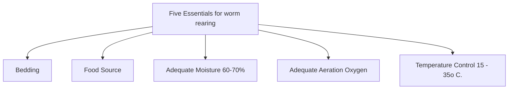
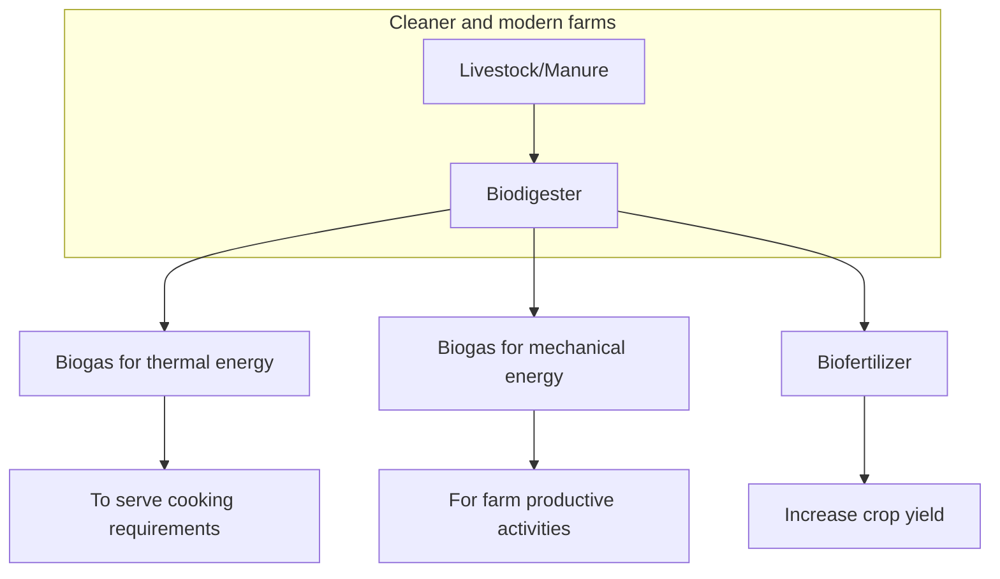
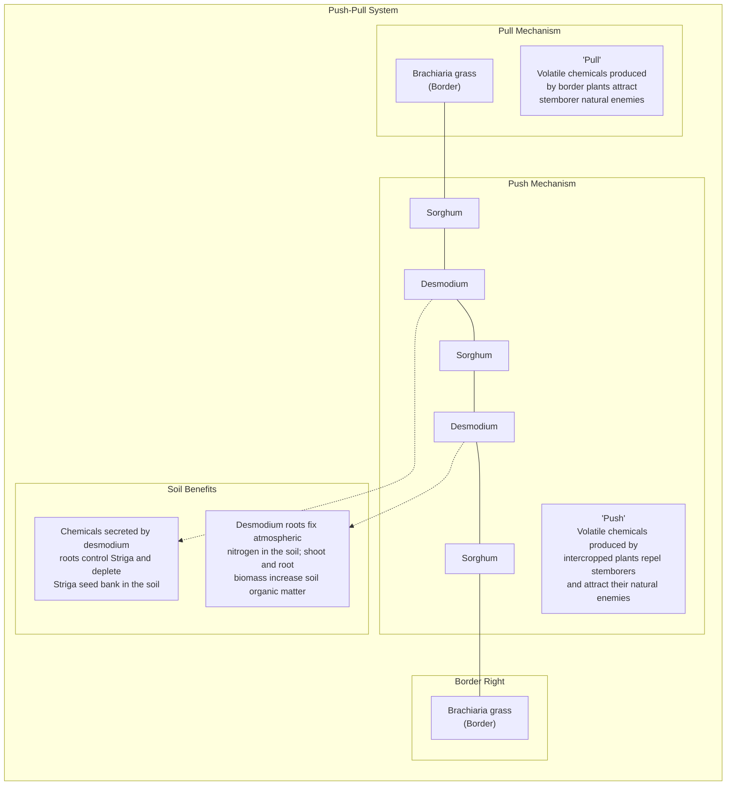

# INTRODUCTION

Soil fertility is fundamental in determining the productivity of all farming systems. Soil fertility is commonly defined in terms of the ability of a soil to supply elements essential for plant growth without a toxic concentration. However, these days, soil fertility is also viewed as an ecosystem integrating diverse soil functions. It is the combined effects of three major interacting components: the chemical, physical and biological characteristics of the soil. The capacity of soils to be productive depends on more than just plant nutrients. The physical, biological, and chemical characteristics of a soil, for example its organic matter content, acidity, texture, depth, and water-retention capacity, all influences soil fertility.

Degraded soils, low soil fertility and absence of sustainable soil fertility management practices are major constraints contributing to low productivity, food shortages and poverty in Ethiopia. Though water is the primary limiting factor to cultivation in most cultivated lands in Ethiopia, soil fertility is a close second.

Major causes of soil fertility decline include topsoil erosion, organic matter depletion and soil acidity. According to IFPRI (2010), the average annual soil loss from agricultural land is estimated to be 137 tons per hectare per year for the Ethiopian highlands, which is approximately an annual soil depth loss of 10-13 mm. Soil acidity and aluminum toxicity is another important challenge affecting soil fertility in Ethiopia. According to Schlede (1989), over 40% of Ethiopian soils are affected by acidity. Out of this total, 27.7 percent are moderate to weakly acidic (pH of 5.5 - 6.7); 13.2 percent are strong to moderately acidic (pH < 5.5) and nearly one-third have an aluminum toxicity problem. Severe organic matter depletion, driven by competing uses for crop residues and manure as livestock feed and fuel is another major cause of low soil fertility.

Looking forward, Ethiopia major challenges of increasing population and increasing food demand necessitates continued gains in both land and labor productivity. Although, in the longer term, climate change is not expected to affect average yields, the incidences of other shocks are expected to increase (Dorosh and Minten. 2020). As agriculture transforms from a relatively low productivity cereal and small-scale livestock farms with low marketed output toward high productivity, soil health and soil fertility improvements are urgently required.

There are two main approaches to improve soil fertility management (Sánchez 1995). One is to manage soil fertility and meet plant requirements through external inputs (inorganic means), while the second (organic means) relies on biological processes of optimizing nutrient recycling, with little emphasis on external inputs, but maximizing the efficiency of their use. A more sustainable middle path that combines the best features of both approaches, Integrated Soil fertility Management (ISFM), is better than either alone. This includes close crop-livestock integration as well as promoting "Conservation Agriculture" (CA) and "Climate Smart Agriculture" (CSA) and "Regenerative Agriculture" (RA) approaches where they are appropriate. For this reason, this updated manual includes discussion on each with additional new modules or sections on, rainwater harvesting, and use of biogas slurry.

# MODULE 1: CONCEPTS OF A HEALTHY SOIL

## 1.1 WHAT IS A HEALTHY SOIL?

> Soil is the cornerstone of food security and agricultural development and its care, restoration, enhancement and conservation is becoming a major global priority. Neglected soils lose fertility that increasingly lowers yields over time. Smallholder farmers, especially those that farm on inherently poor soils and lack the resources to invest in their lands, disproportionately carry the greatest burden. Renewed attention and investment in soils and sustainable land management, however, can reverse the process of degradation. Embracing integrated soil management that builds on local and natural resources, with the appropriate use of targeted inputs and management practices, will provide the care and attention that Africa’s soils need for long term sustainable and productive use (Montpellier Panel, 2014).

A recent “Soil Atlas of Africa” (Jones et al, 2013) highlights soil degradation as a threat to about one quarter of the productive land on the continent. This includes desertification and soil erosion, but most prominent is the decline in soil fertility through loss of nutrients and organic matter under continuous cropping. At the same time, a growing population and the need for social and economic development, along with concerns about climate change, continue to increase demands on agriculture for food, fodder, fuel and fibre. Simply increasing the amount of land dedicated to agriculture is neither desirable nor feasible. Instead we need to think about how we can establish and sustain healthy soil, healthy people and healthy eco-systems. A healthy human population, which includes food and nutritional security, starts from the soil. In creating a healthy soil, it is necessary to consider how Integrated Soil Fertility Management (ISFM) can increase crop health and yields for human benefit. At the same time, managing a healthy ecosystem puts soil in a wider context of managing land and supporting farmers to make improved land use decisions.

A healthy soil, sometimes called a quality soil is described as having favourable physical, chemical and biological functions. Some farmers describe the health of the soil as “the power of the soil”. The concept is similar with animals. If a cow is healthy and fertile, it will produce many calves. The same applies to the soil. A healthy and fertile soil with a good soil structure and a rich base of nutrients with adequate water and energy from light and heat will produce good crops and high yields (Figure 1).

Soils form a living system in which the activities of soil organisms create and enhance soil health and enhance productive capacity. A healthy soil has:

**Good soil structure.** This means the soil is soft and its particles are well structured, providing favorable conditions for plant roots to grow. A good structure also provides air to the roots and helps them to extract nutrients and water from the soil.

**Rich base of nutrients.** This means that all the different nutrients which plants need for good growth are available in the soil.

**Soil micro-organisms.** These carry out the biological processes in the creation of healthy soil, through symbiotic relationships between plant root systems, soil nutrients and soil micro-organisms (Chaparro et al, 2012). Functions undertaken by micro-organisms include decomposition of organic matter, mineralization (or breakdown of soil nutrients), special

chemical changes (such as nitrification), aggregation thus improving soil structure, antibiotic production deterring pathogens, nitrogen fixing and toxin breakdown.

### Figure 1: Ingredients required for a healthy crop

The image illustrates the various environmental and soil-based factors required for a healthy crop, centered around a growing corn plant.

*   **Above Ground Factors:**
    *   Energy, light and heat (from the sun)
    *   Evaporation of water from the plant
*   **Below Ground Factors (Soil):**
    *   Air for the roots
    *   Water of the plant
    *   Support for the roots
    *   Soil micro-organism
    *   Organic matter
    *   Nutrients

Soil is made of rock or mineral particles, organic matter, air and water. Between 2-5% is organic matter, inhabited by millions of living organisms that break down organic compounds and make them available to the plant. The rest of the solid matter comprises rock or mineral particles. The texture of the soil is determined by the type and size of mineral particles, ranging from clay at the smaller end to silt and sand at the largest. The mineral particle size determines the amount of space around each particle. Clay particles are small and tightly packed meaning that clay soils will hold water and nutrients but may suffer from poor drainage and a lack of air needed by plant roots. Conversely, sand particles have pockets of space around them meaning that sandy soils have better aeration and drainage but tend to dry out and for nutrients to be leached.

When a soil is compacted, soil organisms and root growth are restricted, because there is little movement of air and water; hence they are less productive. Healthy soils have a mixture of small and large particles that enable water drainage and storage, particularly important in semi-arid and arid areas.

The three characteristics or components of soil health are: physical, chemical and biological. Soil health refers to the capacity of the soil to perform agronomic and environmental functions. Healthy soils have favourable physical, chemical and biological properties that promote plant health and maintain environmental quality. A healthy soil is ‘fit for purpose’. This means, it is easy to work, friable, holds water and nutrients well and is free draining. It allows for abundant, healthy root growth and good crop establishment.

**Physical soil health.** This refers to the friability and hardness of the soil. A physically healthy soil does not have hard pans or hard setting surfaces. It holds water well, drains well

and does not restrict root growth. Physical health can be assessed in the field by measuring, soil texture, bulk density, soil structure (aggregate stability and porosity), water-holding capacity, infiltration rate, depth to hardpan and depth to water table in the field or laboratory.

**Chemical soil health.** This means that nutrients are in balance and available to the crop, the acidity / alkalinity (pH) is in the desired range and there are no problems with salinity or sodicity. Healthy soils have an optimal amount of nutrients, so that crop growth and yields are maximised on a resilient and sustainable basis (Conway, 2012). The primary nutrients required are nitrogen, phosphorus and potassium, with micro-nutrients also being essential for crop growth. These include zinc, copper, iron, chloride, manganese and molybdenum.

Chemical soil health can be measured by conducting a soil test mainly Cat-ion exchange capacity (CEC), pH, plant available nutrient and electrical conductivity (EC).

**Biological soil health.** This refers to soil life. A healthy soil has more soil organisms than an unhealthy soil of the same type. Crop residues break down easily and the chemical and physical health is better. Biological health can be assessed in the field by checking for organisms and comparing the smell and feel of the soil. A high organic matter or carbon content for your soil type usually means a healthy soil.

Healthy soils lead to healthy crops, and we can maximise health benefits and sustainable intensification by carefully choosing the types of crops grown including legumes, fruit and vegetables. This will help people achieve a well-balanced diet. At the same time, it is important to understand that agricultural production systems interact in many ways from field to farm, and from farm to landscape. How we sustain soil health, human health and food security and healthy eco-systems are some of the most important development questions we need to answer. A healthy soil is a fertile soil and one of the most important foundations where we should start.

## 1.2 MAJOR SOIL FERTILITY PROBLEMS IN ETHIOPIA

Ethiopia faces a wider set of issues in soil fertility beyond chemical fertilizer use, which has historically been a major focus for extension workers, researchers, policymakers and donors. If left unchecked, this wider set of issues concerning soil health will limit future output and growth in agriculture across the country and in some areas, they already limit the effectiveness of chemical fertilizer. These chemical, physical and biological issues interact and mainly include topsoil erosion, organic matter depletion and acidity.

**Topsoil erosion:** This leads to reduced soil water-holding capacity (making it more susceptible to extreme conditions such as drought) and limited crop emergence, growth, yield, and rooting depth. These in turn contribute to a vicious cycle of increased rate of loss of organic matter.

According to Hurni (1993), average soil loss by erosion on cultivated land in Ethiopia was 42 tonnes per hectare per year. Such soil loss through water erosion is always accompanied by losses of essential soil nutrients. Erosion is selective for fine soil particles, which are relatively richer in soil nutrients. In line with this, Stoorvogel and Smaling (1990) and UNDP (2002) reports showed that compared to rates in sub-Saharan Africa, Ethiopia has the highest soil nutrient outflow rates of 60 kg ha−1 (30 kg ha−1 nitrogen and 15–20 kg ha−1 phosphorous), while inflows from fertilizers are very low (<10 kg ha−1). In the long term, such soil nutrient losses by erosion adversely affect soil productivity of the source areas.

**Soil organic matter depletion:** Soil organic matter (SOM) is the organic fraction of a soil. It consists of plant or animal tissue in various stages of breakdown or decomposition. Most soils contain 2-10 percent organic matter.

Soil organic matter plays a critical role in maintaining the fertility of the soil by increasing water holding capacity, reducing surface crusting, increasing cat-ion exchange capacity and acting as a buffer against pH changes in the soil (Pieri 1989, Breman 1998, Powell and Unger 1997). However, organic materials necessary for maintaining soil organic matter are often not available in ample supply, and are often used for competing purposes, such as building material, animal feed, or fuel. Organic inputs can be attractive sources of nutrients in the sense that they are usually produced locally, and it may be less costly to apply than manufactured fertilizer.

Soil organic matter depletion is a widespread problem in Ethiopia. Investigation made by Zeleke et al. (2010) indicates that many soils of the different areas of the country are rated low, concerning their organic matter content. Depletion of soil organic matter is driven by competing uses for crop residues and manure as livestock feed and fuel. Burning of dung cake and crop residues is common due to a lack of widely available and affordable fuel wood. Dung cake has been reported to account for about 50 percent of households' fuel supply, particularly in the north and central highland cereal zones, and in some areas, manure is used as a source of supplementary cash income. Zinash and Seyoum (1989) reported that 63 percent of cereal straws were used for feed, 20 percent for fuel, 10 percent for construction, and 7 percent for bedding.

**Soil Acidity:** When soil pH is lower than optimal (5.5 and below), it can be described as acidic. In this case, the solubility of nutrients needed for growth is reduced leading to deficiency in N, P, K, Mg, Ca and Mo. These conditions also usually lead to Al and Mn toxicity. This has multiple implications for plant growth and other soil fertility issues, such as lack of or reduced response to Ammonium Phosphate and Urea fertilizers, stunted root and plant growth due to nutrient deficiency, increased incidence of disease, and toxicity, such as for Mn, causing black spots and streaks on leaves). Crop yields are frequently reduced by 50 percent and even to total crop failure.

The cause of soil acidity could be the type of parent materials from which the soil is formed, leaching of base forming cations, continuous use of acid forming fertilizers such as Urea and DAP (Cook, 1982). Soil acidity is further aggravated by leaching and continuous removal of basic cations through crop harvest. According to Schlede (1989), over 40% of Ethiopia's soils are affected by acidity, with 28 percent being moderately to weakly acidic (pH of 5.5 - 6.7); 13 percent being strongly to moderately acidic (pH < 5.5) and nearly one-third having aluminium toxicity problems (Schlede, H., 1989). Areas well-known to be severely affected by soil acidity include Ghimbi, Nedjo, Hossana, Sodo, Chencha, Hagere-Mariam, Endibir and Awi Zone of the Amhara regional state (MoARD and MoFED 2007).

### 1.3 THE ESSENTIAL ROLE OF SOIL ORGANIC MATTER IN MAINTAINING SOIL HEALTH

Soil organic matter is the fraction of the soil that includes plant and animal residues at various stages of decomposition; plant roots; cells and tissues of soil organisms; and substances synthesized by the soil population. Fresh or undecomposed plant materials such as litter and straw and animal dung lying on the soil surface are not included in this definition although upon decomposition, these will eventually become part of the soil organic matter.

Organic matter is largely made up of the elements carbon, hydrogen, oxygen, and nitrogen, phosphorus and sulphur. It is expressed as a percentage of the soil mass that is less than two mm in diameter. Soil organic matter is a dynamic mixture that reflects the balance between additions of new organic matter and losses of organic matter already in the soil. It exists in various forms, which differ in their biodegradability or resistance to decomposition and are generally divided into three pools: active, intermediate or slow, and recalcitrant or resistant. The active pool includes microbial biomass and labile organic compounds that make up less than five percent of the soil organic carbon. The slow pool usually makes up 20 to 40 percent. These three pools have different rates of turnover. The active pool ranges from months to years, the slow pool in decades, and the recalcitrant pool in hundreds to thousands of years.

The active and part of the intermediate pools are involved in nutrient supply and in the binding of small soil particles together to form larger structural units called aggregates. Aggregation is important for water infiltration, aeration and drainage, and reduces the soil's susceptibility to erosion. On the other hand, the recalcitrant pool or humus possesses a large quantity of negative charges and contributes largely to the nutrient holding capacity (cation exchange capacity) of the soil. It also imparts a dark colour to topsoil.

The biggest difference between soil and rock is the presence of organic matter and the associated biological activity that takes place in the former. Soil organic matter is at the heart of healthy and productive soils. Although organic matter typically makes up a small percentage of most mineral soils (less than 10 percent by weight), it is especially important because it positively influences or modifies the effects of almost all soil properties. Understanding the role of organic matter in maintaining a healthy soil is essential to ensure a high level of productivity and to minimize the negative environmental impacts of farming activities.

Organic matter serves several functions, the most important of which are as a soil conditioner and as a source of plant nutrients. Organic matter adds body to sandy soils and increases its moisture and nutrient-holding capacity. It promotes granulation in clayey soils which helps in plant root penetration and entry of water and air into the soil. It makes cultivation easier, resulting in better seedbeds and reduced surface crusting that can adversely affect the emergence of seedlings. The functions of soil organic matter are broadly categorized into biological, physical and chemical but they overlap and interact with each other.

**Biological functions:** Organic matter is a food and energy source for soil organisms and a source of plant nutrients. Organic matter decomposition is a microbiological process which releases inorganic forms of nutrients including nitrogen (N), phosphorus and sulphur, which slowly become available for plant use. The humus which develops as an intermediate product of this decomposition also acts as a store for nutrients. Soil organic carbon is generally highly correlated with total N. Therefore, the amount of N mineralization, conversion of organic N compounds to ammonium N, increases as soil organic carbon increases.

Organic matter also provides active absorption sites for the deactivation of organic chemicals such as pesticides, particularly herbicides. Micro-organisms associated with soil organic matter may also rapidly decompose soil-applied organic chemicals.

Adding organic matter to the soil contributes a certain level of carbon from the atmosphere. This is currently an active area of research by scientists concerned with increasing the carbon content of soils to mitigate the adverse effects of climate change and to potentially utilize it in emission trading schemes.

**Physical functions:** One of the major effects of organic matter is improvement of soil structure. Plant roots, earthworms, bacteria, fungi and other micro-organisms release organic compounds which help bind soil particles together to produce stable aggregates. This improves aeration and increases permeability which in turn makes the soil less susceptible to erosion. Stable aggregates also resist compaction caused by ploughing and animal traffic.

Organic substances have been shown to hold up to five times their own weight of water. This contributes to improving the available water-holding capacity of soil, making growing plants less prone to short-term droughts.

**Chemical functions:** Organic matter possesses a high surface area and contains lots of negative charges. These negative charges contribute to the nutrient retention capacity of soils by attracting positively charged ions (cations) in soil such as calcium, magnesium, potassium, ammonium, etc. These would otherwise leach and be lost from the soil profile. It should be noted that negatively charged ions (anions) such as nitrate and sulphate are not held by the negative charges of organic matter and are therefore still subject to leaching loss.

Organic matter acts as a chemical buffer by resisting rapid change in pH. This mechanism delays soil acidification particularly in soils subjected to long-term fertilization with urea and ammonium-containing fertilizers However it may be necessary to apply larger quantities of liming material to raise the pH of an already acidic soil to a desirable level.

The concepts, principles and details of each practice and technology are presented in the modules which follow. Scaling out involves creating adaptive models of each set of practices that will serve as demonstrations for learning and practical advice through the establishment of focal points for farmers, farmer organisations, communities and local government that encourage adoption and further adaptation. In doing so it is essential that both biophysical and socio-economic challenges are understood and addressed. This includes measures that both that address long term trends and protect against future shocks.

*   **Volatilization:** Out of the 23 kg of N added through the urea, 25% is lost through volatilization that is a loss of 5.75 kg.
*   **Leaching:** About 10% of the K added is lost through leaching, thus a loss of 2.37 kg.
*   **Erosion:** Loss of P through erosion is considered negligible since the farm has well-maintained terraces.

After accounting for these losses, the remaining nutrients available to the plant for the one hectare of maize are: 47.75 kg of N, 13.5 kg of P, and 21.33 kg of K.

**Nutrient removal with the maize harvest:** Harvesting maize grain removes nutrients from the farm. Farmers also often remove maize stover for feeding to livestock. One tonne of grain and stover contains 24 kg of N, 4 kg of P and 23 kg of K per ha. Assuming that 4.5 tonnes per hectare of maize grain and stover are harvested, this would remove 108 kg N, 18 kg P and 103.5 kg of K from the farm. Deducting the lost nutrients from those added would leave a negative balance. The results summarized in Table 1, show that there is a net loss of N, P and K. Therefore, the system requires replenishment of the lost nutrients; otherwise the farm's production will decline.

Table 1: Nutrient budget calculation (kg per hectare)

<table>
  <tbody>
    <tr>
        <td>Nutrient</td>
        <td colspan="4">Amount added</td>
        <td>Estimated nutrient losses</td>
        <td>Material removed: grain &amp; stover</td>
        <td>Total used &amp; lost</td>
        <td>Net balance</td>
    </tr>
    <tr>
        <th></th>
        <th>Formula 5</th>
        <th>FYM</th>
        <th>Urea</th>
        <th>Total</th>
        <th></th>
        <th></th>
        <th></th>
        <th></th>
    </tr>
    <tr>
        <td>N</td>
        <td>6.5</td>
        <td>24</td>
        <td>23</td>
        <td>53.5</td>
        <td>5.75</td>
        <td>108.0</td>
        <td>113.75</td>
        <td>-60.25</td>
    </tr>
    <tr>
        <td>P</td>
        <td>7.5</td>
        <td>6</td>
        <td>-</td>
        <td>13.5</td>
        <td>-</td>
        <td>18.0</td>
        <td>18.0</td>
        <td>-4.5</td>
    </tr>
    <tr>
        <td>K</td>
        <td>5.7</td>
        <td>18</td>
        <td>-</td>
        <td>23.7</td>
        <td>2.37</td>
        <td>103.5</td>
        <td>105.85</td>
        <td>-79.80</td>
    </tr>
  </tbody>
</table>

Hence, the farmer should look for and plan for an additional supply, especially for Potassium and Nitrogen. Alternatives to be considered include the use of crop residues, green manures, intercrops with legumes, agro-forestry, biomass transfer from elsewhere on the farm, compost preparation and use.

This example of a nutrient budget emphasizes the importance of both organic and inorganic fertiliser for increased food production. The fertility of some soils can be maintained if good-quality organic fertilisers are available in sufficient quantities, but many soils need the addition of inorganic fertilisers, and sometimes lime to correct the pH to maintain high yields. Farmers relying solely on organic fertilisers face the problem of scarcity of organic materials as well as the variable quality of purchased fertiliser, depending on the source and the way the materials are handled.

## 2.3 SELECTING APPROPRIATE ISFM TECHNOLOGIES

There have been decades of research on soils and experience, which demonstrate that blanket solutions are often not appropriate. The high variability of soils and rainfall means that soils respond to inputs in different ways with distinct variations in input responsiveness. An important lesson is that a highly context-specific approach is required that considers not only the fertility status of the soil and the availability of organic inputs but also the farmer's ability to access and pay for inputs.

Since there are alternative ISFM practices for managing soil, nutrients and water, these should not only respond to a soil nutrient budget deficit, but also take into account household income, labour, and asset ownership (such as livestock, carts and tools), as well as topography, agro-ecology and other farm management priorities. Selected ISFM practices are therefore likely to be site specific and need to be profitable. They are likely to involve both organic and inorganic sources of nutrients and use application techniques that maximise plant uptake and differentiate between different soil types. Mineral fertilisers can be applied in micro-doses with teaspoons or bottle-tops with application rates often varying within a single field. Use and profitability will depend on the availability of input and output markets and the value of farm inputs and products.

In many cases, smallholder farmers already use local adapted integrated approaches to soil management. They may combine purchased fertilisers with manure, with household waste and compost. Learning from these traditional practices will be an important component of improving ISFM.

Given resource constraints of fertility inputs, labour and cash, maximising the agro-economic efficiency of input use must be a critical objective of an ISFM strategy. This is likely to vary within regions, across countries and landscapes, and even between villages and individual fields. Hence, it is important to consider both the socio-economic and biophysical context (Figure 3) in helping farmers to select the measures that best fit their individual circumstances (Scoones, 2014). This will ensure that resources are not wasted, and much needed production boosts will not only be economically viable but also be suitable for the environment for which they are being considered. This ensures that agroecological approach can be adopted.

Four possible scenarios are illustrated in Figure 3 and Table 2 and further addressed showing possible use of organic and inorganic fertiliser. The scenarios are:

i) **High returns - high potential.** On good soils, where socio-economic constraints are less important, then an ISFM focus on inorganic fertiliser use make sense. This is especially the case, where soils are highly responsive to external input of inorganic fertilisers, where they have already high levels of organic matter, and where returns to inputs are significant and perhaps the main factor constraining production. However, this does not mean that there should be blanket recommendations. Other efficiency measures, such as micro-dosing or careful placement are also important. Equally it does not mean that investing in building up organic material is not required. The responsiveness of the soils and the returns to investment in inorganic fertiliser will depend on the organic matter being maintained and not mined.

ii) **High returns - low potential.** On poor soils where socio-economic constraints are also less important, then ISFM should focus on a mixed strategy of organic and inorganic fertiliser use, the mix being dependent on existing soil organic matter levels.

iii) **Poor returns - high potential.** On good soils where there are likely to be poor returns due to socio-economic constraints, organic ISFM options are most appropriate, although efficient application of inorganic fertiliser, such as micro-dosing could still play a role.

iv) **Poor returns - low potential.** In situations where soils are least responsive, due to low organic matter, poor rainfall or a combination of both and where returns to inputs are low, due to high input prices, low prices of farm products resulting from poor market and transport linkages, an integrated and long-term ISFM strategy is essential using a combination of technologies to build organic matter.

Figure 3: Socio-economic and bio-physical context of soil fertility management

<table>
  <thead>
    <tr>
        <th rowspan="2">Socio-economic context Profitability &amp; affordability</th>
        <th>High returns land tenure, market and other production constraints less important</th>
        <th>**<u>(ii) Mixed strategy</u>**  **Organic and inorganic**</th>
        <th>**<u>(i) Application of inorganic fertilisers appropriate</u>**  **Market based but including organic**</th>
    </tr>
    <tr>
        <th>Poor returns due to high input prices, low prices of farm products with poor market and transport linkages</th>
        <th>**(iv) <u>Low external input options</u>**  **Mostly organic**</th>
        <th>**<u>(iii) Efficient application critical</u>**  **Market assisted**  **(such as micro dosing)**</th>
    </tr>
  </thead>
  <tbody>
    <tr>
        <td colspan="2"></td>
        <td>Low potential Low organic matter, low rainfall</td>
        <td>High potential High organic matter, high rainfall</td>
    </tr>
  </tbody>
</table>

**Biophysical context**
***Inherent soil fertility and potential***

Source: Adapted from Scoones, 2014

Table 2: Key socio-economic and biophysical contexts affecting ISFM approaches

<table>
  <thead>
    <tr>
        <th>Socio-economic and biophysical context</th>
        <th></th>
        <th>(i) High returns High potential</th>
        <th></th>
        <th>(ii) High returns Low potential</th>
        <th></th>
        <th>(iii) Poor returns High potential</th>
        <th></th>
        <th>(iv) Poor returns Low potential</th>
        <th></th>
    </tr>
  </thead>
  <tbody>
    <tr>
        <td>Market conditions</td>
        <td>Few constraints</td>
        <td>Few constraints</td>
        <td>Many constraints</td>
        <td>Many constraints</td>
        <td colspan="5"></td>
    </tr>
    <tr>
        <td>ISFM strategies</td>
        <td>Use of inorganic fertilisers appropriate, whilst maintaining SOM</td>
        <td>Mixed strategy of inorganic and organic fertiliser essential to build SOM</td>
        <td>Efficient application of inorganic fertiliser critical whilst maintaining SOM</td>
        <td>Low external input options, mostly organic fertilisers to build SOM</td>
        <td colspan="5"></td>
    </tr>
  </tbody>
</table>

## 2.5 SOCIO-ECONOMIC AND BIO-PHYSICAL CHALLENGES

In considering the possible ISFM strategies, the key socio-economic and biophysical challenges are summarised in Table 3 and expanded in the sections which follow.

Table 3: Key contextual challenges

<table>
  <thead>
    <tr>
        <th>Socio-economic challenges</th>
        <th></th>
        <th>Biophysical challenges</th>
        <th></th>
    </tr>
  </thead>
  <tbody>
    <tr>
        <td>Availability and affordability of inorganic fertilisers</td>
        <td>High variability of soils in any one area, precluding blanket recommendations</td>
        <td colspan="2"></td>
    </tr>
    <tr>
        <td>Other constraints to fertiliser use including poor infrastructure, inappropriate packaging and blending, adulteration etc.</td>
        <td>Variation in soil fertility of different land types due to past management, for example home gardens vs field crop sites</td>
        <td colspan="2"></td>
    </tr>
    <tr>
        <td>High labour requirements for many organic fertiliser options</td>
        <td>Possible soil micro-nutrient deficiencies and soil acidity</td>
        <td colspan="2"></td>
    </tr>
    <tr>
        <td>The need to control free grazing</td>
        <td>Increased drought and variation in rainfall patterns due to climate change</td>
        <td colspan="2"></td>
    </tr>
    <tr>
        <td>Different priorities within the household, for example how limited biomass should be used, women may give priority to home gardens and men field crop sites</td>
        <td>Limited availability of biomass Different perceptions of soils by farmers and scientists</td>
        <td colspan="2"></td>
    </tr>
    <tr>
        <td>Conflicting demands for crop residues between livestock feed and mulching</td>
        <td>Space and time required for long term rehabilitation of badly degraded soils, for example the use of fallows</td>
        <td colspan="2"></td>
    </tr>
    <tr>
        <td>Socio-economic differentiation of households</td>
        <td>A need for increased crop-livestock integration</td>
        <td colspan="2"></td>
    </tr>
  </tbody>
</table>

**Socio-economic challenges include:**

*   **The price of inorganic fertiliser** is key in determining both affordability and profitability and hence the relative balance of different ISFM options. If inorganic fertiliser prices increase, this will shift the context shown in Figure 2 upwards. If prices decrease in the longer term due to reduced oil prices, investment in fertiliser manufacturing and packaging may increase and fertiliser prices decline. The opposite is also true.
*   **Other constraints to fertiliser use** include poor supply infrastructure, inappropriate bag sizes, inappropriate blend/mixes, poor labelling, adulteration, lack of enforceable regulatory systems, and low agronomic efficiency especially when organic matter is depleted.
*   **Limitations in organic soil fertility options** may exist, particularly in already nutrient-poor soils. Rotations, manuring, composting and other "sustainable agriculture" and "low external input" techniques often require considerable labour and skill inputs, as well as large volumes of biomass.
*   **The control of free grazing** and the use of 'cut and carry' or "zero grazing" systems has a major role to play in increasing system productivity. This can help in reducing land degradation through overgrazing and allow for the collection of animal manure and urine.
*   **Household socio-economic differentiation** is important. Different ISFM strategies will be appropriate for different households, depending on their own socio-economic context. This can give rise to intra-household differences over where valued inputs, labour, manure, compost, fertiliser, are placed reflecting a gender-differentiation in ISFM. This is important for targeting within ISFM programmes, for example differentiation between households with different levels of market access. In some areas and for some household's simple market mechanisms, perhaps supporting the growth of agro-dealer networks, may work well. In other areas, focused "smart subsidies" may result in increased farm output leading to more investment in soil fertility inputs. For poorer households, broader-based support may be needed, focusing on providing a social safety net. Experience and much current practice, has not considered this differentiation, opting instead for an easier blanket approach that cannot be implemented my many households.

**Biophysical challenges include:**

*   **The high variability of Ethiopian soils** means that they respond to inputs in different ways. For example, crops on poor sandy soils, with a low clay/soil organic matter content, respond poorly to mineral fertiliser applications. This means that inorganic fertiliser alone may be inappropriate in many areas unless complementary organic measures are also taken.
*   **Variations in the responsiveness of soils** can vary dramatically within a farm and field and even part of a field. ISFM strategies need to be geared to this micro-scale. For instance, micro-dosing with inorganic fertilisers, complemented by organic fertiliser applications, can allow a fine-tuned approach at these micro scales
*   **The limited availability of biomass** remains a key constraint for the wider adoption of ISFM. With both land and labour often being scarce, increasing crop yields, both

grain and residues is required. This necessitates increased use of new varieties, improved crop management together with judicious use of newly developed blended fertiliser.

*   **Distinct variations in input responsiveness across different land types** can often be seen. For instance, home gardens are likely to respond better to inorganic fertilisers than field cropping areas as soil organic matter has built up over time. This means that application of inorganic fertiliser makes sense in some parts of farms, but not on others.
*   **Micro-nutrient deficiencies**, such as Zn, B, Mn or Cu, may be as important as N, P, and K. In such situations getting the right composition, based on local soil testing and blend management, is likely to result in major increases in production. It is for this reason that the newly developed blended fertilisers are an important component of ISFM strategies in Ethiopia.
*   **Climate change.** Reducing rainfall and temperature patterns is especially significant. A drier climate with more variable rainfall patterns and hotter temperatures (as predicted for significant areas of Africa) may make the application of inorganic fertilisers less attractive. In some areas the opposite may happen. This uncertainty about the long-term dynamics of climate change will affect the planning for ISFM programmes. Measures which improve resilience will be important. This includes CA, mulching and cover crops, provided labour is available and the costs are not too high. Close integration of crops with livestock production will have major benefits for soil fertility management.
*   **The need for increased crop-livestock integration**, where livestock can play a vital role in converting poor quality biomass into high quality manure.
*   **Conservation agriculture** approaches can work, but may reduce the availability of crop residues, which are often a critical source of fodder in mixed crop-livestock systems. Problems of weed control may also have to be overcome. Hence CA may be too labour intensive to apply beyond a small area.
*   **Improved fallowing** remains an important strategy for long-term soil restoration in places where land pressures are not intense. Improved fallows, using legumes and trees have been shown to have positive impacts. However, such approaches take time and often require extensive land areas.
*   **Cultural dimensions of soil fertility.** Farmers may not see soils the same way as soil scientists. Their understanding of soils is likely to consider the wider health of soil-plant systems. Hence it is always important to involve farmers in identifying opportunities for soil fertility improvement themselves. Their local knowledge and experiences from past soil fertility interventions will be important in developing future ISFM strategies.

**In conclusion:** Both socio-economic and biophysical challenges need addressing in any ISFM strategy. This includes measures to protect against future shocks and long-term trends. This means that larger-scale ISFM initiatives need to be able to respond to scale variations and be flexible in their design and approach. Also, they need to be supported with participatory approaches building on farmers’ knowledge and incorporating effective soil diagnostic, testing and mapping approaches. Diversity and flexibility in design are keys for achieving long-term resilience and sustainable development.

# MODULE 3: CONSERVATION AGRICULTURE

## 3.1 CONCEPTS AND PRINCIPLES OF CONSERVATION AGRICULTURE

Various improvements in the care and management of soils have become increasingly widespread with the adoption of appropriate forms of minimum or no-till farming systems, now known worldwide as Conservation Agriculture (CA). CA is characterized by three linked principles (FAO, 2017), namely:

*   **Continuous minimal or preferably no mechanical soil disturbance** by seeding directly into untilled soil to maintain soil porosity and minimise loss of soil organic matter.
*   **Permanent permeable ground cover comprised of crop residues** to protect the surface of the soil from the extremes of rain-impact and temperature but also acting as a nutrient and energy source for soil inhabiting organisms.
*   **Diversification of the cropping systems through rotations**, sequences or associations of crops, which minimise the effects and spread of disease organisms, both above and below the soil surface.

CA is a soil management system that is gaining ground worldwide including Ethiopia. FAO, (2017) indicates that CA principles are universally applicable across agricultural landscapes and land uses through locally adapted practices. Also, CA can enhance biodiversity and natural biological processes above and below the ground surface. Soil interventions such as mechanical soil disturbance can be reduced to a minimum or avoided, and external inputs such as agrochemicals and plant nutrients of mineral or organic origin can be applied optimally and in ways and quantities that do not interfere with, or disrupt, the biological processes. At the same time CA can facilitate good agronomy, such as timely operations, improving overall land husbandry. Complemented by other known good practices, including the use of quality seeds, and integrated pest, nutrient, weed and water management, CA can be a base for sustainable agricultural production intensification. It is presently estimated that over 11% of the world's cropped land is under CA (Friedrich et al, 2012).

With these benefits, CA has been increasingly promoted often dominating debates on agricultural development policy across Africa. Over the past decade, large investments have been made on the promotion of CA to smallholder farmers and often such interventions have been hailed as a success. However, the promotion of CA in smallholder farming systems in sub-Saharan Africa remains controversial, reasons being that CA represents a profound change in farm management. Although benefits in reduced erosion and stabilized crop production may be obtained, for various reasons, the CA principles are not always fully implemented by farmers and results not as favourable as expected (Giller et al., 2009 and 2013). Constraints include increased labour demand for weeding when soils are not ploughed. Few smallholder farmers have access to herbicides and crop residues are often highly valued for feeding to livestock rather than leaving as mulch. No-till without mulch can be disastrous, leading to soil capping, and extreme run-off exacerbating rather than controlling soil erosion. These are some of reasons that CA use across Africa, less than 1% of the arable area, is much less than other regions of the World.

Notwithstanding, ISFM technologies are compatible with those embodied within CA, the major difference being that CA is based on no-till practices and a permanent ground cover from the outset. Although these remain important, it is recognised that crop residues used

as ground cover mulch have other important uses such as livestock feed that farmers may value more highly especially in the early adoption of ISFM.

## 3.2 MINIMUM OR ZERO TILLAGE

CA aims to reduce the amount of soil disturbance by tillage to a minimum or preferably zero level and maximise the use of crop residues as a mulch to protect the soil from erosion as well as improving soil structure and soil fertility. Various methods can be considered depending on the resources available to the farmer. These include:

*   Hand planting into residues of previous crops.
*   Opening planting lines into residues of the previous crop using a plough.
*   Planting with a ripper Tyne with a seeder attachment. This could be undertaken using oxen or a tractor, although this requires a special seeder. It is important that planting lines made with the plough or ripper follow the contour to avoid soil erosion.

The advantages and disadvantages of minimum or zero tillage are summarised in Figure 4 and Table 4.

### Figure 4: Advantages of reduced or zero tillage with crop residue mulch for soil surface protection

The figure consists of two comparative illustrations showing the effects of mulch on soil:

**Left Illustration: With Mulch (Reduced/Zero Tillage)**
*   **Layer of Mulch:** A thick layer of organic material covers the soil surface.
*   **Little or no evaporation:** Arrows indicate that moisture is retained under the mulch layer.
*   **Rain Water trapped:** Water is shown soaking into the ground through the mulch.
*   **Result:** Healthy crop growth and protected soil structure.

**Right Illustration: Without Mulch (Conventional Tillage)**
*   **Soil surface exposed to rainfall:** The bare soil is directly hit by rain.
*   **Poor infiltration:** Water does not easily penetrate the compacted or bare surface.
*   **Runoff and Soil erosion:** Water flows over the surface, carrying away topsoil.
*   **Result:** Sparse crop growth and degraded soil.

Table 4: Advantages and challenges of minimum or zero tillage

<table>
  <tbody>
    <tr>
        <td>Advantages</td>
        <td>Challenges</td>
    </tr>
    <tr>
        <th>• Reduction of soil and moisture losses</th>
        <th>• Livestock competition for crop residues</th>
    </tr>
    <tr>
        <th>• Improvement in soil fertility and soil structure through organic matter build up</th>
        <th>• Soil can become hard requiring tillage to loosen the soil</th>
    </tr>
    <tr>
        <th>• Reduced labour and draft animal demand for land preparation</th>
        <th>• Increased weed growth, which can be controlled by judicious use of herbicides</th>
    </tr>
    <tr>
        <th>• Allows crops to be planted earlier and can improve yields</th>
        <th>• May not be suitable for later planting as weeds are well established at time of sowing</th>
    </tr>
    <tr>
        <th>• Improves infiltration and the amount of water held in the soil</th>
        <th>• Pests and diseases can be encouraged through the presence of crop residues</th>
    </tr>
  </tbody>
</table>

Despite huge efforts to promote CA among smallholders, adoption rates in Africa have been modest (Corbeels et al 2014) with farmers usually adapting the three principles to their own conditions. For instance, reduced tillage can lead to increased weed pressure with poor market access and affordability often precluding the use of herbicides, whereas manual weeding increases the demand for human labour. Poor markets may also limit the use of legume crops in rotations or intercropping; combined with farmers’ heavy reliance on cereal crops for household food self-sufficiency, hampering introduction of legumes. Mulching may be hard to apply where crop residues are used as animal feed, especially where biomass is scarce. Farmer prioritization of short-term opportunities is not surprising where food security is a daily struggle. This clashes with the longer-term benefits that CA may bring (Descheemaeker, 2020). Clearly, smallholder farmers need good reason and motivation to adopt CA. Yield improvements are likely to take time and as with other approaches to increasing agricultural productivity, production constraints, farmers’ objectives, and the expected benefits and costs of implementing CA are important aspects that influence adoption. At household and community levels, trade-offs in the allocation of resources become important in determining how CA may fit into local farming systems.

## 3.3 OVERCOMING THE CHALLENGES IN ADOPTING CA

Despite the introduction of CA in many parts of the world, Africa has the lowest uptake with preconditions for its use often not present for smallholder farmers (Brown et al 2018). Reasons given are that farming systems are highly heterogeneous in terms of agroecological, socio-economic, and cultural environments and that opportunities for CA necessarily require local adaptation. In view of high rates of dis-adoption of CA by farmers (Anderson and D’Souza, 2014; Arslan et al, 2014), a fourth principle may be needed to define CA highlighting the equal need for improved soil fertility to increase productivity (Vanlauwe et al, 2014).

Applying the three defining principles of CA alone is insufficient and complementary practices are required to make CA systems effective both in the short and longer term (Thierfelder et al. 2018). These include appropriate nutrient management to increase productivity and biomass; improved stress-tolerant varieties to overcome biotic and abiotic stresses; judicious use of crop chemicals to surmount pest, diseases, and weed pressure; enhanced groundcover with alternative organic resources or diversification with green manures and agroforestry; increased efficiency of planting and mechanization to reduce labour, facilitate timely planting, and to provide farm power for seeding; as well as an enabling political environment with more harmonized and innovative extension approaches to streamline and foster CA promotional efforts.

In fact, a large body of research has now coalesced around the need to use efficiently all the nutrient resources available to farmers. Hence, ISFM plays an important role in overcoming many of the challenges with which CA is faced, especially in the early stages while at the same time ensuring the benefits are retained.

# MODULE 4: INTEGRATED CROP-LIVESOCK MANAGEMENT SYSTEMS

## 4.1 CONCEPT AND PRINCIPLES

Farmers in the Ethiopian Highlands have pursued forms of crop-livestock integration for many generations. A variety of systems exist alongside each other with different degrees of integration and benefit. These include use of manure for improving soil fertility and oxen for land preparation, threshing and weeding.

Building on these traditional crop-livestock systems, incorporating rotational land use, introducing improved fallows, mixed cropping, improved fodder species, specific soil and water conservation measures in combination with agroforestry and more productive livestock breeds, will make traditional systems stronger and more versatile, especially when the improved use of area enclosures can also be included.

Feed shortage and poor quality of available feeds are major factors that have constrained the livestock production sector in Ethiopia. The increasing human and livestock population has resulted in continuous natural resources degradation and decline in productivity. Moreover, drought and natural disasters like flooding have become more frequent in many parts of the country. Despite these constraints, livestock play a major role in the livelihood of most farmers in Ethiopia by providing food to the family, supporting crop production, creating employment opportunities, and contributing to the national economy.

Integrated Crop Livestock Management (ICLM) systems (Figure 5 and Table 4) have the potential to reduce poverty and malnutrition and strengthen environmental sustainability. They can be both environmentally productive and sustainable, providing many opportunities for both recycling nutrients and sustained intensification.

### Figure 5: Integrated Crop Livestock Management Systems

The illustration depicts an integrated farming system including:
*   A traditional homestead with a farmer.
*   Livestock (cattle) grazing and providing manure.
*   Crop production (maize) shown in fields.
*   Harvested crops in sacks labeled "Maize".
*   Inputs such as fertilizer bags labeled "NP" and "NPK".
*   Trees and vegetation representing agroforestry and fodder sources.

ICLM systems creates synergies, making optimal use of resources with the waste products of one component serving as a resource for the other. For instance, manure from livestock is used to improve soil fertility and increase crop production, whilst crop residues and other biproducts, such as grass, weeds and processing waste, can provide supplementary feed for animals. Grass and prunings from agroforestry trees grown on conservation bunds and nitrogen-fixing legumes grown in improved crop rotations, are further potential sources of

biomass and fodder. At the same time livestock provide traction and transport, as well as meat, milk and hides.

### Table 5: Integrated Crop Livestock Management Systems

<table>
  <tbody>
    <tr>
        <td>Arable areas</td>
        <td>Grazing areas including area enclosures</td>
        <td>Livestock</td>
    </tr>
    <tr>
        <th>Crops provide a range of residues and biproducts that can be used by livestock</th>
        <th>Increased and improved grazing through s rotational grazing, leaving periods of recovery of the vegetation</th>
        <th>Oxen provide draft power Manure is provided for maintenance and improvement of soil fertility</th>
    </tr>
    <tr>
        <th>Introduction of forage legumes into crop rotations provides fodder for animals, which can be grazed in situ or conserved as hay or silage</th>
        <th>Introduction of high-value species, including grasses, multi-purpose shrubs and trees for increased biomass production</th>
        <th>Introduction of stall feeding systems, especially for dairy cows in higher rainfall areas, leading to intensification of the whole farming system. This often includes cut and carry grasses such as napier and fodder trees.</th>
    </tr>
    <tr>
        <th>Agroforestry systems such as hedgerows can provide biomass for compost or fodder for livestock</th>
        <th>Eradication or control of invasive species by selective cutting, while encouraging natural regeneration of desirable local species and/or planting new species.</th>
        <th>Livestock provide entry points for the introduction of improved forages into cropping systems. Herbaceous forages can be under-sown annual or perennial crops or trees planted as hedge rows in agro-forestry based cropping systems</th>
    </tr>
    <tr>
        <th colspan="3">The sale of crops, livestock feed and livestock products can provide cash for the purchase of seed fertiliser and other inputs used in crop or livestock production</th>
    </tr>
  </tbody>
</table>

Combining crops and livestock has many environmental benefits, maintaining soil biodiversity, minimising soil erosion, conserving soil moisture and making best use of crop residues. Feed resources provide a direct link between crops and animals with the interactions between the two dictating the integration of the systems. ICLM systems offer a range of solutions to nutrient loss through improved efficiency of nutrient recycling by better utilising manures, crop residues and biomass. Used in combination with increased use of purchased inputs such as seed, fertiliser and livestock fodder, increased production from both crops and livestock can be stimulated. At the same time improved use of area enclosures can further benefit crop-livestock integration.

**Resilience to climate variability:** ICLM systems tend to be relatively well-adapted to climatic variability because of their diversity and flexibility – especially when soil and water conservation, water harvesting, and agroforestry are integrated into the system. Including animals in farm systems increases sustainability and reduces reliance on external inputs. It also facilitates increased carbon storage in the soil. In a case from West Africa, soil receiving manure for five years contained more than one tonne per ha of carbon than soil receiving plant residues alone (Woodfine, 2009 and FAO, 2008). However, the carbon budget of crop-livestock systems can be negatively affected by methane emitted by livestock.

## 4.2 INTEGRATED CROP-LIVESTOCK MANAGEMENT PRACTICES

ICLM Development strategies can support, accelerate, and help integration and intensification of crops and livestock. Management practices include.

**In arable areas:**

*   *Improving the quality of crop residues* that can be fed to livestock. Farmers can paddock animals on arable areas or harvest, store and process the residues. Manure can be used to improve soil fertility and increase production.
*   *Introducing high yielding forage legumes into crop rotations.*
*   *Introducing dual-purpose crops that provide both food and feed.* Significant advances have been made in the development and promotion of dual-purpose legumes and maize.

**In grazing areas:**

*   *Improving grazing management practices.* If grazing is severely degraded due to overgrazing then fencing (social as well as physical) is often a first step, followed by a period of rest. After good regeneration and regrowth, cut-and-carry or controlled rotational grazing, leaving periods of recovery of the vegetation are the management systems that maintain the land's condition.
*   *Planting high-value species.* This includes planting grasses, multi-purpose shrubs and trees for increased biomass production that can be used for fodder and compost.
*   *Eradicating or controlling invasive species.* This involves selective cutting, while simultaneously encouraging natural regeneration of desirable local species.

**For livestock:**

*   *Improving the quality of manure* through improved storage.
*   *Producing fodder for livestock.* Sources of livestock fodder include communal grazing, crop residues grazed in situ or cut and carried from arable or grazing areas and fed to animals close to farmers' homesteads. Other sources include cut grass, weeds, crop thinnings or teff plants on field borders or cut from area-enclosures (Carswell, 2002). This includes forages, grasses and leguminous trees. Fodder trees or shrubs can be introduced into both arable and grazing areas. This often occurs on bunds in arable areas. Live fences can also serve the same purpose. Recent forage options include lablab (*Lablab purpureus*), *Phalaris* and *Brachiaria* grasses, vetch-desho (*Vicia sp - Pennisetum pedicellatum*) or tree Lucerne (*Chamaecytisus palmensis*) -desho grass intercropping, sweet lupine, alfalfa and fodder beet (Africa RISING, 2020).
*   *Improving fodder harvesting and storage practices* to prevent nutrient losses.
*   *Introducing stall-feeding.* This has expanded significantly through the introduction especially in higher rainfall areas of dairy cows, leading to intensification of the whole farming system. This has often included cut and carry grasses such as napier and fodder trees.
*   *Introducing hay or silage making.* This allows the building of fodder reserves or fodder banks for the dry season from surpluses in the rainy season. Storing fodder

helps animals to survive during dry periods without having to overgraze the land. It also provides a buffer in extreme drought when market prices for animals are low.
*   *Utilising animals for field work and transport.* Draft animals, both cattle and equines, provide farmers with power for cultivation and transport. Animals can also be used for water-raising, milling, logging, land-levelling and road construction.

ICLM can be applied in many areas but needs to be adapted and modified to prevailing conditions. Various factors influence the type and effectiveness of crop - livestock interactions, including socio-economic ones such as access to land, labour and capital as well as the biophysical ecological conditions.

### 4.3 PRODUCTIVE USE OF AREA ENCLOSURES

The term "grazing, forest or woodland" enclosure applies to any area under full or partial protection through implementing measures intended to mitigate human and livestock pressures placed on existing common property resources. The current Ethiopian enclosure policy was initiated in the Highland areas, and to some extent has been based on traditional system of land management used by farmers for many years (Carswell, 2002). Measures that have been introduced include:

*   Controlling water runoff and loss of land by erosion, through gully reclamation and control.
*   Increasing water infiltration for water conservation and more soil moisture through stone-wall and ditch construction.
*   Creating favourable conditions for vegetation recovery through natural regeneration through total exclusion of livestock and human use.
*   Developing pastoral areas for livestock fodder and providing woody biomass for local communities through agroforestry schemes.
*   Protecting endangered tree and wildlife species through conservation strategies.

### 4.4 SOCIAL ARRANGEMENTS FOR CROP-LIVESTOCK INTEGRATION

The opportunities and challenges for each practice often depend on households' comparative wealth, access to resources and social status. Alternative pathways are particularly important for women and other marginalised groups, who have limited access to high quality land and other productive resources.

Not all individuals have equal access to livestock, so crop-livestock integration is often differentiated by livestock availability and social status. Typically, households with insufficient production resources look to sharing, paying cash or exchanging labour. For instance, households who do not own a pair of oxen for their own draught power needs often use alternative arrangements. These include:

*   <u>Borrowing or sharing oxen without cost.</u> This is often an arrangement between family or friends or within a church or other community group.
*   <u>Borrowing and using oxen in exchange for labour, cash or land or through harvest sharing arrangements.</u> Similar arrangements may exist for ownership of small stock, where offspring are shared. Such arrangements are often entered into by women seeking to increase their small stock.
*   <u>Sharing profit arrangements.</u> For example, one individual owns or buys the animal and gives it to the other person to manage and use. Ploughing is then shared

between the two. When the animal is sold, the owner may keep all or share the profit. Any costs fall on the person looking after the animal.

Many of these arrangements may also enable households to acquire access to manure.

With regards livestock feed, typical systems include:

*   <u>Group grazing management systems.</u> These may involve several households' livestock, which are herded together and taken out for grazing by each participating household in turn.
*   <u>Paying cash, providing labour or exchanging crop harvest for fodder.</u> This may entail such an arrangement with the owner of a fodder field allowing the payer to cut grass whenever it is needed.

## 4.5 CHALLENGES FACED

Although crop-livestock systems have operated traditionally for many years in the Highlands, there are challenges in encouraging further integration, key being farmer awareness and understanding of the available technologies including the benefits and challenges (Table 6).

Table 6: Challenges faced in promoting integrated crop and livestock management

<table>
  <thead>
    <tr>
        <th>Arable areas</th>
        <th>Grazing areas</th>
        <th>Livestock</th>
    </tr>
  </thead>
  <tbody>
    <tr>
        <td>Integrating fodder legumes and agroforestry in cropping systems in the improvement of local feed systems</td>
        <td>The need for grazing control when improved grasses or legumes are to be introduced</td>
        <td>Appropriate feeding strategies are required to overcome shortages particularly in the dry season</td>
    </tr>
    <tr>
        <td>Assisting communities, more especially poorer households to manage shortages of land and feed</td>
        <td>Regeneration and replanting will require protection from grazing Fencing (physical or social) will be required to control grazing and livestock numbers may need to be limited Poorer households may be disadvantaged by wealthier ones who have more livestock</td>
        <td>Small ruminants play a critical role in the livelihoods of poorer farmers and the landless, who may be dependent for grazing on common property resources Enabling producers, often women to capitalise on rising demand for dairy, small ruminants and other livestock products</td>
    </tr>
    <tr>
        <td></td>
        <td>Skilful organisation and management of animals and the land is required</td>
        <td>Ensuring livestock health is maintained</td>
    </tr>
    <tr>
        <td></td>
        <td>Community rules and regulations need to be agreed and followed, particularly regarding exclusion of some areas from grazing, grazing management and use of other natural resources such as timber</td>
        <td>Promoting markets for livestock products</td>
    </tr>
  </tbody>
</table>

# MODULE 5: ORGANIC FERTILISER PRODUCTION AND USE

## 5.1 CONCEPTS AND PRINCIPLES OF ORGANIC MATTER USE

The biological decomposition of organic matter by micro-organisms (bacteria, actinomyces and fungi) under controlled aerobic conditions into humus results in the production of compost. The process is often referred to as composting. In contrast, fermentation is the anaerobic decomposition of organic matter. The term controlled indicates that the process is managed or optimized to achieve the desired objective (Eliot Epstein, 1997).

During composting, microorganisms in the organic matter consume oxygen while feeding on organic matter. Active composting generates considerable heat, and large quantities of carbon dioxide and water vapour are released into the air. Carbon dioxide and water loss can amount to half the weight of the initial materials. Composting thus reduces both the volume and mass of the raw materials, while transforming them into a valuable soil conditioner.

**Benefits of using organic matter:** Compost as with other organic fertilisers has the unique ability to improve the chemical, physical and biological characteristics of soils or growing media (U.S composting council, 2001).

### Physical benefits

**Improved soil structure:** Composted organic matter can greatly enhance the physical structure of soil. In fine-textured (clay and clay loam) soils, it will reduce the bulk density, improve the friability (workability) and porosity, and increase the soil’s gas and water permeability, thus reducing erosion. When used in sufficient quantity, the addition of organic matter has both an immediate and long-term positive impact on soil structure. It reduces compaction in fine textured soils and increases water holding capacity and improves soil aggregation in coarse-textured (sandy) soils. The soil binding properties of organic matter are due to its humus content. Humus is a stable residue resulting from a high degree of organic matter decomposition. The constituents of humus acts as a soil ‘glue’ holding soil particles together, making them more resistant to erosion and improving the soil’s ability to hold water.

**Improved moisture holding capacity:** Humus is a dark brown or black soft spongy substance that holds water and plant nutrients. One kilogram of humus can hold up to six litres of water with compost able to absorb water 4-7 times its own weight. Hence, compost application is one of the best “hidden” water harvesting methods available. Studies have shown that every 0.5% increase of organic matter in soil can conserve 80,000 litres of water over one hectare of farmland. Since the water crisis in agriculture is a major problem globally, this can be addressed locally by enhancing the soil organic matter.

### Chemical benefits

**Modifies and Stabilizes Soil pH:** The addition of organic to soil may modify the pH of the final mix. Depending on the pH of the organic matter and the local soil, organic matter addition may raise or lower the pH of the soil/organic matter blend. Therefore, an addition of a neutral to slightly alkaline organic matter to an acidic soil will increase soil pH if added in appropriate quantities.

**Increases Cation Exchange Capacity:** Organic matter will also improve the cation exchange capacity of soils, enabling them to retain nutrients longer. It will also allow crops to utilize nutrients more efficiently, while reducing nutrient loss by leaching. For this reason, the fertility of soils is often tied to their organic matter content. Hence improving the cation exchange capacity of sandy soils by adding compost can greatly improve the retention of plant nutrients in the root zone.

**Provides nutrients:** Organic products contain a considerable variety of macro and micro-nutrients and are therefore a good source of major, macro and micronutrients. Since compost contains a relatively stable source of organic matter, these nutrients will be supplied in a slow-release form. However, on a kilogram-by-kilogram basis, large quantities of nutrients are not typically found in organic fertilisers in comparison to most commercial fertilizers. However, they are usually applied at much higher rates; therefore, they can have significant cumulative effect on nutrient availability. The addition of organic matter can affect both fertilizer and pH adjustments (lime addition). Organic matter not only provides some nutrition but can often make current fertilizer programs more effective.

### Biological benefit

**Provides soil biota:** The activity of soil organisms is essential in healthy and fertile soils and for productive plants. Their activity is largely based on the presence of organic matter. Soil micro-organisms include bacteria, protozoa, actinomycetes, and fungi. Not only are they found within well composed organic matter, but also within the soil media. Micro-organisms play an important role in organic matter decomposition which, in turn, leads to humus formation and increasing nutrient availability. Micro-organisms can also promote root activity as specific fungi work symbiotically with plant roots, assisting them in the extraction of nutrients from the soil. Sufficient levels of organic matter also encourage the growth of earth worms, which through tunnelling, increase water infiltration and aeration.

**Controls weeds and plant diseases:** When weeds are used as a source of organic matter in making compost, the high temperature of the compost making process will kill many of the weed seeds. Even the seeds of the noxious weed, *Parthenium*, can be killed when it is made into compost. When crop residues are used to make compost, many pests and diseases cannot survive to infect the next season’s crops.

## 5.2 INCREASING AND MAINTAINING SOIL ORGANIC MATTER CONTENT

Raising and maintaining soil organic matter to desirable levels is crucial to sustainable land management, as it retains nutrients for plant use, reduces the runoff rate and the hazard of erosion, and improves the physical condition of the soil. Broadly speaking, soil organic matter can be increased by increasing inputs of organic materials and/or decreasing losses. However, most organic matter added to the soil will rapidly decompose to carbon dioxide gas through the process of microbial respiration and will not become part of the soil organic matter. In general, only about 5 to 15 percent of applied carbon to soil eventually becomes soil organic carbon. Therefore, large amounts of organic matter need to be added to soil to increase its organic carbon content in the long term. Periodic application of organic matter is required to maintain desirable levels. The key to organic matter management is to strike a balance between additions and losses so that a significant decline is avoided. Recommended practices for raising or maintaining soil organic matter are shown in Table 7.

Table 7: Recommended practices for raising or maintaining soil organic matter

<table>
  <tbody>
    <tr>
        <td>Increasing inputs of organic materials</td>
        <td>Reducing organic matter losses</td>
    </tr>
    <tr>
        <th>Apply organic materials to soil: apply manure, add plant residues, apply compost and vermi-compost, apply green manures, pruning’s or mulch</th>
        <th>Minimize soil erosion: Erosion removes organic matter contained in topsoil. Maintaining good vegetative or ground cover to protect soil from erosion will ensure that valuable topsoil and organic matter are conserved.</th>
    </tr>
    <tr>
        <td>Retain crop residues: Crop residues such as straw and maize or sorghum stalks should be incorporated into the soil or left on the soil surface to decompose whenever possible.</td>
        <td>Avoid overgrazing: Overgrazing leads to reduction of biomass and therefore productivity. Overgrazing also increases the area of bare ground making the surface soil more prone to erosion. Lower biomass means low input of organic matter to the soil.</td>
    </tr>
    <tr>
        <td>Grow cover crops: Growing cover crops rather than leaving the land fallow during the dry season using residual moisture or belg rains increases organic matter and adds carbon to the soil.</td>
        <td>Reduce tillage operations when possible: Because excessive tillage accelerates organic matter decomposition and makes soils susceptible to erosion, the adoption of minimum tillage becomes important in reducing organic matter loss.</td>
    </tr>
    <tr>
        <td>Include a pasture phase in arable cropping: Grasses and legumes are regarded as soil builders because their root residues add active organic matter to the soils. They will help return the paddock to either long-term or short-term pasture depending on the degree of soil degradation.</td>
        <td>Manage decomposition rates: Encourage soil organisms (e.g. worms, beetles) to enhance the burial and incorporation of plant litter into soil aggregates to protect organic matter from loss by decomposition. Living shelterbelts with deep roots will capture and sequester carbon at deeper soil layers.</td>
    </tr>
  </tbody>
</table>

## 5.3 REQUIREMENTS FOR MAKING CONVENTIONAL COMPOST

Composting is most rapid when conditions that encourage the growth of the microorganisms are established and maintained. The most important conditions include: the climate, the carbon to nitrogen ratio, aeration, moisture, material size and turning. All are vital to the composting process. Let’s take a closer look at each one:

**Climate:** Composting can have finished within a short period of time when outside temperature (day and night) is at least 15.5ºC. Composting can occur between 4.4ºC and 15.5ºC, but in this situation it will take a little longer. The composting process stops when the temperature consistently drops below 4.4ºC. This signals the end of the composting season, although it is sometimes possible to extend the composting season by covering the unit at night or by moving it into a protected area.

**Carbon/Nitrogen Ratio:** Any compost heap, whether using a fast method or a longer slower process, must begin with a good balance of materials. The basic makeup of the start material will determine both the effectiveness and speed of the decaying process. The materials also establish the nutrient content of the finished compost.

Do not try to make compost with just one ingredient. The decomposition process requires a proper mix of carbon and nitrogen – the C/N ratio – and that ratio is rarely, if ever, found in one material alone. Micro-organisms, which are the decomposers, need carbon for energy and nitrogen for growth and multiplication. Materials high in carbon are generally brown and dry, while materials high in nitrogen are usually fresh and green.

If there is not enough nitrogen, your organic waste could sit for years without even starting to decompose. On the other hand, too much nitrogen can result in the production of ammonia gas that leaks out and disappears into the air, easily detected by its smell.

The mixture of materials in the compost pit or heap should have a carbon to nitrogen ratio of 30 to 1. A 1 to 1 volume of dry and green materials approximates the 30 to 1 ratio of carbon to nitrogen. Hence, equal volumes of carbon rich, naturally dry materials (dead leaves, dried grass, straw) and nitrogen rich green plant materials (grass clippings, weeds, fresh garbage, fruit and vegetable waste) can be mixed.

Table 8: Nitrogen and carbon content of some selected composting materials

<table>
  <tbody>
    <tr>
        <td>Type of composting material</td>
        <td>Nitrogen content (%)</td>
        <td>Carbon-to-Nitrogen ratio (C:1N)</td>
    </tr>
    <tr>
        <th>Urine</th>
        <th>15–18</th>
        <th>0.8:1</th>
    </tr>
    <tr>
        <th>Blood</th>
        <th>10–14</th>
        <th>3:1</th>
    </tr>
    <tr>
        <th>Horn</th>
        <th>12</th>
        <th>not found</th>
    </tr>
    <tr>
        <th>Bone</th>
        <th>3</th>
        <th>8:1</th>
    </tr>
    <tr>
        <th>Chicken manure</th>
        <th>3–6</th>
        <th>10–12:1</th>
    </tr>
    <tr>
        <th>Sheep manure</th>
        <th>3.8</th>
        <th>not found</th>
    </tr>
    <tr>
        <th>Horse and donkey manure</th>
        <th>3.8</th>
        <th>25:1</th>
    </tr>
    <tr>
        <th>Manure in general</th>
        <th>1.7</th>
        <th>18:1</th>
    </tr>
    <tr>
        <th>Farmyard manure (FYM)</th>
        <th>2.15</th>
        <th>14:1</th>
    </tr>
    <tr>
        <th>Maize stalks and leaves</th>
        <th>0.7–0.8</th>
        <th>55–70:1</th>
    </tr>
    <tr>
        <th>Wheat straw and chaff</th>
        <th>0.4–0.6</th>
        <th>80–100:1</th>
    </tr>
    <tr>
        <th>Fallen leaves</th>
        <th>0.4</th>
        <th>45:1</th>
    </tr>
    <tr>
        <th>Young grass hay</th>
        <th>4</th>
        <th>12:1</th>
    </tr>
    <tr>
        <th>Grass clippings</th>
        <th>2.4</th>
        <th>20:1</th>
    </tr>
    <tr>
        <th>Straw from peas and beans</th>
        <th>1.5</th>
        <th>not found</th>
    </tr>
  </tbody>
</table>
Sources: Dalzell and Riddlestone (1987), Gershuny and Martin (1992)

**Aeration:** Since decomposition is a burning process, a good supply of oxygen is necessary to keep it going. Turning the material in a compost heap to make sure enough air gets to the burning core is an important part of the process.

The source of heat in an active compost heap is greatest at its centre, so each time the mixture is turned, it exposes more particles to the heat, therefore creating faster decomposition.

**Moisture content:** Composting works best if the moisture content of the pile is about 50% moist, not soggy. Too much moisture slows decomposition and produces a disagreeable smell due to the activity of methane producing microorganisms. If the organic material is too dry, decomposition will be slow or may not occur at all. One way to gauge the moisture level is to squeeze a handful of the material in your fist. If it does not stick together to form a ball, there is not enough moisture. If liquid squeezes out, there is too much. Check your heap or pit regularly for moisture content. If it is too dry, sprinkle it with a watering can, to restore the moisture content. If there are signs of too much moisture (especially foul smells), add dry materials such as leftover straw or shredded dead leaves to absorb the excess moisture.

**Material Size:** Materials decompose best if it is between one and four cm in size. Soft succulent tissues do not need to be chopped into small pieces, but hard tissues should be reduced to smaller pieces in order to decompose rapidly. Breaking or shredding the materials in the compost has two effects. It increases the surface area of the materials and it breaks or bruises the skin of the plant. This allows decomposers a place to enter and results in a much faster breakdown – the smaller the pieces, the faster they will decompose.

**Turning:** A compost pile needs to be turned to prevent it from overheating and aerates and thoroughly mixes the materials. If the internal temperature of the pile exceeds 710C, the necessary microorganisms are killed, the pile cools, and the whole process of composting must start again from the beginning.

Turning is done to move the materials at the outer edge to the centre of the pile. This way, all the material reaches the optimum temperature at various times. Due to heat loss around the margins, only the central portion of the pile is at optimum temperature.

**Time needed for composting:** The longer the interval between turnings, the longer it takes for the compost to be ready. If the material in the pile is turned every day, it takes 2 weeks or little longer to compost. If turned every other day, it takes about 3 weeks.

Once a pile is started, do not add additional material. It takes a certain time for each material to break down, and any addition to the pile starts the decomposition process later than the original materials, thereby lengthening the decomposition time for the whole pile.

**Trouble shooting:** If managed correctly, a pile heats to a high temperature within 24 to 48 hours. If it does not, the pile is too wet, too dry, or there is not enough green material (or nitrogen) present. If too wet, the materials should be spread out to dry. If too dry, add water until the pile is evenly moist. If neither of these conditions exists, then the nitrogen level is too low (the carbon to nitrogen ratio is too high). This can be corrected by adding materials high in nitrogen, such as green materials or fresh manure from livestock.

If the carbon to nitrogen ratio is less than 30 to 1, the organic matter decomposes very rapidly, but loss of nitrogen occurs, producing an ammonia gas. If an ammonia odour is present in a composting pile, it means that valuable nitrogen is being lost in the air. Nitrogen loss can be counteracted by the addition of carbon rich materials to the pile.

Composting can be done at any time of the year, but it is influenced by the ambient temperature and rainfall. A low ambient temperature slows microbial activity, so it may take longer for the compost pile to heat. During the rainy season, it may be necessary to cover the pile to keep the composting material from becoming too wet.

**Signs of Healthy Compost:** Rapid decomposition can be detected by a pleasant odour, by the heat produced (this can be demonstrated by water vapour during the turning of the heap),

by the growth of white fungi on the decomposing organic material, by reduction in the volume of the heap, and by the material changing to a dark brown colour.

As composting nears completion, the temperature drops and, finally, little or no heat is produced. The compost is then ready to use.

### Table 9: Materials for composting

<table>
  <thead>
    <tr>
        <th></th>
        <th colspan="3">Type of Material</th>
    </tr>
    <tr>
        <th>Dry and green plant material</th>
        <th>Animal material</th>
        <th>Water</th>
        <th></th>
    </tr>
  </thead>
  <tbody>
    <tr>
        <td>Weeds, grasses and any other plant materials cut and collected from fields  Wastes from cleaning grain, cooking and cleaning the house and compound, making food and different drinks, particularly coffee, tea, home-made beer, etc.  Crop residues: stems, leaves, straw and chaff of all field crops – both big and small – cereals, pulses, oil crops, horticultural crops and spices, from threshing grounds and from fields after harvesting.  Garden wastes – old leaves, dead flowers, hedge trimmings, grass cuttings, etc.  Dry grass, hay and straw left over from feeding and bedding animals.  Stems of cactus, such as prickly pear (crushed or chopped up).</td>
        <td>Dung and droppings from all types of domestic animals, including from horses, mules, donkeys and chicken, from night pens and shelters, or collected from fields.  Urine from cattle</td>
        <td>Enough water is needed to wet all the materials and keep them moist,  Source: Rainwater, Wastewater Animal urine</td>
        <td></td>
    </tr>
  </tbody>
</table>

---

## 5.4 CONVENTIONAL COMPOSTING METHODS

There are two basic methods of making compost: the **heap method**, and the **pit method, both referred to as piling methods**. The only difference between the two is that the heap is built above the ground, while the pit method requires digging of large pits. The heap method of composting is suitable for high rainfall areas, irrigated areas and during the rainy season and does not require expenditure and is easy to manage. In areas where there is scarcity of moisture and during the dry season, the pit method of composting is used.

**Piling:** The compost heap or pit is built up of layers of materials, like in a big sandwich. These materials are dry plant materials, green plant materials and animal manure. The basic sequence is:

**Layer 1:** A layer of dry plant materials 20–25 cm thick, i.e. as deep as a hand. Water or manure slurry should be sprinkled with a watering can evenly over this layer. The layer should be moist but not soaked.

**Layer 2:** A layer of moist (green) plant materials, either fresh or wilted, e.g. weeds or grass, stems and leaves left over from harvesting vegetables, damaged fruits and vegetables. Leafy branches from woody plants can also be used if the materials are chopped up. The layer should be 20–25 cm thick. Water should not be sprinkled or scattered over this layer.

**Layer 3:** A layer of animal manure collected from fresh or dried cow dung, horse, mule or donkey manure, sheep, goat or chicken droppings. The animal manure can be mixed with soil, old compost and some ashes to make a layer 5–10 cm thick. If there is only a small quantity of

animal manure, it is best to mix it with water to make slurry, and then spread it over as a thin layer 1–2 cm thick.

Layers are added to the heap in the sequence, Layer 1, Layer 2, Layer 3, until the heap is about 1–1.5 meters tall. The layers should be thicker in the middle than at the sides so the heap becomes dome shaped. If the heap is much taller than 1.5 meters, the microbes at the bottom of the heap will not be able to work well. Layers 1 and 2 are essential to make good compost, but Layer 3 can be left out if there is a shortage or absence of animal manure.

It is important to place one or more ventilation and/or testing sticks vertically in the compost heap/pit. The stick should be long enough to stick out of the top of the heap. Ventilation and testing sticks are used to check if the decomposition process is going well, or not. A hollow stick of bamboo grass (*Arundo donax*) or bamboo makes a good ventilation stick as it allows carbon dioxide to diffuse out of and oxygen to diffuse into the heap. A testing stick can be taken out at regular intervals to check on the progress of decomposition in the heap.

**Pit composting:** The pit method is best done at the end of the rainy season or during the dry season. If the pit method of compost preparation is made during the rainy season or in very wet areas, water can get into the bottom of the pit. This will rot the materials producing a bad smell and poor-quality compost. Poor quality compost will not be productive, and this can discourage farmers and others from trying to make better quality compost. In wet areas, it is better to make compost through the heap method.

**Site and pit dimension:** The site should be accessible for receiving the materials, including water and/or urine, and for frequent watching/monitoring and follow-up. The site should be protected from high rainfall, flooding, strong sunlight and wind. A temporary shed may be constructed over it to protect the compost from heavy rainfall. The pit should also be marked or have a ring of stones or small fence around it so that people and animals do not fall into it. The pit should be about 1 m deep, 1-2 m wide and of any suitable length. Pits should not be deeper than 1 meter, because it can be cold at the bottom and the micro-organisms cannot get enough oxygen to work properly.

**Filling the pit:** Before the pit is filled, the bottom and sides should be plastered with a mixture of animal dung and water (slurry). If animal dung is not available, a mixture of topsoil and water can be used. The plastering helps to seal the sides of the pit so that moisture stays in the compost making materials. Then the compost pit is filled with layers of materials, like in a big sandwich. The basic sequence is as described on 4.3.

**Turning:** The material is turned three times during the period of composting; the first time within ~30 days after filling the pit, the second after another 30 days and the third after another month. At each turning, the material should be mixed thoroughly, moistened with water, and replaced in the pit.

**Heap composting:** This method of composting is usually used in high rainfall areas, irrigated areas and during the rainy season.

**Site and heap dimensions:** The site should be accessible for receiving the materials, including water and/or urine, and for frequent watching/monitoring and follow-up. It should also be protected from high rainfall, flooding, strong sunlight and wind, e.g. in the shade of a tree, or on the west or north side of a building or wall.

The basic heap dimension is about 2 m wide at the base, 1.5 m high and 2 m long. The sides are tapered so that the top is about 0.5 m narrower in width than the base. A small bund is sometimes built around the pile to protect it from wind, which tends to dry the heap.

**Forming the heap:** The compost heap is built up of layers of materials, like in a big sandwich. The basic sequence is as described in section 5.4.

#### Figure 6: Piling methods (pit and heap)

**Dimension of Pits**

<table>
    <tr>
        <th>aerial view</th>
        <th>Cross section</th>
    </tr>
    <tr>
        <td>[colspan=2] The diagram shows two pits (Pit 1 and Pit 2) in aerial view, each 2m wide and together 4m long. A cross section view shows a pit depth of 1-1.5 m.</td>
    </tr>
</table>**Cross section of pits showing layers**
The diagram illustrates a pit filled with layers of organic material, covered with straw, and featuring a wooden stick for aeration.
*   **- - - - -** Dry plant material
*   **............** Green plant material
*   **_ _ _ _ _** Animal manure

**Cross section of a compost heap**
The diagram shows a heap 1.5m high and 2m wide at the base. It contains repeating layers of material, each approximately 15 cm thick, with wooden sticks inserted for aeration.
*   **- - - - -** Dry plant material
*   **............** Green plant material
*   **_ _ _ _ _** Animal manure

## 5.5 FARMYARD MANURE

Farmyard Manure (FYM) is an important source of organic nutrients for many farmers. Its use is a well-established nutrient and land management practices undertaken by farmers in Ethiopia. It is the oldest and most widely practiced means of nutrient replenishment, which can be used on its own or be an important addition to plant-based composts. It is a valuable source of organic matter as well as major soil nutrients such as nitrogen (N), phosphorous (P), potassium (K), calcium (Ca), sulphur (S), and magnesium (Mg). It can also be a source of micronutrients such as boron (B), copper (Cu), chlorine (Cl), nickel (Ni), cobalt (Co), iron (Fe), manganese (Mn), zinc (Zn), and molybdenum (Mo).

Although use of FYM is a well-established management practice, many farmers still underestimate its value. In some places, FYM is thrown around the homestead. Due to lack of appreciation, it may not be recognized as a source of nutrients and organic matter. In some areas with limited fuel sources, dried FYM is used as a cooking fuel. By burning FYM, large quantities of organic matter and nutrients are lost from agricultural systems. On the other hand, many farmers do not own animals, and consequently do not have access to FYM.

**Quality of FYM:** The quality of FYM depends on what animals have eaten. If they have been fed with poor-quality forage or grazed on poor soils, their manure will be of poor quality. If they have been fed good-quality feed, the manure will be rich in nutrients.

The type of animal also influences its quality because different species of animals eat different things (Table 10). In general, manure from pigs and poultry is of better quality than manure from goats and cattle. It is possible to enrich cattle manure by mixing it with manure from other types of animals.

Table 10: Nutrient content of manure from different sources

<table>
  <thead>
    <tr>
        <th>Manure</th>
        <th></th>
        <th>Moisture %</th>
        <th></th>
        <th>% N</th>
        <th></th>
        <th>% P₂O₅</th>
        <th></th>
        <th>%K₂O</th>
        <th></th>
        <th>%CaO</th>
        <th></th>
    </tr>
  </thead>
  <tbody>
    <tr>
        <td>Farmyard manure</td>
        <td>38 - 54</td>
        <td>0.5 – 2.0</td>
        <td>0.4 –1.5</td>
        <td>1.2 – 8.4</td>
        <td>0.3 – 2.7</td>
        <td colspan="6"></td>
    </tr>
    <tr>
        <td>Cattle dung</td>
        <td>34 - 40</td>
        <td>1.7 – 2.0</td>
        <td>0.5 –3.7</td>
        <td>1.3 – 2.5</td>
        <td>0.9 – 1.1</td>
        <td colspan="6"></td>
    </tr>
    <tr>
        <td>Sheep and goat droppings</td>
        <td>40 - 52</td>
        <td>1.5 – 1.8</td>
        <td>0.9 – 1.0</td>
        <td>1.4 – 1.7</td>
        <td>0.9 – 1.0</td>
        <td colspan="6"></td>
    </tr>
    <tr>
        <td>Pig manure</td>
        <td>35 -50</td>
        <td>1.5 – 2.4</td>
        <td>0.9 – 1.0</td>
        <td>1.4 –3.8</td>
        <td>1.3 –1.5</td>
        <td colspan="6"></td>
    </tr>
    <tr>
        <td>Poultry manure</td>
        <td>10 - 13</td>
        <td>2.3 – 2.5</td>
        <td>2.3 – 3.9</td>
        <td>1.0 – 3.7</td>
        <td>0.6 – 4.0</td>
        <td colspan="6"></td>
    </tr>
  </tbody>
</table>

Another factor which affects quality is storage and handling conditions. FYM storage and handling practice by farmers is sometimes poor. If it is stored in the open and exposed to rain, many of the nutrients will be washed away. Nutrient and carbon losses during manure storage vary substantially. Nitrogen losses for example may vary from less than 10% to about 90%. Nitrogen losses tend to be lower for more compact and anaerobic manure storage systems.

**Improved manure management:** The following management options are helpful to consider for improvement of manure quality:

Manure can be improved through feeding a high-quality combination of fodder, such as straw / napier grass and *Sesbania sesban*, *Calliandra* and *Leucaena* to animals.

Manure should be allowed to age (mature) for at least 3 months before being used.

Using manure in compost: To improve both the quality and quantity of compost, farmers should be encouraged to use FYM in their compost. Composting is a way to use manure that will increase its value, kill parasites, and weed seeds, and decrease the volume of waste. It can also help to stabilize the nitrogen.

To minimize nutrient losses, the FYM should be protected from sun, wind and rain. This can be done by covering the manure heap with a polythene film. Farmers can also use locally available covering materials or shades to improve FYM storage conditions. Storing FYM in pits is particularly suitable for dry areas and dry seasons.

In areas with limited fuel sources, dried manure is used as a cooking fuel. An alternative fuel source can be created by planting trees for firewood as living fences.

Since many farmers do not own animals, nor have access to FYM, growing animal feed and integrating livestock into the farm not only provides milk and or meat and other animal products, but also some animal manure.

## 5.6 RAPID COMPOSTING VERMI-CULTURE AND VERMI-COMPOST

While traditional composting procedures take as long as 4-8 months to produce finished compost, rapid composting methods offer possibilities for reducing the processing period to three weeks.

Vermicomposting is a fast method of preparing enriched high-quality compost with the use of earthworms. It is one of the easiest methods to recycle agricultural wastes and to produce quality compost. Earthworms are valued by farmers because, in addition to aerating the soil, they digest organic matter and produce castings that are a valuable source of humus. Vermi-composting, or worm composting is a simple technology that converts biodegradable waste into humus with the help of earthworms.

The process of vermicomposting is inseparable from vermiculture. This requires continuous breeding of earth worms in boxes for production of high-quality compost. The earthworm is the primary product, while the vermi-compost is a valuable by-product, with the primary objective of the vermi-composter being the production of vermi-compost. Vermi-compost is the excreta of earthworm, which is rich in humus.

## Culturing of earth worms

Vermiculture is continuous breeding of earth worms to produce a continuous supply of high-quality compost. The goal is to frequently increase the number of worms to attain a sustainable yield. The worms can either be used to expand the Vermicomposting operation or sold to customers, who can use them for the same or other purposes.

There are an estimated 1800 species of earthworm worldwide. The most common types of earthworms used for vermicomposting are brandling worms (*Eisenia foetida*). This is commonly known as: the "compost worm", "manure worm", "redworm", and "red wiggler" (Figure 7). *Eisenia fetida* are extremely tough and adaptable worms. It is indigenous to most parts of the world and is often found in aged manure piles. They are 0.8 cm to 1.6 cm in length with varying physical characteristics, reddish/purple to dark purple in colour and with a yellow tail tip.

**Figure 7: Vermi-worms**

The image shows two photographs of vermi-worms. The left photograph displays several reddish-brown earthworms on a plain light background. The right photograph shows a person's hands holding a clump of dark, moist soil and organic matter teeming with numerous small red worms.

Earthworms are hermaphrodites. This means that they produce both eggs and sperm (*CSSWMD, 2010*), although they need another worm to mate. If the worm has a large swollen band (clitellum), it is a mature worm. The clitellum produces mucus that allows two worms to join. Once joined, the worms pass sperm from each other to a sperm storage sac. After they detach, a cocoon (eggs) is formed on the clitellum. Baby worms will hatch from the cocoons in approximately 3 weeks (Figure 8). Baby worms can become adults in 3 to 5 months. Cocoons are lemon shaped and about the size of a match head (*Sherman, et. al, 2003*). About 10 baby worms are produced per week from a mature worm (*CIWWB, 2004*).

Figure 8: Stages in the reproduction of the worms

The image shows three stages of worm reproduction: two worms mating, a collection of yellowish-brown worm cocoons, and a newly hatched baby worm emerging from a cocoon.

Figure 9: Worm bins with bedding

The image shows two examples of worm bins: a wooden box filled with straw bedding and two people watering a long, raised worm bed lined with plastic.

### Earth worm culturing procedures

*   **Build or purchase a worm bin.** The worm bin is the enclosure in which the worms will live; it holds in the bedding and food scraps, regulates the amount of moisture in the bedding, and blocks light (which is harmful to worms). Worm bins can be made from plastic or wooden. In Ethiopia, wooden boxes are preferred because they are more absorbent and provide better insulation. The preferred size is 50 cm (length) x 50 cm (width) x 20 (height) cm with holes (0.5 cm diameter on the top, bottom and sides of the bins). A bin about 30 cm high by 60 cm wide by 1m long, together with about 6000 worms will be able to process about 25-50 kg of waste weekly. Make sure that there is good drainage in the containers, so the worms do not drown (Figure 9).
*   **Collect red earthworms.** Indigenous red earthworms which are used for vermi-composting can be collected from moist, organic rich environments, such as under logs or manure piles in areas where wet animal droppings have laid for days, under rotten logs, under forest litter or decomposed mulch. In identifying the red earth worms it is good to notice the growth stages. Baby worms are transparent and whitish, with a size less than 1.2 cm to 2.5 cm (Dickerson, 2001). If the worm goes deeper beyond the bedding material, it may not be the right kind of earth worm, a "surface dweller"

*   **Prepare the worm bedding:** The bedding is the material that the worms will live in. It can be made from any carbon-rich organic matter such as paper or hay.
*   **Moisten the bedding:** Worms can only live in a moist environment, so you need to make sure the bedding is sufficiently moist. Hence soak the bedding in water to give it a consistency of a damp sponge.
*   **Add the worms:** add worms by scattering them onto the bedding. Close the lid to block any light. Give the worms about a day without adding food scraps to work their way into the bedding.

    It is estimated that there are approximately 2200 adult worms per kg. To consume and convert one kilogram of waste in a week you will need approximately two kilos of worms (approximately 4000 worms). If you do not have that many worms to start, don't worry. It will just take a bit longer to consume the waste. Meanwhile, the worms will multiply. Given proper conditions, they will double their population in 2-3 months.

*   **Add food to the bin:** Fruit leftover, plant leaves, crushed eggshell, papers, pre-fermented manures are suitable for worms. Manures are the most used feedstock. Manure from cattle, sheep and goats and a small amount of poultry manure are generally considered the best natural food for red earth worms (Munroe, 2007). If manure contains excess urine, it must be drained before use. According to Evergreen (2010) and Cochran (2010) meat, dairy, fish, bones, onion, oils, fresh manure, hot spices, vinegar and citrus, sauces are not suitable food for worms. Any processed food at home; raw materials with plastics, metals are also unsuitable. It is best to feed worms 1 to 2 times per week rather than daily. Too much uneaten food can attract insects and lack of food forces worms to move out. Bedding material should cover the worms (3 to 6 cm thick) while they are feeding. Feeding bedding material for worm food can be done by hand, by fork or with any tool that can be used to mix feeds.
*   **Harvesting:** Harvest the earthworm beds regularly to optimize worm production. After approximately 2-3 months, the contents of the soil bin will begin to look like rich black soil rather than the bedding that it started as. Move the entire contents of the bin to one side: fill the empty side with new bedding and begin to bury food waste in the new bedding. Within a short time, the worms will migrate to the new food source, and you will be able to remove the worm casting from the other side of the bin.

# Five Essentials for worm rearing

Compost worms need five basic ingredients: A hospitable living environment, usually called "bedding"; a food source; adequate moisture (greater than 50% water content by weight); adequate aeration and protection from temperature extremes (Figure 10)

Figure 10: The five basic ingredients for worm rearing.

**Bedding:** The materials in the bedding should provide a relatively stable habitat to worms (Table 11). It must be able to absorb and retain water well (high absorbance) if the worms are to thrive. As opposed to feed stocks bedding materials have more Carbon (C) than feedstock. But bedding materials are used as feed stock when there is lack of food. Bedding material must not be too dense or packed too tightly. Porosity of the bedding material is need for water and air flow. An important factor in selecting materials for bedding is the (Carbon: Nitrogen ratio) which affect the suitability of materials for worms. Commonly used bedding materials are peat, paper and, in Ethiopia, crop residues can also be used. In Vermicomposting or Vermiculture operations, the high-C materials are used as bedding, while the high-N materials are generally feed stocks (Munroe, 2007). If available, shredded paper or cardboard makes excellent bedding, particularly when combined with typical on-farm organic resources such as straw and hay.

For good vermi-composting, this habitat should satisfy the following criteria:

*   **High absorbency:** As worms breathe through skin, the bedding must be able to absorb and retain adequate water.
*   **Good bulking potential:** The bulking potential of the material should be such that worms get oxygen properly.
*   **Low nitrogen content (high Carbon: Nitrogen ratio):** Although worms consume the bedding as it breaks down, it is especially important that this be a slow process. High protein/nitrogen levels can result in rapid degradation and associated heating may be fatal to worms. Table x provides a list of some of the most used bedding materials.

Table 11: Characteristics of bedding materials

<table>
  <tbody>
    <tr>
        <td>Bedding Material</td>
        <td>Absorbency</td>
        <td>Bulking Potential</td>
        <td>C:N Ratio</td>
    </tr>
    <tr>
        <th>Horse Manure</th>
        <th>Medium-Good</th>
        <th>Good</th>
        <th>22 - 56</th>
    </tr>
    <tr>
        <th>Peat Moss</th>
        <th>Good</th>
        <th>Medium</th>
        <th>58</th>
    </tr>
    <tr>
        <th>Maize Silage</th>
        <th>Medium-Good</th>
        <th>Medium</th>
        <th>38 - 43</th>
    </tr>
    <tr>
        <th>Hay – general</th>
        <th>Poor</th>
        <th>Medium</th>
        <th>15 - 32</th>
    </tr>
    <tr>
        <th>Straw – general</th>
        <th>Poor</th>
        <th>Medium-Good</th>
        <th>48 - 150</th>
    </tr>
    <tr>
        <th>Newspaper</th>
        <th>Good</th>
        <th>Medium</th>
        <th>170</th>
    </tr>
    <tr>
        <th>Bark – hard/soft woods</th>
        <th>Poor</th>
        <th>Good</th>
        <th>116 - 1285</th>
    </tr>
    <tr>
        <th>Sawdust</th>
        <th>Poor-Medium</th>
        <th>Poor-Medium</th>
        <th>142 - 750</th>
    </tr>
    <tr>
        <th>Shrub trimmings</th>
        <th>Poor</th>
        <th>Good</th>
        <th>53</th>
    </tr>
    <tr>
        <th>Hard/soft wood chips</th>
        <th>Poor</th>
        <th>Good</th>
        <th>212 - 1313</th>
    </tr>
    <tr>
        <th>Leaves (dry, loose)</th>
        <th>Poor-Medium</th>
        <th>Poor-Medium</th>
        <th>40 - 80</th>
    </tr>
    <tr>
        <th>Maize stalks</th>
        <th>Poor</th>
        <th>Good</th>
        <th>60 - 73</th>
    </tr>
    <tr>
        <th>Maize cobs</th>
        <th>Poor-Medium</th>
        <th>Good</th>
        <th>56 - 123</th>
    </tr>
  </tbody>
</table>
Source: Modified after Munroe, 2007

**Food Source:** Regular input of feed materials for the earthworms is an essential step in the vermicomposting process. Earthworms can eat almost anything organic (that is, of plant or animal origin), but they prefer some foods to others. Manures are the most used worm feedstock, with dairy and beef manures generally considered the best natural food. When material with higher carbon content is used with a C: N ratio exceeding 40: 1, it is advisable to add nitrogen supplements to ensure effective decomposition. The food should be added only as a limited layer as an excess of the waste many generate heat. From the waste ingested by the worms, 5-10% is assimilated in their body and the rest is excreted in the form of vermi-cast. Under ideal conditions, worms can consume an amount of food higher than their body weight. A general rule-of-thumb is consumption of food weighing half of their body weight per day.

**Moisture:** The most important requirement of earthworms is adequate moisture. The feed stock should be in the range of 60-70% moisture content. It should not be too wet otherwise it may create anaerobic conditions which may be fatal to earthworms.

The bedding must be able to hold sufficient moisture if the worms are to have a liveable environment. They breathe through their skins and moisture content in the bedding of less than 50% is dangerous. Except for extreme heat or cold, nothing will kill worms faster than a lack of adequate moisture.

**Aeration:** Worms are oxygen breathers and cannot survive anaerobic conditions. Factors such as high levels of fatty/oily substances in the feedstock or excessive moisture combined with poor aeration may render anaerobic conditions in vermicomposting system. Worms suffer severe mortality partly because they are deprived of oxygen and partly because of toxic substances (e.g. ammonia) produced under such conditions. This is one of the main reasons for not including meat or other fatty/oily wastes in worm feedstock unless they have been pre-composted to break down the oils and fats.

**Temperature Control:** The activity, metabolism, growth, respiration and reproduction of earthworms are greatly influenced by temperature. Most earthworm species used in vermicomposting require moderate temperatures from 10 – 35° C, although tolerances and preferences vary from species to species. Earthworms can tolerate cold and moist conditions far better than hot and dry conditions. For *Eisenia foetida* temperatures above 10 ° C (minimum) and preferably 15° C be maintained for maximizing vermicomposting efficiency and above 15° C (minimum) and preferably 20 ° C for vermiculture. Higher temperatures (> 35° C) may result in high mortality. Worms will redistribute themselves within piles, beds or windrows so that they get favourable temperatures in the bed. Controlling temperature to within the worms’ tolerance is vital to both vermicomposting and vermiculture processes. This does not mean, however, that heated buildings or cooling systems are required.

**Composting using vermi-worms**
Vermicomposting is a method of preparing vermi-compost with the use of vermi-worms. It is one of the easiest methods to recycle agricultural wastes and to produce quality compost. The worms consume biomass and excrete it in digested form called worm casts. **Worm casts** are popularly called **“black gold”**. The casts are rich in nutrients, growth promoting substances, beneficial soil micro flora and have properties of inhibiting pathogenic microbes. Vermicompost is a stable, fine granular organic manure, which enriches soil quality by improving its physicochemical and biological properties. It is useful in raising seedlings and for crop production. Vermicompost is becoming popular as a major component of organic farming systems.

Comparison of compost and vermi-composting shows that vermicompost is superior to compost in that it is a “nutrient rich compost”. Review by Munroe (2007) shows that vermi compost is nutrient rich compared with the traditional compost. Earthworm castings contain 5 to 11 times more nitrogen, phosphorous, and potassium compared with the surrounding soil (Dickerson, 2001). pH of vermicompost is neutral and lower by 1-2 points than conventional compost (Dickerson, 2001). It has a higher level of beneficial microorganisms. Edwards (1999) stated that vermicompost may be as much as 1000 times as microbially active as conventional compost, although that figure is not always achieved.

**Types of Vermi-composting**
The types of vermicomposting depend upon production quantities and composting structures. Small-scale vermicomposting is done to meet personal requirement, typically 5-10 tonnes of vermicompost annually. Large-scale commercial vermicomposting can be done by recycling large quantity of organic waste producing 50 – 100 tons annually.

Vermicomposting can be undertaken in pits, concrete tanks or wooden crates appropriate to the situation. If in pits, it is preferable to select a composting site under shade.

Any set-up for producing vermicompost should have the following attributes:
*   Adequate provision for earth worms to live, feed, and breed.
*   Optimally moist and close to a neutral pH.
*   Safeguard against insects and predators to prevent harm to the earth worms
*   Adequate provision for periodic harvesting, vermi-cast and renewal of feed

Vermicomposting can be carried out in different types of containers (Figure 11). There are only a few requirements for a good worm pit, the most important being good ventilation; the pit needs to have more surface area than depth (wide and shallow) and it needs to have relatively

low sides. The base of the worm pit is prepared with a layer of sand then alternating layers of shredded dry cow dung and degradable dry biomass and soil are added. Under ideal conditions, 1,000 earthworms can covert 45 kg of wet biomass per week into about 25 kg of vermicompost. Hence, 1000 earthworms can covert 180 kg of wet biomass per month into about 100 kg of vermicompost. If your target is to produce 2 tons per month, you need 20,000 earth worms.

The backyard batch composting following the outdoor pile method is appropriate for local conditions. In this method, it is common to combine thermophilic (high temperature) composting in which a maximum pile temperature of about 60-65°C is targeted. This is referred to as the **pre-vermicomposting** stage during which complex organic compounds are degraded by microorganisms. At the end of this thermophilic stage, the temperature of the pile gradually drops, and the composting process becomes mesophilic (moderate temperature). This signals the right time to commence the second stage in which the right species of earthworm is introduced. As a practical guide to use this method, the following procedure is provided:

*   **Prepare the following materials and provide at the right time:** carbon- and nitrogen-rich organic materials, spade, ground space, hollow blocks, stakes, plastic sheets or used sacks, water and water sprinklers, shading materials, nylon net or any substitute to cover the beds, and composting earthworms. Nitrogen-rich substrates refer to animal manures, legumes, and fresh grass clippings, while others, particularly those coloured brown and dry which are generally classified as carbon-rich substrates.
*   **Mix carbonaceous with nitrogenous organic materials at the right proportions to obtain a C:N ratio of about 30:1.** For example, straw leftover and fresh manure are mixed at about 25:75 ratio by weight. But for practical application, a 1:1 or 50:50 ratio by volume can be tried as basis in mixing bulky carbonaceous materials (e.g. dried grasses/straw) and manures.
*   **Prepare the vermi bed by spreading plastic sheets or used sacks on the ground to prevent mixing of the soil with the compost during harvesting.** Pile two layers of hollow blocks in square or rectangular pattern. Secure the blocks by sinking stakes through the holes. Remove completely growing vegetation surrounding the bed and sweep away plant debris that may serve as food and induce the earthworms to migrate outside. Provide shade.
*   **Fill the bed with the organic materials and water sparingly.** The size of the pile can vary but in general, a volume of at least 1 cubic meter (1 m3) is desired to allow thermophilic heating. A pile 1 m wide, 2 m long and 0.5 m high will have this volume. To conserve moisture and heat, the pile is covered from the top to the sides with plastic sheets or any substitute materials.
*   **Wait for at least 15 days for the thermophilic process of composting to end.** This process is characterized by a rapid increase in temperature of the pile (it can be checked manually with an open palm on top of the pile) followed later by a gradual decrease. When temperature approaches ambient temperature (<35°C), the height of the pile also subsides, remove the covering. Sprinkle with water if necessary, then commence vermicomposting proper by introducing the earthworm.
*   **Stock the partially decomposed organic materials with composting earthworms, by releasing them on top of the pile.** The earthworms will immediately move downward. A stocking rate of about 500 g of earthworms is sufficient for an original pile

of 1 m3 but it can be lesser or more, depending on availability. Heavier stocking rate will mean faster rate of vermi-cast production.
*   **Mulch the pile with grasses to prevent excessive loss of moisture.** Then cover with nylon net or any substitute material to serve as barrier against birds and other earthworm predators. Maintain sufficient moisture and aeration throughout the composting process.
*   **Harvest the vermicompost as needed or when only a few organic materials remain intact.** Use the earthworms for another round of vermicomposting.

Figure 11: Vermicomposting in Oromia and and use of plastic sheeting

The image consists of two photographs showing vermicomposting setups. The left photograph shows people standing around rectangular brick-lined pits containing dark compost material inside a corrugated metal building. The right photograph shows outdoor raised beds lined with blue plastic sheeting and covered with a metal frame structure, containing brown soil-like compost.

## 5.7 RAPID COMPOSTING USING EFFECTIVE MICRO-ORGANISMS

The use of Effective Microorganisms (EM) is another methods of rapid composting. The concept and development of EM technology was developed in Japan by Professor Teruo Higa, at the University of Ryukyus, Okinawa, Japan, in the early 1980s. EM is a brown liquid concentrate containing a number of beneficial microbes, produced from cultivation of over 80 strains of beneficial micro-organisms, which are collected from the natural environment. Over 90 countries are using this technology successfully today.

At present, the fundamental challenge composting facilities face is in properly aerating the piles. When using conventional composting methods, piles must be turned frequently, or they risk becoming anaerobic and putrefying. When this happens, foul smelling gases such as ammonia and mercaptans are produced, and harmful bacteria proliferate. This makes for angry neighbours, numerous flies, and a potentially disease inducing finished product. The problem with continually turning the piles to prevent putrefaction is two-fold. One, it is very labour intensive and therefore expensive. Two, even frequent turning is not 100% efficient and anaerobic pockets inevitably begin to putrefy in the piles. EM can help your operation to overcome these challenges.

EM consists of a mixed culture of beneficial microbes including Lactic Acid Bacteria, Yeasts, and Phototrophic Bacteria. The addition of EM into the composting process can stop the odour problems and establish beneficial microbial growth by preventing the anaerobic pockets from putrefying. When carefully managed, EM has the potential to reduce the frequency of turning the piles, saving time and money.

**Preparation and Application of EM solution:** EM solutions can be purchased from a local distributor, one being in Debre Zeit. The solution is not directly utilized. Activation and dilution are necessary before use. The procedure involves:

*   **Preparation of Activated EM solution:** This is prepared by mixing the EM stock purchased from local source with molasses and water. Mix well in the ratio of 16 litres of chlorine free water with 3 litres of Molasses and 1 litre of EM. Pour the mixture into a clean plastic container or drum and seal it airtight, so that little or no air is left in the container. Keep the container in the shade and at an ambient temperature of 24 – 26 °C for 21-30 days. Afterwards you will find a white layer on the top of the solution accompanied with a sweetish, sour rather pleasant smell. The product is ready when the pH drops below 4.0. Check the pH with litmus indicator paper. If possible. The appearance of these properties indicates that the activated EM solution is ready and should be used within 30 days, unless it is poured into smaller containers. There should be no air contact with the EM. Do not use activated EM if the pH of the solution is more than 4 or it smells bad. During preparation, no glass container should be used. Prepare the activated EM only after washing a plastic container properly and sterilizing it under sunlight for one day.

*   **Preparation of ready to use EM solution.** This is prepared by diluting the activated EM solution. First mix the activated EM solution, water, and molasses in the following ratio: Add two litres of solution to two litres of molasses and 96 litres of water to obtain 100 litres of ready-to-use EM solution. This amount is enough for three pits (heaps).

*   **Spraying of ready to use EM solution.** Spray this solution on the ground where compost is to be made at a rate of 2 litre per square metre. Make a heap of organic matter such as plant and animal waste about 30 cm in height. Spray the diluted activated EM solution on the heap to bring the moisture content to 70-80%. No fluids should leak out at the bottom of the heap. Add another similar layer on top of the first one, spray it again with diluted EM solution. The layers can then be made, up to a maximum height of about 1.5 meters. Cover the heap with straw, sacks or banana leaves. Do not cover it with plastic sheets. After some time, if the moisture level drops in the heap, sprinkle some more water on the heap and cover again. Place a dry stick into the heap, so that the temperature can be measured. The compost should be ready for use within 30 – 45 days (Figure 12).

Figure 12: Composting maize Stover with EM after 40 days (left) and without EM applied (right),

Two side-by-side photographs showing the decomposition of maize stover. The left image shows dark, well-decomposed organic matter where EM was applied. The right image shows less decomposed, lighter-colored stalks and organic material where EM was not applied.

## 5.8 BIO-DIGESTERS, BIO-GAS SLURRY MANAGEMENT, USE AND CHALLENGES

**What is a bio-digester?** Bio-digesters have been used for decades across the world to generate energy from organic material such as animal manure or agricultural waste. A bio-digester is a closed, airtight vessel in which organic material is deposited to support anaerobic digestion, a process that leads to degradation of the material by bacteria in the absence of oxygen and producing a methane and carbon dioxide mixture, which can be used for cooking and / or lighting. Bio-digesters range from simple plastic bags on beds of straw that produce small amounts of gas to complex systems capable of producing several megawatts of electricity. They produce waste organic material from both animal and human waste, or other organic materials (SNV, 2015).

Traditional brick dome digesters have been promoted for several decades and are reliable but require specific skills in their construction to avoid cracking over time. A newer low-cost solution is a prefabricated plastic bag bio-digester, which is UV-resistant and composed of recycled plastic (Figure 13). A bio-digester receives the daily waste of a farm, in which the manure mixed with water is fermented, producing biogas that is conducted through pipes to the points of use. At the other end of the system comes the bio-fertilizer. A small bio-digester such as this can provide 1.7 cubic metres of biogas daily sufficient for around three hours of cooking. This requires an estimated 45 kg of fresh cattle manure from 3-4 cattle together with 90 litres of water, which will produce 135 litres of bio-fertiliser per day (Sistema.bio, 2019). Although biogas can be generated with other organic material, cattle dung is considered best suited for household digesters such as that shown in Figure 13 (ter Heegde and Sonder 2007)

Figure 13: A small bio-digester and its components parts

The image shows a man kneeling next to a large, black, inflatable tube-like bio-digester in a rural setting. To the right, a diagram illustrates the system:

Source: Sistema.bio, 2019

**Experiences in Ethiopia:** An estimated 88 percent of the energy used by Ethiopian households is provided by biomass, mainly fuelwood and agricultural residues. Based on technical, financial, social, and institutional criteria, the technical potential for domestic biogas in Amhara, Oromia, Tigray, and SNNPR, is estimated at 3.5 million households, these being those households having more than four head of cattle and living within 20-30 minutes walking distance to a water source (Eshete, Sonder, and ter Heegde 2006).

Government has been a key supporter of biogas technology promoting its use as a clean energy source, replacing fuelwood, charcoal, and other unsustainable energy sources for cooking and lighting. However, for many households, not only in Ethiopia but also in other countries, the digestate is often regarded as being the main benefit (World Bank, 2019). Given the opportunities of using the digestate as a bio-fertilizer, promoting its benefits through awareness training and capacity building for use in crop production may encourage increased adoption of bio-digesters. Not only can the digestate contribute to increasing yields and sustainable farm practices it can also substitute inorganic fertilisers.

**What is bio-slurry?** Bio-slurry is the mixture of manure and water in semi liquid form used as a feedstock for the bio-digester. This is referred to as "undigested slurry". The residue after the fermentation process is a sludge, known as "bio-slurry" or "digestate" (Figure 14).

Figure 14: Bio-slurry production in Oromia and Tigray Regions

The image shows three photographs of bio-slurry pits:
1. A circular concrete-lined pit filled with liquid bio-slurry.
2. A rectangular earthen pit filled with thick, bubbling bio-slurry.
3. A rectangular pit being inspected by people, containing dark, processed bio-slurry.

**Characteristics of digested bio-slurry:** Being fully fermented, bio-slurry is odourless and does not attract flies. Pathogens present in the manure are reduced in bio-slurry when compared to raw manure and even further when the bio-slurry is composted (FAO 2013). It is also reported as repelling termites and other pests that may be attracted to raw manure. It is an excellent soil conditioner, adding humus and enhancing the soil's capacity to retain water. In addition, application of bio-slurry has been reported to reduce weed growth by up to 50% (BIRU, 2019).

**Composition of bio-slurry:** The composition of bio-slurry depends upon several factors: the kind of dung, water, breed and age of animals, types of feed and feeding rate. Bio-slurry can be used to fertilise crops directly or added to composting of other organic materials. Bio-slurry is an already-digested source of animal waste and if urine (animal and/or human) is added, more nitrogen is added to the bio-slurry which can speed up the compost-making process. This improves the carbon/nitrogen (C/N) ratio in the compost. But this also depends on the kind of digester. With the right amounts of materials, the composition of the bio-slurry can exist of 93% water and 7% of dry matter, of which 4.5% is organic matter and 2.5% inorganic matter with an NPK content of approximately 0.25% N, 0.13% P and 0.12% K. The bio-slurry also contains phosphorus, potassium, zinc, iron, manganese and copper, the last of which has become a limited factor in many soils. Nutrients in bio-slurry especially nitrogen, are more readily available for plants compared to FYM, leading to a higher short-term fertilisation effect (Bonten et al. 2014). However, risks for N losses through volatilisation and leaching are larger for bio-slurry than for manure.

**Comparing bio-slurry and FYM:** The main differences between bio-slurry and FYM include:

*   A lower organic matter content in bio-slurry than FYM.
*   A higher ammonium content in bio-slurry than in FYM
*   Total N content is similar, especially if ammonia volatilization during anaerobic digestion and subsequent bio-slurry handling is prevented.
*   P, K, Mg and Ca contents are similar.

As such the effects of bio-slurry application are comparable to the effects of the application of chemical fertilisers with application shown to give higher yields than regular FYM or compost (SNV, 2015).

**Utilization of bio-slurry:** Bio-slurry can be separated into liquid and solid fractions and stored separately, the solid fraction being stored in a similar manner to compost or FYM. These allows the separated fractions to be handled more easily. Transport of the solid fraction will be less costly compared with large volumes of liquid digestate. It can also be sold as a valuable fertilizer, while the liquid fraction can be used close to the bio-digester. As such the bio-slurry can be used in different ways

*   The liquid component can be mixed in a 1:1 composition with water and applied directly to the soil around vegetables or fruit crops. In this form it is particularly beneficial for root vegetables, sugarcane, fruit trees, and for nursery seedlings. For large quantities, application along irrigation channels can be undertaken.
*   The solid fraction can be added to compost and used on field crops or sold as a bio-fertilizer.

Many farmers prefer the dry form of bio-slurry as it is easier to transport than the liquid form. However, application of the dried form and is the least efficient due to losses in nutrient value. The composted form of bio-slurry is the best way to overcome the transportation issue related to liquid bio-slurry and the nutrient loss of the dried form. One part of the slurry will be sufficient to compost about three to four parts of dry plant materials (Warnars and Oopennoorth, 2014).

**Bio-slurry benefits:** Bio-slurry has economic, social and environmental benefits.

*   *Economic benefits:* These include the production of a high-quality fertilizer and potentially marketable organic fertilizer, which will improve soil structure, increase soil-water retention capacity and yields. Warnars and Oppenoorth 2014 report increase yields of over 90 percent in maize, over 30 percent in potato yields, over 100 percent in tomato yields and a 50 percent increase in milk yields by digestate applied to fodder crops. Other benefits include savings in not buying inorganic fertilizer (SNV 2015).
*   *Social benefits:* These include reduced labor and time savings, especially for women, in not collecting firewood or other sources of energy (Kabir, Yegbemey, and Bauer 2013; Mengistu et al. 2016); reduced exposure to indoor smoke and smoke-induced health impacts, improved air quality, improvement in household sanitation, and the absence of soot and ashes in the kitchen (Ghimire 2013; Mengistu et al. 2015).
*   *Environmental benefits:* These include improved soil health and fertility and crop productivity through reducing the removal of biomass, manure, and crop residues for fuel. At the same time, methane emissions can decline due to reduced inorganic fertilizer application as well as improved manure management (Mengistu et al. 2016). Other environmental benefits include reduced fuelwood demand, contributing to reduced deforestation and forest degradation, and reduced greenhouse gas (GHG) emissions through substitution of fuelwood or charcoal with biogas. Finally, aerobic pathogens are reduced through treatment in the digester (Smith et al. 2013; Mengistu et al. 2015, 2016).

**Challenges in using bio-slurry.** These include:
*   *Storage:* Bio-slurry needs to be stored since it will only be required in specific periods of the growing season, while the bio-slurry will be produced continuously. Options for storage include vessels or tanks, closed or uncovered ponds or lagoons.
*   *Incomplete digestion:* If anaerobic digestion is not fully complete, additional digestion will occur during storage, when CO2, CH4 and NH3 will be released losing nutrients and producing damaging gases (Nicholson et al., 2002).
*   *Food safety risks.* The risk of pathogen contamination is lower for fresh bio-slurry than for fresh manure, although after storage pathogen risks are similar.

## 5.9 PLANNING AND USING GOOD QUALITY ORGANIC FERTILIZERS

**Planning:** The following factors need to be discussed by farmers and decisions made to prepare enough compost for a chosen piece of land:

*   Making and using organic fertilisers requires labour, so farmers and their families must be prepared to work hard and get good results from using it correctly.

* Every farmer, agricultural agent, and expert working in the area should be convinced about the use and importance of organic fertilisers. If everyone is convinced, then all will be willing to work hard to get good results.

* Farmers and their families need to identify the materials in their fields, compounds and surroundings that can be used to make organic fertiliser.

* The pits for making compost or FYM or tanks for bio-fertiliser should be near the source of material, like the edge of a field for weeds and crop residues, or inside or near the family homestead for waste from the house, home garden and animal pens.

* Farmers living near small towns and villages may be able to arrange to collect waste materials from the houses, hotels, and other institutions where food is made, or have the waste materials brought to an area convenient for a group to make compost together.

* The youth in a village or small town can be trained to make organic fertiliser from the wastes in the town, and to use it to grow their own crops or sell it to farmers.

* Farmers should work with their development agents, supervisors, experts, and other persons to help them make decisions about how to make organic fertiliser depending on the local availability of materials, the place where it is to be made and the fields where it is going to be used to improve the soil and crop yields.

**Using organic fertilizers:** Since a lot of time and effort is invested in making good fertiliser, it is worthwhile to also put in time and effort into using it properly in the field. For instance, they should not be applied annually at high rates. This may overload the soil with nutrients.

Mature compost or FYM is best stored in a pit or heap until it is needed. If it is kept dry and covered, mature compost can be stored for several weeks without deteriorating. Organic fertiliser should never be left uncovered in the rain or in the sun. It should be kept in a sheltered place, such as under the shade of a tree or in a shed, and covered with leaves and/or soil and sticks to prevent the nutrients escaping to the atmosphere, and animals trampling on and damaging the mature heap.

When organic fertiliser is taken to the field, it should be taken early in the morning or late in the afternoon. Spreading should be done in a single day otherwise loss of nitrogen will be incurred, especially if it is left uncovered. The best conditions for application are when there is sufficient soil moisture, just before planting. Application in a dry soil causes loss of nitrogen.

**Guidelines for use.** These include:

* **For crops sown by broadcasting:** The organic fertilizer should be spread equally over the field or that part of the field chosen to be treated. It should be incorporated and mixed with the soil to prevent loss of nutrients from exposure to the sun and wind.

* **For row planted crops:** The organic fertilizer can be spread along the row with the seeds or seedlings, for example in maize, sorghum and vegetables

* **For trees:** The organic fertilizer should be placed at the bottom of the planting hole and covered by some soil when the seedling is planted. It can also be dug into the soil around the base of a tree seedling after planting.

**Application rates:** Ideally the quantity of organic fertiliser applied should be based on the crop type and variety, expected yields and soil type. It will also depend on the nutrient content. Guidance on the rates of application may be obtained from a nearby Agricultural Research Station. However, it is recognised that more research is needed to find out how much is required to get good yields in Ethiopia’s different agro-ecological zones.

However, in Tigray, it was observed that 3-6 tonnes of compost per hectare can give greatly improved yields, as good as, if not better than those from using chemical fertilizer (Edwards *et al.*, 2007). In wetter areas, farmers found that 5–8 tonnes per hectare can improve crop yields significantly.

Where no guidance is available, the following general recommendations can be applied.

*   **For field crops.** The rate of application should not be less than five tons per ha; with other nutrients provided by application of chemical fertilizers. The optimum rate may vary between 8-10 tons per ha. However, when compost or FYM is the only fertilizer source available, it should be applied at rates between four and 12 tons per hectare. However, it is recognized that rates can differ under different environmental conditions.
*   **8–10 tonnes per hectare.** This can be achieved in areas where there are plenty of composting materials, a good water supply and labor is available. Farmers working in groups are more likely to be able to produce large quantities of good quality compost than farmers working alone. Such quantities have been achieved in Adi Abo Mossa village in Southern Tigray and Gimbichu district in Oromiya Regions.
*   **Around 6 tonnes per hectare.** This can be achieved where there are medium amounts of materials, and water and labour are available. These quantities have been achieved by farmers working in Central Tigray near the town of Axum.
*   **Around 3.5 tonnes per hectare.** This can be achieved even in those areas with low availability of materials, if there is sufficient water to moisten the composting materials. Even at these rates yields can improve significantly and have been achieved by farmers in the semi-arid eastern parts of Tigray.
*   **Smaller quantities of organic fertiliser.** If only small quantities of are made, it is important to apply it to a small area of land to make it as useful as possible, instead of spreading it thinly over a wider area.
*   **Time between applications:** Soil given organic fertiliser, especially compost or FYM in one year will not need it again the next year as the effects last for more than a single growing season. New compost or FYM can then be used for the part of the field that had no compost the previous year. Farmers that can apply the equivalent of 8–10 tons per hectare say that the effects last for up to three years.

Where there are only small amounts of composting materials, for instance where farmers have very small plots of land, labor is short supply, possibly for women-headed households, working together to fill a common pit or heap can make better quality compost than working alone.

# MODULE 6: CROP ROTATIONS

## 6.1 CONCEPT

A Crop rotation means changing the type of crop grown on a particular piece of land from year to year. The term includes both cyclical rotations, in which the same sequence of crops is repeated indefinitely on a field, and noncyclical rotations, in which the sequence of crops varies irregularly to meet the evolving business and management goals of the farmer. Farmers worldwide have rotated different crops on their land for many centuries. This agronomic practice was developed to produce higher yields by replenishing soil nutrients and breaking disease and pest cycles. It also promotes increased crop diversity and reduces mono-cropping practices.

## 6.2 BENEFITS AND CHALLENGES

Crop rotation provides many benefits for agricultural production. Most of them are associated with building healthier soil, breaking weed and pest life cycles. According to the EU Directorate General for the Environment (2012), it increases organic matter in the soil, improves soil structure, reduces soil degradation, and can result in higher yields and greater farm profitability in the long-term. Increased levels of soil organic matter enhance water and nutrient retention and decreases synthetic fertilizer requirements. Better soil structure in turn improves drainage, reduces risks of waterlogging during floods, and boosts the supply of soil water during droughts. Moreover, crop rotation can assist mitigate the effects of climate change. Crop rotation is used to control weeds and diseases, and limit insect and other pest infestations, and as a result, significantly reduce pesticide use. Leguminous crops in the rotation fix atmospheric nitrogen and bind it in the soil, increasing fertility and reducing the need for synthetic fertilizers and pesticides.

Several studies in Ethiopia have also confirmed the importance of the practice both in the highlands (faba bean / field pea / lentil rotated with wheat or barley) and lowlands (lowland pulses with maize or sorghum). Farmers are often fully aware of using crop rotations to enhance soil fertility. However, traditionally rotation is largely between cereals and oil or root crops, with few legumes for many reasons, such as, availability of appropriate improved seeds, pest damage, and lack of awareness about the benefits. Increasing use of legumes requires an integrated campaign to increase awareness of the benefits of legumes. This would include demonstration of improved human nutrition, income-generation and soil fertility enhancement. To be effective an awareness-raising campaign would need to be accompanied by much improved availability of legume seeds, organic fertilisers, phosphorus fertilizers and (particularly for food legumes) integrated pest management options.

## 6.3 PLANNING FOR IMPLEMENTATION OF CROP ROTATION

While planning a crop rotation program, it is necessary to pay attention to several factors, including:

*   Following a legume crop with a high-nitrogen-demanding crop such maize or vegetables to take advantage of the nitrogen.
*   Inoculating legumes with biofertilizers at planting in order to enhance biological nitrogen fixation.
*   Growing the same crop only once each year on the same piece of land to decrease the likelihood of insects, diseases, and nematodes becoming a problem.
*   Growing some crops that will leave a significant amount of crop residues like beans, to help maintain organic matter levels.

# MODULE 7: INTERCROPPING

## 7.1 CONCEPT

Intercropping is a cropping system involving the growing of two or more crops on the same piece of land at the same time. This farming practice is a popular crop production system used in small scale tropical agriculture and is common in semi-arid areas of Africa. Intercropping systems can include either in- or between row intercropping, strip intercropping, mixed cropping and relay intercropping, the choice depending mainly on the characteristics of various crops in spatial distribution as well as the farmer's cropping goals. In **mixed intercropping**, the seeds of two or more crops are sown with no arrangement. For example, faba bean seed may be scattered amongst wheat plants. In **row intercropping** the main crop and intercrop are grown in separate rows, for example, haricot bean and maize/sorghum (Figure 15).

An important reason for intercropping is the improvement and maintenance of soil fertility. An example is when a cereal crop such as sorghum or maize is intercropped with legumes such as haricot bean, cow pea, mung bean or soybean. Leguminous crops fix nitrogen thereby reducing the fertilizer or compost demand of the companion crop. Cereal legume-intercropping is a widely applied traditional technique in Ethiopia. About 20% of the total sorghum production in Ethiopia and 85% of the sorghum produced in eastern Ethiopia is intercropped with beans. Haricot bean, mung bean, cow pea and soybean are the most common legumes used for intercropping with maize and sorghum.

In the Ethiopian Highlands, faba bean is a useful option for mixed cropping with wheat and barley. According to a study by Agegnehu et al (2006) at Holetta Agricultural Research Centre, mixed intercropping of faba bean in barley and wheat, at a density not less than less 37.5% of the sole faba bean density, may give better overall yield and income than sole culture of both crops species.

## 7.2 EVIDENCE OF BENEFIT

Various researchers have reported considerably higher yields from intercropping compared with a pure stand. Osiru and Willey (1972) reported that up to a 25% increase could be achieved by intercropping maize and beans compared to growing them separately. Mongi et al (1976) found that alternate row intercropping gave a 34% greater monetary return than sole-cropped maize. In a comparative study with various legumes, Agboola and Fayemi (1972) reported an increase in maize grain yield over the control, when mung bean (*Vigna radiata*) was inter-planted with maize. The transfer of nitrogen from the legume to the maize was equivalent to 45 kg N/ha. The crop grown with or after a legume benefits in two ways, through nitrogen transfer and a residual N effect for the next crop.

Intercropping has been regarded by many farmers as a technique that reduces risk in crop production. If one intercrop fails, the other may survive and compensate to some extent in yield, giving the farmer an acceptable harvest. Pest levels are often lowered in intercrops, as the diversity of plants hampers movement of certain pest insects and in some cases encourages beneficial insect populations.

In addition, intercropping can be an ideal cropping system for carbon sequestration since it can enhance biomass accumulation both above and underground.

## 7.3 COMMON INTERCROPPING SYSTEMS

Common crop combinations in intercropping systems in Ethiopia are cereal-legumes, particularly maize-cowpea, maize-soybean, maize-pigeon pea, maize-groundnuts, maize-beans, sorghum-cowpea, millet-groundnuts (Beets, 1982).

With maize/sorghum-cowpea/haricot bean intercropping, maize/sorghum is planted in rows 75 cm apart, cowpea/haricot bean is planted in rows midway between maize/sorghum rows with in-row spacing of 15 cm. Haricot bean/cow pea could be planted simultaneously during maize/sorghum planting. It can also be sown during '*Shilshallo*' time by row planting or broadcasting. Intercropping at 75% of the plant density of haricot bean / cowpea / soybean into 100% plant density of maize/sorghum is recommended. For mixed cropping of barley and wheat with faba bean, 50-70 kg/ha of faba bean is planted with the full recommended rate for wheat and barley.

Figure 15: Maize-bean intercropping and mixed cropping

The image shows two photographs of agricultural fields. The left photograph displays maize-bean intercropping with young maize plants growing in distinct rows and bean plants covering the ground between the rows. The right photograph shows a more mature and densely planted mixed cropping field with tall maize or sorghum plants and other vegetation.

> *Shishallo*: Farmers in semi-arid regions of Ethiopia plant sorghum and maize at a high seed rate to ensure enough plant stands. Then they cultivate the land through a practice called *shilshallo* to reduce the plant stands, breaking the soil crust and thereby improving both water infiltration and weed control. The main problem with this practice is that it was not performed at the correct plant stage, leading to substantial plant loss due to plant breakage and consequently grain yield loss. This problem was improved though research. Growth and yield can be enhanced when *shilshallo* was undertaken earlier at the 6-8 leaf stage for sorghum and 4-6 leaf stage for maize, compared to the farmers practice when *shilshallo* was undertaken at the 10 leaf stages for both crops.

## 7.4 PUSH–PULL INTERCROPPING

Push-pull can be described as a climate-smart innovation based on companion or inter-cropping, which addresses three constraints in cereal production, declining soil fertility, stem borer and *Striga*, while increasing grain yield without the use of external inorganic inputs. Push-pull is intended to provide continuous soil cover with a perennial cover crop and plant residue, as well as a diversified cereal-legume-fodder intercropping practice. The perennial intercrop provides live mulching, agro-biodiversity and a food web of natural enemies of stem borers (Khan et al, 2006; Midega et al, 2015). Furthermore, it improves soil health and conserves soil moisture. These companion plants release behaviour-modifying stimuli (plant chemicals) to manipulate the distribution and abundance of stem borers and beneficial insects for management of the pests (Figure 16). The system relies on an in-depth understanding of chemical ecology, agro-biodiversity, plant-plant and insect-plant interactions.

Figure 16: Push-Pull technology

Source: Khan et al, 2015

*   Push-pull involves intercropping cereal crops with a moth repellent forage legume *Desmodium* (the Push) and an attractive trap plant such as Napier or *Brachiaria* grass (the Pull) planted as a border crop around the intercrops. Stem borer females are repelled from the main crop and are simultaneously attracted to the trap crop (Cook et al, 2007). The companion plants can be valuable themselves as animal fodder, thereby facilitating livestock integration. *Desmodium* can also be effective in suppressing the *Striga* weed, while improving soil fertility by fixing nitrogen and improving soil organic matter. Both companion plants can provide valuable fodder thus allowing integration of crop and livestock production. Use of drought tolerant *Brachiaria* and green leaf *Desmodium* as border and intercrop plants, provide effective control of stem borers and *Striga*, resulting in significant grain yield increases (Khan et al, 2006).

# MODULE 8: CROP RESIDUE MANAGEMENT AND MULCHING

## 8.1 CONCEPT AND PRINCIPLES

Mulching is the covering of the soil with crop residues such as straw, weed biomass, leaf litter and dry grasses. Once they have rotten and decomposed, mulch forms humus and adds to the organic matter in the soil. Mulching is important for the prevention of soil erosion, addition of organic matter to the soil, regulating the soil temperature, increasing soil microorganism and biological activity, weed suppression, increasing water retention, and decreasing evaporation from the soil surface. It is important to ensure that sufficient mulch is maintained as soil cover to reduce evaporation of soil moisture and to discourage growth of weeds. It is an important component of conservation farming.

Although crop residue mulching is an ancient practice, its application is even more relevant now than ever before, because of the scarcity of agricultural land, the ecological benefits of nutrient re-cycling and optimizing rates of fertilizer input, and severe problems of land degradation. It is an ecological approach to addressing the problem of sustainability and nutrient cycling.

Crop residues are a renewable resource, and annually a large quantity is produced. Crop residues produced in the world during 2001 were estimated at 3,758 million metric tonnes of which 2,802 million tonnes (75%) were from cereals, 305 million tonnes (8%) from legumes, and 651 million tonnes (17%) from other crops (Table 12 and 13). The amount of residues produced by seven crops in the tropics is estimated at 1838 million tonnes per year. Effectively use, these residues could cover the entire arable area with mulch at a rate of 2.53 tonnes per ha. Therefore, crop residues are an important resource that need to be carefully and judiciously used for sustainable use of soil, water and other natural resources.

Table 12: Estimated crop residues produced by cereals, legumes, and other crops

<table>
  <tbody>
    <tr>
        <td>Crop</td>
        <td colspan="2">Residue produced (10⁶ ton/yr)</td>
    </tr>
    <tr>
        <th></th>
        <th>1991</th>
        <th>2001</th>
    </tr>
    <tr>
        <td>Cereals</td>
        <td>2563</td>
        <td>2802</td>
    </tr>
    <tr>
        <td>Legumes</td>
        <td>238</td>
        <td>305</td>
    </tr>
    <tr>
        <td>Oil crops</td>
        <td>162</td>
        <td>108</td>
    </tr>
    <tr>
        <td>Sugar crops</td>
        <td>340</td>
        <td>373</td>
    </tr>
    <tr>
        <td>Tubers</td>
        <td>154</td>
        <td>170</td>
    </tr>
    <tr>
        <td>Total</td>
        <td>3448</td>
        <td>3758</td>
    </tr>
  </tbody>
</table>
Source: Lal, R, 2005

## 8.2 CROP RESIDUE MANAGEMENT

The management of crop residues is important for mulching. Crop/plant residues, produced by annuals or perennials, either in situ or ex situ (cut and carry), used as mulch can improve soil health, increase productivity and sustainability, and enhance environmental quality. There are four principle alternatives for using crop residues: 1) mulching, 2) animal feed, 3) composting, and 4) burning. Although using residues as a mulch is the best option for controlling soil erosion, conserving soil water, and at the same time replenishing plant nutrient reserves, it is recognised that crop residues are also important for providing livestock feed and making compost. Conservation tillage requires that at least one third of the ground is covered.

Table 12: Estimated crop residues produced in the tropics

<table>
<thead>
<tr>
<th>Crop</th>
<th></th>
<th>Asia</th>
<th></th>
<th>Africa</th>
<th></th>
<th>South America</th>
<th></th>
</tr>
</thead>
<tbody>
<tr>
<td>Rice straw</td>
<td>772</td>
<td>26</td>
<td>24</td>
<td colspan="4"></td>
</tr>
<tr>
<td>Rice husk</td>
<td>154</td>
<td>5</td>
<td>5</td>
<td colspan="4"></td>
</tr><tr>
<td>Wheat</td>
<td>380</td>
<td>27</td>
<td>26</td>
</tr><tr>
<td>Barley</td>
<td>34</td>
<td>7</td>
<td>2</td>
</tr><tr>
<td>Sugarcane</td>
<td>54</td>
<td>9</td>
<td>42</td>
</tr><tr>
<td>Cotton</td>
<td>6</td>
<td>0.3</td>
<td>0.07</td>
</tr>
<tr>
<td>Oat</td>
<td>2</td>
<td>0.3</td>
<td>2</td>
<td colspan="4"></td>
</tr>
<tr>
<td>Maize</td>
<td>166</td>
<td>39</td>
<td>55</td>
<td colspan="4"></td>
</tr>
<tr>
<td>Total</td>
<td>1568</td>
<td>114</td>
<td>156</td>
<td colspan="4"></td>
</tr>
</tbody>
</table>
Singh, Y, Singh, B; Timsina, J. 2005

## 8.3 BENEFIT OF USING CROP RESIDUE MULCH FOR NUTRIENT CYCLING AND SOIL FERTILITY

Severe nutrient depletion can be controlled through nutrient cycling. Depending on plant species and management systems, crop residues contain a considerable amount of plant nutrients. The total annual plant nutrients in crop residues worldwide are 22.6 million tonnes of N, 3.6 million tonnes of P, 47.4 million tonnes of K (Table 14). Annual estimates of global fertilizer use are 113 million tonnes of NPK compared with 74 million tonnes contained in crop residues.

Table 14: Nutrient contained in crop residues of cereals and legumes produced in the world (million tonnes/year)

<table>
<thead>
<tr>
<th>Nutrient</th>
<th></th>
<th>Plant nutrients in residues</th>
<th></th>
<th>Fertilizer use</th>
<th></th>
</tr>
</thead>
<tbody>
<tr>
<td>Nitrogen (N)</td>
<td>22.62</td>
<td>77</td>
<td colspan="3"></td>
</tr>
<tr>
<td>Phosphate (P)</td>
<td>3.58</td>
<td>16</td>
<td colspan="3"></td>
</tr>
<tr>
<td>Potash (K)</td>
<td>47.39</td>
<td>20</td>
<td colspan="3"></td>
</tr>
<tr>
<td>Calcium (Ca)</td>
<td>12.11</td>
<td>---</td>
<td colspan="3"></td>
</tr>
<tr>
<td>Magnesium (Mg)</td>
<td>6.16</td>
<td>---</td>
<td colspan="3"></td>
</tr>
<tr>
<td>Total N+P+K</td>
<td>73.59</td>
<td>113</td>
<td colspan="3"></td>
</tr>
</tbody>
</table>
Source: Lal, R. 1995

Estimates of N, P and K contained in crop residues in the world and in developing countries are shown Table 15, 16 and 17 respectively. Thus, re-cycling of nutrients contained in the residue is an important factor affecting soil quality and agronomic yields. It is feasible, therefore, that a considerable quantity of fertilizer can be saved by returning crop residues to the soil. Indeed, mulching and residue management are effective nutrient cycling mechanisms.

Table 15: Estimates of N contained in crop residue (103 Mg)

<table>
  <thead>
    <tr>
        <th>Crop</th>
        <th></th>
        <th>Asia</th>
        <th></th>
        <th>Asia and South America</th>
        <th></th>
        <th>World</th>
        <th></th>
    </tr>
  </thead>
  <tbody>
    <tr>
        <td>Rice</td>
        <td>4862</td>
        <td>328</td>
        <td>5,346</td>
        <td colspan="4"></td>
    </tr>
    <tr>
        <td>Wheat</td>
        <td>1899</td>
        <td>308</td>
        <td>5,651</td>
        <td colspan="4"></td>
    </tr>
    <tr>
        <td>Barley</td>
        <td>222</td>
        <td>60</td>
        <td>1,521</td>
        <td colspan="4"></td>
    </tr>
    <tr>
        <td>Sugarcane</td>
        <td>226</td>
        <td>212</td>
        <td>526</td>
        <td colspan="4"></td>
    </tr>
    <tr>
        <td>Cotton</td>
        <td>64</td>
        <td>4</td>
        <td>69</td>
        <td colspan="4"></td>
    </tr>
    <tr>
        <td>Oats</td>
        <td>15</td>
        <td>12</td>
        <td>325</td>
        <td colspan="4"></td>
    </tr>
    <tr>
        <td>Maize</td>
        <td>781</td>
        <td>788</td>
        <td>5393</td>
        <td colspan="4"></td>
    </tr>
    <tr>
        <td>Total</td>
        <td>8069</td>
        <td>1712</td>
        <td>18,832</td>
        <td colspan="4"></td>
    </tr>
  </tbody>
</table>
Singh, Y, Singh, B; Timsina, J. 2005

Table 16: Estimates of P contained in crop residue (103 Mg)

<table>
  <thead>
    <tr>
        <th>Crop</th>
        <th></th>
        <th>Asia</th>
        <th></th>
        <th>Africa and South America</th>
        <th></th>
    </tr>
  </thead>
  <tbody>
    <tr>
        <td>Rice</td>
        <td>772</td>
        <td>53</td>
        <td colspan="3"></td>
    </tr>
    <tr>
        <td>Wheat</td>
        <td>266</td>
        <td>37</td>
        <td colspan="3"></td>
    </tr>
    <tr>
        <td>Barley</td>
        <td>31</td>
        <td>8</td>
        <td colspan="3"></td>
    </tr>
    <tr>
        <td>Sugarcane</td>
        <td>43</td>
        <td>40</td>
        <td colspan="3"></td>
    </tr>
    <tr>
        <td>Cotton</td>
        <td>10</td>
        <td>1</td>
        <td colspan="3"></td>
    </tr>
    <tr>
        <td>Oats</td>
        <td>4</td>
        <td>3</td>
        <td colspan="3"></td>
    </tr>
    <tr>
        <td>Maize</td>
        <td>216</td>
        <td>149</td>
        <td colspan="3"></td>
    </tr>
    <tr>
        <td>Total</td>
        <td>1342</td>
        <td>291</td>
        <td colspan="3"></td>
    </tr>
  </tbody>
</table>
Singh, Y, Singh, B; Timsina, J. 2005

Table 17: Estimates of K contained in Crop residue (103 Mg)

<table>
  <thead>
    <tr>
        <th>Crop</th>
        <th></th>
        <th>Asia</th>
        <th></th>
        <th>Asia and south America</th>
        <th></th>
        <th>World</th>
        <th></th>
    </tr>
  </thead>
  <tbody>
    <tr>
        <td>Rice</td>
        <td>4,600</td>
        <td>446</td>
        <td>5,322</td>
        <td colspan="4"></td>
    </tr>
    <tr>
        <td>Wheat</td>
        <td>2,355</td>
        <td>418</td>
        <td>7,758</td>
        <td colspan="4"></td>
    </tr>
    <tr>
        <td>Barley</td>
        <td>235</td>
        <td>73</td>
        <td>2,374</td>
        <td colspan="4"></td>
    </tr>
    <tr>
        <td>Sugarcane</td>
        <td>361</td>
        <td>338</td>
        <td>839</td>
        <td colspan="4"></td>
    </tr>
    <tr>
        <td>Cotton</td>
        <td>64</td>
        <td>4</td>
        <td>69</td>
        <td colspan="4"></td>
    </tr>
    <tr>
        <td>Oats</td>
        <td>40</td>
        <td>32</td>
        <td>852</td>
        <td colspan="4"></td>
    </tr>
    <tr>
        <td>Maize</td>
        <td>1,230</td>
        <td>1013</td>
        <td>6,824</td>
        <td colspan="4"></td>
    </tr>
    <tr>
        <td>Total</td>
        <td>8,885</td>
        <td>2324</td>
        <td>24,038</td>
        <td colspan="4"></td>
    </tr>
  </tbody>
</table>
Singh, Y, Singh, B; Timsina, J. 2005

## 8.4 CHALLENGES

Biomass, the principal mulch material, has numerous alternatives uses especially for resource poor farmers. Crop residues are used for feeding livestock, for building fences and homesteads, and as fuel for cooking and household energy use. It is a precious commodity, and often little, if any, is left behind on the field as mulch on small farms.

# MODULE 9: GREEN MANURES AND COVER CROPS

## 9.1 CONCEPT AND PRINCIPLE

Green manures are plants that are deliberately grown for the purpose of incorporation into the soil to improve the organic matter content and soil fertility. Leguminous plants are largely used for green manuring due to their ability to fix biological nitrogen, their drought tolerance, quick growth, and adaptation to adverse conditions. Sometimes green manures are referred to as cover crops as their roles are similar. While the main purpose of growing a cover crop is to cover the soil with a low vegetation cover to protect the soil from exposure to sun and rain as well as to suppress weeds. Green manures are grown with the prime purpose of building as much biomass as possible. However, they also play a role in covering the ground and protecting it from solar radiation and soil erosion. Crops which serve both these functions are often referred to as green manure cover crops.

Green manures supply the soil with great amounts of fresh biomass. After incorporation into the soil, the biomass is quickly decomposed by soil organisms within about two weeks under humid and warm conditions. Most nutrients are then readily available to a new crop. A small proportion is also transformed into stable soil organic matter, contributing to better soil structure, better aeration, improved drainage and increased soil water and nutrient holding capacity.

Green manure cover crops also help to stop the soil from being carried away by wind and rain by providing a ground cover during their growth. They also have a root system that holds the soil in place. As they contribute to increasing soil humus, they also contribute to improving soil structure, improving water infiltration and reducing the susceptibility of the soil to being carried away by run-off water.

## 9.2 ESTABLISHMENT AND MANAGEMENT OF GREEN MANURES

**Selection of the species best adapted to the area:** In Ethiopia, some of the crops used for green manuring include lupins, lablab and vetch (Figure 17). Vetch is adapted to altitudes ranging between 1800-2500 metres above sea level (Seyoum and Cajuste 1980), while lablab has been grown in the ‘Kola’ and ‘Weina dega’ agro-ecological zones.

Figure 17: Lupin, vetch and labab green manure crops

The image shows three photographs side-by-side of different green manure crops. The first photo on the left shows lupin plants with their characteristic palmate leaves growing in reddish soil. The middle photo shows vetch plants with purple flowers. The third photo on the right shows a dense field of lablab plants with broad green leaves.

Lupins (*Lupinus* species) have been successfully grown in several areas in Amhara region, where they are a hardy annual leguminous green manure that has tap roots that dredge up minerals. They can also fix free nitrogen more so than peas or beans. The long roots also help to break up and aerate heavier soils and allow more soil moisture retention with the addition of humus from the breakdown of the roots in the soil. They produce a blue flower, although it is

best to cut the plant down and dig in before flowering to prevent seeding and consequently becoming a nuisance in other crops. Other green manures that can be considered include *Crotelaria*, *Mucuna*, *Canavalia*, *Tefrosia* and *Stylosanthus* species.

**Planting the green manure cover crop:** Green manures can be grown prior to cereal row crops such as maize, millet sorghum or teff. To avoid or reduce competition with the crop, the green manures are usually sown toward the middle or the end of the growing season, when the crop is well established or near maturity. In this situation, known as relay cropping, major growth of the green manure occurs during the dry season after the harvest of the main crop or early rains. This has the advantage that the green manure uses land that normally would not be under cultivation

For instance, in Amhara, lupin should be planted typically in March using a high quality, inoculated legume seed, planted at a high seeding rate (240kg/hectare) aiming for incorporation into the soil in June, prior to planting a cereal crop.

**Incorporation into the soil:** Green manures are ideally allowed to grow up to the flowering stage, when biomass is greatest and the plant material will still easily decompose, as it is still green and not yet woody. The green manure is then incorporated into the soil during land preparation. The biomass is then broken down quickly by soil organisms, allowing the nutrients to become available. Within a few months the green material will be completely decomposed. Young and succulent material should be incorporated at least two months before the new crop is sown, because in the initial period of decomposition, substances are released that can damage the young sprouted plants or can make the root ends sensitive to damage by pathogens (Figure 18).

Figure 18: Lupin incorporation into the soil prior to land preparation and planting a cereal crop

The image consists of three photographs showing the process of lupin incorporation. The first photo shows a person manually handling the green lupin crop in a field. The second photo shows a pair of oxen pulling a plow through the green crop to incorporate it into the soil. The third photo shows the field after the plowing process, with the green material partially buried in the red soil.

Benefits of using a green manure crop: These include protecting the soil from wind or water erosion, shading the soil and reduce soil moisture loss, increasing soil biological activity, reducing nutrient leaching loss, suppressing weeds, providing animal fodder and increasing yield of crops that follow.

## 9.3 CHALLENGES

Green manuring as a soil fertility management option is a recent innovation for most Ethiopian farming systems and consequently not often practiced, the main reason being a lack of awareness about the potential benefits. Also, many farmers seek an immediate economic product, such as grains, from the crop that is grown.

Before implementation, technology awareness creation among different stakeholders will be an important activity. It will also require access to seed of an appropriate green manure crop.

# MODULE 10: BIOLOGICAL NITROGEN FIXATION (BNF)

## 10.1 CONCEPTS AND PRINCIPLES

Nitrogen is the most important element for all forms of life as it is the main building blocks of nucleic acids, enzymes, proteins and chlorophyll. Accordingly, all forms of live bacteria, fungi, green plants, and animals of all kinds cannot grow and function unless they acquire nitrogen in an acceptable form.

Nitrogen (N) is not a scarce element on earth. There is of course a vast amount of elemental nitrogen in gaseous form in the earth's atmosphere (78%), dissolved in the oceans, and in both forms in soil and certain rocks. However, plants and animals cannot of themselves make use of elemental nitrogen. Thus, gaseous nitrogen is always present in air spaces in plant tissues, but not utilized. Likewise, animals inhale air and reject the nitrogen.

For nitrogen to become biologically available, atmospheric nitrogen must be transformed or "fixed" from its inert gaseous form (N2) to ammonia (NH3), which can then be assimilated into a variety of important bio-chemicals. This transformation, which requires a large amount of energy to break apart the triple-bonded N atoms that comprise gaseous N2, is called nitrogen fixation.

Nitrogen is fixed naturally through energy-releasing abiotic processes such as lightening, forest fires and volcanic activity. These processes produce oxides of Nitrogen in the atmosphere that subsequently dissolve in rain and descend to the ground as NH3 molecules. Approximately 12% of annual global nitrogen fixation is fixed in this way (Bezdicek & Kennedy, 1998).

Fertilizer production requiring high temperatures and pressures in the Haber-Bosch process occurs widely and accounts for approximately 20% of annual global nitrogen fixation (Bezdicek & Kennedy, 1998). However, the process is fossil-fuel intensive and consumes 3-5% of the world's natural gas annually (Myrold & Bottomley, 2007). For industrially fixed nitrogen, it has been estimated that for one unit of nitrogen two units of oil are required.

However, nitrogen fixation occurs through the normal metabolic activity of many prokaryotic microorganisms, known as diazotrophs, through a process commonly referred to as biological nitrogen fixation (BNF). Globally, an estimated 193 x 106 tonnes of Nitrogen are fixed through biological nitrogen fixation each year. BNF is an ATP-demanding process that is catalysed by the enzyme complex known as nitrogenase, which is found in many members of Bacteria and Archaea (Galloway et al., 2008). Terrestrial biological nitrogen fixation is undertaken by a wide diversity of N2-fixing organisms, called diazotrophs which can fix Nitrogen in the free-living state, or in association with plants (Table 18 and 19).

Table 18: Different types of nitrogen fixing system

<table>
  <tbody>
    <tr>
        <td>Association Type</td>
        <td>Microorganism</td>
        <td>Host plants</td>
        <td colspan="2"></td>
    </tr>
    <tr>
        <th>Association Type</th>
        <th>Microorganism</th>
        <th>Host plants</th>
        <th colspan="2"></th>
    </tr>
    <tr>
        <td rowspan="3">Symbiotic</td>
        <td>Bacteria (e.g. *Rhizobium*)</td>
        <td>Legume</td>
        <td colspan="2"></td>
    </tr>
    <tr>
        <td>Actinomycetes (e.g. *Frankia*)</td>
        <td>Actinorhiza</td>
        <td colspan="2"></td>
    </tr>
    <tr>
        <td>Cyanobacteria (e.g. *Anabaena azollaea*)</td>
        <td>Fern</td>
        <td colspan="2"></td>
    </tr>
    <tr>
        <td>Non Symbiotic</td>
        <td>Bacteria (e.g. *Azotobacter*, *Azospirillum*)</td>
        <td>Cereals</td>
        <td colspan="2"></td>
    </tr>
    <tr>
        <td>Free living</td>
        <td>Bacteria (e.g. *Thiobacillus Clostridium*)</td>
        <td colspan="3"></td>
    </tr>
  </tbody>
</table>

Table 19: Amounts of N2 fixed by different agents in agricultural systems

<table>
  <thead>
    <tr>
        <th>N2-fixing agent</th>
        <th>Range measured (kg N/ha per crop or year)</th>
        <th>Range commonly observed (kg N/ha per crop/year)</th>
        <th></th>
    </tr>
  </thead>
  <tbody>
    <tr>
        <td rowspan="2">Free-living</td>
        <td>Heterotrophic bacteria</td>
        <td>1–39</td>
        <td>&lt;5</td>
    </tr>
    <tr>
        <td>Cyanobacteria</td>
        <td>10–80</td>
        <td>10–30</td>
    </tr>
    <tr>
        <td rowspan="2">Associative</td>
        <td rowspan="2">Tropical grasses/Crops</td>
        <td>0–45</td>
        <td>10–20</td>
    </tr>
    <tr>
        <td>0–240</td>
        <td>5–65</td>
    </tr>
    <tr>
        <td rowspan="5">Symbiotic</td>
        <td>Azolla</td>
        <td>10–150</td>
        <td>10–50</td>
    </tr>
    <tr>
        <td>Green manure legumes</td>
        <td>5–325</td>
        <td>50–150</td>
    </tr>
    <tr>
        <td>Pasture/forage legumes</td>
        <td>1–680</td>
        <td>50–250</td>
    </tr>
    <tr>
        <td>Crop legumes</td>
        <td>0–450</td>
        <td>30–150</td>
    </tr>
    <tr>
        <td>Trees/shrubs</td>
        <td>5–470</td>
        <td>100–200</td>
    </tr>
  </tbody>
</table>
Modified from Ledgard and Giller 1995

## 10.2 SYMBIOTIC NITROGEN FIXATION

Our main interest in this technical manual centres on the legume-*Rhizobium* symbiosis. *Rhizobium* is the predominant symbiotic nitrogen fixing bacterium. Symbiotic N fixation by a legume-*Rhizobium* association is the major and well-exploited biological contributor of fixed nitrogen in soil-based ecosystems. This supplies about 64% of the biologically fixed nitrogen in terrestrial agricultural systems.

The legume and *Rhizobium* symbioses is a well-known mutualism involving plants from the angiosperm family Leguminosae (synonym Fabaceae) and bacteria belonging to the family Rhizobiaceae (Postgate 1998). In this symbiosis, diazotrophic soil bacteria belonging to the genus *Rhizobium* (or closely related genera) seek out and infect roots of suitable legume plant hosts using a complex chemical signalling system. Bacteria then colonize certain root cortex cells and initiate formation of a new plant organ, the root nodule. Bacteria proliferate within the root nodule cells and then differentiate into a nitrogen fixing form called a bacteroid, to fix N2. The plant vascular system is continuous with that of the root nodule, which enables newly fixed N to be rapidly translocated to other parts of the plant most in need of Nitrogen. Energy for BNF is provided to the bacteroids from plant photosynthesis and the oxygen concentration in root nodule cells is tightly regulated by an iron containing protein similar in composition to haemoglobin called leghaemoglobin. Bacteroids in this co-adapted symbiosis are capable of high rates of BNF, up to 600 kg/ha per year, particularly when compared to BNF in the rhizosphere (15-25 kg/ha per year) or by free-living diazotrophs (3-5 kg/ha per year).

The nodule bacteria (*Rhizobium radiclcola*), living symbiotically with legumes under favourable living conditions can accumulate 100-200 kg/ha of nitrogen or even more through the vegetative period if yields are high (see Table 20). The actual quantity of accumulated nitrogen depends on the type of legumes, yields and soil properties.

Table 20: Amount of nitrogen accumulated by different legumes in one cropping season

<table>
  <tbody>
    <tr>
        <td>Legumes species</td>
        <td>Accumulated nitrogen Kg/ha</td>
    </tr>
    <tr>
        <th>Clover (*Trifolum pretense*)</th>
        <th>150-160</th>
    </tr>
    <tr>
        <th>Lupine (*Lupines polyphyllus*)</th>
        <th>160-170</th>
    </tr>
    <tr>
        <th>Alfalfa (*Medicago sativa*)</th>
        <th>250-300</th>
    </tr>
    <tr>
        <th>Vetch (*Lathyrus sativa*), kidney bean (*Phaseolus vulgaris*)</th>
        <th>70-80</th>
    </tr>
    <tr>
        <th>Mung bean/green gram (*Phasoeolum aureus*)</th>
        <th>63-342</th>
    </tr>
    <tr>
        <th>Pigeon bean (*Cajanus Cajan*)</th>
        <th>168</th>
    </tr>
    <tr>
        <th>Soya bean (*Glycine max*)</th>
        <th>64-206</th>
    </tr>
    <tr>
        <th>Centrose pubescens (*Panicum sp*)</th>
        <th>126-395</th>
    </tr>
    <tr>
        <th>Green leaf (*Desmodium intortum*)</th>
        <th>406</th>
    </tr>
    <tr>
        <th>Leucaena (*Leucaena leucocephala*)</th>
        <th>74</th>
    </tr>
  </tbody>
</table>

## 10.3 PROMOTION OF RHIZOBIUM INOCULANTS

Rhizobia inoculants are selected strains of beneficial soil micro-organisms cultured in a laboratory and packed either with or without a carrier. They are host-specific, low cost and an environmentally friendly source of nitrogen.

Inoculation is defined as the addition of effective rhizobia to leguminous seeds prior to planting for the purpose of promoting symbiotic nitrogen-fixation. Rhizobia inoculants coated on legume seeds before planting enhance the growth and yield of legume crops and provide nitrogen and organic carbon for subsequent or associated crops. Inoculation is necessary in most agricultural soils throughout the world.

**When is it necessary to Inoculate?** Inoculation is recommended when the field has no history of growth of a particular legume. Inoculant rhizobia can remain viable in the soil without the presence of a legume for a few years, and then be ready to form nodules when its host plant is sown. Specifically, inoculation is recommended if the field has been out of host plant production for 3–5 years or has never been planted to the host.

Further, inoculation can help increase rhizobia populations in fields with unfavourable environmental conditions for the bacteria's long-term survival, such as when the pH is below 6.0, in extremely sandy or highly degraded soils with low organic matter content, and where soils are periodically-flooded.

Rhizobium inoculants can increase legume grain yields by 10-45 per cent. Since they rarely cost more than Birr 350 per ha in sub Saharan Africa, they are a cheap way to increase legume yields with little financial risk. More importantly, inoculant use helps to make phosphorus fertilisers viable. P-fertiliser is much more expensive than inoculant and the additional yield obtained due to inoculation when applied together with P fertiliser more than covers the cost of the fertiliser and other inputs (Giller and Ronner, 2019). Suitable fertilisers include single or triple superphosphate (SSP or TSP).

Table 21: Rhizobia species in commercially available inoculants for legume crops in Ethiopia

<table>
  <thead>
    <tr>
        <th>Type of inoculant (Rhizobia)</th>
        <th>Crop</th>
    </tr>
  </thead>
  <tbody>
    <tr>
        <td>Rhizobium leguminosaru vicae</td>
        <td>Faba bean / Field pea</td>
    </tr>
    <tr>
        <td>Mesorhizobium cicer</td>
        <td>Chick pea</td>
    </tr>
    <tr>
        <td>Bradyrhizobium japonicum</td>
        <td>Soybean</td>
    </tr>
    <tr>
        <td>Rhizobium leguminosarum</td>
        <td>Lentil</td>
    </tr>
    <tr>
        <td>Ensifer meliloti</td>
        <td>Alfalfa</td>
    </tr>
    <tr>
        <td>Rhizobium leguminosarum phaseoli</td>
        <td>Common bean</td>
    </tr>
    <tr>
        <td>Bradyrhizobium elkanii</td>
        <td>Cowpea</td>
    </tr>
    <tr>
        <td>Rhizobium spp</td>
        <td>Groundnut</td>
    </tr>
  </tbody>
</table>
New and improved strains of rhizobia are to be launched regularly because of ongoing research, so better products may be available in the future. Source: EIAR, 2003

**Seed inoculation process:** Users should inoculate only the amount of seed that can be planted that same day. The information in Table 22 can be used to calculate the amount of inoculants to use on the seed that are be planted that day, considering the labour that is available. When planting inoculated seeds, they should be covered immediately with soil to protect the seeds from the damaging effects of sunlight.

Table 22: Inoculants amount and quantity of seeds

<table>
  <thead>
    <tr>
        <th rowspan="2">Amount of inoculant (gram)</th>
        <th colspan="6">Quantity of seeds (kg) and area coverage (ha)</th>
    </tr>
    <tr>
        <th colspan="2">Faba bean*</th>
        <th colspan="2">Soybean*</th>
        <th colspan="2">Lentil*</th>
    </tr>
    <tr>
        <th></th>
        <th>Seed rate(kg)</th>
        <th>Area (ha)</th>
        <th>Seed rate(kg)</th>
        <th>Area (ha)</th>
        <th>Seed rate(kg)</th>
        <th>Area (ha)</th>
    </tr>
  </thead>
  <tbody>
    <tr>
        <td>125</td>
        <td>18</td>
        <td>0.125</td>
        <td>20</td>
        <td>0.25</td>
        <td>21</td>
        <td>0.25</td>
    </tr>
    <tr>
        <td>250</td>
        <td>36</td>
        <td>0.25</td>
        <td>40</td>
        <td>0.5</td>
        <td>42</td>
        <td>0.5</td>
    </tr>
    <tr>
        <td>500</td>
        <td>72</td>
        <td>0.5</td>
        <td>80</td>
        <td>1</td>
        <td>84</td>
        <td>1</td>
    </tr>
  </tbody>
</table>
\* The above three legumes represent larger (faba bean), medium (soybean) and smaller (lentil) seed size
Source: Ethiopian Institute of Agricultural Research, 2003

In Ethiopia, inoculants were previously only produced by the National Soil testing Centre and only on a small scale. A new private enterprise Menagasha Biotech Industry PLC was established in 2012 to produce and marker rhizobium inoculant products. It has now expanded its operations with support from N2Africa and the Alliance for a Green Revolution in Africa (AGRA). This enabled Menagasha Biotech to multiply and distribute improved chickpea varieties and fertilisers in the major chickpea growing areas of the country, alongside training of farmers and other stakeholders in the chickpea value chain (Giller and Ronner, 2019).

Inoculants can be obtained from Menagasha Biotech which produces and supplies Rhizobia1.

**Access to high quality legume seed:** Experience has shown that as improved legume technologies are adopted, there is often increased demand for legume inputs, including improved seed varieties. Access by farmers is often a challenge. Local seed producer groups can bridge the gap in the legume seed sector as commercial seed companies or cooperatives are often less interested in promoting grain legume seeds as farmers can re-use improved seed varieties for several years.

**Seed inoculation Steps:** The following steps are recommended by the Ethiopian Institute of Agricultural Research (2003)

<table>
  <thead>
    <tr>
        <th>Step 1: Measure clean seed sufficient to be planted on the same day and transfer it to a container.</th>
        <th>An illustration shows a bag of seeds being weighed on a scale and then poured into a bucket.</th>
        <th>Step 2: Fill a 300 ml soda bottle with lukewarm water and transfer the water into 500 ml plastic bottle for easier mixing.</th>
        <th>An illustration shows water being poured from a small soda bottle into a larger plastic bottle.</th>
    </tr>
    <tr>
        <th>Step 3: Add two tablespoons of table sugar to the water and mix thoroughly to get an even solution of the sugar. The solution is called the sticker.</th>
        <th>An illustration shows two spoons of sugar being added to the bottle of water.</th>
        <th>Step 4: Add some sticker to the weighed amount of seed to be planted that day. Mix until all the seeds are evenly coated with the sticker.</th>
        <th>An illustration shows the sugar solution (sticker) being poured from the bottle onto the seeds in the bucket.</th>
    </tr>
    <tr>
        <th>Step 5: Inspect the inner inoculant transparent bag for any fungal growth (*shagata*). If there is no foreign growth, shake the entire contents very well until all clods are broken. Open the inoculant sachet under the shade and pour the recommended amount onto the moistened seeds (see Table 5).</th>
        <th>An illustration shows a person pouring the contents of an inoculant sachet into the bucket of moistened seeds.</th>
        <th>Step 6: Mix seed and inoculant by slowly shaking until all the seeds are uniformly coated. Be careful not to split the seeds or peel the outer coat by using excessive force.</th>
        <th>An illustration shows a person shaking the bucket to mix the seeds and inoculant.</th>
    </tr>
    <tr>
        <th>Step 7: Cover or put inoculated seed in the shade, if necessary. Do not expose coated seeds to direct sunlight for a long time, or else the N-fixing bacteria will die before the seed is planted.</th>
        <th>An illustration shows the bucket of seeds kept under the shade of a tree, with a no sun symbol over a bucket in direct sunlight.</th>
        <th>Step 8: Plant seeds immediately after inoculation. The seed needs to be covered in soil immediately and not exposed to harmful sunlight. Mix and plant the next batch of seeds by repeating steps 1, 4, 6, 7 and 8 until the whole field is planted.</th>
        <th>An illustration shows two people in a field planting the seeds into the soil.</th>
    </tr>
  </thead>
</table>

# Planting inoculated seed

The best environmental conditions for planting are:
*   When the rains are well established, and the soil is moist. Either too wet or too dry conditions at planting will retard germination process and therefore slow the colonization of the roots by the bacteria in the inoculant.
*   When the sunshine is not excessive, such as on cloudy days, early in the morning or late in the afternoon.

## Evidence of effective inoculation

The following are signs suggesting the presence of effective inoculation of rhizobia on crops:

<table>
  <tbody>
    <tr>
        <td>1. Nodules should be visible 1 month after planting.</td>
        <td>Illustration of two young plants with small root systems showing early nodule development.</td>
    </tr>
    <tr>
        <td>2. Concentration of nodules on the upper main root.</td>
        <td>Illustration of a plant with a cluster of red nodules concentrated on the upper part of the main root system.</td>
    </tr>
    <tr>
        <td>3. Nodule size, colour and number at flowering:  Size – larger and firm nodules have formed  Colour – Nodules are pink/reddish brown when cut opened.  When a root nodule is cut open and the inside is pink/red. This shows the nodule is active and fixing lots of nitrogen for the plant.</td>
        <td>Illustration of a mature plant with a large root system covered in red nodules. A circular inset shows a close-up of the nodules on the root, highlighting their reddish-brown color.</td>
    </tr>
  </tbody>
</table>

Figure 19: Formation of root nodules

The image illustrates the process of root nodule formation in a pea plant through a series of steps:

1.  **Rhizobia attach to root hair.** (Shown in a diagram where bacteria are near root hairs).
2.  **An infection thread is formed, through which bacteria enter root cells.** (Shown as a red thread-like structure penetrating the root tissue).
3.  **Bacteria change into bacteroids; packed root cells enlarge.** (Shown as red bacteroids filling the plant cells).
4.  **Enlarged root cells form a nodule.** (Shown as a large cluster of cells forming a bump on the root).

The process is also shown in a photograph of actual roots with visible nodules and a diagram of a whole pea plant.

> **An example of successful promotion of inoculants: The Pawe Public Private Partnership**
>
> The Pawe Public Private Partnership or PPP consists of three public bodies, the Pawe Agricultural Research centre (PARC) the District Bureau of Agriculture (BoA) and the Ethiopian Institute of Agricultural Research (EIAR). The private sector comprised the AKF animal feed processing company, a commercial inoculant producer Menagasha Biotech Industry (MBI) and a commercial farm, Tesfar Farm that provided high quality soya bean seed. The Mama Farmers’ Cooperative Union was the heart of the PPP, through which 15,000 farmers participated
>
> The Pawe PPP succeeded in ensuring access by farmers to legume inputs particularly soya bean seed and inoculant. Promotion of both resulted in increased demand from farmers. At the same time the PPP succeeded in ensuring farmer access to the soya bean grain market, with the Mama cooperative playing a key role in bulking and delivering high quality soya bean grain to the feed processing company.
>
> Source: Giller and Ronner, 2019.

# MODULE 11: SOIL ACIDITY MANAGEMENT

## 11.1 CONCEPT AND PRINCIPLES

Soil acidity is a term used to describe acid soils; these being soils with a pH value of <7.0 (Gregorich, 2001). When used as a quantitative term, soil acidity refers to the total acidity contained in each soil or soil horizon. Soil pH is a measure of the negative logarithm of hydrogen ion activity in the soil solution and is used as an indicator of the degree of acidity or alkalinity in soil (Table 23).

Table 23: Descriptive terms commonly used to describe the degree of soil acidity or alkalinity

<table>
  <tbody>
    <tr>
        <td>Descriptive terms</td>
        <td>pH range</td>
    </tr>
    <tr>
        <th>Extremely acid</th>
        <th>&lt;4.5</th>
    </tr>
    <tr>
        <th>Very strongly acid</th>
        <th>4.5 – 5.0</th>
    </tr>
    <tr>
        <th>Strongly acid</th>
        <th>5.1 – 5.5</th>
    </tr>
    <tr>
        <th>Moderately acid</th>
        <th>5.6 – 6.0</th>
    </tr>
    <tr>
        <th>Slightly acid</th>
        <th>6.1 – 6.5</th>
    </tr>
    <tr>
        <th>Neutral</th>
        <th>6.6 – 7.3</th>
    </tr>
    <tr>
        <th>Slightly alkaline</th>
        <th>7.4 – 7.8</th>
    </tr>
    <tr>
        <th>Moderately alkaline</th>
        <th>7.9 – 8.4</th>
    </tr>
    <tr>
        <th>Strongly alkaline</th>
        <th>8.5 – 9.0</th>
    </tr>
    <tr>
        <th>Very strongly alkaline</th>
        <th>&gt;9.1</th>
    </tr>
  </tbody>
</table>

Soil acidity is now a serious threat to crop production in most areas in the highlands of Ethiopia. Currently, it is estimated that over 40% of the total arable land of Ethiopia is affected by soil acidity (Abdenna et. al., 2007, Desta Beyene 1988). The area affected extends from south-west to north-west with east-west distribution, concentrated mainly in the western part of the country including the lowlands, but limited by the eastern escarpments of the Rift Valley. In the area affected, 27.7 percent is moderate to weakly acidic (pH of 5.5 - 6.7); 13.2 percent is strongly to moderately acidic (pH < 5.5) and nearly one-third has an aluminium toxicity problem (Schlede, H., 1989).

A site specific study of soils around Asosa and Welega revealed that 67 percent had a pH values of less than 6 and were very strongly to strongly acidic of these, 2.2 percent were extremely acidic (pH<4.5), 34 percent were very strongly acidic (pH = 4.5 to 5.0), 32.8 percent were strongly acidic (pH = 5.1 to 5.5.) and 27 percent were moderately acidic with pH range of 5.6 to 6.0. Of the total, only three percent were slightly acidic (pH = 6.1 – 6.5), and 1 percent neutral.

The strongly acidic soils are found in ecologies, which receive or have historically received high rainfall and have warm temperatures much of the year, including western and south western parts of Ethiopia, the central highlands, and the high rainfall areas of north western part of the country. Moderately acidic soils (pH 5.5-6.5) are distributed through much of the rest of the country (Taye Bekele, 2008).

With regard to soil types, some of the Alfisols, most of Oxisols and Ultisols can, for the most part, be considered as the acid soils in Ethiopia They occur on the west, north-western, south-western and southern part of the country and accompanying lowlands. They are found in the gently sloping to steep land within the slope range of 2 to 16 % slopes on flat and undulating lands, low plateaus, gentle hills and mountains side slopes (Mesfin Abebe, 2007).

## 11.2 WHY DO SOILS BECOME ACIDIC?

Soils become acidic when a considerable portion of the exchangeable cations are hydrogen, H+, and various forms of hydrated Aluminium. Although some soils develop from acidic parent materials, most develop because of **leaching**. As water, containing hydrogen cations from various weak acids, such as carbonic and organic acid, moves through the soil, some of the hydrogen cations replace absorbed exchangeable cations, such as Ca++, Mg++, K+ and N+. Water then carries the removed cations deep into the soil profile or into the ground water. The process is known as **leaching**. These changes continue to alter the soil, requiring decades and centuries for completion or a near equilibrium stage to be attained. The hydrogen cations in water mainly result from carbon dioxide from decomposing organic matter and root respiration dissolving in water to form a weak carbonic acid ($CO_2 + HOH \longrightarrow H_2CO_3^- + H^+$). These acidified waters percolate through the soil to gradually cause soil acidity. Percolating water continuously moves small amounts of Hydrogen, which replaces solubilized basic elements of calcium, magnesium, potassium and sodium. These replaced basic elements are leached from the root zone.

## 11.3 EFFECTS OF ACIDITY ON CROP GROWTH AND PRODUCTIVITY

Soil acidity affects the growth of crops (Figure 20), because acidic soil contains toxic levels of aluminium and manganese and is characterized by deficiency of essential plant nutrients such as P, Ca, K, Mg, and Mo (Wang et. al., 2006; Tisdale *et. al.*, 1985).

**Figure 20: Impact of soil pH on nutrient availability**

<table>
  <thead>
    <tr>
        <th>Nutrient</th>
        <th>4.0</th>
        <th>4.5</th>
        <th>5.0</th>
        <th>5.5</th>
        <th>6.0</th>
        <th>6.5</th>
        <th>7.0</th>
        <th>7.5</th>
        <th>8.0</th>
        <th>8.5</th>
        <th>9.0</th>
        <th>9.5</th>
        <th>10.0</th>
    </tr>
    <tr>
        <th>Acidity/Alkalinity</th>
        <th>Strongly acidic</th>
        <th>Strongly acidic</th>
        <th>Medium acidic</th>
        <th>Slightly acid</th>
        <th>Slightly acid</th>
        <th>Slightly acid</th>
        <th>Slightly alkaline</th>
        <th>Slightly alkaline</th>
        <th>Medium alkaline</th>
        <th>Medium alkaline</th>
        <th>Strongly alkaline</th>
        <th>Strongly alkaline</th>
        <th>Strongly alkaline</th>
    </tr>
  </thead>
  <tbody>
    <tr>
        <td>Nitrogen</td>
        <td>Low</td>
        <td>Low</td>
        <td>Medium</td>
        <td>High</td>
        <td>High</td>
        <td>High</td>
        <td>High</td>
        <td>High</td>
        <td>High</td>
        <td>Medium</td>
        <td>Low</td>
        <td>Low</td>
        <td>Low</td>
    </tr>
    <tr>
        <td>Phosphorus</td>
        <td>Low</td>
        <td>Low</td>
        <td>Medium</td>
        <td>High</td>
        <td>High</td>
        <td>High</td>
        <td>High</td>
        <td>Medium</td>
        <td>Low</td>
        <td>Low</td>
        <td>Medium</td>
        <td>Medium</td>
        <td>Low</td>
    </tr>
    <tr>
        <td>Potassium</td>
        <td>Low</td>
        <td>Medium</td>
        <td>High</td>
        <td>High</td>
        <td>High</td>
        <td>High</td>
        <td>High</td>
        <td>High</td>
        <td>High</td>
        <td>High</td>
        <td>High</td>
        <td>High</td>
        <td>High</td>
    </tr>
    <tr>
        <td>Sulfur</td>
        <td>Low</td>
        <td>Medium</td>
        <td>High</td>
        <td>High</td>
        <td>High</td>
        <td>High</td>
        <td>High</td>
        <td>High</td>
        <td>High</td>
        <td>High</td>
        <td>High</td>
        <td>High</td>
        <td>High</td>
    </tr>
    <tr>
        <td>Calcium</td>
        <td>Low</td>
        <td>Low</td>
        <td>Medium</td>
        <td>High</td>
        <td>High</td>
        <td>High</td>
        <td>High</td>
        <td>High</td>
        <td>High</td>
        <td>High</td>
        <td>High</td>
        <td>Medium</td>
        <td>Low</td>
    </tr>
    <tr>
        <td>Magnesium</td>
        <td>Low</td>
        <td>Low</td>
        <td>Medium</td>
        <td>High</td>
        <td>High</td>
        <td>High</td>
        <td>High</td>
        <td>High</td>
        <td>High</td>
        <td>High</td>
        <td>High</td>
        <td>Medium</td>
        <td>Low</td>
    </tr>
    <tr>
        <td>Iron</td>
        <td>High</td>
        <td>High</td>
        <td>High</td>
        <td>Medium</td>
        <td>Medium</td>
        <td>Low</td>
        <td>Low</td>
        <td>Low</td>
        <td>Low</td>
        <td>Low</td>
        <td>Low</td>
        <td>Low</td>
        <td>Low</td>
    </tr>
    <tr>
        <td>Manganese</td>
        <td>High</td>
        <td>High</td>
        <td>High</td>
        <td>High</td>
        <td>Medium</td>
        <td>Low</td>
        <td>Low</td>
        <td>Low</td>
        <td>Low</td>
        <td>Low</td>
        <td>Low</td>
        <td>Low</td>
        <td>Low</td>
    </tr>
    <tr>
        <td>Boron</td>
        <td>Low</td>
        <td>Medium</td>
        <td>High</td>
        <td>High</td>
        <td>High</td>
        <td>High</td>
        <td>High</td>
        <td>Medium</td>
        <td>Low</td>
        <td>Low</td>
        <td>Low</td>
        <td>Low</td>
        <td>Low</td>
    </tr>
    <tr>
        <td>Copper and Zinc</td>
        <td>Low</td>
        <td>Medium</td>
        <td>High</td>
        <td>High</td>
        <td>High</td>
        <td>High</td>
        <td>High</td>
        <td>Medium</td>
        <td>Low</td>
        <td>Low</td>
        <td>Low</td>
        <td>Low</td>
        <td>Low</td>
    </tr>
    <tr>
        <td>Molybdenum</td>
        <td>Low</td>
        <td>Low</td>
        <td>Low</td>
        <td>Low</td>
        <td>Medium</td>
        <td>High</td>
        <td>High</td>
        <td>High</td>
        <td>High</td>
        <td>High</td>
        <td>High</td>
        <td>High</td>
        <td>High</td>
    </tr>
  </tbody>
</table>

Source: Ketterings et al. (2005.)

On the other hand, such soils have favourable physical characteristics. Their physical properties differ from other soils with similar clay content due to stable micro-aggregates related to the abundance of iron and/or aluminium oxides that forms complexes combined with

humus to produce strong aggregates and permeable structures that present water and air permeable rooting zone, such conditions favour the proliferation of large soil volume at depth by roots

## 11.4 MANAGING ACID SOILS

### Existing management practices of acid soils by farmers

Acid soils occupy a huge part of the country. Although the fertility status of these soils is poor due to the intense leaching of nutrients, small holder farmers are growing a wide range of crops. These include cereals such as maize, sorghum, barley wheat, millet and teff; roots such as anchote and enset; tubers such as potatoes; pulses like field peas, faba bean, chickpeas; spices such as ginger; stimulants such as coffee, tea and chat; fruits such as banana, pineapples, citrus etc. Some of these are cultivated around homesteads where farmers apply manure. Other than its role in soil fertility enhancement, manure is a good amendment to ameliorate soil acidity. Crop rotation also restores soil fertility, where fertilizers are not used to any great extent. Further, beans often inter-sown with maize or sorghum in some regions, have increased the productivity.

In Southern Nations, Nationalities and Peoples Regional State, Oromia, pockets of Benshangul Gumez, and Amhara National Regional States, coffee and tea are grown on these soils. These acid soils called nitrosols are regarded as the coffee soils of Ethiopia. Currently, coffee is cultivated organically in these areas through addition of manure, compost, and crop residues, all of which constructively mitigate soil acidity.

### Recommended management practices

**Addition of organic matter:** Existing farmers’ practices which include compost use, manure application and green manure are the best practices to increase organic matter. Hence they should be promoted and scaled-up. Any addition of organic matter is a viable option to manage problems associated with soil acidity. Organic matter increases the cation exchange capacity of the soil. As the base saturation increases, the relative amount of “acid cations” decreases. In addition, organic matter forms strong bonds, known as “chelates,” with aluminium. Chelation reduces the solubility of aluminium and soil acidity.

However, addition of organic matter should not be considered as a total substitute for lime. Liming acid soils has several immediate consequences other than raising soil pH. It increases the lime potential and the calcium ion concentration in the soil solution, which ultimately results in the displacement of aluminium ions from the soil.

**Addition of lime:** Lime is capable of neutralizing soil acidity by increasing soil pH. Extreme acidity (pH below 5) is especially problematic to manage with only addition of organic matter. It needs liming. Currently, there is a massive campaign in Ethiopia coordinated by Federal Ministry of Agriculture to treat acidic soils with lime aimed at increasing the productivity of acidic soils.

Along with other inputs, acid soils can be ameliorated with lime to make them highly productive on a sustainable basis. There are vast lime resources within Ethiopia, and these can be exploited. These include marble, limestone, dolomite, and marl from the Proterozoic, Mesozoic and Cainozoic eras.

When applying lime, appropriate placement is important since lime particles do not move readily in the soil. Lime must be placed where it is needed and completely mixed with the soil

to ensure a uniform distribution (Figure 21). For instance, lime applied on the surface of an acid sub-soil could lead to transitory effects, since it does not readily and substantially move to effectively bring about the intended soil reaction change for fertility improvement. This means that deeper ploughing would be necessary for thorough blending with the soil.

The calculation of lime requirement should be done in close consultation with regional soil laboratories and research institutes.

**Figure 21: Lime transport, spreading and incorporation**

The figure consists of three photographs showing the process of liming:
1.  **Transport:** A donkey carrying bags of lime in a field, with a person standing nearby.
2.  **Spreading:** A person manually spreading white lime powder from a bag onto the soil surface in a field.
3.  **Incorporation:** A group of people in a field where oxen are being used to plough the soil, incorporating the spread lime into the ground.

**Selection of tolerant crops:** Cultivated crops vary in their tolerance to soil acidity (Table 24). Therefore, selecting and growing species and varieties adaptable to acidic soils is one solution (Scott et al., 1997). The increase in pH after adding lime is temporary. Lime needs to be reapplied regularly. This is labour-intensive and often prohibitively expensive. It is thus important to use acid-tolerant crops or varieties, which can produce reasonable yields in low pH soils. In most cases, this means that they can also withstand high concentrations of aluminium.

Table 24: different field crops with their optimum ranges of soil reaction

<table>
  <thead>
    <tr>
        <th>No</th>
        <th></th>
        <th>Plant</th>
        <th></th>
        <th>Optimum PH range</th>
        <th></th>
        <th>Plant</th>
        <th></th>
        <th>Optimum PH range</th>
        <th></th>
    </tr>
  </thead>
  <tbody>
    <tr>
        <td>1</td>
        <td>Barley</td>
        <td>6.5-8.0</td>
        <td>Potato</td>
        <td>4.8-6.9</td>
        <td colspan="5"></td>
    </tr>
    <tr>
        <td>2</td>
        <td>Corn</td>
        <td>5.5-7.5</td>
        <td>Sugar cane</td>
        <td>6.0-8.0</td>
        <td colspan="5"></td>
    </tr>
    <tr>
        <td>3</td>
        <td>Oats</td>
        <td>5.0-7.5</td>
        <td>Strawberry</td>
        <td>5.0-6.0</td>
        <td colspan="5"></td>
    </tr>
    <tr>
        <td>4</td>
        <td>Rice</td>
        <td>5.0-6.5</td>
        <td>Eucalyptus</td>
        <td>6.0-7.0</td>
        <td colspan="5"></td>
    </tr>
    <tr>
        <td>5</td>
        <td>Rye</td>
        <td>5.0-7.0</td>
        <td>Ironwood</td>
        <td>6.0-7.0</td>
        <td colspan="5"></td>
    </tr>
    <tr>
        <td>6</td>
        <td>Wheat</td>
        <td>5.5-7.5</td>
        <td>Beets</td>
        <td>6.0-7.0</td>
        <td colspan="5"></td>
    </tr>
    <tr>
        <td>7</td>
        <td>Alfalfa</td>
        <td>6.5-8.0</td>
        <td>Bitter melon</td>
        <td>5.5-6.5</td>
        <td colspan="5"></td>
    </tr>
    <tr>
        <td>8</td>
        <td>Bean, field</td>
        <td>6.0-7.5</td>
        <td>Cabbage</td>
        <td>6.0-7.0</td>
        <td colspan="5"></td>
    </tr>
    <tr>
        <td>9</td>
        <td>Bean, Soy</td>
        <td>6.0-7.0</td>
        <td>Carrots</td>
        <td>5.5-6.5</td>
        <td colspan="5"></td>
    </tr>
    <tr>
        <td>10</td>
        <td>Clover</td>
        <td>5.6-7.0</td>
        <td>Celery</td>
        <td>5.8-7.0</td>
        <td colspan="5"></td>
    </tr>
    <tr>
        <td>11</td>
        <td>Clover, red</td>
        <td>6.0-7.5</td>
        <td>Chili pepper</td>
        <td>5.5-6.5</td>
        <td colspan="5"></td>
    </tr>
    <tr>
        <td>12</td>
        <td>Clover, sweet</td>
        <td>6.5-7.5</td>
        <td>Cowpea</td>
        <td>5.5-7.0</td>
        <td colspan="5"></td>
    </tr>
    <tr>
        <td>13</td>
        <td>Lupine</td>
        <td>5.0-7.0</td>
        <td>Cucumber</td>
        <td>5.5-6.5</td>
        <td colspan="5"></td>
    </tr>
    <tr>
        <td>14</td>
        <td>Peas</td>
        <td>6.0-7.5</td>
        <td>Ginger root</td>
        <td>6.0-7.5</td>
        <td colspan="5"></td>
    </tr>
    <tr>
        <td>15</td>
        <td>Vetch</td>
        <td>5.2-7.0</td>
        <td>Sunflower</td>
        <td>6.0-7.0</td>
        <td colspan="5"></td>
    </tr>
    <tr>
        <td>16</td>
        <td>Millet</td>
        <td>5.0-6.5</td>
        <td>Mustard</td>
        <td>6.0-7.0</td>
        <td colspan="5"></td>
    </tr>
    <tr>
        <td>17</td>
        <td>Sudan grass</td>
        <td>5.0-6.5</td>
        <td>Onion</td>
        <td>6.0-6.5</td>
        <td colspan="5"></td>
    </tr>
    <tr>
        <td>18</td>
        <td>Timothy</td>
        <td>5.5-8.0</td>
        <td>Peanut</td>
        <td>5.5-6.5</td>
        <td colspan="5"></td>
    </tr>
    <tr>
        <td>19</td>
        <td>Beets, red</td>
        <td>6.0-7.5</td>
        <td>Sweet potato</td>
        <td>5.0-6.0</td>
        <td colspan="5"></td>
    </tr>
    <tr>
        <td>20</td>
        <td>Cotton</td>
        <td>5.0-6.0</td>
        <td>Tomato</td>
        <td>5.5-7.0</td>
        <td colspan="5"></td>
    </tr>
    <tr>
        <td>21</td>
        <td>Water melon</td>
        <td>5.0-6.5</td>
        <td>Teff</td>
        <td>5-8</td>
        <td colspan="5"></td>
    </tr>
    <tr>
        <td>22</td>
        <td>Bread wheat</td>
        <td>5-8.5</td>
        <td>Maize</td>
        <td>5.2-7.4</td>
        <td colspan="5"></td>
    </tr>
    <tr>
        <td>23</td>
        <td>Sorghum</td>
        <td>5.3-8.3</td>
        <td>Triticale</td>
        <td>5.2-7.8</td>
        <td colspan="5"></td>
    </tr>
    <tr>
        <td>24</td>
        <td>Soya bean</td>
        <td>5.5-7.8</td>
        <td>Faba bean</td>
        <td>6-7.7</td>
        <td colspan="5"></td>
    </tr>
    <tr>
        <td>25</td>
        <td>Lentil</td>
        <td>5.2-8.0</td>
        <td>Chick pea</td>
        <td>5.7-8.3</td>
        <td colspan="5"></td>
    </tr>
    <tr>
        <td>26</td>
        <td>Fenugreek</td>
        <td>5.7-8.3</td>
        <td>Rape seed</td>
        <td>5.2-7.8</td>
        <td colspan="5"></td>
    </tr>
    <tr>
        <td>28</td>
        <td>Line seed</td>
        <td>6-7.8</td>
        <td>Niger seed</td>
        <td>6.0-7.8</td>
        <td colspan="5"></td>
    </tr>
    <tr>
        <td>29</td>
        <td>Garlic</td>
        <td>5.5-7.5</td>
        <td>Apple</td>
        <td>5.5-7.3</td>
        <td colspan="5"></td>
    </tr>
    <tr>
        <td>30</td>
        <td>Enset</td>
        <td>5.2-7.7</td>
        <td>Sesame</td>
        <td>5.2-8.2</td>
        <td colspan="5"></td>
    </tr>
    <tr>
        <td>31</td>
        <td>Tea</td>
        <td>4.5-6.3</td>
        <td>Ground nut</td>
        <td>5.4-8.2</td>
        <td colspan="5"></td>
    </tr>
    <tr>
        <td>32</td>
        <td>Banana</td>
        <td>4.5-8.2</td>
        <td>Coffee</td>
        <td>4.6-6.3</td>
        <td colspan="5"></td>
    </tr>
    <tr>
        <td>33</td>
        <td>Taro</td>
        <td>4.7-7.6</td>
        <td>Yam</td>
        <td>5.0-7.0</td>
        <td colspan="5"></td>
    </tr>
    <tr>
        <td>34</td>
        <td>Turmeric</td>
        <td>5.5-7.5</td>
        <td>Coriander</td>
        <td>5.5-7.5</td>
        <td colspan="5"></td>
    </tr>
    <tr>
        <td>35</td>
        <td>Oil palm</td>
        <td>5.0-7.5</td>
        <td colspan="7"></td>
    </tr>
  </tbody>
</table>

# MODULE 12: USES FOR AGRO-FORESTRY IN SOIL FERTILITY MANAGEMENT

## 12.1 CONCEPT AND PRINCIPLE

Agroforestry can be a soil fertility enhancement system that combines agriculture and tree crops of varying longevity, arranged either temporally or spatially, to maximize and sustain agricultural yield and minimize degradation of soil and water resources (Lal, 1990).

The most common agroforestry systems on smallholder farms in Sub Saharan Africa are designed for providing livestock fodder and soil improvement, particularly for nutrient recycling and as a nutrient source for arable areas. Among those that have received the most attention are improved fallows, alley cropping, and those for biomass transfer.

## 12.2 IMPROVED FALLOW

Leaving land fallow is a means of resting depleted soil so that it can regain some of the fertility lost through continuous cropping with limited or no fertilizer application. Improved tree fallow has been promoted, partly because it has the advantage of being like traditional forms of shifting cultivation (Yates and Kiss 1992).

Natural fallow consists of allowing land that has been cultivated to remain uncultivated to allow natural vegetation to restore soil fertility. Improved fallow involves planting trees, mainly legume species to enrich the soil in a shorter time, when compared to natural fallow. As such, it can improve soil fertility as an alternative to using inorganic fertilizers. It can also be used as a livestock fodder.

Legume species improve the soil through biological nitrogen fixation, where recycled nutrients are deposited through leaf litter or when the biomass is harvested at the end of the fallow period and is incorporated into the soil. Commonly used species for improved fallow include *Tephrosia vogelii*, *Sesbania sesban*, and *Calliandra grahamiana*. Large quantities of nitrogen (100–200 kg/ha) can be accumulated in situ and returned to the soil as leaf and root litter mainly by retrieving inorganic nitrogen from subsoil layers. Table 25 and 26 show added nutrients from improved fallow after different seasons.

Table 25: Nitrogen added into the soil through biomass incorporation by different fallow species in western Kenya (after four harvests between 2000 and 2004).

<table>
  <tbody>
    <tr>
        <td>Fallow species</td>
        <td>Added nitrogen (kg/ha)</td>
    </tr>
    <tr>
        <th>Gliricidia sepium</th>
        <th>264</th>
    </tr>
    <tr>
        <th>Calliandra calothyrsus</th>
        <th>644</th>
    </tr>
    <tr>
        <th>Sesbania sesban</th>
        <th>305</th>
    </tr>
    <tr>
        <th>Tephrosia vogelii</th>
        <th>188</th>
    </tr>
  </tbody>
</table>
Source: Kiwia et al. (2009).

The choice of which species to plant in a fallow is influenced by both biophysical and socio-economic conditions. The ideal tree species is fast-growing, N-fixing and efficient at nutrient capture and recycling. Examples of promising species include *Crotalaria grahamiana*, *Tephrosia vogelii*, *Cajanus cajan* (pigeonpea) and *Sesbania sesban* (sesbania). Coppicing species can also be used, such as *Gliricidia sepium* (gliricidia) and *Calliandra calothyrsus* (calliandra). These have become increasingly popular with farmers in Kenya, Malawi and Zambia because they are perennial and, unlike the non-coppicing species, there are no costs involved in replanting them once they are cut back.

Table 26: Nutrient accumulation during a six-month fallow period

<table>
  <thead>
    <tr>
        <th>Species</th>
        <th rowspan="2">Total biomass* (tonnes/ha)</th>
        <th colspan="5">Nutrients (Kg/ha)</th>
    </tr>
    <tr>
        <th></th>
        <th>N</th>
        <th>P</th>
        <th>K</th>
        <th>Ca</th>
        <th>Mg</th>
    </tr>
  </thead>
  <tbody>
    <tr>
        <td>Tephrosia vogelii</td>
        <td>9.5</td>
        <td>154</td>
        <td>5.7</td>
        <td>100</td>
        <td>75</td>
        <td>17</td>
    </tr>
    <tr>
        <td>Tithonia diversifolia</td>
        <td>11.8</td>
        <td>191</td>
        <td>8.1</td>
        <td>271</td>
        <td>70</td>
        <td>32</td>
    </tr>
    <tr>
        <td>Natural fallow</td>
        <td>3.8</td>
        <td>5.4</td>
        <td>2.6</td>
        <td>52</td>
        <td>10</td>
        <td>10</td>
    </tr>
  </tbody>
</table>
\* Above-ground, litter and root biomass, Source: Rutunga et al. 1999.

## 12.3 BIOMASS TRANSFER

This involves biomass harvest and transfer from hedges in or around crop fields for application as mulch or incorporation into the soil usually before or sometimes after the crop is planted. The technology may be practiced in any of the following ways:

**Transfer of biomass produced from one field to another on the farm.** This is done through establishing biomass banks on-farm from which the biomass is cut and transferred to crop fields on different parts of the farm. Existing hedges on farm borders are a good source of organic nutrients for biomass transfer. An example in the Eastern part of Ethiopia was five tonnes per ha of *Sesbania sesban* dry matter being used as a mulch in wheat production. Application of the mulch prior to planting in the wheat field increased the wheat grain yield from 0.5 to 1.0 tonne per ha (100% increase) and the straw yield from 2.0 to 3.8 tonne per ha (more than 90% increase) over the control.

### Figure 22: Unutilized biomass (Sesbania) potential for biomass transfer and fertiliser trees (Faidherbia albida)

The image consists of two photographs. The left photograph shows a dense, bushy growth of *Sesbania* trees with green foliage, some of which appear to have been cut or are leaning over. The right photograph shows a farmer standing in a field of green crops planted in neat rows, with several tall, sparse *Faidherbia albida* trees scattered throughout the field.

## 12.4 HEDGE ROW AND ALLEY CROPPING

Hedgerow cropping is regarded as a valuable means of soil fertility maintenance through its control of erosion through planting living hedges along contours. Yates and Kiss (1995) noted that "evidence is accumulating that these hedges are highly efficient, taking up less land and requiring less labour than conventional earthworks such as ditch-and-bank structures and grass strips".

In alley cropping, annual crops are sown in lanes that are formed by rows of perennials hedgerows. The goal of this system is to preserve soil fertility when fallow periods (as in shifting cultivation) become increasingly shorter or are discontinued altogether. On flat land hedgerows should be planted in an East -West direction 4-8 metres apart in parallel rows, with 0.5 metre between the plants. On sloping land hedgerows should always be placed on the contour. At the beginning of each rainy season the trees are pruned to a height of 0.5 to one metre. The twigs and leaves are laid in the lanes as mulch, and the branches used as firewood or stakes. The crops are sown between the lanes through the mulch layer. During the growing season, the trees must be pruned regularly, to prevent them from shading the crop. For trees that quickly produce shoots, a height of 0.5 m is best; trees that grow slower can be pruned higher. The leaves can be applied to the crop as a 'top-dressing', or they can be fed to cattle. After the crop has been harvested, the tree's shoots can be allowed to grow, so that the trees can provide enough shade to inhibit weed growth.

### Figure 23: Examples of hedgerow and alley cropping

The figure consists of four photographs illustrating different implementations of hedgerow and alley cropping:

*   **Top Left:** A wide-angle view of a field with young hedgerows planted along the contours of a sloping landscape, with hills in the background.
*   **Top Right:** A closer view of a person walking along a path next to a established hedgerow and a stone-reinforced terrace.
*   **Bottom Left:** A person standing in a lush, green alley cropping system where tall perennial hedges flank a lane of grass or crops. (Photo: Ben Mullen ©)
*   **Bottom Right:** A field showing mature crops (likely maize) growing in the "alleys" between rows of leafy green trees/hedges.

*   Establishment of the status, condition and properties of local soils, so that practical ISFM practices can be identified and tested.
*   Integration of soil, crop and water management systems that will improve the soil's capacity to retain nutrients and water and enhance biodiversity. Such practices will maintain and improve soil organic matter and reduce GHG emissions. This means that fewer chemical inputs will be required in future and the soil will be capable of sustaining critical ecosystem functions, such as the hydrological and nutrient cycles. These will also help in diversifying farm outputs, sustaining yields and reducing vulnerability to climate change.

Examples of successful practices described in earlier sections that can reduce GHG emissions include:

*   Integrated soil fertility management and conservation agriculture (Modules 2 and 3).
*   Integrating crop and livestock production (Module 4).
*   Organic fertiliser production and use for improving soil structure and fertility (Modules 5).
*   Crop rotations and intercropping with legumes that mitigate build-up of pathogens and pests that occur when a single species is cropped continuously (Modules 6 and 7).
*   Green manures and cover crops to replenish nitrogen, grown either in sequence or intercropped with cereals and other crops (Module 8).
*   Use of agro-forestry practices (Module 12)
*   Alternating deep-rooted and shallow rooted crops to absorb nutrients and soil moisture at different levels in the soil.
*   Improving application of farm inputs ensuring they are used at optimum rates, at the right time and place. For instance, instead of blanket fertiliser applications, fields can be divided into different management areas that each receives a customised input based on soil type and fertility level, landscape position and past management history. This is known as "Precision Agriculture".

Many of these practices are important technologies in both ISFM and Conservation Agriculture. They are increasingly termed "Climate Smart Agriculture" (CSA) forming a basket of options to mitigate climate change. Table 28 compares conventional and ISFM practises showing the implications for climate change.

### 14.4 BUILDING PARTNERSHIPS TO PROMOTE ISFM AND CSA

Looking to the future, on-going research is required to address challenges associated with CSA practices to bring about their widespread use. This includes improvements for ISFM particularly management of soil organic matter and precision application of fertilisers and pesticides but also ISFM adapted cultivars and varieties, rainwater harvesting and irrigation practices. New practices will need not only to increase yields and contribute resilience, but also increase soil carbon sequestration, reduce run-off and soil erosion, increase soil moisture and ground water, fix nitrogen, reduce inorganic fertiliser and pesticide use as well as promoting greater diversity of habitats and species.

The use of farmer participatory approaches will play an important role in the development of new knowledge and provision of training to provide the required skills. Critical to scaling up new practices will be ensuring that information on ISFM and CSA reaches farmers through

action research and development programmes that encourage close partnerships between farmers, extension agents and researchers. These partnerships will need to ensure that as farmers become aware of new practices and products, they are able to access the credit, inputs and markets to benefit from the developments. This in turn requires partnership networks that help to develop innovations and disseminate and support their spread through adding value by additional processing and commercialisation. This requires individuals with the ability and skills to foster partnerships and facilitate progress.

Climate change is likely to define the rest of our lives and probably those of our children. If we can overcome the climate change-agriculture challenge, we will be well placed to overcome the other major issue of the 21st century, the hunger-nutrition-poverty challenge.

<table>
  <tbody>
    <tr>
        <td>Challenges in using conventional practices</td>
        <td>Benefits from using ISFM practices</td>
        <td>Implications for climate change</td>
    </tr>
    <tr>
        <th>Soil fertility</th>
        <th></th>
        <th></th>
    </tr>
    <tr>
        <td>A shortage of any one of the nutrients required for plant growth can limit crop yields. In Ethiopia it is often important to address Sulphur, Boron and Zinc deficiencies as well as applying lime to correct soil pH.  Fertilizer use efficiency, especially of inorganic fertilizers tends to decrease with increasing applications, as a great part of the nutrients, especially N are not taken up by the crop but lost through leaching and run-off or emitted into the atmosphere.  Unfortunately, fertilizer manufacture can release GHG into the atmosphere.</td>
        <td>ISFM aims to make available required soil nutrients by balancing different on farm soil organic sources with nutrients from inorganic fertilizers to address deficiencies and reduce nutrient losses through soil and water conservation. It aims to:  Maximize the use of organic matter that provides nutrients, sequesters C and enhances soil water holding capacity. This includes compost, animal, or green manures.  Minimize GHGs emissions through reduced and efficient use of organic and inorganic fertilizers.  Enhance nutrient efficiency through crop rotations or intercropping with nitrogen-fixing crops and precision use of inorganic fertilizer.  Timely provision of micronutrients in “fortified” fertilizers is a potential source of enhanced crop nutrition where deficiencies occur.  Leguminous species can fix N through symbiotic Rhizobium, however, they have a lower C:N ratio than cereals and grasses and breakdown fast, providing little cover to protect soils from erosion.</td>
        <td>N2O emissions are related to use of both organic and inorganic N fertilizer and legume-derived N.  Nitrate leaching from overuse of mineral fertilizers also increases the potential for off-site N2O emissions.  Options to reduce N losses and emissions include:  Changing the N fertilizer source from ammonium-based to urea, or switching to slow-release fertilizers  Placing N fertilizer near the zone of active root uptake  Synchronizing the timing of N fertilizer application with high plant N demand  Using nitrification inhibitors  Improving manure application rates</td>
    </tr>
  </tbody>
</table>

<table>
  <tbody>
    <tr>
        <td>Challenges in using conventional practices</td>
        <td>Benefits from using ISFM practices</td>
        <td>Implications for climate change</td>
        <td colspan="2"></td>
    </tr>
    <tr>
        <th>Cropping systems</th>
        <th rowspan="5">Increasing the use of perennial crops and maintenance of shrubs and trees in the farm landscape improves soil resilience and provides diverse products (food, fuel, fiber, timber, etc.) while supporting ecosystem services.  Agroforestry systems that integrate compatible leguminous shrubs and trees with crops restore SOM and N through the leaf litter, help fix N through symbiotic Rhizobium, they enhance diversity, build healthier soils, enhance crop and fodder production.  Some species provide fruits, timber and fuel wood or bio-energy. They can also reduce erosion and provide water quality and habitat benefits through shade and deep rooting, hence enhancing resilience to climate change.  Organic agriculture systems do not use inorganic fertilizers or pesticides but use crop rotations and mixed farm strategies, with mulch / composts / animal manures /green manures to replenish soil C, improve nutrient cycling and use by plants and suppress weeds. The enhanced biodiversity reduces pest outbreaks and severity of plant and animal diseases.  Other soil management options in cropping systems include: breeding deep rooted crops and managing fallow periods to increase soil C stocks</th>
        <th rowspan="5">The C sequestration potential of agroforestry varies widely, depending on the specific practice, individual site characteristics and the time frame  Perennial crops and trees can sequestrate and store C for longer periods than annual crops in roots as well as in stems and branches. The frequency of tillage is reduced, protecting SOC and other soil functions.</th>
        <th colspan="2"></th>
    </tr>
    <tr>
        <td>Many crop production systems progressively decrease SOC as most plant growth is above ground and is removed at harvest.</td>
        <td></td>
        <td></td>
    </tr>
    <tr>
        <td>In intensive systems mono-cropping of cereals use high levels of fertilizers and pesticides to replace restorative fallows and rotations with perennial leys or legumes.</td>
        <td></td>
        <td></td>
    </tr>
    <tr>
        <td>Often crop residues are removed for fodder, fuel or industrial applications or are burned for pest control.</td>
        <td></td>
        <td></td>
    </tr>
    <tr>
        <td>The global potential of N availability through recycling and N fixation is far greater than the current, affected by the highly energy-intensive production of synthetic N.</td>
        <td></td>
        <td></td>
    </tr>
  </tbody>
</table>

<table>
  <thead>
    <tr>
        <th>Challenges in using conventional practices</th>
        <th>Benefits from using ISFM practices</th>
        <th>Implications for climate change</th>
    </tr>
  </thead>
  <tbody>
    <tr>
        <td>**Soil tillage** Hoeing or ploughing improves the seedbed and uproots weeds. However, it disturbs microbes, destroys soil drainage created by the soil fauna, such as earthworms, speeds decomposition of organic matter and releases CO2.  It may also develop a compacted layer or hardpan which impedes plant root growth and rainwater percolation.</td>
        <td>Reduced or zero tillage, Conservation Agriculture used in conjunction with ISFM</td>
        <td>Carbon sequestration in CA and ISFM practices attain a maximum level in 5 - 20 years and continue at decreasing rates until SOC reach a new equilibrium in 20-30 years.  CA practices reduce fossil fuel emissions from tractor use, although there may be slight negative GHG impacts if chemical herbicides are used for weed control.</td>
    </tr>
  </tbody>
</table>
