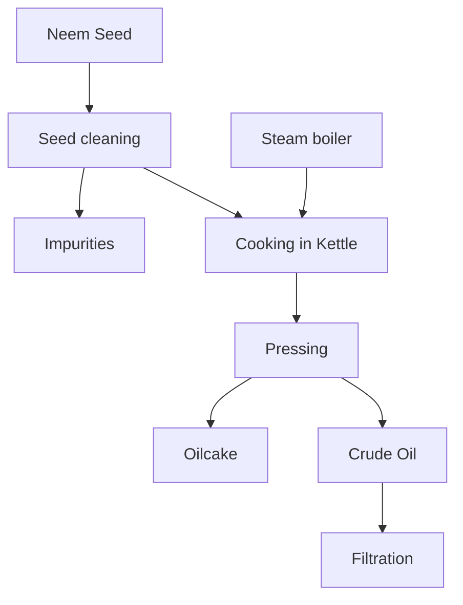

# 1. INTRODUCTION

The cultivated rice, *Oryza sativa* which was originated in South East Asia in humid tropical climate as well as under influence of local environment and farmers, has now risen into at least 88,681 different varieties, of which 55,615 are land races, 1,171 are wild races and 32,895 are other varieties (Mishra & Sinha, 2012). Only a few cultivars possess fragrance or aroma in their grains as well as their components too. These rice retain their aroma when stored and cooked, as well as when they are in the fields and throughout milling (Jefferson, 1985). The consumer value and preference are highly influenced by aroma of the scented rice. Cooked aromatic rice finds a unique place in consumer preference in special occasions like festivals and rituals. Nearly 100 volatile compounds contribute to this aroma, of which, 2-acetyl-1-pyrroline (2-AP) is most preferred one (Chakraborty, 2019).

Due to increasing health concerns, in recent years, the paradigm of rice cultivation has witnessed a notable shift towards organic practices, reflecting a growing awareness of environmental sustainability, health consciousness, and the preservation of cultural heritage. Organic aromatic rice cultivation in India represents a harmonious convergence of ancient wisdom and modern innovation. It embodies a holistic approach to farming that minimizes synthetic chemicals and embraces natural methods to nurture the soil, protect biodiversity, and produce rice of unparalleled aroma, flavor, and nutritional value (Patra *et al.*, 2024). Organic farming improves the soil microbiome which plays a vital role in nutrient cycling and improving soil health. As organic practices enhance the populations of beneficial soil microorganisms, they play a crucial role in nutrient cycling and maintaining soil biological properties (Yadav *et al.*, 2013). The importance of organic aromatic rice cultivation stands on the fact that it renders economic importance and higher consumer demand with additional improving soil health and carbon sequestration thereby alleviating the adverse effect of climate change.

This bulletin covers package of practices for organic cultivation of aromatic rice and also the organic certification process which will help for sustainable farming of aromatic rice including landraces.

# 2. STATUS OF ORGANIC FARMING IN INDIA & Maharashtra

### *Area*

As on 31st March 2023, total area under organic certification process (registered under National Programme for Organic Production) is 10.17 Mha (2022-23). This includes 5.3 Mha cultivable area and another 4.7 Mha under wild harvest collection (APEDA, 2023). Among all the states, Madhya Pradesh has largest area under organic certification followed

by Maharashtra, Gujarat, Rajasthan,  Karnataka, Uttarakhand, Sikkim, Chhattisgarh, Uttar Pradesh and Jharkhand.

### **In Maharashtra**

The Maharashtra state targets to bring 2 lakhs ha area under organic cultivation in the next 5 years. Maharashtra is the 8th largest organic farming state in India having 118,000 ha (2% of the net sown area) under organic farming (Directorate of Agriculture and Food Production, 2023). Along with rice, crops such as pulses, millets, coffee and spice crops like turmeric and ginger, have immense potential for export of organic produced in the state and neighboring state too. Another potential area is organic production of vegetables viz. tomato, brinjal, chilli, and pumpkin.

## **3. PACKAGE OF PRACTICES FOR ORGANIC AROMATIC RICE**

The establishment of organic farms require an inspection followed by certification by the accreditation agencies to ensure that the farm meets the minimum standards specified for organic farming and the product has been grown organically. The organic aromatic rice cultivation includes several practices described as below. Stepwise practices for organic cultivation following scientific package of practices (POP) of aromatic rice are described below.

### **Soil**

Periodic soil testing in a soil-testing laboratory is recommended to know the type, nature, and the nutrients status of the soil before adding more nutrients to it. Top soil should be ideally 18–23 cm deep. Manure can be applied based on the status of nitrogen, potassium and phosphorus content in the soil. Alluvial soil, sandy clay and clayey soils are suitable for paddy cultivation.

### **Varieties**

The image shows four photographs of rice varieties growing in farmer's fields, each identified by a signpost:
1. **CR DHAN-908**: A lush green rice field with mountains in the background.
2. **CR DHAN-910**: A close-up of a vibrant green rice crop.
3. **GEETANJALI**: A field of golden-green rice ready for harvest.
4. **KALAJEERA**: A taller, darker rice variety.

**Fig 1: Glimpses of popular NRRI Varieties in farmer’s field**

Varieties are to be selected based on the environment, soil type, availability of irrigation and market demand of the produce. Grain yield, grain length, cooking and eating qualities are

taken into consideration for selecting ideal varieties. A good number of varieties combining earliness, resistance to biotic and abiotic stresses and grain quality are available. A complete list of aromatic rice prevalent in Maharashtra is provided in Annexure I (attached) and promising varieties developed at ICAR-NRRI is attached as Annexure II.

### Seed

It is always recommended to use certified seeds for cultivation for uniform and bumper yield.

*Selection of seed:* Seed selection plays an important role in paddy cultivation. The seeds selected for cultivation should be uniform, pure, viable and free from contaminants. They should also have good germination potential.

*Separation of quality seed:* To separate good seed from bad, seeds are soaked in water, the unviable seeds will float on the surface of water. By this method, the seeds that sink can be used for cultivation and floating seeds are rejected. Another method is used when there is exces chaffy grains in the seed stock, some water is taken in a vessel and an egg is dropped in it. Salt is added to water till the egg reaches the surface. When the seeds are dropped into the water, the good quality seeds will sink. The selected seeds are then washed in good water 2–3 times to remove the salt deposits. If this is not done, the germination capacity of the seeds will be affected.

*Seed rate:* The seed rate varies according to the variety to be cultivated. The seed rate required for one hectare of land under irrigated condition is given below:

*   Short duration variety : 60-70 kg
*   Medium duration variety : 40-60 kg
*   Long duration variety : 30-60 kg
*   Dry and rain fed sowing : 85 - 100 kg

*Germination test:* The germination test is considered to be the most important quality test for evaluating the planting value of a seed lot. The test is designed to measure the ability of seeds to produce normal seedlings and plants later on. The various ways of performing a germination test are listed below:

*   Tie a handful of seeds in a white cloth, soak it in water for 12 hours and keep in a dark place for 24 hours. Check the germination percentage (80-85) the next day.
*   Tie paddy straw together to make it into a mat. Keep the seeds in the center of the mat and then roll and tie it. Dip it in water for a minute and transfer the seeds to straw. After 24 hours, count the seeds that have germinated.

*   Take a wet gunny bag, fold it, put the seeds in between the two layers and keep the bag in the dark for a day. Check the germination the next day.

### Seed treatment

*   Dry seeds in bright sunlight (between 12:00 pm to 1:00 pm) for half an hour before sowing to improve the germination and seedling vigour.
*   Soak paddy seeds in *Panchagavya* (35 mL per litre of water) for 30 hours before sowing. *Panchgavya* improves soil fertility by increasing organic matter, macro and micronutrient levels, and the uptake of nutrients in plants, promoting the growth and reproduction of micro-organisms and maintaining good soil health (Golakiya *et al.*, 2019). The seeds are then treated with any of the following methods to increase the germination and make them disease and pest free. They are as follows:
    *   Treating the seeds with Beejamrita\* (@ 5 litres/25-30 kg seed) within 48 hours of preparation of the solution (Duddigan *et al.*, 2023). Spread the seeds on a clean surface and sprinkle Beejamrita on top and gently apply it to the seeds with your hands.
    *   *By using cow dung:* soaking the seeds in cow dung extract enhances the germination capacity. Take ½ kg of fresh cow dung and 2 liter of cow’s urine and dilute with 5 liters of water. Soak 10-15 kg of seeds that are previously soaked in water for 10-12 hours in this cow dung extract for 5-6 hours. Dry the seeds in shade before sowing in the nursery.
    *   *By using bio-fertilizers:* seeds are treated with pseudomonas @200g/10 kg seed in 1 litre of cooled rice gruel and then dry in shade for 30 minutes before sowing (Saryoko *et al.*, 2021).
    *   *By using sweet flag extract:* 1.25 kg seeds of sweet flag rhizome powder are dissolved in 6 litres of water. Seeds are tied in small bags and then soaked in the extract for half an hour. Seeds are dried in the shade before sowing (Nandhini *et al.*, 2020).

\*Beejamrita ingredients (for 100 kg of seed treatment): Water- 20 litres desi cow dung- 5 kg, desi cow urine- 5 litres, Lime- 50 g, one handful of soil from the farm.

## 3.1. Agronomic Management

### Nursery bed management
#### Preparation of the nursery bed

Around 800 m2 nursery area is required for raising seedlings needed for one hectare of land. The land for nursery raising should be in dry condition and made wet with irrigation

water. Then it is puddled in standing water (2.3 cm deep) three to four times preferably at an interval of 5-6 days. After ploughing, the nursery bed is spread with neem leaves on the soil. The leaves should be allowed to decay in water for 6–7 days. When the leaves decay completely, the land should be ploughed again four times and levelled. In case, neem leaves are not available, 8–10 kg of neem cake and 10–15 kg of vermicompost should be added to the soil during the last ploughing. Later, the soil should be levelled and the seeds are sown. Leaves of *Adhatoda vasaca* (commonly known as *Malabar nut* or *Vasa* or *Basanga* in Odia) can be incorporated into the soil while preparing the nursery (Srivastav *et al.*, 2021). This increases soil fertility; acts as a pesticide and renders the uprooting of the seedlings easier.

### Nursery raising

Seedlings are to be raised in the nursery under similar organic environment. Rice straw/ hull/husk may be applied in the nursery for raising healthy seedlings as it supplies sulphur (0.17-0.37%) and silicon (8%). the two essential micronutrients. Treated seeds starts sprouting after undergoing an incubation period of 24-36 hours. Then sprouted seeds are broad-casted evenly on the soft mud and a thin film of water is maintained. Thereafter the emergence of first green leaf and completion of germination, the level of water is raised gradually and maintained at a depth of 2-3 cm. The nursery should be kept free from weeds and attack of pests and diseases. Nursery should be irrigated in the evening to avoid injury to the young seedlings caused due to heated water during daytime. When the seedlings are at 4-5 leaves stage (20-25 days), the nursery should be adequately irrigated and the seedlings are uprooted for transplanting in the main field.

### Managing pests and diseases in the nursery

Pests such as the green leaf hopper, green horned caterpillar, and diseases such as brown leaf spot and blast generally attack seedlings in the nursery. Hence, the crop damaged at its very early stage. These attacks can be prevented by spraying 10% cow’s urine extract twice at 7 days interval at the appearance of the first symptom. This should be immediately followed by pest management techniques. Before uprooting the seedlings, the nursery should be irrigated and 15–20 kg of gypsum should be added to prevent damage to the rootlets.

### Application of biofertilizers

Azospirillum (@ 2.5 kg/ha) should be mixed with 25 kg of farmyard manure and applied in the nursery 30 minutes before uprooting. The seedlings are kept submerged in the nursery for 30 minutes and then transplanted.

### Main field preparation

The main field should be irrigated and ploughed 2-3 times to make it weed free and water

retentive. The bunds should be trimmed and plastered to prevent water leakage. Rat holes found in the field should be sealed. The preparation of main field starts with the thorough ploughing of land with country plough followed by evenly spreading of farm yard manure to the whole field. Then *dhaincha* (*Sesbania aculeata*) seeds (2.5 kg) are sown and on the arrival of monsoon, puddling is done with 3-5 cm of standing water in the field. When *dhaincha* plants attain 1 -1.5 ft height, leaving some plants at the periphery of the field for collecting seeds for next season, the young *dhaincha* plants along with weeds are thrashed and incorporated in the soil. This practice helps countering the weed problem in the field. Puddling up to 10 cm depth makes the silty clay soil soft for the seedling to root faster as well as to minimize the percolation of water and leaching of nutrients and thereby increasing the availability of plant nutrients. Then groundnut or neem cake (@15 quintals/ha) should be applied as basal manure during the final ploughing and the land is properly levelled before transplanting. Alternatively, dried cow-dung and ash mixture can be spread uniformly across the field during final ploughing that facilitates aeration and activates the microbes in the soil.

### Seedling treatment

The paddy seedlings can be treated with ash and neem seed mixture before transplanting. For this, the seedling bundles are kept in small plots of standing water mixed with ash and pulverized neem seeds from 30 minutes to an hour. One kilo of ash and 500 gm of neem seeds are sufficient for treating 50 bundles of seedlings. The treated seedlings are less vulnerable to pest attack.

### Transplanting

Young and healthy seedlings at 4-5 leaf stage are transplanted that establish faster and grow better to give 15% more yield. In *kharif* season, the seedlings get ready for transplanting within 20-25 days whereas in *Rabi* season, it takes 30-40 days. The paddy seedlings are transplanted @ 2–3 saplings per hill at a depth of 3 cm with a spacing of 20*10 cm in labelled field with 1 to 2.5 cm of standing water.

Growing crop of similar duration nearby should be avoided to maintain seed purity. Transplanting is recommended to be completed within first fortnight of July to ensure adequate and vigorous crop stand. However, under delayed situation, period row planting would be advantageous accounting for less yield reduction (10-12%) than normal planting. Yield reduction is less in variety *Chinikamini* (10-15%) followed by *Katrini* (15-20%) if planting is delayed as compared to other varieties.

### Spacing

Recommended spacing for verities of different durations are:

*   Short duration variety : 15 x 10 cm
*   Medium duration variety : 20 x 10 cm
*   Long duration variety : 20 x 15 cm

### Gap Filling

Early (10-15 days after transplanting) gap filling is desirable, splitting of existing hills to be used for gap filling. Gap filling should be completed within 2 weeks of transplanting.

## 3.2. Weed management

Weeds compete with rice and takeaway a heavy toll of energy, water and plant nutrients. Generally, they are found more in upland rice than in lowland or irrigated rice. Weeding should be done manually or using cono weeder and the picked weeds should be trampled into the field for in-situ conservation of nutrients and for organic matter as mulch. Weeding should be done at 20 and 40 days after transplanting. About 50 kg neem cake should be applied to the field. Subsequent weeding should be done as and when weeds appear and become problematic. Weeds can be kept under check by flooding the field to a height of 5–8 cm during the early vegetative stages. The most commonly found weeds in transplanted rice are *Echinochloa colonum*, *Echinochloa crusgalli*, *Cyperus iria*, *Eclipta alba*, *Dactyloctenium*, *Setaria glauca*, *Monocharia* spp., *Cyperus difformis*, *Scirpus* spp., *Fimbristylis litoralis*, *Marsilea quadrifolia*, etc. Use of *Calotropis gigantea* (commonly known as *Safed Aak*) as green manure can check the growth of the weed *Marsilea quadrifolia*. The fibrous pericarp of coconut applied @ 25 baskets/ha also controls this weed to some extent. It releases a tannin-like substance that inhibits the growth of the weed (Singh, 2007).

## 3.3. Water management

The water requirement of rice is higher as losses due to percolation and evapotranspiration are more in submerged rice field. At least 2 cm of water is maintained in the field during transplanting. Water is kept stagnant to avoid the growth of weeds. 3 cm of water is maintained from the tenth day till crop maturity. Water is required especially during the critical stages of tillering, panicle initiation, flowering and milking stage. The water should be drained and the land should be allowed to dry before adding manure. Fields should be irrigated immediately after manuring. The water requirement is higher in red and sandy soils. Hence the frequency of irrigation should be higher in such soils. This can be managed by incorporating the plant *Ipomoea fistulosa* into the soil. As these plants rot, they enhance the water holding capacity of the soil. Water should be drained out from the field 7–15

days before harvest depending on the soil type to encourage quick and uniform maturity of grain.

### Training and pruning

Two months after transplanting, the upper portion of the rice plants can be cut with a sickle. This checks excessive growth of the plants and also strengthens their base. By this, lodging is prevented during the maturity period, especially in waterlogged conditions.

## 3.4. Organic Nutrient Management

Nutrient management is a key component for maintaining balanced plant nutrients through organic inputs. In this section, details of inputs, their dose and time of application and the on-farm trial for aromatic rice yield and soil health are described.

**Table 1. Nutrient management by organic inputs**

<table>
  <thead>
    <tr>
        <th>Sl. no.</th>
        <th></th>
        <th>Organic manures</th>
        <th></th>
        <th>Details</th>
        <th></th>
    </tr>
  </thead>
  <tbody>
    <tr>
        <td>1</td>
        <td>**Farm yard manure (FYM)**</td>
        <td>* It is a decomposed mixture of dung and urine of farm animals along with litter and left over material from roughages or fodder fed to the cattle. * Average composition of well-decomposed farmyard manure: 0.5% N, 0.2% P2O5 and 0.5 % K2O. * FYM can be directly used for field application in its natural form once it takes 4-5 months for preparation. Partially rotten farmyard manure needs to be applied three to four weeks prior to crop sowing/transplanting. * About 1 ton of fully decomposed FYM is recommended to 20 cents nursery. * Well decomposed FYM is recommended @ 5 t ha-1 at the time of land preparation for rice crop in the main field before sowing in *kharif* season (Padma &amp; Jagadeshwaran, 2022).</td>
        <td colspan="3"></td>
    </tr>
    <tr>
        <td>2</td>
        <td>**Compost**</td>
        <td>Composts are bulky organic manures prepared from the decomposed product of animal excreta and plant waste. Different kinds of composting methods are: **NADEP composting:** This method deals a wide range of organic materials (crop residues, weeds, forest litter, and kitchen waste with an end-product of a manure) that serves as a good alternative to farmyard manure.</td>
        <td colspan="3"></td>
    </tr>
  </tbody>
</table>

<table>
  <tbody>
    <tr>
        <td rowspan="2"></td>
        <td rowspan="2"></td>
        <td>**Aerobic composting:** This process involves converting organic wastes into compost in aerobic conditions. In aerobic composting, the temperature inside the compost pile rises rapidly to 70-80 °C within the first couple of days. First, mesophilic organisms then thermophilic fungi and several thermophilic bacteria carry out the process. The final product is dark brown to black in colour and soil-like in texture. **Anaerobic composting:** This process of compost preparation involves the decomposition of organic materials in anaerobic conditions. The N, P and K contents are 0.90%, 0.83%, and 0.65%. This utilizes weeds, crop stubbles, or straw, crop residues such as cotton stalks, ground nut husks, leaves, sugarcane trash, urine-soaked earth, and litter from cattle-shed, waste fodder, hedge clipping, *etc*. It takes about 4-5 months to prepare in a compost. **Phospho-compost and Vermicompost** To enrich the compost with phosphorus, an insoluble source of phosphorus is added to the compost. During the composting process, the microbial activity solubilizes the phosphorus and enriches the compost. Phospho-compost contains 1.5-2.0% N, 2.0-3.0% P with C: N ratio 16-18. Waste material like FYM, poultry manure, pig manure, or goat manure is dumped in the structure and mixed properly with rock phosphate. **Vermicompost** is an excellent, nutrient-rich organic fertilizer and soil conditioner that is prepared by the decomposition of organic residues and animal dung in presence of certain species of earthworm. The vermicompost is not only enriched by nutrient from decomposition but also the activities of microflora in the gut of earthworm add mucus, hormones, enzymes help to promote the growth of the plants. The average nutrient content of vermicompost is 0.6–1.2% N, 0.13–0.22% P2O5, 0.4–0.7% K2O, 0.4% CaO, and 0.15% MgO.</td>
        <td colspan="2"></td>
    </tr>
    <tr>
        <td colspan="3">**3. Foliage manuring**</td>
    </tr>
    <tr>
        <td></td>
        <td>**Green manuring**</td>
        <td>* It is practiced in two ways: by growing green manure crops in the field site and incorporation of the same after sufficient growth (**in-situ green manuring**) or by collecting green leaf (along with twigs) from plants grown in nearby wastelands, field bunds and forest areas (**ex-situ green manuring**). * In-situ green manuring may take 40-45 days to grow and mature the plants after broadcasting the seeds in the field before incorporation in the same site. The plants are allowed to decay in water for ten days and then ploughed. * Green manure crops generally belong to leguminous family. The most prominent green manure crops are sunhemp, dhaincha (*Sesbania aculeata* and *S. rostrata*), cluster beans. These crops are capable of biological N-fixation, hence enrich the soil fertility.</td>
        <td colspan="2"></td>
    </tr>
  </tbody>
</table>

<table>
  <thead>
    <tr>
        <th></th>
        <th>Brown manuring</th>
        <th>* Brown manuring is simply a ‘no-till’ version of green manuring, where an herbicide is used to desiccate the crop before flowering stage. * Generally, brown manuring practice is introduced in the fields where seeds of *Sesbania* sp. is broadcasted three days after rice sowing and allowed to grow for 30 -days and is dried by spraying 2,4-D.(herbicide)</th>
    </tr>
    <tr>
        <th></th>
        <th>Green leaf manuring</th>
        <th>* Green leaves, twigs of trees, shrubs and herbs collected from elsewhere and applied in field is known as green leaf manuring. * The important plant species useful for green leaf manure are neem, mahua, wild indigo, Calotropis, Glyricidia, Karanj (*Pongamia glabra*), avise (*Sesbania grandiflora*), subabul and other shrubs. Green manuring improves soil structure, increase water holding capacity and decreases soil loss by erosion, reduce weed proliferation and weed growth, helps in reclamation of alkaline soils and controls root knot nematodes.</th>
    </tr>
    <tr>
        <th></th>
        <th>Panchagavya</th>
        <th>* This is a growth regulator produced from a combination of five products obtained from the cow, fermented along with a few other biproducts. For coarse varieties, one spray of 3% panchagavya is applied during tillering and booting stage. * For fine slender varieties, one spray of 3% panchagavya is applied at the booting stage. * **Amirthakaraisal:** About 1,250 litres of amirthakaraisal is mixed with irrigation water for one-hectare crop. When it is used as a spray, 25 liters is required. This improves soil fertility and produce good yield.</th>
    </tr>
  </thead>
  <tbody>
    <tr>
        <td>4.</td>
        <td>Azolla</td>
        <td>* The use of Azolla is an age-old technique popularized as ‘green’ nitrogen fertilizer to increase rice production. * Azolla is a freshwater fern that lives in ponds, lakes, swamps, and streams. * Azolla in association with blue-green algae *Anabaena* fixes atmospheric Nitrogen (N) into ammonia which is utilized by rice plant when it is incorporated into soil.</td>
    </tr>
    <tr>
        <td>5.</td>
        <td>Blue Green Algae (BGA)</td>
        <td>* Blue Green Algae (Cyanobacteria), are the photosynthetic prokaryotes that are frequently considered as predominant diazotrophs in wetland rice systems. * Potential nitrogen-fixing BGA species in the rice fields of India are: *Aulosira*, *Anabaena*, *Nostoc*, *Anabaenopsis*, *Calothrix*, *Camptylonema*, *Cylindrospermum*, *Fischerella*, *Hapalosiphon*, *Microchaete*, *Westiella*, *Westiellopsis* and *Tolypothrix*.</td>
    </tr>
  </tbody>
</table>

<table>
  <thead>
    <tr>
        <th colspan="2"></th>
        <th colspan="2"></th>
        <th>* N fixed by these organisms is made available to the rice plants through exudation or autolysis and microbial decomposition. * application of BGA @ 10kg/ha is done at 6-7 days after transplanting</th>
    </tr>
    <tr>
        <th colspan="4">Biofertilizers</th>
        <th></th>
    </tr>
  </thead>
  <tbody>
    <tr>
        <td rowspan="4"></td>
        <td>**Phosphate-solubilizing bacteria (PSB)**</td>
        <td colspan="2">* Phosphate-solubilizing bacteria (PSB) has a vital role in P-solubilization in soil by producing organic acids. * *Pseudomonas*, *Bacillus*, *Micrococcus* are common genera of the phosphate solubilizing bacteria (PSB) in soil. * Some fungi (*Aspergillus*, *Penicillium*, *Mucor*, *Fusarium*, *Candida*), and actinomycetes (*Streptomyces*) are capable of solubilizing phosphate in the soil and may function like PSB.</td>
        <td></td>
    </tr>
    <tr>
        <td>**Azotobacter**</td>
        <td colspan="2">* Azotobacter is a common non-symbiotic free-living N-fixing bacteria and supplementing the need of nitrogenous fertilizers in non-legume crops. * Efficient Azotobacter strains are *A. vinelandii* and *A. chroococcum*. * Azotobacter is applied through seed treatment, seedling treatment and soil application. * **Method of application:** In seed treatment, 600 g ha-1 of Azotobacter formulation is mixed with water in which the seeds are soaked overnight and then sown in the nursery bed. In seedling treatment, the slurry can be prepared by mixing Azotobacter @ 1000 g ha-1 in 40 L of water and rice seedlings are dipped in the suspension for 15-30 minutes before transplanting. For soil application, 3 L in 1000 kg of field soil has to be applied uniformly in the soil and watered well.</td>
        <td></td>
    </tr>
    <tr>
        <td>**Azospirilum**</td>
        <td colspan="2">* Azospirillum is another common N-fixing bacterium for rice and non-legume crops and used as biofertilizers. * It is a gram-negative, non-fermentative, microaerophilic kind of bacteria. It secretes phyto-hormones like indole-3-acetic acid and gibberellins that helps in better root proliferation. * *A. brasilense* is an efficient strain of N2-fixing bacteria.</td>
        <td></td>
    </tr>
    <tr>
        <td>**Mycorrhizal fungi**</td>
        <td colspan="2">* Arbuscular mycorrhizal fungi (AMF) are broad-spectrum and non-specific microorganisms and they colonize 85% of terrestrial plant species including halophytes, hydrophytes and xerophytes. * *Glomus intraradices*, *G. mosseae*, *G. fasciculatum*, *G. etunicatum*, *G. versiforme*, *G. etunicatum* are some of the common AMF spp. * Mycorrhizal infection increases water transport, nutrient uptake and mobilization of nutrients in host plants due to increase in surface contact of roots. AMF also produce number of plant growth-promoting substances like IAA, IBA, GA.</td>
        <td></td>
    </tr>
  </tbody>
</table>

<table>
  <thead>
    <tr>
        <th></th>
        <th></th>
        <th></th>
        <th></th>
    </tr>
  </thead>
  <tbody>
    <tr>
        <td></td>
        <td></td>
        <td>*</td>
        <td>**Method of application:** For inoculating AMF, de-husked rice seeds are surface-sterilized twice with 5% sodium hypochlorite for 15 minutes and washed with sterile water thoroughly. Then seeds are allowed to germinate on petri dishes. Germinating seedlings are transplanted to 150 mL-cones containing a mix of 63.3% quartz sand, 31.6% soil, and 5% of granular inoculums at a concentration of a minimum 10 propagules per gram of granular inoculum. After 3 weeks of AMF inoculation, seedlings are transplanted in the main field.</td>
    </tr>
    <tr>
        <td></td>
        <td>**Zinc Solubilizing Bacteria (ZSB)**</td>
        <td>*</td>
        <td>Few bacterial species in soil have the potential to solubilize insoluble zinc compounds like ZnO, ZnCO3, ZnS and sphalerite ore.</td>
    </tr>
    <tr>
        <td></td>
        <td>*</td>
        <td>A zinc solubilizing bacterium (*Bacillus* sp.) isolated from sphalerite ore enhanced the available zinc content of soil and plant uptake upon inoculation.</td>
        <td></td>
    </tr>
    <tr>
        <td></td>
        <td>*</td>
        <td>**Method of application:** The roots of rice seedlings are thoroughly washed with tap water; surface sterilized in 2% NaOCl for 15 minutes and finally rinsed with sterile distilled H2O and is inoculated by soaking them overnight in different bacterial inocula maintained at 108 cfu mL-1.</td>
        <td></td>
    </tr>
    <tr>
        <td></td>
        <td>**Silicate solubilizing bacteria (SSB)**</td>
        <td>*</td>
        <td>The organic acid production and polysaccharide production from few rhizospheres bacterial isolates creates favourable conditions for silica solubilization from soluble silicates.</td>
    </tr>
    <tr>
        <td></td>
        <td>*</td>
        <td>**Method of application:** The roots of rice seedlings are thoroughly washed with tap water, surface-sterilized in 2% NaOCl for 15 minutes, and finally rinsed with sterile distilled H2O and are inoculated by soaking them overnight in different bacterial inocula maintained at 108 cfu mL-1.</td>
        <td></td>
    </tr>
    <tr>
        <td></td>
        <td>*</td>
        <td>Silicate solubilizing bacteria can also be applied with siliceous rice residues like straw, husk, and husk ash leading to a rapid breakdown of these residues in the soil.</td>
        <td></td>
    </tr>
  </tbody>
</table>

# CASE STUDY 1

**Experience of on-farm trial under organic farming with Aromatic rice var. *Ketekijoha***

* FYM and other organic manures (vermicompost, azolla, green manure) could show significant impact on yield (up to 25% increase) for aromatic rice variety Ketekijoha.
* Azolla, green manure and vermicompost manures were found better impact on soil C-sequestration and soil biological activity.
* Nutrient (N, P and K) uptake in grain and straw was found to be high in aromatic rice cultivar (*Ketekijoha*) in different organic nutrient management practices, especially FYM + Green manure treatment.
* *Ketekijoha* out-performed non-aromatic rice variety (*Padmini*) in terms of several grain quality parameters like grain length, grain breadth, brown rice length, brown rice breadth, kernel length and kernel breadth, L: B ratio of grain, brown rice and kernel. Protein content was found improved with azolla application.

(ICAR-NRRI Annual Report, 2019-2020)

The image shows a collage of six photographs documenting the preparation and application of organic fertilizers in a rural agricultural setting.
1. Top left: A person standing in a large rectangular pit dug into the earth, likely for composting or manure storage.
2. Top middle: A field area covered with straw or mulch, with buckets and bags nearby, indicating a composting site.
3. Top right: A person pouring liquid from a white container into a large blue plastic drum.
4. Bottom left: A top-down view of a blue drum containing a dark liquid mixture being stirred with a wooden pole.
5. Bottom middle: Three people working around long, green trough-like structures in a field, possibly for vermicomposting or azolla cultivation.
6. Bottom right: A tractor operating in a flooded rice paddy field with mountains in the background.

**Fig 2: Preparation of organic fertilizers in farmer's field**

# CASE STUDY 2

**Experience from on-farm trial on organic nutrient management of aromatic rice varieties**

*   **Practice:** Organic fertilization equivalent to 30 kg N ha-1 through farmyard manure (FYM) or *Azolla* and 30 kg N ha-1 through green manure (FYM + GM) were tested against their sole application and control. The FYM (1.5% N, 0.6% P, and 1.5% K) was incorporated in soil properly before puddling, while incorporation of green manure crop (*Sesbania aculeata*, 3.3% N, 0.7% P, and 1.3% K) was completed 20 days before transplanting to allow adequate decomposition. *Azolla* (3.3% N, 0.28% P, and 2.7% K) is to be double-cropped with rice and to be applied to the rice field after transplanting within 7-10 days. Standard biological control of pests and diseases (such as an application of neem oil) was practiced. Manual weeding was practiced as and when needed during the cropping season.
*   **Increase yield of aromatic rice:** The favourable effect of organic fertilization on yield and yield attributes were observed, probably due to better availability soil nutrients, increased enzymatic activities in soil, increased culturable microbial populations and high labile pools of C, N and P in soil (Chatterjee *et al.* 2021)

**Table 2. Yield of important aromatic rice varieties grown under long-term organic fertilization**

<table>
  <thead>
    <tr>
        <th>Treatment</th>
        <th></th>
        <th>Ketokijoha</th>
        <th></th>
        <th>Nuakalajeera</th>
        <th></th>
        <th>Nuadhusara</th>
        <th></th>
        <th>Sobhini</th>
        <th></th>
    </tr>
  </thead>
  <tbody>
    <tr>
        <td>Control</td>
        <td>3.24±0.03</td>
        <td>3.25±0.09</td>
        <td>3.22±0.09</td>
        <td>3.29±0.04</td>
        <td colspan="5"></td>
    </tr>
    <tr>
        <td>FYM</td>
        <td>3.66±0.05</td>
        <td>3.59±0.11</td>
        <td>3.49±0.03</td>
        <td>3.96±0.05</td>
        <td colspan="5"></td>
    </tr>
    <tr>
        <td>GM</td>
        <td>3.57±0.11</td>
        <td>3.97±0.06</td>
        <td>3.62±0.11</td>
        <td>3.69±0.05</td>
        <td colspan="5"></td>
    </tr>
    <tr>
        <td>FYM + GM</td>
        <td>3.76±0.07</td>
        <td>4.02±0.06</td>
        <td>3.65±0.06</td>
        <td>4.05±0.06</td>
        <td colspan="5"></td>
    </tr>
    <tr>
        <td>GM + Azolla</td>
        <td>3.90±0.06</td>
        <td>3.95±0.05</td>
        <td>3.95±0.10</td>
        <td>4.18±0.05</td>
        <td colspan="5"></td>
    </tr>
  </tbody>
</table>

(FYM: farmyard manure; GM: green manure)

*   **Enhancing P availability:** Green manure along with rice straw (2.5-5.0 t ha-1) under rice-fallow system increases the phosphate solubilizing microbial population, soil enzyme activities and microbial biomass, thereby enhancing phosphorous transformation

especially when soil P is low. Long-term application of organic manures helps in better nutrient bioavailability by enhancing P desorption and efficient microbial turnover to facilitate phosphorous mineralization from unavailable fractions of P (occluded P, non-occluded Al and Fe-P and calcium-P) to available P (ICAR-NRRI Annual Report, 2016-17; Chatterjee *et al.* 2021).

*   **Reducing weed density:** Weed density was comparatively lower in organic treatments compared to control, while the lowest weed density was recorded in combined application of green manure along with *Azolla* during cropping season. In terms of weed species, grasses dominated in all treatments at each growth stage, followed by broadleaves (ICAR-NRRI Annual Report, 2022).

*   **Enhance diversity of nitrifying bacteria:** The highest populations of *Nitrosomonas* and *Nitrobacter* were observed in green manure treatment. The FYM co-applied with *Azolla* had the highest copy number of the *amoB* gene. McIntosh index suggest not much heterogeneity of microbial community in various organic application (ICAR-NRRI Annual Report, 2022).

## 3.5 Insect Pest-Diseases-Nematodes Management

### Plant protection measures

Rice crop is affected by number of diseases like blast, brown spot, sheath blight, bakanae, false smut, sheath rot, seedling blight, bacterial blight, and tungro. The diseases can cause epidemic losses based on weather conditions and variety being grown. The diseases are mostly seed borne, soil borne and air borne in nature and spread from infected fields to healthy fields through irrigation water, rain splash, farm implements, intercultural operations and insect vectors. Globally, 13.6% of an estimated annual loss is caused by insect pests whereas in India it is 17.5%. In rice, a gradual increase in the number of insect pests from 1965-2020 has been observed. In India, stem borers cause 30% of the yield loss, while plant hoppers 20%, gall midge 15%, leaf folder 10% and other pests 25% and all being equally dangerous. (Krishnaiah and Varma 2013).

Integrated management considering of cultural, mechanical, botanical and biological measures along with location-specific cropping system should be followed for controlling insect pests and diseases, both in field and during storage.

**a) Cultural method**

**i) Stand establishment:** It is noticed that micro climate prevailed during the growing period largely determines the extent of insects and disease infestation. Accordingly crop establishment needs to be taken care to avoid the vulnerable period there by enabling better plant protection. Sowing early in the first fortnight of May or planting in the 1st fortnight of

July helps reduce insect infestation resulting in 5-10% less of chaffy grains.

ii) *Field drainage*: Draining accumulated water twice at early tillering and at panicle initiation stage helps suppress the build-up of BPH and gall midge population that results in greater emergence (180 m2) as compared to no drainage practice (150 m2)

b) **Use of botanical pesticides**

The botanicals and biocontrol can be applied for seed treatment, seedling root dip and foliar spray. Commonly used botanical and biocontrol agents against different rice diseases are enlisted below. A good number of botanicals have been found promising in controlling a wide range of insect pests and disease successfully.

**Table 3. Details of botanicals used for managing pest and disease infestation**

<table>
  <thead>
    <tr>
        <th>Sl No</th>
        <th></th>
        <th>Name of the Botanical</th>
        <th></th>
        <th>Parts used</th>
        <th></th>
        <th>Dose</th>
        <th></th>
        <th>Target Disease</th>
        <th></th>
    </tr>
  </thead>
  <tbody>
    <tr>
        <td>1</td>
        <td>Neem (*Azadirachta indica*)</td>
        <td>Leaf, Fruit, Seeds</td>
        <td>5%, 10%, 15%</td>
        <td>Blast, Sheath blight, Brown spot, sheath rot,</td>
        <td colspan="5"></td>
    </tr>
    <tr>
        <td>2</td>
        <td>Tulsi (*Ocimum basalicum*)</td>
        <td>Leaf</td>
        <td>5%, 10%, 15%</td>
        <td>Blast, Sheath blight, Brown spot, sheath rot,</td>
        <td colspan="5"></td>
    </tr>
    <tr>
        <td>3</td>
        <td>Lemon grass (*Cymbopogan flexousus*)</td>
        <td>Leaf</td>
        <td>5%, 10%, 15%</td>
        <td>Blast, Sheath blight, Brown spot, sheath rot,</td>
        <td colspan="5"></td>
    </tr>
    <tr>
        <td>4</td>
        <td>Thick leaf thyme (*Thymus vulgaris*)</td>
        <td>Leaf</td>
        <td>5%, 10%, 15%</td>
        <td>Blast, Sheath blight, Brown spot, sheath rot,</td>
        <td colspan="5"></td>
    </tr>
    <tr>
        <td>5</td>
        <td>Aloe (*Aloe vera*)</td>
        <td>Pseudostem</td>
        <td>5%, 10%, 15%</td>
        <td>Blast, Sheath blight, Brown spot, sheath rot,</td>
        <td colspan="5"></td>
    </tr>
    <tr>
        <td>6</td>
        <td>Bael (*Aegle marmelos*)</td>
        <td>Leaf</td>
        <td>5%, 10%, 15%</td>
        <td>Blast, Sheath blight, Brown spot, sheath rot,</td>
        <td colspan="5"></td>
    </tr>
    <tr>
        <td>7</td>
        <td>Marigold (*Tagetes patula*)</td>
        <td>Leaf</td>
        <td>5%, 10%, 15%</td>
        <td>Blast, Sheath blight, Brown spot, sheath rot,</td>
        <td colspan="5"></td>
    </tr>
    <tr>
        <td>8</td>
        <td>Garlic (*Allium sativum*)</td>
        <td>Bulb</td>
        <td>5%, 10%</td>
        <td>Leaf and Neck Blast</td>
        <td colspan="5"></td>
    </tr>
    <tr>
        <td>9</td>
        <td>Turmeric (*Curcuma Longa L).*</td>
        <td>Bulb</td>
        <td>5%, 10%</td>
        <td>Leaf and Neck Blast</td>
        <td colspan="5"></td>
    </tr>
    <tr>
        <td>10</td>
        <td>Onion (*Allium cepa*)</td>
        <td>Bulb</td>
        <td>5% 10%</td>
        <td>Leaf and Neck Blast</td>
        <td colspan="5"></td>
    </tr>
    <tr>
        <td>11</td>
        <td>Ginger (*Gingiber officinale*)</td>
        <td>Pseudostem</td>
        <td>5%, 10%, 15%</td>
        <td>Sheath blight, Blast,</td>
        <td colspan="5"></td>
    </tr>
    <tr>
        <td>12</td>
        <td>Eucalyptus (*Eucalyptus citriodora*)</td>
        <td>Leaves</td>
        <td>5%</td>
        <td>Blast</td>
        <td colspan="5"></td>
    </tr>
  </tbody>
</table>

<table>
  <tbody>
    <tr>
        <td>13</td>
        <td>Cockle bur (Xanthium strumarium)</td>
        <td>Leaf, fruits</td>
        <td>5%</td>
        <td>Bacterial blight</td>
    </tr>
    <tr>
        <td>14</td>
        <td>Malabar nut (Adhatoda vasica)</td>
        <td>Leafs</td>
        <td>5%</td>
        <td>Bacterial blight</td>
    </tr>
  </tbody>
</table>
(Giday *et al.*, 2018)

**Table 4. Biocontrol agents for Rice Disease Management**

<table>
  <thead>
    <tr>
        <th>Sl No</th>
        <th></th>
        <th>Name of the Biocontrol agent</th>
        <th></th>
        <th>Formulation</th>
        <th></th>
        <th>Dose</th>
        <th></th>
        <th>Target Disease</th>
        <th></th>
    </tr>
  </thead>
  <tbody>
    <tr>
        <td>1</td>
        <td>Bacillus cereus, Bacillus sp. B. subtilis B. laterosporus B. pumilus, Bacillus amyloliquefaciens</td>
        <td>Talc, Liquid</td>
        <td>5%,10%</td>
        <td>Blast, Sheath blight, Brown spot, Bacterial blight, False smut, Sheath rot</td>
        <td colspan="5"></td>
    </tr>
    <tr>
        <td>2</td>
        <td>Pseudomonas fluorescens, P. fluorescens P. putida Serratia marcescens Pseudomonas sp. P. aeruginosa, Bacillus velezensis</td>
        <td>Talc, Liquid</td>
        <td>5%, 10%</td>
        <td>Blast, Sheath blight, Brown spot, Bacterial blight, False smut, Sheath rot</td>
        <td colspan="5"></td>
    </tr>
    <tr>
        <td>3</td>
        <td>Trichoderma viride, T. harzianum, T. virens</td>
        <td>Talc</td>
        <td>5%, 10%</td>
        <td>Blast, Sheath blight, Brown spot, Bacterial blight, False smut, Sheath rot</td>
        <td colspan="5"></td>
    </tr>
    <tr>
        <td>4</td>
        <td>Streptomyces hygroscopicus</td>
        <td>Liquid</td>
        <td>5%, 10%</td>
        <td>Blast</td>
        <td colspan="5"></td>
    </tr>
    <tr>
        <td>5</td>
        <td>Chaetomium globosum</td>
        <td>Talc</td>
        <td>5%, 10%</td>
        <td>Brown spot</td>
        <td colspan="5"></td>
    </tr>
  </tbody>
</table>

**Neem oil:** Neem seed is collected during June-July and the outer covering is then cleaned and dried under sun. The seed oil is extracted by means of pressure application or squeezing. The pressure method consists of steaming the seeds, picketing it in cloth and then applying pressure by a hard wood so that all oil comes out in a groove made in the press-stone and is collected in a container. It may also extract oil with a country type squeezer which is a wooden structure. Steamed seeds are squeezed by a solid wooden grinder inside a hollow wooden structure and the mortar and pestle action helps in extraction of the oil which is collected from one side through a groove opening to outside. More oil can be extracted in this method as compared to previous one. The neem cake thus obtained is kept for application in rice fields during September-October (Jena, 2005).

The image shows a composite of neem leaves, a pile of neem seeds, and a small bottle of neem seed oil.

**Fig 3: Neem oil extraction process flowchart**

**Benefits of neem oil:**

*   Neem oil is effective as foliar spray against brown plant hopper (BPH), whitebacked plant hopper (WBPH) and leaf folder at a dose of 0.3-0.5% concentration. If the pest is detected at later stage of infestation, 1% oil can be applied (Deka *et al.*, 2006).
*   Neem bark decoction @20gms/litre of water works as antifeedant against leaf folder, case worm and cutworm. As these pest donor occur regularly, this practice can be followed in areas where more neem trees are available (Ghosh, 2000).
*   Extract of raw leaf @ 5-10 gms/litre of water or leaf decoction @10 gms/litre works as antifeedant against leaf folder, case worm and cutworm (Rajendran, 1992).
*   Cow dung compost prepared from neem leaf and seed, either alone or along with midge and BPH and thereby increasing the grain yield (Dey and Sarkar, 2011).

**Karanja**

Karanja oil cake is use for pest management. Oil is extracted in tribal areas similar to neem oil extraction technique. Seed is collected during April-May. The dehusked seed is subjected to extraction. The oil cake is applied as soil incorporation at the time of field preparation or broadcasted during initial tillering stage of the crop (July-August). It is used by the farmers for both insecticidal as well as fertilizer purposes.

*   Analysis of oil content of different oil-cake showed that more oil is retained in pressure-extraction method (33-38%) than in squeezing method (16-22%). Pest like gall midge and case worm were reduced to a range of 2-7% during *kharif* season. However, insect

pest infesting towards the PI stage of the crop such as YSB and BPH needed another application of cake for reducing their rate of damage.

*   The seed can be combined with the neem seed and cow dung to prepare bio-compost. This bio-compost reduces the damage of internal feeder.
*   Seed powder can be mixed with other seed powders like neem and kochila for preparation of seed mixture. This seed mixture proved to be more effective against internal borders of rice.
*   The seed oil can effectively control BPH and WBPH as foliar spray at a concentration of 0.5-1% with 2% detergent liquid.

**Wild Sugarcane:** Upper top portions of wild sugarcane measuring to about 1-1.5 meter in height is cut and fixed inside the rice field at different distances after 1-2 weeks of transplanting or during case worm infestation. The insect incidence goes down with increase in grain yield.

**Parasi:** Gundhi bug attack rice crop at milky stage. The farmers of tribal and rural area living near the forest or where parasi plants are available, collect small branches of the plant and fix inside the rice plot. Gundhi bug either leave the plot or the infestation is reduced (Jena and Dangar, 2004c).

*   Rice seedlings are generally transplanted during last week of July to 1st week of August. The leaves of Parasi plant are broadcasted by farmers after 2-3 weeks of transplanting to the standing water to protect the crop from case worm (Jena and Dangar, 2004b).
*   Application of parasi leaves at vegetative stage for control of rice pest, particularly yellow stem borer. Farmers collect parasi leaves from the adjacent forest and broadcast in their paddy field to protect their crop from rice stem borer and other insect pests (Jena and Dangar, 2004a).

**Mahua:** Application of mahua flowers in rice field for reducing insect pest incidence. Tribal women collect mahua flowers and store them in earthen containers for further use. Such flowers stored for more than 3 years are applied as to the standing water application to the rice field to get rid of insect pests.

The image displays four photographs of plants used as botanical pesticides:
- **Karanj**: Shows a plant with clusters of small pink and white flowers.
- **Wild Sugarcane**: Shows tall, feathery white plumes of grass.
- **Parasi**: Shows a plant with green oval leaves and small round green fruits.
- **Mahua**: Shows a tree branch with clusters of yellowish-brown flowers and reddish-brown leaves.

**Fig 4: Different botanical pesticides used in paddy cultivation**

### Biological control

One of the important bases for sustainable rice production is conserving natural enemies that are locally occurring to suppress target pests (Savary *et al.* 2012). The presence of rich biodiversity is a vital ecosystem service in reducing insect pest density, rice ecosystem is bestowed with such rich bio-diversity of fauna (Wilby and Thomas 2002; Luo *et al.*, 2014). Rice ecosystems exhibit high species richness and abundance. A total of 624 pest species and 1303 natural enemies were recorded in the rice ecosystem (Tang *et al.* 2009). Arthropod community includes pests, natural enemies, saprophytes etc. Interaction of all these maintains a stable rice ecosystem. As for as insects are concerned, natural enemy diversity may benefit the biological control of insect pests (Luo *et al.* 2014). Tropical rice fields generally have a higher diversity of natural enemies than herbivores, leading to complex food webs (Cohen *et al.* 1994). In India, among different natural enemies of rice, *Trichogramma japonicum* and *T. chilonis* in the form of Tricho-cards and *Habrobracon hebetor* in the form of Bracon cards are widely being used commercially (Gowda *et al.*, 2021; Gowda *et al.*, 2023). Following are few natural enemies that are potential in suppressing insect pests are mentioned in Table 6.

**Table 5. Details of natural enemies capable of suppressing insect pests**

<table>
  <tbody>
    <tr>
        <td>Natural category</td>
        <td>Natural enemy</td>
        <td>Target pest</td>
    </tr>
    <tr>
        <td colspan="3">I. Parasitoids</td>
    </tr>
    <tr>
        <td rowspan="8">1. Egg parasitoids</td>
        <td>Trichogramma japonicum</td>
        <td>Yellow stem borer</td>
    </tr>
    <tr>
        <th>Trichogramma chilonis</th>
        <th>Leaf folder, Case worm, Yellow stem borer etc.</th>
    </tr>
    <tr>
        <th>Tetrastichus schoenobii</th>
        <th>Yellow stem borer and white stem borer.</th>
    </tr>
    <tr>
        <th>Telenomus rowani</th>
        <th>Yellow stem borer and white stem borer.</th>
    </tr>
    <tr>
        <th>Gonatocerus spp.</th>
        <th>Planthoppers and leafhoppers.</th>
    </tr>
    <tr>
        <th>Anagrus spp.</th>
        <th>Planthoppers and leafhoppers.</th>
    </tr>
    <tr>
        <th>Oligosita spp.</th>
        <th>Planthoppers and leafhoppers..</th>
    </tr>
    <tr>
        <th>Copidosomopsis nacoleiae</th>
        <th>Leaf folder</th>
    </tr>
    <tr>
        <td rowspan="7">2. Larval parasitoids</td>
        <td>Amauromorpha accepta</td>
        <td>Yellow stem borer and white stem borer</td>
    </tr>
    <tr>
        <th>Stenobracon nicevillei</th>
        <th>Leaf folder</th>
    </tr>
    <tr>
        <th>Cotesia flavipes</th>
        <th>Stem borers and semi-loopers</th>
    </tr>
    <tr>
        <th>Elasmus sp.</th>
        <th>Leaf folder</th>
    </tr>
    <tr>
        <th>Haplogonatopus sp. Pseudogonatopus spp.</th>
        <th>Planthoppers and leafhoppers</th>
    </tr>
    <tr>
        <th>Habrobracon hebetor</th>
        <th>Rice leaf folder</th>
    </tr>
    <tr>
        <th>Bracon sp.</th>
        <th>Yellow stem borer and rice hispa.</th>
    </tr>
    <tr>
        <td rowspan="3">3. Larval and pupal parasitoids</td>
        <td>Xanthopimpla flavolineata</td>
        <td>Stem borers</td>
    </tr>
    <tr>
        <th>Brachymeria lasus, B. excarinata</th>
        <th>Leaf folder, Rice skipper, and green horned caterpillar.</th>
    </tr>
    <tr>
        <th>Opius sp.</th>
        <th>Rice whorl maggot</th>
    </tr>
    <tr>
        <td colspan="3">II. Predators</td>
    </tr>
    <tr>
        <td rowspan="2">4. Coccinellid beetles</td>
        <td>Ladybird beetles, Micraspis hirashimai,</td>
        <td>Hoppers, small larvae and exposed eggs of lepidoptera</td>
    </tr>
    <tr>
        <th>Harmonia octamaculata</th>
        <th>Hoppers, small larvae and exposed eggs</th>
    </tr>
    <tr>
        <td>5. Carabid beetle</td>
        <td>Ground beetle, Ophionea nigrofasciata,</td>
        <td>Planthoppers and leaf folders</td>
    </tr>
    <tr>
        <td>6. Rove beetle</td>
        <td>Rove beetle, Paederus fuscipes</td>
        <td>Planthoppers and leaf hoppers, eggs and small moths</td>
    </tr>
    <tr>
        <td rowspan="4">7. Spiders</td>
        <td>Wolf spider, Pardosa psuedoannulata,</td>
        <td>Stem borers and leaf folder moths, whorl maggot flies, planthoppers, leafhoppers</td>
    </tr>
    <tr>
        <th>Lynx spider Oxyopes javanus,</th>
        <th>Stem borers and leaf folder moths, whorl maggot flies, planthoppers, leafhoppers</th>
    </tr>
    <tr>
        <th>Long-jawed spider Tetragnatha maxillosa,</th>
        <th>Stem borers and leaf folder moths, whorl maggot flies, planthoppers, leafhoppers</th>
    </tr>
    <tr>
        <th>Orb spider Argiope catenulata,</th>
        <th>Borer moths, adults of different pests like grasshoppers</th>
    </tr>
  </tbody>
</table>

(Anand Prakash *et al.* 2014; Fahad *et al.* 2015)

## Organic management of Nematodes

Nematodes also known as eel worms, hook worms, pin worms etc. are the most abundant animals on earth surface. Rice is also parasitized by over 210 species of plant parasitic nematodes representing 35 genera. Nematodes are reported from all over the country infesting rice. The economically important nematodes associated with the crop are *Meloidogyne graminicola*, *Ditylenchus angustus*, *Heterodera oryzicola*, *Aphelenchoides besseyi* and *Hirschmanniella oryzae*. The combined yield loss was estimated to be approximately 10.5% which accounted for loss up to 779.30 million rupees all over. Adaptability of *Meloidogyne graminicola*, its wide host range, and capacity to potentially reduce yield have made it a significant danger on a global scale. *M. graminicola* results in losses that range from 16 to 80%, while *D. angustus*, losses ranges from 20 to 90%, depending on the severity of infection and white tip disease has reported results of yield loss of nearly 20%. The infestation by nematodes leads to stunting, growth reduction, unfilled spikelets, reduced tillering, chlorosis, wilting and results in poor yield (Padgham *et al.*, 2004; Ravindra *et al.*, 2017).

*   Biocontrol agents like *Trichoderma harzianum* and *Pseudomonas fluorescens* at 20 g/m2 are effective in reducing the nematode numbers.
*   Application of organic amendments like neem, mustard, mahua, karanja oilcakes @1 t/ha reduces the soil nematode population.
*   Use of well decomposed FYM @ 5 to 10 t/ha reduces the soil nematode population and enhances the free-living nematodes population (Anitha and Rajendran, 2005).

The image on the left shows a bundle of rice seedlings with heavily knotted and galled root systems, characteristic of *M. graminicola* infestation. The image on the right shows a commercial bottle of "Neemraj 1500", a botanical insecticide/nematicide formulation.

**Fig 5: *M. graminicola* infested rice seedlings Fig 6: Neem formulation for nematodes**

## 3.6 Post-Harvest Management

### Harvesting

Harvesting should be done at the proper time when the grains become golden yellow in color. Harvesting too early to maturity or too late should be avoided to prevent yield loss. Harvesting should be done after draining out water so that the field becomes dry to facilitate manual harvesting, crop cutting with sickle and then be kept in the field for 3 to 4 days for drying under sun. Harvesting is usually done when the moisture content of the grain is 20-25% and when about 80% of the panicles have about 80% of ripened spikelets. If delayed, grain may be lost due to damage by rats, birds, insects, shattering and lodging. The plants should be cut quite close to the ground and left in the field for few days to dry. Later on, they should be collected in bundles and stacked for threshing. Then the harvest is kept for drying to reduce the moisture content to 13-14% before milling.

### Post-Harvest Practices of organic aromatic rice

#### Drying

Direct drying under the sun leads to increased breakage of the grains during milling. Gradual drying in the shade is essential for better recovery in the mills. The moisture content should be reduced to 13–14% before milling.

#### Threshing

The most common methods of threshing are trampling by bullocks, rubbing with bare human feet (in hills) or lifting the bundles and striking them on a raised wooden platform. On big farms, pedal threshers or power driven stationary threshers are also in use. Threshing of rice is still a major problem on small farms.

#### Milling

The produce, after harvesting, is known as rough rice, paddy or grain. The rough rice is milled before it is consumed. Milling should be done to separate husk, bran and germ from rice. With the husk or hull removed, the highly milled rice is white, translucent or opaque and is classified as head rice, broken, screenings or brewers’ rice, according to the size of the kernels. The milled rice having polished kernel is white in color. During the process of milling, certain percentage of grain gets broken due to several factors. The whole rice (unbroken kernels) recovered after milling indicate the head rice recovery.

#### Storage:

Proper storage of the produce is necessary. If rice is stored in a moist place, fungal attack will

set in and this will lead to grain discoloration. Bad odour and bitter taste may also develop. To avoid such problems, controlled mechanical drying of paddy is useful. In advanced countries, mechanical devices and large-scale storage units are available and these facilities can be availed by farmers on custom hiring basis. Such a system can be adopted in our country. Alternatively, economical and effective storage structures that are available now can be established at block or district levels.

Paddy can be stored either for the use as seed for the next season or for milling proper storage of the produce (200 kg grains: 1 kg neem oil cake) in the containers to avoid fungal attack, bad odour and bitter taste. Paddy should be stored as needed in jute bags or in container made up of rope, straw, bamboo or mud otherwise known as *kothi*.

### Traditional storage techniques

The *ambaram* is a traditional seed storage structure of approximately eight tonnes capacity that is kept open space and grain stored in it for more than a year (Sundaramari M 2011). The straw of tall traditional paddy varieties like *samba mosanam*, *kappakar*, *kullakar* and *vaigunda* are used in making an *ambaram*.

The size of these structures is need-based. The paddy grain is poured into the structure to a height of about six feet. Above this, paddy straw is once again spread in a layer about 1.5 feet thick and is tied intact, again using paddy straw. The structure is finally covered using palm leaves.

#### Advantages

*   The grain can be protected from cattle and rodents.
*   The *ambaram* also offers protection from storage grain pests.
*   Quality and viability of the seeds is maintained.
*   The cost incurred on gunny bags is saved.
*   The *ambaram* overcomes the constraints on space for storage in houses (since it is always constructed in the open space).

### Storage pests

#### Rice weevil (*Sitophilus oryzae*)

Adults are reddish brown or black in colour. They have four light, reddish or yellowish spots on the elytra. The adult lays about 200 eggs inside the grain kernel. The eggs are oval, whitish and transparent. Tiny whitish grubs emerge from these eggs in 3–6 days. The grubs

are yellowish brown headed. The larval stage lasts for about 19–34 days. They enter the pupation stage inside the grain. Pupal period lasts for 3–6 days. The insect can complete five generations in a single year.

### Damage pattern

The larvae generally feed on the endosperm of the grain, reducing its weight and food value. They generally render the grains unfit for consumption. Moreover, the larvae also produce large quantities of powdery excreta. This generates an unpleasant odour in addition to contaminating the grain with dust particles.

### Lesser grain borer (*Rhizopertha dominica*)

Adults are tiny, shiny, dark brown or black in colour. The wings are highly active. The head is bent under the thorax. Adult female lies about 300–500 eggs among the grains. The egg stage lasts for 5–11 days. The larvae that emerge from the eggs are white coloured and brown headed. The larval stage lasts for 24–50 days. They undergo pupation on the surface of the grain, which lasts for 7–8 days. The insect completes about 3–4 generations in a year.

### Damage pattern

The larvae bore holes into the food grains and eat away the flour. Both larvae and adult feed voraciously and can cause serious damage.

The image consists of four panels showing different storage pests on rice grains. From left to right:
1. Two reddish-brown weevils with distinct snouts on rice grains.
2. A light brown moth with spread wings on white rice.
3. Several small, dark reddish-brown beetles among hollowed-out grain husks.
4. A slender, yellowish-brown moth resting on rice grains.

**Fig. 6. Different storage pests for rice grains (Left-Right: Rice weevil, Lesser grain borer, Angoumois grain moth, Rice moth)**

### Angoumois grain moth (*Sitotroga cerealella*)

Adults lay about 400 eggs on the surface of the grains. They lay eggs on the panicles and on the grains. The eggs are initially whitish and gradually turn reddish. The eggs are oval in shape. The larvae emerge from these eggs in about a week. The larval stage lasts for 7– 14 days. They enter into pupation when among the grains. The adults emerge from the pupa in 4–6 days. The adults are yellowish brown in colour with tiny sharp wings.