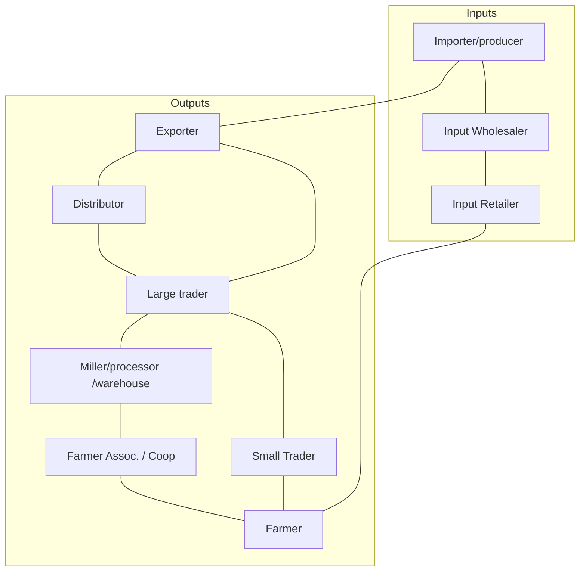
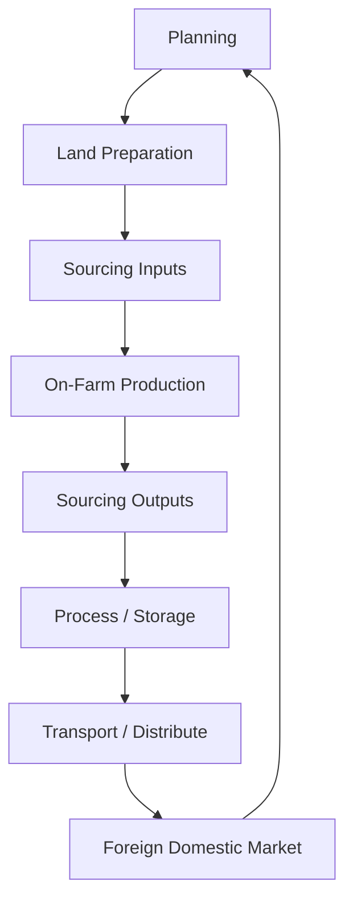
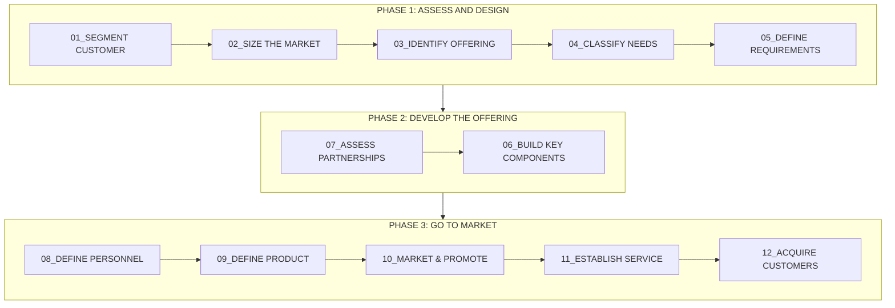
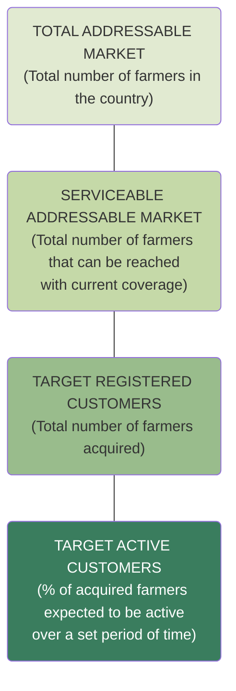
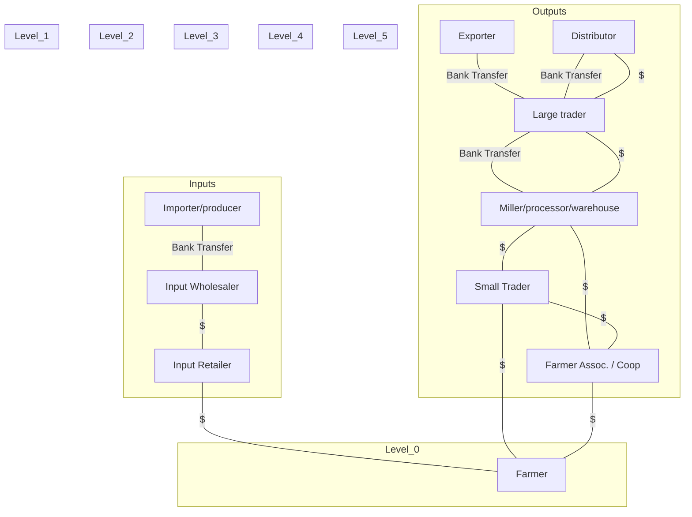
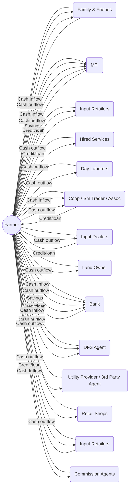

## A hard nut to crack: access to financial services in the agricultural sector in emerging markets

In many emerging markets, the story is a familiar one. It is the story of challenging operating environments, weak or non-existent linkages among actors within agri-value chains, and insufficient investment. It is also the story of a chronic lack of suitable financial products for smaller actors – from farmers to input retailers and commodity traders, processors, or buyers. And it touches a sizeable percentage of the world’s population, with smallholder farmers comprising approximately 2 billion people or nearly 500 million households.

Small-scale farms1 in emerging markets play a vital role in feeding domestic populations and meeting international demand for agricultural commodities. Smallholder farming households in Sub-Saharan Africa (SSA), for example, manage as much as 80 percent of the region’s farmland. The SSA food market alone is currently valued at $300 billion and may be worth nearly $1 trillion by 2030.2 Despite the important role of smallholder farming households, they are largely excluded from the formal financial system and have been for decades. An estimated 1 percent of bank lending in Africa is allocated to the agriculture sector.3 Yet agriculture contributes to almost 18 percent of GDP across SSA.4 Recent estimates put the demand for smallholder farmer financing to exceed $200 billion for approximately 270 million SHF in Latin America, Sub-Saharan Africa, and South and Southeast Asia.5 Beyond access to working capital, smallholder farmers and other agri-value chain actors lack financial products – savings, insurance, and payments – appropriately tailored to their needs in terms of design, accessibility, and affordability.

***

1 Small-scale in this context refers to an agricultural plot size of up to 7 hectares (Ha) but typically within the range of 0.5 to 2 Ha. The World Bank’s CGAP defines smallholder farmers as farmers that work a plot of land no larger than 1 Ha. A single hectare is approximately the size of an international rugby field.
2 Africa Agriculture Status Report 2017, AGRA, vi (https://agra.org/wp-content/uploads/2017/09/Final-AASR-2017-Aug-28.pdf)
3 Access to Finance for Smallholders Farmers, IFC, iii (https://www.ifc.org/wps/wcm/connect/071dd78045eadb5cb067b99916182e35/A2F+for+Smallholder+Farmers-Final+English+Publication.pdf?MOD=AJPERES)
4 World Bank Open Data (https://data.worldbank.org/indicator/NV.AGR.TOTL.ZS)
5 Inflection Point: Unlocking Growth in the Era of Farmer Finance, Dalberg Global Development Advisors, 2016, 5. (https://www.raflearning.org/sites/default/files/inflection_point_april_2016.pdf?token=OS8hc14U)

# Handbook purpose and orientation

The target audience for this handbook is financial service providers (FSPs) with a commercial presence in SSA. Broadly defined, this includes commercial banks, non-bank financial institutions (NBFIs), mobile network operators (MNOs), payments service providers (PSPs), insurance companies, and digital technology providers offering software or hardware solutions to clients in the banking/finance, insurance, or agriculture sectors, i.e. fintechs and agritechs. It is important to note, however, that the digitally-enabled offerings described and discussed in this handbook are ultimately intended to add value for different customer segments operating in agriculture. While these customers are not the intended audience, their needs, preferences and constraints were at the forefront during the design and development of this handbook because they are critical to any provider’s ability to effectively offer services that are appropriate and beneficial for these chronically underserved segments.

The handbook’s orientation, structure and content were developed based on several assumptions regarding this audience’s strategic priorities and operational capabilities:

*   First, these providers are not heavily invested in the agriculture sector at present but are actively exploring opportunities to enter it or re-evaluating earlier decisions to exit.
*   Second, some have launched DFS offerings in one or more SSA markets and have at least a basic familiarity with digitally enabled services.
*   Third, few have deployed DFS offerings for use by individual, enterprise, or corporate customers operating in the agriculture sector.

This handbook, therefore, is meant to support FSPs that find themselves at a pre-launch phase with respect to DFS offerings for agriculture. These assumptions also prompted a focus on two perceived knowledge gaps. The first relates to the agriculture sector; how it is structured, the players commonly involved in commodity value chains, the transaction dynamics that exist among them, and their respective needs and capabilities. The second relates to new sources and types of data made possible by digital solutions and how FSPs are incorporating these non-financial elements into their offerings.

The handbook contains approaches, examples, and tools to help FSPs understand how to engage the agriculture sector and serve a range of rural customer segments through innovative digital solutions, from farmers all the way up the value chain. Throughout this handbook, case studies are interspersed to emphasize ideas and highlight findings. These studies draw content and context from actors currently working at the intersection of DFS and agriculture. There are also reference guides, worksheets, and other materials located in the annexes. These are designed to aid readers seeking to develop or advance project planning, research, or conversations around the topic of DFS and agriculture within their organizations.

**The handbook is organized as follows:**

*   **Section 1:** The ‘Introduction’ considers the context in which DFS offerings for agriculture are emerging, identifies persistent needs and challenges vis-à-vis access to financial services in this sector, describes why digital solutions offer new opportunities to them, and highlights the broader implications of deepening financial inclusion within agriculture in SSA markets.

*   **Section 2:** ‘Ways to Approach Agriculture-focused Client Offerings’ presents examples of conceptual frameworks for assessing DFS opportunities in agriculture through a holistic, value-chain approach. It also maps relevant actors involved in the provision of DFS offerings in agriculture, with an emphasis on capabilities and needs.
*   **Section 3:** ‘Digital Solutions for Expanding Access to Financial Services’ surveys the landscape of existing DFS offerings in agriculture and describes the digital innovations that have been applied to traditional financial and information services within the context of farmer-facing, person-to-business (P2B) offerings and enterprise-facing business-to-business (B2B) offerings.
*   **Section 4:** ‘Building a DFS Offering’ approaches the topic by focusing on three stages: 1) Assess and Design, 2) Developing the Offering, and 3) Go To Market. It adopts a problem-solving orientation focused on farmers to provide adequate context to discuss service development and implementation.
*   **Section 5:** ‘Conclusion’ provides a summary of the handbook, highlighting key themes as well as putting forward some predictions regarding the future of DFS offerings in agriculture.

# DFS offerings in agriculture: an active and diverse, yet nascent, landscape

Within the last eight to ten years, a relatively small but growing stream of investment has led to a proliferation DFS and related information services aimed at the agriculture sector. These have been launched by incumbents from the finance and payments sectors as well as new entrants, such as MNOs and digital technology companies – such as fintechs – that specialize in some combination of hardware and software solutions designed to generate, capture, and analyze digital data generated from a range of sources. While these offerings exhibit a diverse range of financial and operating models, they all rely on digital solutions for many, if not all, of their business operations. Offerings can range in financial complexity from layaway payments for smallholder farmers to buy inputs without a loan to index-based weather insurance for global reinsurers. In terms of digital complexity, these offerings exhibit a similarly wide range: from no requirement on the part of a smallholder farmer to own or have access to a mobile device, to the use of smartphones and QR codes by smallholder farmers and cloud-based MIS systems by other enterprise or corporate actors in an agri-value chain.

In researching and drafting this handbook, however, few, if any, of the offerings identified have reached a mature, steady state. A significant percentage of these offerings have been on the market for less than three to four years. As a result, the observations, trends and developments identified should be viewed as emerging lessons and early experiences. Our view is that, at this stage, it would be premature to present established best practices or proven models. That said, two important trends surfaced that are worth highlighting as their relevance will likely endure: partnerships and bundled services.

### Recognizing the utility of partnerships

In most of the case studies profiled, multiple services were offered simultaneously or are envisioned as part of the provider’s broader service offering road map. There was also at least one partnership that enabled each DFS offering; whether from a purely back-office, technology systems perspective or from a front-office marketing or sales and distribution perspective. Sometimes, DFS offerings combined a range of partnerships. The roles partners play can cover a wide range of issues and responsibilities from systems infrastructure, investment and maintenance, risk management, supervisory policies and procedures; to marketing and promotion, client/user acquisition, after-sales support, and service network management. And while these partnerships are an essential ingredient in DFS deployments in agriculture, they can introduce complexity that must be actively managed.

**Putting the farmer at the center**

The chronic problems farmers face in terms of production capacity and quality, access to markets, improved trading positions, and higher incomes are interconnected with problems facing other agri-value chain actors at multiple levels. These farmer-centric problems are also a function of the overall composition and organization of the agri-value chains to which they are connected. Different approaches to serving rural customer segments at the retail, enterprise, or even corporate level are justified as a number of models and offerings have progressed in a range of markets over the last decade that warrant closer attention. These models emphasize developing a more nuanced understanding of customer needs, patterns, preferences, and perceptions – specifically as they relate to farmers. When providers more effectively target the problems of this segment, their offerings will also address the problems of other rural customer segments adjacent to or above them. This approach also enables DFS providers to invest in offerings with a compelling value proposition for a much larger percentage of a market for financial services. For these reasons, this handbook aims to give providers tools and frameworks to better understand rural customers in a new, more nuanced way, which will hopefully result in financial services that will add meaningful and durable value to their lives.

**When provided with appropriate DFS products and access to well-designed rural acceptance networks, farmers are realizing benefits that effect income, financial management, and economic resilience.**

Emerging points of evidence suggest that DFS can improve aspects of a smallholder farmer’s quality of life and that of other rural agricultural actors by expanding access to financial services, improving resilience, and raising income. Products that facilitate access to markets and price information help farmers sell their goods at times and places in which higher prices may be available. Digital savings and insurance can give farmers the capital to weather a failed crop or medical emergency. Digitally-enabled credit may allow farmers to purchase inputs that increase yields and therefore income. Recent studies also show that, in specific communities, rural households with access to savings have enjoyed more food security, increased farm investment and augmented education spending.6

Digital credit does not always lead to greater investment in agriculture but has been documented to smooth consumption, a measure of resilience. Index insurance products have been documented to increase farmers’ expenditure on yield-increasing inputs. And digital payments through the East African product M-PESA have allowed households to borrow from friends instead of reducing consumption during an economic shock.7 While acknowledging the promise offered in these studies, DFS does not constitute a silver bullet for rural poverty reduction or economic growth. Rather, it represents one of many tools that can be employed by rural households and agricultural communities to improve their lives. Further, available evidence points regarding DFS usage are typically not nationally representative and frequently localized to a community or district.

This handbook, therefore, does not advance the notion that DFS offerings broadly, or in agriculture, must lead to positive impacts irrespective of geographic location or other factors. At the same time, there are reasons to be optimistic as encouraging trends continue to emerge across a range of market contexts. This handbook was motivated, as a result, by a belief in the practical value of promoting deeper comprehension and capacity among providers seeking to better serve rural customer segments through DFS offerings in the markets where they operate.

# Understanding what farmers really value is key to designing DFS products that have strong uptake and commercial success.

While formal studies seek to measure benefits of DFS identified and prioritized by the research designer, it is important for service providers to understand what benefits and value-add farmers themselves see in these products to maximize the impact and uptake.

CGAP’s Smallholder Diaries, for example, showed that farmers in Mozambique and Tanzania expressed interest in using mobile money particularly as a means to increase the speed of transactions. Yet during the study very few farmers actually used the service37. Limited connectivity, low awareness of the product’s functions, and price sensitivity could have been among the reasons for the scant uptake. Understanding this discrepancy is, for providers, the key to better serving this customer segment.

Farmers do not always have access to traditional or digital financial services, for reasons that will be explored in depth in this handbook. While digital channels are touted as means to addressing restricted access to traditional financial services, farmers may still face literacy, connectivity, trust and other barriers. Trust has been shown to be a barrier to access where customers are unfamiliar with formal financial services and where limitations around household resources lead to risk aversion. Trust is a particularly significant barrier to access for women.38

In an IFC study, trust was found to be a significant factor in differences of DFS uptake across four countries in SSA and that trust was in turn influenced by the historical and social context of each economic and banking system and by individual digital literacy.39 Further, there is a “crucial gap” between simply having access to a mobile device and being able to use it to access diverse financial services. The relevance of the delivery method (SMS vs. internet) and the content (in terms of cultural and social relevance as well as language) “must be carefully targeted to each customer profile.”40 Generally, a strong preference for cash remains across SSA and uptake of DFS does not occur just because it is marketed as a tool that increases convenience and decreases the cost of holding cash. Uptake also depends on subjective perceptions of accessibility, relevance and the individual’s level of exclusion or inclusion in the financial system.41 Supplying DFS to rural, low-income customers requires more than simply building and releasing a product. Success entails understanding and designing for a customer with particular needs, desires and limitations.

***

37 Anderson, Jamie and Wajiha Ahmed. Smallholder Diaries, CGAP, 2016, 9. (http://www.cgap.org/sites/default/files/CGAP_Persp2_Apr2016-R.pdf)
38 The Role of Trust in Increasing Women’s Access to Finance. (https://www.usaid.gov/sites/default/files/documents/15396/The_Role_of_Trust.pdf)
39 deBruijn, ME, IC Butter, AS Fall. An ethnographic study on mobile money attitudes, perceptions and usages in Cameroon, Congo DRC, Senegal and Zambia, IFC. (https://www.ifc.org/wps/wcm/connect/98d5d3a6-a2a9-4c35-88fa-770d9ec5bc87/Final+Report+Ethnographic+Study+on+Mobile+Money_December+2017.pdf?MOD=AJPERES)
40 Anderson, Jamie and Wajiha Ahmed. Smallholder Diaries, CGAP, 2016, 9. (http://www.cgap.org/sites/default/files/CGAP_Persp2_Apr2016-R.pdf)
41 deBruijn, ME, IC Butter, AS Fall. An ethnographic study on mobile money attitudes, perceptions and usages in Cameroon, Congo DRC, Senegal and Zambia, IFC. (https://www.ifc.org/wps/wcm/connect/98d5d3a6-a2a9-4c35-88fa-770d9ec5bc87/Final+Report+Ethnographic+Study+on+Mobile+Money_December+2017.pdf?MOD=AJPERES)

# Capturing observations, trends, and developments relevant for financial service providers

This handbook documents recent learnings from initial DFS implementations in agriculture. In particular, it explores the role of partnerships and the importance of developing bundled offerings that combine a range of financial or information services depending on the needs of specific rural customer segments.

The objective of this handbook is to support financial service providers with practical guidance to utilize newly available digital technologies to expand the reach of their services into rural, agricultural value chains. After reading the handbook, practitioners will possess a more informed view of challenges in providing financial services in agriculture, the roles of the various players in the marketplace and their potential solutions, how to evaluate the needs of different rural customer segments, how to approach developing an offering, and what role partnerships can play.

While digital technology simplifies or accelerates communication, information sharing and financial transactions, expanding the digital frontier to rural areas requires adopting new capabilities and developing expertise in mobile and online platform development, digital user experience and interaction design, data capture, data management and analytics. There are typically multiple players involved in each offering. A variety of players, such as MNOs and third-party technology providers, e.g. fintechs, have entered the DFS landscape. Their decision to enter financial services was motivated by several factors, including opportunities to deploy new technology solutions that offered a more attractive user experience to meet a perceived market gap not being catered to by traditional financial institutions.

Newer market entrants exhibit an openness to, and are in many cases actively seeking, partnerships to leverage complementary skills and capabilities. These may include data management and analytics, or leveraging large digital distribution networks of other players to engage harder-to-reach customer segments, for example in agriculture. Moreover, financial service providers have a significant role to play in the provision of financial services to various customer segments in the agriculture sector. Should banks and NBFIs eschew partnerships in favor of a "go it alone" approach to building and deploying DFS products, they may fall short of their commercial objectives because of the specialized skills and capabilities mentioned above and the need to understand a complex sector.

# SECTION 2
# Ways to Approach Agricultural Focused Client Offerings

## Overview

The landscape of offerings at the intersection of digital financial services and agriculture is diverse and evolving. To reach market and to expand, many DFS offerings require the involvement of a range of commercial and non-commercial actors. Before diving into *what* exactly they provide, this section will address *who* might be involved and *why* their involvement is relevant. Because this landscape includes agriculture, answers to *who* is behind an offering will be shaped by factors unique to this sector; namely how well commodity value chains are organized, or not, which types of crops are produced, and to what extent growers are connected to other actors within a given value chain.

As Exhibit 1 illustrates, offerings can range in financial complexity from a piecemeal payments plan for smallholder farmers to buy inputs without a loan or credit line to index-based weather insurance for global reinsurers. In terms of digital complexity, these offerings exhibit a similarly wide range: from no requirement on the part of a smallholder farmer to own or have access to a mobile or digital device, to the use of smartphones and QR codes by smallholder farmers and cloud-based MIS systems by other enterprise or corporate actors in an agri-value chain.

This section opens by presenting ways to conceptualize variations in agri-value chain structure. It continues with the identification of actors commonly found within agri-value chains and the drivers that inform their potential DFS needs. The section then examines how differences in production cycles correspond to distinct customer journeys for farmers based on the type of crop or livestock grown. These nuances in agriculture are noteworthy because they must inform how offerings are designed and which customer segments to target.

Finally, the section presents a mapping of actors relevant to the provision of a DFS offering in agriculture; their respective capabilities and needs, and where potential opportunities for collaboration exist. Some actors are established incumbents in banking, payments, or mobile telecommunications. Some are technology start-ups or spin-offs. Others are smaller, less formal enterprises that play a key intermediary role in value chains, or NGOs with a rural-agricultural development mandate.

# Exhibit 1:
# Showcasing the diversity of DFS offerings for agriculture

The six offerings highlighted here provide a window to the wide range of DFS currently explored by market actors.

## myAgro

**Offering:** Micropayments, agri-inputs delivery.

**Description:** myAgro allows farmers to self-finance the purchase of agri-inputs packages via piecemeal installments. Farmers pay installments in cash at affiliated input retail locations, then receive scratch cards that must be redeemed using a mobile device to log their progress. myAgro also guarantees package delivery via a network of affiliated input retail locations.

**Role of Digital:** myAgro’s platform issues accounts for every farmer registered as well as for all affiliated input retailers. The platform tracks payments progress, supports package delivery, and is used at the point of distribution. Mobile money is used as a payments collection and money transfer service by myAgro field staff after visiting affiliated input retailers that temporarily store farmer micropayments.

**Role of Partners:** myAgro relies on agri-input suppliers for seed, fertilizer and other agri-products. It also partners with agri-businesses for storage access and transport needs based on seasonal demand. NGOs operating in rural areas are also potential partners as they can support with farmer mobilization and aggregation.

## Tulaa

**Offering:** Financing, savings, insurance, and agri-information.

**Description:** Tulaa provides farmers with access to agri-inputs financing, with an option to mobilize savings and enroll in insurance, as well as tailored agri-information content via mobile phone. Additionally, agri-input suppliers and commodity offtakers are able to transact with financial institutions on Tulaa’s platform. Financing is delivered directly to the agri-inputs supplier and repayment is made by the commodity offtaker, with the remaining balance distributed by Tulaa to the farmer.

**Role of Digital:** Tulaa’s platform connects input suppliers, commodity offtakers, financial institutions, and farmers. Farmers interact with the service via mobile device, either to access information or collect harvest sale payments via mobile money. Tulaa field staff/agents are equipped with smartphones and access the platform via a mobile app over wifi. Enterprise customers have access to a platform dashboard via desktop/laptop as well as via the mobile app.

**Role of Partners:** Tulaa needs agri-input suppliers to meet farmer demand. Commodity offtakers provide Tulaa with the ability to process more lending repayment transactions at a B2B level and create a dedicated market for farmer harvests.

## Commercial Bank of Africa (CBA)

**Offering:** Savings, credit.

**Description:** Through MNO partner e-wallet services, CBA provides a white-labeled financial account for interest-bearing savings and micro-credit, based on an alternative credit scoring model using mobile voice and data consumption patterns from MNO partners.

**Role of Digital:** Customers register for and access CBA accounts via the MNO partner’s mobile money platform. The MNO’s billing data records system (BDRS) provides anonymized data for a credit scoring algorithm that determines whether an account holder qualifies for credit and up to what amount.

**Role of Partners:** MNOs provide a range of customer-facing services, from product marketing/promotion and customer acquisition, to call center and customer relationship management (CRM) support activities. In some markets, public and private institutions may support customer aggregation, sensitization, and acquisition activities (e.g universities, corporations/enterprises, agribusinesses).

## HelloTractor

*Offering:* MIS platform for small-scale agri-equipment and remote GIS-based booking service.

*Description:* MIS platform to optimize use and maintenance of small scale agri-equipment (e.g. two-wheel tractors) for equipment owners and operators as well as supports remote service booking for farmers.

*Role of Digital:* Farmers interact with the service via mobile devices, either via SMS message or voice. Equipment owners or fleet managers interact with the service via account dashboard on a desktop/laptop application or a wifi-enabled smartphone with mobile app. Sensor hardware, GIS software, and other applications power the platforms equipment location, management, and performance evaluation services.

*Role of Partners:* Manufacturers and dealers provide agri-equipment inventory for sensor installation or retrofitting. Input suppliers and commodity offtakers provide access to grower networks. MNOs provide a mobile-based transaction method for farmers to pay booking agents and for agri-equipment owners or fleet managers to pay equipment operators.

## AgUnity

*Offering:* Payments, accounting/record-keeping, e-commerce platform for agri-products and services.

*Description:* Farmers digitally transact with their cooperatives and other market actors and can track individual activity patterns to improve trust within agri-value chains and, in particular, between farmers and farmer cooperatives.

*Role of Digital:* Farmers interact with service via closed smartphones distributed at no-cost to farmers and with preloaded mobile applications. QR code technology is used to conduct transactions between smallholder farmers and other agri-value chain actors. A general distributed ledger (GDL) technology is deployed to record transactions at the individual farmer level.

*Role of Partners:* NGOs and farmer cooperatives play a critical role in rural customer identification, outreach, and acquisition.

## aWhere

*Offering:* Predictive analytics for agribusinesses and index-based weather insurance.

*Description:* aWhere offers "virtual weather stations" that draw on data from multiple sources (i.e. satellites, weather stations, other sensors) to generate localized climate and weather patterns in agri-production areas that lack this information. It can also be used by agribusiness or commodity traders to estimate yield volumes and provide a credible baseline against which to develop and manage index-based weather insurance products.

*Role of Digital:* Imagery data and other information is sourced digitally and can be pulled from a database or collected manually using a digital collection tool. Corporate or enterprise users interface with the information and dashboard analytics via desktop/laptop or mobile app.

*Role of Partners:* aWhere relies on public and private sector entities for access to climate, weather, and other agri-related data. It also requires partnerships with agribusinesses to provide access to farm plots to support more granular data collection.

# Agri-Value Chains: A Closer Look at Differences in Structure

The metaphor of a value "chain" invokes notions of defined linkages, durable bonds, as well as rigidity. If one piece in the chain moves, other pieces move or are affected. This metaphor resonates in industrialized sectors such as manufacturing, construction, transportation, or mining. However, in most Sub-Saharan African and other emerging markets, the realities of how agriculture value chains are structured require a more flexible interpretation. This is due to several factors, including but not limited to: poor or non-existent infrastructure in rural areas (i.e. roads, power, water, and mobile telecom), production volatility inherent to agriculture (i.e. soil, seed or livestock health, weather, climate, farming practices), and weak or fragmented markets for the provision of inputs or purchase of commodities due to the presence of non-competitive forces.

To better appreciate these differences, we propose a spectrum approach that focuses on degrees of organization, using a range of characteristics. The purpose behind making these distinctions is two-fold: 1) recognizing differences supports the evaluation of commercial opportunity and risk to serve rural customer segments; and 2) understanding how actors are connected and what shapes their transaction relationships helps with developing a go-to-market strategy that positively leverages existing relationships and other market dynamics.

At one end of the spectrum, these structures appear highly informal and fragmented. At the other end, they are more formal and closely integrated. Several characteristics help determine where exactly a value chain's structure falls, including but not limited to:

*   Production capacity of farmers and standardization of growing practices42
*   Presence of local organizations (e.g. cooperatives) and farmer participation in those organizations
*   Density of actors at other levels in the value chain and their degree of formalization
*   Number of levels within the value chain and the degree of independence or dependence
*   Presence of a multinational or national corporation (e.g. a global exporter) positioned at the top of a value chain, referred to as an apex organization
*   Access to and usage of formal financial services by farmers and other value chain actors

Further, we divide this spectrum into three distinct segments: less organized, in transition, and highly organized. If we only consider the distribution of farmers – by far the largest customer segment by number within any agri-value chain – along this spectrum, the heaviest concentration of farmers are found in less organized structures operating on small plots under 7 hectares (Ha). A growing percentage of farmers fall into structures that are transitioning to more formal, commercial activity. The smallest percentage of farmers fall into highly organized structures. Of this small percentage, a majority operate large farms managed according to clear commercial production methods; although cooperatives and financial institutions such as a SACCOs, MFIs, or VSLAs, are increasingly providing smaller farmers with access to a single larger buyer, processor, or distributor.

*Figure 1: Spectrum of Smallholder Farmers Distributed According to Segments*

**Distribution of Farmers**

<table>
  <thead>
    <tr>
        <th>Less Organised</th>
        <th>In Transition</th>
        <th>Highly Organised</th>
    </tr>
  </thead>
  <tbody>
    <tr>
        <td>80%</td>
        <td>15%</td>
        <td>5%</td>
    </tr>
    <tr>
        <td rowspan="2">* Farmers operate small plots and concentrate on staple crops, which may include small livestock, also regularly engage in day laborer activities * Farmers operate for survival not a strategic business choice * Farmers have limited access to land, technology, education, markets, and other relevant information * Farmer output is low and largely for household consumption; small surpluses are sold to meet basic needs * Low incidence of local associations or cooperatives * Farmer market linkages are based on informal, verbal arrangements with input seller or crop buyers * Informal FS products are widely used * Aware of formal FS but access and usage is low, predominantly through MFIs or SACCOs, very limited bank account ownership * Dominant payment method is cash</td>
        <td rowspan="2">* Farmer crop mix focuses more on cash crops vs. staples * Farmers are poor but less so compared with subsistence segment * Farmers have decent access to inputs and some information about weather, markets, and prices * Farmers rely on manual production methods but some can afford to rent equipment or buy tools * Farmers sell surplus production in local or regional markets * Farmers are connected to markets for inputs and crops via well-established but still mostly informal trading channels * Growing percentage of associations or cooperatives to facilitate rural aggregation of harvests, streamline transport logistics and market linkages, improve sale price negotiations, * FS exposure and usage is common, including accounts with banks, SACCOs, or MFIs * Dominant payment method is cash</td>
        <td rowspan="2">* Farmers' main source of income is from higher value crops * Farmers take a more business-like approach, many use mechanized equipment for planting or harvesting * Farmers regularly engage in contract farming or have clearly defined production targets * Crops typically have established quality standards * High percentage of bank account holders * Exposure to multiple formal banking products (current account, savings account, credit, loan) * Familiarity with diverse payment methods (cash, check, or bank wire) and channels (branch and online)</td>
    </tr>
  </tbody>
</table>

**Less Organized:** These structures are characterized by farmers whose crop or animal husbandry practices are meant for subsistence, and production capacity is low. Yield quantity and quality is volatile due to poor access to inputs and less access to more recently developed farming practices. Cassava production in the northwestern region of Uganda would be one example of a less organized agri-value chain structure. Farmers in this type of structure buy inputs and sell their crops or livestock to mostly informal, often dense networks of small, independent retailers or traders. These retailers and traders are connected to multiple sources, some reputable and others operating in the grey or black market. This means input quality levels can be low and prices less favorable to farmers. While farmers in this type of value chain structure have well-established links to these first-line sellers and buyers, a large majority of them operate as non-registered, micro-to-small enterprises, and rarely use formal contracts. The income and expenditure patterns of smaller farmers in this type of value chain structure can be complex, unpredictable and often weak. While their annualized daily incomes are low, this figure belies a resourcefulness and sophistication around managing cyclical shortages, allocating capital to multiple productive activities and unpredictable external shocks (i.e. health emergency, bad weather, pest/disease outbreak). As we discuss in more detail later, time allocation and overall activity patterns of farmers in this structure are important considerations as this understanding may impact how assessments of risk and cash flow are conducted.

**In Transition:** For those structures becoming increasingly organized, farmers grow a higher percentage of cash crops or are adopting better livestock management practices. They also typically enjoy greater access to quality inputs – including tools, machinery, and other equipment. Production capacity is more stable, larger, and of increasing quality. More commercially-focused activity can also lead to greater specialization in agri-related activity and less diverse income streams. Cow-based dairy production in Kenya would be an example of a value chain structure in transition. Farmers are linked to a smaller, more formal network of input sellers and commodity buyers. Links to both sets of actors are still driven by personal relationships but formal contracts are used, especially between farmers and higher value cash crop buyers. Sellers and buyers are also more likely to have formal relationships with larger distributors or off-takers, either as commissioned agents or paid staff.

**Highly Organized:** Structures in this category include farmers that are capable of consistent high volume, high quality yields. This is due to strong, easy access to quality inputs, tools, equipment, as well as the application of commercial-grade techniques for planting, tending, and harvesting. On either the buying or selling side, farmers in these value chain structures deal with a finite number of agri-enterprises and primarily via formal contracts entered into directly by a farmer or through an aggregating entity (i.e. farmer cooperative, SACCO, MFI). In many instances, there are very few independent middlemen involved in trading or transportation. Farmers may even deal directly with a national distributor or buyer that will assume responsibility and cost of delivering inputs or collecting crops and livestock.

In Section 4. ‘Building an Offering’, the handbook explores the implications of these differences in value chain structure for DFS providers. It is worth highlighting here, however, that the immediate reaction or instinct *should not be to automatically dismiss less organized agri-value chains*. In fact, it is precisely these types of agri-value chains where opportunities to offer DFS may be greatest due to a) overall market size, b) anemic levels of traditional financial services usage, and c) latent demand for formal financial services as evidenced by the penetration of informal providers offering more costly finance terms (in many SSA markets annualized interest rates can exceed 75 percent) but highly flexible repayment options. If DFS providers successfully combine innovative digital solutions that lower cost and improve rural service expansion with greater knowledge of how rural market segments function, they can approach agri-value chains with an eye towards not only commercial feasibility but also profitability over the longer term.

# Identifying Common Agri-Value Chain Actors and Understanding Drivers of DFS Needs

With a firmer grasp of how agri-value chain structures differ, we turn our attention to the actors commonly found in these chains and the drivers that shape different DFS needs. We consider three basic categories of actors; those involved in farming for crop production or animal husbandry, the provision of agri-inputs, and the sourcing, trading, or distribution of outputs. We also propose a tiering approach that includes six distinct levels to differentiate these actors based on their roles and activity patterns in the value chain.

Figure 2: Illustrative Agri-Value Chain Actor Map: Crop-based Outputs

### Figure 2: Illustrative Agri-Value Chain Actor Map: Crop-based Outputs (Tabular Representation)

<table>
  <tbody>
    <tr>
        <td>Level</td>
        <td>Inputs</td>
        <td>Outputs (Trading/Processing)</td>
        <td>Outputs (Farming/Aggregation)</td>
    </tr>
    <tr>
        <td>Level 5</td>
        <td>Importer/producer</td>
        <td>Exporter   Distributor</td>
        <td></td>
    </tr>
    <tr>
        <td>Level 4</td>
        <td></td>
        <td>Large trader</td>
        <td></td>
    </tr>
    <tr>
        <td>Level 3</td>
        <td>Input Wholesaler</td>
        <td>Miller/processor /warehouse</td>
        <td></td>
    </tr>
    <tr>
        <td>Level 2</td>
        <td></td>
        <td>Small Trader</td>
        <td></td>
    </tr>
    <tr>
        <td>Level 1</td>
        <td>Input Retailer</td>
        <td></td>
        <td>Farmer Assoc. / Coop</td>
    </tr>
    <tr>
        <td>Level 0</td>
        <td></td>
        <td></td>
        <td>Farmer</td>
    </tr>
  </tbody>
</table>

*Note: The diagram indicates various financial flows between actors, including cash transactions (represented by $) and digital/formal transactions (represented by "Bank Transfer" icons).*

Figure 2 depicts input and output actors in a generic, less complex agri-value chain typically associated with crop-based commodities – such as cereals, coffee, cocoa, tea, or nuts – that involve milling, processing, or warehousing. On the inputs side, agri-value chains commonly exhibit a rather thin hierarchy with a smaller number of levels that includes an apex organization(s), regional or national wholesalers, and localized retailers. On the outputs side, multiple levels are also the norm, but the exact number varies widely based on several factors, including the type of commodity produced as some actors are not present in all production cycles.

Because these actors play different roles and exhibit specific activity patterns and capabilities, it is important to consider each different level since the drivers that shape specific DFS needs are not across actors. We recommend applying this level of detail to agri-value chain analysis as it supports a holistic approach to DFS offering design and deployment that can capture variations in customer needs based on how they operate and interact within a given chain.

We identify the following categories of drivers shaping specific DFS needs:

a. **Revenue Generation** - considers the likely types, sources and patterns of revenue generated. This driver impacts DFS needs vis-a-vis willingness and capacity to pay for different products (savings, credit, lending) and potential terms and conditions (interest rates, repayment schedules).
b. **Transaction Relationships** - considers which other levels an actor would likely transact with and what the prevailing payments methods might be. This driver impacts DFS needs regarding product parameters around use (timing, velocity, and volumes of payments/transfers)
c. **Formal Financial Services (FS) Usage** - considers not only account ownership and type of product used – savings, credit, lending, or insurance – but also broader issues of awareness and access such as proximity to branch network, applicable fees, familiarity with alternative channels (i.e. ATMs, online, mobile banking, banking agents). This driver impacts DFS needs regarding which types of products may have greater viability given current usage and gaps.
d. **Information Access/Digital Technology** - considers the types, sources, and patterns of accessing information as well as the degree to which digital technology may have penetrated this process of sourcing information. This driver impacts DFS needs around service distribution and product design as account proximity and the overall user experience could include several digital components.

The page features a large, stylized illustration representing the ecosystem of digital financial services for agriculture. The illustration is divided into several thematic areas using geometric shapes and icons:

*   **Technology and Infrastructure:**
    *   A large yellow sun at the top center.
    *   A satellite in orbit.
    *   An agricultural drone.
    *   A telecommunications tower emitting signals.
*   **Community and Education:**
    *   A school or community building with people (children) playing outside.
*   **Household and Small-scale Farming:**
    *   A house with a solar panel on the roof.
    *   A woman and child standing near the house.
    *   Chickens and a small plant/flower.
*   **The Farmer:**
    *   A central circular inset shows a female farmer carrying a baby on her back and a hoe over her shoulder, while holding and looking at a smartphone.
*   **Commercial Agriculture:**
    *   A tractor in a field.
    *   Various crops including carrots, corn, wheat, and coffee beans/trees.

# The Digital Landscape of Farming in Africa

Digital technologies offer a range of solutions to many of the challenges smallholder farmers and other actors in agri value chains face in order to produce, trade and invest as efficiently and successfully as possible. This illustration highlights a few of the emerging DFS in the agricultural sector.

**Production:** DFS can help smallholder farmers better source and finance seeds and other inputs, as well as lease equipment such as tractors. Satellite and other data sources can help provide relevant weather and soil data for better production practices.

**Market:** DFS can help connect the various actors in the agricultural value chains to efficiently source and trade produce at various levels, from local to international markets. There are various digital solutions for monitoring stock, pricing information and for payments.

[The illustration depicts a connected agricultural ecosystem including:
- Clouds and an umbrella representing weather data and insurance.
- A bank building representing financial services.
- A market stall with produce and a mobile phone representing digital trade and payments.
- Sacks of grain, crates of fruit, and livestock (chickens, cow) representing agricultural output.
- A delivery truck representing logistics.
- Crops and fields representing production.
- An airplane representing data collection via drones or aerial surveillance.]

**Data collection:** A range of new digitally connected data sources, including satellite, sensors and drones, coupled with more traditional KYC and transactional data make it increasingly possible for service providers to offer credit and insurance to smallholder farmers.

**Livelihoods:** DFS make it possible for rural communities to connect to urban family members for fast money transfers, and pay for school fees digitally. An increasing body of evidence also show that access to mobile savings can help smallholder households better smooth consumption over the lean months.

[The image shows a stylized green icon of a farmer with a headscarf, carrying a tool over their shoulder and a baby on their back.]

# LEVEL 0: FARMERS

Farmers at this level are defined as those who grow crops or livestock on plot sizes of seven hectares or less, and they constitute the great majority of people engaged in farming in Sub-Saharan Africa. The land they cultivate or access may be theirs or they may rent. Their production is largely for subsistence, with limited selling onto local or regional markets depending on their participation in community-based organizations or linkages to traders that operate on a wider geographic scale.

## Drivers of DFS Needs

**Revenue Generation:** Farmers in this category generate multiple revenue streams throughout a calendar year. These streams result from selling different crops that are rotated on their fields, livestock, or animal by-products (e.g. dairy). Some revenue streams are un-related to crop selling but tied to agri-production such as manual labor, tool or land rental, as well as small scale trading.

**Transaction Relationships:** Farmers rely on a complex web of relationships with agri-value chain actors immediately adjacent to, or just above, them. These relationships are widespread and well-established. In most instances, farmers directly engage these actors. While informal, these relationships are well-established and often influenced by senior or other respected members within a rural community (e.g. a lead farmer). Farmers, therefore, may have more freedom to choose who they sell to than who they buy from as the use of informal credit frequently binds farmers to a particular input distributor. Where cooperatives or other rural financial institutions are present, mature, and well-connected to larger value chain actors above the farmers, farmers may source inputs and connect to buyers through an intermediary. All transactions are conducted on a cash or barter basis unless informal credit is being extended to farmers – most commonly for the purchase of inputs.

**Conventional Financial Services Usage:** Formal account ownership is quite low and typically restricted to male farmers. Personal savings accounts are the most common products used, although activity rates and running balances are very light. A small percentage of farmers may have successfully applied for and received a micro-loan from a bank. Informal savings methods such as tontines, VSLAs or other rural group-based models are widely known and frequently used. Some are quite mature and well-managed, with low membership turnover. They serve a range of purposes from income smoothing, to withstanding unexpected small shocks or acquiring a valued asset (i.e. construction materials, solar products). Farming households also take out microfinance loans but, for cultural and other reasons, these are often accessed through female family members. Further, these loans are commonly earmarked for non-farming activities; such as small-scale trading, other micro-enterprise activities or to cover important expenses such as school fees. Insurance products are rare unless part of a bundled offering brought by a microfinance institution or donor-driven initiative. Although usage levels are low, farmer awareness and interest in other formal products, loans and credit, is often high. Major barriers blocking the conversion of farmer interest into product use include fees, repayment terms, as well as proximity to service locations. Finally, the vast majority of farmers only access services within a branch, unless a bank agent visits them. Exposure to other delivery channels (e.g. ATM) is extremely low.

**Information Access/Digital Technology:** Farmers rely heavily on social networks for information with radio and agri-extension services networks providing additional access channels. The mobile channel is the dominant if not the only means by which farmers interact with digital technology. Mobile ownership and usage can range considerably. Most farmers purchase cheap basic handsets for voice communication and may use their phones to source pricing information from friends, families or other contacts during harvest seasons. In many markets, this trend is increasing.

[The image shows a stylized green icon of a delivery truck with an arrow pointing forward.]

# LEVEL 1: LAST MILE AGGREGATORS/ DISTRIBUTORS

Last-mile aggregators are located on the outputs side in a value chain. They provide a central location in deep rural areas to combine harvest yields as well as serve to organize and build the capacity of farming communities. Last-mile aggregators usually take the form of a cooperative, association, or NGO.

On the inputs side, last-mile distributors are those retailers selling a range of agri-inputs (i.e. seeds, fertilizer, and herbicides/pesticides) and related products or services. Typically, they are independently owned, but sometimes they form part of a regional franchise or national chain. Last mile distributors would also include hired services that rent tools or equipment to individual farmers or farmer groups.

## Drivers of DFS Needs

**Revenue Generation:** Last-mile aggregators may or may not operate on a for-profit model. Those that do generate revenue are dependent on agri-production cycles unless additional dues or service fees are paid by

members. Commodity or livestock trading activity is also restricted to specific time periods that may be rather short, as in the case of perishable crops where there is little to no extended storage activity. Almost all revenue generated, therefore, is a function of finding markets and buyers for trading inventory.

Last-mile distributors face similar sales cycles, but with activity spikes preceding crop-planting or just after livestock purchasing. Some revenue smoothing can be achieved through inventory diversification into household items (e.g. hygiene or cleaning products). They may also generate revenue through letting land, tools, or equipment. To optimize revenue generation, last-mile distributors must actively manage inventory; although many lack formal tools to do this, whether analog or digital.

***Transaction Relationships:*** Last-mile aggregators have limited visibility up the value chain outside of their direct affiliations with larger enterprises such as a processor or wholesale commodity trader. Transactions are conducted in cash unless the organization has a bank account, in which case some percentage of transactions may involve a check or bank wire.

Last-mile distributors operate cash-based retail businesses, but informal credit is frequently extended to known or trusted customers at negligible to zero interest. This practice serves multiple purposes: commercial necessity, customer loyalty, and new customer acquisition. However, it can introduce an accounting requirement and a rather involved and sometimes costly collection process. Last-mile distributors purchase their inventory from larger sellers in cash, unless the enterprise or corporation is prepared to offer supplier credit, typically through formal financing channels (e.g. banks).

***Conventional Financial Services Usage:*** Among last-mile aggregators, formal account ownership is likely to be higher than among their farmer members, but broad utilization of financial services outside of conducting sales transactions with traders or other buyers that prefer wire transfers or check-based transactions is likely low. Reliance on formal financing for operational activities (i.e. bulking, weighing, and packaging) is quite limited as last-mile aggregators often lack detailed financial records, business plans and other documentation necessary for application processing and approval.

Among last-mile distributors, formal financial product ownership is typically higher than among farmers or last-mile aggregators. As for-profit entities, they have larger cash flows, a cash handling requirement for selling inventory, interact more regularly with formal enterprises above them, and have greater mobility to access branch locations. Given their size relative to other larger distributors however, formal financing is not actively sought after by last-mile distributors who are more likely to secure additional financing from family, friends or their community.

***Information Access/Digital Technology:*** Information access is stronger among last-mile aggregators and distributors than among farmers, as they both interact more frequently with actors above them and enjoy a level of mobility many farmers do not have. Formal education and basic numeracy/literacy levels may also be higher, allowing these actors to collect more information from printed sources. In terms of digital technology, the proximity of last-mile distributors to trading centers or more densely populated centers provides them access to mobile technology vendors and to other digital delivery channels for banking and payments, such as ATMs or POS terminals.

[The image shows a stylized icon of a market stall or street vendor cart with a striped awning.]

# LEVEL 2: SMALL TRADERS

Small traders are individuals that operate informal microenterprises on a wholly independent basis or as affiliates of larger buyers such as millers, processors, warehouses, or larger traders. These actors tend to be intermediaries between open markets and farmers or last-mile aggregators, or between entities involved in the next stage of value addition and farmers or last-mile aggregators. Some traders may work in groups or affiliated networks, but they largely operate informally.

## Drivers of DFS Needs

***Revenue Generation:*** Commodity trading is the dominant revenue stream for small traders and therefore will follow the production patterns of that particular crop or value chain. Many are also farmers or earn additional revenue through crop selling or the letting of vehicles, equipment, or land.

***Transaction Relationships:*** Small traders deal heavily in cash but may have occasional exposure to wire transfers if they deal with larger enterprises and have a bank account. Contracts are not the norm but do appear in some more organized value chains.

***Conventional Financial Services Usage:*** Account ownership is highly inconsistent depending on location, sector, or market. Traders in more formal value chains that are linked with international markets that deal in larger networks and with larger quantities of goods are more likely to own accounts. Traders who can use credit products are able

to buy larger quantities of commodities and therefore expand business operations, but many do not have access.

*Information Access / Digital Technology:* Depending on size of the geographic area of operation, small traders may have similarly restricted access to information as farmers. They are more likely to have mobile phones than farmers in some cases.

[The image shows a stylized icon of a factory or warehouse with a chimney and three circular windows.]

# LEVEL 3: WHOLESALERS/ MILLERS/ PROCESSORS / WAREHOUSES

This level of actor is present on both the inputs and outputs side of an agri-value chain. On the inputs side, wholesalers purchase and sell agriculture supplies in bulk and maintain a single facility or network of facilities for receiving and distributing their inventory. On the outputs side, warehouses, millers, and other processors (i.e. for crops, livestock or animal by-products) source raw materials grown by farmers and add value by converting them into new products through activities that typically require a stable power supply, mechanized equipment and other infrastructure. Like wholesalers, these actors may also own or manage a network of physical locations and a fleet of vehicles for the collection and distribution of materials.

## Drivers of DFS Needs

*Revenue Generation:* For input wholesalers, inventory sales are the dominant revenue stream. For millers, processors, and wholesalers on the outputs side, their primary income stream is from the sale of milled or processed outputs further up the value chain or by storing raw commodities for a fee. Because most farmers do not have access to on-farm or nearby storage and because it is key to avoiding massive waste and spoilage, this service is central within many crop-based value chains.

*Transaction Relationships:* Actors at this level are dependent on a diverse network of distribution or sourcing channels to support a reliable supply of raw materials for storage or value addition and to sell these onward. They are typically well connected to actors above and below them in the value chain.

*Conventional Financial Services Usage:* Account ownership is elevated and usage is consistent as compared with small traders and farmers. Usage is geared towards managing payments, though credit can be used for upgrading and expanding equipment or storage facilities to add higher levels of value to raw products.

*Information Access/Digital Technology:* Digital technology access through the mobile channel is quite prevalent at this level, but even these actors may face limitations resulting from poor performance of low-cost devices and unreliable mobile network connectivity. This segment may have wider mobility to access information in larger towns but still may not visit large urban areas very frequently.

[The image shows a stylized icon of a heavy machinery vehicle, like a crane or excavator, with a dollar sign symbol attached to the lifting arm.]

# LEVEL 4: LARGE TRADERS

Large traders are found on the outputs side of an agri-value chain and operate formal enterprises that specialize in the buying and selling of raw or processed agricultural commodities in bulk. Given their trading volumes, these actors typically own physical storage facilities and vehicle fleets to orchestrate buying, storage, and delivery activities.

## Drivers of DFS Needs

*Revenue Generation:* Primary income stream is from trading activity, with diversification into other ventures. This group differs from small traders in that they are more organized and tend to operate as more formal businesses with multiple employees rather than as individuals or informal networks. In some very loose value chains, large traders may not exist.

*Transaction Relationships:* Large traders have transaction relationships with lots of actors above and below them in the value chain. They differ from small traders in that they can rely on advance contracts from actors above them, such as exporters and distributors, that are frequently paid electronically via bank wire. With actors below, cash-based payments are the dominant method for sourcing commodities.

***Conventional Financial Services Usage:*** Large traders are bank account holders and frequent users of a variety of basic financial services. They are familiar with conventional financial service providers and have likely been exposed to a range of alternative service delivery channels, from ATMs and POS terminals to online or mobile banking applications.

***Information Access / Digital Technology:*** Large traders have consistent access to mobile technology and other information about commodities and pricing. They are likely to pass frequently between rural and urban or peri-urban areas and have greater information access as such.

[The image shows a green icon of a hand truck or dolly.]

---

# LEVEL 5: PRODUCERS, IMPORTERS, DISTRIBUTORS, AND EXPORTERS

Actors at this level are multinational or national corporations involved in either mass production or importation of agri-inputs (i.e. seeds, fertilizer, tools, or equipment) or mass sourcing, processing and selling of agricultural commodities. They are typically well capitalized, with sizeable investments in sourcing, storage, packaging, and distribution infrastructure.

## Drivers of DFS Needs

***Revenue Generation:*** Actors at this level are selling a product that has had as much value added to it as possible so while this is not a high-margin area, revenue is higher for these actors than for any others further below in the value chain. Products at this level are sold on to domestic and international markets for final levels of processing and value addition.

***Transaction Relationships:*** Depending on the value, these actors will have a diverse and potentially far-reaching network of transaction relationships with a variety of entities that want to buy finished or nearly finished agricultural products. These could include stores or wholesalers, international companies and buyers, and other domestic processors. They will also have a relatively large network of transaction relationships with the traders or cooperatives they buy commodities from.

***Conventional Financial Services Usage:*** Value chain actors at this level are likely using a wide variety of existing financial services with frequency, including bank accounts, credit products and perhaps certain types of insurance. When needed, credit is used for buying larger quantities of raw goods and semi-processed goods and adding value through further processing or packaging.

***Information Access/Digital Technology:*** As large national or multinational corporations, managers and staff at this level are much more likely to have a range of digital and mobile technologies and internet connectivity. This provides them with access to updatable information on specific topics or activities, particularly related to their traded commodities.

# Agri-Production Cycles: What Farmers Grow Lead to Different Customer Journeys

Thus far, we have explored variations in overall value chain structure and how actors within these value chains fall into distinct groupings based on their roles and activity patterns. We now turn our attention to another element relevant to agri-value chain assessments: production cycles. The reason being that what a farmer grows impacts how, when, and why they consume financial and information services. If providers can better understand these patterns in terms of sequencing and timing, they can more accurately chart the journeys of their prospective customers and more effectively design and deploy DFS offerings.

Figure 3 exhibits the several stages within a generic agri-production cycle. These stages reflect activities or decisions that occur during a) pre-farm production, b) on-farm production, and c) post-farm production.

---
*Figure 3: Agricultural Production Cycle: Generic*

The first three stages – **planning, land preparation and sourcing inputs** – involve farmers as they prepare for growing crops or tending livestock. Often, these stages last only a few weeks combined. Interaction between farmers and other value chain actors is limited to retailers and cooperatives if the crop or livestock to be grown has heavy input requirements (i.e. seed, fertilizer, pesticide/herbicide, feed, medications, or water) before manual labor is sourced to assist with land preparation or planting activities.

During the fourth stage, **on-farm production**, the farmer is the dominant player. It begins with planting seeds, tending trees, or buying livestock, and concludes once the farmer has sold their harvest or livestock. This is typically the longest stage for the farmer and may last several months, especially in the case of perennial crops such as coffee, tea, or cocoa. Farmers interact with hired labor, input suppliers (e.g. purchase of herbicide/pesticide), or agri-services providers (e.g. equipment rental) at specific periods, provided there is available capital and a need for such services.

The subsequent three stages – from **sourcing outputs, through process/storage, to transportation and distribution** – correspond to activities and decisions taken by actors at different levels on the outputs side, from cooperatives and small traders to millers, large traders, and exporters. Raw commodities or livestock make their way along the value chain as they are collected, processed, stored, and distributed. The final stage, **Foreign/Domestic Market**, completes the cycle and includes only entities that sell directly to domestic distributors for retail consumption or that export to foreign markets.

When working towards an actual design and deployment of a DFS offering in this sector, however, it is important to be aware that this production cycle will shift depending on what crops are grown or what livestock is being raised. Not all stages or actors are present, nor is the intensity of activity the same.

In the Tools 2 (page 203) five variations of the generic agri-production cycle are identified: 1) cereals, 2) perennial tree-based crops, 3) perishables, 4) dairy, and 5) livestock. The rationale for organizing production cycles in this way is two-fold. First, the number of agricultural commodities under production in most Sub-Saharan African markets is considerable and can vary widely region to region and market to market. This makes it highly impractical to estimate the appropriate number and type of commodities to consider here. Secondly, these categories allow for a degree of aggregation based on similar attributes that still supports meaningful comparisons. In the same section, additional details broken out by each variation are identified and key considerations proposed for DFS providers as they undertake preliminary service assessments and design activities for each. Below are brief summaries that highlight similarities and differences and their relevance for DFS offerings, also captured in Figure 4.

*Figure 4: Agricultural Production Cycles Comparison by Type of Output*

```mermaid
graph LR
    subgraph Cereals
        C1[Planning] --> C2[Land Preparation] --> C3[Sourcing Inputs] --> C4[On-Farm Production] --> C5[Sourcing Outputs] --> C6[Processing/ Storage] --> C7[Transport/ Distribution] --> C8[Foreign/ Domestic Market]
    end
    subgraph Perennial_Tree_based_Crops
        P1[Planning] --> P2[Land Preparation] --> P3[Sourcing Inputs] --> P4[On-Farm Production] --> P5[Sourcing Outputs] --> P6[Processing/ Storage] --> P7[Transport/ Distribution] --> P8[Foreign/ Domestic Market]
    end
    subgraph Perishables
        PE1[Planning] --> PE2[Land Preparation] --> PE3[Sourcing Inputs] --> PE4[On-Farm Production] --> PE5[Sourcing Outputs] --> PE6[Transport/ Distribution] --> PE7[Foreign/ Domestic Market]
    end
    subgraph Dairy
        D1[Planning] --> D2[Sourcing Inputs] --> D3[On-Farm Production] --> D4[Sourcing Outputs] --> D5[Processing/ Storage] --> D6[Transport/ Distribution] --> D7[Foreign/ Domestic Market]
    end
    subgraph Livestock
        L1[Planning] --> L2[Sourcing Inputs] --> L3[On-Farm Production] --> L4[Processing/ Storage] --> L5[Transport/ Distribution] --> L6[Foreign/ Domestic Market]
    end

    style C4 fill:#004d33,color:#fff
    style P4 fill:#004d33,color:#fff
    style PE4 fill:#004d33,color:#fff
    style D3 fill:#004d33,color:#fff
    style L3 fill:#004d33,color:#fff
    
    style C8 fill:#f9a825,color:#fff
    style P8 fill:#f9a825,color:#fff
    style PE7 fill:#f9a825,color:#fff
    style D7 fill:#f9a825,color:#fff
    style L6 fill:#f9a825,color:#fff
```

**Cereals:** This type most closely follows the generic example cited above. Commonly grown crops that follow this cycle include rice, maize, soybean, millet, pulses, and wheat. Capital is required every season for a range of production and harvest-related needs, ranging from manual labor, equipment, and inputs. Multiple actors operate at different levels on both the inputs and outputs side. There is also a strong presence of actors on the output side playing roles related to processing, storing, and transporting these commodities. Harvest cycles for most cereals follow an annual pattern with the possibility of a second bumper crop dependent on weather and growing conditions.

**Perennial, tree-based:** This type follows that of cereals, in terms of number of stages, actors present, and post-production sourcing, processing, and distribution. Common examples of crops that follow this cycle include coffee, cocoa, rubber, and tea. Unlike cereals, there is no seed requirement and, as a result, relatively lower input requirements (unless there is a replanting effort). Labor is the dominant, seasonally recurring expense requiring capital, and occurs at multiple periods during the growing stage. Harvest cycles are semi-annual and raw harvested yields have a shorter trading period compared to cereals. Depending on how organized the value chains are in terms of the reach of more formal buyers or processors, the process may be highly time and labor intensive for many farmers.

**Perishables:** Crops that follow this cycle include vegetables and certain fruits. This type is comparable to both cereals and perennial tree-based crops in terms of the number of pre-farm production stages and the presence of actors on the inputs side. Like cereals, there is a seasonally recurring capital requirement for inputs and manual labor. However, requirements for manual labor and inputs (namely for fertilizer and pesticides) can be much higher. Harvests occur more frequently than in cereals or tree-based crops, on a bi-monthly or quarterly basis. The need to time harvest collection and market delivery is much more pronounced in perishables than in cereals due to spoilage issues. Noticeably absent from the perishables cycle in many markets are actors on the output side that play a storage or processing role.

**Dairy:** This type is specific to the tending of livestock for the production of animal milk. The most notable differences between this variation and

earlier ones are the absence of a land preparation phase, which includes tilling and other activities related to preparing soil, and fewer inputs requirements. That said, there are recurring capital needs that involve inputs pertaining to animal health and adequate food supply. Milk production occurs on a daily basis and most dairy operations have limited on-farm storage. Also, the dairy cycle exhibits the same number of stages and actors once into post-production, and there are similar commercial imperatives vis-a-vis timely collection, proper storage, and rapid distribution of milk.

**Livestock:** This is the most removed type from the generic cycle example. There is no land preparation stage and there is no comparable post-production stage where an actor comes to the farm gate or a designated bulking center to purchase and collect harvested crops. Instead, farmers rely on fixed or roaming markets to buy, sell, or trade livestock. As a result, they have recurring capital requirements closely tied to arranging transport and to purchasing livestock. Feed and medical supplies are additional expenses these farmers may make, which are also commonly found at these same markets. Trading activity follows the maturation process of the animals being raised, and the desired specifications of prospective buyers.

Table 1 compares agri-production cycles by harvest/production schedule, production requirements, and post-production requirements. Production requirements refer to services or products tied to crop cultivation or livestock management up to the point of harvesting, production, or sale that introduces a financing requirement for a farmer, such as labor, inputs, tools, or equipment. Post-production requirements refer to activities or services tied to sourcing, storing, processing, or transporting that introduces a financing requirement for either a farmer or another agri-value chain actor.

***

### Table 1: Agricultural Production Cycles Schedule, Requirements and Relevance for DFS

<table>
  <tbody>
    <tr>
        <td>Production Cycle</td>
        <td>Harvest/Production Schedule</td>
        <td>Production Requirements</td>
        <td>Post-Production Requirements</td>
    </tr>
    <tr>
        <th>Cereals</th>
        <th>1-2 per year</th>
        <th>Land preparation: intensive Inputs: intensive Tools/Equipment: intensive</th>
        <th>Harvesting: intensive Transport: intensive Storage/Processing: intensive</th>
    </tr>
    <tr>
        <td>Relevance for DFS</td>
        <td colspan="3">• Access to quality seeds and fertilizer impacts yields – digital financing mechanisms can enable farmers to purchase inputs at reasonable rates of interest and on more flexible terms • Yields are also tied to weather conditions – insurance can guarantee minimum income levels • Market information on pricing and market linkages are not well-established – remote payments and digitally linking sellers and payers can optimize trading activity</td>
    </tr>
    <tr>
        <th>Perennial, Tree-based</th>
        <th>1-2 per year</th>
        <th>Land Preparation: Light Inputs: Moderate Tools/Equipment: Light</th>
        <th>Harvesting: Moderate Transport: Intensive Storage/Processing: Intensive</th>
    </tr>
    <tr>
        <td>Relevance for DFS</td>
        <td colspan="3">• Ability to hire and pay day laborers is typically important in this value chain • Sufficient funds for pest control tied to affordable credit mechanism • Availability of leasing instruments for equipment can improve yields and post-harvest handling</td>
    </tr>
  </tbody>
</table>

<table>
  <thead>
    <tr>
        <th>Perishables</th>
        <th>6-8 per year</th>
        <th>Land Preparation: Moderate Inputs: Intensive Tools/Equipment: Moderate</th>
        <th>Harvesting: Moderate Transport: Intensive Storage/Processing: Moderate</th>
    </tr>
    <tr>
        <th colspan="4">Relevance for DFS</th>
    </tr>
  </thead>
  <tbody>
    <tr>
        <td colspan="4">• Produce price volatility places a premium on market information and speed of payments • Storage mechanisms can improve produce pricing to the farmer • Sufficient funds for pest control tied to affordable credit mechanism</td>
    </tr>
    <tr>
        <th>Dairy</th>
        <th>Daily</th>
        <th>Land Preparation: Light Inputs: Moderate Tools/Equipment: Intensive</th>
        <th>Production: Intensive Transport: Intensive Storage/Processing: Intensive</th>
    </tr>
    <tr>
        <th colspan="4">Relevance for DFS</th>
    </tr>
    <tr>
        <td colspan="4">• Digital payments to farmers reduces cost of cash burdens to buying cooperatives</td>
    </tr>
    <tr>
        <th>Livestock</th>
        <th>Varies based on type and desired buyer demand</th>
        <th>Land Preparation: Light Inputs: Moderate Tools/Equipment: Light</th>
        <th>Trading: Light Transport: Moderate Storage/Processing: Moderate</th>
    </tr>
    <tr>
        <th colspan="4">Relevance for DFS</th>
    </tr>
    <tr>
        <td colspan="4">• Market pricing and transportation information are key revenue drivers • Funds for feed and new animals are often financed • Savings mechanisms are important to smooth income flows</td>
    </tr>
  </tbody>
</table>

To complete the customer journey from a farmer perspective, this subsection concludes by unpacking a single stage, *On-Farm Production*. The activities and decisions during this stage account for most of a farmer’s consumption of financial or information services. As Figure 5 illustrates, multiple phases comprise the on-farm production stage. It also highlights which services are likely relevant as farmers progress from one phase to the next. The information and financial services listed are indicative not exhaustive. They are meant to provide a starting point to determine what patterns can be identified and assumptions made to validate at the farmer level, through tailored market research. Further, in the Tools 2, (page 203) we provide illustrations of the on-farm production phases specific to each of the production cycles already outlined.

As farmers progress through the planting and growing phases, there are recurring but oftentimes unpredictable needs for labor or inputs. These needs trigger payments between farmers and other individuals or enterprises, as well as the potential need for finance or leasing for production-related activities. The information services that a farmer might find most relevant – such as weather updates, best practices reminders, or outbreak alerts – would support improved planning and timing of these payments. This information could also help the farmer more quickly and accurately purchase the right kind of inputs, from reliable sources, in the appropriate amounts and applied in the correct manner.

When farmers enter the harvesting phase, the need for labor and some degree of equipment rental or transportation triggers another round of payments. These payments may be made multiple ways depending on the transaction relationships linking the various parties. Payments might be made pre-harvest sale, post-harvest sale, or deducted from the harvest sale. As weather can significantly impact the quantity and even quality of a harvest, farmers would strongly benefit from advance notifications of rainfall or major shifts in temperature. This would allow them to better coordinate labor,

equipment and transport requirements to minimize crop loss. It would also strengthen decisions about when or perhaps where to sell their harvest. If this information included current market prices, the presence of buyers, and their willingness to pay, it would enhance this decision-making process and positively impact their ability to secure advantageous prices for their crops or livestock.

*Figure 5: Financial and Informational Needs During On-Farm Production*

<table>
  <caption>Figure 5: Financial and Informational Needs During On-Farm Production</caption>
  <thead>
    <tr>
      <th>Production Stage or Transition</th>
      <th>Financial and Informational Needs</th>
    </tr>
  </thead>
  <tbody>
    <tr>
      <td>Planting</td>
      <td>(Main Stage)</td>
    </tr>
    <tr>
      <td>Transition: Planting to Growing</td>
      <td>
        <ul>
          <li>Farming Best Practices</li>
          <li>Weather Updates</li>
          <li>Disease/Pest Support</li>
        </ul>
      </td>
    </tr>
    <tr>
      <td>Transition: Planting to Growing (Secondary)</td>
      <td>
        <ul>
          <li>Payments (P2P, P2B)</li>
        </ul>
      </td>
    </tr>
    <tr>
      <td>Growing</td>
      <td>(Main Stage)</td>
    </tr>
    <tr>
      <td>Transition: Growing to Harvesting</td>
      <td>
        <ul>
          <li>Market Pricing</li>
          <li>Market Linkages</li>
          <li>Hired Services (labor, transport)</li>
        </ul>
      </td>
    </tr>
    <tr>
      <td>Transition: Growing to Harvesting (Secondary)</td>
      <td>
        <ul>
          <li>Payments (P2P, P2B)</li>
          <li>Credit/Loan (labor)</li>
          <li>Leasing (equipment)</li>
        </ul>
      </td>
    </tr>
    <tr>
      <td>Harvesting</td>
      <td>(Main Stage)</td>
    </tr>
    <tr>
      <td>Transition: Harvesting to Sell/Market</td>
      <td>
        <ul>
          <li>Market Pricing</li>
          <li>Market Linkages</li>
          <li>Hired Services (labor, transport)</li>
        </ul>
      </td>
    </tr>
    <tr>
      <td>Transition: Harvesting to Sell/Market (Secondary)</td>
      <td>
        <ul>
          <li>Payments (B2P, P2P, P2B)</li>
          <li>Credit/Loan (transport, labor)</li>
        </ul>
      </td>
    </tr>
    <tr>
      <td>Sell/Market</td>
      <td>(Main Stage)</td>
    </tr>
    <tr>
      <td>Transition: Sell/Market to Planting</td>
      <td>
        <ul>
          <li>Input Cost, Availability &amp; Location</li>
          <li>Seed Recommendations</li>
        </ul>
      </td>
    </tr>
    <tr>
      <td>Transition: Sell/Market to Planting (Secondary)</td>
      <td>
        <ul>
          <li>Savings</li>
          <li>Credit/Loan (inputs, labor)</li>
          <li>Insurance</li>
        </ul>
      </td>
    </tr>
  </tbody>
</table>

While the actor map looks busy, there are many ways these diverse parts might fit together. To begin with, capabilities aren’t overly concentrated in one area or domain. In that sense, the sector diversity is an advantage as most actors aren’t built for the same purpose. Additionally, in terms of needs, the actors mapped specialize in offerings or services that speak to needs of other actors and could provide relevant support.

Finally, the potential for overlap in roles can be viewed positively. Given how costly and operationally challenging it is to serve rural customers, especially smaller farmers, there are managerial and operational advantages to overlapping roles. This would be especially true if those roles overlapped in a way that increased resources for rural sales and distribution efforts and a stronger frontline customer engagement presence in more remote areas.

With collaboration, naturally however, comes added complexity; especially when one contrasts it with direct competition. But while the types of complexity introduced in this context may well be greater than an independent venture, they are not new. Depending on the partners and the purpose of the partnership, this complexity can manifest itself at the commercial, strategic, or operational level. And the best approach to mitigating this complexity is to develop the necessary awareness of one’s prospective partners, the market opportunity, and customer base to ensure collaboration risk are adequately identified and proactively managed from service inception.

Moving into Section 3, we describe the current landscape of DFS offerings for different rural customer segments in the agriculture sector, supplemented with case studies. Key messages from this section to keep in mind as readers progress through the handbook are:

*   ***Partnering across sectors in less familiar ways.*** Delivering an agri-DFS solution will likely require multiple actors from different sectors and organizational backgrounds that may not otherwise partner with each other.
*   ***Clarity doesn’t just emerge, it must be actively curated.*** These actors will have specific roles to play and these roles must be properly understood. Each actor will have its own incentives to join a partnership and this should be clarified and understood upfront by all parties.
*   ***Serving the rural customer means serving several segments not a single segment.*** DFS solutions in agriculture apply to a range of actors along a given value chain. They are not just for apex organization or farmers.
*   ***Customer journeys will be diverse.*** DFS offerings must account for variations in financing needs and transaction patterns of rural customers, especially farmers, which will differ based on value chain structure, their role in the value chain, and the production cycle they are tied to.
*   ***Just getting access to more data more quickly isn’t enough.*** New data for multiple rural customer segments is being generated from different sources and methods. This has implications for potential partnerships, offerings, and go-to-market strategies, and will require adequate consideration by all actors involved.

# SECTION 3
## *Digital Solutions for Expanding Access to Financial Services*

---

### Introduction

As the previous section highlighted, multiple actors are involved at different stages in the agri-production lifecycle from land preparation and the provision of crop seeds or livestock through to harvesting, trading and the distribution of commodities to domestic or international markets. Similarly, DFS offerings in agriculture regularly involve more than one company or organization. This is done in an effort to leverage respective strengths, from financial services experience, the penetration of mobile network service delivery channels and the ease of use of mobile VAS products, to supply chain networks of agribusinesses for the rural distribution of inputs or collection of outputs, and the proximity, trust, and knowledge of rural populations by community-based organizations. One prominent reason for the involvement of multiple players is because of the unique and often challenging nature of providing financial or informational services in agriculture.

This section describes the most commonly observed products or services at the intersection of DFS and agriculture. While their basic characteristics may be familiar to many readers, the digital features that comprise the core of these new offerings make them applicable to the sector and to different rural customer segments in ways that are more affordable, accessible or appropriate than previous non-digital offerings. It is divided into two parts, based on the solutions’ primary customer segment:

* B2P and P2B solutions aimed at rural retail customers
* B2B digital solutions aimed at enterprises, corporations, or institutions operating in the agriculture sector

Each solution description divides into five sections:

1. Recent observations, trends and developments;
2. The problem, or barriers in the marketplace that prevent farmers or agribusinesses from accessing traditional financial or informational products and services with appropriate characteristics;
3. The application of digital solutions to allow products and services to overcome barriers in the marketplace;
4. Partnership roles among service providers required to bring new digital solutions to the marketplace;
5. Ongoing challenges and considerations associated with the digital solution that necessitate additional thought, research or investment to address.

Case studies are interspersed among the descriptions to offer readers concrete market examples of current offerings.

Figure 7: Overview of Landscape Assessment Approach for DFS in Agriculture

### Business to Consumer

<table>
  <thead>
    <tr>
        <th>Farmer</th>
        <th>Payments Savings and Value Storage Credit Digital Leasing Insurance Information Services</th>
        <th>&gt;</th>
        <th>Recent Observations, Trends and Developments</th>
        <th>The Problem</th>
        <th>Applying Digital Solutions</th>
        <th>Partnership Roles</th>
        <th>Additional Considerations</th>
    </tr>
  </thead>
</table>

### Business to Business

<table>
  <thead>
    <tr>
        <th>Agri-enterprise Agri-business Financial institutions</th>
        <th>E-Commerce Data Collection and Management SME Credit</th>
        <th>&gt;</th>
        <th>Recent Observations, Trends and Developments</th>
        <th>The Problem</th>
        <th>Applying Digital Solutions</th>
        <th>Partnership Roles</th>
        <th>Additional Considerations</th>
    </tr>
  </thead>
</table>

## P2B and B2P solutions aimed at rural retail customers

Person-to-business (P2B) and business-to-person (B2P) DFS solutions are offered directly to smallholder farmers. These solutions are largely intended to fill a void in farmer financial service and information access where traditional services are too costly to provide and where digital technology allows providers to reach this segment with new product designs, pricing and distribution models. Products specifically for farmers have been introduced in the market by multiple partners, often including a development organization and/or donor, since there may not yet be sufficient initial market conditions or infrastructure for direct smallholder access. Some DFS products that farmers might use (such as digital credit, insurance, etc.) are offered to a mass market and are not widely tailored for agriculture although farmers can access them through their mobile phones. Others are developed with agricultural users in mind.

[The image shows a green circular icon containing a white smartphone graphic with a dollar sign on the screen and a two-way horizontal arrow pointing to and from the phone, symbolizing digital payments.]

## Payments (P2B and B2P)

### Recent Observations, Trends and Developments
Banks and MNOs have partnered to offer digital payments since the emergence of mobile money. These offerings are positioned as stand-alone services as well as cross-cutting use cases to help drive broader usage of DFS for credit, savings, and insurance. However, the initial hypothesis that digital payments acceptance would scale organically as product exposure and familiarity deepened remain largely unsubstantiated. Rather, providers are pivoting to strategies that seek to build rural acceptance through a combination of enterprise outreach to digitize large, recurring agri-payments as well as more direct marketing/promotional campaigns aimed at farmers and smaller agribusinesses. Providers are increasingly focusing on loyalty program design and incentives management for both customers and merchants. Loyalty concepts are also surfacing the need to combine digital payments alternatives with information services that are tailored and easily accessible to digital payments users.

### The Problem
According to the 2014 Global Findex Survey, 95 percent of smallholder farmers received cash payments for what they produced during the survey year.44 It can be inferred that a large proportion of payments in agriculture globally, including bulk payments to farmer groups and agribusiness staff, are in cash. Cash is costly and inefficient to use, yet it is often preferred by farmers over more efficient digital payments. Farmers continue to use cash even when digital payment products are available for a variety of reasons related to established practice, broad acceptance, and perceptions of trust and reliability both as a form of currency and a method of payment. The physicality of cash gives a sense of security to users who have less experience with digital technology.45

Merchant acceptance is not well-established in the majority of rural settings in Sub-Saharan Africa, though it is on the rise.46 If a farmer receives money into his or her mobile wallet, its use might be limited to airtime top up or money transfers converted to cash. Switching from cash to digital payments therefore

***

44 World Bank Global Findex, 2014.
45 Lee, Julia. "Beyond marketing: building trust and the value proposition for mobile money through consumer education." 2012. GSMA, 2012 (https://www.gsma.com/mobilefordevelopment/programme/mobile-money/beyond-marketing-building-trust-and-the-value-proposition-for-mobile-money-through-consumer-education/)
46 The State of Mobile Money in Sub-Saharan Africa, GSMA, 2016. (https://www.gsma.com/mobilefordevelopment/wp-content/uploads/2017/07/2016-The-State-of-Mobile-Money-in-Sub-Saharan-Africa.pdf)

requires not just behavior change on the part of one actor but rather ecosystem-level change, in order to sufficiently increase the value proposition of digital payments. There must not only be a supply of appropriate payments products, but also the presence of other commercially-driven actors with considerable cash management costs and risk exposure that can generate enough transaction use cases for digital payments to encourage smaller merchants and enterprises to engage and adopt the product.

While these limitations make clear why smallholder farmers might actively choose to receive their payments in cash rather than via digital payment47, the persistent use of cash in agricultural value chains raises documented inefficiencies. The Better than Cash Alliance cites “cash-based value chains and inefficient markets” as one of the top three key barriers to improving agricultural productivity, noting that the large volume of transactions within these value chains magnifies the inefficiencies of using cash.48

The inefficiency and high costs of cash are associated with the “manual acceptance, record keeping, counting, storage, security, and transportation” of cash payments.49 The downsides of using cash for agribusinesses include general inconvenience and time spent in cash accounting procedures, as well as the real risks of loss, theft, and fraud. Agribusiness finance managers may lack robust internal controls, which are more time consuming and difficult to consistently implement with cash. For example, “fraudulent activities by purchasing clerks who deal in cash” are a consistent issue for agribusiness who procure from smallholders, particularly in value chains where farmers can sell to more than one buyer.50 Digital payments minimize the need for intermediate transactions in which cash can go missing, and provide a host of other benefits to the agribusiness and farmer alike. Development institutions and commercial actors are therefore interested in identifying points through which digital payments could be introduced to replace cash.

### Applying Digital Solutions

Digital payments address the inefficiencies of cash by reducing the time and cost of having to travel to transact, increasing the speed at which payments arrive to their intended recipient, cutting the risk of theft and fraud associated with carrying cash on long journeys, increasing the ease and transparency of accounting, and providing a point of entry to broader financial services for previously underserved farmers.51 Fifty-nine percent of the 235 million unbanked adults worldwide who "receive cash payments for the sale of agricultural products" have a mobile phone,52 the basic requirement for mobile money registration, giving a sense of the potential for this modality to scale. While digital agricultural payments are far from a panacea for the financial access challenges smallholder farmers face, they can drive a digital distribution network from which further use cases may expand rural use of mobile money.

The intention for digital agricultural payments is that the facilitated payment to the farmer will be the start of broader and more active DFS usage. Indeed, digital payments intersect or support a number of other products discussed in this section, including digital savings, credit and insurance, which require payments mechanisms for transfers into accounts, lending and repayment, and premium and payout transfers respectively. Digital agricultural payments can also help agribusinesses overcome the inefficiencies and lack of transparency inherent in paying large numbers of farmers with cash. Digital payments "allow agribusinesses to address a range of business challenges and maximize operational efficiencies and real-time visibility in the supply chain while promoting farmer loyalty."53

Through the use of a digital payments product, farmers not only receive compensation for their harvest or livestock trade but can also make additional payments for goods and services with greater ease and efficiency, such as inputs, construction materials, household items, and new models of installment payments for renewable energy products such as solar lighting and pump irrigation. Digital payments can also strengthen value chain relationships; by digitally paying farmers, agribusinesses build individual profiles of farmers in their networks. Digital agricultural payment transaction records may be the first financial history such farmers possess, and agribusinesses may layer on top of this information other data from the farmers' plots and production to build a more comprehensive profile. Through these records farmers may become eligible for additional digitally-delivered products, such as credit and insurance. The combined DFS offering might, for example, allow farmers to receive weather information via text message if they sign up for digital crop payments. Shifting from cash to digital payments also allows agribusinesses to more easily and cheaply invest in the "sustainable sourcing of certified crops,"54 which increases the value of the agribusiness' product and opens opportunities to be competitive in a rapidly expanding global market for traceable agricultural goods.

The direct revenue opportunity to DFS providers from digitizing agricultural payments from governments and agribusinesses is estimated to reach $2 billion by 2020.55 There are at least two models that allow for "last mile digitization" of agricultural payments. In one model, MNOs offer bulk payments and collection services to agribusinesses via a mobile money platform. In another model, financial institutions or third-party technology providers leverage mobile network infrastructure and bundle this payments product with additional digital VAS for agribusinesses. MNOs are central to both models and there are strong incentives for their participation, which could "generate measurable indirect benefits ... related to the acquisition of new mobile money users, increasing loyalty, increasing frequency/volume of transactions and overall activity on mobile money accounts to support a sustainable agent

***

51 Ibid.
52 World Bank Global Findex 2017
53 Opportunities in agricultural value chain digitisation, GSMA, 2018, 6. (https://www.gsma.com/mobilefordevelopment/wp-content/uploads/2018/01/Opportunities-in-agricultural-value-chain-digitisation-Learnings-from-Ghana.pdf)
54 Ibid, 25.
55 Ibid.

network.”56 MNOs stand to gain new airtime and mobile money subscribers (and therefore increased revenue from transaction fees), as well as increased customer stickiness and reduction in churn for mobile money products.

Once the digital payment infrastructure is in place, farmers who produce for agribusinesses or cooperatives are typically registered and sensitized in-person, by field agents, given the likelihood they are unfamiliar with the technology. Agribusinesses or cooperatives assist the DFS provider with sourcing or confirming farmer mobile phone numbers and proper names. Once a farmers’ crop yield or livestock passes the buyer’s inspection, the farmer is paid digitally either via the inspecting field agent using a mobile device or by another staff member based in an office using a desktop or laptop.

Given the number of roles involved in this arrangement, agricultural bulk payment initiatives benefit from coordinated partnerships. For example, when a tea company in Rwanda, the Wood Foundation, wanted to reduce the inefficiencies of paying tea farmers in cash, it partnered with Tigo Rwanda and a donor-funded initiative, Access to Finance Rwanda that the SACCO’s farmers already belonged to, to ensure that the resulting product would be usable and useful for farmers who may not even have had mobile phones at the outset. Each partner brought separate expertise that enabled the success of the offering.

### Partnership Roles in Digital Agricultural Payments

<table>
  <thead>
    <tr>
        <th>MNO</th>
        <th>Financial Institution</th>
        <th>NGO/Development Organization/Agribusiness</th>
        <th>Third-party Technology Provider</th>
        <th></th>
    </tr>
  </thead>
  <tbody>
    <tr>
        <td>Role</td>
        <td>* Provide mobile connectivity * Provide mobile money platform * Offer distribution channel for customer or merchant payments acceptance</td>
        <td>* Provide bulk payment solutions for enterprise and corporate clients * Provide access to POS terminal networks for retail payments * Provide accounts</td>
        <td>* Act as last-mile aggregator for rural customers * Identify payments to digitize * May sensitize and register rural customer</td>
        <td>* Software application provider * MIS, data analytics services</td>
    </tr>
  </tbody>
</table>

# CASE STUDY
## *Tigo Rwanda*

### Key Attributes

**Provider Type**
* MNO

**Years in Existence (Service Offering)**
* 4-5 years

**Product Offering**
* Payments

**Target User(s)**
* Farmers
* Outputs Side Value Chain Actors
* Financial Institutions
* NGOs

**Digital Product Form Factors**
* Basic mobile device
* Traditional software

**Revenue Model/Pricing**
* Fee-based (per transaction)

**Target Partners**
* Financial Institutions
* Third-party Technology Partners
* Outputs Side Value Chain Actors
* Farmer Associations

**Year Founded**
* 2015

**Geographic Focus**
* Rwanda

Tigo Money Rwanda is a mobile money service that provides Tigo mobile subscribers with an e-wallet account, which enables access to a variety of financial services including payments, savings, credit, and other services.

### Origin of the idea
The Wood Foundation is a venture philanthropy group that operates several tea factories in Rwanda. The management of the tea factories, which source the majority of their tea from smallholder farmers, experienced significant cash management issues that resulted in delayed crop payments. Cash took a long time to pass through required operational procedures before it was eventually paid into each farmer’s SACCO account. SACCO branches were often inconvenient for the farmers to access, requiring that they travel up to an hour to receive their payments.

As a result, the Wood Foundation issued a challenge for cash management solutions. Tigo Rwanda provided the Wood Foundation with two alternatives using its mobile money product, Tigo Cash. One was a mobile money bulk payment solution that would enable the tea factory management to pay farmers directly into their wallets. The second was an integration with three SACCOs, enabling farmers to draw funds into their Tigo wallets through a ‘bank-to-wallet’ or ‘push-pull’ mechanism.

### What are the market problems this offering seeks to solve?
As the Wood Foundation did not want to cannibalize the SACCOs that had been established to serve the smallholders by making them irrelevant, it opted for the second solution. After making this decision, the Foundation had to solve a key challenge in implementing the chosen push/pull mechanism with the three SACCOs, which was the total absence of a core banking product. Without software to manage the SACCOs’ ledgers, Tigo could not use a push/pull mechanism to link into the accounts. To add to this problem, the Board of Directors for the SACCOs were hesitant to give its buy-in, was needed to move forward. The Wood Foundation had to invest in lobbying the Board, which required conducting an analysis of the potential operational cost savings to the SACCOs.

### Service implementation: the experience thus far

*In order to onboard the SACCOs to a core banking software, Tigo and the Wood Foundation sought the support of Access to Finance Rwanda, part of the UK Aid-funded Financial Sector Deepening for Africa initiative, to help facilitate procurement of an appropriate solution. After some time, a software firm that could serve the needs of each SACCO was selected, and an onboarding and training process for the SACCOs began.*

The third challenge the Wood Foundation had to overcome was very low mobile phone penetration among the 11,000 targeted tea farmers. Only nine percent of the farmers it planned on targeting had mobile phones, which meant handset penetration was a core obstacle to any payments digitization option, regardless of whether it was a SACCO bank-to-wallet transfer or a bulk payments disbursement. Tigo decided to procure handsets at a wholesale price and distribute them to SACCOs as an advance. The SACCO then acted as the sales agent for the handsets, while also providing a payment plan that farmers could choose instead of purchasing the handset outright. SACCOS would then repay Tigo as payments came in from farmers. Over time, 7,500 phones were distributed this way.

An additional challenge that came with the introduction of a new piece of technology was that most of the farmers purchasing phones were first time users. Tigo deployed a team of in-house trainers to provide digital literacy instruction to farmers who had recently purchased phones. This model did not work, as the Kigali-based team found it hard to develop trust or communicate in meaningful ways with the rural farmers.

<table>
  <caption>TRANSACTION VALUE</caption>
  <thead>
    <tr>
      <th>Year</th>
      <th>Transaction Value (US$)</th>
    </tr>
  </thead>
  <tbody>
    <tr>
      <td>2015</td>
      <td>0</td>
    </tr>
    <tr>
      <td>2016</td>
      <td>55,000</td>
    </tr>
    <tr>
      <td>2017</td>
      <td>630,000</td>
    </tr>
    <tr>
      <td>2018</td>
      <td>840,000</td>
    </tr>
  </tbody>
</table>

Tigo pivoted its strategy and asked the SACCOs and Wood Foundation to identify lead farmers within the community who could take on a training role. Tigo conducted a training of trainers and organized the lead farmers to be present when registration events were held. After four registration rounds over the initial year of implementation, 10,000 tea farmers elected to use the bank-to-wallet service offered by the SACCO, despite the fact farmers had to pay US$ 0.40 per transaction. In 2018, over US$ 800,000 was moved between mobile wallets and SACCO accounts.

### Looking ahead: growth, opportunities and challenges

Tigo hopes to expand the mobile money ecosystem around the smallholder farmers as the majority of transactions are agent-led cash-outs. Tigo plans on using these types of bulk payment use cases as pockets of potential demand for piloting merchant payments. Tigo also seeks to expand these services to other SACCOs but has found that many still do not have core banking products that enable integration.

Tigo’s experience demonstrates that crop payment digitization initiatives can consume more resources than a mobile money operator may expect or be willing to take on. Therefore, it is crucial to establish strong partnerships with brokering institutions such as the Wood Foundation and Access to Finance Rwanda, to enable field-level digitization in rural contexts. Tigo sees agricultural payments as a growing line of corporate services, but it will have to find ways to cut down on the high costs that were incurred during the roll-out of this initial attempt.

> **KEY TAKEAWAYS**
>
> 1. Last mile organizations can provide a pathway to digitizing farmer transactions.
> 2. Tigo coordinated with SACCOs to issue basic handsets through payment plans.
> 3. Digital literacy training should be delivered by members of the community. Deploying sales teams from the city does not provide the desired impact.
> 4. Agricultural digital payments often require more resources and activities than a single mobile money provider is willing to offer. Therefore, partnerships with institutions that are grant funded can help broker and pay for a portion of these training and start-up costs.

## Considerations moving forward for digital payments in agriculture

Farmers live in more remote areas where mobile network coverage is weak or non-existent and mobile money cannot yet be used to purchase goods and services from local merchants. Research shows that farmers do not prefer to receive one-off digital payments or will cash out immediately if they do receive them. But with access to additional products and services, the value proposition increases.57 For example, the ability to pay for school fees or solar products digitally could add value. In addition, bundling a digital agricultural payment with other products and services – such as agronomic information and advice with financial services – increases the likelihood that the farmer will find enough value to adopt mobile money. Farmers make and receive many payments that involve a range of rural market actors, from small retailers to large commodity off-takers. Digital bulk payments providers should therefore consider developing a broader acceptance environment in which multiple agri-value chain actors are incentivized to adopt this method.

***

57 Buruku, Buddy. Digitizing Agricultural Value Chains: How Buyers Drive Uptake. CGAP, 2016. (http://www.cgap.org/blog/digitizing-agricultural-value-chains-how-buyers-drive-uptake)

# Savings and Value Storage

[The image shows a white line-art icon of a piggy bank with three coins above it, set against a dark green circular background.]

### Recent Observations, Trends and Developments
Products are being developed with the needs and transaction potential not only of farmers as individual retail customers in mind, but also targeting formalized savings groups. The common practice across several SSA markets is to offer products with no running balance requirements and no fees. FSPs are increasingly viewing rural-facing financial and non-financial organizations (i.e. SACCOs, MFIs, grower cooperatives) as viable distribution channels and as aggregators of rural customer demand. They offer white-labeled account products that can be distributed through partners as well as directly to rural customers via agency banking models or mobile money platforms.

### The Problem
Saving money can be challenging for rural, agricultural individuals and households; the large majority of which do not use formal savings because they lack available funds as well as appropriate, affordable and accessible account options.58 Survey research confirms that poorer households are less likely to report having saved with a formal account.59 Saving requires two necessary actions, which are each associated with distinct barriers: opening an account and depositing funds. Digital solutions have the potential to address barriers around both these actions.

On the first action, 63 percent of adults in developing economies own an account (either with a financial institution or a mobile money service provider). Within SSA, however, this figure varies from 82 percent in Kenya to 16 percent in Niger.60 Those people who do have accounts tend to be wealthier, more urban and more educated.61 Smallholder farmers are therefore not likely to be counted among formal account owners. There are numerous barriers that prevent smallholder farmers – likely price sensitive, rural, potentially illiterate, and unfamiliar with the formal banking sector – from opening accounts. For example, lack of trust between the saver and the financial institution is one of several issues that highlights the need for more monitoring and enforcement of agreements around account opening, usage and fund withdrawal, which contributes to higher transaction costs. Trust concerns may also be around the safekeeping of funds and customer privacy. A fifth of

***

58 Inflection Point: Unlocking growth in the era of farmer finance. Dalberg Global Development Advisors, 2016. (https://www.raflearning.org/sites/default/files/inflection_point_april_2016.pdf?token=OS8hc14U)
59 World Bank Global Findex 2017
60 Demirgüç-Kunt, Asli, Leora Klapper, Dorothy Singer, Saniya Ansar, Jake Hess. The Global Findex Database 2017. World Bank Group.
61 Zins, Alexandra and Laurent Weill. The determinants of financial inclusion in Africa. Review of Development Finance, 2016. (https://ac.els-cdn.com/S1879933716300549/1-s2.0-S1879933716300549-main.pdf?_tid=e4d7ee47-258e-40bc-9dc1-02e9b728deefandacdn at=1524076476_a6409bd24c816e1c5e014752ec701a9f)

adults without accounts surveyed for the World Bank’s Global Findex in 2017 cited “distrust in the financial system” as a reason for not opening an account.62 They may also arise around the need for customers to prove their identity, a barrier for many smallholders who often lack formal documentation. Account opening fees and minimum balance thresholds, as well as transaction fees, reduce the attractiveness of the savings product to price sensitive consumers. Low or negligible account yields on some products lower the opportunity cost of not saving or of saving informally.63 Finally, in many rural places there simply are no bank branches at which to open an account even if a customer was interested.

Saving also requires the decision, once account registration is complete, to actively set aside and deposit money. Thus far, the push by providers and development actors to facilitate account access has not translated into the scale of behavior change necessary to move savings rates significantly, even as the number of accounts rises. In 2017, only 31 percent of account owners in developing economies saved at a financial institution. In SSA, 19 percent of adults saved semi-formally, using a savings club or a person outside the family, and only nine percent saved formally.64 These low formal savings rates are problematic at the macroeconomic level in many SSA markets because they restrict the amount of the available capital that can be mobilized for domestic investment. This ultimately leads to rationing investment and prioritizing lower risk borrowers, which typically excludes smaller actors in the agriculture sector.65

At the individual household level, savings are associated not only with income smoothing and investment in micro-enterprise but also with resilience in the face of shocks. While saving is typically conceived of as an asset-building measure, for many low-income households building up stores of funds is often more for cash management than it is for accumulating wealth. It can be expected that with low incomes farmers will face difficulty regularly setting aside funds, particularly given the “lumpy” income streams that are associated with agricultural production. Many farmers receive huge portions of their annual income just a few times throughout the year at harvest or sale of livestock. These funds must be used not only to pay down debts from the previous season but also for future expenses such as school fees and next season’s inputs. The pressure to use money for urgent needs now can reduce active savings, as can power relations within households that surface conflicting preferences on how and when to spend money and to save.66

People with very little income are able to save money, but frequently must do so informally given the absence of formal products that meet their needs.67 “Even when formal savings products are unavailable or unaffordable, the poor often save under mattresses, in informal groups, and/or in livestock.”68 In many rural places, savings groups have long been a trusted method and a vibrant social network. However, these groups’ structures come with limitations that signal the need for additional options. For example, most savings groups do not allow for the removal of funds except at predetermined times, generating inconvenience or insecurity for the saver who may need the money in a more flexible time frame.

***

62 World Bank Global Findex 2017, 5.
63 Karlan, Dean, Aishwarya Ratan, Jonathan Zinman. Savings by and for the poor: A research review and agenda. *The Review of Income and Wealth*. 2014. (https://onlinelibrary.wiley.com/doi/full/10.1111/roiw.12101)
64 World Bank Global Findex 2017, 74.
65 Karlan, Dean, Aishwarya Ratan, Jonathan Zinman. Savings by and for the poor: A research review and agenda. *The Review of Income and Wealth*. 2014. (https://onlinelibrary.wiley.com/doi/full/10.1111/roiw.12101)
66 Ibid.
67 Ibid.
68 Karlan, Dean, Aishwarya Ratan, Jonathan Zinman. Savings by and for the poor: A research review and agenda. *The Review of Income and Wealth*. 2014, 3. (https://www.econstor.eu/bitstream/10419/98205/1/75551954X.pdf)

### Applying Digital Solutions

Digital technology offers solutions to both the issues of account registration and continued usage by changing the design, pricing, and distribution of savings products. Technology has encouraged the development of digital savings products that allow users to deposit cash into an account with a rural agent rather than at a bank branch. These can be accounts that link individuals to a dedicated formal bank account or mobile money wallet, commitment savings products to save for a specific purpose, and digital savings group products. CGAP distinguishes between two major types of dedicated accounts, bank-based or non-bank based, depending on which entities are authorized to issue e-money and which entity is implementing the product.69

Dedicated accounts have the benefit of segregating money from everyday transaction needs, no minimum deposit or running balance requirement, and – if offered as a formal savings account – yield interest. Many savings accounts or value storage mechanisms do not have any service or transaction fees associated with account registration or depositing. With no minimum balance requirements, there are also no penalty fees for low average or zero account balances, although some accounts, such as the CBA-MTN Uganda MoKash savings account, calculates interest against an average minimum running balance over a 12-month period.

Examples of bank and MNO partnerships for savings products for mobile money users include CBA’s partnership with multiple MNO partners in Kenya, Tanzania, Uganda, Rwanda and Cote d’Ivoire (i.e. Safaricom’s M-Shwari product in Kenya and MTN’s moKash product in Uganda) and the EcoSave product of Steward Bank and Econet in Zimbabwe. In these models the bank holds the deposits while the account is accessed through the owner’s mobile money account. Housing Finance Bank’s mCash product in Uganda is a dedicated savings account that utilizes the bank’s mobile money service.70 In agency banking models, the FSP holds deposits and provides the distribution and agent network, allowing bank expansion into rural areas. In 2015, there were almost 10 million dedicated mobile savings accounts worldwide.71

These products allow rural customers to register and make deposits through a local agent. Know Your Customer (KYC) requirements are often lower for simple accounts that don’t have high balance allowances. Savings accounts enabled by agency banking schemes or those linked to mobile wallets may offer a yield. For example, Tigo Wekeza in Tanzania offers subscribers of the product 7-9 percent returns on the balances of their mobile money accounts, a higher rate than many banks offer.72

New digital commitment savings products also address challenges farmers face in continuing to save once they have opened an account. Digitally-enabled layaway programs make it easy for farmers to save for a specific need (e.g. the purchase of an inputs package that combines seed and fertilizer) without putting money into a general account or requiring additional external financing. They may make it easier to save by making the deposit-taking process more accessible and convenient. For example, myAgro’s digital layaway product allows farmers to purchase a scratch card in varying amounts from a local seller or agent. By texting the number on the scratch-card, the farmer has effectively saved a small amount of money toward a full package of fertilizer and seeds they will receive at the appropriate time in the growing cycle. Farmers do not even need their own phone to save through this model. And while layaway itself is nothing new, the digital component increases the efficiency and security of farmers’ savings towards their packages.

Finally, informal savings groups in some SSA markets are now being integrated with digital tools that increase the visibility of the individual members to FSPs while bringing more formality and transparency to the group’s operations, as well as greater ease in handling and managing large volumes of cash and transactions. Sophisticated, long-

standing groups and the individuals within them may benefit from the opportunity to use a digital transaction history to gain access to other services, such as credit. Some FSP have already begun exploring opportunities to mobilize deposits at the group level while gaining insights into potential individual credit customers. Many of these bank initiatives have emerged through partnerships with NGOs that specialize in VSLA development such as CARE and the Aga Khan Foundation. CARE, for example, has partnered with several banks across SSA including Kenya Commercial Bank (KCB) to assess group level accounts for mature VSLAs. Barclays, along with two NGOs, has introduced the Linking for Savings Charter, which aims to secure corporate commitment to "responsibly link informal groups of savers to formal banking products and services."73 And in Uganda, Centenary Bank is in the pilot stage of its own VSLA product. Third-party providers are also taking the lead in developing digital savings products for savings groups. For example, MaTontine is a technology platform provider dedicated to digitizing existing savings and loans circles in Senegal and linking participants with newly developed digital profiles, to additional financial services.

The reach of the mobile channel has significantly altered the ease of registering for a mobile wallet to store value and of accessing formal accounts digitally. Unique mobile subscribership rates continue to increase and are slated to increase to 71 percent of the world's population by 2025. SSA is expected to have the largest increase in mobile penetration. In 2017, mobile technology and related services generated as much as 4.7 percent of global GDP, equivalent to $3.6 trillion in economic value added.74 Digital savings presents MNOs the opportunity to gain new and "stickier" customers while reducing churn among airtime subscribers.

Evidence of the impact of mobile money on savings can be seen in that SSA was the only region to experience growth in the number of people with bank accounts in the 2014 World Bank Findex, which arose not from formal bank account growth but rather through mobile money. SSA is still the global leader in the use of mobile money. It is the only region in the world where over 10 percent of adults have a mobile money account.75 GSMA reports that 54.5 percent of mobile money accounts globally in 2014 had a positive balance, reflecting the use of the product not just to send money but also to store value.76

### Partnership Roles in Digital Savings and Value Storage

<table>
  <thead>
    <tr>
        <th></th>
        <th>MNO</th>
        <th>Financial Institution</th>
        <th>NGO/Development Organization/Agribusiness</th>
        <th>Third-party Technology Provider</th>
    </tr>
  </thead>
  <tbody>
    <tr>
        <td>Role</td>
        <td>• Provides mobile connectivity • Provides mobile money platform • Provides e-wallet for value storage (not interest-bearing) • Provides agent network for cash in/cash out services</td>
        <td>• Provides formal savings accounts • Provides core banking platform • Manages roaming or fixed location banking agents</td>
        <td>• Identifying individual customers or customer groups • Mobilize and sensitize rural customers • Support account application processing</td>
        <td>• Cross-platform integration software • MIS and data analytics to optimize rural customer acquisition • VAS product features on top of savings account • Agent banking network manager</td>
    </tr>
  </tbody>
</table>

***

73 https://www.home.barclays/content/dam/barclayspublic/docs/Citizenship/linking-for-change-davos-savings-charter.pdf
74 The Mobile Economy 2018. GSMA, 5.
75 World Bank Global Findex 2017, 21.
76 Katakam, Arunjay. Mobile savings and credit: Riding the rails of mobile money. GSMA, 2015. (https://www.gsma.com/mobilefordevelopment/programme/mobile-money/mobile-savings-and-credit-riding-the-rails-of-mobile-money/)

# Key Attributes

**Provider Type**
* Third-party digital platform provider

**Years in Existence (Service Offering)**
* 5+ years

**Product Offering**
* Micro-savings/installment payments

**Target User(s)**
* Farmers
* Input Side Value Chain Actors
* Outputs Side Value Chain Actors

**Digital Product Form Factors**
* Basic mobile device
* Tablet/smartphone
* SaaS/Cloud Services
* Traditional software

**Revenue Model/Pricing**
* Commission

**Target Partners**
* Farmer Associations
* Inputs Side Value Chain Actors
* Financial Institutions
* MNOs
* Third party technology partners
* NGOs

**Year Founded**
* 2011

**Geographic Focus**
* Senegal, Mali, Tanzania (2018)

As a layaway payments platform, myAgro provides farmers with agri-information and advice, a way to pay incrementally for input packages using scratch cards or mobile devices and coordinates input package delivery.

### Origin of the idea
It was founded in 2011 by Anushka Ratnayake, who noticed, while working at One Acre Fund, that farmers were consistently asking for a savings mechanism to help repay their loans. She also observed many smallholders transacting daily at local shops for small household needs. These observations led her to conclude that there was an opportunity to offer smallholders an alternative to credit for the purchase of agricultural inputs by leveraging these local shops, already a part of smallholders’ daily lives.

### What market problems is this offering seeking to solve?
myAgro is a non-profit social enterprise with primary operations in Senegal and Mali that offers smallholder farmers a way to make small payments over time that add up to the cost of a high-quality inputs package. The layaway product is a way for farmers to gain access to inputs without needing a credit product, which exclude a vast majority of the smallholder farmers in Sub-Saharan Africa due to their lack of credit history and other actuarial data required to make lending decisions. This financing gap contributes to poor crop yields and lower incomes. myAgro helps farmers overcome the credit gap through a self-financing model that ensures access to quality inputs that are bundled with additional agricultural training.

### How are digital channels used throughout the offering?
myAgro’s tailored micro-savings product allows farmers to make multiple, micro-deposits of up to $1 – $50. Farmers register through myAgro agents with smartphones that operate the myAgro mobile app. These agents collect farmer names, gender, village, and input package choices. The myAgro platform issues a unique identification number to track layaway payments back to individual farmers. As it is not a financial institution and does not provide any formal deposit-taking or lending services that accrue interest, myAgro does not require formal government ID for registration.

Farmers, or groups of farmers, can elect a specific amount they would like to establish as a layaway goal, which

translates into the total inputs requested for a plot. Once they have established their goal, farmers can purchase scratch cards at affiliated myAgro stores. After purchasing the cards, farmers load the value of the card onto their account by entering the appropriate details – a 14-digit code from scratch card plus farmer ID. The user experience is very similar to that of loading airtime value from a scratch card, which many farmers are familiar with.

myAgro also leverages Orange’s mobile money platform and agent network to collect funds from scratch card sales. It is a two-step process. First, myAgro agents visit affiliated vendors to calculate the funds owed myAgro. Second, these agents find an Orange Money agent and conduct a cash-in transaction so that funds are credited to myAgro’s Orange Money account. This process helps drive down cash collection, handling and transactional costs for myAgro. And because the myAgro platform keeps a ledger of the scratch card entries by individual farmer, it can provide running balances so farmers can track their progress toward purchasing the inputs package.

## Implementation: the experience thus far

myAgro has served 34,000 farmers since 2017 and sells scratch cards across a network of approximately 600 affiliated vendors. It also manages over 150 field agents equipped with smartphones. While myAgro uses a variety of digital tools to help deliver services, it has invested significantly in last-mile delivery via an agent network. These field agents are typically part of the local community, which helps build trust and communication. Field agents that help enroll farmers also conduct periodic agricultural trainings. They also provide follow-up to support farmers throughout the growing season. In addition to customer registration, these agents also support marketing activities and the delivery of agri-extension services to myAgro clients, of which over 60 percent are women.

To deliver the inputs packages, myAgro purchases inputs for its farmers in bulk from suppliers and repackages them according to the amounts requested by its customers. It also provides delivery drop-offs, a convenience for customers who no longer have to travel to pick up inputs from centralized locations. This value add has helped myAgro remain competitive in markets with established input subsidy programs. In addition, its ability to guarantee timely, accurate delivery of input packages is much more consistent than the distribution channels organized through most subsidy programs. These deliveries are also crucial for gathering farmers in one area to offer training on best practices for using their input packages to maximize their yields.

The myAgro product has recorded increased yields of 50-100 percent by its farmers. Yield increases through savings can bring a greater impact on overall profitability for the farmer as no interest is owed. It also reports that 75 percent of its individual savers reach their goal to purchase the input package selected while 80-90 percent of group savers reach their goals.

If farmers do not reach their goal, their funds are refunded with a 10 percent processing fee. In 2017, myAgro served 34,000 farmers, mobilizing more than $1 million dollars in savings, with farmers saving a little over US$ 30 on average.

### Looking ahead: growth, opportunities and challenges

myAgro plans to expand the number of registered farmers to 50,000 in 2018. In the first three years after product launch, myAgro observed that farmers who make payments in the first two months of enrollment are more likely to reach their goal, and women tend to make payments in the evening after they have finished their work and other activities for the day. It has used this information to ensure its vendors keep hours of operation that coincide with client patterns and preferences.

As a non-profit social enterprise, myAgro does strive for self-sustainability and has a goal to move away from reliance on

<table>
  <caption>FARMERS REACHED (*Estimated)</caption>
  <thead>
    <tr>
      <th>Year</th>
      <th>Farmers Reached</th>
    </tr>
  </thead>
  <tbody>
    <tr>
      <td>2012</td>
      <td>500</td>
    </tr>
    <tr>
      <td>2013</td>
      <td>2,000</td>
    </tr>
    <tr>
      <td>2014</td>
      <td>5,000</td>
    </tr>
    <tr>
      <td>2015</td>
      <td>11,000</td>
    </tr>
    <tr>
      <td>2016</td>
      <td>19,000</td>
    </tr>
    <tr>
      <td>2017</td>
      <td>34,000</td>
    </tr>
    <tr>
      <td>2018</td>
      <td>51,000</td>
    </tr>
    <tr>
      <td>2019*</td>
      <td>100,000</td>
    </tr>
    <tr>
      <td>2020*</td>
      <td>200,000</td>
    </tr>
  </tbody>
</table>

philanthropic funding. At the moment, its operational costs exceed revenue, as the organization attempts to keep the total price for its services at around 20 percent of total sticker price for the input package. myAgro seeks to improve its customer acquisition through NGO partnerships and by working with savings groups to acquire a more desirable group savers. Through these partnerships, myAgro projects it can reduce customer acquisition costs by 66 percent compared to a direct sales model.

80-90 percent of MyAgro customers who reach their savings goals return the next year, leading to gradual increases in the amount saved by those returning customers each year. myAgro’s acquisition goal is to reach 200,000 farmers by 2020, and it plans to offer its services in Tanzania in 2018. While savings mobilization will continue to be the primary product offering, myAgro understands there are other challenges farmers face in expanding agricultural ventures. As myAgro deepens its customer data set, there is the possibility to more efficiently access buyers and markets for clients’ crops.

myAgro also plans to explore how to use its product as a catalyst for broader adoption and usage of mobile money among its clients. For example, it has developed a

precision planter product that speeds the sowing process so farmers can plant more crops with greater efficiency. Farmers can opt in for this product as part of a larger package. myAgro’s re-packaging and delivery services have also improved, helping reduce costs even further. These business model iterations have helped reduce the field cost of service 12 percent annually since 2012.

During its 2018 expansion into Tanzania, myAgro plans to pilot a fully digital top-up option that replaces scratch cards and enables farmers to make layaway payments directly from their mobile money wallets. It intends to market this solution primarily to savings groups who already use mobile money to collect deposits and pay out loans. This will help reduce the cost of collecting savings deposits and enable myAgro to have more direct lines of communications with their customers. myAgro is cognizant that the use of scratch cards provides an opportunity for more interactions between farmers, vendors, and myAgro agents. Therefore, it will closely monitor these pilots to determine whether saving behaviors are impacted by the decrease in human interactions.

> ### KEY TAKEAWAYS
>
> 1. Through a piecemeal installment payment model, myAgro offers farmers access to quality inputs at competitive prices without taking on debt.
> 2. myAgro has taken a relatively “low tech” approach on the service front-end with the use of printed scratch cards for its customers, but its back-end system has a robust MIS capability that interacts with the mobile money platform of a third party (Orange).
> 3. 60 percent of myAgro’s clients are women, indicating that a savings product may be more appropriate for the female smallholder market segment.
> 4. myAgro has found that clients acquired through savings groups are more likely to achieve their savings goals compared with those that are acquired on an individual basis.
> 5. myAgro has built significant capacity in transport and logistics to ensure accurately, timely delivery of input packages. This positions myAgro well for being able to provide market linkage transportation services to its clients in the future.

### Key Attributes

<table>
  <thead>
    <tr>
        <th>Provider Type</th>
        <th></th>
    </tr>
  </thead>
  <tbody>
    <tr>
        <td>• Commercial Bank</td>
        <td></td>
    </tr>
    <tr>
        <th>Years in Existence (Service Offering)</th>
        <th></th>
    </tr>
    <tr>
        <td>• 2-3 years</td>
        <td></td>
    </tr>
    <tr>
        <th>Product Offering</th>
        <th></th>
    </tr>
    <tr>
        <td>• Savings</td>
        <td></td>
    </tr>
    <tr>
        <td>• Lending/Credit</td>
        <td></td>
    </tr>
    <tr>
        <td>• Payments</td>
        <td></td>
    </tr>
    <tr>
        <td>• Money Transfer</td>
        <td></td>
    </tr>
    <tr>
        <td>• International Remittance</td>
        <td></td>
    </tr>
    <tr>
        <td>• Insurance</td>
        <td></td>
    </tr>
    <tr>
        <th>Target User(s)</th>
        <th></th>
    </tr>
    <tr>
        <td>• Farmers</td>
        <td></td>
    </tr>
    <tr>
        <td>• Input Side Value Chain Actors</td>
        <td></td>
    </tr>
    <tr>
        <td>• Outputs Side Value Chain Actors</td>
        <td></td>
    </tr>
    <tr>
        <th>Digital Product Form Factors</th>
        <th></th>
    </tr>
    <tr>
        <td>• Basic mobile device</td>
        <td></td>
    </tr>
    <tr>
        <td>• NFC-enabled card</td>
        <td></td>
    </tr>
    <tr>
        <td>• Tablet/smartphone</td>
        <td></td>
    </tr>
    <tr>
        <td>• SaaS/Cloud Services</td>
        <td></td>
    </tr>
    <tr>
        <td>• Traditional software</td>
        <td></td>
    </tr>
    <tr>
        <th>Revenue Model/Pricing</th>
        <th></th>
    </tr>
    <tr>
        <td>• Interest</td>
        <td></td>
    </tr>
    <tr>
        <td>• Fees (transaction-based)</td>
        <td></td>
    </tr>
    <tr>
        <td>• Fees (service based)</td>
        <td></td>
    </tr>
    <tr>
        <th>Target Partners</th>
        <th></th>
    </tr>
    <tr>
        <td>• Farmer Associations</td>
        <td></td>
    </tr>
    <tr>
        <td>• Inputs Side Value Chain Actors</td>
        <td></td>
    </tr>
    <tr>
        <td>• Outputs Side Value Chain Actors</td>
        <td></td>
    </tr>
    <tr>
        <td>• MNOs</td>
        <td></td>
    </tr>
    <tr>
        <td>• Third-party technology partners</td>
        <td></td>
    </tr>
    <tr>
        <td>• NGOs</td>
        <td></td>
    </tr>
  </tbody>
</table>

Bank Asia offers its retail, enterprise, and corporate clients residing or operating in rural areas with a branchless banking service to their bank accounts via authorized agents to conduct the same transactions they can conduct within a banking hall.

### Origin of the idea
Bank Asia launched its agency banking service with the goal to include the financially excluded; particularly those citizens or enterprises located in rural areas where agriculture is a dominant revenue source. The exclusion of a large percentage of people from formal financial services is a chronic problem for many modernizing economies, including Bangladesh. Exclusion makes individuals and households vulnerable to a range of risks such as overreliance on or exploitation by informal money lenders. Exclusion also creates risks at a macroeconomic level if key sectors become saturated with unregulated financing schemes. Enhancing financial inclusion, therefore, is not only a development objective but a strategic pillar for broad, economic growth.

### What are the market problems this offering seeks to solve?
The primary problem Bank Asia’s rural agent network addresses is proximity and accessibility. Agents are physically closer to remote populations and many operate out of pre-existing locations that are well-established and known to local communities. These locations also maintain longer hours of operation than traditional brick and mortar branches. This is particularly helpful for MSMEs that have high cash handling requirements and large cash inventories later in the day after branches close.

The second problem the service addresses is product availability. Unlike earlier deployments in Bangladesh that were restricted to a smaller set of offerings such as domestic money transfer, airtime purchase, and limited bill payment, Bank Asia is a regulated financial institution and its network of rural banking agents provides customers with access to the full complement of banking services and financial products. Agents offer deposits, withdrawals, savings, payments, money transfers, credit, lending and insurance.

*Another problem Bank Asia addresses is pricing and affordability. The combination of digital solutions and reduced infrastructure costs allows Bank Asia to offer rural customers "no frills" accounts that have minimal or no balance requirements, and limited transaction or servicing fees. With respect to savings, individual and enterprise customers can open short-term, long-term or variable accounts. With respect to credit and lending, Bank Asia offers a range of financing with more flexible terms and conditions around funding limits, funding use, and repayment schedules. Agents also serve as collection points for credit, loan, or insurance payments.*

*Finally, Bank Asia addresses the need for financing and transaction services within agri-value chains. Through its digital payments and disbursement processing capabilities, Bank Asia adopts a holistic approach to lending and payments whereby farmers and other agri-value chain actors can transact digitally in person (e.g. at a rural collection point such as a cooperative) or remotely via mobile device or rural banking agent. These services improve both the availability of working capital to increase trading activity and the timeliness of payment collection, especially for farmers, so that earnings can be accessed more quickly.*

## How are digital channels used throughout the offering?

*Digital channels are an integral part of Bank Asia's branchless banking agent network offering. Agents are equipped with one of several devices depending on their on-site configuration (i.e. power supply, mobile internet connectivity). An agent might have a desktop, laptop, POS terminal, tablet, or smartphone. All devices have an NFC-enabled component or a biometric scanning capability. Bank Asia acquisition agents are similarly outfitted with hardware and software that allows them to originate applications and that functions online and offline to minimize the number of touch points required to activate an agent on their core/agent banking system. Because its target customers are rural and less affluent, Bank Asia made a conscious decision not to impose any technology (mobile or otherwise) requirements. An individual rural client can access her or his account through biometric identification along with a PIN entry.*

## Implementation: the experience thus far

*Bank Asia has issued over 550,000 accounts since the launch of its branchless banking service. Its agents average 2,000 new account enrollments per day. The typical average deposit per rural retail customer is 9,000 to 10,000 taka (about $115). Its deposit portfolio is 435 crore taka ($54.37 million) and its lending portfolio has reached 135 crore taka ($16.87 million) with a PAR at 3 per cent. Given the nascence of the service offering and the target customer segment which is accustomed to more flexible, informal repayment terms, Bank Asia is confident the PAR figure will improve. Bank Asia is also partnering with multiple MNOs in the market to provide micro-finance to rural customers with mobile subscriptions using an alternative credit scoring algorithm tied to voice and data consumption patterns. It is worthwhile to note that enrollment and deposit mobilization figures are driven by a customer segment with the highest percentage (60%) of less formally educated customers (below Grade 5) of any of Bank Asia's service delivery channels.*

*Bank Asia currently has about 2,350 registered agents. A majority of these agents currently operate as local municipal centers of the government but a growing percentage are for-profit entities or NGOs providing micro-finance services to specific rural regions. Bank Asia relies on a range of selection criteria and licensing requirements, which*

include a minimum capital reserved, a vault for temporary case storage, a fixed location with a stable power supply, and extended operating hours (which is also a stipulation from the central bank in its recent guidance on agent banking services). Based on a blended commission structure that draws from float interest and per transaction revenues, agents have thus far demonstrated a motivation to mobilize and effectively safeguard deposits as opposed to simply drive account activation without emphasizing product comprehension and usage. Bank Asia believes that its current commission structure will offer its agents break-even potential on a monthly basis.

### Looking ahead: growth, opportunities and challenges

Bank Asia is engaging UN agencies and USAID around issues of digitizing social safety net stipends as well as micro-credit or micro-loan issuance to farmers for agro-inputs. With NGOs, Bank Asia is pursuing options to provide rural credit unions and VSLAs with a digital deposit mobilization capability tied to a loan disbursement and collection capability. In some cases, Bank Asia is also considering partnering with established local NGOs as potential agents, as initial platform data suggest that the commission-based revenue could provide a meaningful funding source for these NGOs and reduce reliance on development funding. In terms of private sector partnerships, Bank Asia has opened talks with companies like Unilever to integrate an enterprise payments solution that can be rolled out in stages where different payments legs are digitized or merchants are issued branchless banking accounts and migrate to a digital payments channel all at once. Finally, Bank Asia is open to partnerships with MNOs and other banks as it sees growth opportunities in extending micro-finance to qualifying mobile subscribers based on an alternative credit scoring methodology and providing other mobile banking agents with a way to deposit excess cash float following a large cash delivery.

> **KEY TAKEAWAYS**
>
> 1. Bank Asia prioritized enrollment of smaller farmers and adopted a holistic approach to serving agri-value chains by acquiring enterprises based on production activities of farmers, including those involved in input supply or output trading and processing.
> 2. Agent banking service includes 2,350 registered agents and 550,000 rural customers; 60 percent of customer base falls within the lowest segment of formal education. Rural agent network has mobilized $54.37 million and maintains a lending portfolio of $16.87 million.
> 3. Current lending PAR is 3 percent but leadership expects levels to further decline as the service becomes more established and customers adjust to more formal repayment processes.
> 4. Commission structure is blended to incentivize deposit mobilization, payments and money transfer services, and new product issuance. Break-even on a monthly basis is achievable at the individual agent given current commission structure.
> 5. Agents are equipped with hardware (laptop, desktop, tablet, smartphone or POS terminals) but customers have flexibility vis-à-vis account access method, including biometric, PIN, card, or mobile handset.

**Considerations moving forward for digital savings and value storage**

While the spread of mobile money has been rapid in many markets, sustained account usage has not. This points to a continued challenge for digital savings, whether they are formal, regulated products or mechanisms for non-interest-bearing value storage. Moving customers from awareness to use "requires different marketing interventions at each step" in the customer journey, necessitating understanding of the customer segment, and sometimes significant investment in customer education and trust-building for new users, typically through field agents.77 There is variation in active customer rates among mobile money providers, so while many providers see increases in account activity, encouraging active use after registration remains a challenge. Strong distribution networks, enabling regulation, and an account-based rather than over the counter business model, all encourage active account usage.78 These same challenges exist for models that are bank-led as well as those that are offered directly by non-banks such as MNOs.

There are also considerations ongoing around digitizing savings groups. Chief among these is how digitization changes the dynamics of the group. In most cases, groups form locally and organically, and offer members, and especially women, the opportunity to be part of a vital social network. Digitization, by automating group functions and bookkeeping traditions, can potentially change the social dynamics that provide value in members' lives. It is also an open question whether building individual profiles through the digital savings group platform will actually lead to an increase in financial services access. To date, this idea has sparked interest but not yet clearly demonstrated commercial feasibility.

***

77 Davidson, Neil and M. Yasmina McCarty. Driving Customer Usage of Mobile Money for the Unbanked. GSMA. (https://www.gsma.com/mobilefordevelopment/wp-content/uploads/2011/03/Driving-Customer-Usage-Final.pdf)

78 State of the Industry Report on Mobile Money 2017. GSMA. (https://www.gsma.com/mobilefordevelopment/wp-content/uploads/2018/05/GSMA_2017_State_of_the_Industry_Report_on_Mobile_Money_Full_Report.pdf)

# Credit

### Recent Observations, Trends and Developments

In past decades, lenders moved from individually assessing written loan applications to automating decisions with the use of statistical models. Such models are built from credit scores determined by credit bureaus, which have access to a host of data on individuals’ financial histories. The credit score itself does not predict whether the individual will default, but places the individual within a risk profile, showing the lender real rates of default among borrowers with the same score.79 This information allows the lender to quickly and easily calculate the cost and risk of lending. In most emerging markets, however, credit bureaus do not exist or do not serve the majority of the population, and low-income individuals, especially in rural areas, do not in any case tend to generate the type of financial history data that credit bureaus rely on to determine the score. Through alternative credit scoring, lenders are generating credit scores based on new digital data sources that customers who lack traditional financial histories are more likely to be able to provide. Not unlike traditional credit scoring in developed markets, alternative credit scoring relies on sourcing data and correlating it through machine learning and algorithms to predict the likelihood of repayment. The innovation in alternative credit scoring is that much of the data being used is non-financial or does not heavily draw on past credit utilization and repayment behavior, as is the case with traditional credit bureau scoring.

The challenge, therefore, with alternative credit scoring is ensuring that this non-traditional data and the methods used to index it do indeed accurately predict repayment. Typically, the ability of the model to inform a lender of an individual’s creditworthiness improves as more data is fed in, but in most cases customers of this type of credit score do not have significant longitudinal data to share. Further, not all data is equally useful to alternative credit scoring. While a number of new alternative credit scoring models utilize non-financial data such as psychometrics, airtime usage or social media connections for providing credit in agriculture, data around farm characteristics and finances are still the most useful as they are more closely correlated with the ability to repay a loan than, for example, frequency or amount of airtime top ups. Whereas data on “past farm production, purchases and sales” are relevant to predicting ability to repay, psychometric and mobile money or airtime usage patterns can potentially be indicative of willingness to repay.80 Gathering farm-level records and financial information at reasonably low costs remains key to making alternative credit scoring work for the agriculture sector.

***

79 Carroll, Peter and Saba Rehmani. Alternative Data and the Unbanked. Oliver Wyman. (http://www.oliverwyman.com/content/dam/oliver-wyman/v2/publications/2017/may/Oliver_Wyman_Alternative_Data.pdf)

80 Caire, Dean. Digital Credit Scoring in Agriculture. Grow Asia, 13. (http://exchange.growasia.org/system/files/GA_Digital%20Scoring%20Guide_Double.pdf)

In addition to the benefits of digitally enabled credit scoring, the ability to digitally deliver credit and collect repayment rather than paying loan officers to do the same make it more efficient and cost-effective to serve a rural clientele. Some digital credit products are marketed directly to farmers, others facilitate B2B linkages, removing farmers from traditional financing schemes targeting the purchase of inputs or outputs. Most current offerings are built for mass-market consumption and their short-term repayment terms and small loan sizes do not fully match the credit needs of farmers who have seasonal income based on their crops, though some agriculture-specific models have been developed and are explored further below.

## The Problem
The demand for smallholder finance, which accounts for both agricultural and non-agricultural needs, in SSA, Latin America, and South and Southeast Asia is estimated at $210 billion.81 Another calculation estimates that "the financial sector meets less than 3 percent of total smallholder demand for financing."82 All types of farmers, from those in loose to tight value chains, have similar levels of need for financing for non-agricultural household expenditures.83 In SSA, the proportion of lending by formal financial institutions versus other sources is lower than in other regions. Informal lending by value chain actors also provides more of the total supply of lending to the subcontinent than formal sources.84

Smallholder farmers and agribusiness SMEs have limited and inconsistent cash flow, generating a need for credit to cover farm inputs, equipment and working capital. However, credit markets are subject to friction in the marketplace that results in these customer segments being chronically under-served. These frictions limit "the extent to which financial institutions can reach out to clients and provide access to different services."85 Two prominent examples are related to information access and to contract enforcement:

*  ***Visibility of transactions and cash flow:*** Lenders do not have full information about the farmer or MSME agribusiness and their capacity to repay; the less information they have, the riskier and therefore more expensive it is to lend. Farmers typically cannot provide the financial

histories, business records, or farm production information that lenders use to determine the price of lending. The volatility of production itself contributes to additional uncertainty around future cash flows and ability to repay.

*   *Limited commitment:* It is also difficult (and therefore expensive) to enforce a lending contract once the farmer or agribusiness has received payment. The cost of credit is driven up when lenders have to travel longer distances and mobilize large teams of field staff to collect repayments in rural areas. Further, farmers with irregular incomes due to the seasonality of their cash flow and environmental volatility may face unexpected difficulties repaying loans. Low literacy as well as lack of identity documentation to definitively link a specific farmer to a loan, contribute to difficulties in enforcing lending contracts as well.

These challenges may also be exacerbated by other barriers to the financial service provider, such as "competitive pressures, regulatory framework, and the availability of physical infrastructure."86 Additionally, farmers face several non-price barriers when seeking credit loans. These include a lack of formal identification, insufficient or non-existent financial documentation of agricultural activities, and collateral requirements, which most smallholders cannot produce. Even when farmers are organized into cooperatives, which reduces the transaction costs associated with reaching and serving individual smallholder farmers, these cooperatives experience challenges in accessing formal credit. A 2016 World Bank survey found that across cooperatives "stringent collateral requirements, submission of business plans, and the location of financial institutions" limit their access to finance.87

Given this context, larger formal lenders tend to overlook rural, poor customers because they are costlier to serve. Where farmers do have access to credit, it may not be of sufficient quality, flexibility and affordability. Smallholders are price-sensitive and may only have access to credit with high interest rates, given the costs of lending to the segment as described above. Additionally, the terms of available credit products may not match well with agricultural needs. Farmers may need smaller loans than more commercialized businesses and may have more difficulty making monthly payments, which require longer loan terms and create balance sheet imbalances for financial service providers. Repayment schedules need to be flexibly tied to the specific patterns of different forms of production. A 30-day repayment plan can leave farmers over-indebted if they earn income only once or twice a year or season. Repayment needs in the same region can also differ based on different crop cycles. Products and services available in a given market may vary significantly from year to year. This is especially the case if they are offered by a more informal provider,

***

86 Ibid, 2.
87 Financing Agribusiness in Sub-Saharan Africa: Opportunities, Challenges and Investment Models. World Bank, 2016, 5. (https://www.agrifinfacility.org/sites/agrifin/files/Africa_Agrifinance_%202016.pdf)

such as a small-scale input dealer, which may result in raising borrowing costs for the farmer.88

The MFI group model reduced some of the lending risks described above, but this model was not designed to address the full range of agricultural credit needs that many farmers possess. Farmers may want larger loans to smooth income or allocate to agricultural or non-agricultural revenue generating activities (i.e. equipment purchase or lease, land expansion, and larger inputs packages). Such amounts typically exceed what MFIs can offer. MFI repayment schedules may also not be a good fit, as farmers may require several months or multiple planting seasons to see a return. Further, some evidence shows that "joint liability" achieved in the group microfinance model is not required to achieve strong repayment rates.89

### Applying Digital Solutions

Digital technology is significantly impacting credit markets with the introduction of new data sources and analytics that facilitate alternatives to traditional methods of credit scoring and delivery of credit/lending capital. Proponents of digital alternative credit scoring point to newly available data sets and tailored analytical methods, which arguably reduces information gaps on the part of traditional lenders and drivers of lending costs for farmers. Whereas farmers are not typically able to provide credit histories, business records or other financial histories, many now have digital records of their phone activity, including airtime purchases, call records, contacts, web browsing, social media and mobile money transactions. The data used for alternative credit scoring falls into several primary categories, each of which has differing levels of utility for predicting repayment in agriculture, depending on how closely it is tied to farm-level financials.

Table 3: Digital Data for Agricultural Lending

<table>
  <tbody>
    <tr>
        <td>Type of data</td>
        <td>Examples</td>
        <td>Digital collection method</td>
    </tr>
    <tr>
        <th>Agricultural transaction data provides insight into farmers’ businesses</th>
        <th>• Records of input purchases • Receipts of sale to traders</th>
        <th>Mobile device or tablet, at the farm gate or other transaction sites</th>
    </tr>
    <tr>
        <th>Agronomic data can show how long particular crops have been planted and how strong yields are</th>
        <th>• Annual government/extension surveys • Surveys conducted by NGOs/international donors or by agribusinesses in tight value chains</th>
        <th>Specialized digital applications such as FarmForce or Geotraceability that record agronomic information, satellite imagery</th>
    </tr>
    <tr>
        <th>Traditional financial data shows past history of repayment</th>
        <th>• Records of timeliness and completeness of past repayments • Records of credit limit utilization and credit checks</th>
        <th>Available when loans are formally conducted within a digital banking platform</th>
    </tr>
    <tr>
        <th>Alternative data may show willingness to repay, reliability of customer</th>
        <th>• Social media networks • Airtime top up value and frequency • Psychometric scoring</th>
        <th>Available through surveys, by scraping smartphones and through datasets provided by MNOs</th>
    </tr>
  </tbody>
</table>

Source: Digital Credit Scoring in Agriculture: Best Practices of Assessing Credit Risks in Value Chains; SAFIRA, GrowAisa

Third-party technology providers, MNOs and financial service providers are able to use proprietary algorithms to determine how well the data correlates with repayment rates and to quickly predict lending risk and calculate interest rates.90 For MNOs, these products represent an opportunity to increase customer stickiness and reduce churn by offering existing or potential airtime customers additional use cases for subscribership. Third parties and financial service providers have the opportunity to generate new customers and revenue streams.

These credit scores are being used widely in mass market microlending products. Typically, entities licensed to issue e-money (either an MNO or a financial service provider) provide the payment channel and a third-party semi-regulated lender or a financial service provider holds the loans.91 Customers may, in many cases, directly qualify for, and instantly access, microcredit through their existing mobile money account, using the digital channel to receive the loan and to repay, or they may access a third-party product through an app. Digital delivery increases the speed with which funds are received by the customer and the ease and transparency of repayment, obviating the need for loan officers to travel to the field with paper applications that must be carried back and analyzed, and for further visits to secure repayment.

***

90 For more information on how credit scores are calculated, refer to IFC’s Handbook on Data Analytics and Digital Financial Services.
91 Digitally Delivered Credit: Consumer Protection Issues and Policy Responses to New Models of Digital Lending. AFI, 2017. https://www.afi-global.org/sites/default/files/publications/2017-11/AFI_CEMC_digital%20survey_AW2_digital.pdf

Several digital lending products specifically designed for farmers have been launched but none of these offerings have been on the market for longer than five years. Therefore, it is premature to assess whether these models are commercially viable and at what scale. Digital MFI Musoni’s *Kilimo Booster*, for example, offers a flexible digital loan with grace periods and repayment plans tailored to the individual farmers’ production circumstances coupled with a fully digital field registration, loan disbursement and repayment experience. Musoni found that in addition to offering loans to farmers on terms that set them up for successful repayment, the digital platform allowed them to easily “deliver additional services via mobile, without having to constantly make changes to the core banking system.”92 Tulaa links key market actors on a digital platform, providing information and data management services. Through a mobile application, Tulaa staff or affiliated input retailers register farmers, allowing them to purchase input credit that is paid out and repaid using mobile money.

Apollo Agriculture, also piloting in Kenya, offers farmers a product that combines agronomic information and advice and loans disbursed and repaid using mobile money. The credit scores are determined both by a psychometric survey administered to the farmers and data collected by agents on a smartphone on the physical attributes of the farmers’ property; this data is analyzed through machine learning techniques that result in a credit score that allows Apollo to lend to farmers on terms that match their unique production cycles.

### Partnership Roles in Digital Agri-Credit

<table>
  <thead>
    <tr>
        <th></th>
        <th>MNO</th>
        <th>Financial institution</th>
        <th>NGO/Development Organization/Agribusiness</th>
        <th>Third-party Technology Provider</th>
    </tr>
  </thead>
  <tbody>
    <tr>
        <td>Role</td>
        <td>* Source of customer non-financial data * Provide credit scoring through data analytics * Provide existing customer base to evaluate creditworthiness * Provide mobile channel for disbursement and repayment * Provide lending capital to clients * Provide mobile money agent network to process disbursements and collections</td>
        <td>* Provide lending capital to partners * Provide financial data to generate alternative credit scoring * Provide and manage digital lending platform * Provide agent banking network to process disbursements and collections</td>
        <td>* Support customer identification * Facilitate prospective customer mobilization and sensitization * Provide non-financial data to evaluate creditworthiness * Support with information collection and application processing</td>
        <td>* Provide and manage lending platform * Provide data analytics and MIS for alternative credit scoring * Provide non-financing and financial data to evaluate creditworthiness * Support customer identification * CRM services</td>
    </tr>
  </tbody>
</table>

<table>
  <thead>
    <tr>
        <th>Key Attributes</th>
        <th rowspan="18">Apollo Agriculture is a digital lending platform that provides farmers with access to credit based on an alternative scoring method, as well as agri-information and advice services.    **Origin of the idea**   Apollo Agriculture, founded in August 2016, is an agricultural alternative credit model start-up that assists African farmers in maximizing their profits through a low touch, highly efficient delivery model.    **What are the market problems this offering seeks to solve?**   Apollo is working to address the lack of access to credit and agronomic information among farmers that operate in less organized value chains. Unlike many other products and services that target more organized value chains to ease the logistical constraints and costs of service delivery, Apollo has chosen to target smallholder farmers who work in less organized value chains because they are the largest segment of commercially active farmers in Africa. Apollo’s initial go-to-market product seeks to improve Kenyan maize farmers’ access to quality inputs (seed and fertilizer) by offering them credit to purchase inputs and providing agronomic advice. Its loan product also comes with weather index insurance to cover the cost of the package of inputs provided. Apollo’s business model is to deliver this service bundle at a low cost by leveraging multiple digital channels that reduce the cost of customer acquisition and operational expenses, while maintaining a high level of customer engagement.</th>
        <th rowspan="18">**How are digital channels used throughout the offering?**   When farmers enroll, Apollo collects data on them through a phone survey conducted by Apollo’s call center. Apollo agents then use smartphones to capture the GPS boundaries of customers’ farms and record additional observations about the applicant that complements satellite imagery used to assess farmers’ yield, crop cycles, crop types, housing, animal/livestock ownership, and access to roads. Apollo then takes these different data sources and applies agronomic machine learning to help tailor both information services and creditworthiness scoring. Farmers repay their Apollo loans through mobile money gradually over the course of the season, with full payment due after harvest. Farmers also receive agronomic advice from Apollo through SMS and automated voice calls in multiple languages.    **Implementation: the experience thus far**   In its first 18 months of existence, Apollo rolled out automated operations for everything from customer acquisition and enrollment to input distribution, training and repayment. Customer acquisition takes place through radio,</th>
        <th></th>
    </tr>
  </thead>
  <tbody>
    <tr>
        <td>Provider Type</td>
        <td></td>
    </tr>
    <tr>
        <td>• Third-party digital platform provider</td>
        <td></td>
    </tr>
    <tr>
        <td>Years in Existence (Service Offering)</td>
        <td></td>
    </tr>
    <tr>
        <td>• 1-2 years</td>
        <td></td>
    </tr>
    <tr>
        <td>Product Offering</td>
        <td></td>
    </tr>
    <tr>
        <td>• Agri-Related Information   • Credit</td>
        <td></td>
    </tr>
    <tr>
        <td>Target User(s)</td>
        <td></td>
    </tr>
    <tr>
        <td>• Farmers</td>
        <td></td>
    </tr>
    <tr>
        <td>Digital Product Form Factors</td>
        <td></td>
    </tr>
    <tr>
        <td>• Basic mobile device   • Tablets/Smartphones</td>
        <td></td>
    </tr>
    <tr>
        <td>Revenue Model/Pricing</td>
        <td></td>
    </tr>
    <tr>
        <td>• Loan/Credit Interest</td>
        <td></td>
    </tr>
    <tr>
        <td>Target Partners</td>
        <td></td>
    </tr>
    <tr>
        <td>• Inputs Side Value Chain Actors</td>
        <td></td>
    </tr>
    <tr>
        <td>Year Founded</td>
        <td></td>
    </tr>
    <tr>
        <td>• 2016</td>
        <td></td>
    </tr>
    <tr>
        <td>Geographic Focus</td>
        <td></td>
    </tr>
    <tr>
        <td>• Kenya</td>
        <td colspan="3"></td>
    </tr>
  </tbody>
</table>

refer-a-friend incentive programs, and road shows. Once customers are registered (typically through a low-cost SMS channel) they engage with Apollo through the call center for enrollment and are visited by agents who conduct the data collection described above. In 2018, Apollo had 12 full time staff, a call center, and worked with a group of data collection agents paid per task. This approach substantially drives down customer acquisition costs. Apollo then uses the data collected as well as the satellite imagery to generate a credit score that informs a lending decision. All payments are transferred with mobile money, which further reduces transaction costs. Apollo had completed one growing season in 2018.

While Apollo’s operations are relatively self-reliant, one key partnership is with agri-inputs dealers in target regions in Kenya, which manage last-mile distribution to Apollo customers. In the first season, Apollo tested different input order fulfillment models. In one model, farmers pick up inputs at participating agri-dealers. In the other model, Apollo delivers inputs to designated pick up areas. Both models come with advantages and challenges, and Apollo is incorporating insights from both approaches to maximize cost-effectiveness, logistical efficiency, and positive customer experience.

Initially, Apollo used part of its seed funding from Accion Venture Lab and OEL Venture Investments to lend off its own balance sheets as it develops a proof of concept. It has yet to partner with any banks or microfinance institutions.

## Looking ahead: growth, opportunities and challenges

While structuring relationships with financial institutions will present new challenges, Apollo believes these partnerships are key to its ability to scale. Some of these challenges are very similar to those faced by other financial or agricultural technology firms interested in establishing data-sharing partnerships with financial institutions. Apollo is cognizant of these challenges, and has pointed out several key questions that will require negotiation between parties: 1) Who will own the underwriting process? 2) Who will ultimately own the customer? 3) What will the commercial agreements around the use of data and credit scoring be?

As it continues to grow, Apollo is targeting expansion within Kenya and into some markets in East Africa. Developed mobile money ecosystems are a key criterion for Apollo’s business model to scale, which means it has limited expansion options. Currently it is considering expansion into five East African markets that have a total of 29 million maize farmers. By learning from its models and digital operations Apollo hopes to prove that financial services can be delivered to the agricultural sector at reasonable cost and significant scale.

> ### KEY TAKEAWAYS
> 
> 1. Apollo’s model attempts to utilize remote data collection techniques and call center onboarding to solve for the high costs of service delivery in rural areas.
> 2. Apollo targets farmers who are not part of very organized value chains, as it sees this customer segment as being the largest and most underserved.
> 3. When on-the-ground agents are necessary for data capture (GIS, account enrollment), Apollo relies on a network of commission-based agents rather than paid staff.
> 4. Satellite imagery has the potential to assess yields, crop cycles, crop types, housing, and other data points that can be of interest in building out a farmer lending portfolio.

<table>
  <tbody>
    <tr>
        <td>Key Attributes</td>
        <td rowspan="18">*Tulaa is a digital lending platform that links input suppliers, farmers, and commodity off-takers. It also provides financing to farmers for agri-input purchases and coordinates their delivery through existing retail networks or paid field agents.*  ### Origin of the idea *Tulaa’s founders recognize that many agri-value chains in African markets are highly fragmented and dominated by small-scale farming. While actors in these value chains have built last-mile human networks to source and distribute agri-outputs, there is a noticeable lack of financial and information services that would enable greater levels of organization. This makes it expensive and challenging for suppliers to expand their presence and diversify product offerings as well as for purchasers to source agricultural outputs from smallholder farmers.*  ### What are the market problems this offering seeks to solve? *Farmers who cultivate crops or livestock on small plots are often unable to afford inputs. Additionally, they lack access to a) credit to pay for those inputs, b) technical know-how to improve their yields when using these inputs, and c) markets to sell their produce. Tulaa’s platform aims to improve the flow and organization of agri-production information and financial transactions to make it easier and cheaper for lenders to connect with agri-value chain actors on the inputs or outputs side. By linking these parties digitally, Tulaa fundamentally alters input financing and commodity off-taking schemes. Specifically, it removes the need for cash-based loan or credit disbursements.*  *It also alters the role of the farmer in collection or repayment activity related to lending or crop selling. Loans are disbursed directly from the lender to the input supplier over the Tulaa platform. Loan repayment is made by the outputs buyers in lieu of paying the farmer directly. The remaining balance is owed to the farmer, who receives this payment to a mobile money account. The value proposition to input suppliers is increased sales, better supply chain visibility, reduced counterfeit products, and customer loyalty.*  *For commodity off-takers, the value proposition of Tulaa is increased quantity and quality of outputs and less burden or cost associated with inputs provision. For lenders, the value proposition is expanded customer reach, lower KYC costs, and reduced loan diversion and portfolio monitoring costs. For farmers, the value proposition is access to credit, inputs, and technical support, as well as direct links to buying markets. Over*</td>
    </tr>
    <tr>
        <td>**Provider Type**</td>
    </tr>
    <tr>
        <td>• Third-party digital platform provider</td>
    </tr>
    <tr>
        <td>**Years in Existence (Service Offering)**</td>
    </tr>
    <tr>
        <td>• 2-3 years</td>
    </tr>
    <tr>
        <td>**Product Offering**</td>
    </tr>
    <tr>
        <td>• Payments</td>
    </tr>
    <tr>
        <td>• Credit</td>
    </tr>
    <tr>
        <td>• Farmer/Data Management</td>
    </tr>
    <tr>
        <td>• Insurance</td>
    </tr>
    <tr>
        <td>**Target User(s)**</td>
    </tr>
    <tr>
        <td>• Farmers</td>
    </tr>
    <tr>
        <td>• Inputs Side Value Chain Actors</td>
    </tr>
    <tr>
        <td>• Outputs Side Value Chain Actors</td>
    </tr>
    <tr>
        <td>• Financial Institutions</td>
    </tr>
    <tr>
        <td>**Digital Product Form Factors**</td>
    </tr>
    <tr>
        <td>• Basic Mobile Device</td>
    </tr>
    <tr>
        <td>• Tablet/Smart Phone</td>
    </tr>
    <tr>
        <td>• SaaS/Cloud Services</td>
        <td></td>
    </tr>
    <tr>
        <td>**Revenue Model/Pricing**</td>
        <td></td>
    </tr>
    <tr>
        <td>• Fee-based (service)</td>
        <td></td>
    </tr>
    <tr>
        <td>• Commission</td>
        <td></td>
    </tr>
    <tr>
        <td>• Loan/Credit Interest</td>
        <td></td>
    </tr>
    <tr>
        <td>**Target Partners**</td>
        <td></td>
    </tr>
    <tr>
        <td>• Inputs Side Value Chain Actors</td>
        <td></td>
    </tr>
    <tr>
        <td>• Outputs Side Value Chain Actors</td>
        <td></td>
    </tr>
    <tr>
        <td>• Financial Institutions</td>
        <td></td>
    </tr>
    <tr>
        <td>• Insurance Providers</td>
        <td></td>
    </tr>
    <tr>
        <td>**Year Founded**</td>
        <td></td>
    </tr>
    <tr>
        <td>• 2016</td>
        <td></td>
    </tr>
    <tr>
        <td>**Geographic Focus**</td>
        <td></td>
    </tr>
    <tr>
        <td>• Ghana and Kenya</td>
        <td></td>
    </tr>
  </tbody>
</table>

time, farmers can also build digital financial identities based on their transaction activity with these agri-enterprises, opening access to an expanded suite of financial and related agricultural services.

### How are digital channels used throughout the offering?

Tulaa uses digital channels at multiple levels – farmer, input supplier, commodity off-taker, and lender – to enhance and complement existing human networks working within targeted agri-value chains. As shown in the graphic on this page, these channels are used to register farmers, improve data management and customer visibility for agri-enterprise and lender clients, as well as facilitate payments. Tulaa has developed a mobile application solution that enables paid staff or affiliated input retailers to register farmers, which also allows them to purchase input supply packages on credit.

The platform is offered to agri-enterprise and corporate clients through an annual licensing fee. These clients and other partners (e.g. lenders) access the Tulaa platform via mobile and non-mobile channels (i.e. desktop or laptop) where account dashboards provide a range of transaction and other related information. In Tulaa’s model, farmers are required to have a registered SIM card and a mobile money account to receive crop-sale payments once the loan has been paid in full by the commodity off-taker.

<table>
  <caption>What we do - Tulaa Service Model and Offerings</caption>
  <thead>
    <tr>
      <th>Step Number</th>
      <th>Process Stage</th>
      <th>Description</th>
    </tr>
  </thead>
  <tbody>
    <tr>
      <td>1</td>
      <td>REGISTRATION</td>
      <td>Farmer registers onto platform via agent and places order.</td>
    </tr>
    <tr>
      <td>2</td>
      <td>SAVINGS, CREDIT &amp; INSURANCE</td>
      <td>Farmer saves and borrows toward the purchase of inputs.</td>
    </tr>
    <tr>
      <td>3</td>
      <td>PURCHASE</td>
      <td>Farmer collects inputs from local aggregation point.</td>
    </tr>
    <tr>
      <td>4</td>
      <td>TRAINING</td>
      <td>Farmers receive agronomic advice during production.</td>
    </tr>
    <tr>
      <td>5</td>
      <td>HARVEST</td>
      <td>Farmer grows and harvests crops, and receives agri content.</td>
    </tr>
    <tr>
      <td>6</td>
      <td>OFFTAKER BUYS</td>
      <td>Off-taker sends digital payment over Tulaa platform.</td>
    </tr>
    <tr>
      <td>7</td>
      <td>REPAYMENT</td>
      <td>Tulaa pays the bank loan first and sends the balance to the farmer.</td>
    </tr>
    <tr>
      <th colspan="2">WHAT ELSE DO WE OFFER?</th>
      <td>
        <ul>
          <li>DATA CAPTURE</li>
          <li>CUSTOMER HELPDESK</li>
        </ul>
      </td>
    </tr>
  </tbody>
</table>

### Implementation: the experience thus far

Tulaa has raised capital from several donors and investors including CGAP, USAID, AHL Venture Partners, Acumen and Global Partnerships. After just over a year in operation, Tulaa has approximately 9,000 farmers using its platform in Ghana and Kenya. The platform has facilitated over $1 million in orders, and many of the loans Tulaa offers are also bundled with weather index insurance in partnership with Acre Africa, an insurance company spin-off of the Syngenta Foundation. By the end of 2018, Tulaa has set a target to have 35,000 total farmers registered on its platform.

During farmer registration, Tulaa staff collect KYC data, farmer crop data, and plot location data. Farmers also select their desired inputs packages and determine where and when they will collect them. In most cases (over 90 percent), farmers apply for a loan to cover the costs of the inputs package. When a loan is requested, the farmer is required to provide cash collateral to the lender, which can either be Tulaa directly or a lending partner such as the MFI Musoni in Kenya. Cash collateral can come in the form of a lump sum payment or piecemeal installments according to an agreed upon schedule.

If loans are issued through an MFI partner, there may be an additional requirement to save a percentage of the total value of the ordered inputs. In Kenya, some partners require 20 percent savings, while in Ghana the requirement is 50 percent. These collateral payments and savings transactions are completed digitally and require the farmer to have a mobile money account to initiate a bill payment transaction. All participating lenders on the Tulaa platform must also register for a corporate/biller account (M-PESA in Kenya, multiple providers in Ghana).

Tulaa sources its products from a variety of reputable brands, including Syngenta, OCP, Yara, and Toyota, to ensure no counterfeit products are sold. Once input suppliers receive payment, the farmers collect their packages from specified distribution points. Tulaa supplements this digital transaction capability with free advice to farmers regarding planting and farming via the mobile channel, which is designed to strengthen farming practices and increase yields.

### Looking ahead: growth, opportunities and challenges

Tulaa currently lends a considerable amount off its own balance sheet while it builds a proof of concept for its lending product. It initially had a small number of lending partners, primarily banks, to provide credit. However, it found that the bank loan approval process delayed input ordering. As part of its proof of concept, Tulaa is developing a credit scoring model based on its current lending portfolio activity instead. In the future, rather than avoiding banks or other financial institution providers, Tulaa wants to build its confidence that a credible business case and operating model exists to provide credit financing. This financing could be directed either to Tulaa or its agri-value chain partners with a proven track record, based on platform transaction record data.

Tulaa’s business model focuses on tapping into existing human networks and layering technology over those networks to reduce fragmentation. Yet, standing up, its product requires initial investment in human capital, including a network of sales agents and organizing local aggregation points and logistics for order

fulfillment. These are costs Tulaa hopes to reduce over time through partners that can take on more registration and fulfillment responsibilities such as financial institutions and agribusinesses. As these relationships improve and costs decrease, Tulaa’s unit economics will provide healthier margins with the possibility of reaching over 30 percent across both input and output operations.

In terms of overall customer acquisition strategy, Tulaa is aware of the need to strike an appropriate balance between staff-driven registration, agent-driven registration, and user-driven registration. In an agent-driven commission model, there is the risk that quantity rather than quality will drive customer growth. Tulaa, therefore, wants to achieve an incentive structure for field staff and agent networks that keep acquisition efforts focused on quality (e.g. paying commissions for input package sales as well as farmer credit repayment performance).

Tulaa is currently focused on farmer accessibility to inputs, which has led to a prioritization of agri-enterprises and corporates on the inputs side. But Tulaa expects to expand service provision to value chain actors on the outputs side (specifically offtakers or buyers) interested in purchasing crops through the Tulaa platform. This part of the service will help provide farmers with direct linkages to markets, while also aggregating supply for offtakers by reducing their logistical costs and providing access to higher quality products.

> ### KEY TAKEAWAYS
>
> 1. Tulaa is proposing a digital alternative to financing schemes for agri-inputs and commodity offtaking by linking market actors in new ways and altering the role and behavior of the farmer.
> 2. Tulaa’s platform links key market players and provides information and data management services but relies on a third party to support key financial transactions.
> 3. Tulaa’s service introduces some level of mobile technology and mobile money requirement for all users, including farmers.

### Considerations moving forward for digital lending in agriculture

Digital lending and alternative credit scoring have received significant attention in the last several years. While increasing access to credit for underserved segments, the ease of access to digital credit has caused a variety of consumer protection concerns. Smallholder farmers are a particularly vulnerable segment as they face environmental risks and low, volatile income, which negatively impacts their ability to repay on time and in full. Many smallholder farmers have limited formal education, low literacy and numeracy levels, and restricted access to formal financial services. Without in-person interaction with a loan officer or another staff trained to assess loan risk for both provider and applicant, farmers could be susceptible to signing onto loan agreements digitally, where the terms and conditions are not easily located, viewed, or understood by the farmer. In addition, there are significant privacy concerns around the collection and use of data, which have implications in an industry where data collection is an integral aspect of the service but rule enforcement around issues of personal data privacy and ownership may be scant. Awareness of these risks by financial service providers is essential in this quickly changing industry where regulation may have difficulty keeping pace as products evolve and mature. Efforts to voluntarily organize around customer protection and privacy, such as Accion's Smart Campaign which engages the microfinance industry, are welcome and needed.

It is important to note that while enthusiasm about alternative credit scoring is high, there is no quick solution that can be scaled across regions and countries. The success of alternative credit scoring lies in the quality and utility of the underlying data and algorithm models, many of which lack transparency and are therefore vulnerable to the "risks of using spurious correlations."93 Gathering high quality farm data is becoming easier and less costly with digital data management applications developed for agriculture. But, thus far, there are few mature market implementations to draw lessons from.94

Another challenge in applying digital credit to the agriculture sector is that many products in emerging markets are not designed for the sector. Credit or loans are available on a short-term repayment basis and in micro-amounts, which is more useful for cash flow smoothing than for investment purposes. A number of fintechs, such as Tala and Branch, have attracted investment capital to expand access to rapid digital credit in emerging markets. But these products will have to content with the needs of farmers whose income earning patterns from agricultural production may not be frequent enough

> The Alliance for Financial Inclusion (AFI) identifies several consumer risks posed by digital lending:
>
> * Markets hold a mix of regulated and unregulated credit providers, creating confusion for consumers and difficulty in enforcing what protections may exist. There are also a number of different provider types, each with different regulatory implications, creating difficulty in enforcing regulations consistently.
> * Lack of competition among providers leads to limited sharing of consumer data and fewer product offerings for consumers.
> * Many products are instantly accessible from mobile devices, encouraging over-indebtedness because of the ease of access and lack of communication about terms and conditions between the provider and customer. In addition, the ease of providing instant loans at scale puts providers and financial systems at risk if credit scoring algorithms are not designed well and result in large-scale lending to risky clients and high default rates.
> * Repayment collection procedures favor providers and allow them to automatically remove funds due from accounts, which can quickly put low-income customers in a difficult position.94

***

93 Dean Caire, Personal Communication, July 2018
94 Digitally Delivered Credit: Consumer Protection Issues and Policy Responses to New Models of Digital Lending. AFI, 2017. (https://www.afi-global.org/publications/2633/Digitally-Delivered-Credit-Consumer-Protection-Issues-and-Policy-Responses-to-New-Models-of-Digital-Lending)

to meet the loan repayment terms. The digital credit score and loan delivery mechanism does increase access for farmers, but the design of the loan product and its relevance to a farmer's crop and income cycle will still strongly influence her or his ability to repay.95 There is also the need for digital credit or lending services aimed at the agriculture sector to establish partnerships with agribusiness on both the inputs and outputs side of various agri-value chains. By linking and digitizing the payments transactions that connect input suppliers, farmers, and commodity off-takers, these partnerships can help de-risk lending to farmers. Farmers will have identified buyers for their yield, and buyers can transact with another commercial enterprise instead of directly paying farmers and managing the transaction logistics and costs.

Further, it is important to note that credit scoring models are not one-size-fits-all: "the predictive accuracy" of new data "needs to be tested with the specific loan products and target farmer population to be known."96 The barriers to credit access in agriculture also extend beyond what the providers of a digital credit score can address. Technology and data analysis will not likely solve the "historical, socio-economic and regulatory" barriers to rural credit access.97 Collaboration across sectors must address these factors to allow digital solutions to make the greatest impact in agriculture.

# Agri-Equipment Leasing

## Recent Observations, Trends and Developments

At present, FSPs in SSA are not aggressively promoting leasing financing for agri-equipment, regardless of the role of digital technology. This stands in contrast to an acceleration in leasing finance for agri-equipment across multiple Asian markets, where banks and other financiers perceive market conditions to be conducive to greater investment, especially the role played by digital and mobile technology solutions. Where digital technology has had an influence on leasing, there are location-based services combined with MIS platforms that allow for agriculture activity tracking at farm level, equipment performance monitoring, and equipment tracking. The same data analytics based on location-based services is altering leasing risk evaluation.

The most widely cited example of a digital leasing innovation currently on the market is Hello Tractor, a digital technology company that connects farmers with compact tractors for rent. It allows users to farm more efficiently and less expensively than hiring manual labor. It also does not require capital for asset purchase, maintenance, and repair. Through a GIS-based software and micro-sensor, tractor owners or managers can remotely monitor tractor movements and tractor operator activity. Tinga is another example of a digital leasing innovation for agriculture.

[The image shows a white line-art icon of a tractor inside a dark green circle.]

***

95 Caire, Dean. Digital Credit Scoring in Agriculture. Grow Asia. (http://exchange.growasia.org/system/files/GA_Digital%20Scoring%20Guide_Double.pdf)
96 Ibid, 48.
97 Ibid, 9.

Based in Kenya, the company provides a "community mechanization" product in which groups of farmers jointly access a range of farm equipment, including tractors, plows, harvesters, and sprayers, through a mobile application. Farmers create an account on the platform and can request the use of machinery for specific amounts of time, only paying for the acreage they work. The equipment is dispatched to the farm from the nearest Tinga location. Tinga provides equipment, such as the chisel plow, designed to increase productivity through conservation agriculture principles by reducing the soil erosion associated with traditional tilling.98

## The Problem
There are very few options in SSA for agri-equipment leasing. Whereas it is a predominant form of asset financing in developed countries, agricultural leasing faces a number of market constraints, such as a lack of leasing finance, poor market linkages between leasing companies and farmers, a lack of affordable equipment for smaller farmers (e.g. compact tractors), as well as costly and inefficient fleet management and servicing.99 Most equipment distributors are closer to the farmers than financial service providers are and offer payment plans. But they are not well equipped to manage the risk or operational requirements of a leasing or credit portfolio. Suppliers have reportedly experienced difficulty in partnering with financial service providers because of their "slow decision times ... and a tendency to work only with the very top customers."100

As in credit markets, leasers do not have sufficient information on smallholder farmers to easily assess the risk and determine the price of leasing to them. Enforcing the lease contract is costly due to the need for adequate equipment maintenance and the inevitability of depreciation during the lease, and because of the expense of seizing the asset in case of default. Many financial service providers lack the core banking/backend systems needed to assess leasing risk and manage leases.101 Finally, there has been low demand for leasing by subsistence farmers and farmers in loose value chains, whose plot sizes are often too small to justify leasing large equipment.

Technology adoption among smallholders for farm activities such as tilling, irrigation and harvesting, is dependent on the availability of relevant, usable tools that are distributed rurally and offered at affordable prices. Many smallholder farmers face limitations in purchasing equipment that can significantly increase yields and income. With leasing, farmers can use needed equipment without collateral or big upfront costs. In traditional leasing models, farmers pay a sum of money

up front and a monthly payment of varying size, depending on the farmer’s revenue cycle. The asset can then be seized by the lender in case of default.102 Digital technologies may enable farmers to informally find equipment to lease outside of formal financial service provider-driven models and make formal leasing arrangements easier for financial service providers to implement.

### Applying Digital Solutions
Digital technologies offer new channels through which farmers can lease equipment, and new tools to facilitate the provision of leasing by financial service providers. Direct digital leasing innovations help farmers overcome the challenge of finding equipment to borrow, given the limited formal leasing services available through equipment dealers and financial service providers. By matching equipment owners with farmers who need rental equipment, this model makes existing informal lending processes more transparent and accessible. Whereas informal lending requires farmers to have social networks that include more affluent farmers who own the needed inventory, digital platforms level the playing field to an extent by allowing farmers to seek rentals outside their social networks. This model does not explicitly require the participation of a financial service provider, if the third party can finance the assets.

Additionally, the use of the Internet of Things (IoT), wherein objects are fitted with sensors that collect and transmit data to the cloud for access through mobile devices or computers, enables remote fleet tracking and management. Remote monitoring of equipment health and the ability to shut down equipment in case of payment default could help to overcome the challenge of contract enforcement and maintenance once the equipment has been dispatched to a rural area away from the leasing office.

Finally, pay-as-you-go (PAYG) is another business model, related to leasing, that changes the requirements for farmer asset purchasing, allowing smallholders to put down small amounts of money to gain access to needed equipment without full immediate ownership. These have been popularized in SSA with PAYG solar products. Providers lease solar equipment, which can be used for agricultural purposes such as irrigation, in exchange for regular payments made through mobile money. Providers collect payments much more efficiently by using mobile money, while farmers avoid the capital outlay associated with purchasing a significant asset.

### Partnership Roles in Digital Agricultural Leasing

<table>
  <thead>
    <tr>
        <th></th>
        <th>MNO</th>
        <th>Financial institution</th>
        <th>NGO/Development Organization/Agribusiness</th>
        <th>Third-party Technology Provider</th>
    </tr>
  </thead>
  <tbody>
    <tr>
        <td>Role</td>
        <td>* Provides system connectivity via mobile channel * Provides mobile application for digital leasing product</td>
        <td>* Funding new digital leasing innovations * Directly providing leasing products * Providing capital for third-party leasing products</td>
        <td>* May be involved in identifying or sensitizing rural customers * Support leasing application processing or aggregating equipment leasing demand</td>
        <td>* Design of platform to connect borrowers and owners * Provide MIS and data analytics services to monitor fleet location and performance</td>
    </tr>
  </tbody>
</table>

# Key Attributes

<table>
  <tbody>
    <tr>
        <td>Provider Type</td>
        <td>Third-party digital platform provider</td>
    </tr>
    <tr>
        <td>Years in Existence (Service Offering)</td>
        <td>4 years</td>
    </tr>
    <tr>
        <td>Product Offering</td>
        <td>• Market Access Information • Farmer/Data Management • Agri-Related Information</td>
    </tr>
    <tr>
        <td>Target User(s)</td>
        <td>• Inputs Side Value Chain Actors • Outputs Side Value Chain Actors • Financial Institutions</td>
    </tr>
    <tr>
        <td>Digital Product Form Factors</td>
        <td>• Basic mobile device • Tablet/smartphone • SaaS/Cloud Services • Traditional software</td>
    </tr>
    <tr>
        <td>Revenue Model/Pricing</td>
        <td>• Sale of monitoring device • Subscription • Commission • Fee-based (per transaction)</td>
    </tr>
    <tr>
        <td>Target Partners</td>
        <td>• Inputs Side Value Chain Actors • Outputs Side Value Chain Actors • Financial Institutions</td>
    </tr>
    <tr>
        <td>Year Founded</td>
        <td>2015</td>
    </tr>
    <tr>
        <td>Geographic Focus</td>
        <td>Kenya, Mozambique, Nigeria, Senegal, South Africa, Tanzania</td>
    </tr>
  </tbody>
</table>

Hello Tractor provides business asset management services to compact tractor owners or fleet managers as well as a remote mobile app-based booking service for farmers to lease equipment through rural booking agents, which relies on GIS-based software and sensor equipment.

### Origin of the idea
In many SSA markets, land cultivation by farmers on small plot sizes (2 hectares or less) is costly and not fully optimized due to a reliance on manual labor. Farmers must also pay upfront for land preparation expenses, which creates a significant misalignment between cash outflow and inflow patterns. In 2014, Hello Tractor launched in Nigeria to make compact tractors available to farmers to lower land cultivation costs and increase income by boosting on-farm production.

### What are the market problems this offering seeks to solve?
Hello Tractor addresses four major problems in markets where there are sizeable populations of farmers operating small plots who lack access to mechanized agri-equipment.

First, it addresses under-cultivation of arable land through the provision of compact tractor equipment. This is achieved through GPS-based sensor technology fitted onto compact tractors and a booking service accessible via mobile app, which is used by rural agents and tractor operators to coordinate tractor delivery. Currently, a farmer in Nigeria operating a small plot often spends $200 on manual labor during peak planting season. With Hello Tractor, farmers can access a compact tractor at 53 percent of that cost.

Second, it allows for equipment monitoring according to performance and other indicators that investors, ranging from private equity funds to individual equipment owners, can use to better evaluate the financial and operational risks associated with this type of investment. Hello Tractor’s MIS platform provides data analytics on equipment location, cultivation practices (e.g. which types of crops), equipment activity patterns and performance.

Third, Hello Tractor addresses the problem of market visibility into agriculture production patterns, in terms of yield, timing, and location. The same suite of services mentioned above can provide valuable insights for agribusinesses that will impact how capital, staff, and other resources are managed. For input suppliers and distributors, better knowledge regarding production patterns on smaller plots can help inform or optimize input distribution, pricing, and availability to better

align with farmer demand. It also helps output traders, buyers, or processors more accurately estimate yields, and align budget projections, spending, and operational activities to source and transport harvested yield.

Fourth, Hello Tractor addresses overall financing risk management for larger institutional investors or smaller financiers that wish to enter the compact tractor segment. In many instances, the raw commodity output within a given agri-value chain is underwritten multiple times by different third parties involved in either inputs provision or outputs collection. Hello Tractor technology reduces these transaction costs through greater transparency and data sharing.

### How are digital channels used throughout the offering?

Digital channels are used primarily to track compact tractor location and performance via GPS-enabled sensors. Additionally, investors, tractor operators, and rural booking agents interface with the Hello Tractor platform through either an online or mobile application that allows them to request a tractor or access a dashboard that provides analytics specific to an individual tractor unit or fleets of tractors. Farmers do not need to have a digital or mobile device to request a tractor, although this is rapidly evolving in some markets based on the geographic location of tractor demand and mobile technology access and usage of farmers. Currently, farmers need only to identify and contact a rural booking agent who then assumes responsibility for ensuring that a compact tractor and tractor operator arrive as requested. The booking agent, in exchange for coordinating this service is paid a commission of 10 percent on each job completed. Farmers that have mobile devices can also access a USSD short code to connect with a booking agent remotely. Hello Tractor has designed its system with careful consideration of privacy issues and restrictions. Farmers own any data generated that relates to their plot (i.e. land boundary, types of crops grown, amount of land cultivated) and tractor owners own their data (i.e. tractor location and performance).

### Implementation: the experience thus far

Hello Tractor’s initial offering centered on production of compact tractors equipped with telematics devices. However, it recognized the need to turn away from agri-equipment manufacturing and distribution due to a combination of macro-economic factors. Hello Tractor now focuses on selling its telematics device and software technology to existing compact tractor manufacturers (e.g. John Deere) and distributors (e.g. Tata). With the shift toward sensor hardware and a Software as a Service (SaaS) model, Hello Tractor sees itself as a digital technology company capable of serving three enterprise customer segments: 1) large scale tractor manufacturers, 2) national tractor dealers/distributors, and 3) large tractor fleet owners.

Hello Tractor currently generates revenue from multiple sources: equipment sales, platform subscription fees, consultancy fees for more complex, turn-key solution projects, and transactional fees on services offered directly from its network of tractors. While its primary clients are compact tractor investors and fleet managers, Hello Tractor has designed its front-end application to be used by tractor equipment operators, rural booking agents, and smallholder farmers with access to mobile technology.

Hello Tractor seeks to have a single tractor service between 200-250 farmers per season. This past season in Nigeria, for example, it had approximately 10,000 farmers requesting tractor services in a single month. Thus far, rural booking agents typically manage a network of 100-300 smallholder farmers in their local community, which they have already identified through their operations as an agri-inputs retailer or a manager of a farming cooperative. In addition to leveraging rural booking agents, Hello Tractor works with various outgrower schemes anchored by larger agribusinesses invested in national distribution of inputs (e.g. Syngenta) or commodity processing, distribution, and selling (e.g. for domestic or international consumption).

Virtually all farmers currently pay for this service in cash. This payment is made on the same day the tractor arrives and two fees comprise the total amount. One fee is paid by the farmer to the rural booking agent and another fee is paid to the tractor operator. Rural booking agents receive a 10 percent commission from Hello Tractor for confirmed services delivered. Although capturing or mobilizing smallholder farmer demand is an essential component of the model, Hello Tractor has developed a range of key performance indicators (KPIs) that are not exclusively tied to total customer base or customer activity. Several Hello Tractor KPIs relate to equipment performance, which orients the company strategically towards measurements of total hectares of arable land cultivated and how productive tractors in its system are vis-a-vis total up-time in a season or average hectares cultivated per tractor.

**Looking ahead: growth, opportunities and challenges**

Hello Tractor seeks to optimize tractor service delivery in geographic areas with a high density of arable land to optimize equipment activity and minimize transportation costs and operational downtime. It currently operates in Nigeria, Kenya, Senegal, Mozambique, South Africa and Tanzania and seeks to further expand into countries such as Uganda, Ethiopia, Bangladesh, India and Nepal.

Hello Tractor also recognizes the strategic value of offering a digital transaction method to farmers, tractor operators, and booking agents. There are pilots underway in East Africa to determine the feasibility of leveraging mobile money platforms to process the payments from farmers. One challenge that has to be carefully managed is the sheer size of the payment and the

[The image shows a smartphone displaying the Hello Tractor mobile application. The app features a map interface with various location markers (Kwakuti, Chimbi, Gwarchife, Diko, Izom, Kwamba, Madalla, Anagada, Gwaska, Sauka, Kuje, Yangoji). At the bottom of the screen, there is a status bar for a tractor: "JD5065+PLANTER" with "48 engine hours" and "Fuel 14%". Below this, there are buttons for different attachments: "Tiller", "Plough", "Ridger", and "Planter / Seeder".]

fact that it comes in the form of a one-time lump sum. This is typically one of the largest expenses of any farming household, with internal estimates putting total farm operation costs as high as $300 in some markets. Farmers are not necessarily ready to make such large payments using digital means, especially if they are not already confident in their ability to use mobile money and its reliability as a digital payments service.

Hello Tractor is actively cultivating partnerships with other actors in agri-equipment manufacturing and distribution (i.e. John Deere, AGCO, Escorts, Kubota, TAFE), large agribusinesses on either the inputs or outputs side of agri-value chains, and other rural-based organizations that could accelerate the onboarding of booking agents. Earlier attempts to partner with financial institutions could not scale, even in instances where Hello Tractor brought financing facilities to prospective bank partners that included capital commitments and a clear path to product distribution and portfolio risk evaluation and monitoring.

In Nigeria, the view from Hello Tractor leadership was that there is too much low-hanging fruit for Nigerian banks and, coupled with the smaller-scale of these financing facilities, they could not convince banks to invest. That said, Hello Tractor remains eager to partner with banks or other investors. This is driven by a four-year track record of market deployment experience that supports the view that its platform offering can generate the kind of highly tailored data analytics needed to develop default probability scores tied to a business asset and not raw agricultural production. Further, through business relationships with multinational corporations invested in agriculture on a large scale, the prevailing inefficiencies in the finance underwriting of agri-related inputs and services can be greatly reduced. The same is true for the associated costs of administering and managing that capital, if financing needs are negotiated at this level versus at an individual or group level in a market.

> **KEY TAKEAWAYS**
>
> 1. Hello Tractor has developed a business asset management platform for agri-equipment owners or fleet managers.
> 2. The platform sources data through a combination of GIS-based software and proprietary sensor hardware.
> 3. Farmers can book directly via mobile device (mobile app or USSD code) and fees can be paid in cash or via mobile money.
> 4. Hello Tractor measures commercial viability based on total surface area covered per tractor not against unique number of equipment bookings.

**Considerations moving forward for digital agri-equipment leasing**

Digital technology has not yet significantly altered the leasing market on the supply side in SSA, although there are some encouraging early indications that it can, and at scale. This creates space for technology providers, investors, and multinationals to explore new models and products. GPS and IoT-enabled services may well help lower the "feasibility and cost of asset recovery and the risk of asset depreciation through misuse," which are "main risks" in agricultural leasing, but there is no evidence yet that these tools will broadly impact the leasing market.103

There is a need for core banking and MIS systems designed intentionally to help financial service providers manage leasing products. Changes are also needed on the demand side, as leasing is currently not well understood by many smallholders in SSA, who have little exposure to the model or its benefits. There is also the issue of mandatory upfront payment in full for equipment rental, which constitutes one of the largest payments a farming household must make in a year. The outflow of such a sizeable sum of money via digital means may also trigger resistance or skepticism among farmers that have only a superficial understanding or exposure to DFS products.

***

103 Agricultural Leasing Market Scoping Study for Sub-Saharan Africa. Nathan Associates, 2017, 15. (https://www.raflearning.org/sites/default/files/agri-leasing-report-small-13.03.17.pdf?token=1egFVZq1)

# Insurance

[The image shows a green circular icon with a white outline of an umbrella.]

## Recent Observations, Trends and Developments

Digital insurance products are being distributed directly to farmers as well as part of a service bundle that may include seeds, inputs, and other production-related services. Through this bundling approach, some providers and interested parties (e.g. donors, national governments) have the view that this helps "crowd in credit" for farmers to increase production. In addition, third-party providers are positioning themselves not only as technology vendors but also as intermediaries between insurers and customers on issues related to policy origination and claims management. However, certain models can be problematic for providers in the implementation phase. Weather-index based models, for example, may not trigger pay-outs in a climatic or weather-based event despite farmer perception to the contrary. And without subsidies, uptake has been low in many SSA markets. Market evidence is lending credence to early concerns regarding farmer willingness to pay and represents a major barrier to scale. Finally, climate and weather baseline data relevant to providing agricultural insurance is still not well-established, despite new digital channels for sourcing and tracking.

## The Problem

It has traditionally been challenging to make agricultural insurance commercially viable, yet without insurance, farmers are highly vulnerable to shocks, given the inevitability of environmental hazards and increased unpredictability brought on by climate change. With insurance for agricultural livelihoods, smallholders invest more in their farms, education and health.104 Without insurance, farmers adopt lower risk-and-return farming practices, eschewing investments into more productive practices or technologies.105 Further, large-scale insurance schemes help to manage covariate risks in which informal social networks and credit sources are similarly affected by the same event.106 Finally, insurance can help "crowd-in" credit, as in theory creditors find less risk in lending to households whose income is insured.107 Digital data and tools introduce new ways that insurance providers can reach and serve smallholder farmers.

About half of the adults that grow crops or raise livestock as a main source of household income "experienced a bad harvest or significant livestock loss in the past five years."108 Yet agricultural insurance penetration for smallholders in SSA is around 6 percent.109 Of

***

104 Hernandez, Emilio. Digital Innovations in Smallholder Agricultural Insurance. CGAP, 2017. (http://www.cgap.org/blog/digital-innovations-smallholder-agricultural-insurance)
105 Rosenzweig and Binswanger 1993; Carter 1997; Morduch 1995 as cited in Jensen and Barrett, Agricultural Index Insurance for Development. Applied Economic Perspectives and Policy, 2017.
106 Hill, Ruth Vargas. Agricultural insurance in Sub-Saharan Africa: can it work? Africa Agricultural Markets Program, 2010.
107 Jensen, Nathaniel and Christopher Barrett. "Agricultural Index Insurance for Development." *Applied Economic Perspectives and Policy*, 2017. https://academic.oup.com/aepp/article/39/2/199/2528218
108 Demirgüç-Kunt, Asli, Leora Klapper, Dorothy Singer, Saniya Ansar, Jake Hess. The Global Findex Database 2017. World Bank Group, 83.
109 Inflection Point: Unlocking growth in the era of farmer finance. Dalberg Global Development Advisors, 2016, 17.

the estimated 1.5 billion individual smallholder farmers globally, only around 198 million have agricultural insurance and the large majority of these individuals are in China and India, where government-subsidized insurance premiums are available.110

Insurers face many of the same constraints as lenders in serving smallholder farmers. They are unable to gather sufficient information at a low enough cost to make their business model profitable. Smallholders are hard to reach and difficult to gather information on for assessing risk and determining premium rates. Agricultural insurance products have traditionally centered on indemnity insurance, which pays farmers based on observable crop loss, introducing an element of moral hazard in which insured farmers may not work as hard to produce high yields. The price of indemnity insurance is also higher because of the field cost of determining yield loss.111

Furthermore, insurance is hard to understand, necessitating the development of an accessible marketing strategy and sensitizing individual farmers. Even the cost of collecting premium payments from rural farmers is quite high, given that they typically lack identification and live in remote and rural areas. All these factors drive up the cost of insurance.

### Applying Digital Solutions

Digital technology is breaking down the barriers that prevent insurance providers from serving the agricultural sector and particularly smallholder farmers by aggregating new sources of data and methods of analysis to better predict risk and determine payout needs. New data sources and methods of analysis, primarily from sensors and satellites, allow experts to analyze farm plots and weather-related risks at scale and with increasing nuance and detail. Satellite data that better predicts weather risk and "bundling insurance with other financial services" that "provide better client information" for risk analysis both reduce "uncertainty in calculating insurance premiums."112

Beyond these innovations around indemnity insurance, index insurance was developed as a means to reduce the cost of gathering "household-level actuarial data."113 Baseline conditions are established, and if an independently observable indicator that is strongly

***

110 Hernandez, Emilio. Digital Innovations in Smallholder Agricultural Insurance. CGAP, 2017.
111 Jensen, Nathaniel and Christopher Barrett. Agricultural Index Insurance for Development. Applied Economic Perspectives and Policy, 2017.
112 Global Financial Development Report, Financial Inclusion, 2014, 71. (https://openknowledge.worldbank.org/bitstream/handle/10986/16238/9780821399859.pdf?sequence=4&isAllowed=y)
113 Jensen, Nathaniel and Christopher Barrett. Agricultural Index Insurance for Development. Applied Economic Perspectives and Policy, 2017 (https://academic.oup.com/aepp/article/39/2/199/2528218).

correlated with crop failure, such as drought, occurs, notification and payout are automatic. The index against which the payout potential or the payout size is determined can be weather or yield-based.

A new digital component allows the insurer to gather information that is used to develop the index and identify the triggers more effectively and efficiently. Sensors and satellites provide more detailed information about local conditions than previously available general weather data, generating a more nuanced and accurate index. For satellite and sensor data to be predictive of yield loss, it first needs to be correlated with actual data on the ground, necessitating an initial investment of time. Building these models may become easier over time as the industry becomes more sophisticated and experienced.

Farmers can pay their premiums through mobile money and receive their payout digitally, further reducing costs for insurers. Finally, many MNOs and third parties are starting to provide microinsurance for non-agricultural purposes, including health and funeral insurance. These are considered value added services that can increase customer stickiness around airtime subscriptions for MNOs and increase revenue streams. The products can also easily be advertised through bulk messages to existing airtime or mobile money subscribers, and customers can sign up quickly through their mobile device. Econet Wireless in Zimbabwe is one such MNO, which offers EcoFarmer, a weather-indexed insurance product in which payout is dependent on abnormal rainfall. EcoFarmer now offers farmers funeral insurance and farming tips, in addition to agricultural insurance, which they can subscribe to for as little as $2.50 per year, all delivered over the digital channel. World Cover is operating a satellite-based weather index insurance model in Ghana, enabled by local agents who visit villages to conduct farmer registration.

## Partnership Roles in Digital Agricultural Insurance

<table>
  <thead>
    <tr>
        <th></th>
        <th>MNO</th>
        <th>Financial Institution</th>
        <th>NGO/Development Organization/ Agribusiness</th>
        <th>Third-party Technology Provider</th>
    </tr>
  </thead>
  <tbody>
    <tr>
        <td>Role</td>
        <td>* Provide connectivity and mobile channel for premium payments and insurance payouts * provide mobile wallets for collecting and storing payouts and processing payments * Provide agent network to convert digital value into physical currency</td>
        <td>* Use risk indexes to determine premium and payout amounts * Underwrite insurance</td>
        <td>* Sensitize and register rural customers</td>
        <td>* Design platform to connect underwriter and insurance customer * Develop MIS platforms and data analytics services to support evaluation * Collection of weather and/or yield data * Data analysis to determine risk indexes</td>
    </tr>
  </tbody>
</table>

a strong understanding of the financing needs of client cooperatives. In addition to insurance companies, JD Finance has leveraged the JD.com platform to bring on new customers. There are agribusinesses selling their products on JD.com.

Implementation has shown that the initial stage of quantitative model development requires in-depth and systematic field research on the actual production process and the variables involved. This stage requires a large amount of time, manpower and material resources, and is where the majority of the costs occur. It is also the foundation and key to carrying out digital agricultural lending business. Once the model is successfully built, lending can be streamlined for entire agricultural sectors using the digital underwriting algorithms that are developed.

In the post-lending production tracking stage, the digital management online automated data collection supports improved transparency in portfolio management. The add-on digital services offered to farmers when granted credit enable real-time data collection and updates. The data collected can be formatted into relevant and useful information for the farmer, helping them manage funds and production.

### Looking ahead: growth, opportunities and challenges

In the future, the digital agricultural loan will introduce artificial intelligence into post-lending management, such as intelligent distribution that is capable of automatically generating the feed order based on historical feeding records. JD Finance also plans to develop a logistics module for the management system, which will enable fast and efficient fulfillment of feed orders. With the help of the already well-developed JD logistics service, feed can be regularly delivered at a set amount to each livestock shed.

JD finance has set up nearly 5,000 "finance stations" in China's rural and township areas. It is expected that the station number will expand to 20,000 in 2018, and the offline network will become one of the main customer-acquiring channels for the digital agricultural loan.

> **KEY TAKEAWAYS**
>
> 1. JD Finance is providing a digital agricultural lending product that can be customized for any value chain using a quantitative model based on the techniques used by farmers and historical production data, among other inputs.
> 2. JD Finance's loan product is currently live in the chicken livestock production value chain, with over 100 cooperatives participating.
> 3. The agricultural loan product services cooperatives with financing that enables them to provide chicken feed to their farmers in incremental loan installments vs. lump-sum loan installments helping to cut interest costs in half.
> 4. JD Finance's product also offers a free farm management system that improve both the farmers and cooperatives supervision of their businesses while also enabling lenders to monitor their portfolios.

**Considerations moving forward for digital SME payments in agriculture**

As with digital credit for smallholders, consumer protection for digital SME lending needs to be solidified to ensure that the proliferation of available products does not result in wide-scale over-indebtedness. This is particularly true given the large capital flows in this sector and the expansion of multiple lending models. As newly funded fintechs and other entities gain access to SME business data, data privacy regulations must keep pace with the rate of change. Lending to this segment can also have a positive effect on other agri-value chain actors. Finance provided to an agribusiness SME, for example, can in turn fund inputs and working capital for farmers if they are contractually linked to that enterprise in an outgrower scheme.163

# SECTION 4
## Building a DFS Offering: Requirements, Partnerships and Going to Market

### Introduction

Product development or service design are already embedded in what many commercial entities do. What this section seeks to achieve is to take a familiar process and place it in a less familiar context. In so doing, it will tease out what is different and important about building a DFS offering for the agricultural sector to serve distinct rural customer segments. The section also refers to several tools, located in Section 6. Taken together, these are meant to shape and support preliminary thinking around how to proceed and which considerations or topics to address. Organizations can use these tools at multiple levels or within different units to advance discussions at various phases, but especially during the assess and design phase.

In the overview of the DFS offering landscape in agriculture from the previous section, two important trends emerged: bundled services and partnerships. In most of the examples profiled, multiple services were offered simultaneously or are envisioned as part of the broader service road map. There was also at least one partnership that enabled each DFS offering; whether from a purely back-office, technology systems perspective or from a front-office marketing or sales and distribution perspective. Sometimes, offerings combined a range of partnerships. The roles partners play can cover a wide range of issues and responsibilities from systems infrastructure, investment and maintenance, risk management, supervisory policies and procedures, to marketing and promotion, client/user acquisition, after-sales support, and service network management. And while these partnerships are an essential ingredient in DFS offering deployments in agriculture, they can introduce complexity that must be actively managed.

### Justifying New Approaches: Putting the Farmer at the Center

The chronic problems farmers face in terms of production quantity and quality, access to markets, price negotiation positions, and incomes are interconnected with problems facing other agri-value chain actors at multiple levels. Farmer-centric problems are also a function of the overall composition and organization of the agri-value chains to which they are connected. While ample evidence existed prior to the 2011 release of the World Bank’s Global Findex, the weak formal

account ownership and highly restricted usage observed among rural respondent segments from Africa, and SSA in particular, is a powerful reminder that a considerable disconnect exists in these markets between product supply and demand.

With respect to demand-side issues at the farmer level, customer trust, financial or digital literacy, and overall capability to understand and use certain products, often pose challenges for FSPs seeking to market or expand service offerings for rural market segments. Historically, these challenges may not have been seriously considered when launching service offerings in agriculture. Recently, however, research from the World Bank164 highlights the need for providers to improve their understanding of these issues and recognize the need to invest resources for public awareness and customer education activities. Further, the design and development of these offerings should incorporate customer privacy and protection features to demonstrate to individuals and enterprises that private institutions are committed to these issues in a very practical way.

Different approaches to serving rural customer segments at the retail, enterprise, or even corporate level are justified as a number of models and offerings have progressed in a range of markets over the last decade that warrant closer attention. These models emphasize developing a more nuanced understanding of customer needs, patterns, preferences, and perceptions – specifically as they relate to farmers. When providers more effectively target the problems of this segment, their offerings will also address the problems of other rural customer segments adjacent to or above them. This approach also enables DFS providers to invest in offerings with a compelling value proposition for a much larger percentage of a market for financial services that is sizeable but unsaturated.

## Common ‘Access To’ Problems Facing Farmers

This subsection introduces problems facing farmers across production cycles and value chain composition and organization. One common theme – insufficient access – unites them. As Figure 8 illustrates, they can be grouped into specific categories, namely: information, financial or payment instruments, inputs/agri-production services, and market linkages. The exact number, nature, and cause of these problems are, of course, context dependent and can vary.

*Figure 8: Illustrative “Access To” Problems among Smallholder Farmers*

<table>
  <caption>Figure 8: Illustrative "Access To" Problems among Smallholder Farmers</caption>
  <thead>
    <tr>
      <th>Category</th>
      <th>"Access To" Problems</th>
    </tr>
  </thead>
  <tbody>
    <tr>
      <td rowspan="2">Financial Payments / Transactions</td>
      <td>
        <ul>
          <li>Value Storage / Savings (Layaway / Interest)</li>
          <li>Loan / Credit (Collect / Repay)</li>
        </ul>
      </td>
    </tr>
    <tr>
      <td>
        <ul>
          <li>Other Payments (School Fees, Insurance)</li>
          <li>Merchant Purchase (Food, Non-food item)</li>
          <li>Money Transfer (Receive / Send)</li>
        </ul>
      </td>
    </tr>
    <tr>
      <td>Information</td>
      <td>
        <ul>
          <li>Pest Control</li>
          <li>Plant Disease</li>
          <li>Weather</li>
          <li>Best Practices / Reminders</li>
        </ul>
      </td>
    </tr>
    <tr>
      <td rowspan="2">Market Linkages</td>
      <td>
        <ul>
          <li>Transport</li>
          <li>Small Traders</li>
          <li>Coops / Associates</li>
          <li>Warehouse / processor</li>
        </ul>
      </td>
    </tr>
    <tr>
      <td>
        <ul>
          <li>Location of Markets</li>
          <li>Commodity Pricing</li>
          <li>Interested Buyers</li>
        </ul>
      </td>
    </tr>
  </tbody>
</table>

***Information:*** This includes content related to weather, soil, crops, or the application of inputs such as fertilizer, pesticides, or herbicides. Reliable sources are often limited, or the market is saturated with less credible sources that create confusion. Current distribution methods (i.e. agri-extension officers, local cooperatives and associations, radio) may not provide for delivery of information to enough people, often enough, or with sufficient detail. Farmer sensitivity around timing is also quite high as they often need to take quick action. Finally, many requests are highly context-specific and often require adequate time to process the need and provide guidance.

***Financial or Payment Instruments:*** This includes working and investment capital, with funds allocated to a range of uses, including: production, storage, on-farm processing, transport, and trade. Qualifying is arduous relative to willingness to comply and ability to afford. Financing terms are not well-aligned to many smallholder farmers' ability to pay given the unpredictability of agri-production cycles. As a result, many farmers rely on informal sources of credit or lending to cover capital shortfalls – be it family, input suppliers, buyers/traders, or money lender. Receiving and using cash disbursements from formal channels to make payments can come with considerable risk to the recipient given the physical collection and movement requirements that is done either on foot or via public transportation.

***Inputs/Agri-Production Services:*** This includes a range of inputs and services from seeds and fertilizers to pesticides, herbicides, tools, or mechanized equipment. Farmers typically lack an awareness of which inputs to buy, how much to buy, and where to reliably source them. They similarly lack an awareness or ability to afford agri-production services such as tilling, planting, irrigation, or reaping equipment. These dynamics combine to heavily restrict access to quality inputs, the appropriate amounts, or equipment that could enhance production capacity and quality.

***Market Linkages:*** This includes the locations of different trading centers, knowledge of specific buyers, and available transportation to move commodities and people to and from these markets. Farmers have low awareness of the number and location of trading centers in their immediate geographic area. They typically interact with markets through a single intermediary and have poor to non-existent contacts with larger, formal buyers. Farmers also face difficulties securing adequate and timely transport for their harvest.

## Building a DFS offerring

The following section approaches the topic of building a DFS offering for agriculture in three phases: 1) Assess and Design, 2) Develop the Offering, and 3) Go To Market. It adopts a problem-solving orientation focused on farmers to provide adequate context to discuss development offering. From the farmer level, the section then moves out to consider other agri-value chain actors as well as broader issues of overall value chain structure and organization.

*Figure 9: DFS Offering for Agriculture Development Phases and Steps*

# PHASE 1: Assess and Design

This initial stage should result in a set of preliminary service requirements based on a market sizing activity that results in a target market estimate. This should be followed by tailored market research that seeks to better understand perceptions, preferences, and patterns of behavior of total available market (TAM) segments, as they relate to the consumption of information, energy, mobile technology, financial services, agricultural production, and other revenue generating activities. It can be supplemented with other business intelligence gathering to put these patterns into a broader context and identify where the dominant market linkages and key transaction relationships exist. It is recommended to use a hybrid approach when collecting market information that combines qualitative human-centered design (HCD) techniques focused on extended customer observation with quantitative techniques such as survey questionnaires administered to a much larger population sample. HCD techniques are effective at generating depth of insight but, because fewer customers are engaged, the added use of surveys lends greater statistical weight to the market research. This can strengthen the direction and focus of the design process by helping to guard against making broad assumptions about target customer segments from a narrow yet detailed set of qualitative insights.

Together, these activities should surface a suite of viable service offerings that address identifiable market problems or gaps, clearly defined customer segments, an outline of basic technology needs, and viable channels to distribute and promote the offering.

# STEP 1: Segmenting Customers

## Segmentation in an Agri-Value Chain Context

Customer segmentation is a well-established practice of dividing customers into groups based on similar characteristics. Customers can be segmented by age, income and gender, or by economic, psychometric, or behavioral patterns. Effective segmentation is relevant at each stage of the DFS offering development process. With a deeper, more accurate understanding of potential customers, providers can make design decisions around product features and functionality that are more aligned with market needs. Providers can also better assess the feasibility of different pricing options and more effectively validate marketing, acquisition, and promotional tactics. Segmentation is also relevant for service network design as it can inform where and how many locations are needed and whether or not the use of intermediaries would be acceptable to target customers.

The process of segmentation through desk review can be difficult depending on the availability and quality of secondary information, especially in emerging markets and particularly within the agriculture sector. To develop more accurate segments, primary research may be necessary. This can and should take the form of a mixed-method approach that combines quantitative and qualitative collection tools. Specific activities would include surveys, focus groups, in-depth interviews, and market observations. Additionally, providers should engage government ministries, NGOs, or other apex associations within the agriculture sector. For offerings focused on agriculture, market sizing begins with a preliminary value chain assessment whereby players, activities, and relationships are identified – from the production and distribution of agri-inputs and related services, to commodity production to bringing commodities to market. The process of value chain mapping in agriculture is well established and further reading can be found in the Tool 1 (page 191).

Figure 10 is a value chain diagram for maize in Zimbabwe. On the left-hand side, the downward arrows correspond to relevant stages in the production cycle for maize, which begins with the provision and purchasing of inputs and continues through on-farm production and into post-production activities related to sourcing, processing, and distributing maize. Moving to the right, the boxes identify key actors (i.e. credit institutions, producers, millers) or activities (i.e. extension services, harvesting, shelling, and drying), which are located on the map according to when they happen along the production cycle.

*Figure 10: Agri-Value Chain Mapping Maize in Zimbabwe*

<table>
  <caption>Figure 10: Agri-Value Chain Mapping Maize in Zimbabwe</caption>
  <thead>
    <tr>
      <th>Value Chain Stage</th>
      <th>Entities and Activities</th>
    </tr>
  </thead>
  <tbody>
    <tr>
      <td>Inputs</td>
      <td>Extension Services; Market Information; Credit Institutions; Input Supply Shops/depots</td>
    </tr>
    <tr>
      <td>Production</td>
      <td>Maize Harvesting, Shelling &amp; Drying (Small-medium Scale Producers); Harvesting, Shelling &amp; Drying (Large Scale); Green Maize; Maize Imports From South Africa (Only In The South Deficit Region)</td>
    </tr>
    <tr>
      <td>Bulking</td>
      <td>Local Traders/assemblers</td>
    </tr>
    <tr>
      <td>Storage</td>
      <td>On-farm Storage; Private Warehouse; Public Silos</td>
    </tr>
    <tr>
      <td>Wholesaling</td>
      <td>Small Scale Assemblers; Large Scale Wholesalers</td>
    </tr>
    <tr>
      <td>Processing</td>
      <td>Small Scale Millers; Feed Manufacturers (Small-large Scale); Large Scale Millers</td>
    </tr>
    <tr>
      <td>Marketing</td>
      <td>Informal Retailers; Small Scale Millers; Formal Retailers</td>
    </tr>
    <tr>
      <td>Consumption</td>
      <td>Domestic Consumers; Milling Service; Livestock Producers</td>
    </tr>
  </tbody>
</table>

Source: research gate

Table 4: Key Criteria in Defining Smallholder Households

<table>
  <thead>
    <tr>
        <th>Key Criteria</th>
        <th>Considerations</th>
    </tr>
  </thead>
  <tbody>
    <tr>
        <td>Market orientation</td>
        <td>Subsistence vs. market-oriented vs. hybrid</td>
    </tr>
    <tr>
        <td>Landholding size</td>
        <td>Threshold</td>
    </tr>
    <tr>
        <td>Labor input</td>
        <td>Family vs. hired</td>
    </tr>
    <tr>
        <td>Income</td>
        <td>Shared income from farming, multiple sources</td>
    </tr>
    <tr>
        <td>Farming system</td>
        <td>Technology, irrigation</td>
    </tr>
    <tr>
        <td>Farm management responsibility</td>
        <td>Owner, influence over how to farm</td>
    </tr>
    <tr>
        <td>Capacity</td>
        <td>Storage, management, administration</td>
    </tr>
    <tr>
        <td>Legal aspect</td>
        <td>Formal vs. informal</td>
    </tr>
    <tr>
        <td>Level of organization</td>
        <td>Member of group—producer, supply chain, services provider</td>
    </tr>
  </tbody>
</table>
Source: Segmentation of Smallholder Households, CGAP 2013

With respect to segmenting farmers, CGAP has proposed a set of criteria for defining smallholder farming households as 'households that farm on plot sizes of less than 1 hectare'. As shown in Table 4, this framework includes a range of financial, production, and transactional criteria and it has become widely accepted approach.

However, this framework is best suited to broad, sector-wide assessments. DFS providers must instead respond to needs, patterns, and capabilities tied to actors within specific value chains. Different types of segmentation can be used in different contexts. Through initial research and analysis, DFS providers can better understand which characteristics are most useful in developing a segmentation approach based on the agri-value chains that are prioritized. Note that finding full information on the number of farmers or actors in each segment may be difficult. Multiple data sources may be required, as well as making some initial assumptions to be tested later in the offering development phase.43

Farmer customer segments can be built on a range of descriptive characteristics, such as: size of population, gender, size of land holding, income, source of inputs, use of other inputs (labor, machinery), use of irrigation, access to markets and any other relevant information about farm activity. Farmers in each segment will also use financial services in different ways and have different needs and constraints to access.

In the Tools 4 (page 215) we identify 17 characteristics to support farmer segmentation. Further, we include a matrix for populating information gleaned from market intelligence to assist with the value chain assessment. Developing an analysis of the current usage and barriers access will prepare the building blocks for future product development. It will also help ensure that new products address existing constraints and turn pain points into value propositions. Using Zimbabwe as an example, Table 5 below provides an illustrative segmentation of farmers in the maize value chain to demonstrate differences in attributes, patterns, and needs that draws on many of the characteristics defined in the Tools section.

Table 5: Illustrative Farmer Segmentation Maize Value Chain / Zimbabwe

<table>
  <thead>
    <tr>
        <th>Type of Farmer</th>
        <th>Subsistence growing / less organized</th>
        <th>More Cash Crops than Staple / In Transition</th>
        <th>Commercial growing / highly organized</th>
    </tr>
  </thead>
  <tbody>
    <tr>
        <td>Population Estimate</td>
        <td>500,000</td>
        <td>4,000,000</td>
        <td>100,000</td>
    </tr>
    <tr>
        <td>Gender</td>
        <td>Mostly female</td>
        <td>Mix of male / female, but majority male</td>
        <td>Mostly male</td>
    </tr>
    <tr>
        <td>Landholding</td>
        <td>&lt; 1 ha</td>
        <td>1 – 7 ha</td>
        <td>&gt;7 ha</td>
    </tr>
    <tr>
        <td>Yield expectations</td>
        <td>1mt/ha</td>
        <td>1-3 mt/ha</td>
        <td>Up to 5mt/ha</td>
    </tr>
    <tr>
        <td>Crop/Livestock mix</td>
        <td>Mix of plants (cereals and vegetables) and livestock, any excess is sold at local markets; may also have a small number of trees (coffee, cocoa, fruit)</td>
        <td>At least one or two cash crops exclusively for selling, other plants (cereals, and vegetables) and livestock for subsistence</td>
        <td>One or multiple plants or livestock exclusively for selling; limited or no subsistence production</td>
    </tr>
    <tr>
        <td>Use of inputs, (seeds, fertilizer, irrigation)</td>
        <td>Non-irrigated. Recycles seeds and applies minimum chemical fertilizers</td>
        <td>Non-irrigated land. Purchases some inputs, although not optimal amounts of fertilizer</td>
        <td>Irrigated land, uses optimal mix of fertilizers for maximum yield Owns own transportation and drying and milling facilities</td>
    </tr>
    <tr>
        <td>Labor</td>
        <td>Family labor only</td>
        <td>Light use of paid local labor</td>
        <td>Consistent use of hired labor (seasonal or full-time staff)</td>
    </tr>
    <tr>
        <td>Farming Practices</td>
        <td>Manual only</td>
        <td>Manual, some tool use to till, plant, irrigate, harvest</td>
        <td>Consistent use of tools and equipment to till, plant, irrigate, harvest</td>
    </tr>
    <tr>
        <td>Farm Management</td>
        <td>No on-site storage or record-keeping</td>
        <td>Some on-site storage and record-keeping, storage capacity is small</td>
        <td>Larger on-site storage and formal record-keeping standards are applied</td>
    </tr>
    <tr>
        <td>Income Sources</td>
        <td>Crops or livestock sales only if there is excess, hiring out labor, limited micro-enterprise activities</td>
        <td>Consistent harvest selling, trading/other micro-enterprise activities, hiring out of labor</td>
        <td>Agri-production is the dominant if not sole source of income</td>
    </tr>
    <tr>
        <td>Memberships in Local Organizations</td>
        <td>Limited to non-existent</td>
        <td>Participation rates may be high but organizations may lack continuity, maturity, etc.</td>
        <td>Provided membership is more advantageous than direct contracting with buyers, participation rates are high</td>
    </tr>
    <tr>
        <td>Access to markets</td>
        <td>Do not access formal markets, limited side-selling at local markets (open-air)</td>
        <td>Sells maize to government aggregators for fixed price</td>
        <td>Aggregates from smallholders and processes and sells to large scale food processors</td>
    </tr>
    <tr>
        <td>Access to finance</td>
        <td>Do not access formal financial institutions. Do not have a bank account Do not have a mobile wallet</td>
        <td>Borrow informally for inputs. Do not have a bank account and do not qualify for credit facilities. Use mobile wallet for merchant payments, money transfer, and cashing-out at agents</td>
        <td>Borrow from banks Pay buyers and receives payments through formal channels No constraints to access</td>
    </tr>
    <tr>
        <td>Access to digital technology (mobile, TV, POS terminal, ATM computer)</td>
        <td>Restricted and exclusively via mobile. Handset usage primarily for voice services. Small percent of direct handset ownership or registered SIMs</td>
        <td>Prevalent and exclusively via mobile. Mix of voice and data service consumption Greater percent of device ownership and SIM registration</td>
        <td>Higher incidence of more sophisticated feature phones and smartphones. Strong data usage, mostly via mobile internet</td>
    </tr>
  </tbody>
</table>

This segmentation approach should then be applied to other actors identified in the value chain assessment. Those actors could include traders, warehouse managers, millers or processors.

# STEP 2: Sizing the Market

## Calculating Values Associated with a Farmer-Customer Segment

At this stage, enough information has been collected to generate preliminary estimates regarding the potential demand for a specific service or product. Four estimates are typically calculated: 1) The Total Addressable Market, 2) Serviceable Addressable Market (SAM), 3) Target Registered Users and 4) Target Active Users.

*Figure 11: Calculating Relevant Market Segments*

As Figure 11 illustrates, each calculation is based on a defined population size. The TAM relies on an estimate of the total number of farmers in a given country and provides a quantitative valuation of potential revenue and return on investment for a specific product or service. This calculation also supports the development of different business cases and helps providers prioritize when considering a range of potentially feasible services or products.

The SAM is a subset of the TAM. It is dependent on the current competitive environment as well as the distribution and reach of the provider that wants to launch a DFS offering. This calculation relies on an estimate of the total number of farmers the provider could reach given its current service coverage. The SAM represents a best-case scenario for market penetration for a particular service or product. The SAM too may change over time as the provider expands its service coverage through proprietary service points or partnerships with intermediaries that have an operational footprint in geographies where the provider is absent.

Two smaller subsets within the SAM are target registered customers and target active customers. These calculations rely on estimates of realistic penetration and usage rates, which are expected to grow over time towards the SAM. These additional calculations are done, in part, so that KPIs are identified and defined with sufficient precision to drive the acquisition of quality customers or users, which are more likely to exhibit greater total lifetime value to the provider. Scenario analysis and projection planning can be used to model out different growth trajectories, and their impact on revenue.

TAM is calculated by multiplying the total population of farmers by a second figure tied to values associated with a specific product, such as payments, credit, and insurance. Given that farmers produce more than plant-based crops, we have also included three types of agricultural commodities in the Tool 1 (page 191) 1) plant-based (i.e. cereals, perennial tree-based, and perishables), 2) dairy, and 3) livestock. The calculations that appear below are specific to the maize value chain in Zimbabwe.

To estimate the TAM for different products, there are several linear calculations that could be made. Payments are typically the easiest to find quality data and to calculate size for. From this estimate, additional estimates can be extrapolated for credit and insurance. Estimates for savings are more difficult to quantify as there are fewer data sets from which to draw. Depending on findings from desk and market research into farmer consumption patterns and sales of agri-related products and services, the TAM for input payments or credit could serve as appropriate proxies.

### Payments
TAM calculations can be made for four major types of payments:

1. Farmers buying inputs
2. Last-mile aggregators buying outputs
3. Wholesalers buying outputs
4. Consumers buying outputs from retailers or distributors

> ### 1
> #### Farmers buying inputs:
>
> These are P2B payments that include farmers purchasing inputs from input suppliers, such as seed and fertilizer in the case of maize. For other value chains, it may also include veterinary services and supplies, seedlings, pesticides and other required inputs, depending on what's appropriate for the value chain. The case of maize is fairly straight forward as it is just two inputs, seed and fertilizer, typically purchased from the same input dealer or stockist. In this example, the TAM can be calculated using the following calculation:
>
> » Total payments size from farmers to input suppliers =
> » Number of bags of seed per hectare X average cost of seed bags +
> » Number of bags of fertilizer per hectare X
> » Average number of bags of fertilizer X
> » Total number of hectares under production

# 2
### Last-mile aggregators buying outputs:

These are B2P payments that occur at the farm gate or designated rural collection points. Depending on the value chain, these buyers may include cooperatives, associations, farmer groups, or independent traders. In this example, we have assumed a simple model of last-mile aggregators that purchase wet maize from farmers at the farmgate:

» Total payments size from buyers to farmers =
» Average price of maize per ton X
» Number of hectares under production

# 3
### Wholesalers buying outputs:

These B2B payments can be made by processors, millers, transporters, traders, wholesalers and others that purchase and add value at various stages of the value chain. Depending on the commodity, these value-added activities may include drying, storing, processing, exporting, and retail distribution. These value-adding roles can also be done by a variety of actors from independent businesspersons and large or small companies, to agri-cooperatives, farmer associations or NGOs. Furthermore, there may be multiple layers of wholesale buying, selling, and value additions that farm outputs go through before they reach the retail consumer.

In the context of the maize example it is usually sold by the bulkers to larger traders or directly to millers, who then process and package for retail sales. The amount of payments is the total sum of all of these payments, even if the same ton of maize changes hand through multiple actors.

» Total size of B2B payments =
» Number of wholesalers X
» Price per ton paid by wholesalers + number of processors X
» Price per ton paid by processors + number of grocers X
» Price per ton paid by grocers

# 4
### Consumers buying from grocers/retailers:

These are P2B payments and the last and final time the goods are bought and sold before they are consumed. At this point, outputs are packaged and sold in smaller quantities at grocers or small food shops in rural areas.

» The total size of consumer payments =
» Total number of kg sold X
» retail price per kg

To arrive at the aggregated TAM for payments, add the totals from 1 to 4.

### Credit

There are two types of demand for credit. There is demand from farmers to borrow for inputs, and there may also be business demand for working capital. The payments calculations above can be used in the same manner to estimate the demand for credit. For example, the size of payments from farmers to input suppliers is also equally representative of the potential demand for farmer credit. Similarly, the size of payments from buyers, bulkists, traders, wholesalers and processors is also representative of the maximum demand for farm business working capital.

<table>
  <thead>
    <tr>
        <th>1. Farmer credit:</th>
        <th>2. Buyer/trader credit:</th>
    </tr>
  </thead>
  <tbody>
    <tr>
        <td>The total demand for credit is equal to the total P2B payments from farmers to input suppliers:</td>
        <td>The total demand for credit is equal to all of the payments to the farmers (B2P), and between businesses (B2B) within the value chain:</td>
    </tr>
    <tr>
        <td>» Total farmer credit demand = Total size payments from farmers to input suppliers = » Number of bags of seed per hectare X » Average cost of seed bags + the number of bags of fertilizer per hectare X » Average number of bags of fertilizer X » Total number of hectares under production</td>
        <td>» Total buyer working capital = » Total size payments by buyers to farmers + the total size of B2B payments = » Average price of maize per ton X the number of hectares under production + » Number of wholesalers X price per ton paid by wholesalers + » Number of processors X price per ton paid by processors + » Number of grocers X price per ton paid by grocers</td>
    </tr>
    <tr>
        <td rowspan="2"></td>
        <td>To estimate the total demand for credit, farmer credit for inputs and business credit for working capital can be added together to achieve the TAM for Credit.</td>
    </tr>
  </tbody>
</table>

# Insurance

Insurance products are typically structured to insure either the cost of inputs invested or future potential losses from low (or no) crop outputs. Insurance products covering only the cost of inputs are much smaller in size, although typically more affordable. Insurance products that cover potential losses tend to be much larger policies, which carry greater risk and higher premiums.

Similar to credit calculations, the initial payments calculations can also be used to estimate the size of the TAM for insurance.

<table>
  <thead>
    <tr>
        <th>1 Input insurance:</th>
        <th>2 Output insurance:</th>
    </tr>
  </thead>
  <tbody>
    <tr>
        <td>The total cost of inputs invested by farmers  » Total input insurance demand = Total size of payments from farmers to input suppliers = » Number of bags of seed per hectare X average cost of seed bags + » Number of bags of fertilizer per hectare X the average number of bags of fertilizer X » Total number of hectares under production</td>
        <td>The total potential revenue for farmers  » Total output insurance demand = Total size of payments by buyers to farmers = » Average price of maize per ton X the number of hectares under production  Since farmers are unlikely to buy both input and output insurance, the two are not added together in the same way for payments and credit market estimates. The TAM for insurance is the larger of the two, which will be the total output insurance demand.</td>
    </tr>
  </tbody>
</table>

# 3 STEP 3: Identify Offering

## Building Out from Production Cycles and Farmer Journeys

This subsection presents a methodology for selecting services and defining customer segments that employs a holistic, value chain approach. The financial and non-financial needs and activity patterns of farmers are shaped by the production cycles of the commodities most valuable to them. By understanding the different types of activities along with a sense of sequencing and frequency, DFS providers can more easily identify relevant services to include in a potential bundled offering. Identifying and documenting these patterns can also inform initial design conversations around basic parameters for the terms, conditions, and features of specific products.

As first introduced in Section 2, Figure 12 illustrates the production cycle for cereal crops. It also proposes specific farmer needs or activities related to the consumption of information or financial services during the on-farm production stage. In the Tools section, there is a tool for readers to help jump start the process of defining production cycles using the five categories presented earlier in the handbook.

Figure 12: Farmer Information or Financial Services Needs During On-Farm Production

<table>
  <caption>Figure 12: Farmer Information or Financial Services Needs During On-Farm Production</caption>
  <thead>
    <tr>
      <th>Production Cycle Stage</th>
      <th>Information or Financial Service Needs</th>
    </tr>
  </thead>
  <tbody>
    <tr>
      <th rowspan="2">Planting</th>
      <td>
        <ul>
          <li>Farming Best Practices</li>
          <li>Weather Updates</li>
          <li>Disease/Pest Support</li>
        </ul>
      </td>
    </tr>
    <tr>
      <td>Payments (P2P, P2B)</td>
    </tr>
    <tr>
      <th rowspan="2">Growing</th>
      <td>
        <ul>
          <li>Market Pricing</li>
          <li>Market Linkages</li>
          <li>Hired Services (labor, transport)</li>
        </ul>
      </td>
    </tr>
    <tr>
      <td>
        <ul>
          <li>Payments (P2P, P2B)</li>
          <li>Credit/Loan (labor)</li>
          <li>Leasing (equipment)</li>
        </ul>
      </td>
    </tr>
    <tr>
      <th rowspan="2">Harvesting</th>
      <td>
        <ul>
          <li>Market Pricing</li>
          <li>Market Linkages</li>
          <li>Hired Services (labor, transport)</li>
        </ul>
      </td>
    </tr>
    <tr>
      <td>
        <ul>
          <li>Payments (B2P, P2P, P2B)</li>
          <li>Credit/Loan (transport, labor)</li>
        </ul>
      </td>
    </tr>
    <tr>
      <th rowspan="2">Sell/Market</th>
      <td>
        <ul>
          <li>Input Cost, Availability &amp; Location</li>
          <li>Seed Recommendations</li>
        </ul>
      </td>
    </tr>
    <tr>
      <td>
        <ul>
          <li>Savings</li>
          <li>Credit/Loan (inputs, labor)</li>
          <li>Insurance</li>
        </ul>
      </td>
    </tr>
  </tbody>
</table>

In some markets in Sub-Saharan Africa, certain information regarding specific production cycles may already exist. Provided the content can be vetted for quality of sources, methods, and analysis, several secondary sources may be utilized, such as: government ministries or departments (i.e. agriculture, national statistics office, trade and development), sector associations, donor or multilateral organizations (e.g. UN’s Food and Agriculture Organization or FAO), and NGOs. In many cases, these sources will serve as useful starting points and help narrow the gaps that providers would have to fill through primary source collection. Additional collection can then take the form of quantitative surveys or more user-centered, qualitative methods such as in-depth interviews, focus groups, market observation, or customer “shadowing”.

It is worth noting here that the design of primary source collection exercises should support the development of customer segment profiles that provide visibility into patterns related not only to agri-production but also to other activities where there is a financial or transaction element, such as education, health, energy, housing, transportation, or basic consumption (food, household items). This will enhance overall market intelligence regarding the nature of a farmer’s transaction relationships outside of agriculture and may make certain services more or less relevant.

# 4 STEP 4: Classifying DFS Needs:

## Seeing the Entire Value Chain

Moving beyond an initial assessment of production cycles with a farmer-centric view of relevant activity patterns, providers will need to account for additional agri-value chain actors that may exhibit overlapping or divergent needs vis-a-vis a DFS offering. Incorporating the interplay of needs and transaction patterns among different actors will further aid the service bundle selection process. It may also impact what parameters a provider chooses to apply when calculating its addressable and target markets. Finally, this kind of holistic approach can help providers refine their go-to-market strategies and tactics as they will have more information regarding how to acquire customers, how to position and promote their offerings, and which distribution channels leverage existing relationships and established transaction dynamics.

Drawing on another visual originally introduced in Section 2 that focused on identifying different drivers that likely influence DFS needs within an indicative agri-value chain, Figure 13 presents categories of DFS needs. It also proposes specific examples of what those needs might be, depending on where an actor fits within the broader value chain.

Figure 13: Illustrative DFS Needs According to Actors at Different Agri-Value Chain Levels

The diagram illustrates the flow of goods and financial transactions across different levels of the agricultural value chain, categorized into "Inputs" and "Outputs".

*   **Level 5:** Includes Importer/producer (Inputs), Exporter, and Distributor (Outputs). Transactions at this level are primarily via Bank Transfer.
*   **Level 4:** Includes Large trader (Outputs). Transactions involve Bank Transfers and cash ($).
*   **Level 3:** Includes Input Wholesaler (Inputs) and Miller/processor/warehouse (Outputs).
*   **Level 2:** Includes Small Trader (Outputs).
*   **Level 1:** Includes Input Retailer (Inputs) and Farmer Assoc. / Coop (Outputs).
*   **Level 0:** The Farmer, who interacts with both the Input Retailer and various Output actors (Small Trader, Farmer Assoc. / Coop).

Financial transactions are represented by symbols:
*   **$\leftrightarrow$ Bank Transfer:** Indicates digital/bank-to-bank transactions, prevalent at higher levels of the chain.
*   **$:** Indicates cash or smaller digital payments, prevalent as the chain moves toward the farmer level.

<table>
  <thead>
    <tr>
        <th></th>
        <th>Savings</th>
        <th>Finance</th>
        <th>Insurance</th>
        <th>Payments</th>
        <th>Transfer</th>
    </tr>
  </thead>
  <tbody>
    <tr>
        <td>Level 5</td>
        <td>* Adequately served by market</td>
        <td>* Adequately served by market</td>
        <td>* Adequately served by market</td>
        <td>* Bulk payment (B2B) * Bulk payment collection (B2B) * Bill payment (B2G)</td>
        <td>Send/Receive (large amounts)</td>
    </tr>
    <tr>
        <td>Level 4</td>
        <td>* Adequately served by market</td>
        <td>* Inventory * Transport</td>
        <td>* Adequately served by market</td>
        <td>* Bulk payment (P2B/B2B) * Payment collection (B2B) * Bill payment (P2B/B2G)</td>
        <td>Send/Receive (large amounts)</td>
    </tr>
    <tr>
        <td>Level 3</td>
        <td>* Interest</td>
        <td>* Transport * Inventory * Equipment</td>
        <td>* Equipment * Inventory * Health * Funeral</td>
        <td>* Bulk payment (B2B) * Payment collection (B2B) * Bill payment (P2B/B2G)</td>
        <td>Send/Receive (large amounts)</td>
    </tr>
    <tr>
        <td>Level 2</td>
        <td>* Interest</td>
        <td>* Transport * Inventory</td>
        <td>* Inventory * Health * Funeral</td>
        <td>* Bulk payment (B2B) * Payment collection (B2B) * Bill payment (P2B/B2G)</td>
        <td>Send/Receive (smaller amounts, personal use)</td>
    </tr>
    <tr>
        <td>Level 1</td>
        <td>* Interest Group</td>
        <td>* Inventory</td>
        <td>* Equipment * Transport * Inventory * Health * Funeral</td>
        <td>* Bulk payment (B2P) * Bulk payment collection (B2B) * Bill payment (D2G/P2G/B2G)</td>
        <td>Send/Receive (smaller amounts, personal use)</td>
    </tr>
    <tr>
        <td>Level 0</td>
        <td>* Layaway Interest Group</td>
        <td>* Harvest</td>
        <td>* Crop * Weather * Health * Funeral</td>
        <td>* Micro-payment (P2B) * Payment collection (B2C) * Bill payment (P2B)</td>
        <td>Send/Receive (smaller amounts, personal use)</td>
    </tr>
  </tbody>
</table>

### LEVEL 0: FARMERS
[The image shows a stylized icon of a farmer carrying a tool and a child.]

This group will likely exhibit the broadest spectrum of needs, spanning financing, savings, insurance, as well as payments and money transfer. One of the strongest needs may be timely access to capital for productive use, which translates into payments for seasonal labor, inputs, some tool or equipment rental depending on production capacity, and perhaps other resource needs (e.g. water). Farmers may also lack reliable, cost-effective methods for storing, transferring, or moving with their funds. Movement with funds is likely to pose a physical security concern or risk, especially for women. Farmers are usually confronted with situations where they have physical cash that they need to move via public transport or in some other exposed way to reach home. Their interactions with other value chain actors are often restricted to those that either directly sell to or buy from them. Cash-based transactions are also likely the norm, unless an informal credit arrangement is agreed to. They may also have little visibility up the value chain and may have difficulty accessing information from multiple sources that would help inform their purchasing and selling decisions. In many cases, access to digital technology is made possible only via mobile devices, which are usually low-cost basic or feature phones.

### LEVEL 1: LAST-MILE AGGREGATORS / DISTRIBUTORS
[The image shows a stylized icon of a delivery truck with an arrow pointing forward.]

These actors are likely to have the most direct, recurring contact with farmers. They typically operate as informal enterprises or not-for-profit organizations. In either case, their DFS needs may be more oriented toward working capital financing for equipment, inventory storage, or transport financing. Of the retailers or last-mile aggregators that are sole proprietorships, their needs may be similar to farmers in the areas of savings, payments, transfer, and insurance. For retailers especially, the presence of extended family or social networks in remote rural areas fuels an informal credit system that often disadvantages the retailer. One of the chronic challenges it poses for retailers is tracking indebted customers and collecting payments, which requires transport and typically a face-to-face transaction.

With respect to last-mile aggregators that commonly source crops from a wide geographic area, these actors may have a particular sensitivity around value storage as they must handle large volumes of cash while on the road, far from home, and often late at night. At present, most lack ways to deposit these funds in one place and recover them next day. Retailers and last-mile aggregators both transact with more formal, larger enterprises above them, where cash-based transactions dominate. Exposure to digital technology may be limited and made possible only via mobile, as with farmers. Handsets may be more sophisticated due to better access to product markets and greater disposable income. Usage may also be more consistent and diverse.

### LEVEL 2: SMALL TRADERS
[The image shows a stylized icon of a market stall or cart.]

Actors at this level may have a strong financing need centered on working capital to expand trading activities, often involving transport logistics. Informal sources of financing are likely well-established, widely used, and in many ways satisfactory to this group relative

to formal alternatives. Awareness of formal offerings is likely present, but the processes and conditions attached represent considerable barriers even though a much higher percentage of them may be formally registered and consistently using a range of account products for personal or professional purposes.

local, regional and sometimes national market trends. Transactions at this level increasingly become a mix of cash and digital. Cash is likely the only viable payment method for actors below them and for any permanent or temporary labor they employ. Wire transfers may be commonplace or a requirement for larger suppliers or buyers. Their physical location also places them in proximity to bank branch networks and are typically well-informed, consistent users of formal financial services.

Needs around payments may also be present as current options requiring cash disbursements or wire transfers during banking hours can carry considerable management costs and risks or a restricted operating window.

[The image shows a green icon of two sacks of grain or flour.]

## LEVEL 3: MILLERS, PROCESSORS, WAREHOUSES AND INPUT WHOLESALERS

Within this group, there may be larger and more diversified financing needs that include equipment, inventory, and trade. Informal enterprises may be increasingly rare at this level, with the exception in some markets of small, highly mobile milling stations in more remote locations. Many of these actors may operate from a single, fixed location, and oversee transport logistics to ensure inventory shipments or collections are functioning smoothly. Their role in the value chain gives them visibility into actors and dynamics below and, to a certain degree, above them. This may also provide exposure to

[The image shows a green icon of a bulldozer or heavy construction vehicle.]

## LEVEL 4: LARGE TRADERS

The strongest needs at this level may surface around financing to support infrastructure maintenance or growth, and operational expenditures associated with inventory storage and transportation. These actors are usually larger, corporate enterprises relative to those at levels 2 or 3, and many manage networks of physical sites (i.e., warehouses, processing plants). Formal banking channels are likely to be well-utilized and understood, as is exposure to and usage of digital channels (e.g. online banking, wire transfers, ATMs).

[The image shows a green icon of a hand truck or dolly carrying a box.]

## LEVEL 5: IMPORTERS, PRODUCERS, EXPORTERS, DISTRIBUTORS

The majority of their needs are met by existing financial services offerings. Payments and financing are two areas where current products or services may not provide adequate coverage. With respect to payments, these needs usually involve distribution or collection in bulk from a large and geographically diverse group of farmers or enterprises. Regarding financing, their visibility into inventory, processing, or transportation coupled with enhanced methods of data collection and analytics may also create a need for a more diverse set of credit products that can be better tailored based on their operational and information capabilities.

If we take a vertical view of DFS needs across actors as opposed to a horizontal view focused on specific actor levels, it is possible to tease out some preliminary observations about the concentration of DFS needs within the value chain that would require validation through additional market research. These include:

*   Insurance and financing needs vary the most within the value chain.
*   Savings needs are consistent across all levels, except perhaps for large corporates. But this need may be more aligned with a value storage mechanism that is discrete, secure, and reliable than it is with the need to earn interest.
*   Payments needs are also consistent throughout, with a likely major difference being the requirements of specific actors around transaction volumes and velocity.
*   Transfer needs, like savings needs, are broadly relevant for all non-corporate levels. And like payments, the major differentiators would likely be where, how often, and how much money is being transferred, as well as whether a given actor is predominantly sending or receiving money.

**The Relevance of Agri-Value Chain Structure on Profiles and Concentrations of Customer Demand**

When applying a holistic, value-chain approach to DFS offering design and assessment in agriculture, providers should consider the chain's overall structure and degree of organization. Looking at agri-value chains this way, especially less organized chains underserved by traditional financial offerings, providers can better determine where potential customer concentration will likely be greatest. As a reminder, Figure 14 summarizes key attributes of agri-value chains organized into three categories: less organized, in transition, and highly organized.

### Distribution of Farmers

<table>
  <thead>
    <tr>
        <th>80%</th>
        <th>15%</th>
        <th>5%</th>
    </tr>
    <tr>
        <th>Less Organised</th>
        <th>In Transition</th>
        <th>Highly Organised</th>
    </tr>
  </thead>
  <tbody>
    <tr>
        <td>* Farmers operate small plots and concentrate on staple crops, which may include small livestock, also regularly engage in day laborer activities * Farmers operate for survival not a strategic business choice * Farmers have limited access to land, technology, education, markets, and other relevant information * Farmer output is low and largely for household consumption; small surpluses are sold to meet basic needs * Low incidence of local associations or cooperatives * Farmer market linkages are based on informal, verbal arrangements with input seller or crop buyers * Informal FS products are widely used * Aware of formal FS but access and usage is low, predominantly through MFIs or SACCOs, very limited bank account ownership * Dominant payment method is cash</td>
        <td>* Farmer crop mix focuses more on cash crops vs. staples * Farmers are poor but less so compared with subsistence segment * Farmers have decent access to inputs and some information about weather, markets, and prices * Farmers rely on manual production methods but some can afford to rent equipment or buy tools * Farmers sell surplus production in local or regional markets * Farmers are connected to markets for inputs and crops via well-established but still mostly informal trading channels * Growing percentage of associations or cooperatives to facilitate rural aggregation of harvests, streamline transport logistics and market linkages, improve sale price negotiations, * FS exposure and usage is common, including accounts with banks, SACCOs, or MFIs * Dominant payment method is cash</td>
        <td>* Farmers' main source of income is from higher value crops * Farmers take a more business-like approach, many use mechanized equipment for planting or harvesting * Farmers regularly engage in contract farming or have clearly defined production targets * Crops typically have established quality standards * High percentage of bank account holders * Exposure to multiple formal banking products (current account, savings account, credit, loan) * Familiarity with diverse payment methods (cash, check, or bank wire) and channels (branch and online)</td>
    </tr>
  </tbody>
</table>

It is important to note that the designation "less organized" does not mean a lack of viable opportunities to deploy a DFS offering. The difficulties to date and the gaps present in less organized value chains may actually create stronger needs and more opportunities for DFS. Weak or volatile production capacity can be solved in large part with appropriate, adequate financing facilities and better, timely information. Credible, informal intermediaries may exist in many value chains and could make strong partners for service distribution and customer acquisition. In fact, it may often be the case that the largest addressable market for a DFS offering will be farmers operating within less organized value chains. Here, we put forward some potential implications for farmers and other agri-value chain actors in less organized value chains should they gain access to new DFS offerings based on agri-value chain structure:

*   Opportunity to boost farmer production quantity and quality through a) financing facilities and payments mechanisms to purchase better inputs and b) reliable, timely, and new information that is localized and context-specific to improve farming practices.
*   Opportunity to boost a) farmer income through financing facilities to organize transportation to reach competitive markets and b) broader information access to strengthen price awareness and more linkages to prospective buyers.
*   Opportunity to affiliate input or output actors as rural distribution channels and demand aggregators through an incentive scheme tied to the use of new digital payments and financing facilities.
*   Opportunities for farmers, smaller traders or processors to access micro-insurance products to better secure financing and investment facilities.

# STEP 5: Define Requirements

## Defining DFS Offering Requirements

Once customer segments have been identified using this value chain approach, providers can begin to put definition around specific requirements for a potential DFS offering. This subsection presents guidance around how to approach three categories of requirements: products, technology, and distribution channels.

### Selecting Products Based on Overlapping Needs and Patterns of Distinct Customer Segments

Tables 6 and 7 present a structure for organizing potential types of products by service category and customer segment. These tables are meant to function as an example and reference point to support providers as they undertake their own requirements definition. Color-coding is used to identify categories where products are likely relevant (green), where products may not be applicable (orange), and where existing products are likely being used (red). Additionally, two shades of green are used, with darker shading indicating a greater likelihood of product relevance for that customer segment. The first table relates to retail customers, specifically three sub-segments of farmers.

The second table relates to enterprise or corporate customers, which are distinguished according to the same agri-value chain levels introduced in Section 2.

Table 6: DFS Products Relevant for Retail Customer Segments

<table>
  <tbody>
    <tr>
        <td>Segment</td>
        <td>Savings</td>
        <td>Payments</td>
        <td>Transfer</td>
        <td>Financing</td>
        <td>Insurance</td>
    </tr>
    <tr>
        <th colspan="6">Level 0 – Farmers</th>
    </tr>
    <tr>
        <td>Subsistence/Less Organized (Icon: scattered chain links)</td>
        <td>• Ad hoc value storage • Layaway</td>
        <td>• Micro-payment (P2B) • Payment collection (B2C) • Bill payment (P2B)</td>
        <td>• Receive (micro-amounts)</td>
        <td>• Yield-based micro-credit/ micro-loan</td>
        <td>• Crop • Weather • Health • Funeral</td>
    </tr>
    <tr>
        <td>More Cash than Staple Crops/in Transition (Icon: partially connected chain links)</td>
        <td>• Ad hoc value storage • Layaway; Interest-bearing</td>
        <td>• Micro-payment (P2B) • Payment collection (B2P) • Bill payment (P2B)</td>
        <td>• Receive and send</td>
        <td>• Yield-based credit/loan • Asset leasing</td>
        <td>• Crop • Weather • Health • Funeral</td>
    </tr>
    <tr>
        <td>Commercial/Highly Organized (Icon: fully connected chain links)</td>
        <td>• Likely served via current formal products</td>
        <td>• Payment (B2B) • Payment collection (B2B) • Bill payment (P2B)</td>
        <td>• Receive and send (larger amounts)</td>
        <td>• Yield-based credit/loan • Asset leasing or purchase</td>
        <td>• Crop • Weather • Health • Funeral</td>
    </tr>
  </tbody>
</table>

Table 7: DFS Products Relevant for Enterprise Customer Segments

<table>
  <tbody>
    <tr>
        <td>Segment</td>
        <td>Savings</td>
        <td>Payments</td>
        <td>Transfer</td>
        <td>Financing</td>
        <td>Insurance</td>
    </tr>
    <tr>
        <th>Level 1 - Last- Mile Aggregators / Distributors</th>
        <th colspan="5"></th>
    </tr>
    <tr>
        <td>Retailer</td>
        <td>• Ad hoc value storage • Layaway; Interest-bearing</td>
        <td>• Payment (B2B) • Payment collection (B2B) • Bill payment (P2B/B2G)</td>
        <td>• Receive and send</td>
        <td>• Purchase order-based micro-credit/micro-loan</td>
        <td>• Inventory • Health • Funeral</td>
    </tr>
    <tr>
        <td>Farmer Association/ Cooperative</td>
        <td>• Layaway • Interest-bearing</td>
        <td>• Bulk payment (B2P) • Payment collection (B2B) • Bill payment (B2G)</td>
        <td>• Likely not applicable</td>
        <td>• Yield collection- based micro-credit/micro-loan • Asset leasing</td>
        <td>• Equipment • Transport logistics</td>
    </tr>
    <tr>
        <th>Level 2 - Small Traders</th>
        <th colspan="5"></th>
    </tr>
    <tr>
        <td>Small Trader</td>
        <td>• Ad hoc value storage • Layaway; Interest-bearing</td>
        <td>• Bulk payment (P2B/ B2B) • Payment collection (B2B) • Bill payment (P2B/B2G)</td>
        <td>• Receive and send (larger amounts)</td>
        <td>• Purchase order-based micro- credit/micro-loan • Asset leasing • Transport finance</td>
        <td>• Inventory • Health • Funeral</td>
    </tr>
    <tr>
        <th>Level 3: Wholesalers / Millers / Processors / Warehouses</th>
        <th colspan="5"></th>
    </tr>
    <tr>
        <td>Wholesaler</td>
        <td>• Interest-bearing</td>
        <td>• Payment collection (B2B) • Bill payment (B2B/B2G)</td>
        <td>• Receive and send (larger amounts)</td>
        <td>• Purchase order-based credit/loan • Asset financing</td>
        <td>• Inventory • Health • Funeral</td>
    </tr>
    <tr>
        <td>Miller/Processor/ Warehouse</td>
        <td>• Likely served via current formal products</td>
        <td>• Bulk payment (B2B) • Payment collection (B2B) • Bill payment (P2B/B2G)</td>
        <td>• Receive and send (larger amounts)</td>
        <td>• Purchase order-based credit/loan • Equipment credit/loan • Inventory credit/loan</td>
        <td>• Inventory • Equipment • Health • Funeral</td>
    </tr>
    <tr>
        <th>Level 4: Large Traders</th>
        <th colspan="5"></th>
    </tr>
    <tr>
        <td>Large Trader</td>
        <td>• Likely served via current formal products</td>
        <td>• Bulk payment (P2B/ B2B) • Payment collection (B2B) • Bill payment (P2B/B2G)</td>
        <td>• Receive and send (larger amounts)</td>
        <td>• Purchase order-based credit/loan; • Inventory-based credit/ loan</td>
        <td>• Likely served via current formal products</td>
    </tr>
    <tr>
        <th>Level 5: Producers, Importers, Distributors, and Exporters</th>
        <th colspan="5"></th>
    </tr>
    <tr>
        <td>Producer/Importer</td>
        <td>• Likely served via current formal products</td>
        <td>• Bulk payment collection (B2B) • Bill payment (B2G)</td>
        <td>• Likely not applicable</td>
        <td>• Likely served via current formal products</td>
        <td>• Likely served via current formal products</td>
    </tr>
    <tr>
        <td>National Distributor</td>
        <td>• Likely served via current formal products</td>
        <td>• Bulk payment collection (B2B) • Bill payment (B2B/B2G)</td>
        <td>• Receive and send (larger amounts)</td>
        <td>• Purchase order-based credit/loan • Asset financing</td>
        <td>• Inventory • Transport logistics</td>
    </tr>
    <tr>
        <td>Distributor/Exporter</td>
        <td>• Likely served via current formal products</td>
        <td>• Bulk payment (B2B) • Bill payment (B2G)</td>
        <td>• Likely not applicable</td>
        <td>• Likely served via current formal products</td>
        <td>• Likely served via current formal products</td>
    </tr>
  </tbody>
</table>

At this point, providers will have identified a set of product requirements based on a value chain approach that emphasizes detailed customer segmentation and thorough understanding of needs and activity patterns. To complete this first phase, providers will need to determine what technology solutions are most appropriate and which distribution channels are likely to be viable and most effective.

## Selecting the Right Technology to Deliver DFS Offerings in Agriculture

Delivering services to rural customer segments means operating in remote areas where basic infrastructure is lacking or unreliable. Finding the right technology solution "fit" requires creativity and commitment. Multiple recently published IFC handbooks should be consulted for additional detail and guidance around topics such as data management, risk management, and technology. Rather than retrace those steps, this subsection surfaces issues and topics specific to rural customer segments heavily tied to agri-value chain related activities as their primary means of earning income.

A number of DFS offerings profiled in Section 2 rely on DFS solutions that blend features and functionality that are "high-tech" with respect to back-end operations and "low-tech" with respect to front-end operations that involve the customer. On the back-end, to ensure adequate security, supervision, and monitoring capabilities, technology solutions need sophisticated functionality to aggregate, process, store, share, and display data and information to different trusted parties at different levels of authority. On the front-end, to effectively acquire, engage and serve rural customers, technology solutions have to support different ways for customers to interface with their accounts, authenticate their identities, and authorize specific operations. The user experience must also account for a more challenging environment where service disruption or interruption is more likely, and where loss of service access can translate quickly into negative perceptions and weaken trust. Additionally, overall exposure and usage of technology is likely low or restricted and human error is likely high, intended or unintended. Therefore, deploying technologies that support customer service interactions that are accessible and approachable, yet commercially and operationally viable, must be a priority for providers.

From a customer-facing perspective, any technology solution that powers a DFS offering must be configured to deliver the following functional elements:

* Account Registration
* Account Activation
* Account Access
* Account Operations
* Customer Service/Dispute Resolution

Given that DFS offerings for the agriculture sector will likely target multiple customer segments, providers will want to account for how differences in capabilities, needs, and activity patterns impact technology requirements. Table 8 proposes a schema to support discussion and documentation of services requirements based on specific technical considerations and distinct rural customer segments.

Table 8: Illustrative Table of Technology Requirements Grouped by Customer Segment

<table>
  <tbody>
    <tr>
        <td>Consideration</td>
        <td>Farmer/Individual</td>
        <td>Agri-Enterprise</td>
        <td>Corporate</td>
    </tr>
    <tr>
        <th>Mobile Network Connectivity  Icon of a smartphone</th>
        <th>* Operates in areas with weak or intermittent mobile signal * Regular movements to areas with stable signal (e.g. town center)</th>
        <th>* Signal reliability issues are present but not as acute as for farmers * Activity patterns put areas with solid signal strength within easy reach</th>
        <th>* Majority of operational footprint is in stable signal range</th>
    </tr>
    <tr>
        <th>Power Supply  Icon of a wind turbine and solar rays</th>
        <th>* Largely off-grid with limited stand-alone sources * Some personal use of solar energy products may be present</th>
        <th>* Fixed locations may be on-grid or off-grid; if off-grid, external power sources are common but not guaranteed * If frequently on the move, power supply issues worsen</th>
        <th>* Site locations are likely on-grid or adequately powered via external sources</th>
    </tr>
    <tr>
        <th>User-Facing Hardware  Icon of a laptop computer</th>
        <th>* Mobile handset is dominant access point to digital technology * Limited exposure to ATMs or payments terminals depending on mobility and location</th>
        <th>* Mobile is also the dominant access point to digital technology but handsets may be more sophisticated and support mobile apps and wifi</th>
        <th>* Among staff, likely presence and familiarity with a range of digital technology from mobile phones to tablets and desk/ laptops</th>
    </tr>
    <tr>
        <th>Software UI/UX  Icon of a cursor clicking a circular menu</th>
        <th>* Literacy and numeracy rates are low; incidence of poor eyesight may be higher * Dominant method of communicating is oral, limited requirement for visually processing text-based content</th>
        <th>* Formal education rates are likely higher than among farmers * Visual reading and comprehension requirements are also higher</th>
        <th>* Formal educations rates are elevated but can vary based on staffing level * Exposure to other digital systems and software packages, higher comfort level with text-based content</th>
    </tr>
  </tbody>
</table>

Given the degree of variation likely to be observed across target rural customer segments, providers will want to make sure that technical requirements have adequately addressed the following:

*   **Mobile Network Connectivity:** The need for offline/online functionality given the location and activity patterns of different users (customers, agents, affiliated enterprises/corporates).
*   **Power Supply:** The ability of partners, affiliates, or other key service ecosystem actors to afford and operationally manage basic power needs to ensure adequate service access.
*   **User-Facing Hardware:** Device types and models will support efficient service delivery that are also sufficiently user-friendly.165
*   **Software User Interface/User Experience (UI/UX):** How to a) balance the use of text-based and non-text content (i.e. use of visual icons or IVR), b) design intuitive account and transaction processes to streamline navigation and use, and c) maintain system security with session timeouts that do not deter or frustrate users that require prolonged account access to authenticate operations.

### Selecting Distribution Channels Appropriate for Rural Customer Segments

Agricultural communities rely heavily on informal, often face-to-face methods of accessing, sharing, and validating information – especially as it relates to new products or services. The ability to see a product in action or to speak with someone in their social network who has used it places a premium on customer outreach that engages rural customers in familiar settings or via trusted sources. This dynamic poses a number of strategic and operational challenges since it can be cost prohibitive to manage traditional brick and mortar networks in rural areas.

An earlier IFC handbook dedicated to technology takes up this topic of service distribution in detail and is a valuable resource that should be consulted. With the appropriate use of digital solutions based on well-designed technical requirements, providers can leverage new distribution channels to acquire as well as serve and respond to customers. Within the context of agricultural communities living in rural areas, the combination of digital solutions and new distribution channels creates opportunities for DFS offerings that are hi-touch yet low-tech for customers, and cost-effective, agile, and easier to operationally scale for providers.

*   **Acquire:** Digital solutions can enable a range of agency models to support product distribution. They can range from direct employment contracts to an outsourcing model where a third party oversees agent recruitment, training and certain monitoring functions. Agents can be equipped with hardware and authorized to undertake a narrow or broad set of acquisition operations, from information collection and partial application processing to full KYC verification and account registration.
*   **Serve and Respond:** In a rural operating environment, digital solutions and creative distribution strategies can enable providers to serve rural customers in multiple venues not only at an established rural merchant location affiliated as an agent. Other organizations with established relationships that have built trust within specific regions, such as community-based organizations (e.g. farmer cooperatives), NGOs, as well as MFIs, credit unions, and perhaps village savings and loans associations, can support with demand aggregation, customer outreach, and act as service points for selected transactions (i.e. digital deposit/withdraw, payments, or lending/repayment). This same combination of technological innovation and distribution creativity permits providers to deploy and manage more accessible and responsive customer support channels. These channels can leverage call centers, text messaging, IVR, as well as field level representatives equipped with the necessary digital tools to provide tailored in-person support content.

# PHASE 2

## Develop the Offering

In this phase, providers will develop their DFS offering based on the requirements drafted during Phase 1. Much of this activity will focus on technology or back-office issues (i.e. systems configuration, software application development, hardware deployment, and other processes). There will also be a need to modify or create policies, procedures, and staffing manuals as well as to train staff with roles related to back-office, front-office or field level operations and management (i.e. Sales, Marketing, Customer Service, Finance, and Compliance).

At the end of this stage, providers should have a minimal viable product (MVP) ready for internal testing and an implementation plan for an external pilot. Providers will also have to assess whether partnerships are relevant given their resources and core competencies, which partners are needed, as well as what roles are appropriate and aligned with partner strengths.

# STEP 6: Build Components

## Building Key Offering Components

To reach a level of technical and operational readiness to undertake a preliminary internal test of the DFS offering, a provider will have to develop or bring together several key components. The table below organizes relevant MVP components into four categories: 1) Product, 2) Back Office, 3) Front Office, and 4) Field Level. Each key component is further broken down into sub-components and includes a description.

Table 9: Illustrative Table of MVP Components for DFS Offerings in Agriculture

<table>
  <tbody>
    <tr>
        <td>Key Component</td>
        <td>Description</td>
    </tr>
    <tr>
        <th>Product</th>
        <th></th>
    </tr>
    <tr>
        <td>Icon of a laptop computer **User Interface (UI)**</td>
        <td>How service content and information is visually displayed</td>
    </tr>
    <tr>
        <td>Icon of a smartphone with a double-ended arrow **User Experience (UX)**</td>
        <td>How users physically access and navigate within an account</td>
    </tr>
    <tr>
        <td>Icon of a magnifying glass over a clock/gauge **Account Parameters**</td>
        <td>Activity or status limits (i.e. balance min / max, transaction value min / max, transaction frequency max) set by business rules engine</td>
    </tr>
    <tr>
        <td>Icon of a document with lines **Terms of Use**</td>
        <td>Specifies legal obligations of relevant parties and identifies financial costs associated with product usage</td>
    </tr>
    <tr>
        <td>Icon of a smartphone with a dollar sign **Primary Use Cases**</td>
        <td>Operations or transactions that an ordinary user is most likely to make (i.e. balance check, money transfer, airtime purchase)</td>
    </tr>
    <tr>
        <td>Icon of a smartphone with a network/sharing symbol **Secondary Use Cases**</td>
        <td>Operations or transactions that an active user is likely to make (i.e. micro-loan disbursement/ repayment, merchant purchase)</td>
    </tr>
    <tr>
        <td>Icon of a smartphone with a grid/app icon **Tertiary Use Cases**</td>
        <td>Operations or transactions that a committed user is likely to make (i.e. bill payment for utilities, school, solar; insurance account registration and premium payments or collection)</td>
    </tr>
  </tbody>
</table>

<table>
  <tbody>
    <tr>
        <td>Key Component</td>
        <td>Description</td>
    </tr>
    <tr>
        <th colspan="2">Back Office</th>
    </tr>
    <tr>
        <td>Financial Supervision</td>
        <td>Monitor and oversee account activity and generate reports that comply with relevant regulations and laws</td>
    </tr>
    <tr>
        <td>Risk Monitoring</td>
        <td>Analyze account performance for irregularities and other negative trends that might jeopardize the service</td>
    </tr>
    <tr>
        <td>IT/Systems Development and Management</td>
        <td>Develop, manage, and maintain all the technical components of the service</td>
    </tr>
    <tr>
        <th colspan="2">Front Office</th>
    </tr>
    <tr>
        <td>Sales and Distribution</td>
        <td>Coordinate overall implementation and evaluation of sales performance and service expansion against defined KPIs</td>
    </tr>
    <tr>
        <td>Above the Line Marketing and Promotion</td>
        <td>Develop, manage, and evaluate campaigns (radio, TV, and print media)</td>
    </tr>
    <tr>
        <td>After-Sales Support</td>
        <td>Manage all feedback channels for customers and other service users, including content collection, storage, and analysis as well as provider response content</td>
    </tr>
    <tr>
        <th colspan="2">Field Level</th>
    </tr>
    <tr>
        <td>Sales and Distribution</td>
        <td>Manage and lead marketing, promotion, and user acquisition activities within a specified geographic area</td>
    </tr>
    <tr>
        <td>Below the Line Marketing and Promotion</td>
        <td>Develop and implement campaigns predicated on direct contact with customers or other users (road shows, on-site promotions, attendance at prominent local events)</td>
    </tr>
    <tr>
        <td>Customer Acquisition and Service Support</td>
        <td>Conduct information collection and other application processing activities to support account registration as well as disseminate basic troubleshooting tips or respond to FAQs</td>
    </tr>
  </tbody>
</table>

# STEP 7: Assess Partnerships

## Assessing the Need for Partnerships

Depending on the organization, external partnerships may not seem like an obvious or necessary choice. Each provider must decide whether the identified service requirements can be met in-house (either by building them directly or renting them) or through partnerships. A two-step process – the first internally facing, the second externally facing – is helpful when making this kind of assessment.

**Internal Assessment:** A provider must first take stock of its commercial orientation, core competencies, operational footprint, and available resources to determine whether these are adequate to deliver each MVP component. Using the table of MVP components from above, providers should pose the following two key questions of its relevant departments and units:

1. Do we have the capability to deliver this component on our own?
2. What would it take for us to get this capability?

Answering these questions requires a clear understanding of current budget priorities or additional capital needs, whether existing systems and staffing are adequate, and what the timeline for independently achieving and deploying these new capabilities would be.

**External Assessment:** Once providers have completed this first step and generated answers around what gaps exist vis-a-vis developing their MVP, these insights will help guide them through the external assessment. Providers will want to look at several criteria that span a range of topics, including but not limited to: a) leadership, b) financial solvency, c) core competencies, d) technical capacity and operational footprint, e) reputation, and f) brand alignment. There should be a compelling case for partnering externally that extends beyond filling a purely technical, operational, or management gap identified during the internal assessment.

Having completed the two-step assessment to validate the need for partnerships, providers will want to focus on role optimization so that the appropriate entity assumes responsibility for those MVP components it is best suited to develop, deliver, and manage. At a minimum, providers will want to consider the following factors:

* Cost
* Control
* Management
* Speed
* Reach
* Flexibility

Table 10 reintroduces a matrix from Section 2 that highlighted potential capabilities and needs of key actors relevant to DFS offerings in agriculture. An additional column has been added, drawing on the same offering components from above, to illustrate the roles that each of these actors might play.

Table 10: Capabilities, Needs and Potential Roles within a DFS Offering by Actor Type

<table>
  <tbody>
    <tr>
        <td>Actor Type</td>
        <td>Capabilities</td>
        <td>Needs</td>
        <td>Potential Roles</td>
    </tr>
    <tr>
        <th>Financial Service Providers</th>
        <th>* Evaluate and manage financial risk * Provide capital (investment or working) * Product development and delivery * Transport and manage liquidity in urban and peri-urban areas * Authenticate and verify personal or enterprise identity * Process transactions at high volumes, velocity, and values</th>
        <th>* New sales and distribution channels that extend reach and lower cost * Better visibility into the production practices and economic activity of rural customer segments</th>
        <th>* Back-office Financial Supervision * Back-office Risk Monitoring * Back-Office IT/Systems Development and Management * Front-Office Sales and Distribution * Front-Office After-Sales Support * Front-Office ATL Marketing and Promotion</th>
    </tr>
    <tr>
        <th>Third-party Technology Providers</th>
        <th>* Source, store, or generate large quantities of digital data * Digital operations processing for information content or financial transactions * Remote customer service support * Digital VAS product development and delivery</th>
        <th>* Access to capital (investment or working) * Capacity to conduct financial supervision/ oversight * Access to existing agri-enterprise infrastructure to provide frontline sales and distributionsupport</th>
        <th>* Back-office Risk Monitoring * Back-Office IT/Systems Development and Management * Front-Office Sales and Distribution * Front-Office After-Sales Support * Field-level Sales and Distribution * Field-level Customer Acquisition and Service</th>
    </tr>
    <tr>
        <th>Anchor Agribusinesses</th>
        <th>* Source, store, or process inventory * Manage rural transport logistics * Directly engage, organize and mobilize customer groups</th>
        <th>* Strengthen grower loyalty * Grow market share * Deepen product penetration * Improve visibility into grower practices * Enhance source origin validation * Purchase crop yield more efficiently/ cost effectively</th>
        <th>* Field-level Sales and Distribution * Field-level BTL Marketing and Promotion * Enterprise Customer</th>
    </tr>
    <tr>
        <th>Last-Mile Aggregators / Distributors</th>
        <th>* Physically reach rural customer base quickly and efficiently * Directly engage, organize and mobilize customer groups * Source information from rural customers</th>
        <th>* Access to capital (investment or working) * Digital systems and tools to strengthen information collection/management; * Method for collecting payments; * Technical support to adopt new practices (digital or otherwise)</th>
        <th>* Field-level Sales and Distribution * Field level Customer Acquisition and Service * Enterprise Customer</th>
    </tr>
  </tbody>
</table>

Drawing in large part on observations gleaned from case study research, this handbook takes the view that partnerships are necessary and add value. However, they can introduce complexity and dilute operational or managerial control. This puts a premium on running an assessment process that yields alignment between partners around questions of why, how, and to what end the partnership exists.

# PHASE 3

## Overview

With an alpha version of the DFS offering developed and a decision taken regarding partnerships, providers must now devise a strategy to commercially launch the service and acquire customers. In particular, providers will want to maintain awareness of how the roles identified above fit within the context of market launch and roll-out. To facilitate this awareness, Figure 15 arrays all the DFS offering components against a customer progression that includes the following stages: a) unaware, b) aware, c) registered, d) using, and e) committed.

It also depicts when these components are most relevant along the progression and what the specific roles of the provider or partner might be. The Tool 5 (page 218) also provides a table that identifies key go to market components profiled below, i.e. personnel, product, marketing, and customer acquisition, and a check list specifically designed to support providers with training and on-going support activities for acquired agents and merchants.

***

### Figure 15: DFS Offering Components and External Partners Along the Customer Journey

<table>
  <thead>
    <tr>
        <th></th>
        <th>Unaware</th>
        <th>Aware</th>
        <th>Registered</th>
        <th>Using</th>
        <th>Commited</th>
    </tr>
  </thead>
  <tbody>
    <tr>
        <td rowspan="4">**Back Office** • Back Office • Financial Supervision • Risk Monitoring • IT/Systems Development &amp; Management</td>
        <td colspan="2"></td>
        <td colspan="3">**Partner Relevance: Medium - Low** **Partner Role(s):** Risk monitoring, IT/System management, data analytics, customer segmentation **Applicable Partners:** 3rd Technology Providers</td>
    </tr>
    <tr>
        <td rowspan="3">**Front Office** • Sales &amp; Distribution • ATL Marketing &amp; Promotion • After-sales Support</td>
        <td colspan="2"></td>
        <td colspan="3">**Partner Relevance: Medium - Low** **Partner Role(s):** Risk monitoring, IT/System management, data analytics, customer segmentation **Applicable Partners:** 3rd Technology Providers</td>
    </tr>
    <tr>
        <td rowspan="3">**Field Level** • Sales &amp; Distribution • BTL Marketing &amp; Promotion • Customer Acquisition &amp; Service Support</td>
        <td></td>
        <td colspan="4">**Partner Relevance: Medium - Low** **Partner Role(s):** Collecting business intelligence, customer sensitization and education **Applicable Partners:** Last Mile Aggregators/Distributors, Anchor Agribusiness</td>
    </tr>
  </tbody>
</table>

**Unaware:** Customer has never heard of or seen, let alone used, a DFS offering. There may also be negative perceptions or preferences against DFS given past experiences with comparable offerings (i.e. account with a bank or unreliable mobile network coverage restricting voice service).

*   **Relevant Offering Components:** Field Level
*   **Provider Role(s):** Providing resources to design, develop, and implement ATL and BTL campaigns
*   **Partner Role(s):** Collecting market intelligence, identifying venues for BTL activities, developing profiles of target customer segments based on relevant activity patterns

**Aware:** Customer may have been exposed to an ATL or BTL campaign, can recognize the DFS offering logo but has only a vague sense of the offering's value proposition or how it functions in practice.

*   **Relevant Offering Components:** Field Level, Front Office
*   **Provider Role(s):** Providing resources and managing marketing, promotional, and sales activities
*   **Partner Role(s):** Mobilizing/aggregating rural demand, assigning staff to attend campaign events or activities as local ambassadors, developing profiles of target customer segments based on relevant activity patterns

**Registered:** Customer has successfully completed the application process and s/he now has an account on the system. The account is technically active but the customer may lack either adequate knowledge or confidence to begin using the service.

*   **Relevant Offering Components:** Field Level, Front Office, Back Office
*   **Provider Role(s):** Managing staffing, systems and other resources to process and enroll customers and other service users
*   **Partner Role(s):** Supporting application origination and data collection, assigning staff to attend campaign events or activities as local ambassadors, mobilizing/aggregating rural demand

**Using:** Customer has experimented with the service, successfully accessed their account, and initiated at least one transaction or operation. Their usage pattern, however, may be weak or unpredictable and often centered on a single type of transaction (e.g. withdrawal/cash-out).

*   **Relevant Offering Components:** Field Level, Front Office, Back Office
*   **Provider Role(s):** Managing staffing, systems and other resources to stimulate service usage, monitor and supervise account activity and measure risk
*   **Partner Role(s):** Supporting field level after-sales engagement and outreach, assigning staff to attend campaign events or activities as local ambassadors, mobilizing/aggregating rural demand, providing data analytics and insights on customer service usage and other activity patterns

**Committed:** Customer usage pattern is stronger and more predictable. The type of transactions have diversified and the values or volumes may have increased.

*   **Relevant Offering Components:** Field Level, Front Office, Back Office
*   **Provider Role(s):** Managing staffing, systems and other resources to deepen and broaden service usage as well look for cross-selling opportunities
*   **Partner Role(s):** Provide data analysis to strengthen pattern insights as well as continue to provide frontline presence for customers at the field level

# STEP 8: Define Personnel

The staffing needs required to launch and manage a DFS offering for agriculture will depend on existing investments and the capacity of relevant personnel within a given provider. If there has been no investment in DFS, a resource staffing plan should be developed that reflects the needs of a service offering with a growth mandate in peri-urban and rural areas not just urban areas. Providers will likely need to consider training and capacity building for existing personnel in key departments or units (i.e. sales and distribution, marketing/promotion, call center) and levels (i.e. head office and local/branch level). See the Tool 5 (page 218) for additional details and description.

They may also need to make new hires that bring relevant experience and skills. These could include:

* agronomy; for credit and insurance portfolio management and development
* agri-extension services; for farmer and agri-value chain partner outreach, field level sensitization and activation campaigns, and call center support and management
* rural supply chain management; for enterprise and corporate customer acquisition, enterprise payment solution sales, and overall design, management, and expansion of a rural service acceptance networks

Staffing will likely be required at three levels: head office, regional and territory or branch.

* At the head office level, a dedicated business unit is advisable, with reporting lines into the steering committee. If a call center does not already exist, it will need to be established and staffed with management that have experience with agriculture value chains.
* At the regional level, there needs to be a dedicated manager to oversee DFS performance and management. If credit, lending, and insurance are part of the service offering, this manager should also assume a coordination role with a specialized unit focused on building an agri-finance portfolio, which should be led by someone with a background in agronomy.
* At the local/branch level, a dedicated point of contact is required to coordinate multiple aspects of the DFS offering, from supervising marketing, activation, and promotional campaigns, to account enrollment processing, and frontline after-sales customer service.

Providers should also consider a project management structure that blends participation from senior leadership across several departments. A cross-functional steering committee or a sub-committee (within the DFS committee if one already exists) will need representation from finance, legal, compliance, IT, market research, marketing/promotion, and sales. This can help surface a range of potential issues or constraints that would fundamentally impact the design process or alter how targets and KPIs around service launch and expansion are managed.

# 9 STEP 9: *Define Product*

Providers will want to allocate adequate time to sensitize and train all relevant internal personnel on more than the deployment targets specific to a given department or unit. Senior leadership should present the core service features and link those to a commercial strategy that articulates the underlying assumptions about what will drive service uptake among target rural market segments. These internal engagement sessions can also serve as opportunities to validate basic assumptions about adoption potential, in terms of projected enrollment and activity rates as well as time required to reach these targets. As those principally responsible for reaching these targets, frontline staff and management may have valuable insights and recommendations that will reinforce observations and findings from preliminary market research or identify a need to calibrate certain assumptions and targets and re-assess deployment performance targets or the underlying business case. (See the Tool 5 for additional details and description.)

# 10A STEP 10: *Marketing*

Marketing campaigns should account for the dominant agricultural cycles within a selected region. This will support planning for ATL or BTL activities and help identify periods where access to target customer segments is greatest. Periods of high transaction activity associated with harvest selling, for example, may be better suited to highlighting a value proposition linked to receiving and making payments or to storing and safely moving about with digital value instead of cash. These cycles also create predictable gathering patterns in larger trading centers that draw populations from more remote areas, which would otherwise be costly and time consuming to reach at the village level.

With respect to ATL activities, print-based channels, especially painting building facades or the use of adhesive materials, can provide the foundation for sustained brand positioning and core messaging. Radio, and to a lesser extent TV and internet, can play a valuable supporting role that builds on the print-based campaign to develop awareness of specific service attributes or additional use cases. BTL activities should seek to leverage different relationship networks created through

# 10 B STEP 10: Promotion

agri-value chain linkages, community-driven groups, or development-driven programming. Partnerships with anchor agribusinesses or last-mile aggregators or distributors, for example, can help providers aggregate rural demand for sensitization, activation, or education campaigns.

It will be important, however, to assess to what extent these linkages are predicated on trust or necessity as some buyers (e.g. small-scale commodity traders) are viewed skeptically by farming communities and would not make for a quality partnership to do customer outreach. Identifying local champions from among the secular or religious leadership at a local level can bring credibility. Even if these champions are not ideal users of the service, investing in their awareness with an emphasis on presenting value propositions that speak to how individuals and the community at large stand to benefit, can motivate them to serve as valuable promoters and educators. NGOs and other development organizations, especially those with an extension services focus around agriculture, health, or education should be identified and considered. These programs regularly recruit officers from within the communities where they operate, which represent highly localized and trusted intermediaries that will likely remain in these communities.

Finally, marketing strategies will need to account for differences among target customer segments, agents, and merchants. Rural customer segments can exhibit strong preferences for observing products and services in practice, such as agricultural inputs or equipment. Therefore, when introducing new services that cannot be physically held or observed, DFS providers will want to use simple, direct techniques that focus on practical considerations such as how the service works and what customers should expect to pay for these services. Depending on legal and regulatory permissions, for example, DFS providers could consider service offering comparisons around key product dimensions (i.e. interest rates, transaction/service fees, geographic footprint, and locations in force). (See the Tools section for additional details and description.)

The incentives that drive a rural customer to enroll in a DFS offering may not necessarily be the same that encourage them to broaden their activity pattern or increase the frequency of their usage. DFS providers, therefore, will want to consider three types of promotional campaigns in a rural, agricultural context, which will require tailored approaches: activation, activity, and loyalty. Those responsible for leading these different campaigns should also develop KPIs that correspond to outcome-driven and process-driven measurements. An activation drive, for example, should be measured not only by applications originated or accounts activated but also by whether the customer successfully conducted at least two or more transactions (i.e. load value, check balance, transfer funds, purchase airtime, etc.).

The provider will also want to consider the cost, value, and appropriateness of different incentive packages. Campaigns to promote activation may only require small, practical giveaways (i.e. airtime, handset accessories, t-shirts) and a lottery for a high value, aspirational prize (e.g. solar home system). Whereas incentives to diversify or deepen service usage may require time-bound discounts (e.g. preferential rate on savings, insurance, credit, or loan product) or access to additional benefits through a loyalty program (e.g. discounted rates on partner products and services offered in a cross-sell or up-sell scheme). (See the Tools section for additional details and description.)

# LESSON 5

*Partners are a key ingredient to leveraging new DFS opportunities to serve the agriculture sector, but if not well-designed and managed they can introduce complexity.* Financial services, generally, have been changed by technology. There are many new players that are not traditional banks. Fintechs for example are reaching new customer segments, such as SMEs, with products that meet needs that banks have never addressed. Part of the reason that partners are needed in this space is that new players (fintechs and MNOs) have entered and occupied a relevant and valuable role in the market. They are capturing market share and building momentum. As a result, they have learned lessons and possess skills that can be leveraged if properly approached.

Another reason is that the new world of DFS requires specializations that are costly to acquire. Advanced data analysis skills, for example, can be utilized through partners who specialize in this type of activity rather than purchased for full ownership. As the capabilities and requirements of new technologies change quite rapidly, it is worth partnering with specialists. Partners are also key to working with low-income agricultural clients. They remain underserved precisely because working with them has presented a number of enduring challenges. Partners that financial services institutions may not typically work with in the public and NGO sectors can make understanding and serving this sector commercially viable.

# LESSON 6

*Willingness to learn from earlier precedents and an openness to partnerships and product experimentation are critical.* The reward for entering an under-served market can be significant but at the same time there are fewer established practices and protocols to follow. Experimentation does not have to be costly and FSPs must appreciate the necessity of absorbing the hard lessons associated with serving this sector in previous decades, and placing the potential of these new digital solutions within that broader context. This ethos follows closely that of the ICT sector, which elevates and invests in processes that allow for rapid testing, adaptation and iteration. In this way, providers are able to test some or all of their product features and quickly learn from feedback that is generated from a live market context. Partnership makes such experiments easier in many ways, as the risk is lessened. New information is being generated on this sector yearly and a willingness to learn from pilots and to share experiences will help to lift the industry as a whole while increasing the likelihood of the success of a new product offering.

# Four Predictions for the Next Five Years

1. ***Innovations in data availability, analysis and utility for market intelligence and risk evaluation will drive the trajectory of DFS offerings for agriculture.*** While digital devices and delivery channels are key to the success of DFS offerings for this sector, device availability and channel coverage have been aggressively built out in many developing countries and are expanding at a rapid pace in others. Mobile handset penetration, smartphones in particular, and increased mobile connectivity will ensure that products, services, and related information content are widely and rapidly accessible. They will also permit a richer user experience and allow greater product functionality. However, increased smartphone penetration alone is not adequate for DFS offerings in agriculture to mature and scale. DFS offerings in agriculture will need to leverage digital solutions to generate, collect and analyze data to effectively adapt to shifts in market conditions and trends and provide services that respond those shifts.

2. ***The utility of these services, and the ability of the technology solutions, analytic methods and operational processes that power them, will be aggressively tested at scale.*** More data will become available at lower costs, and more players will engage in new ways of analyzing it. From these advances new products will emerge and current products will be refined, enabled by the ability to better understand and target rural customers. It will be advancement or discovery in data availability and analysis that will drive the specifications of these innovations.

3. ***Long-term winners in the space of DFS and agriculture will be consortiums or partnerships.*** While many private banks in the past have preferred to build their own technology services in-house, serving the agricultural sector and taking advantages of the opportunities this growing market provides will likely require partnerships to be commercially viable. These partnerships will become the norm, as opposed to the continuation of individual service providers that own all required capabilities in-house. While single providers can certainly add value to DFS offerings targeting the agriculture sector, they are less likely to be leaders in the space, and to be able to offer market products with strong use cases for rural markets at commercially viable prices.

4. ***Without investment, agriculture will not meet the needs of growing populations.*** Agriculture is the foundation of developing economies, the driver of nutrition and food security and critical to mitigating climate change. At stake in the success of the industry is billions of people's livelihoods and everyone's survival. Yet without greater and more strategic investment, it will not be able to succeed in its critical role. While governments and international stakeholders have important roles to play in agricultural productivity, efficiency and resilience to the stresses of climate change, the private sector and especially financial service providers are essential. Without the introduction of capital and investment in financial services for the agriculture sector, it will continue to underperform.

# SECTION 6
## *Tools*

---

### Tool 1:
**A Value Chain Approach to Assessing DFS Opportunities in Agriculture**

### Tool 2:
**Agri-Production Cycles: Identifying Variations and DFS Relevance**

### Tool 3:
**New Data Sets Powering DFS And Other Digital Information Offerings for Agriculture**

### Tool 4:
**Agri/Rural Household Segmentation**

### Tool 5:
**Go To Market Reference Materials**

---

### Tool 1: A Value Chain Approach to Assessing DFS Opportunities in Agriculture

This section provides tools and techniques to guide preliminary strategy conversations around a new agri-DFS offering based on value chain attributes and production cycles. It supports opportunity identification at multiple levels within an agri-value chain, and informs market research initiatives that will surface and validate core assumptions and offering requirements. The section also provides a methodology for conducting a high-level market sizing exercise that will support segment prioritization and initial business case assessments.

# Step 1: Value Chain Attributes Analysis

Each value chain has certain attributes that make it possible to distinguish among different categories of DFS needs and opportunities for DFS adoption. A good first step is to identify the degree of organization of a specific value chain.

Figure 16: Spectrum of Smallholder Farmers Distributed According to Segments

<table>
  <caption>Figure 16: Spectrum of Smallholder Farmers Distributed According to Segments</caption>
  <thead>
    <tr>
      <th>Segment</th>
      <th>Percentage</th>
      <th>Characteristics</th>
    </tr>
  </thead>
  <tbody>
    <tr>
      <td>Less Organised</td>
      <td>80%</td>
      <td>
        <ul>
          <li>Farmers operate small plots and concentrate on staple crops, which may include small livestock, also regularly engage in day laborer activities</li>
          <li>Farmers operate for survival not a strategic business choice</li>
          <li>Farmers have limited access to land, technology, education, markets, and other relevant information</li>
          <li>Farmer output is low and largely for household consumption; small surpluses are sold to meet basic needs</li>
          <li>Low incidence of local associations or cooperatives</li>
          <li>Farmer market linkages are based on informal, verbal arrangements with input seller or crop buyers</li>
          <li>Informal FS products are widely used</li>
          <li>Aware of formal FS but access and usage is low, predominantly through MFIs or SACCOs, very limited bank account ownership</li>
          <li>Dominant payment method is cash</li>
        </ul>
      </td>
    </tr>
    <tr>
      <td>In Transition</td>
      <td>15%</td>
      <td>
        <ul>
          <li>Farmer crop mix focuses more on cash crops vs. staples</li>
          <li>Farmers are poor but less so compared with subsistence segment</li>
          <li>Farmers have decent access to inputs and some information about weather, markets, and prices</li>
          <li>Farmers rely on manual production methods but some can afford to rent equipment or buy tools</li>
          <li>Farmers sell surplus production in local or regional markets</li>
          <li>Farmers are connected to markets for inputs and crops via well-established but still mostly informal trading channels</li>
          <li>Growing percentage of associations or cooperatives to facilitate rural aggregation of harvests, streamline transport logistics and market linkages, improve sale price negotiations,</li>
          <li>FS exposure and usage is common, including accounts with banks, SACCOs, or MFIs</li>
          <li>Dominant payment method is cash</li>
        </ul>
      </td>
    </tr>
    <tr>
      <td>Highly Organised</td>
      <td>5%</td>
      <td>
        <ul>
          <li>Farmers' main source of income is from higher value crops</li>
          <li>Farmers take a more business-like approach, many use mechanized equipment for planting or harvesting</li>
          <li>Farmers regularly engage in contract farming or have clearly defined production targets</li>
          <li>Crops typically have established quality standards</li>
          <li>High percentage of bank account holders</li>
          <li>Exposure to multiple formal banking products (current account, savings account, credit, loan)</li>
          <li>Familiarity with diverse payment methods (cash, check, or bank wire) and channels (branch and online)</li>
        </ul>
      </td>
    </tr>
  </tbody>
</table>

<table>
  <tbody>
    <tr>
        <td>Less Organised</td>
        <td>In Transition</td>
        <td>Highly Organised</td>
    </tr>
    <tr>
        <td>* Farmers operate small plots and concentrate on staple crops, which may include small livestock, also regularly engage in day laborer activities * Farmers operate for survival not a strategic business choice * Farmers have limited access to land, technology, education, markets, and other relevant information * Farmer output is low and largely for household consumption; small surpluses are sold to meet basic needs * Low incidence of local associations or cooperatives * Farmer market linkages are based on informal, verbal arrangements with input seller or crop buyers * Informal FS products are widely used * Aware of formal FS but access and usage is low, predominantly through MFIs or SACCOs, very limited bank account ownership * Dominant payment method is cash</td>
        <td>* Farmer crop mix focuses more on cash crops vs. staples * Farmers are poor but less so compared with subsistence segment * Farmers have decent access to inputs and some information about weather, markets, and prices * Farmers rely on manual production methods but some can afford to rent equipment or buy tools * Farmers sell surplus production in local or regional markets * Farmers are connected to markets for inputs and crops via well-established but still mostly informal trading channels * Growing percentage of associations or cooperatives to facilitate rural aggregation of harvests, streamline transport logistics and market linkages, improve sale price negotiations, * FS exposure and usage is common, including accounts with banks, SACCOs, or MFIs * Dominant payment method is cash</td>
        <td>* Farmers' main source of income is from higher value crops * Farmers take a more business-like approach, many use mechanized equipment for planting or harvesting * Farmers regularly engage in contract farming or have clearly defined production targets * Crops typically have established quality standards * High percentage of bank account holders * Exposure to multiple formal banking products (current account, savings account, credit, loan) * Familiarity with diverse payment methods (cash, check, or bank wire) and channels (branch and online)</td>
    </tr>
  </tbody>
</table>

The degree of value chain organization often determines the size, location, and role of stakeholders and governs the types of transactions that take place. Distribution of inputs, storage of outputs, and degree of processing are also influenced by value chain organization. Service providers should develop a checklist that describes how input requirements and output requirements are met in the target value chain.

**Input Requirements:** Greater amounts of inputs are viewed positively as they should correlate with more consistent purchase patterns, among farmers in particular, and financing needs. They may also indicate strong latent demand for digital payments at the C2B and B2B level given that farmers and other smaller value chain enterprises have sizeable cash payment requirements but also elevated risk.

<table>
  <tbody>
    <tr>
        <td>Input</td>
        <td>Nature of Linkage: Farmer-Supplier</td>
        <td>Frequency of Purchase</td>
        <td>Transaction Point</td>
        <td>Additional Details</td>
    </tr>
    <tr>
        <th>Proposed Answer Options</th>
        <th>* Non-existent * Weak, informal * Established, informal * Established, formal</th>
        <th>* Rarely/sporadic * Seasonal, inconsistent * Seasonal, consistent</th>
        <th>* Farm-gate * Open-air market * In-store * Government distribution point * Designated location</th>
        <th>* No intermediary role (e.g. coop) * Intermediary present * Quality concerns * Informal credit (dealer, etc)</th>
    </tr>
    <tr>
        <td>Seed</td>
        <td></td>
        <td></td>
        <td></td>
        <td></td>
    </tr>
    <tr>
        <td>Fertilizer</td>
        <td></td>
        <td></td>
        <td></td>
        <td></td>
    </tr>
    <tr>
        <td>Pesticides/ Herbicides/ Vet supplies</td>
        <td></td>
        <td></td>
        <td></td>
        <td></td>
    </tr>
    <tr>
        <td>Equipment/ Tools</td>
        <td></td>
        <td></td>
        <td></td>
        <td></td>
    </tr>
    <tr>
        <td>Water</td>
        <td colspan="4"></td>
    </tr>
  </tbody>
</table>

**Output Requirements:** Value chain organization also informs output requirements, most notably storage, transportation, and processing. These functions, depending on how and where they are performed, can influence financial services needs and potential needs for DFS products that can provide access to working capital, remote transaction methods, and relevant information regarding quantity and location.

<table>
  <tbody>
    <tr>
        <td>Output</td>
        <td>Observed Practice or Need</td>
        <td>Transaction Location</td>
        <td>Financing Method</td>
        <td>Infrastructure Requirements</td>
    </tr>
    <tr>
        <th>Proposed Answer Options</th>
        <th>* No practice * Weak practice * Strong practice * Weak need * Strong need</th>
        <th>* Farm-gate * Trading floor * Miller/Processor * Warehouse * Government Distribution point</th>
        <th>* Farmer financed (savings) * Farmer financed (informal loan) * Farmer financed (formal loan) * Trader financed * Buyer financed</th>
        <th>* Storage facility * Processing tools/ equipment * Cold storage * Transport</th>
    </tr>
    <tr>
        <td>On-farm storage</td>
        <td></td>
        <td></td>
        <td></td>
        <td></td>
    </tr>
    <tr>
        <td>On-farm processing</td>
        <td></td>
        <td></td>
        <td></td>
        <td></td>
    </tr>
    <tr>
        <td>Off-farm storage</td>
        <td></td>
        <td></td>
        <td></td>
        <td></td>
    </tr>
    <tr>
        <td>Off-farm processing</td>
        <td></td>
        <td></td>
        <td></td>
        <td></td>
    </tr>
    <tr>
        <td>Off-farm transport</td>
        <td colspan="4"></td>
    </tr>
  </tbody>
</table>

# Step 2: Mapping Value Chain Transaction Relationships

In addition to value chain organization, value chain transaction relationships can also inform DFS opportunities. Using the farmer as the focal point, we recommend creating a transaction map that identifies key relationships and the distance between transacting parties. It is implied that closer proximity translates to greater frequency of interaction and a more established linkage, although this does not necessarily translate into greater levels of trust between the parties.

This exercise provides an understanding of how farmers transact, using which financial services and payments methods; as well as allowing the user to better gauge the relevance and strength of certain relationships and identify where digital solutions have emerged or are becoming more established. Figure 16 provides a partially completed transaction relationship map for a notional value chain.

Table 10 is organized by different phases associated with an agri-value chain (supply, production, distribution, consumption) and is designed to assist with mapping other actors, key activities, and quantifying other transaction dynamics.

---

### Figure 17: Farmer Transaction Map - Relevant Connections, Proximity and Transaction Types

**Legend:**

<table>
  <thead>
    <tr>
        <th>Proximity</th>
        <th>Cash Inflow</th>
        <th>Credit/loan (formal or informal)</th>
        <th>Cash outflow (purchase, transfer or repayment)</th>
        <th>Savings</th>
    </tr>
  </thead>
  <tbody>
    <tr>
        <td>[Circle gradient]</td>
        <td>[Light Green Arrow]</td>
        <td>[Yellow Arrow]</td>
        <td>[Dark Green Arrow]</td>
        <td>[Dark Green Square]</td>
    </tr>
  </tbody>
</table>

Table 10: Agri-Value Chain Mapping – Activities, Actors and Transaction Dynamics

<table>
  <tbody>
    <tr>
        <td>Cycle Phase</td>
        <td>Supply Inputs</td>
        <td>Produce Outputs</td>
        <td>Source Outputs</td>
        <td>Store</td>
        <td>Wholesale</td>
        <td>Process</td>
        <td>Market</td>
        <td>Consume</td>
    </tr>
    <tr>
        <th>Key Activities (indicative)</th>
        <th>• Produce • Distribute • Sell</th>
        <th>• Till • Plant/Raise • Apply inputs • Tend • Harvest</th>
        <th>• Deliver • Bulk • Collect • Purchase • Transport</th>
        <th>• Transport • Weigh • Record • Inventory • Distribute</th>
        <th>• Transport • Weigh • Record • Store • Trade/Sell</th>
        <th>• Transport • Weigh • Record • Process • Package • Distribute • Sell</th>
        <th>• Transport • Sell • Stock</th>
        <th>• Sell</th>
    </tr>
    <tr>
        <th>Actors Involved (select applicable)</th>
        <th>• Farmer • Ag coop • Producer • Distributor • Retailer</th>
        <th>• Farmer • Laborer • Extension Officer • Agri-Service Provider</th>
        <th>• Farmer • Ag coop • SACCO • Trader • Collector</th>
        <th>• Storage entity • Transport provider</th>
        <th>• Wholesaler • Transport provider</th>
        <th>• Process entity • Transport provider</th>
        <th>• Retail entity • Transport provider</th>
        <th>• Consumer</th>
    </tr>
    <tr>
        <th>No. of Players (figure)</th>
        <th></th>
        <th></th>
        <th></th>
        <th></th>
        <th></th>
        <th></th>
        <th></th>
        <th></th>
    </tr>
    <tr>
        <th>No. of Payments (figure)</th>
        <th></th>
        <th></th>
        <th></th>
        <th></th>
        <th></th>
        <th></th>
        <th></th>
        <th></th>
    </tr>
    <tr>
        <th>Avg Payment Size (figure)</th>
        <th colspan="8"></th>
    </tr>
  </tbody>
</table>

Service providers should use this template to create a target segment specific map and augment the farmer transaction relationships with specific transaction values, volumes, and attributes of other agri-value chain actors.

# Step 3: Quantifying Outputs

The high-level financial capacity of a specific market segment can be determined by quantifying outputs. Using both primary and secondary sources, the service provider can calculate the typical revenues associated with a specific type of farmer. This revenue information informs both the types of financial products the farmer may require, as well as provides an indication of the farmer's capacity to pay. Following are formulas to calculate revenues for three distinct value chains. Data sources to complete the analysis include:

* World Bank
* Food and Agricultural Organization (FAO)
* National Ministry of Agriculture
* Buyers Associations
* Interviews with national or regional buying enterprises

### Plant-based (perennial crops, cereals, and perishables)

Formula 1: $A \times B \times C = E$ [Total Volume of Commodity Produced (in MT)]
Formula 2: $E \times D \times 100 = F$ [Total Value of Commodity Produced (in USD)]

<table>
  <thead>
    <tr>
        <th>Plant-based crop (cereal, perishable, etc.)</th>
        <th>No of growers</th>
        <th>Avg farmer plot size (in Ha)</th>
        <th>Avg yield per Ha/per year</th>
        <th>Avg price per kilo</th>
        <th>Total volume of commodity produced</th>
        <th>Total value of commodity produced</th>
    </tr>
  </thead>
  <tbody>
    <tr>
        <td></td>
        <td>A</td>
        <td>B</td>
        <td>C</td>
        <td>D</td>
        <td>E</td>
        <td>F</td>
    </tr>
  </tbody>
</table>

### Dairy

Formula 1: $A \times B \times C = E$ [Total Volume of Commodity Produced (in Ltr)]
Formula 2: $E \times D = F$ [Total Value of Commodity Produced (in USD)]

<table>
  <thead>
    <tr>
        <th>Type of dairy source (cow, etc.)</th>
        <th>No of farmers</th>
        <th>Avg liters per day per farm</th>
        <th>Avg no of production days</th>
        <th>Avg price per kilo</th>
        <th>Total volume of commodity produced</th>
        <th>Total value of commodity produced</th>
    </tr>
  </thead>
  <tbody>
    <tr>
        <td></td>
        <td>A</td>
        <td>B</td>
        <td>C</td>
        <td>D</td>
        <td>E</td>
        <td>F</td>
    </tr>
  </tbody>
</table>

**Livestock (cattle, goats, sheep, pigs, poultry)**

*Formula 1: A x B x C = E [Total Volume of Commodity Produced (in Kg)]*
*Formula 2: E x D = F [Total Value of Commodity Produced (in USD)]*

<table>
  <thead>
    <tr>
        <th>Type of livestock (cows, goat, poultry)</th>
        <th>No of farmers</th>
        <th>Avg no of livestock maintained/ year</th>
        <th>Avg no of livestock sold/ year</th>
        <th>Avg price per kilo</th>
        <th>Total volume of commodity produced</th>
        <th>Total value of commodity produced</th>
    </tr>
  </thead>
  <tbody>
    <tr>
        <td>A</td>
        <td>B</td>
        <td>C</td>
        <td>D</td>
        <td>E</td>
        <td>F</td>
        <td></td>
    </tr>
  </tbody>
</table>

From the figures generated by making these calculations, additional analysis can be conducted to determine the potential for financing, insurance, payments, savings, and transfers.

### Payments
TAM calculations can be made for four major types of payments:

1. Farmers buying inputs
2. Last-mile aggregators buying outputs
3. Wholesalers buying outputs
4. Consumers buying outputs from retailers or distributors

1. **Farmers buying inputs:** These are P2B payments that include farmers purchasing inputs from input suppliers, such as seed and fertilizer in the case of maize. For other value chains, they may also include veterinary services and supplies, seedlings, pesticides and other required inputs, depending on what's appropriate for the value chain. The case of maize is fairly straightforward as it is just two inputs, seed and fertilizer, typically purchased from the same input dealer or stockist. In this example, the TAM be calculated using the following calculation:

*Formula: (A x B) + (C x D) x E = F*

<table>
  <thead>
    <tr>
        <th>Type of input purchased by farmers</th>
        <th>No of seed bags sold/ha</th>
        <th>Avg cost of 1 seed bag</th>
        <th>No of fertilizer bags sold</th>
        <th>Avg cost of 1 fertilizer bag</th>
        <th>Total no of ha under production</th>
        <th>Total value of P2B payments: farmers to input suppliers</th>
    </tr>
  </thead>
  <tbody>
    <tr>
        <td></td>
        <td>A</td>
        <td>B</td>
        <td>C</td>
        <td>D</td>
        <td>E</td>
        <td>F</td>
    </tr>
  </tbody>
</table>

2. **Last-mile aggregators buying outputs:** These are B2P payments that occur at the farm gate or designated rural collection point. Depending on the value chain, these buyers may include cooperatives, associations, farmer groups, or independent traders. In this example, we have assumed a simple model of last-mile aggregators that purchase wet maize from farmers at the farmgate:

*Formula: A x B = C*

<table>
  <thead>
    <tr>
        <th>Type of output purchased</th>
        <th>Avg price of output/ MT</th>
        <th>No of hectares under production</th>
        <th>Total value of B2P payments: buyers to farmers</th>
    </tr>
  </thead>
  <tbody>
    <tr>
        <td></td>
        <td>A</td>
        <td>B</td>
        <td>C</td>
    </tr>
  </tbody>
</table>

3. **Wholesalers buying outputs:** These B2B payments can be made by processors, millers, transporters, traders, wholesalers and others that purchase and add value at various stages of the value chain. Depending on the commodity, these value-added activities may include drying, storing, processing, exporting, and retail distribution. These value-adding roles can also be done by a variety of actors from independent businesspersons and large or small companies, to agri-cooperatives, farmer associations or NGOs. Furthermore, there may be multiple layers of wholesale buying, selling, and value additions that farm outputs go through before they reach the retail consumer. In the context of the maize example it is usually sold by the bulkers to larger traders or directly to millers, who then process and package for retail sales. The amount of payments is the total sum of all of these payments, even if the same ton of maize changes hand through multiple actors.

*Formula: (A x B) + (C x D) + (E x F) = G*

<table>
  <thead>
    <tr>
        <th>Type of output purchased</th>
        <th>No of wholesalers</th>
        <th>Price/MT paid by wholesalers</th>
        <th>No of processors</th>
        <th>Price/MT paid by processors</th>
        <th>No of grocers</th>
        <th>Price/MT paid by grocers</th>
        <th>Total value of B2B payments: wholesalers, processors, grocers</th>
    </tr>
  </thead>
  <tbody>
    <tr>
        <td></td>
        <td>A</td>
        <td>B</td>
        <td>C</td>
        <td>D</td>
        <td>E</td>
        <td>F</td>
        <td>G</td>
    </tr>
  </tbody>
</table>

4. **Consumers buying from grocers/retailers:** These are P2B payments and the last and final time the goods are bought and sold before they are consumed. At this point, outputs are packaged and sold in smaller quantities at grocers or small food shops in rural areas.

*Formula: A x B = C*

<table>
  <thead>
    <tr>
        <th>Type of product purchased by customer</th>
        <th>Total kg sold</th>
        <th>Retail price/kg</th>
        <th>Total value of P2B payments: customers to grocers/retailers</th>
    </tr>
  </thead>
  <tbody>
    <tr>
        <td></td>
        <td>A</td>
        <td>B</td>
        <td>C</td>
    </tr>
  </tbody>
</table>

To arrive at the aggregated TAM for payments, add the totals from 1. to 4.

Formula: $A + B + C + D = E$

<table>
  <thead>
    <tr>
        <th>Total value of P2B payments: farmers to input suppliers</th>
        <th>Total value of B2P payments: buyers to farmers</th>
        <th>Total value of B2B payments: wholesalers, processors, grocers</th>
        <th>Total value of P2B payments: customers to grocers/retailers</th>
        <th>Aggregated TAM for payments</th>
    </tr>
  </thead>
  <tbody>
    <tr>
        <td>A</td>
        <td>B</td>
        <td>C</td>
        <td>D</td>
        <td>E</td>
    </tr>
  </tbody>
</table>

### Credit
There are two types of demand for credit. There is demand from farmers to borrow for inputs, and there may also be business demand for working capital. The payments calculations above can be used in the same manner to estimate the demand for credit. For example, the size of payments from farmers to input suppliers is also equally representative of the potential demand for farmer credit. Similarly, the size of payments from buyers, bulkists, traders, wholesalers and processors is also representative of the maximum demand for farm business working capital.

1. **Farmer credit:** The total demand for credit is equal to the total P2B payments from farmers to input suppliers:

Formula: $((A \times B) + (C \times D)) \times E = F = G$

<table>
  <thead>
    <tr>
        <th>Type of input purchased by farmers</th>
        <th>No of seed bags sold/ ha</th>
        <th>Avg cost of 1 seed bag</th>
        <th>Avg no of fertilizer bags sold</th>
        <th>Avg cost of 1 fertilizer bag</th>
        <th>Total no of ha under production</th>
        <th>Total value of P2B payments: farmers to input suppliers</th>
        <th>Total farmer demand for credit</th>
    </tr>
  </thead>
  <tbody>
    <tr>
        <td></td>
        <td>A</td>
        <td>B</td>
        <td>C</td>
        <td>D</td>
        <td>E</td>
        <td>F</td>
        <td>G</td>
    </tr>
  </tbody>
</table>

2. **Buyer/trader credit:** The total demand for credit/working capital is equal to all payments to farmers (B2P) and between businesses (B2B) within the value chain:

Formula: $A + B = C$

<table>
  <thead>
    <tr>
        <th>Total value of B2P payments: buyers to farmers</th>
        <th>Total value of B2B payments: wholesalers, processors, grocers</th>
        <th>Total buyer credit/working capital needed</th>
    </tr>
  </thead>
  <tbody>
    <tr>
        <td>A</td>
        <td>B</td>
        <td>C</td>
    </tr>
  </tbody>
</table>

Total Value of B2P payments = A = Avg price of output/MT x No of Ha under production.

Total Value of B2B payments = B = (No of wholesalers x price/MT by wholesalers) + (No of processors x price/MT paid by processors) + (No of grocers x price/MT paid by grocers)

To estimate the total demand for credit, farmer credit for inputs and business credit for working capital can be added together to achieve the TAM for Credit.

### Insurance

Insurance products are typically structured to insure either the cost of inputs invested or future potential losses from low (or no) crop outputs. Insurance products only covering the cost of inputs are much smaller in size, although typically more affordable. Insurance products that cover potential losses tend to be much larger policies, which carry greater risk and higher premiums.

Similar to credit calculations, the initial payments calculations can also be used to estimate the size of the TAM for insurance.

1. **Input insurance:** The total cost of inputs invested by farmers

*Formula: (A x B) + (C x D) x E = F = G*

<table>
  <thead>
    <tr>
        <th>Type of input purchased by farmers</th>
        <th>No of seed bags sold/ ha</th>
        <th>Avg cost of 1 seed bag</th>
        <th>No of fertilizer bags sold</th>
        <th>Avg cost of 1 fertilizer bag</th>
        <th>Total no of ha under production</th>
        <th>Total value of P2B payments: farmers to input suppliers</th>
        <th>Total input insurance demand</th>
    </tr>
  </thead>
  <tbody>
    <tr>
        <td></td>
        <td>A</td>
        <td>B</td>
        <td>C</td>
        <td>D</td>
        <td>E</td>
        <td>F</td>
        <td>G</td>
    </tr>
  </tbody>
</table>

2. **Output insurance:** The total potential revenue for farmers

*Formula: A x B = C = D*

<table>
  <thead>
    <tr>
        <th>Type of output purchased</th>
        <th>Avg price of output/ MT</th>
        <th>No of hectares under production</th>
        <th>Total value of B2P payments: buyers to farmers</th>
        <th>Total output insurance demand</th>
    </tr>
  </thead>
  <tbody>
    <tr>
        <td></td>
        <td>A</td>
        <td>B</td>
        <td>C</td>
        <td>D</td>
    </tr>
  </tbody>
</table>

# Tool 2: Agri-Production Cycles – Identifying Variations and DFS Relevance

Customer segmentation aggregates the product needs of similar customers and enables efficient development of product requirements. This is particularly important in the agricultural sector where potential customers are more dispersed and consumer resources are more limited. This section uses the Agricultural Production Cycle as a framework to present the relationship between various agricultural value chains and the DFS product needs of small holder farmers. It examines the following value chains:

*   Cereal
*   Perennial tree-based crops
*   Perishable crops
*   Dairy
*   Livestock

In each case, we present an illustrative value chain map that identifies each step in the production cycle relevant to that value chain and includes identification of key stakeholders aligned to the appropriate production cycle step. The initial production cycle map for each selected value chain is followed by a blow-out map of the on-farm production step in the production cycle. In the graphic, we highlight production cycle sub-steps and identify needed financial services.

This series of value chain production cycle maps are designed to identify potential DFS based on specific needs generated by the requirements of the production cycle.

# A. Cereal Crops: Value Chain Map (Illustrative)

<table>
  <caption>A. Cereal Crops: Value Chain Map (Illustrative)</caption>
  <thead>
    <tr>
      <th>Agri-Production Cycle Stage</th>
      <th>Agri-Value Chain Actors</th>
      <th>Associated Activities &amp; Requirements</th>
    </tr>
  </thead>
  <tbody>
    <tr>
      <td>Planning</td>
      <td>-</td>
      <td>Informal, largely manual labor costs; tools and equipment.</td>
    </tr>
    <tr>
      <td>Land Preparation</td>
      <td>-</td>
      <td>Informal, largely manual labor costs; tools and equipment.</td>
    </tr>
    <tr>
      <td>Sourcing Inputs</td>
      <td>Importer/Distributor, Wholesaler, Retailer</td>
      <td>Input Cost, Availability &amp; Location; Seed Recommendations; Seasonally recurring expenditures (seeds, fertilizer, herbicides, pesticides).</td>
    </tr>
    <tr>
      <td>On-Farm Production</td>
      <td>-</td>
      <td>
        <strong>Planting:</strong> Savings; Credit/Loan (inputs, labor); Insurance. 
        <strong>Growing:</strong> Farming Best Practices; Weather Updates; Disease/Pest Support; Payments (P2P, P2B). 
        Recurring labor expenses (planting, tending, harvesting); Water use expenditures in lower rainfall areas.
      </td>
    </tr>
    <tr>
      <td>Sourcing Outputs</td>
      <td>Small Trader, Association/Cooperative</td>
      <td>Market Pricing; Market Linkages; Hired Services (labor, transport).</td>
    </tr>
    <tr>
      <td>Processing/Storage</td>
      <td>Miller/Processor/Warehouse</td>
      <td>Transport or storage expenses depending on yield volumes, quality, and market prices.</td>
    </tr>
    <tr>
      <td>Transport/Distribution</td>
      <td>Large Trader</td>
      <td>
        <strong>Harvesting:</strong> Payments (P2P, P2B); Credit/Loan (labor); Leasing (equipment). 
        Market Pricing; Market Linkages; Hired Services (labor, transport).
      </td>
    </tr>
    <tr>
      <td>Foreign/Domestic Market</td>
      <td>Exporter/Distributor</td>
      <td>
        <strong>Sell/Market:</strong> Payments (B2P, P2P, P2B); Credit/Loan (transport, labor).
      </td>
    </tr>
  </tbody>
</table>

<table>
  <caption>A. Cereal Crop Production Cycle and Associated Services</caption>
  <thead>
    <tr>
      <th>Cycle Stage</th>
      <th>Associated Requirements / Services</th>
    </tr>
  </thead>
  <tbody>
    <tr>
      <td>Planting</td>
      <td>
        <ul>
          <li>Savings</li>
          <li>Credit/Loan (inputs, labor)</li>
          <li>Insurance</li>
          <li>Farming Best Practices</li>
          <li>Weather Updates</li>
          <li>Disease/Pest Support</li>
        </ul>
      </td>
    </tr>
    <tr>
      <td>Growing</td>
      <td>
        <ul>
          <li>Payments (P2P, P2B)</li>
        </ul>
      </td>
    </tr>
    <tr>
      <td>Harvesting</td>
      <td>
        <ul>
          <li>Market Pricing</li>
          <li>Market Linkages</li>
          <li>Hired Services (labor, transport)</li>
          <li>Payments (P2P, P2B)</li>
          <li>Credit/Loan (labor)</li>
          <li>Leasing (equipment)</li>
        </ul>
      </td>
    </tr>
    <tr>
      <td>Sell/Market</td>
      <td>
        <ul>
          <li>Market Pricing</li>
          <li>Market Linkages</li>
          <li>Hired Services (labor, transport)</li>
          <li>Payments (B2P, P2P, P2B)</li>
          <li>Credit/Loan (transport, labor)</li>
          <li>Input Cost, Availability &amp; Location</li>
          <li>Seed Recommendations</li>
        </ul>
      </td>
    </tr>
  </tbody>
</table>

<table>
  <caption>B. Perennial Tree-Based Crops: Value Chain Map (Illustrative)</caption>
  <thead>
    <tr>
      <th>Agri-Production Cycle Stage</th>
      <th>Agri-Value Chain Actors</th>
      <th>Key Activities and Requirements</th>
    </tr>
  </thead>
  <tbody>
    <tr>
      <td>Planning</td>
      <td>(None specified)</td>
      <td>Low requirements once trees reach maturity (4-5 years).</td>
    </tr>
    <tr>
      <td>Land Preparation</td>
      <td>(None specified)</td>
      <td>Low requirements once trees reach maturity.</td>
    </tr>
    <tr>
      <td>Sourcing Inputs</td>
      <td>Importer/Distributor, Wholesaler, Retailer</td>
      <td>Minimal inputs; triggered by specific events like pesticide/herbicide needs for outbreaks. Requirements: Savings, Credit/Loan (inputs, labor), Insurance, Input Cost, Availability &amp; Location, Seed Recommendations.</td>
    </tr>
    <tr>
      <td>On-Farm Production</td>
      <td>(None specified)</td>
      <td>No planting/seeding labor costs. Recurring labor for tending. Requirements: Farming Best Practices, Weather Updates, Disease/Pest Support.</td>
    </tr>
    <tr>
      <td>Planting / Growing</td>
      <td>(None specified)</td>
      <td>Payments (P2P, P2B), Credit/Loan, Weather Updates, Disease/Pest Support, Market Pricing, Market Linkages.</td>
    </tr>
    <tr>
      <td>Sourcing Outputs</td>
      <td>Small Trader, Association/Cooperative</td>
      <td>Harvesting and transportation to market. Requirements: Payments (P2P, P2B), Credit/Loan (labor), Leasing (equipment).</td>
    </tr>
    <tr>
      <td>Processing / Storage</td>
      <td>Processor/Warehouse</td>
      <td>Expenses can be sizeable depending on yield, quality, and market prices.</td>
    </tr>
    <tr>
      <td>Transport / Distribution</td>
      <td>Large Trader</td>
      <td>Market Pricing, Market Linkages, Hired Services (labor, transport), Payments (B2P, P2P, P2B), Credit/Loan (transport, labor).</td>
    </tr>
    <tr>
      <td>Foreign / Domestic Market</td>
      <td>Exporter/Distributor</td>
      <td>Final sale and distribution.</td>
    </tr>
  </tbody>
</table>

<table>
  <caption>B. Perennial Tree-Based Crops: Value Chain Map and Production Cycle</caption>
  <thead>
    <tr>
      <th>Agri-Production Cycle Stage</th>
      <th>Agri-Value Chain Actors</th>
      <th>Activities, Information, and Financial Needs</th>
    </tr>
  </thead>
  <tbody>
    <tr>
      <td>Planning</td>
      <td>(None listed)</td>
      <td>
        <ul>
          <li>Input Cost, Availability &amp; Location</li>
          <li>Seed Recommendations</li>
        </ul>
      </td>
    </tr>
    <tr>
      <td>Land Preparation</td>
      <td>(None listed)</td>
      <td>(None listed)</td>
    </tr>
    <tr>
      <td>Sourcing Inputs</td>
      <td>
        <ul>
          <li>Importer/Distributor</li>
          <li>Wholesaler</li>
          <li>Retailer</li>
        </ul>
      </td>
      <td>
        <ul>
          <li>Savings</li>
          <li>Credit/Loan (inputs, labor)</li>
          <li>Insurance</li>
        </ul>
      </td>
    </tr>
    <tr>
      <td>On-Farm Production: Planting</td>
      <td>(None listed)</td>
      <td>
        <ul>
          <li>Farming Best Practices</li>
          <li>Weather Updates</li>
          <li>Disease/Pest Support</li>
        </ul>
      </td>
    </tr>
    <tr>
      <td>On-Farm Production: Growing</td>
      <td>(None listed)</td>
      <td>
        <ul>
          <li>Payments (P2P, P2B)</li>
          <li>Credit/Loan</li>
          <li>Weather Updates</li>
          <li>Disease/Pest Support</li>
          <li>Market Pricing</li>
          <li>Market Linkages</li>
        </ul>
      </td>
    </tr>
    <tr>
      <td>Sourcing Outputs</td>
      <td>
        <ul>
          <li>Small Trader</li>
          <li>Association/Cooperative</li>
        </ul>
      </td>
      <td>
        <ul>
          <li>Payments (P2P, P2B)</li>
          <li>Credit/Loan (labor)</li>
          <li>Leasing (equipment)</li>
        </ul>
      </td>
    </tr>
    <tr>
      <td>Processing/Storage</td>
      <td>Processor/Warehouse</td>
      <td>(None listed)</td>
    </tr>
    <tr>
      <td>Transport/Distribution: Harvesting</td>
      <td>Large Trader</td>
      <td>
        <ul>
          <li>Market Pricing</li>
          <li>Market Linkages</li>
          <li>Hired Services (labor, transport)</li>
        </ul>
      </td>
    </tr>
    <tr>
      <td>Foreign/Domestic Market: Sell/Market</td>
      <td>Exporter/Distributor</td>
      <td>
        <ul>
          <li>Payments (B2P, P2P, P2B)</li>
          <li>Credit/Loan (transport, labor)</li>
        </ul>
      </td>
    </tr>
  </tbody>
</table>

## C. Perishable Crops (Illustrative)

<table>
  <caption>C. Perishable Crops (Illustrative) - Agri-Value Chain Actors and Agri-Production Cycle</caption>
  <thead>
    <tr>
      <th>Agri-Production Cycle</th>
      <th>Agri-Value Chain Actors</th>
    </tr>
  </thead>
  <tbody>
    <tr>
      <td>Planning</td>
      <td></td>
    </tr>
    <tr>
      <td>Land Preparation</td>
      <td></td>
    </tr>
    <tr>
      <td>Sourcing Inputs</td>
      <td>Importer/Distributor, Wholesaler, Retailer</td>
    </tr>
    <tr>
      <td>On-Farm Production</td>
      <td></td>
    </tr>
    <tr>
      <td>Sourcing Outputs</td>
      <td>Small Trader, Last-mile Aggregator</td>
    </tr>
    <tr>
      <td>Processing/Storage</td>
      <td></td>
    </tr>
    <tr>
      <td>Transport/Distribution</td>
      <td>Large Trader</td>
    </tr>
    <tr>
      <td>Foreign/Domestic Market</td>
      <td>Exporter/Distributor</td>
    </tr>
  </tbody>
</table>

<table>
  <caption>C. Perishable Crops</caption>
  <thead>
    <tr>
      <th>Cycle Stage / Category</th>
      <th>Associated Services / Details</th>
    </tr>
  </thead>
  <tbody>
    <tr>
      <td>Planting</td>
      <td>(Main Stage)</td>
    </tr>
    <tr>
      <td>Post-Planting Services</td>
      <td>
        <ul>
          <li>Farming Best Practices</li>
          <li>Weather Updates</li>
          <li>Disease/Pest Support</li>
        </ul>
      </td>
    </tr>
    <tr>
      <td>Financial Services</td>
      <td>Payments (P2P, P2B)</td>
    </tr>
    <tr>
      <td>Growing</td>
      <td>(Main Stage)</td>
    </tr>
    <tr>
      <td>Information &amp; Market Services</td>
      <td>
        <ul>
          <li>Weather Updates</li>
          <li>Disease/Pest Support</li>
          <li>Market Pricing</li>
          <li>Market Linkages</li>
        </ul>
      </td>
    </tr>
    <tr>
      <td>Financial &amp; Equipment Services</td>
      <td>
        <ul>
          <li>Payments (P2P, P2B)</li>
          <li>Credit/Loan (labor)</li>
          <li>Leasing (equipment)</li>
        </ul>
      </td>
    </tr>
    <tr>
      <td>Harvesting</td>
      <td>(Main Stage)</td>
    </tr>
    <tr>
      <td>Market &amp; Labor Services</td>
      <td>
        <ul>
          <li>Market Pricing</li>
          <li>Market Linkages</li>
          <li>Hired Services (labor, transport)</li>
        </ul>
      </td>
    </tr>
    <tr>
      <td>Financial Services (Logistics)</td>
      <td>
        <ul>
          <li>Payments (B2P, P2P, P2B)</li>
          <li>Credit/Loan (transport, labor)</li>
        </ul>
      </td>
    </tr>
    <tr>
      <td>Sell/Market</td>
      <td>(Main Stage)</td>
    </tr>
    <tr>
      <td>Input Planning Services</td>
      <td>
        <ul>
          <li>Input Cost, Availability &amp; Location</li>
          <li>Seed Recommendations</li>
        </ul>
      </td>
    </tr>
    <tr>
      <td>Pre-Planting Financials</td>
      <td>
        <ul>
          <li>Savings</li>
          <li>Credit/Loan (inputs, labor)</li>
          <li>Insurance</li>
        </ul>
      </td>
    </tr>
  </tbody>
</table>

<table>
  <caption>C. Perishable Crops (Illustrative) - Agri-Value Chain Actors and Production Cycle</caption>
  <thead>
    <tr>
      <th>Category</th>
      <th>Planning</th>
      <th>Land Preparation</th>
      <th>Sourcing Inputs</th>
      <th>On-Farm Production</th>
      <th>Sourcing Outputs</th>
      <th>Processing/Storage</th>
      <th>Transport/Distribution</th>
      <th>Foreign/Domestic Market</th>
    </tr>
  </thead>
  <tbody>
    <tr>
      <th>Agri-Value Chain Actors</th>
      <td></td>
      <td></td>
      <td>Importer/Distributor; Wholesaler; Retailer</td>
      <td></td>
      <td>Small Trader; Last-mile Aggregator</td>
      <td></td>
      <td>Large Trader</td>
      <td>Exporter/Distributor</td>
    </tr>
    <tr>
      <th>Lifecycle Stage / Activity</th>
      <td colspan="2">Planning &amp; Land Preparation</td>
      <td>Planting</td>
      <td>Growing</td>
      <td>Harvesting</td>
      <td colspan="3">Sell/Market</td>
    </tr>
    <tr>
      <th>Financial &amp; Information Needs</th>
      <td colspan="2">
        <ul>
          <li>Input Cost, Availability &amp; Location</li>
          <li>Seed Recommendations</li>
        </ul>
      </td>
      <td>
        <ul>
          <li>Savings</li>
          <li>Credit/Loan (inputs, labor)</li>
          <li>Insurance</li>
          <li>Farming Best Practices</li>
          <li>Weather Updates</li>
          <li>Disease/Pest Support</li>
        </ul>
      </td>
      <td>
        <ul>
          <li>Payments (P2P, P2B)</li>
          <li>Weather Updates</li>
          <li>Disease/Pest Support</li>
          <li>Market Pricing</li>
          <li>Market Linkages</li>
        </ul>
      </td>
      <td>
        <ul>
          <li>Payments (P2P, P2B)</li>
          <li>Credit/Loan (labor)</li>
          <li>Leasing (equipment)</li>
          <li>Market Pricing</li>
          <li>Market Linkages</li>
          <li>Hired Services (labor, transport)</li>
        </ul>
      </td>
      <td colspan="3">
        <ul>
          <li>Payments (B2P, P2P, P2B)</li>
          <li>Credit/Loan (transport, labor)</li>
        </ul>
      </td>
    </tr>
  </tbody>
</table>

<table>
  <thead>
    <tr>
        <th>Agri-Value Chain Actors</th>
        <th colspan="2"></th>
        <th>Importer/ Distributor</th>
        <th colspan="2"></th>
        <th>Large Trader</th>
        <th>Exporter/ Distributor</th>
        <th colspan="2"></th>
    </tr>
    <tr>
        <th>Agri-Value Chain Actors</th>
        <th colspan="2"></th>
        <th>Wholesaler</th>
        <th colspan="2"></th>
        <th>Processor/ Warehouse</th>
        <th colspan="2"></th>
        <th></th>
    </tr>
    <tr>
        <th>Agri-Value Chain Actors</th>
        <th colspan="2"></th>
        <th>Retailer</th>
        <th>Small Trader</th>
        <th>Farmer/ Cooperative</th>
        <th colspan="2"></th>
        <th colspan="2"></th>
    </tr>
    <tr>
        <th>Agri-Production Cycle</th>
        <th>Planning</th>
        <th>Land Preparation</th>
        <th>Sourcing Inputs</th>
        <th>On-Farm Production</th>
        <th>Sourcing Outputs</th>
        <th>Processing/ Storage</th>
        <th>Transport/ Distribution</th>
        <th>Foreign/ Domestic Market</th>
        <th></th>
    </tr>
  </thead>
</table>

<table>
  <caption>D. Dairy Production: On-Farm Production and Sourcing Cycle</caption>
  <thead>
    <tr>
      <th>Sequence</th>
      <th>Activity / Category</th>
      <th>Details / Supporting Services</th>
    </tr>
  </thead>
  <tbody>
    <tr>
      <td>1</td>
      <td>Feeding/ Caring</td>
      <td>Primary Activity</td>
    </tr>
    <tr>
      <td>2</td>
      <td>Support Services</td>
      <td>
        <ul>
          <li>Farming Best Practices</li>
          <li>Disease/Pest Support</li>
        </ul>
      </td>
    </tr>
    <tr>
      <td>3</td>
      <td>Financial Services</td>
      <td>Payments (P2B)</td>
    </tr>
    <tr>
      <td>4</td>
      <td>Milking</td>
      <td>Primary Activity</td>
    </tr>
    <tr>
      <td>5</td>
      <td>Market Services</td>
      <td>
        <ul>
          <li>Market Pricing</li>
          <li>Market Linkages</li>
          <li>Hired Services (transport)</li>
        </ul>
      </td>
    </tr>
    <tr>
      <td>6</td>
      <td>Financial Services</td>
      <td>
        <ul>
          <li>Payments (B2P, P2P, P2B)</li>
          <li>Credit/Loan (transport, labor)</li>
        </ul>
      </td>
    </tr>
    <tr>
      <td>7</td>
      <td>Collection</td>
      <td>Primary Activity</td>
    </tr>
    <tr>
      <td>8</td>
      <td>Input Factors</td>
      <td>Input Cost, Availability, Location</td>
    </tr>
    <tr>
      <td>9</td>
      <td>Financial Services</td>
      <td>
        <ul>
          <li>Savings</li>
          <li>Insurance</li>
        </ul>
      </td>
    </tr>
  </tbody>
</table>

Dairy:

*   Overall: Recurring expenses or capital needs related to animal health.
*   Planning and Land Preparation: Planning activities will focus on quantities and costs of inputs required to sustain milk production. As there are no crops to harvest, land preparation requirements are minimal.
*   Inputs Sourcing: Recurring expenses or capital needs related to food (grazing or feed).
*   On-Farm Production: Recurring expenses or capital needs related to water sources.

## E. Livestock: On-farm Production Phase (Illustrative)

<table>
  <caption>E. Livestock: On-farm Production Phase (Illustrative)</caption>
  <thead>
    <tr>
      <th>Agri-Production Cycle Stage</th>
      <th>Agri-Value Chain Actors</th>
      <th>Key Activities and Financial/Support Needs</th>
    </tr>
  </thead>
  <tbody>
    <tr>
      <td>Planning</td>
      <td>(Not specified)</td>
      <td>Planning activities involving livestock focus on animal versus crop health, nutrition, and other needs.</td>
    </tr>
    <tr>
      <td>Land Preparation</td>
      <td>Open Market</td>
      <td>Low probability that land will require preparing to support management activities; renting land for grazing.</td>
    </tr>
    <tr>
      <td>Sourcing Inputs</td>
      <td>Importer/Distributor, Wholesaler, Retailer</td>
      <td>Restricted to those farmers that can afford feed; Input Cost, Availability, Location; Savings, Payments (P2B).</td>
    </tr>
    <tr>
      <td>On-Farm Production</td>
      <td>Farmer</td>
      <td>Medical treatment for animals; Farming Best Practices; Disease/Pest Support; Payments (P2B); Insurance.</td>
    </tr>
    <tr>
      <td>Sourcing Outputs</td>
      <td>Open Market</td>
      <td>Open Market Purchase; Open Market Sell.</td>
    </tr>
    <tr>
      <td>Processing/Storage</td>
      <td>Processor (Butcher)</td>
      <td>Feeding/Raising; Disease/Pest Support; Market Pricing; Market Linkages.</td>
    </tr>
    <tr>
      <td>Transport/Distribution</td>
      <td>Large Trader</td>
      <td>Payments (B2P, P2P, P2B); Credit/Loan (transport, labor).</td>
    </tr>
    <tr>
      <td>Foreign/Domestic Market</td>
      <td>Exporter/Distributor</td>
      <td>Recurring expenses or capital needs related to sourcing or selling livestock at market.</td>
    </tr>
  </tbody>
</table>

<table>
  <caption>E. Livestock: On-farm Production Phase (Illustrative)</caption>
  <thead>
    <tr>
      <th>Agri-Production Cycle Stage</th>
      <th>Agri-Value Chain Actors</th>
      <th>Activities and Financial/Support Needs</th>
    </tr>
  </thead>
  <tbody>
    <tr>
      <td>Planning</td>
      <td>(None listed)</td>
      <td>Recurring expenses or capital needs related to sourcing or selling livestock at market. Planning activities involving livestock focus on animal versus crop health, nutrition, and other needs.</td>
    </tr>
    <tr>
      <td>Land Preparation</td>
      <td>Open Market</td>
      <td>Low probability that land will require preparing to support management activities.</td>
    </tr>
    <tr>
      <td>Sourcing Inputs</td>
      <td>Importer/Distributor, Wholesaler, Retailer</td>
      <td>
        <ul>
          <li>Open Market Purchase</li>
          <li>Farming Best Practices</li>
          <li>Disease/Pest Support</li>
          <li>Payments (P2B)</li>
          <li>Insurance</li>
        </ul>
      </td>
    </tr>
    <tr>
      <td>On-Farm Production</td>
      <td>Farmer</td>
      <td>
        <ul>
          <li>Feeding/Raising</li>
          <li>Renting land for grazing</li>
          <li>Medical treatment for animals</li>
        </ul>
      </td>
    </tr>
    <tr>
      <td>Sourcing Outputs</td>
      <td>Open Market</td>
      <td>
        <ul>
          <li>Disease/Pest Support</li>
          <li>Market Pricing</li>
          <li>Market Linkages</li>
          <li>Payments (B2P, P2P, P2B)</li>
          <li>Credit/Loan (transport, labor)</li>
        </ul>
      </td>
    </tr>
    <tr>
      <td>Processing/Storage</td>
      <td>Processor (Butcher)</td>
      <td>(Not specified in cycle detail)</td>
    </tr>
    <tr>
      <td>Transport/Distribution</td>
      <td>Large Trader</td>
      <td>
        <ul>
          <li>Open Market Sell</li>
          <li>Input Cost, Availability, Location</li>
          <li>Savings</li>
          <li>Payments (P2B)</li>
        </ul>
      </td>
    </tr>
    <tr>
      <td>Foreign/Domestic Market</td>
      <td>Exporter/Distributor</td>
      <td>(Not specified in cycle detail)</td>
    </tr>
  </tbody>
</table>

<table>
  <caption>E. Livestock: On-farm Production Phase (Illustrative)</caption>
  <thead>
    <tr>
      <th>Agri-Production Cycle</th>
      <th>Planning</th>
      <th>Land Preparation</th>
      <th>Sourcing Inputs</th>
      <th>On-Farm Production</th>
      <th>Sourcing Outputs</th>
      <th>Processing/ Storage</th>
      <th>Transport/ Distribution</th>
      <th>Foreign/ Domestic Market</th>
    </tr>
  </thead>
  <tbody>
    <tr>
      <th>Agri-Value Chain Actors</th>
      <td></td>
      <td>Open Market</td>
      <td>
        Importer/ Distributor 
        Wholesaler 
        Retailer
      </td>
      <td>Farmer</td>
      <td>Open Market</td>
      <td>Processor (Butcher)</td>
      <td>Large Trader</td>
      <td>Exporter/ Distributor</td>
    </tr>
  </tbody>
</table>

Table 11: Agricultural Production Cycles: Schedule, Requirements and Relevance for DFS

<table>
  <tbody>
    <tr>
        <td>Production Cycle</td>
        <td>Harvest/Production Schedule</td>
        <td>Production Requirements</td>
        <td>Post-Production Requirements</td>
    </tr>
    <tr>
        <th>Cereals (Icon of wheat)</th>
        <th>1-2 per year</th>
        <th>Land preparation: intensive Inputs: intensive Tools/Equipment: intensive</th>
        <th>Harvesting: intensive Transport: intensive Storage/Processing: intensive</th>
    </tr>
    <tr>
        <th>Relevance for DFS</th>
        <th colspan="3">* Access to quality seeds and fertilizer impacts yields – digital financing mechanisms can enable farmers to purchase inputs at reasonable rates of interest and on more flexible terms * Yields are also tied to weather conditions – insurance can guarantee minimum income levels * Market information on pricing and market linkages are not well-established – remote payments and digitally linking sellers and payers can optimize trading activity</th>
    </tr>
    <tr>
        <th>Perennial, Tree-based (Icon of an apple)</th>
        <th>1-2 per year</th>
        <th>Land Preparation: Light Inputs: Moderate Tools/Equipment: Light</th>
        <th>Harvesting: Moderate Transport: Intensive Storage/Processing: Intensive</th>
    </tr>
    <tr>
        <th>Relevance for DFS</th>
        <th colspan="3">* Ability to hire and pay day laborers is typically important in this value chain * Sufficient funds for pest control tied to affordable credit mechanism * Availability of leasing instruments for equipment can improve yields and post-harvest handling</th>
    </tr>
    <tr>
        <th>Perishables (Icon of tomatoes)</th>
        <th>6-8 per year</th>
        <th>Land Preparation: Moderate Inputs: Intensive Tools/Equipment: Moderate</th>
        <th>Harvesting: Moderate Transport: Intensive Storage/Processing: Moderate</th>
    </tr>
    <tr>
        <th>Relevance for DFS</th>
        <th colspan="3">* Produce price volatility places a premium on market information and speed of payments * Storage mechanisms can improve produce pricing to the farmer * Sufficient funds for pest control tied to affordable credit mechanism</th>
    </tr>
    <tr>
        <th>Dairy (Icon of milk bottle and cheese)</th>
        <th>Daily</th>
        <th>Land Preparation: Light Inputs: Moderate Tools/Equipment: Intensive</th>
        <th>Production: Intensive Transport: Intensive Storage/Processing: Intensive</th>
    </tr>
    <tr>
        <th>Relevance for DFS</th>
        <th colspan="3">* Digital payments to farmers reduces cost of cash burdens to buying cooperatives</th>
    </tr>
    <tr>
        <th>Livestock (Icon of a chicken)</th>
        <th>Varies based on type and desired buyer demand</th>
        <th>Land Preparation: Light Inputs: Moderate Tools/Equipment: Light</th>
        <th>Trading: Light Transport: Moderate Storage/Processing: Moderate</th>
    </tr>
    <tr>
        <th>Relevance for DFS</th>
        <th colspan="3">* Market pricing and transportation information are key revenue drivers * Funds for feed and new animals are often financed * Savings mechanisms are important to smooth income flows</th>
    </tr>
  </tbody>
</table>

# Tool 3: New Data Sets Powering DFS And Other Digital Information Offerings for Agriculture

## Context

Over the last several years, a sizeable and growing number of third party technology providers have emerged specializing in digital solutions to collect, analyze, and visualize information that can be used by different actors involved in agriculture. What has historically been, and still remains, a ‘data light’ sector across much of Sub-Saharan Africa and other regions, is becoming more ‘data heavy’.

At this nascent stage of development, there is an appreciable gap in the market between potential and actual application of these offerings to drive new or better financial services for rural customers along agri-value chains. Furthermore, assuming partnerships form between these technology vendors and financial service providers, there are early indications – which we seek to capture in our case studies – to suggest that both sides should expect to spend more time, energy, and resources than originally envisioned to get these partnerships off the ground and in a position to operationally scale. This section, therefore, seeks to present the basic contours of what a ‘heavier’ data environment in agriculture looks like in a way that is not overly technical. Specifically, it identifies different types and sources of data and highlights topics or issues for service providers to consider when evaluating partnerships with these types of technology vendors.

<table>
  <caption>Tool 3: New Data Sets Powering DFS And Other Digital Information Offerings for Agriculture - Evolution of Digital Farm Data Ecosystem</caption>
  <thead>
    <tr>
      <th>THEN (Entities connected to Digital Farm Data)</th>
      <th>NOW (Entities connected to Digital Farm Data)</th>
    </tr>
  </thead>
  <tbody>
    <tr>
      <td>Extension Agent</td>
      <td>Farmer</td>
    </tr>
    <tr>
      <td>Farmer</td>
      <td>Sensor (soil, water)</td>
    </tr>
    <tr>
      <td>Service Provider</td>
      <td>Satellite</td>
    </tr>
    <tr>
      <td></td>
      <td>Mobile Phone</td>
    </tr>
    <tr>
      <td></td>
      <td>Drones</td>
    </tr>
    <tr>
      <td></td>
      <td>Weather</td>
    </tr>
    <tr>
      <td></td>
      <td>Plants/Animals</td>
    </tr>
    <tr>
      <td></td>
      <td>Extension Agents</td>
    </tr>
    <tr>
      <td></td>
      <td>APIs (financial services, other)</td>
    </tr>
    <tr>
      <td></td>
      <td>Service Provider</td>
    </tr>
  </tbody>
  <tfoot>
    <tr>
      <td colspan="2">Note: As digital management of farmer profile data becomes the norm, the farmer becomes only one of many sources of that data, and only one of its many users.</td>
    </tr>
  </tfoot>
</table>

# Data Types

Table 12 identifies and briefly describes the different types of data that are being generated or captured digitally. The list, which is not exhaustive, presents a wide array of information, touching on topics as diverse as climate and weather, agriculture, and individual consumption patterns of mobile telecommunications services.

---

### Table 12: Data in the Agricultural Sector

<table>
  <tbody>
    <tr>
        <td>Data Type</td>
        <td>Description</td>
    </tr>
    <tr>
        <th>Climate</th>
        <th>Information that reflects patterns and variations in variables such as temperature, wind, humidity, and atmospheric pressure over long periods of time (years, decades, etc.).</th>
    </tr>
    <tr>
        <th>Weather</th>
        <th>Information that reflects patterns and variations in variables such as rain, temperature, and humidity over much shorter periods of time (hours, days, weeks)</th>
    </tr>
    <tr>
        <th>Soil</th>
        <th>Information that supports analysis of overall soil health, which informs production potential within a given growing cycle and overall production potential of a plot.</th>
    </tr>
    <tr>
        <th>Crops</th>
        <th>Information that supports analysis of crop health and maturity, which supports estimates regarding harvest timing, volume, and quality.</th>
    </tr>
    <tr>
        <th>On-farm practices</th>
        <th>Information that identifies whether specific types of inputs are being used by farmers such as fertilizer or agri-equipment (i.e. precision planting, irrigation, or mechanized seeding or reaping)</th>
    </tr>
    <tr>
        <th>Yield production</th>
        <th>Information that supports advance estimates of the quantity, and to some extent the quality, of crop yields identifiable down to an individual farmer's plot</th>
    </tr>
    <tr>
        <th>Off-farm processing/ storage</th>
        <th>Information related to inventory management, which could include total weight present at a warehouse, or quantities and type of commodity delivered or shipped</th>
    </tr>
    <tr>
        <th>Transportation/ supply chain activity</th>
        <th>Information related to the location of commodities in transit (at the shipment or bag level), locations of vehicles in a fleet, and estimated pick-up or drop-off times of individual vehicles</th>
    </tr>
    <tr>
        <th>Financial Services</th>
        <th>Information related to payments volumes, values, and frequencies associated with the sale of agri-inputs or the purchase of commodities</th>
    </tr>
    <tr>
        <th>Mobile telecom services consumption</th>
        <th>Information related to when, how often, and how much rural mobile telecommunications subscribers consume voice or data services. This data provides insights into, among other things, average pre-paid account balance, average account top-up, call duration, or amount of data consumed over a specific period.</th>
    </tr>
    <tr>
        <th>Consumer patterns, preferences and perceptions</th>
        <th>Information from individual respondents, including from rural geographies, on a range of topics that include current behaviors, preferences, or perceptions. This data is increasingly viewed as a viable proxy for measuring the capacity or willingness to pay for financial services as well as with propensity to repay in a credit or loan product scenario.</th>
    </tr>
  </tbody>
</table>

## Data Sources

In Table 13, we identify the sources of these new data sets. They are generated from the deployment of hardware (i.e. satellite, drone, fixed device), use of a system (e.g. mobile telecom network), or manually collected (e.g. human entering information onto a digital device).

Table 13: Data Sources in Agriculture

<table>
  <tbody>
    <tr>
        <td>Data Sources</td>
        <td>Description</td>
    </tr>
    <tr>
        <th>Satellite</th>
        <th>Complex hardware designed for space orbit, owned by either public or private sector entities. Equipped with a number of sophisticated sensors, they produce a wide range of imagery-based data.</th>
    </tr>
    <tr>
        <th>Aerial drone</th>
        <th>Hardware designed for lower elevation flight or hovering. Produces imagery-based data. This hardware can be either publicly or privately owned and managed.</th>
    </tr>
    <tr>
        <th>Fixed station</th>
        <th>Hardware designed either for installation, such as a weather station, or for insertion into the ground. Sensors used can collect data on a range of meteorological and soil-related data such as temperature, pressure, moisture, oxygen levels, or the presence of specific nutrients.</th>
    </tr>
    <tr>
        <th>Geolocation device</th>
        <th>Device designed to be attached to vehicles, equipment or hardware and provide geo-coordinates to support real-time or near real time tracking of that object. Some devices are equipped with additional sensors designed to measure the performance of certain types of agricultural equipment (e.g. tractors) in terms of engine activity, etc.</th>
    </tr>
    <tr>
        <th>Field-level collection</th>
        <th>Digital device such as a terminal, tablet, or smartphone that collects information when entered manually, registered automatically after a particular action or event such as weighing.</th>
    </tr>
    <tr>
        <th>Billing data record system</th>
        <th>Systems that track the use of mobile telecommunications services, both voice and data consumption. These systems are usually managed directly by MNOs.</th>
    </tr>
    <tr>
        <th>Survey data</th>
        <th>Information collected in an automated fashion using a mobile delivery channel or collected manually using a digital device and software. This survey data is collected by third-party providers, typically marketing firms or fintechs, seeking to curate psychometric profiles of specific consumer segments.</th>
    </tr>
  </tbody>
</table>

# Connecting Different Types of Data with Relevant Sources: Illustrative Examples

Table 14 shows the types of data generated by different sources. Notice the broad presence of satellites, aerial drones, and fixed stations. Additionally, as digital information sources emerge, the analytic methods for interpreting and applying this information are also maturing, which is essential if these new sources are to have a meaningful impact on the commercial activities of other providers that may want to license or acquire this information.

### Table 14: Data collection by source in agriculture

<table>
  <thead>
    <tr>
        <th>Type of Data</th>
        <th>Relevant Data Sources</th>
    </tr>
  </thead>
  <tbody>
    <tr>
        <td>Climate</td>
        <td>Satellite networks, fixed stations</td>
    </tr>
    <tr>
        <td>Weather</td>
        <td>Satellite networks, fixed stations</td>
    </tr>
    <tr>
        <td>Soil</td>
        <td>Satellite networks, aerial drone, fixed stations</td>
    </tr>
    <tr>
        <td>Crop</td>
        <td>Satellite networks, aerial drone, field-level collection</td>
    </tr>
    <tr>
        <td>Farming practices</td>
        <td>Aerial drone, field-level collection</td>
    </tr>
    <tr>
        <td>Yield production</td>
        <td>Satellite networks, aerial drone, field-level collection</td>
    </tr>
    <tr>
        <td>Off-farm storage/processing</td>
        <td>Field-level collection</td>
    </tr>
    <tr>
        <td>Transportation/supply chain</td>
        <td>Geolocation device</td>
    </tr>
    <tr>
        <td>Mobile telecom services consumption</td>
        <td>Billing data records system</td>
    </tr>
    <tr>
        <td>Consumer patterns, preferences and perceptions</td>
        <td>Survey data, billing data records system</td>
    </tr>
  </tbody>
</table>

## Considerations for Other Service Providers

Table 15 highlights issues and topics that a financial service provider evaluating a potential partnership with a third-party technology vendor should consider and apply to any ongoing internal or external discussions. While the data trends described above are a welcomed development conceptually, these data-driven offerings are new and untested to many would-be partners in the banking, finance, insurance, or even agriculture. Not only are the sources and methods for generating such information flows not well-understood by other private sector providers at a conceptual level, but also there is a need to have personnel with the necessary skills to interact with and analyze this information in ways that will ultimately drive commercial planning or decision-making.

Added to that are entrenched perceptions of volatility and risk surrounding investment and financing that are not easily overcome. Another emerging risk or consideration among many banking industry stakeholders has to do with issues of consumer protection. These new data flows are accelerating the rate at which finance is being offered, and also the terms and conditions being presented. Potential borrowers are not always presented with a clear view into the basis for extending this financing package and, more importantly, the terms and conditions attached to them. Rural borrowers may find themselves in a position where they remotely opt in for a micro-credit line or micro-loan with the same ease that they might buy an airtime or data bundle without adequate financial literacy to assess the implications.