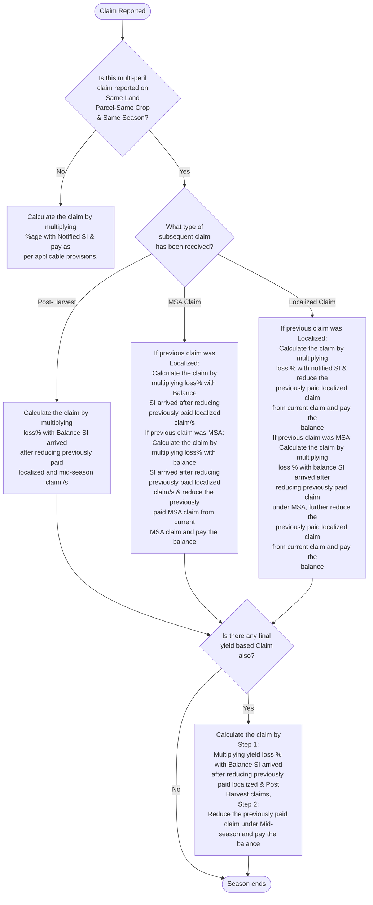

# 1. Objective of the Scheme

PMFBY aims at supporting sustainable production in agriculture sector by way of:

*   Providing financial support to farmers suffering crop loss/damage arising out of unforeseen events.
*   Stabilizing the income of farmers to ensure their continuance in farming.
*   Encouraging farmers to adopt innovative and modern agricultural practices.
*   Ensuring credit worthiness of the farmers, crop diversification and enhancing growth and competitiveness of agriculture sector besides protecting the farmers from production risks.
*   Promoting innovation & research of insurance and allied products so-as-to offer expanded choice to the farmers and the State Governments/UT Administrations.

# 2. Adoption of Technology for Scheme Administration

**Digital Technology**

**2.1** In an endeavor to integrate Technology in implementation and execution of the Scheme, GoI has designed and developed a National Crop Insurance Portal (NCIP) (www.pmfby.gov.in) which has been in use since Kharif 2018. This has brought in for better administration and coordination amongst stakeholders viz. Farmers, States, Insurers, insurance intermediaries and Banks as well as ensure real-time dissemination of information and transparency in implementation.

**2.2** Continued & efficient functioning of the Portal successfully calls for responsible participation by different stakeholders who will have the responsibility for census coding and regular updating of revenue/administrative units, AWS code mapping and requisite information/details as per the login credential module.

**2.3** Implementing State/UTs and Insurance Companies during each crop season are required to digitize and upload basic information like notified areas, crops, sum insured, Government subsidy and premium to be paid by farmers and name of the implementing Insurance Company in the particular insurance unit etc., on the portal well within the prescribed timeline. This will facilitate farmers and other stakeholders to get the relevant information on the Internet and through SMS for the concerned season. State/UT Government and concerned Insurance Company will be responsible for any incorrect entry/ errors/ omissions etc. during digitization.

**2.4** Digitization of basic information/notification should compulsorily be done before floating tender documents which will be followed by the entry of L1 Premium rates and name of the selected Insurance Company immediately after finalization of bids and issuance of work order.

**2.5** Since the NCIP has been operationalized for auto administration and seamless flow of data/information/reports on real-time basis, the State/UT Government would not

be allowed to create/use a separate Portal/website for Crop Insurance purposes\*. (\*State of Karnataka which is already running its own portal will have to integrate with NCIP).

**2.6** All Stakeholders have defined roles and responsibilities and accessibility to related modules on the Portal for the administration of the Scheme. Details of the operationalization of modules for each stakeholder are available on the Portal.

**2.7** Secured credential/login, preferably linked with Aadhaar Number and mobile One Time Password (OTP) based, for all Stakeholders viz, GoI, State Governments/UT Administrations, Banks, empaneled Insurance Companies and their designated field functionaries, Insurance Intermediaries etc. will be provided on the Portal to enable them to enter/upload/download the requisite information.

**2.8** The Insurance Companies shall not distribute/collect/allow any other proforma/utility/web-Portal etc. for collecting details of insured farmers separately. However, they may provide all requisite support to facilitate Bank Branches/Primary Agriculture Credit Societies (PACS) /Common Service Centers (CSCs)/Banking Correspondents (BCs) for uploading the farmers' details on the Portal well within the prescribed cut-off dates.

**2.9** Only those farmers whose data is uploaded on the NCIP, and their share of premium has been remitted to the concerned Insurance Company within the prescribed time limit, shall be eligible for Insurance coverage. The premium subsidy from the State/UT and the GoI shall be released accordingly as per the timelines and modalities defined in the Operational Guidelines.

**2.10** All data pertaining to crop-wise, Insurance Unit (IU) wise historical yield data, Notional value of average yield/Scale of Finance (SOF), Sown Area, Coverage and Claims data, Threshold Yield (TY) and Actual Yield (AY) shall be made available/uploaded by the State/UT Government on the NCIP for the purpose of premium rating, claim calculation, etc. For the calculation of admissible claims for RWBCIS, requisite information like weather data, detailed term sheet with triggers and exit values and notional sum insured etc. will be uploaded on the NCIP by the concerned State/UT Government. The data uploaded on the NCIP shall be the only single source of truth and mandatorily shall be provided to the Insurance Companies along with Bid Document for Burn Cost calculation and Risk Pricing. No other source of data shall be used for Risk Pricing for Bidding in the tenders other than the data uploaded and approved by State/UTs on the NCIP. In case this clause is not adhered to, the Government of India share of subsidy shall not be released for the concerned State/UT.

**2.11** The Banks/Financial Institutions (FIs)/other intermediaries need to compulsorily transfer the individual farmer's data electronically to the NCIP. Accordingly, banks/FIs **may endeavor to undertake Core Banking Solution (CBS) integration** in a time bound manner for real-time transfer of information/data.

**2.12** The NCIP having details of insured farmers under PMFBY shall be dovetailed with Kisan Rin Portal (KRP), having details of all the farmers availing subsidized short term agriculture loans through Kisan Credit Card under Modified Interest Subvention Scheme (MISS) of the GoI & PM KISAN database having pre-identified farmers receiving benefits under PM Kisan Samman Nidhi scheme of GoI. The

data/information of both the Schemes shall be auto synchronized to enable real-time sharing of information and better program monitoring.

**2.13** With a view to keep pace with the massive innovations happening for making agriculture financially resilient and to achieve the objective of meeting Sustainable Development Goals, the scheme envisages to foster the innovation and development of effective technology solutions under PMFBY ecosystem to make the scheme more effective and farmers more resilient & protected. Implementing Insurance Companies may contribute funds in order to promote innovation and research & collaborate with the technical institutions, start-ups/Fin-tech/Insure-tech & Agri-tech entities of the country & across the globe. The potential technologies solutions shall be first evaluated and recommended by GoI for pilot-rollout. The pilots shall be carried out by the implementing Insurance Companies collectively and/or individually for strengthening the technology models and solutions for PMFBY. Further, the GoI shall review and examine the results of such pilots/research for final adoption within scheme ecosystem.

### Remote Sensing & Other Technologies

**2.14** The Insurance Companies & States/UTs shall compulsorily use innovative technology & mobile applications for monitoring of crop health through CROPIC App, reporting of crop damage through Crop Loss Assessment App and Crop Cutting Experiments (CCEs) through CCE Agri App etc., in coordination with the concerned State/UTs. State/UTs shall also facilitate Insurance Companies with Satellite Imagery wherever required and facilitate usage of drones as per the SOP issued by the Ministry of Civil Aviation, GoI. Such data and information may further be sourced and utilized for further analysis under the purview of PMFBY. Insurance Companies can also use the services of the Government or technical agencies empaneled by the GoI or its authorized agency or committee for conducting relevant studies & validation for better monitoring and ground-truth. Insurance Companies should play an active role of being partners in facilitating and promotion of use of technology and other innovations in the scheme implementation.

**2.15** The Department of the State/UT Government responsible for managing the digital land record and its web-portal will facilitate the integration of land record with NCIP and provide Application Programming Interface (API), free of cost, for smooth access to the land records of the concerned farmer for validation on NCIP.

**2.16** Suitable technology & modalities shall also be explored and adopted for using Smart Sampling Technique (SST) for conducting CCEs required for arriving at proportionate Crop Yield Estimation along with direct yield estimation using different technology models as prescribed in YES-TECH Manual 2023.

**2.17** Yield Estimation System based on Technology (YES-TECH) for direct estimation of yield at Gram Panchayat (GP) level has been rolled out from Kharif 2023 season onwards as per the provisions of YES-TECH Manual 2023, as amended from time to time.

**2.18** YES-TECH shall be further augmented through Collection of Real-time Photos and Observations of Crops (CROPIC) initiative, wherein crop health will be monitored by taking periodic photos of standing or peril-affected crop at pre-determined interval of its growth with GPS coordinates, three to five times during the season for assessing the crop condition at different stages of the crop life cycle.

**2.19** A national level network of Automatic Weather Stations (AWS) & Automatic Rain Gauges (ARG) shall also be established under the Weather Information Network Data System (WINDS) initiative as per the provisions of the WINDS Manual 2023, as amended from time to time, creating a strong and resilient platform for generation of long-term hyper-local weather data information for Crop insurance, agriculture

advisory and disaster risk resilience needs of different sectors.

**2.20** State/UTs shall adopt use of technology, such as satellite imagery, drones, Unmanned Aerial Vehicle (UAV) and remote sensing for various applications such as crop area estimation, yield disputes resolution and promote innovation and use of technology solutions such as remote sensing and other related technology solutions and mobile applications for CCE planning, yield estimation, loss assessment, assessment of prevented sowing and clustering of districts etc.

**2.21** Use of technology derived solutions for calculation of Yield will be triggered in the following instances when:

Requisite number of CCEs have not been conducted at the Insurance Unit (IU) level or one level higher than the IU level.

**2.22** Or

The yield data submitted by the Nodal Department of the State/UT Government is disputed by the IC due to non-compliance of the defined procedure for conducting CCEs.

**2.23** Or

The Nodal Department of State/UT Government is unable to submit Actual or approved yield data (CCE Agri App based) for at-least 90% of total Crop Cutting Experiments (CCEs) conducted, within 2 months of the cut-off date of completion of CCEs.

**2.24** To develop a framework for Research Studies & Working Papers by academia & Multilateral bodies, GoI may enter into bilateral or multilateral arrangements / agreements with any relevant national / international institutions/organizations, for the purpose.

# 3. Coverage of Farmers

**3.1** All farmers including sharecroppers and tenant farmers growing the notified crops in the notified areas are eligible for coverage. However, farmers should have insurable interest on the insured crops and lands. Such farmers are required to submit necessary documentary evidence of land records prevailing in the State (Records of Right (RoR), Land Possession Certificate (LPC) etc.) and/or applicable contract/ agreement details/ other documents notified/ permitted by concerned State Governments/UT Administrations pertaining to sharecroppers/tenant farmers and the same should be defined by the respective States/UTs in the notification itself. Tribal farmers and forest dwellers having cultivation in forest land under FRA are also allowed to be insured under the scheme. The farmers cultivating community owned land especially as is practiced in NER states are also allowed to be covered under the scheme with certification from village head or revenue authorities. All such farmers are also required to essentially submit Aadhaar Number and declaration about the crop sown/ crops intended to be sown.

### 3.1.1 Farmers availing the Kisan Credit Card (KCC)/Crop Loan/Loanee Farmers

**3.1.1.1** The scheme is optional for all farmers including farmers who have been sanctioned short-term Seasonal Agricultural Operations (SAO) loans though Kisan Credit Card (KCC) for the notified crops from defined Financial Institutions (hereinafter referred to as Loanee farmers). Existing Loanee farmers who do not want to get covered

under the scheme have the option of opting-out from the Schemes by submitting requisite declaration to loan sanctioning bank branches any time during the year but at least seven days prior to the cut-off date for enrolment of farmers for the respective season. All those farmers who do not submit the declaration would be essentially covered.

**3.1.1.2** Farmer whose KCC loan has become sub-standard as defined and as per prevailing practices of the concerned Banks and/or Government regulator shall not be considered as a Loanee farmer. However, bank branches may facilitate such farmers for enrolment as non-loanee farmers.

**3.1.1.3** Merely, sanctioning of crop loan against other collateral securities including fixed deposits, gold/jewel loans, mortgage loans etc. **without having insurable interest of the farmer on the insurable land and notified crops shall not be eligible for coverage under the Scheme.**

**3.1.2 Other Farmers/Non-loanee Farmers**

As mentioned in **Para 3.1.1.1** above, the Scheme is optional for all farmers including non-loanee farmers/other farmers.

**3.1.2.1** The insurance coverage will strictly be equivalent to the sum insured per hectare, as defined in the Government notification or /and on NCIP multiplied by proposed insured- area for notified crop for enrolment.

**3.1.3** Special efforts shall be made to ensure maximum coverage of Scheduled Caste (SC)/ Scheduled Tribe (ST)/ Women farmers under the Scheme. Further Panchayat Raj Institutions (PRIs) may be involved in the extension activities and awareness creation among farmers and obtaining feedback from farmers about the implementation of the Scheme.

**3.1.4** The implementing Insurance Company selected as lowest rate bidder (L1) will be responsible for taking necessary measures to ensure at least 10% incremental increase in coverage of non-loanee farmers in the allocated district. However, other empaneled Insurance Companies which have participated in the bidding process and are keen for enrolment of non-loanee farmers in the cluster may also be allowed to enroll non-loanee farmers at L1 premium rate using their respective network of intermediaries and manpower using digital platform of App for Intermediary Enrollment (AIDE) and NCIP. The interested companies must inform their willingness in writing within 7 days of the finalization of tender/issuance of work order to L1. It will however be the responsibility of all the Insurance Company engaged in this process to ensure that duplicate enrolment does not happen in the given cluster/district and therefore shall mandatorily use AIDE App for the purpose. Engaging companies other than L1 for enrolling non-loanee farmers is allowed for all Districts notified and allocated by the State Governments/UT Administrations. The enrolment of non-loanee farmers shall be as per the conditions laid down in **Para 17.7.**

**3.1.5** These Insurance Companies shall use digital means such as AIDE App for enrollment of farmers and complete the process as per the seasonality discipline detailed in **Para 16.4.** The same Insurance Company which has enrolled the farmers shall be liable for the payment of claims to such farmers basis the localized crop

damage assessment conducted by the L1 Insurance Company or crop damage report and crop yield data given by the concerned State Govt.

**3.1.6** The exchange of information and co-witnessing of CCEs for the district by the Government/NCIP will be limited to L1 Company only and it will be binding on other companies to accept the yield data. The Nodal Department of State Governments/UT Administrations shall share the yield data with all concerned Insurance Companies for the computation of claims in the relevant IUs where they have enrolled non-loanee farmers. Requisition for payment of Government subsidy in respect of non-loanee farmers enrolled by the other Insurance Companies shall be submitted directly through NCIP to the Central Nodal Agency designated by GoI for the purpose. Claim calculation for the applications and IUs shall be done simultaneously on NCIP based on the relevant crop-wise, IU-wise crop damage and yield data, weather data etc. entered/shared by the respective State Governments/UT Administrations.

**3.1.7** A detailed SOP/Manual and modalities of the enrollment of non-loanee farmers at L1 premium rate by other unsuccessful bidders shall be notified by the GoI separately.

**3.2 Universal Coverage**

**3.2.1** The States / UTs shall make all efforts for providing insurance protection to all the farmers including tenant farmers, sharecroppers as well as loanee or non-loanee farmers in their respective State /UT. To achieve this Universal Coverage under PMFBY, States/UTs may adopt following approaches:

**3.2.1.1 Full Universalization:** Complete farmer database would be fetched on the NCIP through the pre-validated, Land Parcel, Crop & Farmers KYC database of the concerned State/UT. Enrolment through any other channels will not be required under full universal coverage. The States may consider for opting full universalization in the interest of the farmers with following pre-requisites:
* Digitized Land Records
* Farm level Season-wise Crop Data
* Farm Level KYC validated Farmer's Database
* Data collection as per PMFBY Requirements
* API based Data Exchange with NCIP

**3.2.1.2 Preferential Universalization:** The States/UTs can incentivize the enrolment of farmers under the scheme by subsidizing the farmer's premium partially or completely. State/UT may decide to deduct a token amount from the farmer's account during enrolment. Farmers will be enrolled through the traditional enrolment channels under the scheme.

**4. Coverage of Crops**
I. Food crops (Cereals, Millets and Pulses).
II. Oilseeds.
III. Annual Commercial / Annual Horticultural crops.
IV. In addition, pilots for coverage can be taken up for those perennial horticultural/commercial crops for which standard methodology for yield estimation

or correlation between weather condition and yield/output is available.

V. Other crops including plantations crops may also be included in the scope of scheme subject to approval of respective ministries of Govt. of India. A separate communication shall be issued by the GoI as and when such inclusions are required and approved.

# 5. Coverage of Risks and Exclusions

## 5.1 Basic Cover:
The basic cover under the scheme covers the risk of yield loss to standing crops (sowing to harvesting). This comprehensive risk insurance is provided to cover yield losses on an area-based approach basis, against non-preventable risks like drought, dry spells, flood, inundation, wide-spread pest and disease attack, landslides, natural fire due to lightening, storm, hailstorm, and cyclone.

## 5.2 Add-On Coverage:
Apart from the mandatory basic cover, the State Governments/UT Administrations, in consultation with the State Level Coordination Committee on Crop Insurance (SLCCCI) may choose any or all of the following add-on covers, based on the need of the specific crop/area in their State/UT to cover the following stages of the crop and risks leading to crop loss.

### 5.2.1 Prevented Sowing/Planting/Germination Risk:
Insured area is prevented from sowing/planting/germination due to deficit rainfall or adverse seasonal/climatic conditions.

### 5.2.2 Mid-Season Adversity:
Loss in case of adverse seasonal conditions during the crop season viz. floods, prolonged dry spells and severe drought etc., wherein expected yield during the season is likely to be less than 50% of the normal yield. This add-on feature facilitates the provision for immediate relief (On-Account payment) to insured farmers in case of occurrence of such risks.

### 5.2.3 Post-Harvest Losses:
Coverage is available only up to a maximum period of two weeks from harvesting, for those crops which are required to be dried in cut and spread / small, bundled condition depending on requirement of the crops in that area and left in the field after harvesting, against specific perils of hailstorm, cyclone, cyclonic rains and unseasonal rains.

### 5.2.4 Localized Calamities:
Loss/damage to notified insured crops resulting from occurrence of identified localized risks of hailstorm, landslide, inundation, cloud burst and natural fire due to lightening affecting isolated farms in the notified area.

### 5.2.5 Add-on coverage for crop loss due to attack by wild animals:
The States/UTs may consider providing add-on coverage for crop loss due to the attack by wild animals wherever the risk is perceived to be substantial and is identifiable. The detailed protocol and procedure for evaluation of the bids has been prepared by the GoI in consultation with the Ministry of Environment, Forest & Climate Change (MOEF&CC) and General Insurance Corporation of India (GIC Re). The add-on coverage will be optional for the farmers and applicable premium, in full, shall be borne by the farmer, however, the State Governments/UT Administrations may consider providing additional subsidy on this coverage, wherever notified. The Central Govt. subsidy on premium shall not be available for this add-on cover. The actuarial premium rates for this add-on cover should be sought in the bid itself from

the Insurance Companies, however the add-on actuarial premium rate will be considered separately and shall not form part of evaluation of L1. Detailed modalities are annexed as **Annexure - I** for adoption by States/UTs.

**5.3** States/UTs have to notify crop-wise specific period/duration for coverage of aforesaid add-on risks in their notification as detailed in **Para 7.2** of this guideline and the same will also be uploaded on NCIP.

**5.4** **General Exclusions:** Losses arising out of war and nuclear risks, malicious damage and other preventable risks shall be excluded.

**5.5** Loss/damage for localized calamities and post-harvest losses will be assessed at the level of the individual insured farm and hence intimation of loss by the farmer/designated agencies or nodal departments is essential. For remaining risks i.e. losses due to wide-spread calamities, lodging of intimationfor claims by insured farmers / designated agencies or nodal departments for such wide-spread calamities is not essential. Claims of wide-spread calamity shall be calculated based on the loss assessment report submitted by the District Level Joint Committee (DLJC) and/or actual yield submitted by concerned State Governments/UT Administrations.

**5.6** Details of indemnification and claims calculation for aforesaid risk covers are provided in **Para 21**.

**5.7** **Risk Management Mechanisms under the Scheme**

**5.7.1** The Scheme shall operate mainly on complete **‘risk transfer’** approach wherein complete risk is transferred to implementing Insurance Companies. This will involve bearing of the entire claim liability by the insurance company for the discovered premium.

**5.7.2** However, if the State Governments/UT Administrations strongly believe that they need to partake in some of the elements of the risk, they may explore opting for **‘risk participation’** approach. This shall entail adoption of alternate models by the States wherein the claims as well as premium surplus is shared between the Government and the implementing insurance company as per the pre-agreed formula. The States may choose to implement any of the following models:
i. Profit & loss sharing model.
ii. Cup & Cap model (60:130)
iii. Cup & Cap model (80:110)

**5.7.3** Any pilot for a model other than those listed above can be taken up in one State at a time with the approval of Union Agriculture Minister and Union Finance Minister.

**5.7.4** Following shall be the modalities specific to Risk Participation Approach:

**5.7.4.1** **“Profit & Loss” Sharing Mechanism:**

<table>
  <tbody>
    <tr>
        <td>Parameter</td>
        <td>Specifications</td>
    </tr>
    <tr>
        <td>Risk Sharing</td>
        <td>Insurance Company – up to loss ratios of 100% Insurance Company &amp; Government (GoI and State Govt.) – Risk sharing beyond 100% as per proposed structure</td>
    </tr>
  </tbody>
</table>

<table>
  <tbody>
    <tr>
        <td>Surplus Sharing</td>
        <td>Loss ratio between 0%-100%, Insurance Company &amp; Government (GoI and State Govt.) get surplus as per the sharing structure given below.</td>
    </tr>
  </tbody>
</table>
<table>
  <thead>
    <tr>
        <th>Layers of Profit /loss %</th>
        <th>Retention by Insurer</th>
        <th>Return to States</th>
        <th>Sharing of</th>
        <th></th>
    </tr>
  </thead>
  <tbody>
    <tr>
        <td>0%</td>
        <td>50%</td>
        <td>15%</td>
        <td>85%</td>
        <td rowspan="3">Profit (Ploughed back)</td>
    </tr>
    <tr>
        <td>50%</td>
        <td>65%</td>
        <td>60%</td>
        <td>40%</td>
    </tr>
    <tr>
        <td>65%</td>
        <td>100%</td>
        <td>95%</td>
        <td>5%</td>
    </tr>
    <tr>
        <td>100%</td>
        <td>130%</td>
        <td>95%</td>
        <td>5%</td>
        <td rowspan="3">Loss (Shared)</td>
    </tr>
    <tr>
        <td>130%</td>
        <td>220%</td>
        <td>60%</td>
        <td>40%</td>
    </tr>
    <tr>
        <td>220%</td>
        <td>350%</td>
        <td>15%</td>
        <td>85%</td>
    </tr>
  </tbody>
</table>

**Example:**

<table>
  <thead>
    <tr>
        <th>Profit Sharing @ Loss Ratio of 0%</th>
        <th>Loss Sharing @ Loss Ratio of 350%</th>
    </tr>
  </thead>
  <tbody>
    <tr>
        <td>Profit = 100%- LR = 100%  Insurer Profit = (layer (0%- 50%) =50%) *(15% share of Profit) + layer (65%-50% =15%) * (60% share of Profit) + Layer (100%- 65% = 35%)*(95% share of Profit)  = 7.5% + 9% + 33.25% = **49.75% of the Premium**  State share of Profit = 100% - 49.75% = **50.25% of the premium**</td>
        <td>Loss = 100%- LR = -250%  Insurer Loss = (layer (220%- 350%) = - 130%) * (15% share of loss (220%-350%) + layer (130%-220% = -90%) * (60% share of Loss) + Layer (100%- 130% = 30%) * (95% share of Loss)  = (-19.5%) +(- 54%) +(-28.5%) = **- 102% of the premium**  State Share of Loss = -250% - (- 102%) = **- 148% of the Loss**</td>
    </tr>
  </tbody>
</table>

**Conditions:**

**I. Liabilities:**
a. GoI subsidy sharing will be based on L1 quoted Actuarial Premium Rates (APR)
b. GoI will participate equally with State/UT Government in any claim liability as per the structure (as above).
c. Sharing of claim liabilities between Insurance Company and Government (GoI and State/UT) will be done at cluster & season level or at the level of determination of L1 bidder & season level.

**II. Surplus Sharing:**
a. GoI will share surplus (if any) equally with State Governments/UT Administrations as per the structure (as above)
b. Surplus sharing between Insurance Company and Government (GoI and State/UT) will be done at cluster & season level or at the level of determination of L1 bidder & season level.
c. Any surplus will be shared equally between the GoI and State Governments/UT Administrations. Further it shall be deposited back into consolidated fund of GoI or State/UT respectively.

### 5.7.4.2 "Cup & Cap" model (60:130)

<table>
  <thead>
    <tr>
        <th>Parameter</th>
        <th>Specifications</th>
    </tr>
  </thead>
  <tbody>
    <tr>
        <td>Risk Sharing</td>
        <td>Insurance Company – up to loss ratios of 130% Government (GoI and State Govt. equally) – loss ratio &gt; 130%</td>
    </tr>
    <tr>
        <td>Surplus Sharing</td>
        <td>Loss ratio between 0%-60% - Insurance Company retains 40% &amp; Government (GoI and State Govt. equally) get remaining (60% - LR)</td>
    </tr>
  </tbody>
</table>

**Conditions:**

**I. Liabilities:**
a. GoI subsidy sharing will be based on L1 quoted Actuarial Premium Rates (APR).
b. GoI will participate equally with State/UT Government in any claim liability arising due to claim ratio exceeding 130%.
c. Sharing of claim liabilities between Insurance Company and Government (GoI and State/UT) will be done at cluster & season level or at the level of determination of L1 bidder & season level.

**II. Surplus Sharing:**
a. GoI will share surplus (if any) equally with State/UT Government if the claim ratio are less than 60%
b. Surplus sharing between Insurance Company and Government (GoI and State/UT) will be done at cluster & season level or at the level of determination of L1 bidder & season level.
c. Any surplus will be shared equally between GoI and State/UT Government. Further it shall be deposited back into consolidated fund of GoI or State/UT respectively.

### 5.7.4.3 "Cup & Cap" Model (80-110)

<table>
  <thead>
    <tr>
        <th>Parameters</th>
        <th>Specifications</th>
    </tr>
  </thead>
  <tbody>
    <tr>
        <td>Risk Sharing</td>
        <td>Insurance Company – up to loss ratios of 110% State Govt. – loss ratio &gt; 110%</td>
    </tr>
    <tr>
        <td>Surplus Sharing</td>
        <td>Loss ratio between 0%-80% - Insurance Company retains 20% &amp; State Govt. get remaining (80% - Actual LR)</td>
    </tr>
  </tbody>
</table>

**Conditions:**

**I. Liabilities:**
a. GoI subsidy sharing will be restricted to cluster level burn cost calculated for the current year + 15% of burn cost (towards administrative and other expenses) or L1 quoted actuarial premium rates, whichever is lower. Other provisions of the Operational Guidelines of PMFBY will be applicable as envisaged. The level of calculation shall be cluster and season level or at the level of determination of L1

bidder & season level.
b. GoI will not participate with State/UT Government in any claim liability.
c. Sharing of claim liabilities between Insurance Company and State Governments/UT Administrations will be done at cluster level or at the level of determination of L1 bidder & season level.

**II. Surplus Sharing:**
a. GoI will not share surplus (if any) with State/UT Government if the claim ratio is less than 80%
b. Surplus sharing between Insurance Company and State/UT Government will be done at cluster & season level or at the level of determination of L1 bidder & season level.
c. Any surplus shall be deposited back to State/UT treasury.

**5.7.4.4 Claim settlement under "Cup & Cap" Models:**
a) Claim settlement under "Cup& Cap" Models at Cluster level for any given season upto the given threshold will be the responsibility of the implementing Insurance Company. The claim exceeding the given threshold limit as per risk-sharing pattern, shall be met fully by the State Govt. under "Cup-& Cap (80-110) and by GoI and State/UT government under "Cup-& Cap (60-130) in equal proportion. The State Govt./GoI as the case may be; shall remit their share of claim liability to the concerned Insurance Company for onward remittance to the beneficiary farmer through DigiClaim module of NCIP.
b) The implementing Insurance Company shall be liable to release the claim at cluster level & season level for any given season up to the extent of threshold limit as per the Risk Participation Model adopted by the State Govt./UT without waiting for States/UTs to contribute the balance claim liabilities. For delay in claim payment of liabilities of the Insurance Companies caused while waiting for pending claim liabilities to be released by States/UTs, Insurance Companies shall be liable to pay penal interest as per **Para 16.14** of these guidelines.

**5.7.4.5 Calculation of Burn Cost under "Cup & Cap (80-110)" Model:**
Burn Cost (BC) for notified crop(s) under the Cup & Cap 80-110 ARTM model for the given cluster and season and comparison with the L1 quoted APR shall be done by the CPMU of GoI in order to calculate the applicable liability of GoI towards premium subsidy. The burn cost shall also be provided on NCIP itself based on the available historical yield data uploaded by the State/UTs on NCIP and the actual season's insured acreage. The States/UTs shall be liable to pay the additional premium subsidy to concerned insurance companies due to underlying restriction of GoI liability as per adopted Risk Participation model.

**5.8 Sandbox for Agricultural & Rural Security, Technology & Insurance Platform (SARTHI) & Product Innovation**

**5.8.1** With a view to enhance the access to agriculture & allied insurance products for farmers and to increase penetration of insurance adoption in the Agri ecosystem, GoI intends to create an ecosystem for varied insurance products (for the agro industry) wherein the different stakeholders of the insurance industry like Insurance companies, Reinsurance companies, Insurance Intermediaries and innovators, like

Agritech and Fintech, startups can come together and work towards extending customized risk protection solutions to farming community in addition to current crop insurance products under PMFBY & RWBCIS. Other insurance products such as parameterized insurance products for non-notified PMFBY crops, parametric disaster risk insurance products, available product offerings (or components) under earlier run Unified Package Insurance Scheme (UPIS) such as Personal accident, Livestock, Fire (contents & buildings), Life insurance offerings and non-subsidized add-on covers of PMFBY & RWBCIS, among others can be offered to the farming & rural community which will help in bringing financial resilience and risk mitigation in their lives and livelihoods.

**5.8.2** GoI for this purpose would explore potential collaborations between different stakeholders to facilitate the development of a comprehensive and secure digital SARTHI platform and dovetail it with NCIP, wherein all insurance product offerings relevant to farming and rural communities around the country such as mentioned above along with current crop insurance products are offered within a single ecosystem of PMFBY through a single window to the target communities, catering to their specific needs. This ecosystem will be capitalized by different actors of the insurance industry resulting in proliferation of all insurance products which can be offered to the agriculture and allied sectors while ensuring end-to-end traceability and transparency of transactions in a secured digital environment.

**5.8.3** A unified Agri insurance ecosystem will have the following features:

* Digitization of the Agri & other Insurance product offerings ecosystem in a stable, secure environment.
* Greater degree of information sharing and collaboration between the agriculture and allied sectors and the insurance industry stakeholders.
* Customization of all possible products & their availability for farmers relevant for their demography and profile.
* Cost Reduction in overall premium for farmers leading to increased coverage & earning potential while achieving risk mitigation.
* Higher penetration & accessibility to insurance products for farming & rural communities in different demographics.
* In the long term it'll also provide specific data to the GoI on the insurance needs of the farmers and other rural stakeholders, which can then be rolled out as schemes for their benefit.

**5.8.4** To facilitate a comprehensive risk protection environment for Agriculture and Rural sector, GoI will build an open-source digital platform which will provide seamless integration of different insurance products approved by IRDAI & offered by Insurance Companies and allow for digital distribution of the products via various distribution channels directly to the farmers through a farmer facing application. This digital platform will help offer the bouquet of products curated by the insurance companies for the agriculture & rural communities and will offer custom-made insurance products tailored as per the specific needs and the risks faced by the farmers in different regions across complete agriculture value chain.

**5.8.5** Govt. of India though a consultative committee comprising of insurance industry experts, regulators, academia, Insurtech/agri-tech startups and experts from multi-

lateral national/international agencies and technical agencies/institutions shall oversee and foster the adoption and promotion of SARTHI for rural & agricultural risk protection and resilience development through Insurance mechanism.

**5.8.6** IRDAI has also been leveraging digital technology to achieve the vision of "Insurance for All" by 2047 where every citizen has an appropriate life, health and property insurance cover and every enterprise is supported by appropriate insurance solutions. Therefore, IRDAI in addition to various administrative and strategic initiatives is also developing various technology platforms and distribution channels for the purpose of increasing financial risk protection through insurance and thereby enabling a comprehensive risk resilience in Indian communities and economy at large. Accordingly, few digital platforms like Bima Sugam (digital portal for all insurance transactions), Bima Vahak (women centric rural insurance distribution channel), Bima Vistaar (all-in-one affordable insurance product covering risks against life, health, and property) & Bima Bharosa (a platform for complaint registration and grievance redressal) are being developed. SARTHI Platform shall therefore be integrated with all these platforms for seamless information sharing and leveraging mutual capabilities.

**5.8.7** A detailed SOP/Manual and modalities of the SARTHI Platform and Product Innovation including the product designing and validation protocols shall be notified by the GoI separately.

# 6. Preconditions for Implementation of the Scheme

## 6.1 State/UTs

Issuance of Notification by the State Governments/UT Administrations for the implementation of the Scheme shall imply their acceptance of all the provisions, modalities and Operational Guidelines of the Scheme. **The main conditions relating to the scheme which are binding on the States/UTs are as follows:**

**6.1.1** Digitization of IU-wise administrative/revenue hierarchy along with Scheme; crops; level of IUs notified, crop-wise sum insured, crop-wise indemnity level, crop-wise Threshold Yield (TY) at Insurance Unit (IU) level for notified crops, opted risk coverage, details of Automatic Weather Stations (AWS), Automatic Rain Gauges (ARG), which shall be stationed as per the standards defined in the WINDS Manual 2023 and integration of digitized land records with NCIP.

**6.1.2** Adoption of innovative technology especially YES-TECH for direct yield estimation at Gram Panchayat (GP) level as per the standards and specifications given in the YES-TECH Manual 2023, CROPIC for conducting crop health monitoring during the crop life cycle, WINDS for setting up AWSs and ARGs as per standards and specifications mentioned in the WINDS Manual 2023 and 100% usage of different applications and tools viz. CCE-Agri App for capturing the conduct of CCEs, AIDE App for enrollment of Farmers, Crop damage assessment through Crop Loss Survey App and the use of NCIP platform to enable seamless flow of data & information and auto administration of the scheme.

**6.1.3** Making an additional provision of a separate budget allocation of 3% of the total budget of the Scheme for administrative expenses from Financial Year (FY) 2023-24 for meeting the day-to-day expenses for monitoring, Information Education &

# 11. Digitization of Land Records

**11.1** Under the Central Sector Scheme of Digital India Land Record Modernization Program (DILRMP), majority of the State/UTs have digitized their land records. To address the problems of over insurance and acreage discrepancy, State/UTs are strongly advised to integrate their digitized land records with the NCIP so that the individual land records of farmers can be accessed through the NCIP for crop insurance and the insured area be validated. This will help the Government to reach and identify individual beneficiaries and bring utmost transparency and authenticity in providing scheme benefits to the genuine beneficiaries as per their eligibility norms in the right spirits of provisions of the Operational Guidelines.

# 12. Sum Insured/Coverage Limit

**12.1** States/UTs need to choose either the Scale of Finance or Notional Average Value (Notional Average Yield * MSP/Farm Gate) price method for computation of Sum Insured for a district-crop combination for the entire period of the contract. The crop-wise sum insured notified in the first year/season could be changed in the subsequent year/season as per the change in the Scale of finance or MSP/ Farm gate price as available for the notified crop and decided upon by the State. However, any change in the sum insured over a year due to changes in the scale of finance/farm gate price will be capped at 10% within the contract period. The sum Insured for individual farmer is equal to the Scale of finance or Notional Average Value (NAY x MSP/Farm Gate Price) per hectare multiplied by the insured area of the notified crop proposed by the farmer for insurance.

**12.2** Area under cultivation shall always be expressed in Hectare for all crops including perennial horticulture crops, accordingly the State Governments/UT Administrations are required to mandatorily notify the applicable premium and sum insured values at Per Hectare basis rather than per plant basis.

**12.3** In cases where crops are separately notified under irrigated, rainfed category by the States/UTs, the Sum Insured value for irrigated and rainfed areas should be separately indicated and notified.

# 13. Premium Rates and Premium Subsidy

**13.1** The Actuarial Premium Rate (APR) would be charged under PMFBY & RWBCIS by the implementing Insurance Company. The rate of premium payable by the farmer will be as per the following **Table 1**:

<table>
  <tbody>
    <tr>
        <td>Season</td>
        <td>Crops</td>
        <td>Maximum Premium Rate payable by farmer (% of Sum Insured)*</td>
    </tr>
    <tr>
        <td>Kharif</td>
        <td>All Food grain and Oilseeds crops (all Cereals, Millets, Pulses and Oilseeds crops)</td>
        <td>2.0% of SI or Actuarial rate, whichever is less</td>
    </tr>
    <tr>
        <td>Rabi</td>
        <td>All Food grain and Oilseeds crops (all Cereals, Millets, Pulses and Oilseeds crops)</td>
        <td>1.5% of SI or Actuarial rate, whichever is less</td>
    </tr>
    <tr>
        <td rowspan="2">Kharif and Rabi</td>
        <td>Annual Commercial/ Annual Horticultural crops</td>
        <td>5% of SI or Actuarial rate, whichever is less</td>
    </tr>
    <tr>
        <td>Perennial horticultural / commercial</td>
        <td>5% of SI or Actuarial rate,</td>
    </tr>
  </tbody>
</table>

*\*Note: Premium paid by non-loanee farmers should be rounded off to nearest Rupee.*

### Payment of Government Subsidy

All farmers enrolled under the scheme would be entitled for admissible subsidy onthe Actuarial Premium. All demands for premium subsidies shall be mandatorily routed through the NCIP by the Insurance Companies and paid through PFMS system by the GoI.

**13.1.1** The difference between Actuarial Premium Rate (APR) and the Rate of Insurance premium payable by farmers shall be treated as the Rate of Normal Premium Subsidy, which shall be shared equally in 50:50 ratio by the Centre and State/UTs in all State/UTs except Himalayan & North Eastern Region (NER) State/UTs where subsidy sharing pattern between the Centre and State/UTs shall be in the 90:10 ratio.

**13.1.2** The full GoI share in the premium subsidy as per sharing pattern in **Para 13.1.1** above will be applicable only up to APR of 25% and 30% with respect to irrigated and rainfed areas/district, respectively. For APR beyond those rates, GoI share of subsidy will be limited to the applicable share up to the APR of 25% & 30% for each notified crops in irrigated and rainfed districts respectively. The applicability of APR for irrigated/unirrigated districts will be on the basis of the district-wise irrigated data submitted by the State/UT Government in the Tender Document and Notification. In case of the same is not submitted by the concerned State/UTs, the data published by Directorate of Economics and Statistics (DES), DA&FW as revised from time to time shall be used.

**13.1.3** For the purpose of categorization of Districts between Rainfed and Irrigated, districts having 50% or more of the Gross irrigated area will be categorized as Irrigated.

**13.1.4** The State/ UTs are free to extend additional subsidy to reduce the financial burden on farmers.

**13.1.5** share over and above the normal subsidy from their budget. In other words, additional subsidy, if any shall be borne entirely by the State/ UT. Subsidy in premium is allowed only to the extent of notified Sum Insured excluding the Sum Insured for the add-on covers for which GoI subsidy is not payable.

**13.1.6** The Government premium subsidy to the implementing Insurance Companies shall be routed through a Central Nodal Agency (CNA) designated by the GoI for the purpose, strictly as per the provisions of the Operational Guidelines and modalities prescribed by the GoI. Accordingly, the designated CNA is empowered to call and collect all requisite information related to implementation of the Scheme and utilization of Government funds and to share the same with the GoI for better planning, implementation and monitoring of the Scheme. The premium subsidy will be routed through PFMS/PFMS linked systems strictly based on the data hosed on NCIP for the concerned season/state & cluster.

**13.1.7** Governments, both Centre and State, shall release their share of subsidy as outlined in **Para 6.1.6** of these guidelines. The release of GoI subsidy shall not be dependent on release of State subsidy for all seasons covered under the scheme including past

seasons. However, the Insurance Companies may continue to raise simultaneous demands for State/UT and GoI share for each State/UT and season separately.

**13.1.8** Both Centre and State Governments/UT Administrations, will release their share of advance subsidy (First Instalment) equivalent to 50% of respective share of subsidy in corresponding previous season to the Insurance Company if the demand is raised for the same by Insurance Company before the opening of NCIP for enrolments. In case the demand is submitted after the NCIP is opened for enrolments for the current season, the advance subsidy equivalent to 50% of respective share of subsidy as per paid applications for the current season shall be remitted subject to fulfilment of General Financial Rule (GFR)/guidelines in the matter without waiting for coverage details for the ongoing season. Subsequent tranches of subsidy share shall be released based on approved applications for the season subject to submission of demand for the same through NCIP. The Detailed process is given at **Para 6.1.7** of these guidelines.

**13.1.9** In the State/UT who have adopted full or preferential universalization by subsiding the Farmer share of premium also, the submission of demand for full farmer-share to be paid by the State/UT Government for the season shall also be mandatorily routed by the concerned insurance companies through NCIP on the basis of paid applications for the season and state.

**13.1.10 To facilitate claim settlement under risks of Prevented Sowing/ Mid-Season Adversity/Localized Calamity:** Insurance Companies should release the admissible claim amount to the beneficiary immediately after receipt of farmers premium and advance subsidy (1st Instalment) and without waiting for release of final subsidy (2nd Instalment) from Government. The total premium required in respect of affected IUs including subsidy to enable settlement of claims arising due to above events in respect of all such beneficiaries shall be adjusted from the fund already available with Insurance Companies as advance upfront subsidy (1st Instalment) to facilitate compliance with Section 64VB of Insurance Act/Regulation of IRDAI.

**13.1.11** All admissible claims based on Yield data/Post harvest losses will be settled on receipt of second instalment of Government subsidy to be paid on the basis of approved applications as available on the NCIP subject to submission of demand for the same by Insurance Companies through NCIP. The remaining Government subsidy, if any will be paid after reconciliation of all business statistics for the season on NCIP and only after the period specified for auto-approval of applications in the seasonality discipline outlines in the Operational Guidelines subject to submission of demand by the concerned Insurance Companies through the NCIP.

**13.1.12** All empaneled Insurance Companies including private Insurance Companies shall provide free access to the Central and State level agencies including Comptroller & Auditor General (CAG) and its authorized agencies to verify the accounts and inspect the data and documents in respect to the implementation of PMFBY/RWBCIS.

**13.1.13** In case, the State/UT Government is willing to subsidize full farmers' share of premium, a token farmer Premium of minimum Re. 1 should compulsorily be charged per application from the farmer to facilitate electronic tracking, enrolment validations & reconciliation.

13.1.14 Enrolment on the NCIP for any season shall be opened only after the conditions outlined in **Para 6.1.7** for submission of advance premium in Escrow accounts are fulfilled. However, the State/UTs shall not be allowed to implement the Scheme in subsequent seasons (at least two seasons) in case of considerable delay by State/UTs in release of requisite subsequent tranches of Premium Subsidy to concerned Insurance Companies beyond a prescribed time limit. Cut-off dates for invoking this provision for Kharif and Rabi seasons will be 31st March and 30th September of succeeding year respectively. However, State/UT shall have to pay a penalty @ interest rate of 12% per annum beyond three months of prescribed cut-off date for release of subsidy which shall be deposited in the Escrow Account maintained for the purpose.

# 14. Budget for Administrative Expenses

14.1 Up to 3% of the total budget for PMFBY/RWBCIS shall be mandatorily earmarked by State/UTs for creating funds for enabling administrative expenses towards implementation and monitoring of the Scheme including setting up of State PMUs, creating better implementation infrastructure, Monitoring and deployment of IEC & capacity building activities, expenditure towards yield estimation through CCEs & YES-TECH and crop health monitoring, crop damage/loss assessment expenses, setting up of AWS/ARGs under WINDS, adoption of new technologies and fostering innovation, travelling and creating contingency fund etc.

14.2 The GoI has already made provisions for aforesaid activities under sub heads like Salaries, Domestic Travel Expenses, and Technology interventions, Office Expenses, other Administrative Expenses and Professional Services etc., for Crop Insurance program under PMFBY/RWBCIS. State/UTs should make provisions and budgetary allocation on similar lines.

# 15. Central Program Management Unit (CPMU) & State Program Management Unit (SPMU)

15.1 Central Program Management Unit (CPMU) has been created at the Central level to provide technical support and professional advice on risk classification & rating, research & development of new products, methodology for loss assessment including technology interventions, legal works, workshops for training & capacity building, along with the use of technology solutions including innovation, replication, digitization of administration of Schemes etc. through NCIP.

15.2 CPMU shall calculate the Burn Cost (BC)/Loss Cost (LC) i.e., Claims as percentage (%) of Sum Insured (SI) observed in case of notified crop(s) in notified unit area of insurance during the preceding 10 similar crop seasons (Kharif/ Rabi) along with approximate APR of the crops proposed to be notified for the season. The loss cost/premium rate shall be provided exclusively to States/UTs on NCIP based on the latest available yield data uploaded by the State/UTs before invitation for premium bidding. The calculations provided on NCIP is only for reference purposes to have information on the approximate cost as per the underlying risk associated for providing insurance cover for the risks so as to enable the State Governments/UT Administration to evaluate the bids in proper perspective.

15.3 CPMU shall also develop a suitable methodology for burn cost calculation, risk classification & premium rating by using historical yield data, historical claim data

including add-on claims, weather data, use and level of inputs viz. irrigation, technologies being used in crop cultivation & management, availability of remote sensing data & information about other parameters influencing crop growth and production etc., The CPMU shall also develop standardized methodology for risk analysis and premium rating for crop insurance, calculation of GoI liability towards premium subsidy and risk assessment and pricing methodology for insurance of other allied sectors and assets belonging to Agriculture & Rural economy of the country.

**15.4** In line with creation of CPMU at Central level and the experience gained over the last six successful years of implementation, it has been envisaged that all States/UTs implementing the Schemes should also create a separate State PMU at State Headquarter (HQ) level with sufficient technical experts/staff. This will ensure continuity of manpower and creation of a resource pool ensuring better coordination between the Centre and the State/UTs leading to effective and successful implementation of the scheme at the ground level. SPMU may also opt for any additional members on contractual/temporary basis or take services of other organizations/research institutes etc., as per requirement. However, States shall have to allocate a separate budget for running the SPMU (refer **Para 14.1** above).

**15.5** The States/UTs shall be categorized for creation of SPMUs as per the table below and shall mandatorily onboard experts as detailed against their category. A minimum of one position against the indicated category of positions may be hired. In addition, the State/UT may hire additional positions as per their own requirement.

<table>
  <thead>
    <tr>
        <th></th>
        <th colspan="2">Category A</th>
        <th></th>
        <th colspan="2">Category B</th>
    </tr>
    <tr>
        <th>State</th>
        <th>Positions</th>
        <th>State</th>
        <th>Positions</th>
        <th colspan="2"></th>
    </tr>
  </thead>
  <tbody>
    <tr>
        <td>Madhya Pradesh Rajasthan Maharashtra Uttar Pradesh Chhattisgarh Karnataka Tamil Nadu Haryana Odisha Andhra Pradesh Himachal Pradesh Uttarakhand Assam Kerala Jharkhand Telangana</td>
        <td>* Remote Sensing Specialist * Data Analyst &amp; MIS Specialist * Awareness &amp; Communication Specialist * Capacity Building &amp; Training Specialist * IT &amp; Technical Specialist * Financial &amp; Subsidy Management Specialist</td>
        <td>Tripura Jammu &amp; Kashmir Puducherry Manipur A&amp;N Islands Sikkim Goa Meghalaya</td>
        <td>* Awareness &amp; Communication Specialist * Capacity Building &amp; Training Specialist * Financial &amp; Subsidy Management Specialist</td>
        <td colspan="2"></td>
    </tr>
  </tbody>
</table>

# 16. Seasonality Discipline

**16.1** The cut-off date is uniform for both Loanee and non-loanee farmers. The District-wise cut-off dates for different crops shall be based on the Crop Calendar of major crops prepared in consultation with the concerned State Governments/UT Administrations/ICAR and crop division of DA&FW which has also been published on NCIP (www.pmfby.gov.in.). If any deviation is observed by the States/UTs from the aforesaid list, it may be brought to the notice of the DA&FW for rectification, if required. The SLCCCI, shall besides considering the prevailing agro-climatic conditions, rainfall distribution/ availability of water for irrigation, sowing pattern etc.

fix seasonality discipline of the coverage and other activities in such a way that it does not encourage adverse selection or moral hazards during the enrollment period. If the seasonality discipline as fixed by the SLCCCI is violated by States/UTs, GoI may decide not to provide applicable premium subsidy for the concerned season.

**16.2** The cut-off date for enrolment of each notified crop should be based on crop calendars of the districts and normally may not be beyond 15th July for Kharif, 15th December for Rabi & 15th Feb for summer seasons. The notified crops should mandatorily be categorized in three seasons Kharif, Rabi & Summer/Zaid crops depending on sowing period and the cut-off date for enrolment may also be fixed accordingly.

**16.3** All State/UTs shall consider preponing the cut-off dates for Kharif and Rabi seasons. Advancement of cut-off may help in reduction of premium rates during the tendering years leading to reduction in financial burden on the State/UTs and may also help in ample time duration for awareness generation and capacity building initiatives to encourage farmers to get enrolled under the scheme

**16.4** The broad indicative seasonality discipline is given in the Table 2 below:

<table>
  <tbody>
    <tr>
        <td>S. No.</td>
        <td>Activity</td>
        <td>Kharif</td>
        <td>Rabi</td>
        <td>Action to betaken by</td>
    </tr>
    <tr>
        <td>1</td>
        <td>Conduct of SLCCCI meeting to take decision for notification of Crops and areas, adoption of Level of Indemnityand to inform crop wise sum insured etc. for drafting of Tender documents.</td>
        <td>15th November of Preceding Year</td>
        <td>1st June of current year</td>
        <td>Nodal Department of States/UTs .</td>
    </tr>
    <tr>
        <td>2</td>
        <td>Uploading of requisite information/data on crop insurance Portal and Issuing of Tender documents.</td>
        <td>30th November of preceding Year</td>
        <td>15th June of current year</td>
        <td>Nodal Department of States/UTs .</td>
    </tr>
    <tr>
        <td>3</td>
        <td>Finalization of Tender and award of work by State/UTs.</td>
        <td>31st December of preceding year</td>
        <td>15th July of current year</td>
        <td>Nodal Department of States/UTs .</td>
    </tr>
    <tr>
        <td>4</td>
        <td>Digitization of notification and uploading/ issuance of notification on NCIP for circulation amongst stakeholders. State Governments/UT Administrations &amp; GoI will release their share of subsidy as outlined in Para 6.1.6 of these guidelines.</td>
        <td>31st January of current year</td>
        <td>16th August of current year</td>
        <td>By State/UTs and Concerned Insurance Companies</td>
    </tr>
    <tr>
        <td>5</td>
        <td>Awareness/ sensitization/training program by State/UT Government and Insurance Companies.</td>
        <td>From 15th March of current year</td>
        <td>15th September of current year</td>
        <td>By State/UTs and Concerned Insurance Companies</td>
    </tr>
    <tr>
        <td>6</td>
        <td>Start of enrolment of farmers for the season on NCIP (as per crop calendar).</td>
        <td colspan="2">Within 24 hours after the release of State Subsidy as per Para 6.1.6 of these guidelines</td>
        <td>GoI &amp; State/UTs.</td>
    </tr>
    <tr>
        <td>7</td>
        <td>Submission of YES-TECH Inception Report (IR)</td>
        <td colspan="2">As per YES-TECH Manual 2023</td>
        <td>TIPs</td>
    </tr>
    <tr>
        <td>8</td>
        <td>Cut-off date for intimation of change of insured crop by the loanee farmer.</td>
        <td>2 working days prior to cut-off date for debit/</td>
        <td>2 working days prior to cut-off date for debit/ collection of</td>
        <td>Bank/Loanee Farmers.</td>
    </tr>
  </tbody>
</table>

<table>
  <tbody>
    <tr>
        <td>S. No.</td>
        <td>Activity</td>
        <td>Kharif</td>
        <td>Rabi</td>
        <td>Action to betaken by</td>
    </tr>
    <tr>
        <td></td>
        <td rowspan="2"></td>
        <td>collection of premiums from farmers.</td>
        <td>premiums from farmers.</td>
        <td></td>
    </tr>
    <tr>
        <td>9</td>
        <td>Cut-off date for opting out of existing loanee farmers from the scheme for current/ ongoing season.</td>
        <td>At least 7 days before the prescribed cut-off date for enrolment.</td>
        <td>At least 7 days before the prescribed cut-off date for enrolment.</td>
        <td>Bank/Loanee Farmers.</td>
    </tr>
    <tr>
        <td>10</td>
        <td>Cut-off date for receipt of Applications of farmers/debit of premium from farmers account (loanee and non- loanee) by all stakeholders including banks/PACS/ BCs/ CSC/ insurance agent/online enrolment by farmers etc. Note: *This is indicative only and district wise crop calendar will be the final basis to arrive at cut-off date for enrolment of farmers.</td>
        <td>Up to last date of enrolment of farmers as notified by State/UTs for notified crop(s) or up to 15th July of current year* *State/UTs may fix earlier dates for early Kharif crops.</td>
        <td>Up to last date of enrolment of farmers as notified by State/UTs for notified crop(s) or up to 15th December of current year* *State/UTs may fix earlier dates for early Rabi crops.</td>
        <td>Banks/PACS/CSC/BCs/ Insurance agent/online enrolment byfarmers etc.</td>
    </tr>
    <tr>
        <td>11</td>
        <td>Declaration of Prevented sowing.</td>
        <td colspan="2">Strictly within 15 days from cut-off date for enrolment of farmers i.e., 31st July for Kharif and 31st December for Rabi of current year.</td>
        <td>State/UT Government /Insurance Companies</td>
    </tr>
    <tr>
        <td>12</td>
        <td>Cut-off date for generation of challan and online/electronic remittance of Premium to respective Insurance companies, uploading of details of individual covered loanee farmers on NCIP by Bank branches for which premium has already been remitted (CBs/ RRBs/ DCCBs/ PACS) and tagging of uploaded applications as paid against the specific challan numbers followed SMS to all insured farmers from NCIP.</td>
        <td colspan="2">Within 15 days of cut-off date for enrolment of farmers/debit of premium for both loanee and non-loanee farmers i.e., 31st July for Kharif and 31st Dec for Rabi of current year</td>
        <td>Banks/ NCIP/ Insurance Companies</td>
    </tr>
    <tr>
        <td>13</td>
        <td>Cut-off date for generation of challan on portal and online/electronic remittance of farmer premium to Insurance Companies for non-loanee farmers by designated insurance intermediaries, CSC-e-Gov &amp; Banking Correspondents and uploading of details of individual covered farmers on NCIP.</td>
        <td colspan="2">Within 48 Hours of receipt of application &amp; premium and maximum up to 48 Hours after the cutoff date for enrollment of farmers</td>
        <td>ICs and their Intermediaries, CSC e-Gov.</td>
    </tr>
    <tr>
        <td>14</td>
        <td>Cut-off date for Insurance Companies to accept, reject or revert the farmer's data on NCIP.</td>
        <td colspan="2">Within 15 days from the cut-off date for uploading of data/ information by Banks/ PACS/ CSC/Intermediaries/BCs respectively for loanee farmers and within 30 days for non-loanee farmers i.e. 15th August of current year for Kharif and 15th January of next year for Rabi for loanee and 31st August of current year for Kharif and 31st January of next year for Rabi for Non Loanee.</td>
        <td>Insurance Companies</td>
    </tr>
    <tr>
        <td>15</td>
        <td>Cut-off date for CSCs/Banks/ Intermediary/ BCs to correct/update the paid application reported by Insurance Companies on NCIP.</td>
        <td colspan="2">Within 7 days from the date of intimation by Insurance Companies.</td>
        <td>CSCs/Banks/ Intermediary/ BCs.</td>
    </tr>
  </tbody>
</table>

<table>
  <tbody>
    <tr>
        <td>S. No.</td>
        <td>Activity</td>
        <td>Kharif</td>
        <td>Rabi</td>
        <td>Action to betaken by</td>
    </tr>
    <tr>
        <td>16</td>
        <td>Cut-off date for Insurer to accept the corrected/updated applications.</td>
        <td colspan="2">Within 7 days from the date of submission of correction/ updation by the Bank/ CSCs/Intermediary BCs.</td>
        <td>Insurance Companies</td>
    </tr>
    <tr>
        <td>17</td>
        <td>Submission of report of over insurance or any potential moral hazard etc. to the Government in the prescribed proforma.</td>
        <td colspan="2">At least 15 days before date prescribed for auto-approval, i.e. latest by 31st August of current year for Kharif and 31st January of next year for Rabi season.</td>
        <td>Insurance Companies</td>
    </tr>
    <tr>
        <td>18</td>
        <td>Cut-off date for final processing of applications by Insurance Companies and auto-approval of application of insured farmers on NCIP and closure of enrollment data for the season.</td>
        <td colspan="2">60 days from the cut-off date for enrolment/debit of premium from farmers i.e., 15th September of current year for Kharif and 15th February of next year for Rabi season.</td>
        <td>Insurance Companies / NCIP Team.</td>
    </tr>
    <tr>
        <td>19</td>
        <td>Cut-off date for Insurance Companies to hand over acknowledgment receipt under Meri Policy Mere Haath (MPMH) and to the insured farmers and organize training workshops for the farmers at village/Gram Panchayat level under Fasal Bima Pathshala (FBP)</td>
        <td colspan="2">Within 15 days from acceptance of applications by concerned Insurance Companies on NCIP or as communicated by GoI and/or State/UT Government</td>
        <td>Insurance Companies</td>
    </tr>
    <tr>
        <td>20</td>
        <td>Cut-off date for raising demand along with supporting documents for release of advance premium subsidy as per Para 6.1.7 of the Operational Guidelines</td>
        <td colspan="2">60 days before of the cut-off date for enrolment of farmers, i.e. before 15th May of current year for Kharif and 15th October of current year for Rabi season.</td>
        <td>Insurance Companies</td>
    </tr>
    <tr>
        <td>21</td>
        <td>Release of advance upfront premium subsidy (First Instalment) i.e. as outlined in Para 6.1.7 of the Operational Guidelines</td>
        <td colspan="2">Within 30 days from receipt of demand from Insurance Companies and before opening of the NCIP for enrollment of farmers for respective seasons, i.e. at-least 30 days before the cut-off date of enrolment of farmers viz. 15th June of current year for Kharif and 15th November of current year for Rabi season.</td>
        <td>GoI &amp; State Governments /UTs.</td>
    </tr>
    <tr>
        <td>22</td>
        <td>Submission of YES-TECH Mid-Season Report (MSR)</td>
        <td colspan="2">As per the YES-TECH Manual 2023 and the State/UT Notification</td>
        <td>TIPs</td>
    </tr>
    <tr>
        <td>23</td>
        <td>Submission of Special Report (SR) in case of Preventive Sowing/Failed Germination and Mid-Season Calamities</td>
        <td colspan="2">As per the YES-TECH Manual 2023 and the State/UT Notification</td>
        <td>TIPs</td>
    </tr>
    <tr>
        <td>24</td>
        <td>Raising dispute to DGRC or SGRC or STAC</td>
        <td colspan="2">Within 7 days from the day the anomaly/dispute has been observed</td>
        <td>Insurance Company/State Govt.</td>
    </tr>
    <tr>
        <td>25</td>
        <td>Arriving at technology-based validation of Preventive Sowing/Failed Germination and/or Mid-season calamity in case of substandard Crop Loss assessment or disputed loss report or the loss surveys not conducted or not uploaded by State/UTs on NCIP</td>
        <td colspan="2">Within 1 month from formal submission of the dispute</td>
        <td>State/UT Government/through TIPs/MITR/ STAC and/or GoI through CTAC/MNCFC</td>
    </tr>
    <tr>
        <td>26</td>
        <td>Training and registration of field level workers assigned for conduct of CCEs and reporting of the same on Crop Insurance Portal through smart phones/ CCE Agri App.</td>
        <td>Up to 15th August* of current year *State/UTs may fix earlier dates for early Kharif crops.</td>
        <td>Up to 15th January* of next year *State/UTs may fix earlier dates for early Rabi crops.</td>
        <td>Designated Ground Level field Functionaries/ State/District Level</td>
    </tr>
  </tbody>
</table>

<table>
  <tbody>
    <tr>
        <td>S. No.</td>
        <td>Activity</td>
        <td>Kharif</td>
        <td>Rabi</td>
        <td>Action to betaken by</td>
    </tr>
    <tr>
        <th></th>
        <th></th>
        <th></th>
        <th></th>
        <th>Nodal Officer.</th>
    </tr>
    <tr>
        <td>27</td>
        <td>Registration of mobile number of Insurance Company’s representative for co-witnessing of CCEs.</td>
        <td>Up to 31st August* of current year *State/UTs may fix earlier dates for early Kharif crops.</td>
        <td>Up to 30th January of next year *State/UTs may fix earlier dates for early Rabi crops</td>
        <td>Insurance Companies</td>
    </tr>
    <tr>
        <td>28</td>
        <td>Cut-off dates for identification and sharing of list of Districts and Crops with MNCFC for optimization of CCEs through SST</td>
        <td>Up to 15th August* of current year *These dates may be fixed separately for each State/UT and crop-wise for major/ minor crops.</td>
        <td>Up to 15th January* of next year * These dates may be fixed separately for each State/UT and crop-wise for major/ minor crops.</td>
        <td>State/UT Nodal Department</td>
    </tr>
    <tr>
        <td>29</td>
        <td>Cut-off dates for intimation to concerned States/UTs about the areas (IUs/Tehsils/ Taluks &amp; Districts) for Major crops for carrying out CCEs through SST method for Crop Yield Estimation</td>
        <td>Up to 31st August of current year * *These dates maybe fixed separatelyfor each State/UT.</td>
        <td>Up to 31st January of next year * * These dates may be fixed separately for each State/UT.</td>
        <td>MNCFC</td>
    </tr>
    <tr>
        <td>30</td>
        <td>a) Uploading of tentative schedule/date for conducting CCEs (crop-wise/IU wise) followed by SMS on one day notice through CCEs Agri-app. Insurance Companies are equally responsible to liaise with district authorities/field workers to ascertain the schedule.</td>
        <td colspan="2">At least 7 days before tentative date for conducting CCEs.</td>
        <td rowspan="2">Concerned Department of States/UTs to incorporate the same in Notification.</td>
    </tr>
    <tr>
        <td>30</td>
        <td>b) Confirmation of the CCEs schedule.</td>
        <td colspan="2">Via SMS on one day notice through NCIP.</td>
    </tr>
    <tr>
        <td>31</td>
        <td>Timeline for lodging online complaint about erroneous CCEs data or yield estimation procedure adopted by the primary workers/field officials of the State/UT Govt.</td>
        <td colspan="2">Within 2 hours of conduct of CCEs through CCE Agri App.</td>
        <td>Insurance Companies</td>
    </tr>
    <tr>
        <td>32</td>
        <td>Approval of district wise crop wise Actual yield data by District Administration on NCIP.</td>
        <td colspan="2">Within one month of completion of CCEs from district wise crop wise specific cut-off dates notified by States/UTs for a notified crop.</td>
        <td>Nodal Department of States/UTs.</td>
    </tr>
    <tr>
        <td>33</td>
        <td>Cut-off date for intimation/ reconciliation/ clarification of any deficiency in Actual Yield data.</td>
        <td colspan="2">Within 7 days from the date of uploading CCE Data by State/ UT Nodal Department, if any.</td>
        <td>ICs as flagged on NCIP.</td>
    </tr>
    <tr>
        <td>34</td>
        <td>Submission of YES-TECH End of Season Report (ESR)</td>
        <td colspan="2">As per the YES-TECH Manual 2023 and the State/UT Notification</td>
        <td>TIPs</td>
    </tr>
    <tr>
        <td>35</td>
        <td>Cut-off date for resolution by State/UT Government on clarification sought by Insurance Companies/ flagged on NCIP.</td>
        <td>Within 7 days of clarification sought by Insurance Companies/ flagged on Portal.</td>
        <td>Within 7 days of clarification sought by ICs/ flagged on Portal.</td>
        <td>State/UT Government.</td>
    </tr>
    <tr>
        <td>36</td>
        <td>Cut-off date for raising demand with supporting documents for release of 2nd and subsequent tranche of premium subsidy based on approved applications as available on NCIP.</td>
        <td>2nd tranche - 30th September; Subsequent</td>
        <td>2nd tranche - 15th February; Subsequent tranche (if any)</td>
        <td>Insurance Companies</td>
    </tr>
  </tbody>
</table>

<table>
  <tbody>
    <tr>
        <td>S. No.</td>
        <td>Activity</td>
        <td>Kharif</td>
        <td>Rabi</td>
        <td>Action to betaken by</td>
    </tr>
    <tr>
        <th></th>
        <th rowspan="2"></th>
        <th>tranche (if any) as per requirement, once in a month.</th>
        <th>as per requirement, once in a month.</th>
        <th rowspan="2"></th>
    </tr>
    <tr>
        <td>37</td>
        <td>Release of 2nd and subsequent tranches of premium subsidy based on the demand raised by the Insurance Companies.</td>
        <td colspan="2">Within 15 days from the receipt of demand/requisition from Insurance Company on NCIP</td>
        <td>GoI and its CNA and nodal departments/SNA of State/UTs</td>
    </tr>
    <tr>
        <td>38</td>
        <td>Cut-off date for raising demand with supporting documents for release of final tranche of premium subsidy based on enrollment data finalized on NCIP.</td>
        <td colspan="2">Within 15 days of cut-off date for auto-approval of enrollment data on NCIP, i.e. 30th September of current year for Kharif and 28th/29th February of next year for Rabi season.</td>
        <td>Insurance Companies</td>
    </tr>
    <tr>
        <td>39</td>
        <td>Release of final tranche of premium subsidy based on the demand raised by the Insurance Companies.</td>
        <td colspan="2">Within 30 days from the receipt of demand/requisition from Insurance Company on NCIP</td>
        <td>GoI and its CNA and nodal departments/SNA of State/UTs</td>
    </tr>
    <tr>
        <td>40</td>
        <td>Auto-approval of yield data.</td>
        <td colspan="2">Within one week from receipt of yield data /reply to clarification sought by Insurance Companies by State/UT Government.</td>
        <td>GoI/ through NCIP.</td>
    </tr>
    <tr>
        <td>41</td>
        <td>Uploading and Approval of final Actual Yield data on NCIP after applying corresponding weightage on the Crop Yield Estimation values arrived through CCEs and YES-TECH</td>
        <td colspan="2">Within one month of completion of CCEs from district wise crop wise specific cut off date's notified by States/UTs for a notified crop.</td>
        <td>Nodal Department of States/UTs.</td>
    </tr>
    <tr>
        <td>42</td>
        <td>Acceptance of AY values uploaded &amp; approved by States/UTs on NCIP or auto-approved by NCIP</td>
        <td colspan="2">Within 1 week from Approval of AY values by the State/UTs or the date of auto-approval on NCIP, else values shall be auto-approved by NCIP</td>
        <td>Insurance Companies</td>
    </tr>
    <tr>
        <td>43</td>
        <td>Raising yield related dispute to DGRC or SGRC or STAC</td>
        <td colspan="2">Within 7 days from the day the anomaly/dispute has been observed</td>
        <td>Insurance Company/State Govt.</td>
    </tr>
    <tr>
        <td>44</td>
        <td>Arriving at technology-based yield data in case of inadequate number of CCEs or substandard or disputed CCEs or the CCEs not conducted or not approved by State/UTs on NCIP</td>
        <td colspan="2">Within 1 month of submission of dispute or completion of CCEs from district wise crop wise specific cut-off dates notified by State/UTs for a notified crop or submission/approval of yield for claim calculation by ICs, whichever is earlier.</td>
        <td>State/UT Government/through TIPs/MITRA and/or GoI through MNCFC</td>
    </tr>
    <tr>
        <td>45</td>
        <td>Sharing of detailed information of claims with bank branches &amp; other Stakeholders from NCIP</td>
        <td colspan="2">Within 7 days of approval of Crop Damage Assessment surveys and Approval of AY &amp; TY values on NCIP</td>
        <td>NCIP and Insurance Companies</td>
    </tr>
    <tr>
        <td>46</td>
        <td>Timelines for Payment of claims.</td>
        <td colspan="2">Within 21 Days from calculation of claims on NCIP irrespective of whether Insurance Companies have raised the demand for 2nd or final tranche of premium subsidy and whether the verification and</td>
        <td>Insurance Companies</td>
    </tr>
  </tbody>
</table>

<table>
  <tbody>
    <tr>
        <td>S. No.</td>
        <td>Activity</td>
        <td>Kharif</td>
        <td>Rabi</td>
        <td>Action to betaken by</td>
    </tr>
    <tr>
        <td rowspan="2">47</td>
        <td rowspan="2">Extracting the list of loanee farmers from NCIP to whom claims have been paid directly to beneficiary accounts/ Direct Benefit Transfer (DBT) for reconciliation of claims amount. In case of Non Loanee, reconciliation of claims, if required, to be done by enrolling agencies in consultation with concerned bank or State/UT Government.</td>
        <td colspan="2">Quality Check has been completed by Insurance Companies. Failing which, penalty shall be auto-calculated and levied as per relevant provisions through NCIP.</td>
        <td rowspan="2">Banks/ Farmers/ State Government/UTs/ CSCs.</td>
    </tr>
    <tr>
        <td colspan="2">Within a week after remittance of claims.</td>
    </tr>
    <tr>
        <td>48</td>
        <td>Evaluation of ICs based on performance Evaluation Matrix for combined Kharif and Rabi seasons of a particular year.</td>
        <td colspan="2">Within month of July each year. Discussion with each Insurance Company to be completed by 25th July each year and final report to be submitted latest by 31st July to the GoI by the State/UTs.</td>
        <td>Nodal Department of respective State/UT Government.</td>
    </tr>
    <tr>
        <td>49</td>
        <td>Confirmation &amp; Validation on performance Evaluation done by Nodal Department for combined Kharif and Rabi seasons of a particular year.</td>
        <td colspan="2">Within 15 days from date of submission of evaluation report by the respective State Governments/UT Administrations.</td>
        <td>GoI</td>
    </tr>
  </tbody>
</table>

**16.5** In case the cut-off date for enrollment of farmers and debit of premium falls on a public holiday or is declared as a public holiday by the Central or State/UT Government or there is disruption of services due to strikes or shut-down or any kind of calamity or catastrophic event etc., the next working day shall be treated as the cut-off date for enrollment and debit of premium. Concerned State/UTs have to take timely action and decision in this regard and send a formal intimation to the GoI for requisite rectification on NCIP. The subsequent Cut-off dates for each activity pertaining to actions on finalization of enrollment data shall be deemed to be shifted by the number of days the cut-off date is shifted.

**16.6** In case of disruption of services due to natural events beyond human control or technical or software or network related issues with the NCIP the subsequent dates may be extended by the competent authority of Government of India on the basis of specific written inputs from NCIP team. However, due care has to be taken that such extension does not lead to a moral hazard and misuse of the Scheme and suitable measures should be put forth for the same accordingly.

**16.7** Further, in case of more than two major crop season(s) pattern in any specific States/UTs, a modified seasonality discipline keeping in view the overall seasonality discipline prescribed above, shall be approved and adopted by SLCCCI.

**16.8** **Keeping in view the specific nature of crop and scope for catastrophic crop damage, SLCCCI shall fix seasonality discipline in such a way that it does not encourage adverse selection or moral hazards and also ensures timely payment of claims to eligible insured farmers. Scheme also has provisionsfor claims due to prevented sowing and option to change the insured crop,hence, the State Governments/UT Administrations will take all necessary steps to ensure enrolment of farmers well within the stipulated time under the Scheme.** No request/relaxation for the extension in the above seasonality/cut-off dates shall be

considered/ granted by the GoI once it is fixed and notified for the crop season. However, preponement in cut-off dates shall be considered on a case-to-case basis. If any State/ UT extends the above seasonality/cut-off dates on its-own without approval of the GoI, the GoI share of premium subsidy shall not be provided for the concerned notified crops /areas.

**16.9** **It may be noted that, under no circumstance, will GoI or any State/UT extend the cut-off dates for enrolment of farmers except for the Para 16.6. However, in case the States/UTs decide to do so, it may be done only in agreement with implementing Insurance Company. The State/UT shall mandatorily obtain the consent of the implementing Insurance Company and submit the same to the GoI along with the cut-off date extension request. In such cases, however no central premium subsidy will be provided for the areas & crops which are covered/insured during the extended period and the concerned State/UT has to bear the entire subsidy liability for the said coverage.**

**16.10** There may be exceptional circumstances or technical glitches due to which farmers’ data could not be uploaded on NCIP, however, the corresponding premium was remitted to the concerned insurance companies within the given cut-off-date, the State Govt./UT may request GoI for a special window to enter such data on NCIP beyond normal window for data entry as per seasonality discipline. GoI, based on the facts submitted shall review the matter and may allow a special window for data entry. GoI may ask the State Govt. to furnish the consent of concerned Insurance Company, if the same is felt necessary.

**16.11** Similarly, due to technical glitches, premium remittance gets failed despite attempts made by the stakeholders to remit the same within cut-off date. In this case State Govt./UT may request GoI for a special window to re-attempt remittance of premium through NCIP beyond normal window for premium remittance as per seasonality discipline. GoI upon examination, may allow a special window for challan creation and enabling premium remittances through NCIP. The challans for such cases shall be made by the concerned Insurance Company upon due validation and shall be shared with the concerned stakeholder for re-initiating the payments.

**16.12** In case CCE data submitted through CCE Agri App is not approved within the stipulated timelines, the same will be approved automatically and used for claim calculation. In case of non-submission of Actual Yield data by the State/UT Government to implementing Insurance Companies or failure of the State/UT to upload and approve the same on NCIP within stipulated timelines, Synthetic Yield data arrived using Technology Based Solutions and having 100% weightage shall be used for calculation of admissible claims and subsequent settlement of claims to the eligible farmers. The cut-off date for submission of yield data to Insurance Companies is normally one month after the completion of harvesting of a particular crop.

**16.13** In a situation where total claims have been approved or auto approved, the Insurance Companies shall be liable to pay claims within 3 weeks of calculation/auto-approval of claims irrespective of whether Insurance Companies have raised the demand for 2nd tranche of premium subsidy or not. Also, the Insurance Company shall not put the claim settlement on hold due to ongoing or pending KYC or crop-land area verification as the same is expected to be completed before the initiation of final claims for the season. Further, it is advised that Insurance Company raises the demand for 2nd tranche of premium subsidy within the given

timelines. If the release of 2nd tranche is pending on account of non-submission of demand for claiming the said amount by the Insurance Companies, the timelines of payment of claims shall be counted from prescribed date of approval of claim data (AY-TY or Loss %age) and not from date of actual payment of 2nd tranche of subsidy.

**16.14** All types of admissible claims shall mandatorily be paid within the stipulated cut-off date failing which penal interest @ 12% per annum shall be payable to the farmers on admissible pending claims beyond stipulated timelines for various kinds of localized and area approach add-on claims including the final yield claims. subject to release of applicable subsidy premium by the State Governments/UT Administrations. **This mechanism shall be mandatorily applicable from Kharif 2024 onwards.** In case the State/UT subsidy share is not released within the stipulated cut-off date then the Insurance Companies shall release the claims on pro-rata basis against the premium received. The penal interest as above shall also be applicable on delay of claim settlement for the liability of State Governments/UT Administrations in case of "Cup & Cap" models under alternate risk management mechanism.

**16.15** Since the yield data is being finalized by the State Government/UT Administrations and uploaded on NCIP, the admissible penal interest rate shall be calculated on the NCIP and the same shall be added to the payable claims of eligible farmers through DigiClaim module of NCIP. Non-Compliance by the Insurance Companies shall lead to further administrative action by the GoI.

# 17 Collection of Applications and Premium from Farmers

**17.1** The branches of all scheduled commercial banks, regional rural banks, and cooperative banks shall act as nodal branches for enrolment of farmers in the NCIP. The primary agriculture credit societies (PACS) attached with cooperative bank branches will enroll the farmers through concerned branches of the cooperative bank. The concerned Lead bank and Regional offices/ Administrative offices of Commercial banks/RRBs will provide necessary guidelines to the concerned bank branches and coordinate with them to ensure that all concerned branches compulsorily generate the payment challan and remit the consolidated farmers premium electronically/online through payment gateway on NCIP to the concerned Insurance Companies and enter the details of applications on NCIP within the stipulated cut-off dates for uploading the application level data on NCIP. Besides, for the coverage of non-loanee farmers, Insurance Companies may also use IRDAI approved insurance intermediaries. The details of such intermediaries including in-house and outsourced manpower and infrastructure deployed for the enrolment and providing other services to the insured farmers under the scheme should compulsorily be submitted to the State Governments/UT Administrations and the GoI and updated/approved on NCIP well before the start of the season. The Insurance Companies shall register/approve the Insurance Intermediaries on NCIP and create login credentials for the same in order to enable them for enrollment of individual insured/covered farmers on NCIP using digital platform viz. AIDE App. Alternatively, the Insurance Intermediaries can self-register on NCIP and declare their willingness enroll non-loanee farmers under the scheme.

**17.2** All the Banks are required to upload the insured farmers' data mandatorily on the NCIP using the fully automated mode of data entry using API integration between CBS/middleware utility and NCIP or by manually entering the data for each application through web-portal. No other platform shall be used for uploading or

against the defaulting Insurance Companies.

**17.16** The Insurance Companies are mandatorily required to follow the process and protocol for processing of application, inception of risk and processing of claims as detailed in the Operational Guidelines and revise or correct the applications if:

**17.16.1** The KCC Loan was covered or premium was paid outside seasonality discipline.

**17.16.2** Sown area was less than the insured area under a crop in a notified area (refer **Para 25**).

**17.16.3** Different crop other than the declared or notified was sown in the land survey no. insured.

**17.16.4** Survey number insured was not actual crop growing survey no.

**17.16.5** Area insured is more than the total land holding of the farmer.

**17.16.6** Multiple insurance for same crops grown on same land with multiple insurers or through multiple banks or intermediaries.

**17.16.7** The insured land parcel belongs to the other farmer but has been enrolled by some other farmers who are not tenants or sharecroppers.

**17.16.8** Total Sum insured is more than the notified sum insured for insured acreage of a given insured crop.

**17.17** Financial penalty shall be applicable on Insurance Companies if approval of applications is not done within the stipulated time **para 16.14 & 16.15**.

**17.18** On acceptance of applications by Insurance Companies the acknowledgement status is updated for such applications on NCIP and gets visible to the concerned bank branches/CSC-VLEs/Insurance Intermediaries on their login and an intimation is sent through SMS directly to the insured farmers from NCIP. Further, the banks can download acknowledgement receipt from NCIP using their login credentials and may handover Acknowledgement Receipt to each insured loanee farmer within 7 days from the acceptance of applications by the concerned Insurance Company. Similarly, the CSC-VLEs and Insurance Intermediaries can also download the Acknowledgement Receipt from AIDE and/or NCIP and handover/share to the farmer at the time of enrollment.

**17.19** All the Insurance Companies shall ensure distribution of the acknowledgement receipts through conventional/electronic mode to the loanee farmers in the template approved by the GoI within a month of cut-off date for uploading of data pertaining to farmers’ applications on NCIP. However, in case of any specific directions issued by the GoI or the State Governments/UT Administrations regarding delivery of policy details by physical distribution, inland-letter card or through any other mode, the same shall be followed by the concerned Insurance Companies.

**17.20** All Stakeholders shall follow all the timelines strictly as given in the Table 2 of the **Para 16.4** of these guidelines.

# 18 Assessment of Loss / Shortfall in Yield

**18.1 Wide-Spread Calamities (based on season-end yield):** The eligible claims on the basis of crop yield estimation data arrived through CCEs or by using values arrived through CCE and YES-TECH in a pre-defined proportional ratio will be considered only if notified trigger of Threshold Yield is breached (Refer **Para 20.2**). The State Governments/UTs should mandatorily conduct CCEs using either their own Mobile App or through CCE Agri APP or unified App (under GCES) which has been developed by GoI. The yield estimation data from State’s own Mobile App or CCE-Agri App shall be shared through APIs to NCIP and other digital platforms of GoI and State Govts./UTs wherever required for the purpose of crop yield estimation & triangulation of yield data for validation and production estimates. The State Governments/ UT nodal department shall share the final crop yield values (AY values) obtained through the CCEs/Mobile App with all concerned Insurance Companies in hard or soft copy to enable them to accept the same on DigiClaim module of NCIP for the claim calculation and payment.

**18.2** The Scheme operates on the basis of **'Area Approach'**. The Defined Areas for each notified crop for wide-spread calamities, i.e., the insurance unit is the Village/Village Panchayat or any other equivalent unit for major crops and for other crops it may be the same unit or a unit of a size higher than Village/ Village Panchayat level and shall be decided by the SLCCCI in the respective States/UTs. Claims for widespread crop losses on the basis of "Area Approach" will be decided by regular crop yield estimation surveys or by adopting the Smart Sampling Methodology for crop yield estimation and/or yield estimation through technology under YES-TECH. Department overseeing the conduct of CCEs will submit crop yield estimation data as per the cut-off date decided by SLCCCI, along with results of individual CCEs (conducted using CCE Agri App) on NCIP. The yield data will be approved by the concerned district authorities on NCIP. Final crop yield values shall also be shared by the State/UT nodal department with all concerned Insurance Companies to enable them to accept the same on specially developed module for the purpose on NCIP.

**18.3** CCEs shall be undertaken per crop per unit area of insurance for notified crops*, on a sliding scale, as indicated in Table 4 below:

<table>
  <thead>
    <tr>
        <th>Sl. No.</th>
        <th>Level</th>
        <th>Minimum Sample Size</th>
    </tr>
  </thead>
  <tbody>
    <tr>
        <td>1</td>
        <td>District</td>
        <td>24</td>
    </tr>
    <tr>
        <td>2</td>
        <td>Taluka/Tehsil/Block</td>
        <td>16</td>
    </tr>
    <tr>
        <td>3</td>
        <td>Mandal/Firka/Revenue Circle/Hobli or anyother equivalent unit</td>
        <td>10</td>
    </tr>
    <tr>
        <td>4</td>
        <td>Village/Village Panchayat</td>
        <td>4</td>
    </tr>
  </tbody>
</table>

*\*Note: Minor crops may be notified at higher than Village/Village Panchayat level.*

**18.4 Smart Sampling Methodology for Crop Yield Estimation**

For major crops across states and with availability of technologies, the following method of Rationalization of number of CCEs without impacting the quality of sampling and estimation results will be adopted.

**18.4.1 Smart Sampling of CCEs:** Technology solutions for rationalization of CCEs basedon homogeneous selection of sample experimental plots based on crop health condition analyzed through Remote Sensing and other New Age technological

solutions shall be used for rationalization of number of CCEs. For more details, refer to **Para 20.1.**

### 18.5 Modalities for Conducting Crop Cutting Experiments (CCEs)

#### 18.5.1 In order to maintain the sanctity and credibility of CCEs as an objective method of crop yield estimation, the modalities mentioned below will be followed:

i. To bring transparency and confidence in the data, State Governments/ UTs shall mandatorily ensure that all the CCEs are conducted through a CCE Agri App developed by GoI for the purpose of digitizing the process of crop yield estimation & collation of yield data obtained through CCEs. The yield estimation data from State’s own Mobile App or CCE-Agri App shall be shared through APIs to NCIP and other digital platforms of GoI and State Govts./UTs wherever required for the purpose of crop yield estimation. State/ UTs shall ensure that their Mobile Apps have all the features, validations and specifications as maintained in CCE Agri App for the purpose.

ii. Further, in order to encourage the primary workers of the State Governments/UT Administrations to use mobile App for conducting the CCEs, the GoI shall provide incentives to promote 100% usage of CCE Agri App. Every Primary Worker or Field functionary conducting CCEs through CCE Agri-App shall be entitled for receiving Rs.150/- per CCE as the cost towards promotion of technology which shall be given by GoI, after the approval of the individual CCEs by the respective State Administration.

iii. Where the State Governments/UT Administrations are also willing to pay any amount to their workers from their resources, the same shall be over and above the amount paid by GoI.

iv. The existing system of incentivization in the form of reimbursement for the purchase of smart phone, data charges, and expenses on outsourcing of CCEs shall be discontinued with the onboarding of new system of incentivizing the primary worker upfront, however, past liabilities shall be settled.

*(Note: **Para 18.4.1** shall come into effect from the date of issue of specific SOP/Guidelines in this regard)*

#### 18.5.2 If the State/UTs do not conduct their Crop Cutting Experiments through the CCE-Agri app, then additional weightage shall be assigned to the technology derived yield estimates, as defined in **Para 20.3.2 i.e., Yield Estimation System Based on technology (YES-TECH)**, of these guidelines.

#### 18.5.3 CCE experimental plots shall be chosen using smart sampling technology for selected major crops and conventional random sampling for other crops and the **secrecy of the selected plot, subject to disclosure to relevant stakeholders under these Guidelines, should be maintained by all concerned until the CCE is actually conducted in order to rule out potential moral hazards.** States/UTs may continue to estimate the crop yield by adopting General Crop Estimation Survey (GCES) for estimation of crop production, as recommended by Department of Economics & Statistics, GoI. However, the States/ UTs shall keep the CCEs to be conducted under General Crop Estimation Survey (GCES) separate from CCEs conducted under PMFBY and accordingly prepare separate plan for CCEs to be conducted under GCES and CCEs to be conducted under PMFBY.

18.5.4 In case few experiments under GCES also falls in the IUs under PMFBY, the results of such experiments shall be accepted for use under crop yield estimation for the scheme and therefore only balance CCEs shall be conducted under the scheme for arriving at estimated yield value for the crop in given IU provided that the sampling methodology for selection of experimental plots under PMFBY is also based on random sampling.

18.5.5 In case of sampling methodology being SST, complete CCEs as required for the given IU shall be conducted using the SST method only. In other words, in a particular insurance unit, all the requisite experimental field plots for conducting CCEs shall either be selected using SST or using Random Number Sampling Method to avoid sampling error.

18.5.6 A comprehensive manual for Crop Cutting Experiments for Crop Yield Estimation has also been developed by the GoI in consultation with NSSO, IASRI and the respective State Governments/UT Administrations.

18.5.7 The GoI shall notify the CCE Manual 2023 and the same shall be followed by the States/UTs for conducting CCEs under PMFBY.

18.5.8 In order to provide proper benefits to the farmers and to compensate them as per near actual loss experience, crop(s) shall be notified at the lowest level i.e. Village/Village Panchayat as detailed in **Para 18.2**.

18.5.9 State/UTs shall strengthen the audit process of the conduct of CCEs, with necessary checks and balances. Digitizing the CCE process including geo-coding (providing the latitude and longitude of the CCE location), date/ time- stamping and taking photographs (of the CCE plot and CCE activity), is a must for all CCEs being conducted.

18.5.10 Wherever external agencies are proposed to be used by the State Governments/UT Administrations for conduct of CCEs (i.e. CCEs are outsourced), it should be given only to the registered 'professional/accredited' agencies with adequate experience in the agricultural field activities or yield estimation. It is mandatory for these agencies to follow the digital protocol as mentioned in the **Para 18.4**. Services of such agencies may also be utilized by the States/UTs for assessment of localized losses and losses due to post-harvest risks.

18.5.11 **District level Steering Committee:** State/UT Government shall compulsorily constitute a Steering committee in each district to plan, conduct and supervise the CCEs for yield assessment and to provide reports of yield data to the State/UT Nodal department. The Steering committee should be headed by the District level Head of the Department/Organization responsible for conducting CCEs and District Agriculture/Cooperative officers, representatives of NSSO and Insurance Companies as members. The Steering committee will compulsorily associate the representatives of Insurance Companies, NSSO, so that they shall be well informed about each and every activity and obtain the requisite information about CCE planning, schedule for conducting CCEs, selection of CCEs plot, sharing of requisite form 2, form 8 etc. and individual CCE result etc. The Head of Steering Committee will be responsible for uploading all requisite information on NCIP i.e. CCE schedule, individual CCE report etc. and imparting training to field functionaries responsible for conducting CCEs. Steering Committee will compulsorily send all their

proceedings / minutes etc. to District Level Monitoring Committee (DLMC) and Nodal officer of the State. Concerned Insurance Companies shall compulsorily deploy one well conversant official at the office of the Head of the Steering Committee for at least 3 months of the harvesting period for better coordination and obtaining the information of CCEs including CCEs Schedules etc. Concerned Insurance Companies shall nominate their representatives in the steering committee well in advance and also share personal details, contacts, email ID etc. to the nodal departments of the States/UTs while ensuring that the GoI is intimated. It is the responsibility of this designated officer of Insurance Company to obtain the plan & detailed schedules of each CCE from the concerned district administration officers at the Block/Tehsil/Circle level within that district. District Administration will provide requisite space and logistics at their office for the insurance company official. States/UTs will provide the granular information related to schedule of CCEs to the nominated Insurance Company official only. Any delay/non-receipt of information shall be communicated by the nominated official only in the concerned district to the steering committee at the earliest but no later than 7 days of the due scheduled date. The copy of the reminder to the steering committee will compulsorily be forwarded to nodal department of the States/UTs & GoI. Steering committee may also form Electronic/Social Media groups for quick communication about their plan, schedules and activities etc.

**18.5.12** In instances where required number of CCEs could not be conducted due to non-availability of adequate cropped area, adverse weather conditions or inadequate infrastructure etc., the yield estimate for such IUs can be generated by using methods such as:

i. Adopting yield estimate of next higher unit, or
ii. Adopting the yield of a neighboring IU with maximum correlation.

Priority of applicability of aforesaid two methods should be notified by the concerned States/UTs in the notification itself, failing which the option of yield estimate of next higher unit would be considered as default. However, this clause shall only be applicable in unavoidable situations and shall be limited to only minimal number of IU units. It cannot be made a general rule to avoid CCEs. Special efforts should be made by the States/UTs to conduct adequate number of CCEs in all notified units in order to provide appropriate benefits to farmers. However, if State/UTs fail to submit/approve the CCE data within prescribed time then claims will be settled based on the yield data generated using technology.

**18.5.13 Modalities for Conducting CCEs for Multi-Picking Crops**

In case of multi-picking crops e.g. Cotton, Chilly, Tobacco, Tomato, Pea, Fruits (Mango & Apples) & other crops of similar nature, the following procedure shall be followed:

**18.5.13.1** States/UTs shall, in the beginning, specify the number of required picking for each crop both for irrigated and un-irrigated (rainfed) conditions. Ideally it should be as per the NSO/Indian Agricultural Statistic Research Institute (IASRI) defined guidelines. If it is not available, States/UTs in consultation with State Agriculture Universities and concerned ICAR center may identify the required number of pickings. However, as number of actual pickings depends on climatic conditions etc., hence possibility of further pickings, at each picking shall compulsorily be recorded

**18.5.13.2** If the required number of CCEs have been done but the required number of pickings have not been done, then for those experiments, statistical factor needs to be used to extrapolate yield to calculate the final yield.

**18.5.13.3** Such statistical factor (proportion of picking wise yield) needs to be computed from well conducted CCEs (with the required number of pickings) from the same Taluka separately from Irrigated and Un-irrigated (rainfed) condition. At least data of 5 well conducted CCE should be used for computing the factors.

An Example for Yield Calculation for multi-picking crop is mentioned in Table 5 below:

<table>
  <thead>
    <tr>
        <th>Crop</th>
        <th>Experiment no.</th>
        <th>Picking 1 Yield (kg)</th>
        <th>Picking 2 Yield (kg)</th>
        <th>Picking 3 Yield (kg)</th>
        <th>Picking 4 Yield (kg)</th>
        <th>Total Yield (Kg)</th>
    </tr>
    <tr>
        <th colspan="2"></th>
        <th>P1</th>
        <th>P2</th>
        <th>P3</th>
        <th>P4</th>
        <th>∑P1,P2, P3,P4</th>
    </tr>
  </thead>
  <tbody>
    <tr>
        <td colspan="7">Well Conducted CCEs in the Taluka with 4 pickings</td>
    </tr>
    <tr>
        <td>Cotton</td>
        <td>E1</td>
        <td>1</td>
        <td>1.95</td>
        <td>2.1</td>
        <td>1.25</td>
        <td>6.3</td>
    </tr>
    <tr>
        <td>Cotton</td>
        <td>E2</td>
        <td>1</td>
        <td>2</td>
        <td>1.75</td>
        <td>1.4</td>
        <td>6.15</td>
    </tr>
    <tr>
        <td>Cotton</td>
        <td>E3</td>
        <td>0.75</td>
        <td>1.75</td>
        <td>1.5</td>
        <td>1.5</td>
        <td>5.5</td>
    </tr>
    <tr>
        <td>Cotton</td>
        <td>E4</td>
        <td>0.8</td>
        <td>1.43</td>
        <td>2.15</td>
        <td>1.4</td>
        <td>5.78</td>
    </tr>
    <tr>
        <td>Cotton</td>
        <td>E5</td>
        <td>0.95</td>
        <td>1.85</td>
        <td>1.4</td>
        <td>0.75</td>
        <td>4.95</td>
    </tr>
    <tr>
        <td></td>
        <td>Average</td>
        <td>0.9</td>
        <td>1.8</td>
        <td>1.78</td>
        <td>1.26</td>
        <td>5.74</td>
    </tr>
    <tr>
        <td></td>
        <td rowspan="2">Factor (Total Yield/Picking Yield)</td>
        <td>6.373#</td>
        <td>2.128#</td>
        <td>1.282#</td>
        <td></td>
        <td></td>
    </tr>
    <tr>
        <td></td>
        <td>(1st)</td>
        <td>(1st + 2nd)</td>
        <td>(1st+2nd+3rd)</td>
        <td></td>
        <td></td>
    </tr>
    <tr>
        <td colspan="7">CCEs with Less Pickings in any IU within that Taluka</td>
    </tr>
    <tr>
        <td>Cotton</td>
        <td>E6 (only 1st Picking)</td>
        <td>1</td>
        <td></td>
        <td></td>
        <td></td>
        <td>6.373#</td>
    </tr>
    <tr>
        <td>Cotton</td>
        <td>E7 (only 1st &amp; 2nd Picking)</td>
        <td>1.2</td>
        <td>1.75</td>
        <td></td>
        <td></td>
        <td>6.278#</td>
    </tr>
    <tr>
        <td>Cotton</td>
        <td>E8 (only 1st, 2nd &amp; 3rd Picking)</td>
        <td>1.1</td>
        <td>1.85</td>
        <td>1.57</td>
        <td></td>
        <td>5.795#</td>
    </tr>
  </tbody>
</table>

> Note: # The factor has been computed as the ratio of average total yield and average yield upto that picking.

**18.5.13.4** In case there is dispute regarding large deviation in picking dates, the average picking dates should be computed from well conducted CCEs at the Taluka level. Accordingly, the picking dates and numbers will be adjusted. For example, if the average picking date for second picking in a particular Taluka is in December and one experiment has shown first picking in December, it will be considered as second picking.

**18.5.13.5** If there is no proper CCE (with required number of pickings) even at the Taluka level, it should be considered that no CCE is available and the procedure defined in yield dispute SOP (Standard Operating Procedure) should be followed, i.e. yield should be estimated using technology-based approach. In case the crop has withered and there is no further possibility of having further pickings, the same shall be recorded compulsorily in the mobile application/CCE-Agri App while conducting the current picking experiment. In such cases, no multiplication factor may be used for

calculation of Actual Yield.

**18.5.13.6** All claims will be settled exclusively on the basis of CCE based yield data available on the NCIP or a combination of the CCE based yields and YES-TECH derived yields, as the case may be. The Actual Yield Data at Crop-IU level shall be automatically synchronized with the NCIP through the CCE Agri App. Once the Actual Yield data is available on the NCIP, the same shall be verified, uploaded and approved by the concerned District/State authorities on NCIP. For those experiments which were conducted offline without usage of mobile application due to unforeseen circumstances, the Actual Yield data, along with the location information shall be uploaded and approved by the concerned District administration or State/UT nodal department on the NCIP. However, this shall be an exception and should be exercised in rare cases and such CCEs should not exceed 5% of the total CCEs. Actual Yield data through any other mode other than the NCIP shall not be accepted. If the yield data is not uploaded and approved within pre-defined cut-off date by the concerned authority/department, the concerned Insurance Company, may inform the State/UT and the GoI well in time to initiate appropriate corrective action.

**18.5.13.7** Insurance Companies should be given complete access to co-witness the CCEs, the digital images of the CCEs and relevant data in the requisite format (electronic/physical) by the State/UT Government on a real-time basis. A schedule should be formally given/shared with nominated representatives of Insurance Companies who are also part of the Steering Committee, sufficiently in advance without fail to help them coordinate with the field functionaries and mobilize their manpower accordingly. For this purpose, the Insurance Companies shall permanently station one representative in the Steering Committee at the concerned district office of the department/agency mandated to conduct CCEs for proper day to day liaison (**Para 18.5.11**). State and District administration shall also provide necessary space in the concerned office & facilitate sharing of information related to conduct of CCEs. The State/UT may not provide any documents such as Form-1, Form-2 etc. to the Insurance Companies, however, the State/UT should provide facility for physical verification of documents like Form-1, Form-2 etc. on request of Insurance Companies at their premises.

# 19 Dispute resolution regarding Yield Data/Crop Loss Data

**19.1** During the earlier years of implementation of PMFBY, various types of yield disputes were observed, leading to unnecessary delays in the claim settlement. The following chart shows the procedures to be adopted in various cases.

**Chart: Procedures to be followed in different yield dispute cases**

infrastructure, data collection systems and manpower for technology adoption. In this connection, State/UTs and Insurance Companies have to be given regular training for better understanding of the new guidelines and developing the methods for implementation. Therefore, Training and Capacity building programs shall be curated and developed by the GoI with the support of MNCFC, SAC, NRSC, and ICAR institutes.

# 21 Assessment of Claims & Claim Settlement

## 21.1
Payment of Claim under standard PMFBY is the responsibility of concerned Insurance Companies. The Insurance Companies shall therefore take all the necessary steps to take appropriate reinsurance cover for their portfolio in order to safeguard insured's interest. In case of total premium to total claims ratio exceeds 1:3.5 or percentage of claims to Sum Insured exceeds 35%, whichever is higher, at the National Level in a specific crop season, then Government will provide protection to Insurance Companies. The losses exceeding the abovementioned level in the crop season would be met from equal contribution by the GoI and the concerned State Governments/UT Administrations. The claim settlement under the scheme shall be mandatorily assessed and processed as per the applicable relevant provisions of these guidelines. No other provisions and practices or processes or other schemes etc. shall be considered for claim assessment and settlement under PMFBY. The claim settlement protocol under basic cover and all other add-on covers are explained in details as below:

## 21.2 Yield Loss due to Wide-spread Calamities under Basic Cover

### 21.2.1
If the Actual Yield per hectare of the insured crop for the Insurance Unit (calculated on basis of requisite number of CCEs or a combination of CCE & technology derived yield estimates, as the case may be) in insured season, falls short of the specified Threshold Yield for the season, all insured farmers growing that crop in that IU are deemed to have suffered a shortfall of similar magnitude in yield. PMFBY seeks to provide coverage against such contingency.

'Claim' shall be calculated at IU level as per the following formula:

$$\frac{(\text{Threshold Yield} - \text{Actual Yield})}{\text{Threshold Yield}} \times \text{Sum Insured}$$

Where, Threshold Yield (TY) for a crop in a notified insurance unit is the average yield of the best 5 years from the past seven years multiplied by applicable Indemnity Level for that crop as notified by concerned State for the season.

### Illustration

In table below, assumed yield of wheat for the last 7 years is given for insurance unit area of "X". Calculation of TY for Rabi 2015-16 season is given in Table 7 below:

<table>
  <tbody>
    <tr>
        <td>Year</td>
        <td>2008-09</td>
        <td>2009-10</td>
        <td>2010-11</td>
        <td>2011-12</td>
        <td>2012-13</td>
        <td>2013-14</td>
        <td>2014-15</td>
    </tr>
    <tr>
        <td>Yield (kg / ha)</td>
        <td>4,500</td>
        <td>3,750</td>
        <td>2,000</td>
        <td>4,250</td>
        <td>1,800</td>
        <td>4,300</td>
        <td>1,750</td>
    </tr>
  </tbody>
</table>

The years of 2012-13 and 2014-15 have the lowest yields.

Total yield of seven years is 22,350 kg/ha and that of two lowest yield years is 3550 kg/ha i.e. (1,800+1,750). Therefore, according to the provision, the average of the best five years excluding the two lowest yield years will be (22,350 – 3,550 =18,800/5) i.e., 3,760 kg/ha. Hence, threshold yield at 90%, 80% and 70% of indemnity levels will be 3,384 kg/ha, 3,008 kg/ha and 2,632 kg/ha respectively.

**21.2.2** District Level Joint Committee (DLJC) will be constituted which will look after the invoking of On-Account Payment under mid-season adversity, prevented sowing, localized calamities and post-harvest losses.

**21.3 Prevented/Failed Sowing and Prevented Planting/Germination Claims**

**21.3.1** Insurance cover will be provided to farmers in case of widespread incidence of eligible risks (**Para 5.2.1**) affecting crops in more than 75% of the area sown in a notified unit at early stage of sowing which is up to 30 days from the start of sowing **(as per the crop calendar notified by the States/UTs)** but no later than 15 days from cut-off date for enrolment (as notified by the State/UT Government)., leading to the total loss of crop or in a condition where farmers are not in a position to either sow or transplant the same crop again.

**21.3.2 Eligibility Criteria**

**21.3.2.1** This add-on cover will only be available if this cover is notified by the State/UT.

**21.3.2.2** Notified IUs will be eligible for "Prevented Sowing/ Planting" pay-out only if more than 75% of Crop-wise, normal sown area for notified crop in the IU experienced unsown/prevented sowing/germination failure during the sowing period **(as per the crop calendar notified by the State/UTs)** due to occurrence of widespread incidence of eligible risks. Normal sown area of the crops will be the average of actual sown area of the preceding three seasons.

**21.3.2.3** Only those farmers are eligible for financial support under this cover who have paid the premium i.e. the premium amount has been debited from their account before the peril occurrence notification was issued by the State/UT Government for invoking this provision for compensation. Banks must ensure that the farmers’ premium is debited within 15 days from the sanction or renewal of KCC loan of all eligible loanee farmers and before the cut-off date for debiting the premium.

**21.3.2.4** The provision could be invoked for a specific crop or a group of crops in notified IU, by the Nodal Department of the State Governments/UT Administrations on the basis of the recommendation submitted by DLMC supported by evidence/weather reports, other proxy weather indicators and the joint loss assessment survey subject to the fulfilment of the conditions specified in these guidelines.

**21.3.2.5** The eligibility of claim settlement shall be decided based on the outcome of the joint loss assessment surveys carried out by the representatives of Insurance Company, District Administration/State Government’s/UT Administration’s Nodal Department and Farmers. In case of a dispute/disagreement between the stakeholders regarding the quantum/extent of loss reported by the Joint Loss Assessment committee, the crop loss assessment/estimation for the eligibility of the claims will be done using technology derived solutions such as weather/remote-sensing indices along with loss assessment surveys of Joint Committee with the weightage of 70% and 30% respectively for the final assessment and evaluation of the extent of loss.

Acceptance of the technology driven extent of loss will be binding on all stakeholders.

**21.3.2.6** STAC in coordination with State Remote Sensing Application Center or TIP appointed under YES-TECH (for the crops notified under Crop Model Matrix (CMM)) will conduct estimation and assessment of the loss as mentioned in **Para 21.3.2.5** based on the protocol developed by MNCFC. STAC may take the help of MNCFC if they desire.

**21.3.2.7** The amount payable would be 25% of the gross total Sum Insured and the insurance coverage shall get terminated. Farmers can have the alternative to sow shorter duration, resistant crops and avail crop insurance on such crops within the enrolment period for the same. **Enrollment for such alternative crops shall be allowed up to 15 days from the enrolment cut-off date mentioned in the notification, subject to the condition that such notification is issued by the State/UT Government within 15 days after the cut-off date for enrollment and debit of premium and the alternative crops also having already been notified by the State /UT Government.**

**21.3.3 Proxy-Indicators:** Indicators to be used for loss intimation could be rainfall data, other weather indices from WINDS and/or IMD, satellite imagery, Remote sensing indices, drought assessment reports of the MNCFC and crop condition reports by district level/ State Government /UT Administration officials, supported by media reports and field photographs. The State/UT's notification should include all the necessary details and the broad list of indicators to be used in this regard.

**21.3.4 Loss Assessment Procedure**

**21.3.4.1** The States/UTs would notify the Crop Calendar indicating crop-wise and agro-climatic zone or district wise cut-off dates by which, this provision could be invoked. However, these dates should not be later than 30 days from the time of onset of sowing period and no later than 15 days from the cut-off date for enrolment of farmer. Beyond this date, this provision shall not be applicable under any circumstance.

**21.3.4.2** The DLMC will recommend invoking of prevented sowing to the State Nodal Department. State/UT Government Notification will only be issued by the concerned State Nodal Department after consideration and validation using the available proxy data. Insurance Companies may also provide input to the State/UT in this regard with substantial evidence for consideration within the stipulated time so that claim of Insurance Companies may be verified by them. If Insurance Companies makes such a case, then the DLMC/State Government/UT Administration is bound to get it examined within a stipulated time of 7 days and in case State Governments/UT Administrations finds that Prevented Sowing is not applicable then they should inform the Insurance Companies accordingly along with providing cogent reasons and justifications for the same.

**21.3.4.3** If it is felt that the prevailing conditions precedent triggers for invocation of prevented sowing have been breached, the Chairman, DLMC on his/her own accord or on the directions of the State Nodal Department, may convene a meeting of the DLMC wherein the weather/proxy indicator data as indicated in Table 8, **Para 21.3.5.11** shall be presented and discussed. If the Committee finds a breach of the conditions, then DLMC will issue directions for conducting the joint survey of the crop-wise

affected insurance units which includes a written notice to concerned Insurance Companies for a Joint Survey. The report of the joint survey will be presented in the DLMC and with the recommendation of DLMC it shall be forwarded to the State Government/UT Administration for validation and issuance of the necessary notification for invocation of prevented sowing.

**21.3.4.4** State Governments/UT Administrations would declare the list of notified IU that suffered Prevented or Failed Sowing/Planting/Germination conditions with approximate areas in percentage of the unit. Such information should be compulsorily uploaded on NCIP to arrive at the Claim amount of eligible insured farmers from the Portal itself.

**21.3.4.5** Peril occurrence notification issued by the State Governments/UT Administrations shall be digitized and integrated with the NCIP to ensure complete visibility of process involved and enabling monitoring of turnaround time taken in loss surveying, claim calculations and settlement process.

**21.3.4.6** For estimation of crop loss in the affected areas, the digital mobile App provided by the GoI shall be compulsorily used by the Insurance Companies, States/UTs and loss surveyors appointed by the concerned Insurance Companies. The roll-out of the mobile app for crop loss assessment surveys shall be notified by the GoI.

**21.3.4.7** The State/UTs implementing YES-TECH for the notified crops, ~~may~~ shall ask the TIPs to submit the Special Report for Prevented Sowing (SR-PS) as mentioned the YES-TECH Manual 2023.

### 21.3.5 Conditions

**21.3.5.1** The cover will be available for major crops covering a total sown area higher than 25% of the total sown area of the District/Taluka or the equivalent unit for the season (refer **Para 7.2.1.1**). Provision of Area Correction Factor (ACF) will not be applicable.

**21.3.5.2** Mere disbursement/sanction of loan without receipt/ debit of premium before the notification of calamity won't make a farmer eligible for claim.

**21.3.5.3** This provision has to be notified by the State/UT Government within 30 days from date of the onset of sowing and no later than 15 days of the cut-off date for enrolment and debit of premium as notified by the State/UT, beyond which the clause cannot be invoked. Insurance Companies will not have any right to press for notification of Preventive Sowing in case the same is not notified by the State/UT Government within above defined timelines and also shall not withhold any future claims for the concerned crops & IUs. Any notification beyond the above referred timelines shall require approval of the GoI before the same is notified by the State/UT.

**21.3.5.4** The Insurance Companies shall disburse the claim within 30 days of the State/UTs Notification invoking the event of the insured risk.

**21.3.5.5** The pay-out under the cover would be disbursed by the Insurance Companies only after the receipt of at least advance Government share of premium subsidy (1st tranche of both State/UT Government and the GoI).

**21.3.5.6** Insurance Cover would terminate for the affected crop in a Notified IU once a claim under this section is invoked and the affected Insurance Unit/ Crop would not be

eligible for any other add-on and area yield based claim calculated at the end of the season for that crop & Insurance Unit.

**21.3.5.7** Once this provision is invoked, no fresh enrolment of farmers for the affected notified crops and areas would be done.

**21.3.5.8** Once exigency is invoked it applies to all the insured farmers in the Notified Insurance Unit for a given crop, including those whose crop survived.

**21.3.5.9** The Bank would remit farmers’ premium to Insurance Companies, with eligible loanee farmers list, within 7 days of the intimation of loss under this section, if not uploaded earlier on Portal. However, this option must be exercised as a last recourse with proper justification.

### Illustration

**21.3.5.10** District ‘B’ with 100 Insurance Units has been affected by a dry-spell at the beginning of crop season, consequently about 80% of the area could not be sown in about 50 Insurance Units for groundnut crop, where per hectare sum insured is Rs. 20,000. As per the provision of payment for prevented sowing, the benefit payable is Sum Insured x 25%, which on a sum insured of Rs.20,000 works out to Rs.5,000/- in the 50 Insurance Units with more than 75% area which could not be sown.

**21.3.5.11** Detailed Procedure and Timelines for payment of Prevented / Failed Sowing and Prevented Planting / Germination Claims is mentioned in Table 8 below:

<table>
  <tbody>
    <tr>
        <td>Sl. No.</td>
        <td>Action required to be taken</td>
        <td>Action to be taken by</td>
        <td>Schedule for taking action</td>
    </tr>
    <tr>
        <td>1</td>
        <td rowspan="2">Formation of DLJC under the Chairpersonship of the District Collector (DC)/ District Magistrate (DM*) with the following members for loss assessment survey: * District Agriculture / Horticulture / Revenue Officer – as Convener. * Concerned Insurance Company * Representative of the IMD from nearest Observatory. * Representative of Krishi Vigyan Kendra (KVK) / Agriculture University. * 3 representatives from district farmers nominated by Agriculture Department.</td>
        <td>State/ UT Nodal Department/ (SLCCCI).</td>
        <td>It should be a part of main Notification to be issued the by State/UT for implementation of PMFBY. The composition of Committee should be notified in the PMFBY notification by the State/UT &amp; first meeting should be held within a week after the notification to familiarize the members with the procedure to be followed.</td>
    </tr>
    <tr>
        <td></td>
        <td>Details of AWS/ARGs under WINDS (at appropriate level according to availability) to be notified by the State/UT for the implementation of PMFBY/RWBCIS for weather data supply including rainfall to DLJC.</td>
        <td>State/ UT Nodal Department/ (SLCCCI)</td>
        <td>To be included in the main notification of State Governments/UT Administrations itself.</td>
    </tr>
  </tbody>
</table>

<table>
  <tbody>
    <tr>
        <td>Sl. No.</td>
        <td>Action required to be taken</td>
        <td>Action to be taken by</td>
        <td>Schedule for taking action</td>
    </tr>
    <tr>
        <td rowspan="4"></td>
        <td>Major crops should be declared strictly based on the criteria defined in the OG and they should be mentioned in the notification issued by State Government/UT Administration.</td>
        <td rowspan="4">State/ UT Nodal Department/ (SLCCCI)</td>
        <td>- do -</td>
    </tr>
    <tr>
        <td>District-wise tentative time period and cut off dates for sowing of major crops. *Cut-off date for applicability of prevented sowing provision shall not be one month from the time of onset of sowing period and no later than 15 days from the enrolment cut-off date.</td>
        <td>do -</td>
    </tr>
    <tr>
        <td>Details of the month-wise district-wise as per IMD's Long Period Average (LPA) of rainfall.</td>
        <td>- do -</td>
    </tr>
    <tr>
        <td>2</td>
        <td>Decision to be taken about fulfilment of the eligibility of more than 75% affected sown area in the notified insurance unit within one month of the sowing period based on the occurrence of any one of the proxy Indicators occurring along with other proxy indicators:- * Severe Drought Condition, as defined in the Drought Manual, 2016. * Dry spells and drought declared by State/ UT. * Abnormally Low / High temperature in comparison to LPA &gt;20% deviation * Abnormally Low / High rainfall in comparison to LPA &gt; 20% deviation. * Widespread incidences of Insect, Pest &amp; Diseases impacting &gt; 75% crop sown Area*. * Any other defined natural event including flooding which may lead to widespread losses impacting &gt; 75% crop sown area*.  Supported by Satellite Image and Satellite Index based outputs to be provided by MITR, ISRO/SAC, MNCFC or MITR’s under YES-TECH, Govt. crop</td>
        <td>DLJC</td>
        <td>Definitions &amp; interpretations regarding proxy indicators would be applied as per IMD's Guidelines as below. %age w.r.t. LPA Abnormal Weather Parameter: (±) 20 or more deviation than the LPA.  Definitions &amp; interpretations regarding proxy indicators for drought would be applied as per Drought Manual 2016, i.e. **1. Rainfall Index:** Dry Spell: 3-4 weeks with &lt;50% of Normal RF Rainfall Deviation: &lt; - 20% of Normal Rainfall (RF). **2. Remote Sensing:** NDVI/ NDWI deviation: &lt; -20%-30% VCI Value--0-40%. **3. Crop Sowing:** Area Under Sowing: Kharif &lt; 33.3%, Rabi &lt; 50% of crop-wise normal Sown Area*.</td>
    </tr>
  </tbody>
</table>

<table>
  <tbody>
    <tr>
        <td>Sl. No.</td>
        <td>Action required to be taken</td>
        <td>Action to be taken by</td>
        <td>Schedule for taking action</td>
    </tr>
    <tr>
        <td rowspan="2"></td>
        <td>condition reports, and Media reports etc.</td>
        <td rowspan="2"></td>
        <td>4. Soil Moisture: Plant available Soil Moisture (PASM) / Moisture Adequacy Index (MAI) - 0%-75%. 5. Hydrology: Reservoir Storage Index (RSI)--&gt;20% Ground Water Drought Index (GWDI) --&gt;0.16% Steam Flow Drought Index (SFDI) --&gt;0.01.</td>
    </tr>
    <tr>
        <td>3</td>
        <td>Keeping watch over the breaching of set triggers of proxy indicators as mentioned above.  Meeting of the DLMC to be convened on breaching of any one of proxy indicators as mentioned above.</td>
        <td>District Agriculture / Horticulture / Revenue Officer (i.e. convener of DLJC) Besides, if Insurance Companies notice the occurrence of prevented sowing / failure of sowing / planting / germination, then they can also report and appeal to DLMC for invoking the clause under the provision.</td>
        <td>Meeting of the DLMC to be convened with relevant data, to be placed before the Committee and decision preferably be taken at-least 15 days before the date of invoking this seasonal event.</td>
    </tr>
    <tr>
        <td>4</td>
        <td>Sample survey for the assessment of more than 75% affected sown area in the notified insurance unit area and submission of recommendation along with supporting weather/ remote sensing indices, loss survey reports, other data and documentary proofs to State/ UT Nodal Department.</td>
        <td>To be done by DLMC.</td>
        <td>Within 7 days of meeting of DLMC.</td>
    </tr>
    <tr>
        <td>5</td>
        <td>Issue of the notification to invoke the provision of prevented sowing &amp; failure of sowing / planting / germination.</td>
        <td>State/ UT Nodal Department.</td>
        <td>Within 7 days from receipt of loss assessment survey report of DLMC.</td>
    </tr>
    <tr>
        <td>6</td>
        <td>Supply of the details of farmers &amp; area insured along with total premium (farmers’ share &amp; Government subsidy) debited to the Insurance Company. This is prerequisite for making payment.</td>
        <td>Banks (loanee &amp; non-loanee) and Intermediaries (non-loanee).</td>
        <td>Within 15 days from the cut-off date for enrolment of farmers. This should be processed on a parallel basis with the survey and issuance of notification.</td>
    </tr>
  </tbody>
</table>

<table>
    <tr>
        <th>Sl. No.</th>
        <th>Action required to be taken</th>
        <th>Action to be taken by</th>
        <th>Schedule for taking action</th>
    </tr>
    <tr>
        <td>7</td>
        <td>Dispute/Disagreement of any stakeholder on the process of Loss Assessment Survey or Extent of assessed loss.</td>
        <td>By any stakeholder.</td>
        <td>Written notice within 7 days to Chairperson-DLMC with proofs/data/reports substantiating the claim. DLMC to review the reports/evidences and resolve the dispute within 7 days. In case the dispute is still unresolved, the affected stakeholder can make appeal to State Nodal Department, thereafter to STAC, as per process defined in Grievance Redressal mechanism.</td>
    </tr>
    <tr>
        <td>8</td>
        <td>Assessment of likely claim based on notification issued by State Nodal Department.</td>
        <td>Insurance Company</td>
        <td>Within one month of the notification invoking this provision subject to receipt of 1st tranche of advance Government Subsidy (both State/UT and the GoI).</td>
    </tr>
    <tr>
        <td>9</td>
        <td>Payment to eligible farmers (25% of sum insured), and insurance coverage for the crop-IU gets over. No other claim after payment under this provision will be applicable even to those farmers whose crop survived.</td>
        <td>Insurance Company</td>
        <td>Within one month of the notification invoking this provision subject to receipt of 1st tranche of advance Government Subsidy (both State/UT and the GoI).</td>
    </tr>
    <tr>
        <td>10</td>
        <td>Data pertaining to Loss assessment report finalized by DLJC and admissible claims will be uploaded on the NCIP against each eligible farmer.</td>
        <td>Insurance Company</td>
        <td>Within 7 days of the Survey.</td>
    </tr>
</table>> **Note:** Normal Sown Area will be Average of crop-wise Actual Sown Area of immediately preceding three seasons and will be made available by the concerned State Governments/UT Administrations on NCIP.

## 21.4 On-Account Payment of Claims due to Mid-Season Adversity

### 21.4.1

Insurance cover will be provided to the farmers to provide immediate relief in case of adverse seasonal conditions during the crop season viz. **floods, prolonged dry spells, severe drought etc.**, between the period from 30 days from start of onset of sowing and up to 15 days before the onset of harvest time, (as per the crop calendar notified by the States/UT Governments) wherein the expected yield during the season is likely to be less than 50% of Normal Yield.

### 21.4.2 Eligibility Criteria

### 21.4.2.1

This add-on cover will only be available if this cover is notified by the State/UT Government.

21.4.2.2 All notified IUs would be eligible for "On-Account" payment only if the expected Yield of the affected crop during the season in those IUs is less than 50% of Normal Yield where normal yield will be determined as an average of immediately preceding 7 years yield data.

21.4.2.3 The provision could be invoked for a specific crop or a group of crops in the notified IU, by the DLMC/State Governments/UT Administrations on the basis of proxy weather indicators supported by the joint loss assessment survey subject to fulfilment of the conditions specified in the OGs.

21.4.2.4 The quantum of likely losses and the amount of 'On-Account' payment shall be decided based on the joint survey by representatives of IC, District Administration/State Government’s/UT Administration’s Nodal Department and Farmers. In case of dispute/disagreement between the stakeholders regarding the quantum/extent of loss reported by the Joint Loss Assessment committee, the claim calculation will be done using technology derived solutions involving weather and/or remote-sensing indices along with loss assessment surveys with weightage of 70% and 30% respectively for assessment and evaluation of the final extent of loss. Acceptance of the technology-based assessment of the extent of loss shall be binding on all stakeholders.

21.4.2.5 STAC in coordination with respective State Remote Sensing Application Center (SRSAC) or TIP appointed under YES-TECH (for the crops notified under Crop Model Matrix (CMM)) will conduct the crop yield estimation and assessment of potential loss as mentioned in **Para 21.4.2.4** based on the protocol developed by MNCFC. STAC may take help of MNCFC if they desire.

21.4.2.6 Only those farmers would be eligible for financial support under this cover who have paid the premium / the premium has been debited from their account beforethe happening of the mid-season adversity. Banks must ensure to debit farmers premium within 15 days from sanction or renewal of KCC/crop loan of all eligible farmers and well before the cut-off date for debiting the premium to provide benefitof this add on cover.

21.4.2.7 Amount payable would be 25% of the likely claims subject to adjustment against final yield claims based on yield assessment data arrived through CCEs.

21.4.2.8 **If adversity occurs within a period of 30 days from the start of onset of sowing (as per thecrop calendar/notified by the State/UTs) and within 15 days before the onset of harvesting, this provision will not be invoked.** For the former case, the losses will be compensated under Prevented Sowing/Failed Germination clause and for the later case, the losses will be paid on the basis of CCE based yield estimation data. State Governments/UT Administrations shall compulsorily notify the district-crop wise onset of sowing and harvesting for notified crops including multi-picking crops.

21.4.2.9 Maximum liability is limited to the maximum or balance Sum Insured of the damaged crop's area within insured land parcel and the pay-out under this provision would be in proportion to the loss incurred on the crop in the insured land parcel, up to the occurrence of the insured peril.

21.4.2.10 Payout under this peril will be as per the payment modalities given in the Annexure-V of these Guidelines.

21.4.2.11 In case the crop losses are triggered due to multiple events under different or similar covers, the payout under localized calamites shall be calculated as per the modalities described in **Para 21.7, "Claim Settlement under Multiple Events of Similar or Different Perils"**, of the Operational Guidelines.

21.4.3 **Proxy-Indicators:** Indicators to be used for loss intimation could be rainfall data, other weather indices from WINDS and/or IMD, satellite imagery, remote sensing indices, drought assessment reports of MNCFC and crop condition reports by the district level/ State Government /UT Administration officials, supported by media reports and field photographs. The State's notification should also spell out all the necessary details and the broad list of indicators to be used in this regard. A detailed SOP/Manual and modalities for setting up crop-specific weather-parameter triggers as a first level of qualifying mechanism for conducting physical loss assessment surveys shall be notified by the GoI separately.

21.4.4 **Loss Assessment Procedure**

21.4.4.1 The Joint Committee of the State/UT or District Administration/Nodal Department and the Insurer (refer **Para 21.3.5.11**) for the assessment of crop damage have to be formed and notified before the start of the crop season by the SLCCCI for each district.

21.4.4.2 When it is perceived that a risk is triggered as defined in the protocol for different indices, viz. Weather, Remote Sensing, Hydrology, Soil Moisture & Insects/ Pest/ Disease impact resulting into mid-term adverse impact on crops and thereby qualifying for on-account payment of claims and if it is felt that the prevailing conditions precedent for invocation of mid-season adversity have been breached, the Chairperson, DLMC on his/her own accord or on the directions of State Nodal Department, as the case may be, convene the meeting of DLMC wherein the weather/proxy indicator data of the indicators as indicated in Table 9 shall be presented and discussed. If the Committee feels that the triggers for invocation of mid-season adversity as mentioned above have been breached, then DLMC will issue directions for convening a meeting of the DLJC for conducting a joint survey of the crop-wise affected insurance unit and written notice may be issued to concerned Insurance Company for the Joint Survey. The report of the joint survey will be presented in the DLMC/DLJC and with the recommendation of DLMC it shall be forwarded to State Governments/UT Administrations for validation and issue of necessary notification for invocation of mid-season adversity.

21.4.4.3 The Joint Committee shall decide the eligibility for mid-term adversity declaration based on the daily weather indices from WINDS and/or IMD (available AWS/ARGs under WINDS notified by the Government/long term average rainfall data/temperature data), satellite imagery and remote sensing indices, Crop condition, insect/pest/disease impact etc., indicating crop yield losses at notified IU level.

21.4.4.4 Based on these parameters, the Joint Committee will assess whether the provision of On-account payment will be invoked and will call for a joint survey. A formal letter has to be issued within 7 days from the adverse seasonal event by the concerned District Administration and District Level Joint Committee for carrying out the joint loss assessment surveys in affected IUs along with a list of such IUs.

21.4.4.5 Based on the above report, a joint inspection of the affected area shall be done the

Insurance Company along with the District Administration/Nodal Department officials and farmer representatives for ground truth/sample survey using mobile phone App and arrive at the extent of loss by carrying out IU level sample loss surveys.

**21.4.4.6** Information/Services of MITR, MNCFC, ISRO or State/UT specific SRSACs may also be utilized for determination of the extent of loss, using satellite data, for On-Account pay-out.

**21.4.4.7** If the assessed loss of the affected crop assessed through Loss Assessment Surveys is more than 50% of the normal crop yield for the Notified Insurance Unit, On-Account payment would be payable within 30 days from the date of the invocation of mid-term adversity. It is important that the yield / crop losses estimated for mid-season adversity should be reasonably accurate and should have parity with end of season final crop yield estimates.

**21.4.4.8** The sample surveys for estimation of crop yield loss in the affected IUs shall be conducted using the digital mobile App provided by the GoI, by the States/UT officials and the loss surveyors appointed by the concerned Insurance Companies.

**21.4.4.9** On-Account payment would be calculated as per following formula:

$$\frac{(Threshold\ Yield - Estimated\ Yield)}{Threshold\ Yield} \times Sum\ Insured \times 25\%$$

### 21.4.5 Timeframe for Loss Assessment and Submission of Report

**21.4.5.1** A formal invocation of mid-season adversity through a formal letter will be issued by the District Administration/Nodal Department of State/UT Government asking to carry out the loss assessment surveys with details of the affected IUs within 7 days from the occurrence of adverse seasonal event.

**21.4.5.2** Loss assessment report at the affected insurance unit level has to be completed by the Joint Committee within 15 days from occurrence of the adverse seasonal event and the loss report should compulsorily be uploaded on NCIP to arrive at the Claim amount of eligible insured farmers from the Portal.

**21.4.5.3** The State/UTs implementing YES-TECH for the notified crops, may ask the TIPs to submit the Special Report for Mid-Season Adversity (SR-MSA) as mentioned the YES-TECH Manual 2023.

**21.4.5.4** Peril occurrence notification issued by the State Governments/UT Administrations shall also be digitized and integrated with the NCIP to ensure complete visibility of process involved and enabling monitoring of turnaround time taken in loss survey, claim calculations and settlement process.

### 21.4.6 Conditions

**21.4.6.1** Mere disbursement/ sanction of loan without receipt/ debit of premium before the notification of the calamity would not make a farmer eligible for the claim.

**21.4.6.2** The pay-out under the cover would be disbursed by the Insurance Company only after the receipt of at least advance Government share of premium subsidy (1st tranche of both State/UT and the GoI).

**21.4.6.3** On-Account payment would be paid to all eligible insured farmers within one month of the notification invoking this provision by the State/UT Government and subject to receipt of loss assessment report from State/UT Government.

**21.4.6.4** These claims would be adjusted against the end season area approach yield based claims.

**21.4.6.5** Banks would remit farmers' premium to the Insurance Companies, with the farmers list, within 7 days of the intimation of loss under this section, if not uploaded earlier on Portal. However, this option must be exercised as a last recourse with proper justification.

**Illustration**

> District 'A' has been affected by floods having 100 insurance units under Crop 'X'. Out of which 50 insurance units were severely affected and as per the weather indicators / agro-met data, it has been assessed that 30 IUs could have yield loss of more than 50% of the normal yield. Out of these 30 insurance units, estimated yield loss against TY for 5 units is 80% (Category-I), for another 10 units, it is 70% (Category-II) and remaining 15 units, it is 60% (Category-III) of normal yield. As per declarations received, if sum insured for notified areas in Category-I, Category-II and Category-III is Rs. 1 crore, Rs. 2 crore, and Rs. 3 crore, respectively, then likely total claims will be Rs. 80 lakh, 140 lakh and 180 lakh, respectively. Hence on-account claims upto 25% shall be Rs.20 lakh, 35 lakh and 45 lakh, which will be released during the season subject to receipt of premium subsidy.

**21.4.6.6** Detailed Procedure and Timelines for On Account Payment of Claims due to Mid-Season Adversity is mentioned in Table 9 below:

<table>
  <tbody>
    <tr>
        <td>Sl. No</td>
        <td>Action required to be taken</td>
        <td>Action to be taken by</td>
        <td>Schedule for taking action</td>
    </tr>
    <tr>
        <th>1</th>
        <th>Formation of DLJC under the Chairpersonship of DC/DM with the following members for loss assessment survey: • District Agriculture / Horticulture/ Revenue Officer - as Convener. • Concerned Insurance Company. • Representative of IMD from nearest Observatory, if available. • Representative of KVK / Agriculture University. • Representatives from district farmers nominated by Agriculture Department.</th>
        <th>State/ UT Nodal Department/ (SLCCCI)</th>
        <th>It should be a part of main Notification to be issued by State/ UT for implementation of PMFBY. The composition of Committee should be notified in the PMFBY notification by the State/UT &amp; first meeting should be held within a week after notification to familiarize the members with the procedure to be followed.</th>
    </tr>
  </tbody>
</table>

<table>
  <tbody>
    <tr>
        <td>Sl. No</td>
        <td>Action required to be taken</td>
        <td>Action to be taken by</td>
        <td>Schedule for taking action</td>
        <td colspan="2"></td>
    </tr>
    <tr>
        <td rowspan="4"></td>
        <td>• District collector may co-opt experts.</td>
        <td rowspan="4"></td>
        <td rowspan="4"></td>
        <td colspan="2"></td>
    </tr>
    <tr>
        <td>Details of AWS/ARG under WINDS to be notified by the State/ UT for implementation of PMFBY for weather data supply including rainfall to DLJC.</td>
        <td rowspan="3">State/ UT Nodal Department/ (SLCCCI)</td>
        <td rowspan="3">To be included in the main notification of State Governments/UT Administrations itself.</td>
    </tr>
    <tr>
        <td>Tentative dates of crop-wise &amp; district-wise sowing &amp; harvesting.</td>
    </tr>
    <tr>
        <td>Details of month-wise district-wise IMD's Long Period Average LPA of rainfall.</td>
    </tr>
    <tr>
        <td>2</td>
        <td>After 1 month from onset of sowing and before 15 days from the onset of harvest time, fulfilment of eligibility of On-Account payment (i.e. 50% yield loss in standing crops to be compared with Normal yield in notified insurance unit area as explained in Para 21.4.2.2) is to be decided based on occurrence of any one of the proxy Indicators occurring along with other proxy indicators of: •Severe Drought Condition, as defined in the Drought Manual, 2016. •Dry spells and drought declared by State/ UT. •Abnormally Low / High temperature in comparison to LPA&gt;20% deviation. •Abnormally Low / High rainfall in comparison to LPA &gt; 20% deviation. •Widespread incidences of Insect, Pest &amp; Diseases impacting &gt; 25% insured crop Area*. •Any other defined natural event including flooding which may lead to widespread losses impacting &gt; 25% insured crop area*.  Supported by Satellite Image and Satellite Index based outputs to be provided by MITR, ISRO/SAC, MNCFC or MITR’s under YES-</td>
        <td>DLJC</td>
        <td>Definitions &amp; interpretations regarding proxy indicators would be applied as per IMD's guidelines as below.  %age w.r.t. LPA Abnormal Weather Parameter: (±) 20 or more deviation than the LPA.  Definitions &amp; interpretations regarding proxy indicators for drought would be applied as per Drought Manual 2016, i.e.  1. Rainfall Index: Dry Spell: 3-4 weeks with &lt;50% of Normal RF  Rainfall Deviation: &lt; - 20% of Normal Rainfall (RF).  2. Remote Sensing: NDVI/ NDWI deviation: &lt; -20%-30% VCI Value--0-40%.  3. Crop Sowing: Area Under Sowing: Kharif &lt; 33.3%, Rabi &lt; 50% of crop-wise normal Sown</td>
        <td colspan="2"></td>
    </tr>
  </tbody>
</table>

<table>
  <tbody>
    <tr>
        <td>Sl. No</td>
        <td>Action required to be taken</td>
        <td>Action to be taken by</td>
        <td>Schedule for taking action</td>
    </tr>
    <tr>
        <th rowspan="2"></th>
        <th>TECH, Government crop condition reports, and Media reports etc.</th>
        <th></th>
        <th>Area*.   4. Soil Moisture: PASM)/ MAI -- 0%-75%.   5. Hydrology:   RSI --&gt; 20%   GWDI --&gt; 0.16%   SFDI --&gt; 0.01.</th>
    </tr>
    <tr>
        <td>3</td>
        <td>Keeping watch over breaching of set triggers of proxy indicators as mentioned above. Meeting of DLJC to be convened on breaching of any one of above triggers of excess rainfall, flooding, deficit rainfall and dry spells, drought, high/low temperature, Insect/ Pest-Disease.</td>
        <td>District Agriculture / Horticulture / Revenue Officer (i.e. convener of DLJC).</td>
        <td>Meeting of DLJC to be convened with relevant data to be placed before the Committee and decision should be taken within 7 days from the occurrence of adverse seasonal event and communicated through a letter for conducting joint loss assessment surveys in listed IUs.</td>
    </tr>
    <tr>
        <td>4</td>
        <td>Physical loss assessment survey to be carried out at 10 different randomly selected locations spread across the affected Insurance Units (IU).</td>
        <td>To be done by DLJC.</td>
        <td>Within 7 days of issuing of letter for carrying out loss assessment surveys by DLJC.</td>
    </tr>
    <tr>
        <td>5</td>
        <td>Dispute/Disagreement of any stakeholder on the process of Loss Assessment Survey or Extent of assessed loss.</td>
        <td>By any Stakeholder.</td>
        <td>Written notice within 7 days to Chairman-DLMC with proofs/data/reports substantiating the claim. DLMC to review the reports/evidences and resolve the dispute within 7 Days. In case the dispute is still unresolved, the affected stakeholder can make appeal to State Nodal Department, thereafter to STAC as per process defined in Grievance Redressal mechanism.</td>
    </tr>
    <tr>
        <td>6</td>
        <td>Assessment of likely losses &amp; amount of 'on-account' payment based on the joint survey.</td>
        <td rowspan="2">Insurance Company</td>
        <td rowspan="2">Within one month from the date of DLJC letter to carry out loss assessment surveys subject to receipt of at least 1st instalment of advance Government Subsidy (both State/UT and the GoI).</td>
    </tr>
    <tr>
        <td>7</td>
        <td>Payment to eligible farmers (25% of likely claims).</td>
    </tr>
    <tr>
        <td>8</td>
        <td>Data pertaining to Loss assessment report finalized by DLJC and admissible claims will be uploaded</td>
        <td>Insurance Company</td>
        <td>Within 7 days of the survey.</td>
    </tr>
  </tbody>
</table>

<table>
  <thead>
    <tr>
        <th>Sl. No</th>
        <th>Action required to be taken</th>
        <th>Action to be taken by</th>
        <th>Schedule for taking action</th>
    </tr>
  </thead>
  <tbody>
    <tr>
        <td></td>
        <td>on the NCIP against each eligible farmer.</td>
        <td colspan="2"></td>
    </tr>
  </tbody>
</table>

*\*Note: Insured Crop Area will be the Actual Insured Area of notified crop in Notified IU in the current seasons as available on NCIP.*

## 21.5 Localized Calamity

### 21.5.1
The Scheme provides for insurance cover at the individual farm level to crop losses due to occurrence of localized perils/ calamities viz. **hailstorm, landslide, inundation, cloud burst and natural fire due to lightening affecting part of a notified unit or a specific land parcel.**

### 21.5.2
For the purpose of indemnification of crop losses due to inundation as localized calamity, Inundation is a situation where insured field is covered or submerged by water due to the rise in water level by natural rainfall or from an artesian well or flood water from local water bodies and where water stays for a prolonged period and causes visible damage to the crop.

### 21.5.3
However, this is subject to confirmation of the damage in the joint survey to be conducted by the State/UT Government representative and Insurance Company in presence of the concerned farmer. The States/UTs shall notify the crops to be included under localized calamity losses along with the crop calendar in the Bid Document and Notification (as per **Para 7.3**) on the NCIP. The crops not falling under the aforesaid category/not included in the tender shall not be included later for localized calamity loss cover.

### 21.5.4 Eligibility Criteria

#### 21.5.4.1
This add-on cover will only be available if this cover is notified by the State/UT Government.

#### 21.5.4.2
Available to all insured farmers, at farm unit level, affected by above mentioned perils in a Notified IU growing notified crops for which insurance has been availed.

#### 21.5.4.3
Available for all notified crops which have been declared eligible for localized calamity losses as per the State/UT Government notification and damaged by specified perils during when the crop is in standing condition up till harvesting.

#### 21.5.4.4
Only those farmers would be eligible for financial support under this cover who have paid the premium i.e. the premium has been debited from their account before the occurrence of the insured peril.

#### 21.5.4.5
Maximum liability is limited to the maximum or balance Sum Insured of the damaged crop's area within insured land parcel and the pay-out under this provision would be in proportion to the loss incurred on the crop in the insured land parcel, up to the occurrence of the insured peril.

#### 21.5.4.6
Payout under this peril will be as per the payment modalities given in the Annexure-V of these Guidelines.

#### 21.5.4.7
In case the crop losses are triggered due to multiple events under different or similar

covers, the payout under localized calamites shall be calculated as per the modalities described in **Para 21.7, "Claim Settlement under Multiple Events of Similar or Different Perils"**, of the Operational Guidelines.

**21.5.4.8 Proxy-Indicators:** Rainfall data from WINDS network/ hailstorm/landslide/ lightening (natural fire) incidences substantiated by reports in the local media or reports of the Agriculture/ Revenue Department supported by media Report and other evidence. A detailed SOP/Manual and modalities for setting up crop-specific weather-parameter triggers as a first level of qualifying mechanism for conducting physical loss assessment surveys shall be notified by the GoI separately.

### 21.5.5 Loss Assessment Procedure

#### 21.5.5.1 Time and Method of Reporting the Loss/Claims

**A.** The State/UT Government shall define the period during which the crop is in standing position (district crop wise Crop calendar), during which this provision can be invoked. In the case of any event occurring beyond the defined period, this provision shall not be applicable under any circumstances.

**B.** Immediate intimation (within 72 hours) by the insured farmer as detailed in **Para 21.5.5.4** below.

**C.** Intimation must contain details of insured farmer's name, affected survey number-wise insured crop and acreage affected, Farmer's Application No as on NCIP, his/her Mobile Number etc. KCC A/c No. (In case of loanee farmer) or saving bank Account (in case of non-Loanee farmer as declared at the time of applying for crop insurance) for identification and verification purpose.

**D.** Premium payment verification to be done from the portal and in case of need, may be verified from the bank. The bank shall provide the payment verification within the next 48 hours of receipt of such request.

**E.** Mobile application may be used for reporting incidence of localized calamities for intimation of events including longitude/latitude details and pictures using Mobile App developed by DA&FW.

**21.5.5.2** Localized Calamity claim amount at individual farm level shall be calculated as per the following formula:

$$Sum\ Insured \times \frac{Affected\ Area\ out\ of}{total\ Insured\ Area}\ (\%)\ \times \frac{Estimated\ Crop\ Damage}{in\ Affected\ Area}\ (\%)$$

**21.5.5.3** For estimation of crop loss in the individual farms/land parcels, the digital mobile App developed by the GoI shall be compulsorily used by the Insurance Companies, States/UTs and loss surveyors appointed by the concerned Insurance Companies.

**21.5.5.4 Channel of reporting i.e. Whom to be reported:** Intimation may be given within 72 hours by the farmer either directly through the **"Crop Insurance App"** or on dedicated centralized toll-free number of Krishi Rakshak Portal & Helpline (14447). The intimation may also be forwarded through the concerned bank branch, local agriculture department Government/district officials. The first mode of intimation should be the "Crop Insurance App" and the centralized Toll-Free Number (KRPH) for this purpose. This can be followed by intimation through the bank or district officials to Insurance Company for conducting the individual level loss assessment.

The concerned bank/intermediary, if asked by the Insurance Companies would verify the insured details like crop insured, sum insured, premium debited and date of debit & remittance and share with the Insurance Company for conducting the crop loss assessment.

**21.5.5.5** Reporting of losses will be done through the Crop Insurance App and the Centralized Toll-Free Number (KRPH), along with other channels. Other Channels will be phased out subsequently.

**21.5.5.6** In case the intimation has been given through the concerned bank branch or State/UT Government officials, the same shall be forwarded by the Bank Branches or Govt. officials of the concerned Insurance Company within the next 48 hours through available channels or Krishi Rakshak Portal & Helpline.

### 21.5.6 Documentary Evidence Required for Loss Assessment

**21.5.6.1** Duly filled crop loss intimation through the Crop Insurance App or Krishi Rakshak Portal & Helpline, or other mentioned channels, along with all relevant documents is necessary for initiation of loss assessment and payment of claims. However, if information on all the columns is not readily available, partial information may be sent to the Insurance Company and later within 7 days of the loss, the form with complete details may be submitted.

**21.5.6.2** The Insurance Companies are responsible for ensuring that sufficient number of loss intimation forms are available at the bank branch & local Government officials level. Any other additional documents can be collected directly from the farmer at the time of loss assessment by the representative/surveyor of the Insurance Company. Insurance Company shall complete all formalities and collect any ancillary information required for the payment of such claims, like local newspaper cutting and any other available evidence to substantiate the occurrence of loss event and severity of the loss, if any.

**21.5.6.3** Weather data report from the WINDS network, Mid-season report (MSR) under YES-TECH), IMD reports, Media reports, Local Newspaper cuttings to substantiate occurrence of loss event and severity of the loss, if any.

### 21.5.7 Appointment of Loss Assessors by the Insurance Company

**21.5.7.1** The loss assessors would be appointed by the Insurance Company for assessment of losses due to incidence of Localized Calamities. The loss assessors appointed by the Insurance Companies should be in accordance with the IRDAI provisions. The loss assessors appointed should possess following experience and qualification:

*   Diploma/degree in any subject with a minimum of 2 years relevant experience or bachelor's degree in agriculture and allied subjects with one year experience.
*   Retired Government officials of Agriculture/ Horticulture/ Extension Department having Diploma/B.Sc(Ag.) degree.
*   Retired Bank officials with experience of Agriculture Value Chain financing or Kisan Credit Card (KCC).

**21.5.7.2** For compliance under the above provisions the Insurance Companies would utilize the empaneled loss assessors for using their services as and when required.

**21.5.7.3** The loss would be jointly assessed by a team comprising of loss assessor appointed by the insurer, block level agriculture officer, primary worker of the agriculture or revenue department and the concerned farmer. Loss assessment surveys shall be conducted by the Joint Committee, at each individual field level, through the Mobile App specifically developed for the same by the GoI. The loss assessment data shall be uploaded on the NCIP on a real time basis to arrive at the Claim amount of the eligible insured farmers.

**21.5.8 Time frame for Loss Assessment and Submission of the Report**

A. Appointment of loss assessor within 48 hours.
B. Loss assessment to be completed within the next 10 days.
C. Claim settlement to be completed in next 15 days (subject to receipt of farmers' premium& first instalment of Subsidy).

Maximum liability would be limited to maximum or balance Sum Insured of the damaged cropped area within insured land parcel and the pay-out under this provision would be in proportion to the loss incurred on the crop in the insured land parcel, up to the occurrence of the insured peril. Intimation of crop losses is compulsory for individual insured farmers through various channels in case of losses due to specified localized calamities. If the intimation of crop losses due to specified localized calamities is received by the State Governments/UT Administrations, then they will enter the data of intimations of crop losses in a form that can be uploaded in the KRPH and provide the same to Insurance Company along with copies of the intimations received. The Insurance Company shall reconcile the total intimations data by comparing with the number of insured farmers in a notified insurance unit.

If the insured area in an IU with loss intimations as compared to the total insured area for that particular crop in the IU is less than 25%, then an individual survey of all the farmers shall have to necessarily be done. This assessment shall have to be done for each insured crop-land parcel individually in the IU.

**Wide-spread Localized Calamity:** If the Insured area under loss intimation under localized calamity claims in an IU is more than 25% of the total Insured area in the IU during a specific weather event having a single/similar peril, then the event shall be considered as Wide-spread Localized calamity and the sample loss survey will be conducted at 10 different randomly selected crop-land parcels using the loss intimation list across the affected Insurance Unit and average loss %age basis the sample survey shall be applicable to all intimations for the given IU during the specific weather event. In this case, the losses will not be considered as individual and will be presumed widespread. Therefore, the claims shall be disbursed to all eligible insured farmers (who have given intimation/for whom intimation has been received/accepted) in accordance with the crop loss assessment arrived at following the below tabular grid. **Accordingly, loss assessment and claim disbursement shall be done as per below:**

$$(Average\ Area\ Affected\ \%age\ X\ Average\ Crop\ Loss\ \%)\ X\ Sum\ Insured\ X\ 25\%$$

For the purpose of defining the weather event, loss of or damage to the insured crop under PMFBY arising from a single weather peril active during any given period shall be deemed as a single event until there is a break in continuity of occurrence of the same peril for 72 consecutive hours, i.e. if there is not a break of more than 72 hours

between events under a similar peril, such events shall be considered as a single event for calculation of event period.

D. The tentative sample size would be as under:

<table>
  <tbody>
    <tr>
        <td>Intimation (affected area against Insured area notified crop)</td>
        <td>Survey</td>
    </tr>
    <tr>
        <td>Less than 25%</td>
        <td>All Intimations would be surveyed</td>
    </tr>
    <tr>
        <td>&gt;25%</td>
        <td>Sample survey at IU crop level as per mid-season Adversity provisions</td>
    </tr>
  </tbody>
</table>

### 21.5.9 Conditions

**21.5.9.1** Mere disbursement/sanction of a loan without receipt/debit of premium before the occurrence of insured peril would not make a farmer eligible for the claim.

**21.5.9.2** When the affected area is limited up to 25% of the total insured area for the season, in the notified insurance unit, the losses of eligible farmers would be assessed individually provided they have intimated and paid premium prior to occurrence of insurance peril. The intimation is a pre-condition to get benefit for the localized claim. Intimations received during the survey would also be considered.

**21.5.9.3** If the affected area under a notified crop is more than 25% of the total insured area in a notified insurance unit, all the eligible farmers who have taken insurance for the notified crop, which has been damaged, and informed about the occurrence of a calamity in the individual insured farm/land parcel within the stipulated time in the notified Insurance Unit (IU), would be deemed to have suffered localized loss and would be eligible for financial support under localized calamity loss. The percentage of loss would be arrived at by Insurance Company through a requisite number of sample survey as defined in the detailed protocol for the add-on cover.

**21.5.9.4** The eligibility of claim settlement shall be decided based on the outcome of joint loss assessment surveys carried out by representatives of Insurance Company, District Administration/State Government’s/UT Administration’s Nodal Department and Farmers. Further if the affected area is more than 25% of the total insured area and there is dispute / disagreement between the stakeholders regarding the quantum/extent of loss reported by the Joint Loss Assessment committee, **the claim calculation will be done using technology derived solutions involving weather and/or remote-sensing indices along with loss assessment surveys with a weightage of 70% and 30% respectively for assessment and evaluation of the final extent of loss.** Acceptance of the technology-driven extent of loss will be binding on all stakeholders.

**21.5.9.5** STAC in coordination with State Remote Sensing Application Centre or TIP appointed under YES-TECH (for the crops notified under Crop Model Matrix (CMM)) will conduct yield estimation and assessment of loss as mentioned in **Para 21.5.9.4** based on the protocol developed by MNCFC. STAC may take the help of MNCFC if they desire.

**21.5.9.6** The pay-out under the cover would be disbursed by the Insurance Company only after the receipt of at least advance Government share of premium subsidy (1st instalment of both State/UT and the GoI).

**21.5.9.7** The Insurance Company would disburse the claim, if payable within 15 days of survey

of loss.

**21.5.9.8** Farmers getting enrolled or whose premium is debited after the occurrence of insurance peril or data has not been uploaded on NCIP would not be eligible for financial support under this cover.

**21.5.10** Detailed Procedure and Timelines for payment of Localized claims is mentioned in Table 10 below:

<table>
  <tbody>
    <tr>
        <td>Sl. No.</td>
        <td>Action required to be taken</td>
        <td>Action to be taken by</td>
        <td>Schedule for taking action</td>
    </tr>
    <tr>
        <th>1</th>
        <th>Intimation may be given within 72 hours by the farmer either through Crop Insurance App, Krishi Rakshak Portal &amp; Helpline, directly to the Insurance Company through its dedicated toll-free number or through the concerned bank, local agriculture department Government/ district officials.  However, the first mode of intimation should be either crop insurance app or Krishi Rakshak Portal &amp; Helpline.  In case the intimation has been given through concerned bank branch or Government officials, the same shall be forwarded within the next 48 hours to the Insurance Company.  Intimation about occurrence of localized perils/ calamities viz. Hailstorm, Landslide, Inundation, Cloud burst and Natural fire due to lightening may be given up to harvest date as notified in the State/UT Notification and supported by information of WINDS, IMD / local media, and Reports of Agriculture / Revenue Departments, Media Reports.  The individual crop losses due to occurrence of localized perils will be treated as localized calamity if the crop is standing on the field provided that the said crop has been notified for localized calamity cover. However, if the crop has been harvested and/or if the</th>
        <th>Affected farmer(s) may intimate through KRPH or Mobile App or Chat Bot Platform of GoI. Farmer should provide his/her bank account number (loan account for loanee farmer and savings account for non-loanee farmer) or Application number generated from the portal at the time of intimation.</th>
        <th>Within 72 hours` from the occurrence of a peril.</th>
    </tr>
  </tbody>
</table>

<table>
  <thead>
    <tr>
        <th>Sl. No.</th>
        <th>Action required to be taken</th>
        <th>Action to be taken by</th>
        <th>Schedule for taking action</th>
    </tr>
  </thead>
  <tbody>
    <tr>
        <td></td>
        <td>crop has been cut and is lying on the field, in such cases the calamity would fall under the post-harvest losses provided the said crop has been notified for the post-harvest cover and it would only be considered for crops which are required to be kept on the field for drying up maximum for a period of two weeks (14 days).  During the Harvest Period window, intimations for Localized calamity and post-harvest losses shall be treated as separate risks beyond CCE based loss and losses shall be assessed accordingly as per applicable provisions of these Guidelines.</td>
        <td></td>
        <td></td>
    </tr>
    <tr>
        <td>2</td>
        <td>Forwarding of information / Intimation of the farmer(s) to Insurance Company by either KRPH or using other alternate mechanism.</td>
        <td>Bank/PACS, Local Agriculture Department / District officials.</td>
        <td>Within 48 hours from the receipt of the information / intimation from the farmer(s).</td>
    </tr>
    <tr>
        <td>3</td>
        <td>Appointment of loss assessor as per qualifications &amp; experience laid down in the OGs of PMFBY.</td>
        <td>Insurance company</td>
        <td>Within 48 hours from the receipt of the information / intimation.</td>
    </tr>
    <tr>
        <td>4</td>
        <td>Assessment of affected area in term of % of insured area.</td>
        <td>DLJC</td>
        <td rowspan="2">Within 10 days of the appointment of the loss assessor by the company.</td>
    </tr>
    <tr>
        <td>5</td>
        <td>Individual level assessment of loss (in case the affected area is &lt; 25% of the total insured area).</td>
        <td>Jointly by Insurance Company &amp; block level Agriculture Officer.</td>
    </tr>
    <tr>
        <td>6</td>
        <td>Verification of the details of the affected insured farmer(s) from the bank using NCIP or any other alternate mechanism.</td>
        <td>Insurance company</td>
        <td>Within 7 days of the intimation of loss.</td>
    </tr>
    <tr>
        <td>7</td>
        <td>Claim-payment to affected farmers.</td>
        <td>Insurance company</td>
        <td>Within 15 days from receipt of loss assessment report subject to receipt of at least advance Government share of subsidy (1st tranche of both the State/UT Government and the GoI).</td>
    </tr>
    <tr>
        <td>8</td>
        <td>Data of the Loss Assessment</td>
        <td>Insurance company</td>
        <td>Within 7 days of</td>
    </tr>
  </tbody>
</table>

<table>
  <thead>
    <tr>
        <th>Sl. No.</th>
        <th>Action required to be taken</th>
        <th>Action to be taken by</th>
        <th>Schedule for taking action</th>
    </tr>
  </thead>
  <tbody>
    <tr>
        <td></td>
        <td>report finalized by DLJC, and admissible claims will be uploaded on the NCIP against the farmer from whom the loss intimation was received.</td>
        <td></td>
        <td>the survey.</td>
    </tr>
  </tbody>
</table>

**Protocol for Area based Assessment: If affected area >25% of total insured Area:**

<table>
  <thead>
    <tr>
        <th>Sl. No.</th>
        <th>Action required to be taken</th>
        <th>Action to betaken by</th>
        <th>Schedule for taking action</th>
    </tr>
  </thead>
  <tbody>
    <tr>
        <td>1</td>
        <td>Fulfilment of eligibility of localized calamities/losses on area-based loss assessment (i.e. affected area is &gt;25% of the total insured crop area) is to be decided based on the occurrence of any one of the proxy Indicators:- • Wide-spread excess rainfall. • Wide-spread flooding/ inundation. • Wide-spread cloud burst / landslide. • Wide-spread natural fire due to lightning. • Wide-spread hailstorm/ hailing. • Any other defined natural event including flooding/inundation which may lead to widespread effect and losses impacting &gt; 25% of the insured crop area*. Supported by Satellite Image and Satellite Index based outputs to be provided by MITR, ISRO/SAC, MNCFC or MITR’s under YES-TECH, Government crop condition reports, and media reports, etc.</td>
        <td>DLJC</td>
        <td>Definitions &amp; interpretations of proxy indicators would be applied as per IMD's guidelines as below:  %age w.r.t. LPA.  Abnormal Weather Parameter: (±) 20 or more deviation than the Long Period Average.</td>
    </tr>
  </tbody>
</table>

<table>
  <thead>
    <tr>
        <th>Sl. No.</th>
        <th>Action required to be taken</th>
        <th>Action to betaken by</th>
        <th>Schedule for taking action</th>
    </tr>
  </thead>
  <tbody>
    <tr>
        <td>2</td>
        <td>Keeping watch over the breaching of set triggers of proxy indicators as mentioned above. Meeting of the DLJC to be convened on the breaching of the any one of the above triggers of unseasonal rainfall, cyclone or cyclonic rainfall, and hailstorm.</td>
        <td>District Agriculture / Horticulture / Revenue Officer (i.e. convener of DLJC).</td>
        <td>Meeting of the DLJC to be convened. Relevant data to be placed before the Committee. The decision should be taken within 7 days from the occurrence of adverse seasonal event and communicated through a letter for conducting loss assessment surveys in the listed IUs.</td>
    </tr>
    <tr>
        <td>3</td>
        <td>Physical loss assessment survey to be carried out (as mentioned in Para 21.5.8).</td>
        <td>To be done by DLJC.</td>
        <td>Within 15 days of the letter received for carrying out the loss assessment surveys by the DLJC.</td>
    </tr>
    <tr>
        <td>4</td>
        <td>Dispute/Disagreement raised by any stakeholder on the process of Loss Assessment Survey or Extent of assessed loss.</td>
        <td>Any Stakeholder.</td>
        <td>Written notice within 7 days to be submitted to the Chairman-DLMC with proofs/data/reports substantiating the claim. The DLMC to review the reports/evidence and resolve the dispute within 7 days. In case the dispute is unresolved, the affected stakeholder can make an appeal to State Nodal Department, thereafter to STAC, as per the process defined in the Grievance Redressal mechanism.</td>
    </tr>
    <tr>
        <td>5</td>
        <td>Finalization of likely losses &amp; Payout.</td>
        <td rowspan="2">Insurance Company</td>
        <td rowspan="2">Within one month from the date of the DLJC letter to carry out the loss assessment surveys subject to receipt of at least advance Government share of subsidy (1st tranche of both the State/UT Government and the GoI).</td>
    </tr>
    <tr>
        <td>6</td>
        <td>Payment to eligible farmers</td>
        <td></td>
    </tr>
    <tr>
        <td>7</td>
        <td>Data of loss assessment finalized by DLJC and admissible claims will be uploaded on the NCIP against the farmer from whom loss intimation has been received.</td>
        <td>Insurance Company</td>
        <td>Within 7 days of the survey.</td>
    </tr>
  </tbody>
</table>

*\*Note1: Crop damage should have occurred on account of inundation, mere water logging without corresponding crop loss will not be eligible.*

*Note2: Inundation peril is not applicable in the case of hydrophilic crops like Paddy, Sugarcane, Jute and Mesta.*

*Note3: If affected area is more than 25% of the insured area of notified crop in notified insurance unit then the losses are not considered as individual and are presumed to be widespread, therefore claim to all eligible insured farmers would be paid as per the modalities adopted for On-Account Payment of Claims due to Mid-Season Adversity claims.*

### Illustration
* A - Sum Insured for a crop=Rs.30,000
* B - % area affected out of the total area insured = 100%
* C - %crop loss estimated in affected area basis joint physical survey = 80%
* D - Claims payable = A x B x C = Rs. 30,000 x 100% X 80% = Rs. 24,000/-

## 21.6 Post-Harvest Losses

**21.6.1** Provision has been made for assessment of loss on individual plot basis in the case of occurrence of **hailstorm, cyclone, cyclonic rains and unseasonal rains** resulting in damage to harvested crop lying in the field in 'cut and spread' or small bundled condition depending on nature of the crop in that area kept solely to dry up to a maximum period of two weeks (14 days) from harvesting.

**21.6.2** For indemnification of post-harvest crop losses, the provision of damage of harvested crops due to unseasonal rains shall trigger when the unseasonal rainfall is more than 20% over long period average for the month for that sub-district/district.

**21.6.3** However, this is subject to confirmation of the damage in the joint survey to be conducted by concerned State/UT Government and Insurance Company. The States/UTs have to compulsorily notify the crops to be included under post-harvest losses along with the harvesting window (crop calendar) in the Bid Document, Notification and on the NCIP. The crops not falling under the aforesaid category/not included in the tender shall not be included later for post-harvest loss cover.

**21.6.4 Eligibility Criteria**

**21.6.4.1** This Add-on cover will only be available if this cover is notified by the State/UT Government.

**21.6.4.2** Available to all insured farmers, at farm unit level, affected by above mentioned perils in a Notified Insurance Unit, growing notified crops for which insurance have been availed.

**21.6.4.3** Available for all notified crops which has been declared eligible for post-harvest losses as per the Government notification and damaged by specified perils duringthe process of drying in the field in "cut and spread condition"/small, bundled conditions up to a period of 14 days from harvest. States/UTs shall also notify the onset of harvesting period of each crop.

**21.6.4.4** Only those farmers would be eligible for financial support under this cover who have paid the premium i.e. the premium has been debited from their account before the occurrence of the insured peril.

**21.6.4.5** Maximum liability is limited to the maximum or balance Sum Insured of the damaged crop's area and the pay-out under this provision would be in proportion to the loss incurred on the crop in the insured plot, up to the occurrence of the insured peril.

**21.6.4.6** Payout under this peril will be as per the payment modalities given in the **Annexure V** of these Guidelines.

**21.6.5 Proxy-Indicators:** Weather data from WINDS network, IMD weather reports, hailstorm incidences substantiated by local media reports or reports of the Agriculture/ Revenue Department supported by media reports and other evidence. A detailed SOP/Manual and modalities for setting up crop-specific weather-parameter triggers as a first level of qualifying mechanism for conducting physical loss assessment surveys shall be notified by the GoI separately.

**21.6.6 Loss Assessment Procedure**

**21.6.6.1 Time and method of reporting the loss/claims:**

A. The State/UT Government would notify crop-wise and the agro-climatic zone or district-wise **onset of harvesting** dates/harvesting period during which, this provision could be invoked. In the case of any event occurring beyond these dates/this period, this provision shall not be applicable under any circumstances.

B. Immediate intimation (within 72 hours) by the insured farmer to Insurance Company through "Crop Insurance App" or any available channel of reporting as detailed in **Para 21.6.6.4** below.

C. Intimation must contain details of insured farmer's name, affected land parcel/ survey no. wise insured crop and acreage affected, Farmer's Application No as on NCIP, his/her Mobile Number, etc. KCC A/c No. (in case of loanee farmer) or Saving bank Account (in case of non-Loanee farmer as declared at the time of applying for crop insurance) for identification and verification purpose.

D. Premium payment verification to be done from the portal and in case required, may be verified from the bank and bank shall provide the payment verification within next 48 hours of receipt of such request.

E. Mobile application based "Crop Insurance App" may be used for reporting an incidence of a post-harvest providing details of longitude/latitude and pictures.

**21.6.6.2** Post-harvest losses claim amount at individual farm level shall be calculated as per the following formula:

$$Sum\ Insured \times \frac{Area\ affected\ out\ of}{total\ Insured\ Area} (\%)\ \times \frac{Estimated\ Crop\ Damage}{in\ Affected\ Area} (\%)$$

**21.6.6.3** For estimation of crop loss in the individual farms/land parcels, the digital mobile App developed by the GoI shall be compulsorily used by the Insurance Companies, States/UTs and loss surveyors appointed by the concerned Insurance Companies.

**21.6.6.4 Channel of reporting, i.e. Whom to be reported:** Intimation may be given within 72 hours by the farmer either directly through the "Crop Insurance App" or on dedicated centralized toll-free number of Krishi Rakshak Portal & Helpline (14447). The intimation may also be forwarded through the concerned bank branch, local

agriculture department Government/district officials. The first mode of intimation should be the "Crop Insurance App" and the centralized Toll-Free Number (KRPH) for this purpose. This can be followed by intimation through the bank or district officials to Insurance Company for conducting the individual level loss assessment. The concerned bank/intermediary, if asked by the Insurance Companies would verify the insured details like crop insured, sum insured, premium debited and date of debit & remittance and share with the Insurance Company for conducting the crop loss assessment.

**21.6.6.5** Reporting of losses will be done primarily through the Crop Insurance App and the Centralized Toll-Free Number (14447), along with other channels. Other channels will be phased out subsequently.

**21.6.6.6** In case the intimation has been given through the concerned bank branch or State/UT Government officials, the same shall be forwarded by the Bank Branches or Govt. officials of the concerned Insurance Company within the next 48 hours through available channels or Krishi Rakshak Portal & Helpline.

### 21.6.7 Documentary Evidence required for Loss Assessment

**21.6.7.1** A duly filled intimation through Crop Insurance App or Krishi Rakshak Portal & Helpline or any other conventional channels along with all relevant documents is necessary for initiation of loss assessment and payment of claims. However, if information against all the columns is not readily available, partial information may be sent to the Insurance Company and later within 7days of the loss, the complete details may be submitted.

**21.6.7.2** The Insurance Companies are responsible for ensuring that sufficient number of loss intimation forms are available at the bank branch & local Government officials level. Any other additional documents can be collected directly from the farmer at the time of loss assessment by the representative/surveyor of the Insurance Company. Insurance Company shall complete all formalities and collect any ancillary information required for the payment of such claims, like local newspaper cutting and any other available evidence to substantiate the occurrence of loss event and severity of the loss, if any.

**21.6.7.3** Weather data report from the WINDS network, Special Report (SR) under YES-TECH, IMD reports, Media reports, Local Newspaper cuttings to substantiate occurrence of loss event and severity of the loss, if any.

### 21.6.8 Appointment of Loss Assessors by the Insurance Company

**21.6.8.1** The loss assessors would be appointed by the Insurance Company for assessment of post-harvest losses. The loss assessors appointed by the Insurance Companies should be in accordance with the IRDAI provisions. The loss assessors appointed should possess following experience and qualification:

*   Diploma/degree in any subject with minimum 2 years relevant experience or bachelor's degree in agriculture and allied subjects with one year experience.
*   Retired Government officials of Agriculture/ Horticulture/ Extension Department having Diploma/B.Sc.(Ag.) degree.
*   Retired Bank officials with experience of Agriculture Value Chain financing or Kisan Credit Card (KCC).

**21.6.8.2** For compliance under the above provisions the Insurance Companies would utilize the empaneled loss assessors for using their services as and when required.

**21.6.8.3** The loss would be jointly assessed by a team comprising of loss assessor appointed by the insurer, block level agriculture officer, primary worker of the agriculture or revenue department and the concerned farmer. Loss assessment surveys shall be conducted by the Joint Committee, at each individual field level, through the Mobile App specifically developed for the same by the GoI. The loss assessment data shall be uploaded on the NCIP on a real time basis to arrive at the Claim amount of the eligible insured farmers.

**21.6.9 Time Frame for Loss Assessment and Submission of Report**

A. Appointment of the loss assessor within 48 hours from the receipt of information.

B. Loss assessment to be completed within next 10 days.

C. Claim settlement/payment to the farmers to be completed in next 15 days (subject to receipt of premium) from the time of receipt of loss assessment report.

D. Maximum liability is limited to the maximum or balance Sum Insured of the damaged crop's area and the pay-out under this provision would be in proportion to the total loss incurred on the crop in the insured plot, up to the occurrence of the insured peril.

E. Intimation of crop losses is compulsory for individual insured farmers through various channels in case of losses due to specified localized calamities. If the intimation of crop losses due to specified localized calamities is received by the State Governments/UT Administrations, then they will enter the data of intimations of crop losses in a form that can be uploaded in the KRPH and provide the same to Insurance Company along with copies of the intimations received. The Insurance Company shall reconcile the total intimations data by comparing with the number of insured farmers in a notified insurance unit.

F. If the insured area of an IU under loss intimation as compared to the total insured area for that particular crop in the IU is less than 25%, then an individual survey of all the farmers shall have to necessarily be done. This assessment shall have to be done for each insured crop individually in the IU.

G. Wide-Spread Post Harvest Losses: : If the Insured area under loss intimation under localized calamity claims in an IU is more than 25% of the total Insured area in the IU during a specific weather event having a single/similar peril, then the event shall be considered as Wide-Spread Localized calamity and the sample loss survey will be conducted at 10 different randomly selected crop-land parcels using the loss intimation list across the affected Insurance Unit and average loss percentage basis the sample survey shall be applicable to all intimations for the given IU during the specific weather event. In this case, the losses will not be considered as individual and will be presumed widespread. Therefore, the claims shall be disbursed to all eligible insured farmers (who have given intimation/for whom intimation has been received/accepted) in accordance with the crop loss assessment arrived at following the below tabular grid. Accordingly, loss assessment and claim disbursement shall be done as per below:  
**(Average Area Affected %age X Average Crop Loss %) X Sum Insured X 25%**

H. For the purpose of defining the weather event, loss of or damage to the insured crop under PMFBY arising from a single weather peril active during any given period shall be deemed as a single event until there is a break in continuity of occurrence of the same peril for 72 consecutive hours, i.e. if there is not a break of more than 72 hours between events under a similar peril, such events shall be considered as a single event for calculation of event period.

I. The tentative sample size would be as under:

<table>
  <tbody>
    <tr>
        <td>Intimation (Insured area under notified crop)</td>
        <td>Survey</td>
    </tr>
    <tr>
        <td>Less than 25%</td>
        <td>All Intimations would be surveyed</td>
    </tr>
    <tr>
        <td>&gt;25%</td>
        <td>Sample survey at IU crop level as per mid-season Adversity provisions</td>
    </tr>
  </tbody>
</table>

### 21.6.10 Conditions

**21.6.10.1** Mere disbursement/sanction of loan without the receipt/debit of premium before the occurrence of insured peril would not make a farmer eligible for a claim.

**21.6.10.2** When affected area is limited up to 25% of the total insured area for the season in the notified insurance unit, the losses of eligible farmers would be assessed individually provided they have paid the premium prior to the occurrence of an insurance peril. Intimation is a pre-condition to get the benefit for localized claim. Intimations received during the time of survey would also be considered.

**21.6.10.3** If the affected area under a notified crop is more than 25% of the total insured area in a notified insurance unit, all the eligible farmers who have taken insurance for the notified crop, which has been damaged, and informed about the occurrence of a calamity in the individual insured farm/land parcel within the stipulated time in the notified Insurance Unit (IU), would be deemed to have suffered localized loss and would be eligible for financial support under post-harvest loss. The percentage of loss would be arrived at by Insurance Company through a requisite number of sample survey as defined in the detailed protocol for the add-on cover.

**21.6.10.4** The eligibility of claim settlement shall be decided based on the outcome of the joint loss assessment surveys carried out by representatives of the Insurance Company, District Administration/State Government’s/UT Administration’s nodal department and farmers. Further if affected area is more than 25% of the total insured area and there is dispute or disagreement between the stakeholders regarding the quantum or extent of the loss reported by the Joint Loss Assessment committee, **the claim calculation will be done using technology derived solutions involving weather/remote-sensing indices along with the loss assessment surveys with weightage of 70% and 30% respectively, for assessment and evaluation of final extent of loss. The acceptance of the technology driven extent of loss will be binding on all stakeholders.**

**21.6.10.5** STAC in coordination with State Remote Sensing Application Centre or TIP appointed under YES-TECH (for the crops notified under Crop Model Matrix (CMM)) will conduct assessment of loss as mentioned in **Para 21.6.10.4** based on the protocol developed by MNCFC or mentioned in YES-TECH manual, as the case maybe. STAC may take the help of MNCFC if they desire.

**21.6.10.6** The pay-out under the cover would be disbursed by the Insurance Company only after the receipt of 2nd tranche of the Government share of premium subsidy (both the State/UT Government and the GoI Share).

**21.6.10.7** The Insurance Company would disburse the claim, if payable, within 15 days of the receipt of the loss survey report.

**21.6.10.8** Farmers getting enrolled or whose premium is debited after the occurrence of

insurance peril or data has not been uploaded on NCIP would not be eligible for financial support under this cover.

### 21.6.11 Detailed Procedure and Timelines for Payment of Post-Harvest Loss is Mentioned in Table 11 below:

<table>
  <tbody>
    <tr>
        <td>Sl. No.</td>
        <td>Action required to be taken</td>
        <td>Action to be taken by</td>
        <td>Schedule for taking action</td>
    </tr>
    <tr>
        <td>1</td>
        <td>Intimation may be given within 72 hours by the farmer either through Crop Insurance App, Krishi Rakshak Portal &amp; Helpline, directly to the Insurance Company through its dedicated toll-free number or through the concerned bank, local agriculture department Government/ district officials.  However, the first mode of intimation should be either crop insurance app or Krishi Rakshak Portal &amp; Helpline.  In case the intimation has been given through concerned bank branch or Government officials, the same shall be forwarded within the next 48 hours to the Insurance Company.  Intimation about occurrence of localized perils/ calamities viz. Hailstorm, Cyclone, Cyclonic Rains and Unseasonal Rains may be given up to harvest date as notified in the State/UT Notification and supported by information of WINDS, IMD / local media, and Reports of Agriculture / Revenue Departments, Media Reports.  The individual crop losses due to occurrence of localized perils within 15 days of onset of harvest will be treated as Post-harvest Losses provided that the said crop has been notified for Post-harvest Loss cover. However, if the crop has been harvested prior to the onset of harvest and if the crop has been cut and is lying on the field in such cases the calamity would fall under the post-harvest losses provided the said crop has been notified for the post-harvest cover and it would only be considered for crops which are required to be kept on the field for drying up maximum for a period</td>
        <td>Affected farmer(s) may intimate using mobile, landline or social media.  Farmer should provide his bank account number (loan account for loanee farmer and savings account for non-loanee farmer) or application number generated from the portal at the time of intimation.</td>
        <td>Within 72 hours from the occurrence of peril.</td>
    </tr>
  </tbody>
</table>

<table>
  <thead>
    <tr>
        <th>Sl. No.</th>
        <th>Action required to be taken</th>
        <th>Action to be taken by</th>
        <th>Schedule for taking action</th>
    </tr>
  </thead>
  <tbody>
    <tr>
        <td></td>
        <td>of two weeks (14 days).  During the Harvest Period window, intimations for post-harvest losses shall be treated as separate risks beyond CCE based loss and losses shall be assessed accordingly as per applicable provisions of the Operational Guidelines.</td>
        <td></td>
        <td></td>
    </tr>
    <tr>
        <td>2</td>
        <td>Forwarding information / intimation of the farmer(s) to Insurance Company by KRPH or other alternate mechanism.</td>
        <td>Bank/PACS, Local Agriculture Department / District officials.</td>
        <td>Within 48 hours from the receipt of the information / intimation from the farmer(s).</td>
    </tr>
    <tr>
        <td>3</td>
        <td>Appointment of loss assessor as per qualifications &amp; experience laid down in the OGs of PMFBY.</td>
        <td>Insurance company</td>
        <td>Within 48 hours from the receipt the of information / intimation.</td>
    </tr>
    <tr>
        <td>4</td>
        <td>Assessment of affected area in term of % of total insured area.</td>
        <td>DLJC</td>
        <td></td>
    </tr>
    <tr>
        <td>5</td>
        <td>Individual level assessment of loss (in case the affected area is &lt; 25% of the total insured area).</td>
        <td>Jointly by the loss assessor, block level agriculture officer and affected farmer(s).</td>
        <td>Within 10 days of the appointment of the loss assessor by the company.</td>
    </tr>
    <tr>
        <td>6</td>
        <td>Verification of the details of the affected insured farmer(s) from bank using NCIP or any other alternate mechanism.</td>
        <td>Insurance company</td>
        <td>Within 7 days of the intimation of loss.</td>
    </tr>
    <tr>
        <td>7</td>
        <td>Claim-payment to affected intimated farmer(s).</td>
        <td>Insurance company</td>
        <td>Within 15 days from receipt of loss assessment report subject to receipt of full Government share of subsidy (2nd tranche of both the State/UT Government and the GoI).</td>
    </tr>
    <tr>
        <td>8</td>
        <td>Data of the Loss assessment report finalized by DLJC, and admissible claims will be uploaded on the NCIP against the farmer from whom loss intimation was received.</td>
        <td>Insurance company</td>
        <td>Within 7 days of the Survey.</td>
    </tr>
  </tbody>
</table>

**Protocol for Area based Assessment: If affected area>25% of total insured Area**

<table>
  <thead>
    <tr>
        <th>Sl. No.</th>
        <th>Action required to be taken</th>
        <th>Action to be taken by</th>
        <th>Schedule for taking action</th>
    </tr>
  </thead>
  <tbody>
    <tr>
        <td>1</td>
        <td>Fulfillment of eligibility of post-harvest losses on area-based loss assessment (i.e. affected area is &gt;25% of the total insured crop area) is to be decided based on the occurrence of any one of the Proxy Indicators:-  * Wide-spread unseasonal/excess rainfall. * Wide-spread cyclones/cyclonic rains. * Wide-spread hailstorm/hailing. * Losses impacting &gt; 25% of the insured crop area*.  Supported by Satellite Image and Satellite Index based outputs to be provided by MITR, ISRO/SAC, MNCFC or MITR’s under YES-TECH, Government crop condition reports, and media reports, etc.</td>
        <td>DLJC</td>
        <td>Definitions &amp; interpretations of proxy indicators would be applied as per IMD's guidelines as below:  %age w.r.t. LPA.  Abnormal Weather Parameter: (±) 20 or more deviation than the Long Period Average.</td>
    </tr>
    <tr>
        <td>2</td>
        <td>Keeping watch over the breaching of set triggers of proxy indicators as mentioned above. Meeting of the DLJC to be convened on the breaching of any one of the above triggers of unseasonal rainfall, cyclone or cyclonic rainfall and hailstorm/hailing.</td>
        <td>District Agriculture / Horticulture / Revenue Officer (i.e. convener of DLJC).</td>
        <td>Meeting of the DLJC to be convened. Relevant data to be placed before the Committee. The decision should be taken within 7 days from the occurrence of adverse seasonal event &amp;communicated through a letter for conducting loss assessment surveys in the listed IUs.</td>
    </tr>
    <tr>
        <td>3</td>
        <td>Physical loss assessment survey to be carried out for at least the sample size (mentioned in **Para 21.6.8**).</td>
        <td>To be done by DLJC.</td>
        <td>Within 15 days of the letter received for carrying out the loss assessment surveys by the DLJC.</td>
    </tr>
    <tr>
        <td>4</td>
        <td>Dispute/Disagreement raised by any stakeholder on the process of Loss Assessment Survey or Extent of assessed loss.</td>
        <td>Any Stakeholder</td>
        <td>Written notice within 7 days to be submitted to the Chairman-DLMC with proofs/data/reports substantiating the claim. The DLMC to review the reports/evidence and resolve the dispute within 7 days. In case the dispute is unresolved, the affected stakeholder can make an appeal to State Nodal Department, thereafter to STAC, as per the process defined in the Grievance Redressal mechanism.</td>
    </tr>
    <tr>
        <td>5</td>
        <td>Assessment of likely losses and finalization of claims payment</td>
        <td>Insurance Company</td>
        <td>Within one month from the date of the DLJC letter to carry</td>
    </tr>
  </tbody>
</table>

<table>
  <tbody>
    <tr>
        <td>Sl. No.</td>
        <td>Action required to be taken</td>
        <td>Action to be taken by</td>
        <td>Schedule for taking action</td>
    </tr>
    <tr>
        <th></th>
        <th>based on the joint survey.</th>
        <th></th>
        <th></th>
    </tr>
    <tr>
        <td>6</td>
        <td>Payment to eligible farmers.</td>
        <td rowspan="2">Insurance Company</td>
        <td>out the loss assessment surveys subject to receipt of full Government share of subsidy (2nd tranche of both the State/UT Government and the GoI).</td>
    </tr>
    <tr>
        <th>7</th>
        <th>Data of loss assessment finalized by DLJC and admissible claims will be uploaded on the NCIP against farmer from whom loss intimation has been received.</th>
        <th>Within 7 days of the survey.</th>
    </tr>
  </tbody>
</table>

> *Note3: If affected area is more than 25% of the insured area of notified crop in notified insurance unit then the losses are not eligible as individual and are presumed to be widespread, therefore claim to all eligible insured farmers (who have given intimation/for whom intimation has been received) would be paid ad-hoc.

### Illustration
* A - Sum Insured for a crop=Rs.30,000
* B - % area affected out of the total area insured = 100%
* C - %crop loss estimated in affected area basis joint physical survey = 80%
* D - Claims payable = A x B x C = Rs. 30,000 x 100% x 80% = Rs. 24,000/-

## 21.7 Claim Settlement under Multiple Events of Similar or Different Perils

### 21.7.1
There have been instances of multiple perils happening over the course of a crop season in an IU, or simultaneously during the crop harvesting window affecting same crop-land parcel or application, leading to complexities in damage assessment and claim calculation. Accordingly, the detailed modalities of claim assessment and settlement in case of multiple events being triggered under similar or different perils are described below.

### 21.7.2
The claim events under PMFBY (including RWBCIS) have been divided into three wider categories on the basis of approach and applicability of these events:
A. Wide-Spread Events with Policy Termination feature --- Preventive Sowing/Failed Germination
B. Individual Events — Localized Calamity and Post-Harvest losses
C. Wide Spread Events — Mid Season Adversity and Yield Based losses

### 21.7.3
In the event that the Claims for a same crop-Land parcel or application are triggered under different types of coverages viz., Localized Calamities, Mid-season adversity, post-harvest losses and final yield based claim (Basic Cover), then the final claim assessment shall be done by either adjusting the claims in case of identical covers or by reducing the sum insured in case the claims are triggered under different types of covers.

### 21.7.4
In case multiple events affecting same crop-Land parcel or application are triggered under the identical covers, differential claim amount will be paid without reducing the

Sum Insured. i.e., the Sum Insured will remain intact, and the claims will be adjusted against the previous paid claim with the principle that highest payable claim shall be paid at any given point in time. The different scenarios are given below:

a. In case of multiple localized calamity events,

b. A combination of widespread events:

* Mid-season adversity and Yield-Based Claim (Basic Cover)
* A combination of Mid-season adversity, Wide-Spread Localized Calamities and Yield-Based Claim (Basic Cover).

**21.7.5** In case of multiple claim events are triggered under different covers in combinations other than those specified above, then the available sum insured for the subsequent perils would be derived by reducing the amount of claim already paid in the preceding loss event. Accordingly, the claim under the subsequent event shall be calculated on balance left-out Sum Insured only. The different scenarios are given below:

a. Localized Calamity events and Yield-Based Claim,

b. Yield-Based Claims and Post-Harvest losses,

c. Localized Calamity and Post-Harvest losses

d. Localized Calamity and Mid-Season Adversity,

e. Mid-season Adversity and Post-Harvest Losses

**21.7.6** After the initial event the balance Sum Insured for any given application only shall be utilized to ascertain the payable claims in future events using the above modality. The final yield-based claim under the Basic Cover, therefore, shall be computed based on Yield shortfall multiplied by available balance of Sum Insured at the stage of final yield-based claim settlement.

**21.7.7** Under **Para 21.7.2 (A)** above, where the clause of Preventive Sowing/Failed Germination is triggered, the insurance cover will cease to exist and therefore there is no possibility of any further claims, whereas under **Para 21.7.2 (B) & (C)**, the interplay can happen more than once within same IU for same crop & season. Accordingly, the eligibility and claims shall be calculated and paid by the concerned Insurance Companies as defined in **Para 21.7.3 to 21.7.6** above. A multi-event claim calculation flowchart is appended below for more clarity. Further detailed illustration of the same is placed at **Annexure-V** of these Operational Guidelines.

### 21.7.8 Multi-Event Multi-Peril Claim Calculation Flowchart:

# 22 Participation of Loss Assessors/Evaluators for Loss Assessment under the Scheme

## 22.1 Empanelment Criteria

### 22.1.1 The agencies having relevant field experience, financial and infrastructural strength, sufficient skilled manpower having diploma in any subject with minimum 2 years of relevant experience or a Bachelor’s Degree in Agriculture and allied subjects with one year relevant experience in rural/crop insurance, crop loss assessment and having desired operational capabilities shall be empaneled by the GoI as a Loss

Assessment Agency.

**22.1.2** Once loss assessment agency has been empaneled by the GoI, it will be considered as a pre-qualified company to participate and engage with the concerned State/UT Government and Insurance Companies to undertake loss assessment under the provisions of the Scheme, however concerned agency will be responsible for maintaining the quality of services being delivered by them.

**22.1.3** Once empaneled, the performance of such agencies will be evaluated every season against vital parameters defined in the monitoring and evaluation framework notified by the GoI and the non-performing agencies shall be de-empaneled for a period of 2 consecutive seasons. The de-empaneled agency shall be required to get empaneled again to provide the services under the scheme.

**22.1.4** Detailed guidelines for the empanelment and accreditation of loss assessment agencies shall be prepared and notified by the GoI separately. These guidelines will enable empanelment and de-empanelment of agencies based on set performance parameters to maintain desired quality and standardization of protocols and processes related to crop loss assessment.

**22.1.5** As loss assessment is a vital activity under the Scheme and forms the basis of claims settlement, any malpractice, manipulation or misreporting is non-acceptable and shall be taken very seriously. Accordingly, an appropriate legal and administrative action shall be taken against the agencies and individuals associated with such agencies. Loss assessment agencies shall follow the guidelines issued by the GoI while engaging in PMFBY implementation.

**22.1.6** In order to develop the capacity of the loss assessment agencies and to create a large pool of Certified Crop Loss Assessors (CCLAs) at national level, GoI shall design a LMS based open online course/certification for crop loss assessors. The individual loss assessors employed by the loss assessment agencies shall mandatorily complete this certification before conducting loss assessment surveys under PMFBY.

**22.1.7** The loss assessment agencies shall be provided with a transition period of One/Two Years to create a pool of Certified Crop Loss Assessors (CCLA), after which the Loss assessment agencies shall mandatorily employ or engage the CCLAs only, for crop loss assessment under PMFBY.

# 23 Procedure for Settlement of Claims to the Farmers

**23.1** The Insurance Company should have received the final share of Government subsidy (2nd tranche), both Central and State, on the basis of the enrollment data basis the applications approved on the NCIP to enable the settlement of Actual Yield-based claims arising out of wide-spread calamity as well as post-harvest losses. However, for the settlement of payment of claims under add-on covers viz. MSA & Localized Calamities, advance subsidy (1st tranche) of 50% of the advance upfront premium subsidy of the Central and the State Governments/UT Administrations based on the corresponding previous season’s premium or current season’s premium as the case may be as per **Para 6.1.7** of the operational guidelines shall be sufficient to pay the claims.

**23.2** State Governments/UT Administrations shall compulsorily upload the Threshold

Yield and Actual Yield data for all Crop-IUs on NCIP for all notified crops which shall also be verified and accepted by the concerned Insurance Company within the given timelines. **In order to avoid manipulation or misuse of the information at field level, Threshold Yield values for the Crop-IU and season shall never be shared publicly by the State/UT or primary worker or Insurance Company with anyone and this information shall never be a part of public information before the payment of yield-based claims for that season.**

**23.3** The DLMC will be required to upload or enter the details of crop loss as per the Joint Loss Survey conducted by DLJC for all intermediate loss events viz. prevented sowing/planting/germination failure & Mid-season Adversity on the NCIP. Similarly, the crop loss details for localized losses and post-harvest loss events shall be entered by the concerned Insurance Company on the Portal. Once the Actual Yield data is available on the NCIP, the same shall be verified and approved by the concerned District and State authorities in sequence. For those experiments which were conducted offline and without the use of mobile application, the Actual Yield data shall also be uploaded by the concerned District administration on NCIP which subsequently shall be approved by the State/UT nodal department on the NCIP itself. **All the estimations of Yield and crop loss assessments shall be uploaded within the stipulated timeline on the NCIP by the concerned stakeholders as envisaged above. The admissible claims shall be calculated on the NCIP. The status of claim payment and the claim amount shall accordingly be made available on NCIP for stakeholders to track and validate.**

**23.4** The loss reports and Actual Yield data shall be approved or reverted (in case of any discrepancy or /concern on the authenticity and correctness of the report and data) by the Insurance Company. Based on the loss reports of add-on claims and actual yield data, eligible claims shall be calculated through the NCIP and accordingly the payment of claims shall be initiated by the concerned Insurance Company and remitted directly into the beneficiary account as per the pre-defined process and timelines using the PFMS platform developed for initiating financial transactions. The application-wise payment details viz. amount, reference number, date etc. shall be synchronized with the National Crop Insurance Portal for future reference & reconciliation.

**23.5** In case of wide-spread calamity (end of season claims), once yield data is finalized and received from the State/UT Government as per the decided cut-off-dates and is uploaded, approved and accepted on NCIP, claims shall be calculated on the NCIP for approved applications in each notified area and crops as available on NCIP. Accordingly, the claims will be approved by the Competent Authority of the implementing Insurance Company and all claims will be initiated through Public Financial Management System (PFMS) platform developed for initiating financial transactions. The application-wise payment details viz. Amount, Reference Number, Date etc. shall be synchronized with the NCIP for validation, audit and future reference purposes.

**23.6** In case the CCE data submitted through CCE Agri App is not approved within the stipulated timelines, it will be auto- approved and used for claim calculation. In case of non-submission of Actual Yield (AY) data by the State/UT Government to the implementing insurance companies within the stipulated timelines, Synthetic Yield data computed through technology-based solutions shall be used for calculating admissible claims and subsequent settlement of claims to the eligible farmers. The

cut-off date for submission of yield data to insurance companies is normally two months after completion of harvesting of a particular crop.

**23.7** In case of farmers (loanee) covered by financial Institutions, claims shall be released only electronically through NCIP using PFMS platform directly into insured farmer's given loan or saving bank account. The claim settlement details shall also be available on NCIP for the individual Bank Branches and Nodal Banks to access and validate. Bank Branch should spread awareness and motivation amongst farming community to opt for enrollment under the scheme. In case of failure of claim remittance due to earlier account number being wrong, the applications shall be enabled for the concerned bank branch for updating the correct or new bank account details of the farmer and accordingly the claims shall be initiated into new account number as per process defined above. For the closed accounts or failure of claims in updated account numbers, the claims shall be initiated through Aadhaar Enabled Payment System (AEPS) directly into Aadhaar ceded bank account number of beneficiary farmer.

**23.8** In case of farmers (non-loanee) covered through Insurance intermediaries or CSC or any other enrollment channel, Aadhaar Enabled Payment System (AEPS) shall be used mandatorily as primary mode of payment of claims directly into Aadhaar ceded bank account number of beneficiary farmer through NCIP using PFMS platform. In case of failure of claim remittance using AEPS, the claims shall be initiated in the saving bank account entered on NCIP at the time of enrollment. In case of failure of claim remittance into bank account and through AEPS, the applications shall be enabled for the concerned Insurance Companies for updating the correct or new bank account details of the farmer and accordingly the claims shall be initiated into new bank account number as per process defined above.

**23.9** For change of account numbers, a certificate/declaration shall be required to be submitted by the concerned farmer to the Insurance Company containing the revised and updated banking details and being the rightful recipient of the claims.

**23.10** In case of demise or the insured farmer, the applications shall be enabled for the concerned Insurance Companies for updating the new bank account details of the legal heir of the insured farmer and accordingly the applicable claim amount shall be initiated by the Insurance Company to the legal heir of the insured farmer subject to submission of legal heir certificate and certificate/declaration by the legal heir of the insured farmer about rightful recipient of the claim amount and containing the relevant banking details.

**23.11** In case the eligible claims could not be remitted by the Insurance Company to the concerned insured farmer during 6 consecutive seasons despite due attempts and efforts have been made to trace the farmer & collect banking details, the said claim amount shall be remitted to the FIAT account maintained by GoI. Further, in the previous years, a special dispensation was given by GoI to the States to open the Escrow Accounts to pool all such claim funds from Insurance Companies which could not be remitted into the loan/saving bank account or Aadhaar seeded accounts of eligible beneficiaries. In case there are unclaimed/accumulated funds in these Escrow accounts for immediately preceding 6 seasons which could not be remitted to their rightful beneficiaries despite due attempts and efforts have been made to trace the farmer & collect banking details, such funds along with accumulated interest shall also be remitted to FIAT fund maintained by GoI,

**23.12** In case of claims under prevented/failed sowing, localized calamities, post-harvest losses; Insurance Company will process the claims after assessment and shall release the claims as per detailed procedure given in the relevant sections above.

**23.13** The claim settlement intimation shall be sent to each beneficiary farmer through SMS initiated through NCIP and an intimation through Chatbot platform shall also be initiated to the farmers. State Governments/UT Administrations, CSCs, Banks & Insurance Companies shall ensure the accuracy of the data beforehand viz. Threshold Yield, Actual Yield, Insured Area, Sum Insured and Indemnity levels etc. Responsibility of any error, omissions and misreporting shall lie with the concerned State Nodal Department, Banks, CSCs and Insurance Companies as per their relevant roles and responsibilities defined under these Operational Guidelines. State Governments/UT Administrations, Banks, CSC-VLEs and Insurance Companies shall resolve all the grievances of the insured farmers and other stakeholders in the shortest possible time.

**23.14** In any situation, the State/UT Government cannot reopen or re-calculate already assessed and disbursed claims after 30 days from the time of claim settlement for the notified crop(s) at the notified insurance unit. However, all States/UTs may compulsorily audit the calculation and payment of claims to the eligible farmers at the earliest and complete the process within One Month. In the case of disputed or sub-standard claims, due to erroneous data, the matter may be referred to State Level Coordination Committee on Crop Insurance (SLCCCI) or STAC within this time and further to the central Technical Advisory Committee (TAC), if required, for consideration and appropriate decision.

**23.15** All the details of the farmers pertaining to payment of claims shall be verified through PFMS before initiating the claim payment on NCIP. Applications with invalidated bank accounts and Aadhaar Numbers shall be enabled for re-entry of account numbers as per the process defined above.

**23.16** The State/UT may define the minimum claim amount per farmer as threshold for all the seasons below which the claims shall be held back by the insurance companies. The claims above this threshold amount may be disbursed directly to the farmers’ account. The State/UTs may exercise any one of the following options and inform GoI regarding the same well before the timelines for initiating the claims for the season:

**23.16.1** Option 1 – The amount below the defined threshold may be transferred to FIAT account maintained by the GoI.

**23.16.2** Option 2 – The State/UTs may top-up the actual claim amount from their own budget to meet the defined minimum threshold.

**23.16.3** Option 3 - The State/UTs may retain the claim amount below the defined threshold and add to the claim amount of the same farmer in the next season(s).

**24 Important Conditions/ Clauses Applicable for Coverage of Risks**

**24.1** Insurance Companies shall receive the premium for coverage either from the bank, channel partner, CSC-VLE, insurance intermediary or directly. In case of any error in data entry or non-entry of relevant data on NCIP due to negligence by these agencies or non-remittance of premium by these agencies, the concerned agency